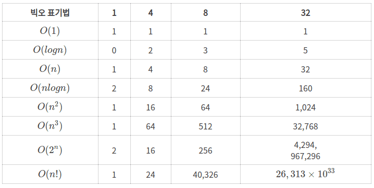

# 신입 개발자 인터뷰 대비 : 2. 알고리즘
## 알고리즘
- 시간 복잡도 O(N^2)의 정렬 알고리즘과 O(NlogN)의 정렬 알고리즘을 직무 언어로 모듈 없이 구현할수 있는가?
	- 기본적으로 시간 복잡도 N^2, NlogN인 정렬 알고리즘은 각각 버블 정렬 알고리즘, 퀵 정렬 알고리즘이다. 
	- 버블 정렬은 각 순회에서 가장 큰 요소를 배열 끝으로 이동시키는 방식으로 동작하고, 인접 요소를 계속 비교 및 스왑한다. 
	- 퀵 정렬은 분할 정복 전략을 사용하여 배열을 정렬한다. 기준점(피봇)을 선택하고 이 기준점 대비 작은 요소와 큰 요소를 좌우로 분할하고 각 부분을 재귀적으로 정렬한다. 
			- 버블 정렬 구현
		```java
			public class BubleSort {
				void bubleSort(int arr[]) {
					int n = arr.length;
					// 핵심적인 N^2 의 시간 복잡도는 이중 루프에서 발생한다. 
					for (int i = 0; i < n - 1; i++) {
						for (int j = 0; j < n - 1; j++) {
							if (arr[j] > arr[j + 1]) {
								int temp = arr[j];
								arr[j] = arr[j+1];
								arr[j+1] = temp;
							}
						}
					}
				}
		
				void printArray(int arr[]) {
					for (int i = 0; i < arr.length; i++)
						System.out.print(arr[i] + " ");
					System.out.println();
				}
		
				public static void main(String args[]) {
					BubleSort ob = new BubbleSort();
					int arr[] = {64, 34, 25, 12, 22, 11, 90};
					ob.bubbleSort(arr);
					System.out.println("Sorted array");
					ob.printArray(arr);
				}
			}
		```
	- 퀵 정렬 구현
		```java
			  public class QuickSort {
				  int partition(int arr[], int low, int high) {
					  int pivot = arr[high];
					  int i = low - 1;
					  for (int j = low; j < high; j++) {
						  if (arr[j] <= pivot) {
							  i++;
							  int temp = arr[i];
							  arr[i] = arr[j];
							  arr[j] = temp;
						  }
					  }
					  int temp = arr[i+1];
					  arr[i + 1] = arr[high];
					  arr[high] = temp;
					  
					  return i + 1;
				  }
				  
				  void sort(int arr[], int low, int high) {
					  if (low < high) {
						  int pi = partition(arr, low, high);
						  sort(arr, low, pi - 1);
						  sort(arr, pi + 1, high);
					  }
				  }
				  
				  static void printArray(int arr[]) {
					int n = arr.length;
					for (int i = 0; i < n; ++i)
						System.out.print(arr[i] + " ");
					System.out.println();
				  }
				  
				  public static void main(String args[]) {
					  int arr[] = {10, 7, 8, 9, 1, 5};
					  int n = arr.length;
					  
					  QuickSort ob = new QuickSort();
					  ob.sort(arr, 0, n - 1);
					  
					  System.out.println("sorted array");
					  printArray(arr);
				  }
			  }
		```
- 각 정렬 알고리즘의 Best와 Worst case 시간복잡도에 대해 알고, 각 특성을 설명할 수 있다. 
  
	- 버블 정렬 
		- 특성 :
			- 매우 직관적이고 간단한 정렬 방법
			- 인접한 두 원소 사이 검사를 통해 정렬을 진행하며, 정렬된 데이터를 다시 정렬 시 효과적이라는 장점이 있다. 
			- 그러나 대부분의 경우 다른 정렬에 비해 비효율적이다. 
		- Best Case 시간복잡도 : O(N)
			- 이미 정렬되어 있을 때, 버블 정렬은 최고의 속도를 낸다. 
			- 이 때는 내부 루프에서 스왑이 일어나지 않으므로, 각 요소는 한 번씩만 확인하면 되기 때문이다. 
			- 이때 중요한 것은 단순히 숫자 변화가 되어 있다! 가 아니라 정확하게 flag를 통해 변화 여부를 파악하는 기믹을 넣었을 때에 해당한다. 
			```java
			public class OptimizedBubbleSort {
				void bubbleSort(int arr[]) {
					int n = arr.length;
					boolean swapped;
					for (int i = 0; i < n - 1; i++) {
						swapped = false;
						for (int j = 0; j < n - i - 1; j++) {
							if (arr[j] > arr[j + 1]) {
								int temp = arr[j];
								arr[j] = arr[j + 1];
								arr[j + 1] = temp;
								swapped = true; // swap 발생 시 플래그 설정
							}
						}
						// 한번 패스에서 스왑이 없었다면, 배열은 이미 정렬 된거
						if (!swapped)
							break;
					}
				}
				
				// 나머지 부분은 기존의 버블 정렬과 동일하게 가져가도 된다. 
			}
			```
		- Worst Case 시간복잡도 : O(N^2)
			- 배열이 역순으로 정렬된 경우 최악의 시간복잡도를 보여준다. 
			- 각 요소가 다음 요소와 무조건 비교 및 스왑을 해야하기 때문이다. 
	- 퀵정렬
		- 특성 
			- 분할 정복 전략을 사용하는 만큼, 높은 효율의 정렬 알고리즘이다.
			- 전반적인 면에서 빠른 속도를 유지하고, 대규모 데이터 셋에서도 효과적이다. 
			- 하지만 피벗의 선택에 따라 성능이 크게 달라지고, 최악의 케이스도 생긴다는 점을 이해하고 있어야 한다. 
		- Best Case 시간복잡도 : O(NlogN)
			- 퀵 정렬은 각 분할이 균등하게 이루어진 경우에 효과적이다. 
			- 매번 피벗이 중앙값 근처로 선택되어 전체 배열을 균등하게 두 부분으로 나눌 때 최적의 성능을 보인다. 
		- Worst Case 시간복잡도 : O(N^2)
			- 피벗이 최솟값이나 최댓값으로 선택될 때 발생한다. 이러한 경우 분할 과정이 한 쪽에 치우쳐지고, 모든 요소를 바꿔야 하므로, 최악의 시간복잡도를 야기한다. 
	- 선택 정렬 
		- 특성 
			- 배열 전체의 가장 작은 요소를 찾아서 맨 앞으로 이동 시키고, 그 다음으로 작은 요소를 찾는 방식으로 정렬을 진행한다. 
			- 매우 직관적이며, 추가적인 메모리가 복잡하게 필요하지 않다. 
			- 그러나 대용량 데이터 양이 많아 질 수록 성능의 급격한 하락이 발생한다. 
		- Best Case 시간복잡도 : O(N^2)
			- 입력 데이터의 정렬 상태와 무관하게 항상 모든 요소를 검사, 최선, 평균, 최악 모두 동일한 시간복잡도를 가진다. 
		- Worst Case 시간복잡도 : O(N^2)
			- 입력 데이터의 정렬 상태와 무관하게 항상 모든 요소를 검사, 최선, 평균, 최악 모두 동일한 시간복잡도를 가진다.
	- 삽입 정렬
		- 특성 
			- 각 반복에서 하나의 입력 요소를 적절한 위치에 삽입하여, 배열을 부분적으로 정렬한다. 
			- 작은 데이터의 세트나 정령이 어느 정도 된 데이터에 대해서 빠르고, 안정적이게 정렬한다. 
		- Best Case 시간복잡도 : O(N)
			- 배열이 이미 정렬 되어 있을 때, 전체 배열을 
		- Worst Case 시간복잡도 : O(N^2)
			- 배열이 역순으로 정렬되어 있어서, 각 요소를 배열의 처음부터 그 위치까지 이동시켜야 하여서 최악의 케이스이다.
	- 병합 정렬
		- 특성 
			- 분할정복알고리즘을 사용하여 배열을 절반으로 나누고, 각 부분을 재귀적으로 정렬하고 다시 병합하는 구조를 가진다. 
			- 대규모 데이터 셋에 효과적이며, 안정적이다. 
			- 그러나 이러한 구조가 추가적인 메모리를 필요로 한다. 
		- Best Case 시간복잡도 : O(NlogN)
			- 배열을 분할하고 각 부분을 분할 및 병합하는데 필요한 로그 스케일의 단계를 거치다보니 일정한 시간복잡도를 요한다 .
		- Worst Case 시간복잡도 : O(NlogN)
			- 병합 정렬은 배열 초기 상태와 무관하게, Best와 동일하게 분할 및 병합 과정에서 필요한 시간으로 로그 스케일이 필요로 한다. 
	- 힙 정렬
		- 특성 
			- 힙 정렬은 이진 힙 자료구조를 사용하여 정렬을 수행하는 알고리즘이다.
			- 배열 내의 모든 요소를 힙으로 구성, 가장 큰 요소를 제거하고, 나머지 요소로 힙을 다시 구성하는 과정을 반복한다. 
			- 이때 추가 메모리 사용이 거의 없고, 최악에도 시간복잡도 로그 스케일을 유지한다. 
		- Best Case 시간복잡도 : O(NlogN)
		- Worst Case 시간복잡도 : O(NlogN)
	- 카운팅 정렬 
		- 특성 
			- 정렬할 요소의 범위가 제한적일때 사용하는 비교 기반 정렬 알고리즘이 아닌 방식이다. 
			- 각 숫자의 출현 횟수를 계산하고, 이를 바탕으로 각 숫자의 위치를 배열에 직접 배치한다. 
			- 정수나 일정 범위의 작은 숫자를 정렬할 때 매우 빠르고 효과적이다.
		- Best Case 시간복잡도 : O(n + k) k는 숫자 범위다. 
		- Worst Case 시간복잡도 : O(n + k)
	- 기수 정렬
		- 특성 
			- 각 자리수를 개별적으로 정렬하는 방식으로, 보통 최하위 자릿수부터 시작하여 최상위 자리수까지 차례로 정렬한다. 
			- 카운팅 정렬과 같은 안정적인 정렬을 사용하여 각 자릿수를 정렬한다. 
			- 기수 정렬은 숫자 범위가 클 때 카운팅 정렬 보단 효율적이다. 
		- Best Case 시간복잡도 : O(n * k)
		- Worst Case 시간복잡도 : O(n * k)
	- 버킷 정렬 
		- 특성 
			- 여러 버킷(또는 버블)을 분배하고, 각 버킷을 개별적으로 정렬한 후, 결과를 하나로 병합하는 방식이다. 
			- 데이터가 균등하게 분포된 경우 가장 잘 작동하고, 부동소수점 수를 정렬할 때 유용하다. 
		- Best Case 시간복잡도 : O(N + K)
		- Worst Case 시간복잡도 : O(N^2)
			- 버킷 내의 요소가 균등하게 분배되지 않은 경우 
	- LIS 알고리즘(Longest Increasing Subsequence)
		- 특성
			- 최장 증가 부분 수열을 발견하는 알고리즘이다 
			- 이 수열은 연속적일 필요는 없으며, 순서만 유지하면 된다. 
			- 동적 프로그래밍 방식 : 각 원소를 끝으로 하는 최장 증가 부분 수열의 길이를 찾는 방식
			- 이진 검색 방식 : 각 원소를 적절한 위치에 삽입하여 가장 긴 증가 부분 수열을 동적으로 구성한다. 
			- LIS 자체는 부분을 구하는 공식이므로, 다른 알고리즘과 효과적으로 조합하면 배열을 위한 알고리즘 등으로 활용이 가능하다. 
		- 동적 프로그래밍
			- Best Case : O(N^2)
			- Worst Case : O(N^2)
		- 이진 검색
			- Best Case : O(NlogN)
			- Worst Case : O(NlogN)
- 재귀에 대해 설명할 수 있다.
- BFS/ DFS에 대해 설명할 수 있다. 직무 언어로 해당 알고리즘을 구현할 수 있다. 
- 다익스트라, 프림, 플로이드-워셜, 벨만포드, 크루스칼 알고리즘 등 그래프에서 사용하는 알고리즘에 대해 알고 있는가?
- 코드를 보고 시간 복잡도를 계산할 수 있다. 

```toc

```
