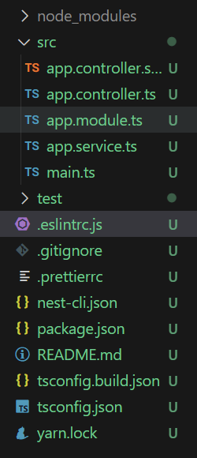
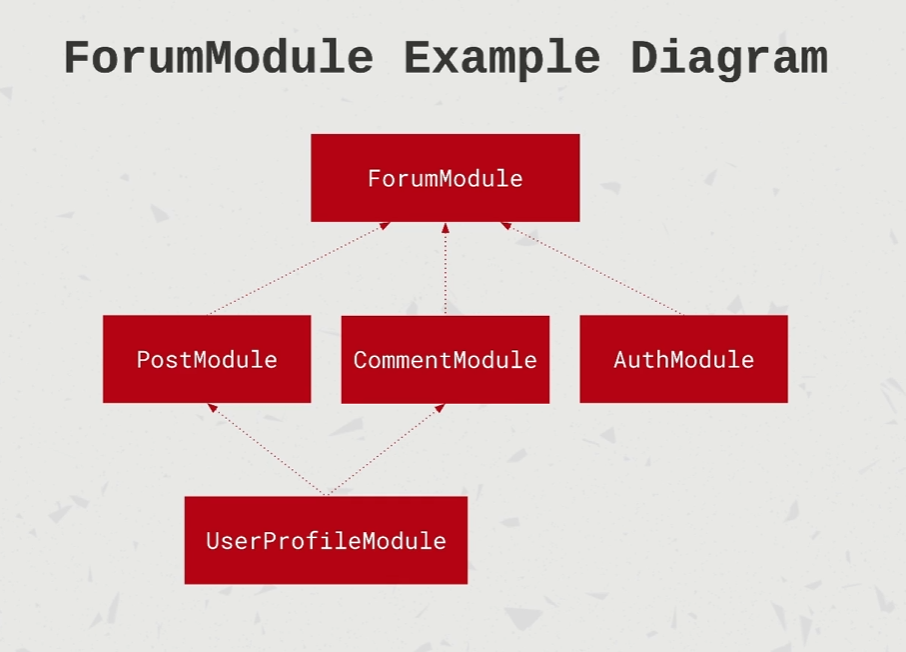
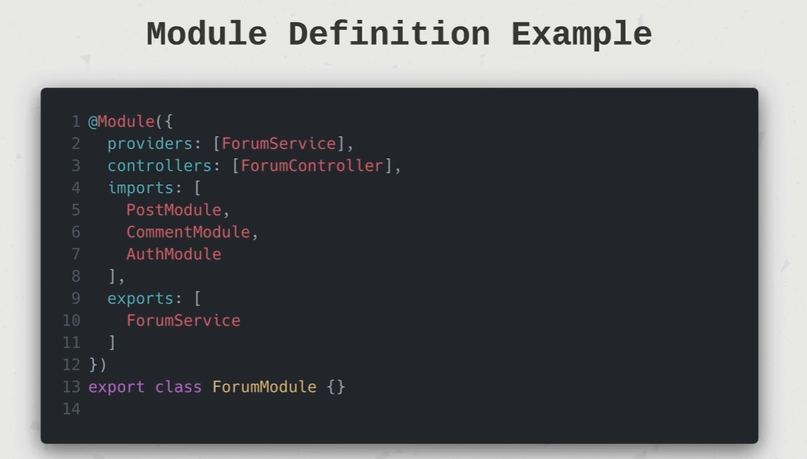
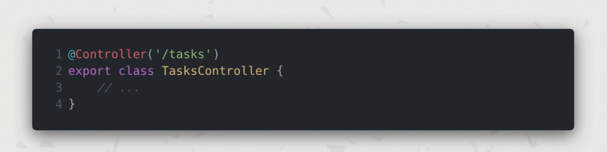
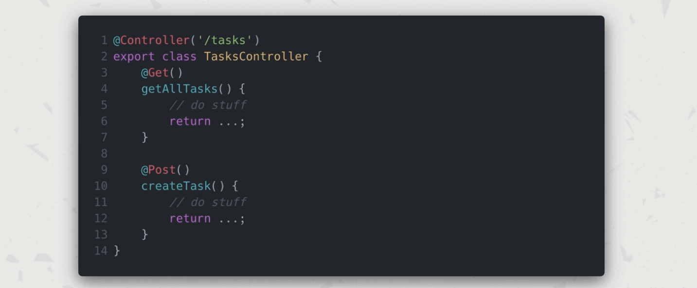
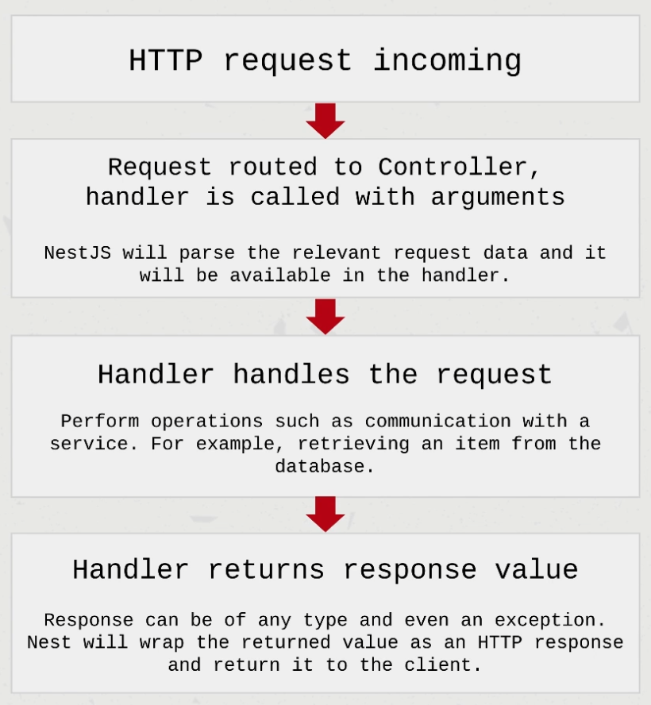
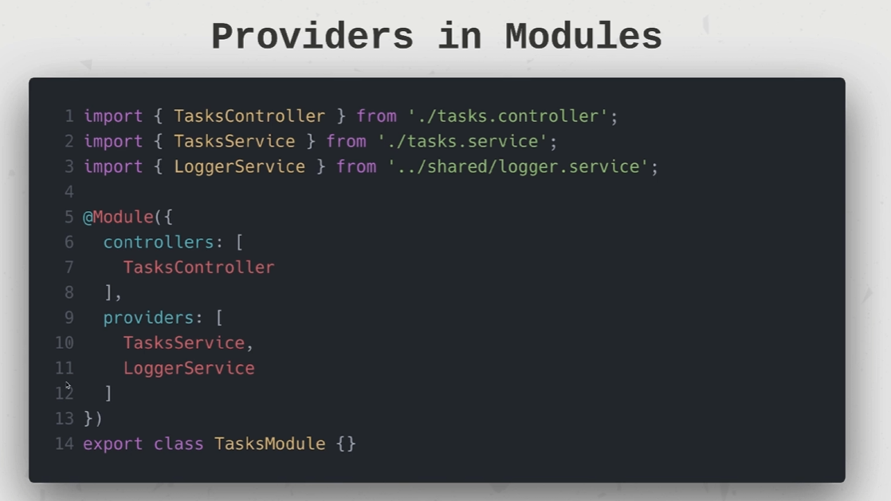

# NestJS Zero to Hero - Modern TypeScript Back-end Development
## 들어가면서 
들어가기로 확정된 회사에 대해, 기술 스택이 기존에 써봤던 nestJS 를 기반으로 한다기에 급하게, 아주 핵심만 정리하는 그런 학습이다. 인강을 기준으로, 필요한 내용이나, 핵심 위주만 정리를 할 예정이다. 

## Installation 
```shell
npm i -g @nestjs/cli
nest new project-name
```

### 주의 : 윈도우 권한 문제 발생 시 
[파워쉘 보안 정책 문제 해결](https://velog.io/@kwontae1313/%ED%8C%8C%EC%9B%8C%EC%89%98-%EB%B3%B4%EC%95%88-%EC%A0%95%EC%B1%85-%EB%AC%B8%EC%A0%9C%ED%95%B4%EA%B2%B0)  <- 이 내용을 통해 보안사항을 수정하면 해결된다. 
### npm vs yarn vs pnpm 
- npm, Yarn, pnpm은 모두 JavaScript 패키지 매니저로, 패키지 관리와 의존성 설치를 위한 도구입니다. 그러나 각각의 특징과 차이점이 있습니다.
	1. **속도 및 성능**
	   - **npm**: 기본적으로 속도가 느릴 수 있지만, 최근 버전에서는 속도가 많이 개선되었습니다.
	   - **Yarn**: 병렬 처리를 통해 속도가 빠르며, 캐시 시스템을 사용하여 재설치 시 더 빠른 성능을 제공합니다.
	   - **pnpm**: 하드 링크와 심볼릭 링크를 사용하여 디스크 공간을 절약하며, 설치 속도가 매우 빠릅니다.
	
	2. **디스크 사용량**
	   - **npm**: 각 프로젝트마다 전체 패키지를 설치하여 디스크 사용량이 많을 수 있습니다.
	   - **Yarn**: npm과 비슷하지만, Yarn v2에서는 PnP(Plug and Play) 모드를 도입하여 디스크 사용량을 줄일 수 있습니다.
	   - **pnpm**: 중앙 저장소에서 패키지를 공유하므로 디스크 사용량이 현저히 적습니다.
	
	3. **사용 편의성 및 추가 기능**
	   - **npm**: 가장 오래된 패키지 매니저로, 많은 튜토리얼과 문서가 존재합니다. `npx`를 통해 CLI 도구를 실행할 수 있는 기능이 있습니다.
	   - **Yarn**: 빠른 속도와 더불어 워크스페이스 기능을 통해 모노레포(monorepo)를 쉽게 관리할 수 있습니다.
	   - **pnpm**: 여러 프로젝트 간에 패키지를 효율적으로 공유하고, 일관된 설치 방식으로 의존성 문제를 줄일 수 있습니다.
## 프로젝트 내부 구성

- `.eslint.js` : 개발 과정에서 특정 룰을 포함하는 코드의 유지보수성을 도와주는 역할을 한다. 
- `.prettierrc` : 해당 파일은 팀 안에서 개발자들이 코드의 형태를 유지하는데 도움을 준다. 
- `nest-cli.json` : 네스트 프로젝트에 특정 설정을 추가하거나 덮어씌우는 용도이다. 
- `package.json` : 어떤 노드 프로젝트나 이 파일을 갖고 있으며, npm, yarn 을 활용하여 관리한다. 메타 데이터를 포함해, CLI, 의존성 등을 기록하고 있다. 
- `tsconfig.json` : 타입스크립트 프로젝트에 타입스크립트 컴파일과 관련된 설정 내용을 포함하고 있다. 
- `tsconfig.build.json` : 프로덕션 수준으로 빌드를 하는 경우, 일부 파일이나 폴더를 배제할 수도 있고, 결과적으로 더 작은 번들 사이즈로 구성을 할 수 있다. 즉, 프로덕션 수준에서의 설정들을 따로 지정해두는 용도로 사용한다. 
- `\src\`  : 실제 코드들이 담기는 공간. 
	- main.ts : 부트스트랩이 작동되는 파일 
	- app.module.ts : 파일들이 의존성으로 구동되기 위한 가장 앞 단 
	- 그 외의 파일들 : 루트 단에 특정 기능이 구현된다면 필요하겠지만, 모듈들을 따로 만든다면 필요 없다. 
- `\test\` : 테스트 코드들이 담기는 공간. 
## NestJS Module 
- 모듈이란 
	- 각 애플리케이션은 최소 하나 이상의 모듈을 가지고 있다. 루트 모듈은 어플리케이션의 스타팅 포인트 역할을 한다. 
	- 모듈들은 예를 들어 기능 별, 능력의 집합과 연관이 있는 컴포넌트들을 조직화하는 효과적인 방식이다. 
	- 모듈 당 폴더를 구성하는 것, 모듈의 컴포넌트들을 컨테이너화 하는 것은 좋은 습관이다. 
	- 모듈은 '싱글 톤'이다. 그러므로 모듈은 다른 복수의 모듈에 의해 import 될 수 있다. 
- 모듈 정의 내리기 
	- 모듈은 어노테이션 `@Module` 데코레이터를 붙인 클래스에서 정의되어 진다. 
	- 데코레이터는 Nest가 어플리케이션의 구조를 조직화하기 위해 사용되는 메타데이터를 제공해준다. 
- @Module 데코레이터의 프로퍼티들 
	- providers : 의존성 주입에 의해 모듈 안에 이용 가능한 프로바이더들의 배열 
	- controllers : 모듈 안에서 인스턴스화 되는 컨트롤러들의 배열 
	- exports : 다른 모듈로 export 되는 프로바이더들의 배열 
	- imports  : 모듈에 의해 필요시 되는 모듈의 리스트. 어떠한 exported 된 프로바이더들은 의존성 주입에 의해 우리의 모듈 안에 이용 가능 하다.



## Making new Module
- 모듈 만들기 - CLI 에서... 
```shell
nest g module {name}
```

## NestJS Controllers 
- request 를 받아 처리하여  response 를 클라이언트에게 반환한다. 
- 특정 경로를 책임진다. 
- 핸들러를 포함하는데, 엔드포인트, 그리고 요청 메서드들이다. 
- 동일한 모듈 안에 프로바이더를 소비함에 대한 의존성 주입에서 어드벤티지를 갖고 있다
- 컨트롤러란? 
	- `@Controller` 데코레이터를 붙인 클래스다 
	
- handler 란?
	- request 메서드이름의 데코레이터를 붙인 클래스라고 보면된다. `@Get`, `@Post`, `@Delete`
	
- nestJS 서버의 구동 과정 
	
## Making new Controller 
```shell
nest g controller tasks --no-spec
```
- 테스트 파일의 경우 매우 중요하지만, 당장은 배울 상황이 아니므로 스킵하기에 flag 옵션으로 `--no-spec` 을 붙여라 

## NestJS Providers
- `@Injectable` 데코레이터를 가지고 있다면, 생성자를 향해 의존성 주입을 통해 주입 될 수 있다.
- 프로바이더는 순수한 값, 클래스, sync/async 펙토리 등 다양한 것들이 될 수 있다. 
- 프로바이더들은 모듈들이 사용 가능하게 제공되어야 한다. 
- 모듈에서 exported 되어서 다른 모듈에서 imported 되어야 한다. 

### Service 란 무엇인가?
- 프로바이더로 지정될 수 있으나, 모든 프로바이더가 서비스는 아니다. 
- 서비스 라는 개념은 소프트웨어 개발 안에서 흔한 컨셉이다. 
- `@Injectable()` 데코레이터에 의해 감싸진 싱글톤이자 모듈에 제공된다. 이는 싱글톤디자인 패턴을 따르며, 같은 인스턴스가 어플리케이션의 행위를 넘나들며 공유된다. 
- 비즈니스 로직의 메인 소스로, 예를 들어 서비스는 컨트롤러로 부터 호출되어, 데이터의 유효성을 보고, 데이터베이스의 아이템을 생성하고, response 를 반환한다. 

### NestJS에서의 의존성 주입(Dependency Injection)이란?
- NestJS 의 생태계 안에 존재하는 어떤 컴포넌트도, `@Injectable` 데코레이터가 달려 있는 프로바이더가 될 수 있다. 
- 클래스의 생성자 안에 의존성을 저의할 수 있으며, NestJS 는 우리를 위해 알아서 이러한 의존성의 주입을 관리해주며, 이러한 의존성 주입된 것들은 클래스의 속성으로서 이용이 가능해진다. 
```ts
import { TaskService } from './task.service';

@Controller('/tasks')
export class TasksController {
	constructor(private taskServce: TaskService) {}

	@Get()
	async getAllTasks() {
		return await this.taskService.getAllTasks();
	}
}
```

---
# 그냥 마무리 짓기 뻘줌하니 적어보는 후기
1. 오랜만에 타입스크립트를 사용해보니 42서울 마지막 과제를 할 때가 생각나 기억이 새록새록 난다. 
2. 그때는 왜 굳이 이런 구조지? 하고 생각 했던 게 있는데 지금 생각하니 자바스크립트와 타입스크립트의 언어적 특성, 클래스에 대한 접근 방식이나 철학이 달랐던 것이 그대로 녹아 있다는 것을 깨닫고 약간 소름 돋았다.
3. 이거 언제 끝내냐 .... 흑흑 빨리 9시간짜리 날 잡고 봐야겠다. 


```toc

```
