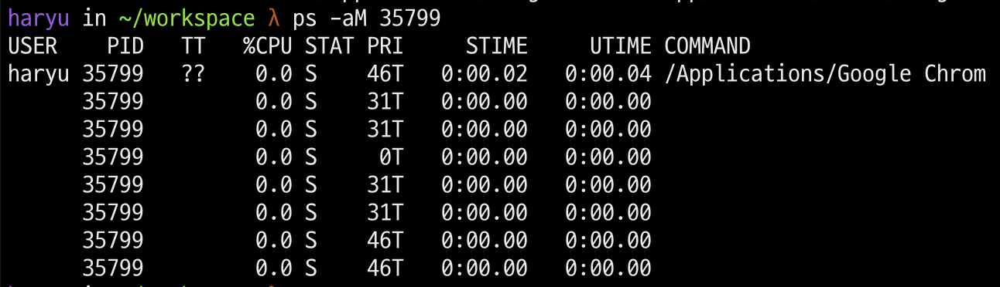

# 프롤로그

## CS 공부를 확신하다

CS 공부를 할 때마다 굉장한 불안감을 안고 있었다. 어딜 가도 CS 학습보단 급급하게 문제를 풀어나가고 만들기에 바쁘단 생각이 앞섰다. 42서울에서 학습을 해나가면서, 그런 사람들의 이야기를 들을 때면 인터뷰를 한다거나, 실제 현업에서 고생하는 사람들의 이야기는 다소 신빙성이 떨어지는 듯, 보일 때가 많았다.

현업에 계신 분들은 CS를 채워야 하는것이 가장 힘들고 곤욕스럽다고 한다. 그럼에도 온갖 미디어에서나, 42에서 취업에 열중인 이들은 컴퓨터를 이해하기보단, 컴퓨터로 무언가를 시키기에 바쁜 모습. 그리고 거기서 나는 어느 흐름을 타야 하느라 걱정되었다.

하지만 CSAPP 교재를 1독을 끝을 내고, 과제를 하나씩 하나씩 해결해나가면서 드는 느낌은 사뭇 내 불안이 확신이 되게 만드는 과정이었다고 생각한다.

컴퓨터는 최첨단을 달리는 존재이고, 그런 바탕에서 눈 한번 깜빡하고 젖힐 때, 놀라울 정도로 그 다음 영역으로 성장하고 있는 것이 느껴진다. 그리고 그런 상황에서 당연히 레거시 한 것이 가지는 의미란 ? 그렇게 중요하지 않게 느껴지는 것도 어쩔 수 없다고 생각된다.

하지만 CS를 배워야 하는 이유를 여기 저기 드문드문 이야기 하는 이유는 분명하다고 느껴졌다. CS라고 하는 것이 가지는 가장 큰 의미는 '문제 해결능력'에서 가지는 확고한 지지기반이었다.

C를 기반으로 짜여진 현재의 대부분의 OS와, 그 OS의 기반 언어에서 더 편하게, 더 빠르게, 더 세밀하게를 추구하는 과정에서 파생된 다양한 언어와 툴들은 자기 나름의 능력을 갖추고 있긴 하지만, 결과적으로 모든 컴파일 과정이나 인터프리팅 과정을 거치고 나면 기계어로 번역된다. 그리고 그 0과 1의, 바이너리의 세상에서 CPU 는 자의식을 가지지 못한채 본인에게 주어진일들을 수행하고 있기에, 문제가 생기면 이는 우리가 알아내고, '느껴'야 하며 그럴 때 사람이 왜 컴퓨터 보다 뛰어난지를 알 수 있으리라 생각했다.

여튼.. 잡설이 길었지만 CS를 학습한다는 것이 학습의 이해도와 문제 해결능력을 월등히 키워준다고 느꼈다. 그것이 미니쉘을 만들면서 내가 얻은 결론이었고, 현재 과제들을 하나씩 해결해나가는 내 수준을 만들었다고 생각이 들었다. 비전공자임에도 불구하고 가능했던 이유. 가장 빠른 영역에서 가장 느리게 동작하는 무언가가 중요할 줄이야.. 라는 생각도 든다.

그리하여 CSAPP는 마무리를 지었다. 물론 아직 완벽하진 않다. 다시 읽어야 할 것으로 판단되고, 이는 자격증을 마치면 해볼 생각이다. 그러나 그보다 앞서 이제는 새로우면서도 가장 이해도가 높아야 하는 영역을 찾게 되었다. 그것은 바로 Operating System, 소위 운영체제라고 하는 것이다.

## 운영체제는 왜 중요할까?

운영체제는 틀이었다. CSAPP를 통해 배우면서, 시스템의 구조는 어떤지, 실제 운영체제가 파일이라고 하는 단위를 어떻게 읽는지를 이해했을 때, OS를 지배하는 것이 곧 컴퓨터 전체를 지배하는 것이며, 이는 현재 전세계를 뒤덮은 거대 IT 업체들이 매년 수백, 수십조의 단위로 R&D에 돈을 드리 붓는 이유라고 생각했다. 물론, 내가 가고 싶은 회사들을 생각하면 더더욱 필요하다고 느끼고도 있기 때문이다.

운영체제의 구조를 이해함은, 어떤 종류의 디바이스이든 그 디바이스가 무얼 할 수 있고, 무얼 활용 가능한지를 보여주는 부분이라 생각한다. 하물며 빠르지만 성능이 좋게, 성능이 좋으면서도 안정적이게 만든다는 것은 그만큼 중요한게 아니겠는가? 개발자의 덕목이라고 생각되는 그것을 이해하기 위해 운영체제에 대한 이해는 필수라고 생각된다.

## 무엇을 할까

사실 운영체제 학습에 대하여, 처음 강조를 받은 것은 지금은 자리를 내려놓으신 전 42서울의 총장님의 말씀에서였다. CSAPP가 다분히 하드웨어적인 컴퓨터에 좀더 집중했다고 한다면, 컴퓨터의 영혼에 가까운 운영체제에 대한 이해는 내가 컴퓨터를 가지고 할 수 있는일을 확장시키는 아주 좋은 수단이라고 말씀해주셨다. 거기다 한 술 더 나아가 운영체제를 만들어보라는(!) 이야기까지 하셨다.

처음에는 과연 그게 맞나..? 라는 생각도 들었다. 하지만 그분의 말도 일리는 분명 있었다. 어차피 운영체제라는 것은 작동하는 매우 정교한 기계이다. 기계를 다루지 않고, 설명서만 봐서는 기계를 온전히 이해하지 못한다. 하물며 스마트폰이나, 노트북과 같은 기기들을 보면 그렇다. 내부 작동 방식이나, 설계, 그리고 그 설계에서 사용된 부품 하나하나를 이해할 때마다 왜 이 제품이 이정도 수준의 역할만 하거나, 소비자가 왜 만족하지 못하는지를 이해하는게 가능해진다. 운영체제는 심지어 그런 상황에서 작동 방식의 차이나, 심지어 그 영향에서 오는 신기한 문제점(?) 들이 있는데 이는 만들어보지 않고는 경험할 수 없다는 것이 그분의 설명이었다.

생각해보면 그렇다. 이는 어플리케이션 수준의 프로그램에서도 동일한데, 예를 들면 인터넷 익스플로러와 크롬에 대한 이야기를 해볼 수가 있다. 인터넷 익스플로러는 과거 국내의 원탑을 찍었던 인터넷 브라우저이자, 맥을 쓸 때 가장 불편함을 만드는 ActiveX의 원동력 같은 놈이었다. 그리고 그 뒤 구글이 혜성처럼 크롬 브라우저를 만들어네고, 월등한 성능과 안정성을 보여주면서 이젠 크롬 천하가 되어버린 상태다.

그런데 여기서 두 프로그램은 같은 목적을 가지지만 설계사상이 매우 달랐다고 한다. 인터넷 익스플로러는 기본적으로 멀티스레드로 구현이 되어 있었으며, 이는 개발 편의성이나, 메모리 자원에서의 효율성은 좋은 구조로 설계되어 있었다. 그러나 이에 비해 멀티스레드 특성상 스레드가 자원을 공유하고 있고, 한 스레드에서 문제가 발생하면 이 문제로 인해 생기는 데이터 레이스 문제, 데드락 문제등이 발생할 수 밖에 없었고, 이는 다시 말해 웹 환경에서 한 탭이 문제가 생기면 모두가 뻗어버리는 문제를 갖고 있음을 의미한다. 거기다 컴퓨터는 온전하게 데이터 공유 상황에서 생기는 문제를 '완벽하게' 해결하지 못한 상태이다.

이에 반해 크롬은 멀티 프로세스 형태로 구성되어 있다고 한다. 이는 비슷하면서도 아주 큰 차이를 갖고 있는데, 우선 프로세스가 독립적이므로 각 공간은 독립된 메모리 공간을 확보하고, 상호 배제되는 것이 보여진다. 거기다 스레드간에 컨텍스트 스위칭은 오버헤드가 적은 만큼 서로 영향을 받기 쉽지만, 프로세스 스위칭은 각 프로세스로의 전환은 느릴지 몰라도, 한 프로세스가 CPU를 점유할 때 스케쥴링 상에서 더 많은 자원과 연산 집중의 효과가 있다. 즉 그만큼 하나의 페이지 안에서의 프로세싱은 빠르다는 점이다. 따라서 하나의 프로세스가 에러가 발생해도 다른 탭은 살아 있고, 영향을 덜 받으며 동시에 빠르다는 장점을 갖고 있다. 그러나 동시에 프로세스 단위로 쪼개진다는 것은 그만큼 무겁다는 것이고 (각각의 가상 메모리 공간이 할당되니까) 그러다보니 크롬이라는 프로그램이 가지는 별명 '램처묵처묵' 이 왜 붙었는지도 이해할 수 있다.



굉장히 긴 사견이었는데, 어쨌든 NCLC의 시대, 나 역시 살아남고 싶고 전문가가 되고 싶다. 그리고 기본적으로 재미가 있다는 점에서 OS 관련되서는 좀더 진득하게 보려고 한다.

## 향후 계획

전 총장님의 말씀에 힘입어, C++ 를 활용한 국내 유일하게 한 권 운영체제를 만드는 교재가 있었다. 리눅스 마스터 2급, 웹 스터디가 어느정도 정돈이 되면, 그때는 해당 교재를 가지고 혼자 하든 같이 하든 실습형태로 진행해보려고 한다. 하지만 당장은 개념을 빠르게 훑는 것도 중요해 보이기에 `OSTEP` 이라고 불리는 교재를 해보고자 한다.

[Operating Systems: Three Easy Pieces](https://pages.cs.wisc.edu/~remzi/OSTEP/)

본 교재는 일단 원서이기도 하고, 기존의 유명한 다른 교재들은 너무 내용이 얕거나 부족한 실습 파트가 있었기에 해당 교재를 선택했다.

앞으로 매주 화요일에는 정독하고 정리하는데로 바로 블로그에 해당 내용중 핵심을 업로드 하면 어떤가 생각하고 있다.

## 결론...

뭔가 서론이 겁나게 길었지만, 여하튼 운영체제 공부도 다시 해보려고 한다. C++ 언어도 해야 하지만, 확실히 내실을 다질 수 있었던 CS 학습 놓치기엔 너무 아깝다. CSAPP를 할 때는 워낙 정신도 없고, 모르는 것들을 억지로 삼키느라 그거에만 몰두할 수 밖에 없었지만, 이번에는 좀더 여유를 가지고 학습을 진행해보자...!

```toc

```
