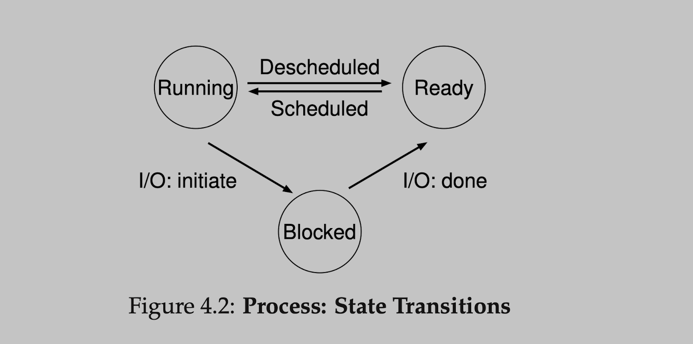
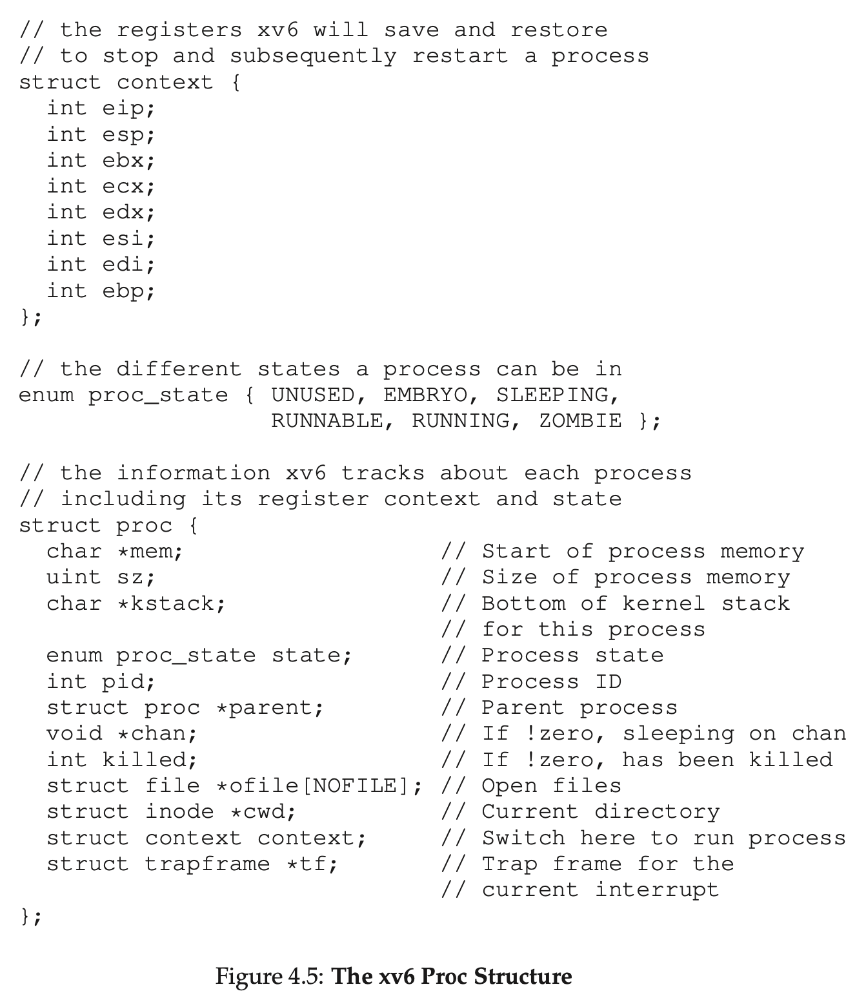
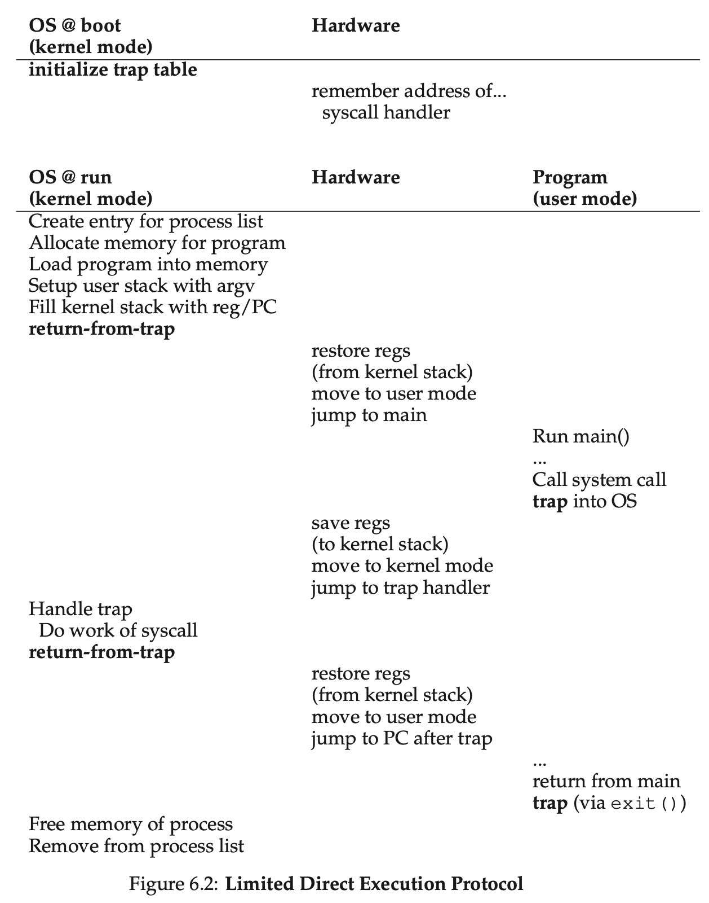
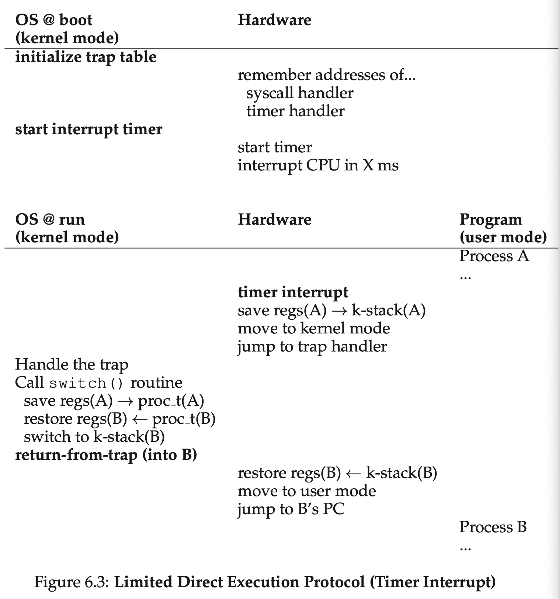

> 본 내용은 OSTEP 의 내용을 정리 및 요약한 내용입니다.
> 전문은 [이 곳](https://pages.cs.wisc.edu/~remzi/OSTEP/)을 방문하시면 보실 수 있습니다.

# 3 A Dialogue on Virtualization

# 4 The Abstraction: The Process

- 본 챕터에서 학습할 내용은 운영체제가 사용자에게 제공하는 가장 근본적인 추상화 개념 중 하나인 프로세스 이다.
- 프로세스<sup>Process</sup> : 실행중인 프로그램
  - 프로그램<sup>Program</sup> : 디스크 상에 저장된 명령어의 덩어리로, 어떤 명령을 행하기 전 상태. 운영체제의해 변환되어 프로그램은 유용한 형태의 실행중인 대상으로 바뀌게 된다.
- 일단 하나의 프로그램 이상을 실행시킬 사람들은 종종 원한다. 그렇기에 실제로 전형적인 시스템들은 겉 보기엔 동시에 수백개의 프로세스들을 가동시키는 것처럼 보인다.
  <span style="background-color: grey; display:block; padding : 10px; font-weight:500; border-radius: 10px;" width="1vw;">문제의 핵심<br>어떻게 하면 많은 CPU들이 있는 화상을 제공할 수 있을까?<br>비록 물리적 이용가능한 연산장치는 몇개 없다하더라도, 어떻게 운영체제는 CPU들이 거의 무한대의 작업을 지원하는 듯한 환상을 보이게 만들수 있을까?</span>
- 운영체제는 이러한 환상을 CPU를 '가상화'함으로써 창조해 낸다. 하나의 프로세스를 동작함으로써, 그 뒤에 이를 멈추고 또 다른 프로세스를 실행시킨다. 이를 반복하면서 환상을 만들어내는 것이다.
- 이러한 형태의 가장 기본적인 기술이 바로 `time sharing`이다.
- time sharing : CPU의 시간 공유란 사용자가 다수의 동시 프로세스들을 그들이 원하는데로 실행키는 걸 가능케 하는 기술이다.
  - 이것을 가능케 하기 위해 아주 저급의 기계장치 `mechanism` 들을 활용한다.
  - 메커니즘 : 낮은 수준의 방법 혹은 프로토콜로 필요시 되는 기능성의 조각조각의 구현물 이라고 보면 된다. (context switch 등)
- 이러한 메커니즘의 기반으로 운영체제 상에 몇가지 영리한 것들이 올라가 있는데, 이는 `정책`이라는 형태를 하고 있다.
  - 정책<sup>policy / policies</sup> : 정책이란 일종에 운영체제 내에서 결정하는 것에 관한 알고리즘을 말한다.
  - 대표적으로 스케쥴링 정책등은 운영체제에서 어떤 프로그램을 먼저 실행할 것인지 등을 결정하는 알고리즘이다. 이 밖에도 워크로드 날리지, 성능 메트릭스 등도 운영체제의 결정 메커니즘에 포함된다.

## 4. 1 The Abstraction: A Process

- 프로세스가 무엇으로 구성되어 있는지를 이해하기 위해, 우리는 `기계상태`<sup>machine state</sup>를 이해해야 한다.
- 프로세스를 구성하는 하나의 기계 상태 구성요소는 바로 메모리다.
  - 명령어들이 메모리 상에 나열 된다.
  - 실행중인 프로그램의 데이터를 읽고 쓰기를 하면서 메모리에 나열한다.
  - 그래서 프로세스가 가리킬수 있는 메모리 공간은 프로세스의 일부라고 할 수 있으며, 그렇기에 주소 공간<sub>address space</sub> 이라고 불린다.
- 또 다른 하나는 바로 레지스터 이다.
  - 많은 명령어들은 명시적으로 레지스터를 읽거나, 갱신한다. 그래서 명확하게 프로세스의 실행 관하여 레지스터는 중요한 역항르 갖고 있다.
  - 주목할 점은 특수한 레지스터들이다.
    - Program Counter : 명령어 포인터, IP 라고도 불리며 이 레지스터는 프로그램의 어느 명령어를 다음에 실행시키면 되는지를 설명해준다.
    - Stack Pointer & frame pointer : 이 두 레지스터는 함수 인자들, 지역변수, 반환 주소등이 담겨져 있고, 이를 관리한다.
- 마지막으로 프로그램들은 종종 영구적 저장장치에도 종종 접근한다. 그러한 I/O Information 은 최근에 열린 프로세스 파일들의 리스트를 포함할 것이다.

<span style="background-color: grey; display:block; padding : 10px; font-weight:500; border-radius: 10px;" width="1vw;">Tip : 구분된 정책 그리고 메커니즘 <br>많은 운영체제들 속에서 공통적인 디자인 패러다임은 바로 그들의 낮은 수준의 메커니즘에서부터 구분된 높은 수준의 정책들이다. 메커니즘이란 시스템에 관한 어떤 질문의 답을 제공해주는 역할을 한다. 예를 들면 어떻게 운영체제는 컨텍스트 스위치를 실행하는가? 이에 대해 정책<sup>policy</sup>은 질문에 답변을 해준다. 또한 어느 프로세스들이 운영체제에서 지금 당장 실행되어야 하는가? 둘을 분리하는 것은 메커니즘을 다시 생각할 필요 없이 쉽게 정책을 변경할 수 있으므로 일반적인 소프트웨어 설계 원칙인 모듈화의 한 형태를 나타낸다.</span>

## 4. 2 Process API

- API 들은 특정 형태로 현대적 운영체제 상에서 사용이 가능하다.
  - Create : 운영체제는 반드시 새로운 프로세스를 만들 방법을 포함해야 한다.
  - Destroy : 프로세스 생성을 위한 인터페이스가 있듯이, 운영체제는 프로세스를 강제적으로 파괴하는 인터페이스 역시 제공해야한다. 일반적으로 프로세스는 사용 후 종료 되지만 사용자는 사용 중에 프로세스를 죽이길 원할 때도 있을 수 있다. 그렇기에 프로세스의 진행 도중에 중지하는 인터페이스는 매우 유용하다.
  - Wait : 일종의 대기 인터페이스는 종종 제공된다.
  - Miscellaneous Control : 프로세스를 죽이거나, 기다리고 있는 것 외에도, 가능하다면 다른 프로세스가 특정 프로세스를 제어하게 만드는 경우도 있다.
  - Status : 프로세스에 관한 상태 정보를 취득하는 인터페이스도 보통 존재한다.

## 4.3 Process Creation: A Little More Detail

- 프로그램은 어떻게 프로세스로 변환될까? 본 챕터는 이에 대한 내용을 담고 있다.
  - 가장 먼저 운영체제는 프로그램을 실행시키기 위하여 로드<sup>load</sup> 작업을 진행하여, 프로그램의 코드와 정적인 데이터들을 메모리로 불러온다.
  - 프로그램은 초기에 디스크 상에 저장되어 있으며, 이는 어떤 형태든지 `실행 가능한 포맷`<sup>executable format </sup>을 띠고 있다.
  - 이 작업으로 운영체제는 디스크 상에서 데이터들을 읽어 들일 수 있으며 메모리 어딘가에 둔다.
  - 초기에는 이러한 프로세스의 로딩 작업이 `열정적`으로 진행되었으나, 현재에 와서는 매우 `느린` 로딩 수행 방식으로 바뀌었다. 이는 프로그램 실행 중에 필요한 부분만 그때그때 불러들인다는 것을 의미한다.
  - 얼마나 게으른 방식의 로딩으로 코드와 데이터의 조각을 읽어들이는 지를 제대로 이해하기 위해, 당신은 `paging`과 `swapig` 기법에 대해 이해해야 한다. 이는 메모리 가상화 부분에서 더 세부적으로 다룰 것이다.
- 일단 코드와 정적 데이터들이 메모리 상에 올라가면, 몇 단계의 준비 작업이 추가로 필요하다. 우선 일부 메모리는 반드시 프로그램의 런타임 스택<sup>run-time stack</sup> 또는 쉽게 스택이라고 부르는 구조를 할당해서 만들어야 한다. 운영체제는 또한 스택을 초기화 하며, 특히 main() 함수에 인자들을 채워 넣을 것이다.
- 운영체제는 또한 일부 메모리는 heap 영역을 위하여 할당을 한다.
- 그 다음으로 초기화 하는 작업으로는 입출력과 연관된 부분들을 초기화 한다.
- 정리하면,
  - 코드, 정적 데이터를 메모리로 불러오고
  - 스택을 생성및 초기화 하고,
  - 입출력과 관련된 작업을 준비하면 운영체제는 드디어 프로그램을 실행시킬 단계에 올라서게 된다.
  - 프로그램 시작을 위해, 엔트리 포인트부터 명령어를 실행하는데 이 부분의 이름이 바로 main() 이다. 운영체제는 CPU의 제어 권한을 새로이 생성된 프로세스에게 전달하고, 프로그램은 실행되는 것이다.

## 4.4 Process States

- 프로세스 상태, 프로세스는 여러 상태들 사이 중 하나에 속할 수 있고, 이는 초창기 컴퓨터 시스템에서 나타났다.
  - Running : 실행중인 상태.
  - Ready : 프로세스가 실행 될 준비는 마쳤으나, 어떤 이유로 운영체제가 실행하지 않고 있는 상태
  - Blocked : 프로세스에 대해 운영체제가 다른 이벤트 발생 전까지 실행할 준비가 안된 상태로 만들어 둔 상태



- ready 상태에서 running 상태로 전환하는 것을, 프로세스가 **scheduled** 되었다 라고 이야기 하며, running 상태에서 ready 상태로 전환되는 것을 **descheduled**되었다고 말한다.
- 입출력을 요청할 때 CPU가 이용되지 않고, 이러한 상황에서 다른 프로세스에게 해야할 결정하는 것을 **OS scheduler**라고 부른다.

## 4.5 Data Structures

- 운영체제 역시 프로그램들처럼, 다양한 관련된 정보의 단편들을 추적하기 위한 핵심 데이터 구조체를 가지고 있다. 각 프로세스의 상태를 추적하기 위해 프로세스 리스트를 갖고 있다거나, 이에 대한 현재 실행중인 경우 추가적인 정보를 갖고 있다거나 하는 식이다.
- 당연히 blocked 된 프로세스에 대해서도 어떻게서든지 추적이 되고 있어야 하는데, 운영체제에서 갖고 있는 방식은 다음 처럼 보여진다.



- 위의 예시는 xv6 커널 상에서 각 프로세스를 추적하기 위해 OS가 필요로 하는 정보들이 무슨 타입인지를 보여준다.
- 위의 예시에서 프로세스에 관하여 OS가 추적하는 정보의 단편들은 **register context**가 쥐고 있으며, 프로세스가 멈출때 그것의 레지스터들이 메모리 장소를 기억하고 있다가, 레지스터를 복구함으로써 OS 는 실행중인 프로세스를 재시작 하게 만들 있다. 이것을 **context switch**<sup>컨텍스트 스위치</sup>라고 부른다.
- 프로세스의 상태는 enum 형태로 저장되는데, 여기서 마지막 Zombie 라고 하는 것은, 프로세스가 존재는 하지만, 아징 정리되진 못하는 경우를 의미한다.
- parent 프로세스가 종료 되었을 때 wait 등으로 마지막 호출을 진행시켜 child 를 호출하고, 자식이 종료하면, 이를 OS에게 알려 Zombie 가 되는 것을 막을 수 있다.

<div style=“margin:10px;”>
<h3 style="display:inline-box; background-color:#9b9600; padding:10px 10px 5px 10px; border-radius:10px 10px 0 0; margin: 0px; color:white;">💡 핵심 프로세스 용어 </h3>
<div style="display:box; background-color:#fffa7f; margin: 0px; padding: 10 10 5 10; color:black; border-radius: 0 0 10px 10px;">
<ul>
<li>프로세스 : 프로그램이 실행되는 것을 OS 단에 추상화 시킨 형태. 해당 개념에는 그것의 주소 공간에 있으며, CPU 레지스터의 컨텐츠, 입출력과 관련된 정보들을 담고 있다(PC, 스택 포인터 등등)</li>
<li>프로세스 API : 프로세스와 관련된 일들을 수행하는 호출 함수들을 포함한다. 보통 프로세스의 생성과 소멸, 그리고 다른 유용한 호출 함수들이 포함된다.</li>
<li>프로세스 상태<sup>Process state</sup> : 프로세스의 상태를 담고 있으며 여기에는 running, ready, blocked, Zombie 를 포함한다.</li>
<li>프로세스 리스트 : 시스템 상에서 모든 프로세스의 정보를 담고 있는 리스트를 말하며, 각 엔트리들은 PCB<sup>process control block</sup>이라고 불리며, 구체적인 프로세스에관한 정보들이 담겨진 구조체들이다.</li>
</ul>
</div>
</div>

# 5 Interlude: Process API

- 이 파트에서는 보다 시스템에서 실천적 측면을 볼 것이다. 시스템 API 등이 이러한 것중 하나다. `fork()`, `exec()`, `wait()` 등이 있다.

> 핵심은 어떻게 프로세스를 '만들고', '제어하는가'이다.<br>
> OS 들은 어떤 인터페이스들을 프로세스 생성과 제어하는가?

## 5.1 The fork() System Call

```c
#include <stdio.h>
#include <stdlib.h>
#include <unistd.h>

int main (int arg, char *argv []) {
	printf ("hello world (pid:§d) In", (int) getpid());
	int rc = fork ();
	if (rc < 0) {
		//fork failed
		fprintf (stderr, "fork failed\n");
		exit (1);
	}
	else if (rc == 0) {
		// 자식프로세스(복사된 프로세스)
		printf ("hello, I am child (pid:%d) In", (int) getpid ());
	}
	else {
		// 부모프로세스
		printf ("hello, I am parent of %d (pid:%d) In", rc, (int) getpid ());
	}
	return 0;
}
```

```shell
prompt> ./p1
hello world (pid:29146)
hello, I am parent of 29147 (pid:29146)
hello, I am child (pid:29147)
prompt>
```

- 해당 방식으로 부모-자식 프로세스 두개가 생기게 된다. 그리고 이경우 각각 활성화된 프로세들은 알아서 동작하게 된다. 그래서 결과물을 보면, 처음엔 부모가 먼저 자신의 pid를 출력하고 자식이 pid를 출력한다. 하지만 다시 실행시켜보면 정 반대의 경우가 발생한다.
- 이러한 경우를 우리는 `비결정성`<sup>nondeterminism</sup> 이라고 부른다. 이러한 상황은 멀티-쓰레드 프로그램<sup>multi-threaded programs</sup> 에서도 동일하게 발생한다.
- 더 나아가서 이러한 상황은, 동시성<sup>concurrency</sup> 파트를 공부할 때도 나오게 되는 개념이다.

## 5.2 The wait() System Call

- 비결정성을 해결하면서도, 자식프로세스가 먼저 진행되고 그것을 부모가 기다리도록 만드는 방법으로 사용된다. 다음 예시는 이러한 결정성을 보여준다.

```c
#include <stdio.h>
#include <stdlib.h>
#include <unistd.h>
#include <sys/wait.h>
int main (int argo, char *argv []) {
	printf ("hello world (pid:%d) In", (int) getpid());
	int rc = fork () ;
	if (rc < 0) {
		// fork failed; exit
		fprintf (stderr, "fork failed\n");
		exit (1);
	} else if (rc == 0) {
		// child (new process)
		printf ("hello, I am child (pid:%d) In", (int) getpid());
	} else {
		// parent goes down this path (main)
		int rc_wait = wait(NULL) ;
		print ("hello, I am parent of id (rc_wait:%d) (pid:%d) In", rc, rc_wait, (int) getpid ());
	}
	return 0;
}
```

- 위 코드를 통해 결정성이 확보된다. 위의 예시의 경우 부모에서 wait() 시스템 콜을 통해 부모는 자식 프로세스가 커널을 거쳐 종료되는 것에 대한 시그널을 한번 보내기 전까지 멈춰있게 되기에 결과물은 항상 자식이 먼저 출력하고, 이후에 부모가 출력하는 결과물을 만들게 된다.

## 5.3 Finally, The exec() System Call

```c
#include <stdio.h>
#include <stdlib.h>
#include <unistd.h>
#include <string.h>
#include <sys/wait.h>

int main(int argc, char *argv[]) {
	printf("hello wolrd (pid:%d)\n", (int)getpid());
	int rc = fork();
	if (rc < 0) {
		fprintf(stderr, "fork failed\n"); // fork 에러 발생 시
		exit(1);
	}
	else if (rc == 0) {
		// child
		printf("hello, I am child (pid:%d)\n", (int) getpid());
		char *myargs[3];
		myargs[0] = strdup("wc"); // 프로그램 "Wc"
		myargs[1] = strdup("p3.c"); // 인자로 제공할 파일 명
		myargs[2] = NULL; // 배열 끝 표현
		execvp(myargs[0], myargs); // 프로그램 자식에서 실행
		printf("this shouldn't print out\n");
	}
	else {
		// parent
		int rc_wait = wait(NULL);
		printf("hello, I am parent of %d (rc_wait : %d) (pid:%d)\n", rc, rc_wait, (int) getpid());
	}
	return (0);
}
```

```shell
prompt> ./p3
hello world (pid:29383)
hello, I am child (pid:29384)
      29     107    1030 p3.c
hello, I am parent of 29384 (rc_wait:29384) (pid:29383)
prompt>
```

- execve 계열 함수들은 자식 프로세스에서 실행되게 되었을 때, 실행 가능한 파일 및 인자들을 가지고 자식 프로세스의 코드(와 정적 데이터)를 실행파일에서 읽어서, 현재 프로세서의 code segment(와 현재 static data) 위치에 덮어씌워 버린다. 그리곤 힙이나 스택 영역도 대 초기화가 이루어지면서 새로운 프로그램이 실행되게 된다.

## 5.4 why? Motivating The API

- 이러한 구조를 바라보다보면, 왜 우리가 이런 희안한 인터페이스적 순서를 가지고 다른 프로세스를 만들어야 하는지 의구심이 들 것이다.
- 이러한 형태는 UNIX 쉘에서부터 비롯된 구분인데, 이러한 구성으로 되어 있어서 프로세스의 생성 - 이후 프로그램 실행의 구조(for() - execve()) 는 여러가지 기능적 흥미로운 특성을 제공해주기 때문이다.
- fork()와 exec()의 분리는 여러가지 유용한 기능들을 제공한다. 예를 들면 다음과 같다. <br>
  `prompt> wc p3.c > newfile.txt`<br>
  이러한 예시의 경우 프로그램 wc 의 출력이 리다이렉션되어 `newfile.txt` 에 저장되도록 되어 있는 경우를 들 수 있다. 표준 입출력을 쉘이 닫고, `newfile.txt`를 열어서 해당 출력 스트림으로 연결을 해주게 된다.

## 5.5 Process Control And Users

- 기본적인 fork(), exec(), wait() 을 넘어서서 더 편리하고 흥미로운 인터페이스들도 존재한다.
- kill() : 커널을 통해 시그널을 프로세스로 전달하는 기능을 가진다. 전체 시그널 하위 시스템은 프로세스들에 대한 굉장히 다양한 외부 이벤트를 전달할 수 있고, 개별 프로세스 뿐 아니라 전체 프로세스 그룹에게도 전달이 가능하다.
- signal() : kill() 에서 보낸 시그널을 받는 역할을 한다.
- 단 일반적으로 다수의 사용자가 동일한 시간대에 동일한 시스템 상에서 사용이 이루어질 때, 임의의 시그널을 보낸다면 이는 문제가 될 수 있다. 따라서 현대의 OS 체계는 강력한 `user`의 개념을 도입했다.
- 사용자가 패스워드를 통해 권한이 증명이 되면, 이제 시스템 자원에 접근 및 사용이 가능하도록 되어있다.

## 5.6 Useful Tools

- 각종 리눅스 커맨드들을 도구로 설명해준다.

## 5.7 Summary

<div style=“margin:10px;”>
<h3 style="display:inline-box; background-color:#9b9600; padding:10px 10px 5px 10px; border-radius:10px 10px 0 0; margin: 0px; color:white;">💡 핵심 프로세스 API 용어 </h3>
<div style="display:box; background-color:#fffa7f; margin: 0px; padding: 10 10 5 10; color:black; border-radius: 0 0 10px 10px;">
<ul>
<li>process ID(PID)</li>
<li>fork()</li>
<li>wait()</li>
<li>exec()</li>
<li>shell의 프로그램 실행의 과정에서의 분리는 왜? : 입출력의 리다이렉션<sup>redirection</sup>을 위함, pipes를 활용하거나 다른 좋은 기능으로 그 사이사이 환경을 수정 하는 것도 가능하다.</li>
<li>Sginals : 프로세스를 제어하기 위하여 사용하는 개념이며 이를 제어하는 kill(), signal()과 같은 시스템 콜 함수가 존재한다.</li>
<li>user : user 개념의 도입으로 개별 사람의 권한을 만들고 이로써 프로세스 제어의 기준을 세웠다.</li>
<li>superuser : </li>
</ul>
</div>
</div>

# 6 Mechanism: Limited Direct Execution

CPU를 가상화 하기 위하여, 운영체제는 어떻게든지 물리적 CPU를 다양한 일들 사이에서 동시에 동작하는 것처럼 만들기 위하여 분배할 필요가 있다.

가장 기초적 아이디어는 하나의 작업을 약간 작업하거, 그 다음 다른 것을 하는 방식이고, 이러한 방식인 CPU **time sharing** 을 통해 가상화를 만들어낼 수 있습니다.

여기서 몇가지 주요한 핵심 포인트가 있다.

- performance : 어떻게 가상화를 구현한 상태로 과도한 오버헤드가 없는 시스템을 구현하는 것이 가능할까?
- control : 어떻게 run 프로세스를 효율적으로 제어할 수 있을까?

제어를 하면서도 높은 성능을 얻는 것은 운영체제를 빌드하는데 핵심적 문제가 된다.

## 6.1 Basic Technique: Limited Direct Execution

- 기본적으로 운영체제 개발자들은 가장 빠르게 프로그램을 구동시키기 위해서 기초적인 기술로 **limited direct execution**이라고 부른다.
- 여기서 direct excution 이라고 함은, 단순하게 CPU 상에서 프로그램을 직접 바로 실행시키는 구조를 의미한다.
- 해당 형태의 전략의 protocol은 다음처럼 볼 수 있다.

<table>
<th><big>OS</big></th>
<th><big>Program</big></th>
<tr>
	<td>Create entry for process list</td>
	<td></td>
</tr>
<tr>
	<td>Allocate memory for program</td>
	<td></td>
</tr>
<tr>
	<td>Load program into memory</td>
	<td></td>
</tr>
<tr>
	<td>Set up stack with argc/ argv</td>
	<td></td>
</tr>
<tr>
	<td>Clear registers</td>
	<td></td>
</tr>
<tr>
	<td>Execute call main()</td>
	<td></td>
</tr>
<tr>
	<td></td>
	<td>Run main()</td>
</tr>
<tr>
	<td></td>
	<td>...</td>
</tr>
<tr>
	<td></td>
	<td>Execute return from main</td>
</tr>
<tr>
	<td>Free memory of process</td>
	<td></td>
</tr>
<tr>
	<td>Remove from process list</td>
	<td></td>
</tr>
<caption>Figure 6.1 : Direct Execution Protocol (without Limits)</caption>
</table>

- 위의 표를 통해 구동의 방식을 이해할 수 있으며 매우 직관적이다. 하지만 이러한 직관성으로 CPU 가상화 부분에서 몇가지 문제점이 발생된다.

  - 프로그램을 실행한다고 하면, 운영체제는 어떻게 프로그램이 아무것도 하지 않는다고 확신할 수 있을까?
  - 프로세스를 실행할 때, 운영체제가 어떻게 실행중인 프로세스를 멈추고, 또 다른 프로세스로 스위치할 수 있을까? 그래서 CPU 가상화를 위하여 우리가 요구하는 time sharing 을 구현할 수 있을까?

- 따라서 이러한 문제를 위해 어떻게 풀어나가는지, 그리고 어디서 limits 라는 키워드를 넣어서 구현이 되는지를 볼 것이다.

## 6.2 Problem #1: Restricted Operations

- 직접적인 실행(Direct execution)은 명확하게 빠르다는 이점을 갖고 있다.
- 하지만, 만약 프로세스가 몇가지 제한된 작업을 수행하길 원한다면 어떨까. 예를 들어 입출력을 요청하거나, CPU 혹은 메모리의 추가 시스템 자원을 요청하는 등을 말이다.

> **핵심 : 어떻게 Restricted 동작을 수행할 수 있을까?** > <br>
> 프로세스는 반드시 입출력을 수행할 수 있어야 하고 다른 제한된 작업도 가능해야한다. <br>
> 하지만 동시에 시스템에 걸쳐 완전한 제어권을 제공하는 것은 없어야 한다. <br>
> 어떻게 운영체제와 하드웨어어는 그렇게 일할 수 있을까? <br>

- 첫 번째 접근 방법은 단순히 어떤 프로세스가 입출력에서 무엇을 원하든, 다른 관련된 작업을 하도록 하는 것이지만, 이 경우 요구하는 다양한 종류의 시스템의 구현이 제한이 된다. 예를 들어 파일 시스템에서 접근 전 권한을 요구하는 시스템을 만들 때 어떤 유저 프로세스든 디스크 입출력을 하도록 한다면, 프로세스는 아주 쉽게 전체 디스크를 읽고 쓰기가 되지만, 동시에 보호라는 기능성을 소실하게 된다.
- 이러한 상황을 위해 `사용자모드`<sup>user mode</sup> 라는 것과 `커널 모드`<sup>kernel mode</sup>라는 것을 구현하였다.
- 하지만 이것으로도 언제 몇 가지 특권적 작업을 수행하기를 원할 때가 있을 때 사용자 모드에서도 수행을 위해 현대의 하드웨어는 `system call`이라는 것으로 기능을 사용 가능하도록 만들었다.
- system call 을 실행하기 위해, 프로그램은 반드시 `trap` 명령어를 실행해야 하며, 이와 동시에 커널안으로 들어가, 높아진 권한 상태의 커널모드로 권한이 상승한다. 그 뒤 커널은 요구 되는 작업을 진행하며 마무리 됨과 함께 운영체제는 특수한 `return-from-trap` 명령어를 호출하고, 이에 따라 권한 레벨이 커널 모드에서 사용자모드로 내려가게 된다.
- 여기서 trap을 실행하는데 주의 깊게 봐야 하는 점은, 하드웨어가 현재 실행중인 프로그램의 상태로 정확히 돌아오기 위해 호출자의 레지스터들을 충붆히 저장해놓는게 확실하게 되어 있는지를, 컴퓨터 하드웨어는 신경쓸 필요가 생깁니다.
- 이러한 지점에서 아직 중요한 디테일이 남아 있다. OS 내에서 trap은 어느 코드를 실행시켜야 할지 아는 걸까? : 명백히 호출하는 프로세스는 어떤 주소로 점프를 해야할지 특정할 수 없고, 그렇게해서 프로그램에게 어디든 커널의 위치로 정확히 가도록 만드는 아이디어는 매우 안좋은 아이디어다. 따라서 커널은 trap을 진행함게 있어 어느 코드를 실행하는지 제어를 신중히 해야만 한다.
- 따라서 이를 위하여 부팅을 하는 시기에 커널은 `trap table` 을 세팅해두고, 이렇게 함은 비정상적 이벤트 발생 시에 어떤 코드를 실행시킬지 하드웨어에게 이야기 해 주는 형태를 띈다.



- 위의 사진을 찬찬히 뜯어보면 제한된 지정된 명령 수행의 프로토콜이 어떤식으로 동작하는지를 보여준다.
- 또한 정확한 시스템 콜을 특정하기 위해, `system-call number` 가 각 시스템 콜에 할당되어 있다. 이는 운영체제가 trap handler 내부에서 시스템 콜을 다룰 때, 숫자들을 활용해 유효한 trap인지를 확인하며, 대응하는 code를 실행시킨다. 이러한 간접적인 방식은 일종의 '보호'<sup>protection</sup>의 역할을 한다. 사용자 코드가 숫자를 통해 특정 서비스를 요청함으로써 정확하게 어떤 위치로 이동하는지를 특정하지 못하게 하는 역할을 한다.
  81

## 6.3 Problem #2: Switching Between Processes

- 직접 실행 방식의 다음 문제는 프로세스 간의 스위칭에 있다.

- 프로세스 사이에서 스위치하여 다른일을 하는 것 자체가 어렵진 않을 것이다. 하지만 간단하게 그렇게 간단해 보이는 이유는 뭘까.

- 엄밀히 말하면 프로세스가 실행되는 동안, 운영체제는 실행 중이지 아닌 것으로 볼 수 있다. 실제로 이부분이 이론적으로 보이고 철학적 이야기 같지만 실제 문제다.

<span style="background-color: grey; display:block; padding : 10px; font-weight:500; border-radius: 10px;" width="1vw;">핵심 키워드 : CPU의 제어권을 어떻게 다시 얻을 수 있을까? <br>운영체제는 어떻게 다시 CPU의 제어권을 얻어서 프로세스 사이에 스위치를 실행할 수 있을까?</span>

### **A Cooperative Approach: Wait For System Calls**

> 협조적인 접근법 : 시스템 콜을 위해 기다리기

<p></p>
- 이 방법은 상당히 과거의 시스템에서 사용되는 방식으로, 운영체제는 시스템의 프로세스들을 믿고, 합리적으로 행동하도록 짜여져 있다. 길게 동작중인 프로세스가 있으면, 프로세스들이 정기적으로 제어권을 포기하도록 되어 있고, 그래서 운영체제가 다른 작업을 선택해서 동작하도록 결정하는 방식을 말한다.

- 그래서 협력적인 스케쥴링 시스템에서는, 운영체제는 시스템 콜을 기다리거나, 불법적인 작업이 발생해 trap 등이 발생하는 순간 CPU의 제어권을 운영체제가 재획득하는 구조로 되어 있다고 보면 된다.

- 이러한 접근법은 당연히 수동적인 접근법이며, 이상적이지 못하다고 볼 수 있다. 또한 프로그램이 무한 루프에 빠져 있다고 한다면 시스템콜이 결코 일어나지 않고 운영체제 시스템 자체에 영향을 줄 수 밖에 없다.

### **A Non-Cooperative Approach: The OS Takes Control**

> 비 협조적 접근법 : 제어권 탈취 방법

<p></p>

- 하드웨어의 추가적 도움 없이, 운영체제는 시스템 콜을 호출하기를 거부하는 프로세스가 있을 때 할 수 있는 일이 많지 않다. 이는 제어권의 환수도 안된다는 것을 의미한다.

- 협조적 접근법의 경우 무한 루프 등에 빠지기라도 한다면 고전적인 특효법인 재부팅(...) 을 해야만 한다. 그래서 이러한 문제에서 핵심 하부 문제가 발생하고, CPU 제어권을 얻을 새로운 방법이 필요해진다.

<span style="background-color: grey; display:block; padding : 10px; font-weight:500; border-radius: 10px;" width="1vw;">핵심 키워드 : CPU의 제어권을 협조성을 바라지 않고도 얻을 수 있는 방법은? <br>어떻게 운영체제는 프로세스가 협조적이지 않더라도 제어권을 가져올 수 있을까?</span>

<p></p>

- 이러한 질문에 대해 수년간의 연구 속에서 나온 대안은 다음과 같다. : `타이머 인터럽트`<sup>timer interrupt</sup>

- 시간을 재는 장치는 모든 밀리 세컨즈 마다 인터럽트를 발생시키도록 프로그래밍 되어 있으며, 인터럽트가 발생했을 때 최근의 동작 중이던 프로세스는 중지가 되고, 사전에 설정된 `인터럽트 처리기`<sup>interrupt handler</sup>가 동작하게 된다.

- 이전 시스템 콜에 대한 이야기를 했던 때처럼 운영체제는 반드시 발생한 인터럽트일 때 어떤 코드를 수행하도록 하드웨어에 알려야 하며, 따라서 부팅 타임에 이를 지정하듯, 동시에 부팅 시점에 타이머를 시작하게 되고, 일단 시작하게 되면 운영체제는 제어권에 대한 반환에 대해 안전한 상태가 되게 된다. 이로써 사용자의 프로그램을 실행하는데 어떠한 문제도 없이 되는 것이다.

- 이때 기억할 것은 인터럽트가 발생하게 되면, 당연히 특정 프로그램의 상태를 충분히 기억해둬야할 책임이 하드웨어가 가지게 되고, 정확하게 실행중인 프로그램의 상태로 되돌릴 수 있도록 하부 return-from-trap 명령이 준비 되어 있어야 한다.

### **Saving and Restoring Context**

> 컨텍스트의 저장과 복원

<p></p>

- 현재 실행중인 프로세스를 계속 실행, 혹은 다른 프로세스로 전환을 결정해야하고, 이 결정을 하는 것이 운영체제의 `스케줄러`<sup>scheduler</sup>라고 한다.
- 프로세스를 중단하고, 새로운 프로세스를 실행한다면, 이때 운영체제는 `문맥교환`<sup>context switch</sup> 코드를 실행하게 된다.
- context switch : 원리는 실행 중인 프로세스의 레지스터 값들을 커널 스택 같은 곳에 저장하고 새로 실행될 프로세스의 커널 스택에서 레지스터 값을 복원하는 것이다. 이때 운영체제는 `return-from-trap` 명령어가 마지막으로 실행될 때 현재 실행중이던 프로세스를 리턴하는 것이 아닌, 다른 프로세스를 리턴하는 방식으로 구현된다.
- 이와 관련된 내용은 다음 사진을 참고하자.



- 기억 할 것은 컨텍스트의 전환 과정에서 두 가지 다른 종류의 레지스터 저장/ 복원이 발생한다는 것이다.
- 첫 번째, 타이머 인터럽트가 발생할 때 일어나며, CPU 권한을 운영체제가 가져간다.
- 두 번째, 지금 운영체제가 컨텍스트 스위칭을 위해 A, B 프로세스 사이에서 전환 과정에서 일어나는 것을 말한다.

<span style="background-color: grey; display:block; padding : 10px; font-weight:500; border-radius: 10px;" width="1vw;">타이머 인터럽트를 권한 재획득을 위해 사용한다.<br>타이머 인터럽트의 추가는 운영체제가 비록 프로세스들이 비협력적인 접근법을 수행하더라도 CPU 상에서 실행할 권한을 다시 받도록 만들어주고, 그래서 이 하드웨어 기능은 기기의 제어권한을 운영체제가 유지하도록 돕는 필수이다. </span>

## 6.4 Worried About Concurrency?

- 인터럽트나 트랩을 처리하는 도중에 다른 인터럽트가 발생할 때는 세심한 주의가 필요하다.
- 운영체제가 인터럽트를 처리하는 동안 인터럽트를 불능화시켜서 막아 버리는 방법도 있다.
- 그러나 이러한 방법은 '손실되는' 인터럽트가 생기기 쉽고, 바람직한 방법은 아니다.
- 이에 운영체제 자체에서 내부 자료구조가 동시에 접근 되는 것을 방지하는 **락** 기법을 개발했고, 이를 통해 커널 내부에서 다수 작업을 오류 없이 동시 진행하는 것을 가능케 했다. 이에 대한 부분은 동시성 파트에서 자세히 볼 것이고, 락이 존재하지만 오히려 이를 통해 문제점이나 버그도 발생한다.

<span style="background-color: grey; display:block; padding : 10px; font-weight:500; border-radius: 10px;" width="1vw;">컨텍스트 스위치 하는데 얼마나 걸리는가?<br>시스템 콜 처리 소요 시간을 확인하는 측정 도구로 lmbench(MS96)이라는 도구가 있다. 현대의 시스템에서는 자릿수가 달라질 정도로 성능이 좋아져서 2 ~ 3Ghz 프로세서의 경우 1마이크로초 미만이 소요된다. 그러나 CPU 성능 만이 전부가 아니라서 Ousterhout가 발견한 것처럼 메모리접근 연산이나 대역폭 등의 향상이 프로세서 수준으로 성장이 되지 못해 기대한 만큼의 속도가 나오지 않기도 하다.</span>

## 6.5 Summary

- CPU 가상화를 실현하는 핵심 기법은 **제한적 직접 실행**이라고 통칭한다. 기본 아이디어는 하드웨어를 적절히 설정, 프로세스가 할 수 있는 작업을 제한하고, 중요한 작업을 실행할 때는 반드시 운영체제를 거치도록 한다.
- 운영체제는 CPU 사용에 대한 적절한 안전 장치를 제공한다. 부팅시 트랩 핸들러 함수를 셋업하고, 인터럽트 타이머를 시작시키고 그런 후에 제한된 모드에서만 프로세스가 실행되도록 한다.
- 운영체제는 프로그램이 특별한 연산(Priviliged Instruction)을 수행할 때 혹은 어떤 프로세스가 CPU 를 독점하고 있어, CPU를 강제로 다른 프로세스에게 전환할 때에만 개입한다.

<div style=“margin:10px;”>
<h3 style="display:inline-box; background-color:#9b9600; padding:10px 10px 5px 10px; border-radius:10px 10px 0 0; margin: 0px; color:white;">💡 핵심 CPU 가상화 용어 </h3>
<div style="display:box; background-color:#fffa7f; margin: 0px; padding: 10 10 5 10; color:black; border-radius: 0 0 10px 10px;">
<ul>
<li>사용자모드, 커널모드</li>
<li>시스템 콜</li>
<li>트랩 테이블</li>
<li>return-from-trap</li>
<li>제한적 직접 실행 방식</li>
<li>제한적 직접 실행 방식</li>
<li>타이머 인터럽트</li>
<li>비협조적 방식</li>
<li>컨텍스트 스위치</li>
</ul>
</div>
</div>

```toc

```
