> 본 내용은 OSTEP 의 내용을 정리 및 요약한 내용입니다.
> 전문은 [이 곳](https://pages.cs.wisc.edu/~remzi/OSTEP/)을 방문하시면 보실 수 있습니다.

# 7. Scheduling : Introduction

- 스케줄링 정책 (scheduling policy) 이라는 것은 원칙 (discipline)이라고도 하며, 오랜시간 개발되어왔다. 초기에 생산 관리 분야에서 어떻게 효과적이고 효율적으로 할지에 대한 방법론적 문제가 존재해왔고, 그것이 컴퓨터라는 영역에서도 연결되어 왔다고 생각하면 된다.

<span style="background-color: grey; display:block; padding : 10px; font-weight:500; border-radius: 10px;" width="1vw;">핵심 질문 : 스케줄링 정책은 어떻게 개발하는가<br>스케줄링 정책을 하기 위한 기본적인 프레임워크는 어떻게 만드는가, 어떤 가정과 어떤 기준으로 정책의 평가가 일어나는가? 초기의 기법들은 무엇이 있을까?</span>

## 7.1 워크로드에 대한 가정

- 워크로드 (workload) : 프로세스가 동작하는 일련의 행위
- 적절한 워크로드의 선정이, 스케줄링 정책 개발에 매우 중요한 부분이다. 시스템에서 실행 중인 프로세스 혹은 작업(job) 에 대해 다음과 같은 가정을 한다.

> 1. 모든 작업은 같은 시간 동안 실행된다.
> 2. 모든 작업은 동시에 도착한다.
> 3. 작업은 일단 시작하면 최종적으로 종료될 때까지 실행된다.
> 4. 모든 작업은 CPU 만 사용한다.(입출력 수행 안 함)
> 5. 각 작업의 실행 시간은 사전에 알려져 있다.

## 7.2 스케줄링의 평가 항목

- 워크로드에 대한 가정 이외에 스케줄링 정책의 평가를 위해 **스케줄링 평가 항목** (scehduling metric)을 결정해야 한다.
- 평가기준은 다음과 같다.
  - 반환시간 (turnaround time) : 작업이 완료된 시각에서 작업이 도착한 시각을 뺀 시간이다. 성능적 측면의 평가 기준이다. <br><div style="text-align:center">T(turnaround) = T(completion) - T(arrival)</div>
  - 공정성 (fairness) : 대표적인 예시로 **Jain's Fairness Index**라는 지표가 있다.

## 7.3 선입선출

- **선입선출(First In First Out, FIFO)/선도착선처리(First Come Served, FCFS)**스케줄링 : 단순하고 구현하기 쉽다.
- 위의 예시를 간단하게 만들면 아래와 같은 이미지가 나오게 된다.

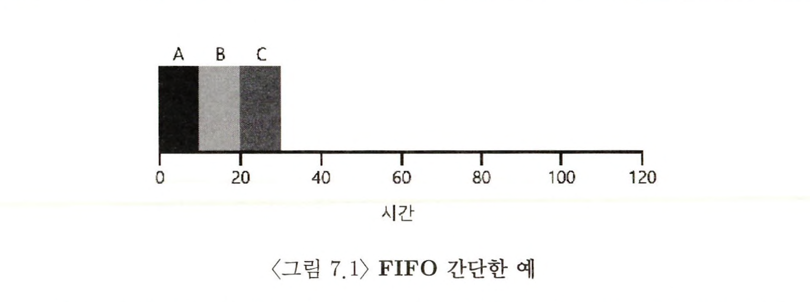

- 그림 7.1에서 A는 10, B는 20, C는 30에 종료되며, 세 작업의 평균 반환시간은 `(10 + 20 + 30) / 3 = 20`이다.
- 그런데 FIFO 스케줄링이 어떤 문제를 야기하는지는 다음 예시를 보자.

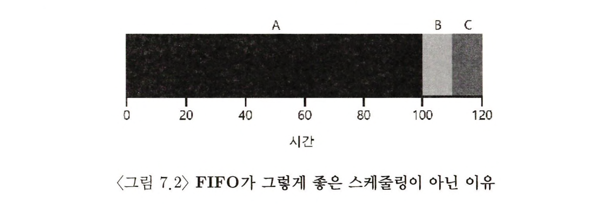

- 7.2 를 보면 문제가 보이는 것이 보인다. **convoy effect**라고 부르며, CPU를 많이 필요로 하지 않은 프로세스가 다른 작업이 끝나기를 기다리다 보니 결국 해야할 일은 적은데도 기다리는 시간이 길어지게 된다.
- 결과적으로 위의 이미지를 보면 `(100 + 110 + 120) / 3 = 110`이 된다.

## 7.4 최단 작업 우선

- 앞서 설명한 부분의 문제, **convoy effect**문제는 간단히 해결할 수 있다. 기본 아이디어는 오퍼레이션 리서치 분야에서 개발된 방식이다.
- **최단 작업 우선** (Shortest Job First, SJF) : 가장 짧은 실행 시간을 가진 작업을 먼저 실행 시킨다.

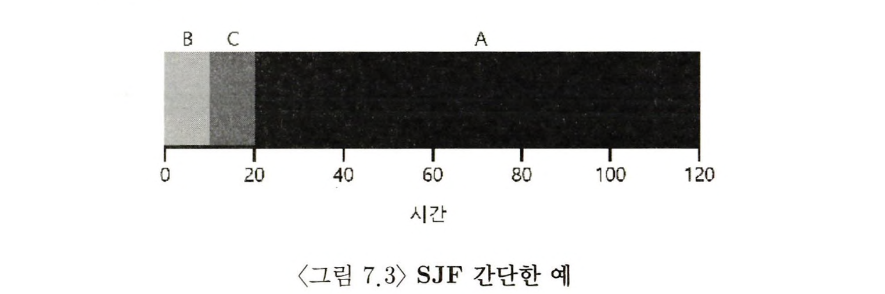

- 위의 경우 `(10 + 20 + 120) / 3 = 50`로, 위에서 보여준 convoy effect 가 있던 FIFO의 문제 케이스에 비해 2배이상 성능을 향상 시켰다.
- 이렇듯 이상적 상황에서 , 모든 작업이 동시 도착 하면 SJF 는 최적의 스케줄링 알고리즘이다. 하지만 위에서 가정한 2번 가정을 완화해보면 문제가 발생한다.

> 모든 작업은 동시에 도착하지 않고, 임의의 시간에 도착한다.

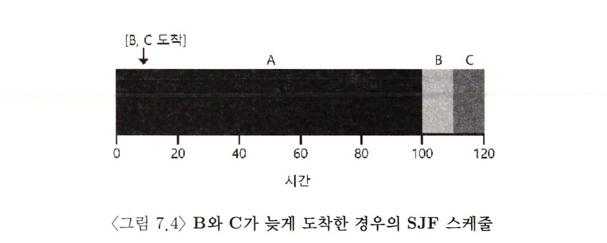

- 위의 예시의 경우 그렇다. B, C가 도착을 대략 10에 하게 되면, A는 이미 도착을 해서 진행중이기에, 결국 평균 반환시간은 `(100 + (110 - 10) + (120 - 10))/3 = 103.333` 이 나오게 된다.

## 7.5 최소 잔여시간 우선

- 7.4 에서 보여준 방식에서 생기는 문제를 해결하려면, 위에서 지정했던 가정 3번을 완화시키고, 타이머 인터럽트를 발생시켜, 컨텍스트 스위칭이 진행되어야 한다.

> "3. 작업은 일단 시작하면 최종적으로 종료될 때까지 실행된다."

- 진행 중이던 작업 A를 **중지**하고 새로이 도착한 B나 C를 실행하기로 결정할 수 있고, 이는 기존 SJF가 **비선점형** 스케줄러와 대비된다.
- 이렇듯 SJF 방식에 선점 기능을 추가한 스케줄러가 **최단 잔여시간 우선** (Shortest Time-to-Completion First, STCF) 또는 선점형 최단 작업 우선(PSJF) 라는 스케줄러이다.
- STCF는 현재 실행중인 작업의 잔여실행 시간과 새로운 작업의 잔여 실행시간을 비교한다. 잔여 실행 시간이 가장 작은 작업을 우선적으로 스케줄링하게 된다. 따라서 이러한 방식으로 된 그래프를 보면 다음처럼 보이게 된다.

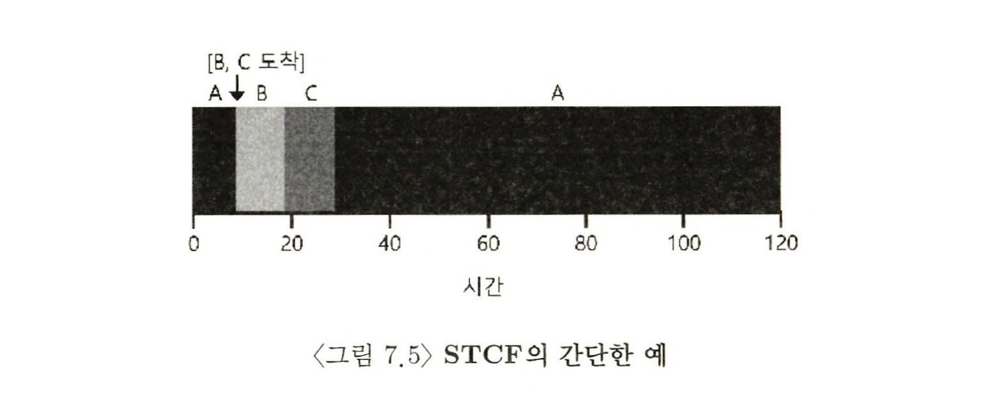

- 이러한 방식으로 개선이 되면 평균 반환시간이 단축되어 최대 50초로 변하게 된다. `((120 - 0) + (20 - 10) + (30 - 10))/3 = 50`

## 7.6 새로운 평가 기준 : 응답시간 (Response Time)

- 지금까지 작업의 길이를 미리 알고, CPU에서만 작업이 진행되는 형태에서 평가기준인 반환시간이라는 기준에서 STCF 는 훌륭한 정책이다. (초기 일괄처리 방식의 시스템에서 최선)
- 하지만 시분할컴퓨터의 등장으로 사용자는 터미널에서 작업하게 되고, 시스템에게 상호작용을 원할히 하는 것을 요구하게 되고 여기서 **응답시간** (Response Time)라는 새로운 성능의 기준을 욕하게 되었다.

<div style="text-align:center">Tresponse = Tfirstrun - Tarrival</div>

- 응답시간은 작업이 도착하는 시점부터 처음으로 스케줄 될 때가지의 시간으로 정의된다.
- 예를 들어 7.5번의 예를 보게 되면 A는 0, B 도 0, C 가 10으로 평균 응답시간은 3.33 이 되게 된다.
- 응답시간이라는 평가 기준에서 STCF 와 같은 방식의 비슷한 방식은 응답시간의 기준면에서 짧다고 할 수 없다.

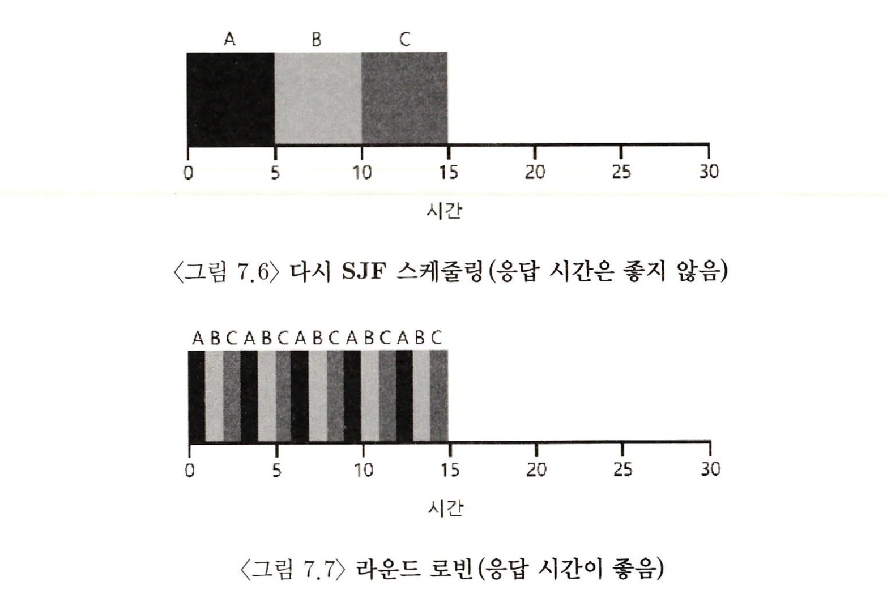

- 위 그림을 보자. SJF 와 같은 스케줄링 기법이 가지는 응답시간에서의 손해는 개선되어야 하며, 이에 대한 대응 스케줄링 기법이 바로 라운드 로빈이다.

## 7.7 라운드 로빈

- 라운드 로빈 (Round-Robin, RR) : 응답시간 문제를 해결하기 위한 스케줄링 기법으로, 이 기법은 작업의 끝을 기다리는 것이 아니라, 일정 시간 동한 실행 후 실행 큐의 다음 작업으로 전환되어 진행하고, 그것이 반복되어 일을 마무리 짓는다.
- 타임 슬라이스 (time slice) / 스케줄링 퀀텁 (scheduling quantum) : 작업이 실행되는 일정 시간 단위
- 위 스케줄링 기법은 타임슬라이스의 길이를 아주 중요한 요소로 삼는다. 타임 슬라이스가 짧을 수록 응답시간은 훨씬 성능이 좋아진다. 이에 비해 짧게 지정하면 context switching 비용이 전체 성능에 큰 영향을 미치게 된다. -> 그렇기에 시스템 설계자에게 어떤 수준으로 최적의 상태로 작동할지를 결정하는 것이 중요해진다.
- 단 타임슬라이스 형태를 가진 스케줄러 RR은 반환시간에서 보면 전체적으로 좋지 못한 성적을 낸다. 상당히 많은 케이스에서 RR이 FIFO의 단순한 스케줄러보다 반환시간 성능에선 지는 것을 보여준다.

## 7.8 입출력 연산의 고려

- 이제부터는 현실에서 일어나는 작업에 유사하게 가정들을 제거해 가면서 이에 대응하여 어떻게 동작하게 만들 수 있는지를 볼 것이다.

> 팁 : 중첩은 높은 이용률을 가능하게 한다.<br>
> 어느 경우라도 이 작업들을 시작한 후에 다른 작업으로 전환하는 것은 시스템의 전반적인 사용률과 효율성이 향상된다.

- 모든 프로그램은 입출력 작업을 수행한다. 현재 실행중인 프로세스가 입출력 작업을 요청하는 경우 스케줄러는 다음에 어떤 작업을 실행할지 결정해야한다. 현재 실행 중인 작업은 입출력이 완료될 때까지 CPU를 사용하지 않는다.
- 입출력 작업의 경우 특히나 프로세스는 보조 기억장치의 현재 입출력 워크로드를 기다리고 있으므로, 좀더 긴 시간의 대기가 필요하다. 따라서 이러한 상황에서 스케줄러는 무엇을 할지 다른 작업의 스케줄을 해야 한다.
- 뿐만 아니라 입출력 완료 시에도 의사 결정을 해야 하며, 입출력 완료와 함께 인터럽트가 발생, OS가 실행되어 입출력 요청의 프로세스를 **대기**상태에서 **준비**상태로 이동시킨다.

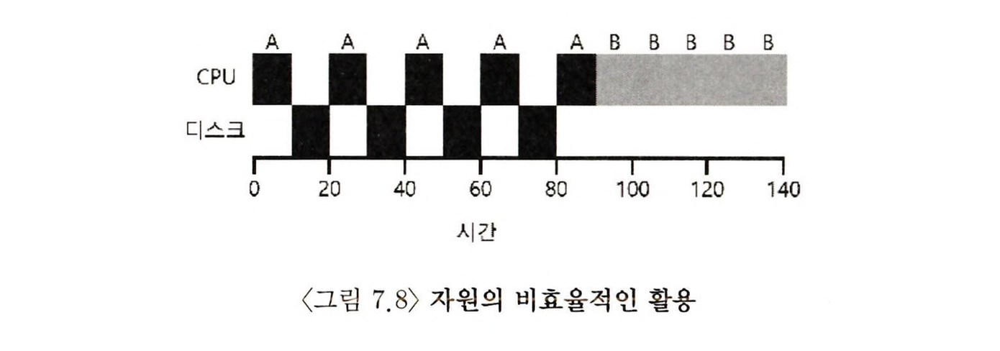

- 위의 예시를 보면 작업 A, B 가 비효율적인 방식으로 스케줄링 되어 있느 것이 보인다.
- A 는 10밀리초 실행후 입출력을 요청한다. 그리고 입출력에 10밀리초가 걸리다보니, 지속적으로 CPU를 사용하지 않게 된다. 따라서 B 작업이 중간 중간 들어가는 STCF 스케줄러를 이용해 처리하는 것이 가능하다.

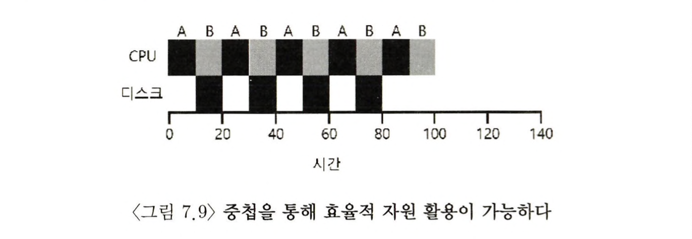

- 하나의 프로세스가 입출력 완료를 대기하는 동안, 다른 프로세스가 CPU를 사용하여 연산의 중첩이 가능해졌고, 시스템 사용률을 향상 시킬 수 있다.

- 각 CPU 버스트를 하나의 작업으로 간주하고, 스케줄러는 대화형 프로세스가 더 자주 실행되는 것을 보장하며, 이는 다른 계산 위주의 작업들이 실행된다. 결론적으로 CPU 의 이용률 향상을 야기한다.

## 7.9 만병통치약은 없다(No More Oracle)

- 입출력을 고려한 기본 접근 방식에서, 가장 문제가 있는 가정은 스케줄러가 각 작업의 실행 시간을 알고 있다는 가정이다.
- 일반적인 운영체제에서 작업의 길이를 미리 할 수 있는 길은 없고, 이 상황에서 응답시간까지 개선을 위해서 다양한 아이디어가 필요하다.

## 7.10 요약

- 스케줄링의 기본적 개념과 두가지 접근법을 배웠다.
- 첫 번째 종류는 가장 짧은 작업을 먼저 작업하도록 하여 평균 반환시간을 최소화한다.
- 두 번째 종류는 모든 작업을 번갈아 실행하여 응답시간을 최소화하는 방식이다.
- 이 두가지 기준에서 최적화를 하는 것에서 한쪽에 비중을 두면 한쪽이 좋지 않아지는 특성을 갖고 있어, 두가지의 절충이 중요하다.
- CPU 스케줄링에서 입출력과 같은 부분도 연산에서 중요한 부분이며, 정확한 스케줄링을 위해선 프로세스의 미래 동작을 예측해야 하는 어려움이 있다.
- 프로세스 미래 동작을 예측함에 있어 과거 프로세스 동작 이력을 반영하는 방식으로 이 문제를 해결하고 이러한 스케줄러를 **멀티 레벨 피드백 큐** (multi-level feedback queue)

# 8. Scheduling : MLFQ

MLFQ(Multi-level Feedback Queue), 멀티 레벨 피드백 큐 스케줄러는 Compatible Time-Sharing System(CTSS)에 사용되며, Corbato 등에 의해 1962년 최초로 소개되었다. 지속적인 발전으로 현대 시스템에까지 발전되었다.

MLFQ가 해결하려는 문제는 두 가지로 정리된다.

- 짧은 작업을 먼저 실행시켜 반환시간을 최적화한다. : 기존 SJF, STCF 같은 알고리즘은 실행시간 정보를 필요로 했으나, 이를 정확히 알 순 없기에 대안이 필요했다.
- 대화형 사용자에게 응답이 빠른 시스템이라는 느낌을 줄수 있도록 응답시간을 최적화한다. : RR 과 같은 알고리즘은 응답시간을 보장해주었지만, 작업의 반환시간은 사실상 최악으로 만들어냈다.

따라서 MLFQ는 이러한 상황에서 보다 나은 스케줄링을 결정하기 위한 고민 가운데 있었다.

> **핵심 질문 : 정보 없이 스케줄하는 방법은 무엇인가?**
> 응답시간 최소화, 그리고 반환시간도 최소화하는 스케줄러를 설계하는 방법은?

## 8.1 MLFQ: 기본 규칙

- MLFQ는 여러 큐를 가지고 있고, 각각 **다른 우선순위(priority level)** 를 배정받는다. 실행 준비된 프로세스는 이러한 큐들 중 하나가 되는 것이다.
- MLFQ의 핵심은 이러한 큐들 가운데 `우선순위`를 사용해 가장 높은 경우부터 큐에 존재하는 작업을 진행한다는 점이다.
- 큐에 둘 이상의 작업이 존재할 수도 있는데, 이 경우 라운드 로빈(RR) 스케줄링 알고리즘을 따라 시분할로 관리된다.
- MLFQ는 각 작업의 고정된 우선순위 부여가 아닌 작업 특성에 따른 `동적 우선순위`를 부여한다는 것이 핵심이 된다.
  - 예를 들면, 작업이 키보드 입력을 기다리면서 반복적으로 CPU를 양보한다면 MLFQ는 해당 작업의 우선순위는 높게 유지, 한 작업이 긴 시간으로 CPU를 집중적으로 요구한다면, 우선순위를 낮추게 된다. 이러한 점에서 MLFQ의 작업의 진행되면서 얻은 정보를 토대로 `미래의 행동을 예측`한다.

<ul>
<li>규칙 1 : Priority(A) > Priority(B) 이면, A가 실행된다(B는 실행되지 않는다).</li>
<li>규칙 2 : Priority(A) == Priority(B) 이면, A, B는 RR 방식으로 실행된다.</li>
</ul>

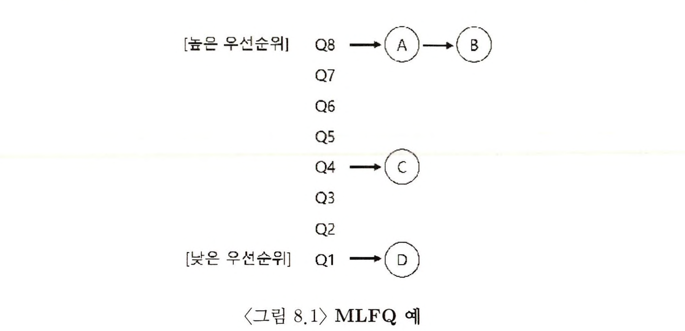

- 이러한 방식으로 동작하는 모습은 다음과 같은 형태로 구현된다고 볼 수 있다.
- 그러나 보면 알겠지만 우선순위가 낮은 작업 C, D는 A, B가 종료되지 않는 이상 작업이 진행되지 않을 것이다. 어떻게 이를 해결할까?

## 8.2 시도 1: 우선순위 변경

MLFQ가 작업 우선순위를 어떻게 바꿀 것인가 라는 표현은, 사실 우선순위 변경만큼 '작업이 존재할 큐'를 결정하는 것과 마찬가지의 의미를 가진다. 짧은 실행 시간을 갖는, CPU를 자주 양보하는 대화형 작업과 많은 시간을 요구하지만 응답시간이 중요하지 않은 긴 실행시간의 CPU 위주 작업이 혼재되는데, 그렇기에 다음과 같은 우선순위 조정 알고리즘을 위한 추가적인 룰을 지정하게 된다.

<ul>
<li>규칙 3 : 작업이 시스템에 진입하면 가장 높은 우선순위에 모두 할당시킨다. </li>
<li>규칙 4a : 주어진 타임 슬라이스를 모두 사용하면 우선순위는 낮아진다. 한단계 아래의 큐로 가게 된다.</li>
<li>규칙 4b : 타임 슬라이스를 소진하기 전에 CPU를 양도한다면 같은 우선순위를 유지한다. </li>
</ul>

### 예시 1) 한 개의 긴 실행시간을 가진 작업

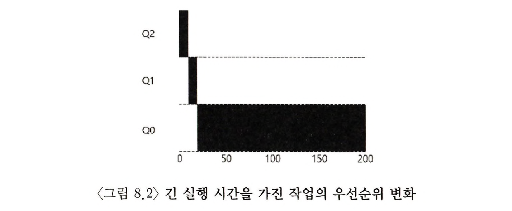

- 위의 예시는 하나의 작업이 타임 슬라이스를 지나서까지 사용이 되어야 하는 경우, 계속해서 Q의 레벨이 내려간다. 최종적으론 Q0이라는 가장 낮은 우선순위에서 작업을 마무리 짓게 된다.

### 예시 2) 짧은 작업과 함께 작업

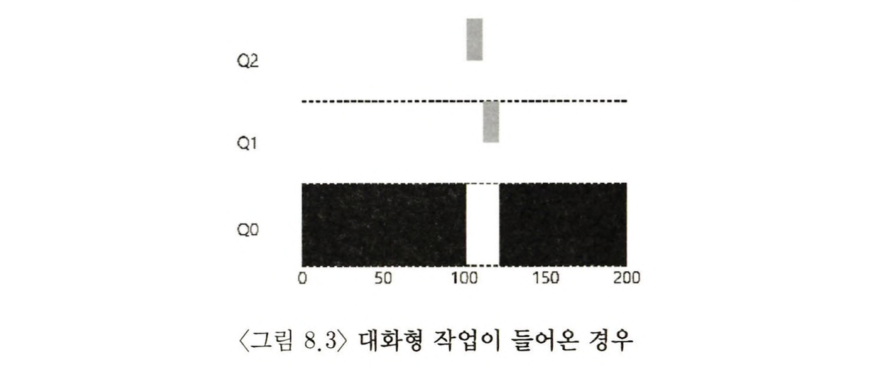

- 위의 예시의 경우 다른 오래 실행되는 CPU 위주 작업이 들어가다가, 새로운 회색의 작업이 `T=100`에 시스템에 도착하고 가장 높은 우선순위를 얻게 된다.
- 그리곤 우선순위가 여전히 높으니, Q0에 이미 있던 작업은 대기하게 되고, 회색 작업의 마무리에, 결국 검은색이 작업을 마무리 짓게 된다.
- 이를 통해 이 MLFQ의 주요 목표를 알 수 있다. 이 스케줄러는 작업이 짧은 작업인지 긴 작업인지 알수 없다는 전제 하에, 일단 빨리 실행되고 종료될 것이라 **가정**을 하고 진행을 한다. 높은 우선순위를 주고, 우선적으로 실행을 시키며, 진자 빠르면 바로 실행된 뒤 종료 될 것이다. 하지만 그렇지 않은 작업이라면 점차 큐 아래로 이동하고, 스스로 긴 배치형 작업임을 증명하게 된다. 따라서 이러한 방식은 SJF의 성능에 근사한 수준을 달성하게 된다.

### 예시 3) 입출력 작업에 대해선 어떻게 대응 할까?

- 규칙 4b가 말하는 것처럼 프로세스가 타임 슬라이스를 소진하기 전에 프로세서를 양도하면서 같은 우선순위를 유지하게 된다. 이러한 기준을 세운 이유는 대화형 작업, 즉 키보드나 마우스등의 사용자 입력을 대기하는 작업은 CPU 를 타임 슬라이스가 종료되기 전에 CPU를 양도할 것이고, (경향적)으로 그러한 작업은 `반응성`을 중시한다. 따라서 높은 우선순위를 유지하게 되고, 작업이 빨리 실행된다는 목표에도 접근이 가능해지는 것이다.

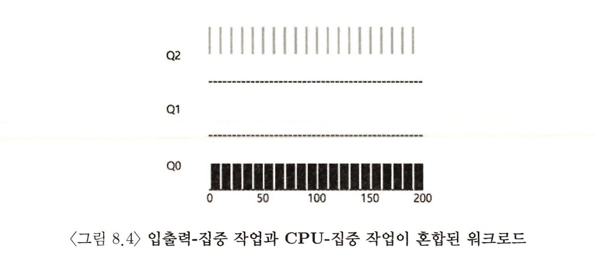

### 지금까지의 MLFQ의 문제점

- 기아상태 발생 가능성이 존재한다 : 현재의 방식은 단순하게 구성되어 있고, 혹여 시스템에 너무 많은 대화형 작업이 존재하면, 그들에 대한 처리에 따라 CPU 사용이 집중되고, 우선순위가 낮아진 긴 시간의 작업들은 CPU 할당을 받지 못해 작업 처리가 되지 않는 일이 발생할 수 있다.

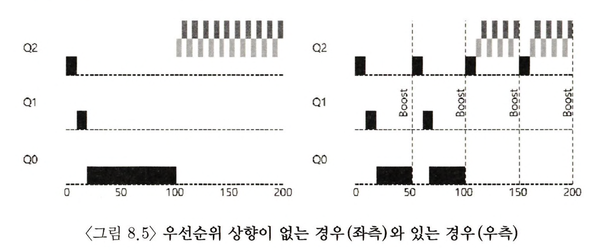

- 사용자가 임의로 프로그램을 변형해, CPU 작업 우선순위를 가로채갈 수 있다. : 만약 의미 없는 입출력을 통해 CPU 우선순위를 높이는 방식을 사용한다면, 해당 경우 작업을 의도적으로 CPU 우선순위에서 높은 곳에 두고 자원을 독점할 가능성이 생긴다.

- 마지막으로 프로그램이 시간 흐름에 따라 특성이 변할 수도 있다. CPU 연산 위주 작업에서 대화형으로 작업이 바뀔 수 있는데, 현재의 구현 방식은 그런 작업에 대해 우선순위를 다시 **높여** 주지는 않는다. 따라서 낮은 우선순위로 내려가버린 이상, 우선순위가 높이 있을 때 얻는 이점이 없게 된다.

## 8.3 시도 2: 우선순위의 상향 조정

- CPU 위주의 작업이 조금이라도 진행하는 것을 보장하기 위해서, 기본적으로 모든 작업의 우선순위를 **상향조정(boost)** 하는 것이 효과적이라 할 수 있다. 다양한 접근 법은 있겠지만 가장 간단하게는 모두 최상위 큐로 보내는 것이다.

<ul>
<li>규칙 5 : 일정 기간 S가 지나면, 시스템의 모든 작업은 최상위 큐로 이동시킨다. </li>
</ul>

- 새로운 규칙은 두 가지 문제를 한 번에 해결한다. 우선 프로세스의 기아 상태를 해소하게 만든다. 최상위로 우선순위가 상향되는 순간 라운드 로빈 방식으로 우선 진행하게 되니, 기아를 해결할 수 있다. 동시에 CPU 위주 작업이 대화형으로 뒤에 바뀌는 특성이 있을 시, 이에 대해서도 우선순위 상향을 통해 변경된 특성에 적합한 스케줄링 방법을 적용한다.

- 물론 `S` 값의 결정이라는 것이 중요하고, 이것이 굉장히 중요하지만 동시에 쉽지 않은 결정을 해야하기에 **부두상수(voo-doo constatns)** 라고 불렀다. 이 상수가 자칫 크면 긴 실행 시간을 가진 작업은 기아가 될 수 있고, 짧으면 대화형 작업이 적절한 양의 CPU 시간을 사용할 수 없다.

## 8.4 시도 3: 더 나은 시간 측정

- 이번엔 스케줄러에 대해 자신 프로그램이 더 유리하게 동작하도록 하는 행위를 막는 것은 어떻게 하면 좋을까?
- 이에 대한 해결책은 MLFQ의 각 단계에서 CPU의 총 사용 시간을 측정하는 것이다. 현재 프로세스가 소진한 CPU 사용시간을 저장하고, 만약 지정된 타임슬라이스에 해당하는 시간을 모두 소진시 다음 우선순위 큐로 강등되도록 해서, 방지책이 마련되면 프로세스의 입출력 행동과 무관하게 아래 단계 큐로 천천히 이동되어 자신의 몫 이상을 사용할 수 없게 만든다.
- 그리하여 규칙 4a, 규칙 4b를 합쳐서 새로운 규칙으로 재정의한다.

<ul>
<li>규칙 4 : 주어진 단계에서 시간 할당량을 소진하면(CPU 양도 횟수와 관계없이) 우선순위가 낮아진다.</li>
</ul>

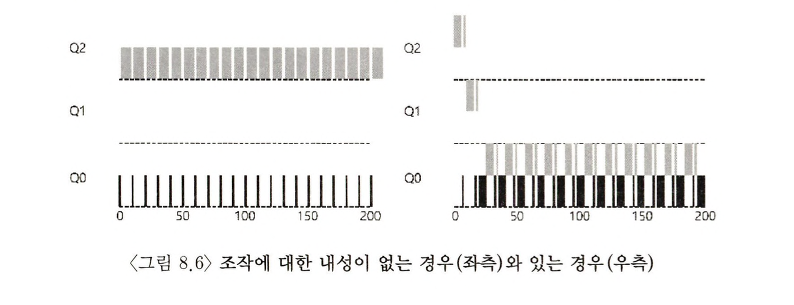

## 8.5 MLFQ 조정과 다른 쟁점들

- 지금까지를 통해 많은 문제들을 개선했지만, 여전히 여러 다른 쟁점들이 존재한다. 예를 들어 필요 변수들을 스케줄러가 어떻게 설정할 것인가? 몇 개의 큐가 존재할 것인가? 큐당 타임 슬라이스의 크기는 얼마나 해야 하는가? 결국 이러한 다양한 질문에 대해서는 쉽게 대답할 수 없고, 워크로드에 대해 충분히 경험하고 계속 조정해 나가면서 균형점을 찾아야 한다.

## 8.6 MLFQ: 요약

- 지금까지의 MLFQ는 복수의 레벨의 큐를 갖고 있으며, 작업의 우선순위를 정하기 위해 '피드백'을 사용한다. 과거의 보여준 행동이 우선순위를 결정하며, 이를 통해 모르는 작업의 수준을 예상하고, 스케줄링을 진행한다.
- 이 장 전체에 산재한 정교한 MLFQ 규칙의 집합을 다시 보면 다음과 같다.
<ul>
<li>규칙 1 : 우선순위(A) > 우선순위(B) 일 경우, A가 실행되고 B는 실행되지 않는다.</li>
<li>규칙 2 : 우선순위(A) == 우선순위(B) 일 경우 A, B 사이엔 RR 방식으로 실행된다. </li>
<li>규칙 3 : 작업이 시스템에 들어가면 최상위 큐에 배치된다.</li>
<li>규칙 4 : 작업이 지정된 단계에서 배정받은 시간을 소진하면(CPU를 포기한 횟수와 상관없이), 작업 우선순위는 감소한다.</li>
<li>규칙 5 : 일정주기 S가 지난 후, 시스켐의 모든 작업을 최상위 큐로 이동시킨다. </li>
</ul>

- MLFQ는 작업 특성에 대한 정보가 없지만, 그럼에도 작업의 실행을 관찰하고, 그 에따른 우선 순위를 지정한다. MLFQ는 다양한 특성으로 반응시간과 응답시간을 모두 최적화하는데 성공했다. 대화형 작업에선 SJF, STCF와 유사한 성능을 주면서도 오래 실행되는 CPU-집중 워크로드에 대해서는 공정하게 실행하고 조금이라도 진행되도록 한다. 이러한 특징은 다양한 OS의 기본적인 근간이 되는 스케줄러로 MLFQ를 쓰는 이유를 보여준다고 할 수 있다.

```toc

```
