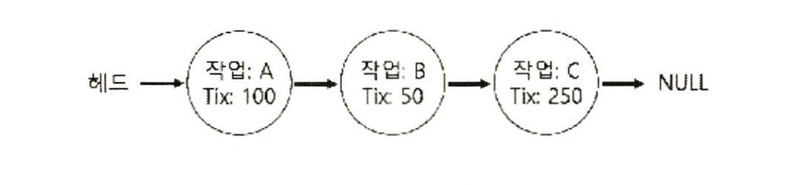
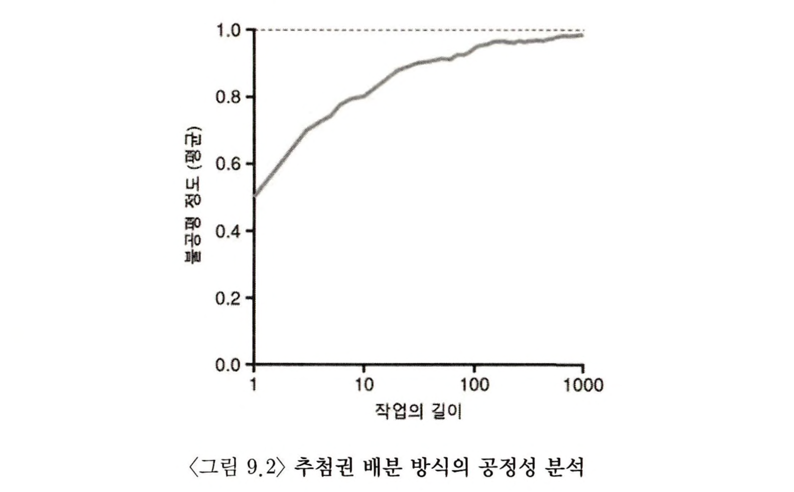
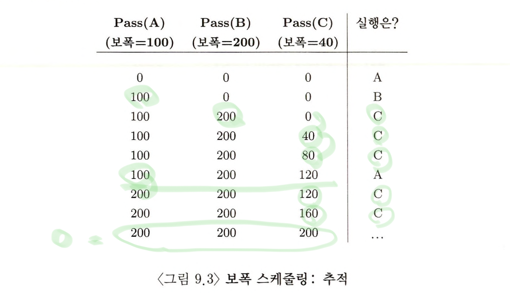
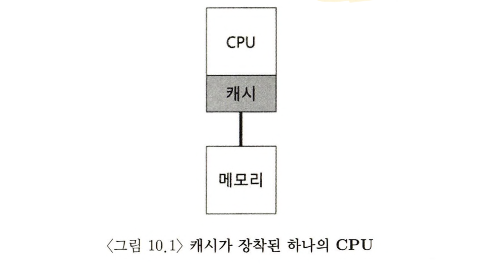
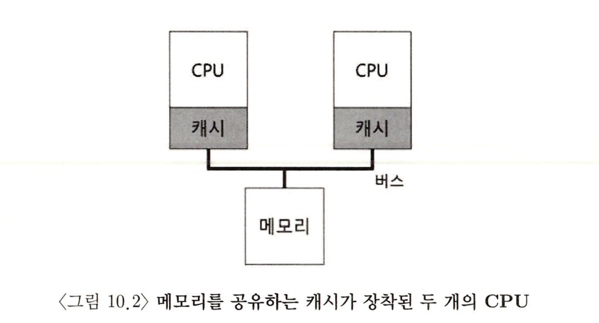
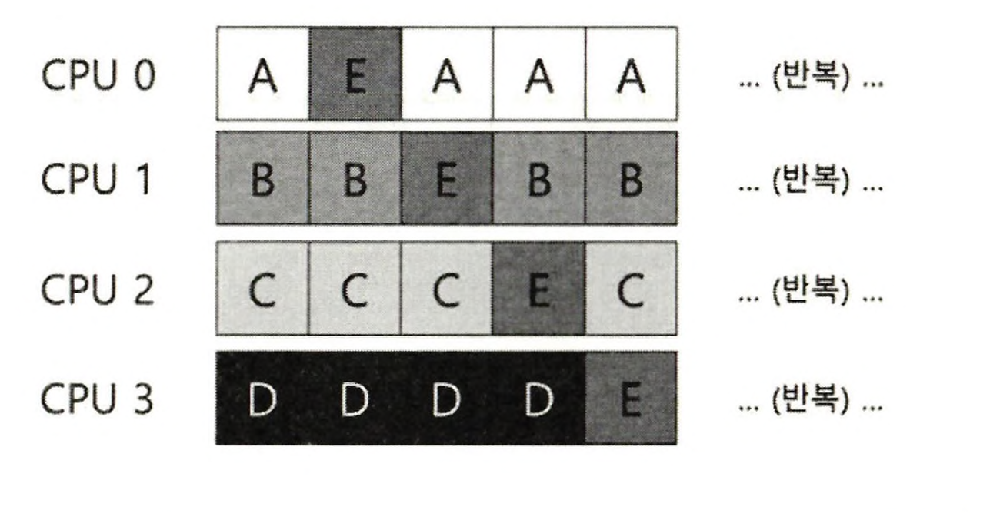
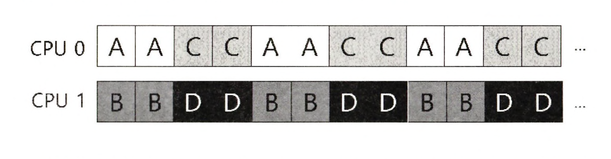
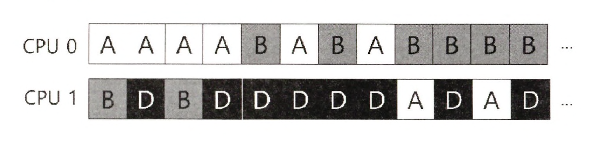

> 본 내용은 OSTEP 의 내용을 정리 및 요약한 내용입니다.
> 전문은 [이 곳](https://pages.cs.wisc.edu/~remzi/OSTEP/)을 방문하시면 보실 수 있습니다.

# 9 스케줄링 : 비례 배분

비례 배분(Proportional Share)스케줄러, 공정 배분(fair share)이라고도 하는 유형의 스케줄러에 대해 다루도록 하겠다. 반환시간이나 응답 시간을 최적화는 대신 스케줄러가 각 작업에게 CPU의 일정 비율을 보장하는 것이 목적이다.

비례 배분 스케줄링의 좋은 예가 추첨 스케줄링(lottery scheduling) 으로 알려져 있다.

> 핵심 질문 : 어떻게 CPU를 정해진 비율로 배분할 수 있는가.
> 특정 비율로 CPU를 배분하는 스케줄러를 어떻게 설계할 수 있는가?

## 기본 개념 : 추첨권이 당신이 지분이다

추첨권이라는 기본적인 개념이 추첨 스케줄링의 근간을 이룬다. 추첨권은 경품권의 개념과 유사하고 특정 자원에 대한 프로세스에게 할달될 몫을 나타낸다.

> 팁 : 무작위성의 이용
> 추첨권 스케줄릥 큰 장점 중 하나는 무작위서이다. 이러한 무작위적 방식은 전통적인 결정 방식에에 비해 세 가지 장점이 있다.
>
> - 무작위 방식은 더 전통적인 방식이 잘 해결하지 못하는 특이 상황을 잘 대응한다.
> - 무작위 추첨 방식은 매우 가볍고, 관리해야할 상태 정보가 거의 없다.
> - 무작위 추첨방식은 매우 빠르다. 난수 발생 시간이 빠르기만 하면 결정 역시 빠르게 되고 따라서 속도가 요구되는 많은 경우에 사용될 수 있다. 속도를 증가시키기위해서 추첨과정을 덜 무작위(pseudo-random)하게 만들기도 한다.

## 추첨 기법

추첨권을 다루는 다양한 기법 중 한 가지 기법은 `추첨권 화폐(ticket currencty)`의 개념이다. 이 개념은 사용자가 추첨권을 자유롭게 할당할 수 있도록 허용한다. 시스템은 자동적으로 화폐 가치를 변화한다.

다른 유용한 기법은 `추첨권 양도(ticket transfer)`이다. 양도를 통하여 프로세스는 일시적으로 추첨권을 다른 프로세스에게 넘겨 줄 수 있다. 이는 클라이언트/서버 환경에서 특히 서버에게 메시지를 보내 자신을 대신해 특정 작업을 해달라고 요청할 수 있다. 작업이 빨리 완료 될 수 있도록 클라이언트는 서버에게 추첨권을 전달하고 서버가 자신의 요청을 수행하는 동안 서버의 성능을 극대화하려고 한다.

`추첨권 팽창(titcket inflation)`이란 개념도 있다. 이 기법은 프로세스는 일시적으로 자신이 소유한 추첨권의 수를 늘이거나 줄일 수 있다. 물론 서로 신뢰하지 않는 프로세스들이 상호 경쟁하는 시나리오에서는 의미가 없ㄷ다. 왜냐면 욕심이 많은 프로세스가 전체에서 다수의 추첨권을 이용해 컴퓨터를 장악할 수 있기 때문이다.

따라서 화폐 팽창 기법은 프로세스들이 서로 신뢰할 때 유용하다. 어떤 프로세스가 많은 CPU 시간이 필요시 시스템에게 이를 알리면 다른 프로세스와 통신하지 않고도 추첨권의 가치를 상향 조정 받을 수 있다.

## 구현

추첨 스케줄리의 가장 큰 장점은 구조가 단순하다는 점이다. 필요한 것은 난수 발생기와 프로세스들의 집합을 표현하는 자료구조, 추첨권의 전체 개수 뿐이다.

```c
// counter : 당첨자를 발견했는지 추적한는데 사용됨
int counter = 0;
// winner : 0 부터 총 추첨권의 수 사이의 임의의 값을 얻기 위해
// 난수 발생기를 호출함
int winner = getrandon(0, totaltickets);

// current : 작업 목록을 탐색하는 데 사용
node_t *current = head;
while(current) {
	counter = counter + counter->tickets;
	if (counter > winner)
		break ; // 당첨자 발견
	current = current->next;
}
// current 는 당ㅁ첨자를 가리킴, 당첨자가 실행될 수 있도록 준비
```



프로세스 리스트를 순회하면서 counter 값이 winner의 값을 초과할 때까지 각 추첨권 개수를 counter에 더한다. 랜덤으로 생성된 값들 속에서 winner가 되는 경우는 당연히 작업의 추첨권의 수가 큰 경우에 해당하며, 당첨이 되는 counter를 만나게 되면 해당 작업을 진행하고, 다시 0으로 돌아가 winner를 설정하면서 다른 값으로 랜덤하게 동작하게 된다.

이때 추첨권의 개수가 많을 수록 당연히 winner 값보다 큰 대상이 될 확률이 높아진다.

일반적으로 리스트를 내림차순으로 정렬하면 이 과정이 가장 효율적이 된다. 정렬 순서는 알고리즘의 정확성에 영향을 주진 않는다. 단 리스트를 정렬해 놓으면 검색 횟수가 최소화 되는 것을 보장한다. 특히 적은 수의 프로세스가 대부분의 추첨권을 소유하고 있는 경우에 효과적이다.

## 예제



기본적으로 작업에 대한 추췀건 배분 방식의 공정성을 분석하면 작업이 충분히 긴 기간이라면 추첨 스케줄러는 원하는 결과에 가까워진다.

## 추첨권 배분 방식

추첨권을 작업에게 나누어주는 방식이다. 작업들에게 추첨권을 몇 개씩 분배해야 하는가? 시스템 동작이 추첨권 할당 방식에 따라 크게 달라지기 때문에 상당히 어려운 문제이다. 각 사용자에게 추첨권을 나눠준 후 사용자가 알아서 실행시키고자 하는 작업들에게 추첨권을 배분하는 방법도 있지만, 이는 어떤 일을 해야 하는지 전혀 제시하지 않았기에 주어진 작업 집합에 대한 추첨권 할당 문제는 여전히 미해결 상태이다.

## 왜 결정론적(Deterministic) 방법을 사용하지 않는가

무작위성을 이용하면 스케줄러를 단순하게 만들순 있지만, 정확한 비율은 보장할 수 없다. 특히 짧은 기간만 실행되는 경우는 더 그렇다. 이 때문에 결정론적 공정 배분 스케줄러인 보폭 스케줄링을 고안하였다.

시스템의 각 작업은 보폭을 가지고 있다. 보폭은 자신이 가진 추첨권 수에 반비례한다. 이를 예시로 설명하면 다음과 같다.

- A, B, C가 각각 추첨권 100, 50, 250의 추첨권을 가지고 있다. 임의의 큰 값을 각자의 추첨권 개수로 나누어 보폭을 계산한다.
- 10,000 을 기준이라 했을 때, A, B, C는 각각 100, 200, 40 이라는 값을 갖게 된다. 이것이 **보폭(stride)** 이라고 하며, 프로세스 실행 될 때마다 pass 라는 값을 보폭 만큼 증가시켜, 얼마나 CPU를 사용했는지 추적한다.
- 프로세스가 실행될 때마다 pass 값을 보폭만큼씩 증가시킨다.

- 스케줄러는 보폭과 pass 값을 사용하여 가장 작은 pass 값을 가진 프로세스를 선택하고, 프로세스를 실행시킬 때마다 pass 보폭만큼씩 pass 값을 늘린다.
- 이런 구조로 진행이 되면, 처음에는 각자 pass 값이 모두 0이므로 아무 프로세스나 실행될 수 있다.
- 한 바퀴 돌고 나면, pass 값이 최소인 클라이언트를 선택하여 작동하는 것을 반복한다.
- 이런 구조가 되면 보폭이 큰(추첨권이 적은) 경우 pass 값이 항상 커지므로, 최소값이 될 확률이 점차 적어지고, 추첨권이 많은 경우 보폭이 작아, pass 가 최소값이 될 확률이 크다.
- 이러한 경우가 이어지면 A, B, C의 진행은 다음처럼 이어진다.



- 위 예시의 추적을 보면, 추첨권과 정확한 비율로 CPU를 점유하게 된다. 추첨스케줄링은 정해진 비율에 따라 확률적으로 CPU를 배분한다. 보폭 스케줄링은 각 스케줄링 주기마다 정확한 비율로 CPU를 배분한다.

- 여기서 중요한 점은 상태 정보가 필요없다는 점이다. 새 프로세스를 추가할 때, 새로운 프로세스가 가진 추첨권의 개수, 전체 추첨권의 개수만 갱신하고 스케줄한다. 이런 이유로 추첨 스케줄링 방식은 새 프로세스의 추가가 용이하다.

## 리눅스 CFS(Completely)

현재 Linux는 기존의 공정 배분 스케줄링의 선행연구와는 다른 방식으로 공정 배분 스케줄링을 구현하였다. Completely Fair Scheduler(CFS)라고 부른다.

이 방식의 장점은 스케줄러가 효율성과 확장성을 가진다는 점이다.

효율성을 위해 CFS는 최적의 내부 설계와 자료구조를 사용해 스케줄링 결정을 신속하게 수행한다. 이러한 스케줄러의 성능의 차이가 전체 시스템 성능에 중대한 영향을 준다고 한다.

### 기본연산

CFS는 모든 프로세스들에게 CPU를 공평하게 배분하는 것을 목표로 한다. Virtual runtime(vruntime)이라는 간단한 counting 기반 테크닉을 사용한다.

프로세스가 실행되서, 스케주러는 해당 프로세서의 vruntime 값을 누적시킨다. 각 프로세스의 vruntime은 실제 시간과 같은 속도로 증가하고, 스케줄링 시 CFS는 가장 낮은 vruntime을 가진 프로세스를 다음 실행할 프로세스로 선택한다.

스케줄링의 프로세스를 멈추고 다음 프로세스를 실행하는 결정은 CFS가 자주 실행되면 각 프로세스가 작은 시간 간격으로 CPU를 사용하게 되어 공정성이 좋아진다.그러나 많은 컨텍스트 스위칭이 발생하면 전체 시스템 성능에 악영향을 준다. 드물게 CFS 가 실행되면 컨텍스트 스위칭의 횟수 감소로, 전체 시스템 성능은 올라가나, 공정성은 악화된다.

따라서 이러한 상황을 상충되는 다양한 통제 변수로 관리한다.

- shed_latency : 이 값은 여러 프로세스가 CPU를 번갈아서 사용하는 상황에서 하나의 프로세서가 CPU를 사용한 후, 다음번 CPU를 사용할 수 있을 때까지의 최대 시간 간격을 나타낸다. 이 값을 통해 CFS는 현재 실행중인 프로세스의 개수로 나눠, 프로세스의 타임 슬라이스를 결정하게 된다.

- min_granularity : 만약 프로세스가 많아지고, 타임슬라이스 크기가 매우 작아진다면, 즉, 과도한 컨텍스트 스위칭이 이루어지는 것을 이것으로 해결한다. 이 최소 타임 슬라이스를 통해, 프로세스가 타임 슬라이스 값을 결정하게 될 때, 최소 값인 min_granuariy를 지나서까지 타임슬라이스가 내려가는 것을 막아준다. 이를 통해 스케줄링은 효율적이고, 프로세스간의 CPU를 가능하면 공평하게 배분하는데 문제를 개선한다.

CFS는 특정 시간 간격으로만 스케줄링을 결정 내릴 수 있다. CFS는 vruntime을 정확히 계산하고 이를 기반으로 스케줄링하기에, 타이머 인터럽트의 주기가 타임슬라이스와 정확히 맞아 떨어지지 않는 경우에도 궁극적으로 CPU를 공평하게 배분하게 한다.

### 가중치(Niceness)

CFS는 사용자나 관리자가 프로세스의 우선순위를 조정하여 다른 프로세스들 보다 더 많은 CPU 시간을 할당 받게 할 수 있다. 여기선 **nice** 레벨이라는 고전의 UNIX 메커니즘을 활용한다.

본 가중치는 프로세스의 실질적인 타임 슬라이스를 계산하는데 사용하고, 프로세스 간의 우선순위 차이도 고려한다.

이러한 가중치 표의 장점은 nice 값의 차이가 유지되면, CPU배분 비율도 유지된다.

### Red-Black 트리의 활용

단순한 링크드 리스트의 프로세스 관리 자료구조는 구현은 용이하지만 선형이기에 확장성에서 제약이 있고, 수천개의 프로세스를 탐색하는 과정이 매우 낭비가 된다.

이에 CFS는 red-black 트리를 사용해 효율성 문제를 해결하고, 최악의 경우에도 적당한 성능을 낼 수 있도록 되어 있다. 이때 모든 프로세스가 본 알고리즘 구조에 들어가 있는 것은 아니며, 프로세스가 sleep 상태가 되면(IO 완료, 네트워크 패킷 도착을 기다리는 경우) 프로세스는 트리에서 제거되고 다른 곳에 보관된다.

### I/O 와 잠자는 프로세스 다루기

추가로 장기적으로 잠자는 프로세스의 처리도 있다. 자는 동안 기존의 프로세스보다 뒤쳐진 프로세스가 있다고 할 때, 이후 다음 시간 동안 슬립이 길었던 프로세스가 CPU를 독점하게 될 수도 있다. 이러면 A는 기아상태에 빠질 위험이 있다. 이를 위해 CFS는 작업이 깨어날 때 vruntime을 적절히 재설정한다.

## 요약

비례 배분 스케줄리이란 개념이 있다. 추첨권, 보폭, 리눅스의 CFS라는 세가지 구현 방식이 있었다.
추첨권 스케줄링은 무작위성을 사용하고, 보폭 스케줄링도 같지만 결정적 방법으로 이를 달성한다. 이에 비해 실제 스케줄러인 CFS는 동적 타임 슬라잇스를 가진 가중치 방식이지만, 동시에 부하에 잘 견딜 수 있는 확장성과 성능을 확보했다.

# 10 멀티프로세서 스케줄링(고급)

멀티프로세서 시스템의 대중화로, 하나의 칩에 멀티 코어 프로세서가 대중화가 이뤄진다. 그러나 다중 CPU 시대가 오면서 많은 문제가 발생한다. 왜냐면 기본적으로 프로그램이라는 것은 단일 CPU에서의 작업을 전제로 만들어졌다는 점이다. 아무리 많은 CPU가 있어도 결국 더 빨리 실행되진 않는다. 결국 근본적인 해결은 병렬(parallel)로 실행되도록 다시 작성해야 한다는 점이다.

멀티 쓰레드 응용 프록로그램은 작업을 여러 CPU에 할당하며, 더 많은 CPU가 주어지면 그만큼 더 빠르게 실행된다. 그렇기에 운영체제가 새로이 직면한 문제가 바로 멀티프로세서 스케줄링이다.

## 배경 : 멀티프로세서 구조

멀티프로세서 스케줄링에 대한 새로운 문제점은 단일 CPU와 멀티 CPU의 하드웨어들 사이의 근본적 차이를 이해해야 한다. 다수의 프로세서 간에 데이터 공유, 하드웨어 캐시의 사용 방식에서 근본적인 차이가 있다.

단일 CPU 시스템에서는 하드웨어 캐시 계층이 존재한다. 이 캐시는 프로그램을 빠르게 실행하기 위한 존재이다. 캐시는 메인 메모리에서 자주 사용되는 데이터의 사본을 저장하는 작고 빠른 메모리이며, 임시로 캐시 공간에 데이터를 놓아둠으로써 시스템은 크고 느린 메모리를 빠른 메ㅗ리 처럼 보이게 한다.

캐시의 개념은 '지역성(locality)'에 기반한다. 이러한 지역성은 시간 지역성과 공간 지역성으로 나뉜다.

- 시간 지역성(temporal locality) : 데이터가 한 번 접근 되면 가까운 미래에 다시 접근 되기 쉽다.
- 공간 지역성(spatial locality) : 프로그램이 주소 x의 데이터를 접근하면 x 주변의 데이터가 접근되기 쉽다.

단일 CPU의 시대에는 이러한 상황에서 하드웨어 시스템에서 캐시가 잘 작동했다. 하지만 아래의 그림처럼 캐시가 장착된 두 개의 CPU 상태라면, 지역성이라고 하는 것은 굉장히 복잡한 문제를 발생시킨다.




예를 들어 CPU1 에서 작업을 하다가 CPU2에서 작업을 하게 된다면 어떨까? 운영체제가 프로그램의 실행을 중단하고 CPU 이동하기로 결정이 되면, 프로그램은 주소 A부터 값을 다시 읽어야 한다. 왜냐면 CPU2의 캐시에는 해당 데이터가 존재하지 않기 때문이다.

이렇듯 멀티프로세서 시스템에서 캐시를 사용하는 것은 훨씬 복잡하다.

뿐만 아니라 캐시 메모리 안에 아직 프로그램에 대해 변경된 사항이 메모리까지 내려가서 저장하는 것이 상당한 시간이 걸리는 만큼 프로그램의 갱신된 데이터 값이 메인 메모리에 가지 못하고, 그때 CPU2가 일을 가져가려고 하면, 캐시에 정보가 없으니 메인 메모리에서 가져 오게 되고, 이때 변경되지 않은 값을 읽어 올 수 가 있다.

이 문제를 `캐시 일관성 문제(cache coherence)`라고 부른다.

기본적으로 이러한 상황에서 해결책은 하드웨어에 의해 제공된다. 하드웨어가 메모리 주소를 감시하고, 항상 올바른 순서로 처리되도록 시스템을 관리한다. 여러개의 프로세스들이 하나의 메모리에 갱신할 때는 항상 공유되도록 하고, 버스 기반 시스템에선 `버스 스누핑`이라는 오래된 기법을 사용한다. 캐시는 자신과 메모리를 연결하는 버스의 통신상황을 모니터링 하고, 캐시데이터에 대한 변경이 생기면, 자신의 복사본을 무효화(invalidate)시키거나 갱신한다.

나중쓰기(write-back) 캐시라면 메인 메모리에 쓰기 연산이 지연되기 때문에 캐시 일관성 유지 문제를 훨씬 복잡하게 만든다.

## 동기화를 잊지 마시오

CPU 들이 올바른 연산 결과를 보장하기 위해 락과 같은 상호 배제를 보장하는 동기화 기법을 많이 사용된다.

락-프리 데이터 구조등의 다른 방식은 복잡하다. 따라서 특별한 경우에만 사용이 된다.

## 마지막 문제점 : 캐시 친화성

멀티프로세서 캐시 스케줄러에서의 마지막 문제점은 캐시 친화성이다. 한 마디로 CPU에서 실행될 때 프로세스는 해당 CPU 캐시와 TLB에 상당한 양의 상태정보를 올리게 된다. 다음 번에 프로세스가 이미 실행될 때 동일한 CPU에서 실행되는 것이 유리하다. 이를 고려하지 않고 필요한 정보를 다시 탑재 해야만하는 일이 발생한다.

멀티프로세서 스케줄러는 스케줄링 결정을 내릴 때 이러한 캐시 췬화성을 고려한 스케줄링이 되어야 한다.

## 단일 큐 스케줄링

단일 큐 멀티프로세서 스케줄링(Single queue multi processer, SQMS)은 가장 기본적인 정책으로 방식의 장점은 단순함에 있다.

기존 정책대비 동작이 매우 편리하고 손쉽다고 볼 수 있다.

그러나 단점도 있다.

- 확장성이 결여. 스케줄러가 SQMS에선 이 큰 성능 저하를 야기할 수 있다.
- 각 CPU는 공유 큐에 다음 작업을 잘못된 선택하기에 각 작업이 비교적 CPU를 옮겨 다니게 된다. 캐시 친화성을 고려해야 한다.

이 문제를 해결하기 위해 다음과 같은 예시를 만든다.



이 배열은 오직 E 프로세스만이 다른 프로세서로 이동하도록 구현이 되어서 친화성에 대한 형평성을 추구했다. 단, 이러한 방법은 구현 자체가 복잡해질 수 있다.

SQMS 방식의 장단점은 다음과 같다.
기존의 단일 CPU 스케줄러가 있다면 하나의 큐 밖에 없기 때문에, 구현이 간단하다. 그러나 동기화 오버헤드 자체는 여전히 존재하므로, 확장성이 좋지 못하며 여전히 캐시 친화성에 문제를 갖고 있다.

## 멀티 큐 스케줄링

단일 큐 스케줄러의 여러 문제점으로 일부 시스템은 멀티 큐를 만드는 멀티 큐 멀티 프로세서 스케줄링(multi-queue multiprocessor scheduling, MQMS)을 채용한다.

MQMS 는 기본적으로 스케줄링 프레임 워크에 여러개의 큐를 갖고 있고, 각 큐는 라운드 로빈과 같은 특정 스케줄링 규칙을 따르며, 작업이 시스템에 들어가면 하나의 큐에 배치되고, 배치될 큐의 결정은 적당한 방법을 따르며, 이후 큐는 독립적으로 스케줄 되기 때문에 단일 큐 방식에서 나타난 정보 공유 및 동기화 문제를 피할 수 있다.




MQMS가 SQMS 에 비해 가지는 명확한 이점은 확장성이 좋다는 것이다.
CPU 개수 만큼 큐의 개수가 늘며, 락과 캐시 경합은 더 이상 문제시 되지 않는다. 하지만 이러한 방식의 가장 큰 문제는 멀티 큐 기반일 경우 워크로드의 불균형(load imbalance)가 발생한다는 점이다.

각 CPU 사이에 일의 작업 량이 항상 동일할 수는 없고, 그 차이가 있는 만큼 특정 CPU가 지정된 일을 다하게 되면, 큐가 비고, 빈 큐로 인해 어떤 CPU는 작업을 하지만, 한 쪽은 놀고 있는 불균형 상태가 발생하게 된다.

결국 여기서 이러한 문제를 해결하기 위해 기술이 나오는 데 이것을 **이주(migration)** 이라고 부른다. 작업을 CPU에서 CPU로 이주 시켜 워크로드의 균혀을 달성하는 것이다.



CPU0에서 A 라는 작업이 몇 번의 타임 슬라이스 후 B는 CPU1에서 이주하여 A와 경합을 벌인다.

이주 패턴은 구현이 상당히 힘든데, 이주 필요 여부를 알기 위해 '작업훔치기' 라는 접근법이 있다.

작업 훔치기는 한마디로 말하면 큐가 빈 CPU가 훨씬 많은 수의 작업이 있는지 다른 CPU를 검사한다. 대상 큐가 소스 큐보다 더 가득 차면 워크로드 균형을 맞추기 위해 소스는 대상에서 하나 이상의 작업을 가져온다.

그러나, 이런 방식은 큐를 자주 검사하면 높은 오버헤드가 발생해 확장성에 문제가 생긴다. 확장성을 깎지 않으면 감시는 안되고 워크로드 불균형도 개선되지 않는다. 이러한 점에서 결국 어떤 장단에 맞출 것인가.. 이 부분은 어쩌면 경험과 오랜 시간이 필요한 작업이다.

## Linux 멀티프로세서 스케줄러

Linux를 위한 커뮤니티 내에서 멀티 프로세서 스케줄링을 위한 다양한 방식이 등장했다.
O(1)스케줄러, CFS, BFS 가 바로 그것이다.

- O(1)와 CFS는 멀티 큐를 , BFS는 단일 큐를 사용했다. 두 방식 모두 실제 시스템에서 성공적으로 사용되는 것을 확인하였기에 어느 방식이든 그 능력치는 분명히 있다고 볼 수 있다. 이러한 방식들에 대한 디테일한 내용은 스케줄링 알고리즘에 대해 스스로 학습하면서 터득하면 좋으리라 보인다.

## 요약

단일 큐 방식(SQMS) 구현은 용이, 워크로드 균형 맞추기도 용이, 하지만 많은 개수의 프로세서에 대한 확장성, 캐시 친황성은 다소 아쉬운 편이다.
멀티 큐 방식(MQMS)는 확장성이 좋고 캐시 친화성도 잘 처리하는 편이지만 워크로드의 불균형에 문제가 있고 구현이 복잡하다.

결국 어떤 방식이든 쉬운 답은 없고, 모든 경우에 다 잘 동작하는 범용 스케줄러를 구현하는 것은 매우 어렵다. 본인이 하는 작업이 가져올 결과를 정확히 이해하고 있거나, 괜찮은 보수를 받는 다면 시도해볼만 하리라 생각된다.

```toc

```
