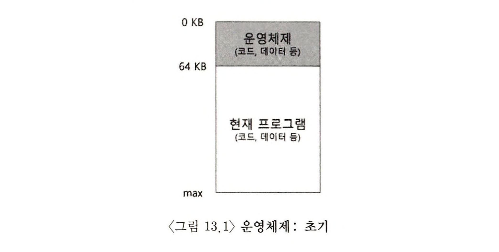
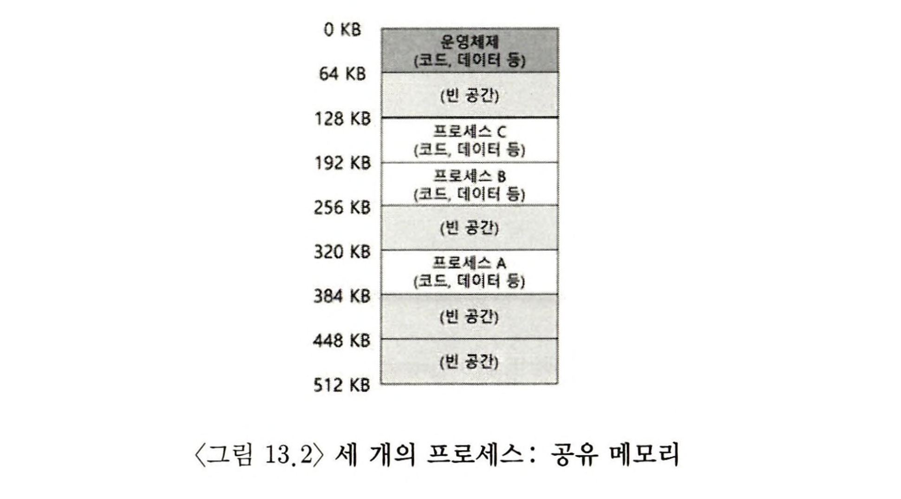
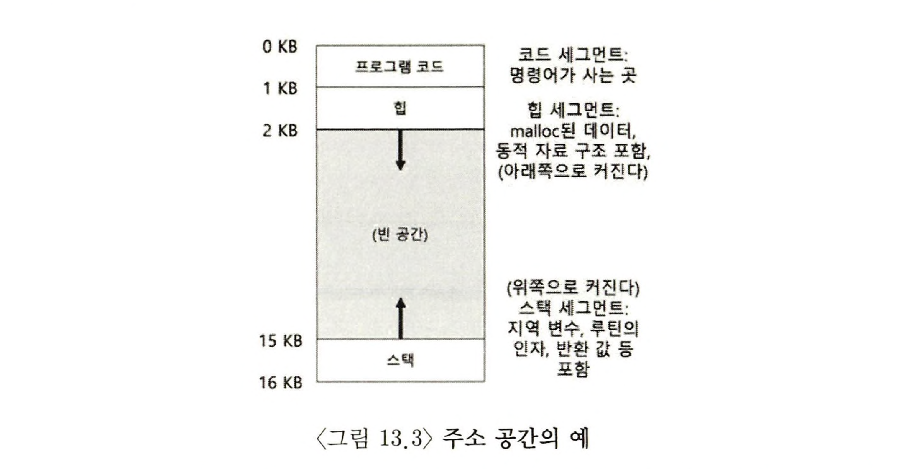

> 본 내용은 OSTEP 의 내용을 정리 및 요약한 내용입니다.
> 전문은 [이 곳](https://pages.cs.wisc.edu/~remzi/OSTEP/)을 방문하시면 보실 수 있습니다.
> 10과 끝나고 갑자기 13과라 당황스럽겠지만, 중간 대화 등을 생략했다 ㅎㅎ..

# 13. 주소 공간의 개념

## 13.1 초기 시스템

메모리 관점에서 초기 컴퓨터는 많은 개념을 사용자에게 제공하지 않았고, 컴퓨터의 물리 메모리는 아래의 그림과 닮아 있었다.



물리 메모리에 하나의 실행중인 프로그램이 존재하고, 나머지 메모리를 사용한다. 특별한 가상화도 존재 하지 않았고, 사용자는 운영체제로부터 많은 것을 기대하지 않았다.

## 13.2 멀티프로그래밍과 시분할

멀티 프로그래밍 시대가 도래하였고, 여러 프로세스가 실행 준비 상태에 있고 운영체제는 그들을 전환하면서 실행하는 구조화 되어 갔다. 프로세스는 전환되는 것들이 생기니 CPU 이용률이 증가되었고, 특히나 이러한 상황에서 효율성 개선이라는 키워드에 집중하게 되었다.

점차 더 많은 기대치를 갖게된 컴퓨터에는 시분할(time-sharing) 시대에 들어갔고, 일괄처리방식(batch computing)컴퓨팅의 한계를 인식하였고, **대화식(interatctivity)** 개념이 두드러지게 되었다.

시분할을 구현하는 하나의 방법으로 하나의 프로세스를 짧은 시간 동안 실행시키는 것이었고, 이때 프로세스에게 모든 메모리 접근 권한이 주어지게 된다. 프로세스가 중단되면, 그 시점의 모든 상태를 디스크 종류의 장치에 저장하고, 다른 프로세스 상태를 탑재하여 또 짧은 시간 실행시켰다.

**문제는 너무 느리다**

메모리가 커지고, 프로그램의 수준이 점점 복잡해질 수록 이러한 단순한 방법이 가지는 한계는 명확했다.**메모리 내용 전체를 디스크에 저장하는 것은 엄청 느렸기에, 프로세스 전환 시 메모리에 그대로 유지하면서, 운영체제가 시분할 시스템을 효율적으로 구현하고자 발전해나갔다.**



그림처럼 각 프로세스(A, B, C)가 있고, 각 프로세스는 512KB 물리 메모리를 작게 잘라 할당받아야 한다.

뿐만 아니라 시분할 시스템의 대중화는 운영체제가 메모리 간의 서로 보호(protection) 가 중요한 문제로 대두된다. 한 프로세스가 다른 프로세스 메모리를 읽거나 혹은 더 안 좋게 쓸 수 있는 상황 자체를 막아야 한다.

## 13.2 주소공간

위에서 제시된 위험한 행위를 하는 사용자를 염두하여, 운영체제는 사용하기 쉬운(easy to use) 메모리 개념을 만들어냈다.

이 개념이 **주소 공간(address space)** 이다. 이 개념은 프로그램이 가정하는 메모리의 모습이며 운영체제의 메모리 개념을 이해하기 메모리를 어떻게 가상화하는지를 알려준다.



위의 그림은 아주 작은 주소 공간의 예시를 보여주는 것이다. 코드는 주소 공간의 위쪽에 배치되고, 코드는 정적이기에 메모리에 저장이 쉬워 주소 공간 상단에 배치된다. 이 공간은 프로그램이 실행되면서 추가 메모리를 필요로 하지 않는다.

다음에 존재하는 것은 익히 배운 상단부터 시작하는 힙, 마지막에서 부터 거꾸로 올라가는 스택이다. 이 두 영역은 확장이 필요한 만큼 그 사이 빈공간을 갖고 있다.

단, 이러한 스택과 힙의 배치는 관례적 표현이며 주소 공간을 원한다면 다르게 배치하는 것도 가능하다.

주소 공간을 설명 할 때, 운영체제가 실행중인 프로그램에게 제공하는 **개념(abstraction)** 을 설명한다. 실제로는 특정 물리 주소를 갖고 있으나, 그림에서 보듯 가상화되어있다고 보면 된다.

> 핵심 질문 : 메모리를 어떻게 가상화 하는가?

운영체제가 위에서 이야기 하는 행위를 하는 것을 **메모리를 가상화(virtualizing memory)한다** 고 말한다. 이는 특정 주소의 메모리와 실제 물리적 메모리가 다르기 때문이다.

위의 그림처럼 실제 프로세스 A 는 주소 0에서 부터 시작한다고 생각하지만, 실제론 물리 주소를 따로 갖고 있다. 이것이 메모리 가상화의 핵심이자 현대적 모든 컴퓨터 시스템의 기반이 되어 있다.

## 13.4 목표

운영체제가 가상화를 하기 위해선 몇 가지 목표점을 갖고 있다. 이를 기반으로 가상화가 이루어지기 때문에 이러한 속성이자 목표 지점을 이해하고 있는것은 가상화를 이해하는데 정말 중요한 부분 중 하나이다.

1. 가상 메모리 시스템(VM)의 중요 목표 중 첫 번째가 **투명성(transparency)** 이다.

   - 운영체제는 실행 중인 프로그램이 가상 메모리의 존재를 인지하지 못하도록 해야하고, 오히려 프로그램이 자신 만의 전용 물리 메모리를 소유한 것 처럼 작동하도록 만들어줘야한다.
   - 그러나 이러한 특성을 만들기 위해선, 무대 뒤에서 운영체제와 하드웨어의 협동 작업이 수행된다는 점을 기억하자.

2. **효율성(efficiency)**

   - 가상화가 시간과 공간 측며에서 여러 작업을 결국 추가적으로 하는 만큼, 너무 느리거나 너무 무겁다는 것은 좋지 못하다.
   - 따라서 시간-효율적인 가상화 구현을 위해, 운영체제는 TLB 등을 포함한 **하드웨어적 지원** 을 받는 것이 중요하다.

3. **보호(protection)**
   - 운영체제는 프로세스가 자신 만의 공간을 가진 것과 같이 느낄 수 있는 환경을 조성함과 함께, 어떤 방법으로든 다른 프로세스나 운영체제의 메모리 내용에 접근, 영향을 주는 것은 결코 없게 되어야 한다.
   - 즉, 보호 성질을 이용하여 프로세스들 사이에서 서로를 **격리(isolate)** 시킬 수 있어야 한다.각 프로세스는 잘못된 혹은 악성의 프로세스로부터 안전하게 자신 만의 보호 공간 안에서 실행되어야 하는 것이다.

## 13.5 요약

이번 챕터는 VM 시스템에 대한 운영체제 안의 구성 요소에 대해 소개를 마쳤다. **VM 시스템은 프로세스 전용 공간이라는 환상을 프로그램에게 제공해야 한다.** 하드웨어의 지원을 통해 운영체제는 가상 메모리 주소를 받아 물리주소로 변환하며, 운영체제는 프로세스를 대상으로 이러한 작업을 수행하여 프로그램과 운영체제를 보호한다.

```toc

```
