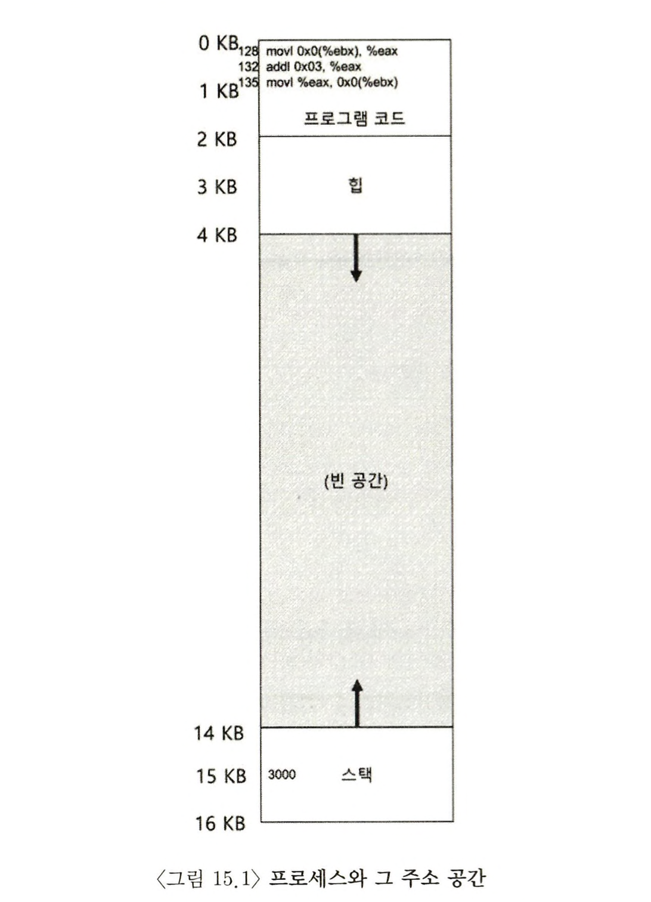
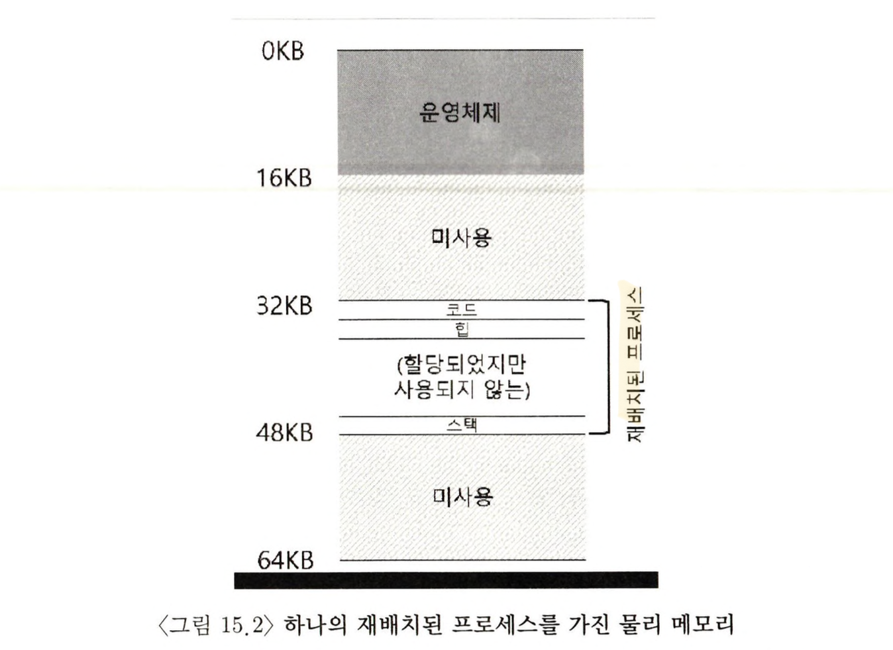
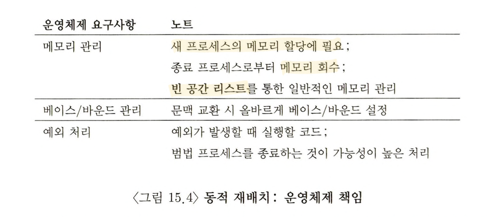
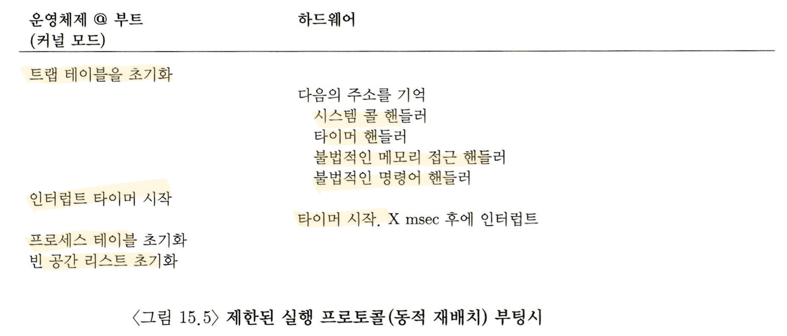

> 본 내용은 OSTEP 의 내용을 정리 및 요약한 내용입니다.
> 전문은 [이 곳](https://pages.cs.wisc.edu/~remzi/OSTEP/)을 방문하시면 보실 수 있습니다.

# 15. 주소 변환의 원리

CPU 가상화에서 `제한적 직접 실행(LDE)` 이라는 기법에 대해 공부했다. 타이머 인터럽트가 발생하는 상황에, 운영체제가 개입하여 문제 발생을 막거나, 하드웨어 지원을 통해 효율적인 가상화를 꽤한다. 중요한 순간 마다 운영체제가 관여하여 하드웨어를 직접 제어함으로써 효율성과 제어를 이루는 것이 현대 운영체제의 목표이다.

메모리의 가상화 역시 이와 비슷하다. 결국 `효율성` 과 `제어`를 동시에 추구하며, 이를 위한 핵심적인 내용은 상당히 쉬운 원리로 구성되어 있다(물론 뒤로 가면 징그럽게 어렵지만).

효율성을 위해선 몇 개의 레지스터를 사용하고, 이후에는 TLB와 같은 복잡한 하드웨어를 통해 얻어낸다. 제어는 응용 프로그램이 자기자신의 메모리 이외에 다른 메모리에 접근하지 못하는 것을 운영체제가 지원하는 것을 의미하며, 이러한 것들이 지켜지면서도 유연성 측면에서 메모리 가상화 시스템에서는 프로그래머가 원하는 대로 주소 공간을 사용하고, 프로그래밍 하기 쉬운 시스템을 만들어야 한다.

> 핵심 질문 : 어떻게 효율적이고 유연하게 메모리를 가상화하는가?

본 챕터에서 소개되는 내용은 **하드웨어 기반 주소 변환(hardware-based address translation)** 이라는 방식이다. 줄여서 **주소 변환(address translation)** 이라고도 부른다.

이 기술은 제한적 직접 실행 방식을 통해 얻게 된 부수적, 부가적 내용이라고 볼 수 있다. 주소 변환을 통해 하드웨어가 명령어의 반입, 탑재, 저장 등의 가상 주소를 실제 물리 주소로 변환한다.

단, 여기서 알아야 할 것은 하드웨어를 통해 제공되는 저수준의 기능들이 주소 변환을 가속시키긴 하지만, 근본적으로 하드웨어 만으로 메모리 가상화를 구현하는 것은 불가능하다. 운영체제의 관여도 무시할수 없는 것이다.

이러한 작업들의 목표를 정리하면, **프로그램이 자신의 전용 메모리를 소유하고 그 안에 자신의 코드와 데이터가 있다는 환상을 만드는 것**이라고 할 수 있겠다.

## 15.1 가정

가장 간단한 메모리 가상화 방식은 사실 아주 심플한 원리로 작동한다. 단, 운영체제가 간단한 구조일 것이라는 점에서 아래와 같은 가정을 반드시 해놓고 진행한다고 보면 된다.

> "사용자의 주소 공간은 물리 메모리에 연속적으로 배치되어야 한다."<br>
> "(논의의 단순화를 위해) 주소 공간의 크기가 과도하게 크지 않다."<br>
> "주소 공간은 물리 메모리의 크기보다 작고, 각 주소 공간의 크기는 같다."<br>

## 15.2 사례

```c
void func() {
	int x = 3000;
	x = x + 3; // 우리가 관심있는 코드
}
```

```plain
128: movl 0x0(\%ebx), \%eax  ; 0+ebx 를 eax에 저장
132: addl \%0x03. \%eax      ; eax레지스터에 3을 더한다.
135: movl \%eax, 0x0(\%ebx)  ; eax를 메모리에 다시 저장
```

위 명령어가 실행되면 이를 어셈블리 만든 것이 중간의 코드 블럭이며, 이 명령어 실행시의 프로세스 관점에서 다음과 같은 메모리 접근이 있었다고 볼 수 있다.

- 주소 128의 명령어를 반입
- 이 명령어 실행(주소 15KB에서 탑재)
- 주소 132 명령어를 반입
- 이 명령어 실행(메모리 참조 없음)
- 주소 135 명령어를 반입
- 이 명령어 실행(15KB에서 탑재)

프로그램의 과점에서 **주소 공간**은 주소 0에서 시작하여 약속된(최대) 16KB 까지이다.

기본적으로 프로세스의 모든 무리 주소는 0이 아닌 곳에 위치하다. 동시에 메모리는 이를 0에서 시작하는 것으로 **재배치** 하느냐가 우리가 해결할 문제에 가깝다.



## 15.3 동적(하드웨어 기반) 재배치

1950년대 첫 번째 하드웨어 기반 주소 변환은 초기형 시분할 컴퓨터에서 **베이스 와 바운드(base and bound)** 라는 간단한 아이디어가 채택되었다. 이 기술은 **동적 재배치(dynamic relocation)** 이라고도 한다.



각 CPU 마다 2개의 하드웨어 레지스터를 필요시 하며, 하나는 **베이스** 레지스터라고 불리고 하나는 **바운드** 레지스터라고 하여서, 이 두 레지스터의 값을 활용하여 원하는 위치의 주소 공간에 배치를 보장해준다. 동시에 프로세스가 오직 자신의 주소 공간에만 접근하는 것을 보장해준다.

기본적으로 컴파일 될 때는 주소 0부터 탑재되는 것으로 프로그램이 구성된다. 프로그램 시작과 더불어 물리 메모리 위치를 운영체제가 결정하고 나면, 해당 주소를 베이스 레지스터 값으로 지정하게 된다. 위의 예시에선 32KB 위치에서 코드가 시작하는 것으로 프로세스가 배치되는데, 이를 통해 주소 값이 베이스 레지스터를 통해 물리 주소로 변환된다.

`physical address = virtual address + base`

이렇듯 가상 주소에서 물리주소로의 변환은 **주소변환** 이라고 하며, 하드웨어는 프로세스가 참조하는 가상 주소를 받아 들여 데이터가 실존하는 물리 주소로 변화시킨다. 이 주소의 재배치는 실행 시 일어나고, 프로세스 실행 이후에도 주소공간을 이동할 수 있어서, **동적 재배치(dynamic relocation)** 라고 불린다.

이제 여기서 **바운드(한계)** 레지스터가 등장한다. 이름처럼 보호를 지원하기 위한 레지스터이다이다. 프로세서가 먼저 메모리 참조의 합법 여부를 판단하기 위해서, 바운드 레지스터는 운영체제에서 지정한 메모리 주소로 설정된다. 그리곤 프로세스가 바운드 보다 큰 가상주소 또는 음수인 가상 주소를 참조하려고 하면 CPU는 예외를 발생시켜 프로세스가 종료된다.

주소 변환에 도움을 주는 이러한 프로세서의 일부, 혹은 하드웨어를 `메모리 관리 장치(memory management unit, MMU)`라고 부른다. 이런 유닛들에 복잡한 관리 기법으로 변하고 추가하면, 그만큼 MMU 회로가 추가된다.

바운드 레지스터는 두 가지 방식으로 정의 될 수 있다. 하나는 `주소 공간의 크기`를 저장하는 방식으로 하드웨어는 가상 주소를 베이스 레지스터에 더하기 전에 먼저 바운드 레지스터와 비교한다. 두번째 방식은 `주소 공간의 마지막 물리 주소`를 저장하는 방식으로 하드웨어은 먼저 베이스 레지스터를 더해, 그 결과가 바운드 안에 있는지를 판단한다.

## 15.4 하드웨어 지원 : 요약

주소 변환을 위해 필요한 하드웨어 지원은 다음과 같다. 우선 **특권(커널)모드** 로 컴퓨터 전체에 대한 접근 권한을 운영체제가 가지고, 응용 프로그램은 **사용자 모드**에서 실행되며, 할 수 있는 일이 제한된다.

**프로세서 상태 워드(processor status word)** 레지스터의 한 비트가 CPU의 현재 실행 모드를 나타낸다. 이를 통해 특정 순간에 CPU 는 모드를 전환해가면서 할 수 있는 작업을 조절한다.

하드웨어는 베이스와 바운드 레지스터를 자체적으로 제공한다. CPU 는 메모리 관리 장치(MMU)의 일부인 추가 레지스터 쌍을 가진다. 프로그램이 실행 중인 경우 하드웨어는 프로그램이 생성한 가상 주소에 베이스값을 더하여 주소를 변환한다. 하드웨어는 이 주소가 유효한지 검사할 수 있어야 하며, 이 검사는 바운드 레지스터와 CPU 회로를 사용해야 한다.

하드웨어는 베이스와 바운드의 레지스터 값을 변경하는 명령어를 제공해야 한다. 다른 프로세스를 실행시킬 때 운영체제가 이 명령어를 사용해 베이스와 바운드 레지스터 값을 수정한다(특권모드).

마지막으로 CPU는 사용자 프로그램이 바운드를 벗어난 주소를 불법적 접근을 시도하려고 하면, 예외를 발생 시킬 수 있어야 한다. 이 경우 바운드에서 벗어남 에 대한 **예외 핸들러(exception handler)**가 실행되도록 조치를 취해야 한다. 기본적으로 이렇게 발생하는 문제들은 높은 확률로 기본적으로 프로세스를 종료시킨다.

## 15.5 운영체제 이슈

동적 재배치 지원을 위한 하드웨어가 신 기능을 제공하듯, 운영체제에서도 이를 위한 기능을 추가함으로써 가상 메모리 시스템을 구현하였다. 운영체제가 이를 위해 핵심적으로 개입되어야 하는 시점은 다음과 같다.

- **프로세스가 생성될 때 운영체제는 주소 공간이 저장될 메모리 공간을 찾아 조치를 취해야 한다.** <br>
  새로운 프로세스가 생성되면, 운영체제는 새로운 주소 공간 할당에 필요한 영역을 찾기 위해(흔히, **빈공간 리스트(free list)** 라고 불리는) 자료구조를 검색한다.
- **프로세스가 종료할 때, 즉 정상적으로 종료 되거나, 잘못된 행동으로 강제적으로 죽게 될 때 프로세스가 사용하던 메모리를 회수하여 다른 프로세스, 운영체제를 위한 공간을 재 확보해야 한다.** <br>
  프로세스가 종료되면 운영체제는 메모리 공간을 다시 빈공간 리스트에 넣고 연관된 자료구조를 모두 정리한다.
- **컨텍스트 스위칭(문맥교환)이 일어날 때** <br>
  레지스터 쌍은 각 프로그램마다 다른 값을 저장하게 될 것이고, 운영체제는 이를 복원해야 한다. 운영체제가 프로세스를 중단시키기로 결정하면, 운영체제는 메모리에 존재하는 프로세스 별 자료구조 안에 베이스, 바운드 레지스터의 값을 저장하고, 이러한 자료구조를 `프로세스 구조체(process structure)` 또는 `프로세스 제어 블럭(process control block, PCB)` 라고 부른다.

  

- **운영체제는 예외 핸들러 또는 호출될 함수를 제공해야 한다.** <br>
  부팅 시 특권 명령어를 사용하여, 핸들러르 설치한다. 운영체제는 불법 행위를 한 프로세스를 종료 시키고, 자신이 실행되는 컴퓨터를 보호해야 한다.

  
  

위 그림은 하드웨어/OS 간의 상호작용 타임라인으로 보여주는 것이다. 부팅 시 어떤 식으로 사용 가능한 상태로 만드는 지를 알 수 있다. 여기서 주목할 점은 **메모리 변환은 운영체제의 개입 없이 하드웨어에서 처리한다는 사실이다.** 기본적으로 운영체의 개입은 프로세스가 잘못된 행동을 했을 때에만 운영체제가 개입하여야 한다.

## 15.6 요약

이 장에서는 주소 변환이라는 가상 메모리 기법을 통해 제한적 직접 실행의 개념을 확장하였다. 주소변환을 사용하면 운영체제는 프로세스의 모든 메모리 접근을 제어할 수 있고, 접근이 항상 주소 공간의 범위 내에서 이루어지도록 보장할 수 있다. 이러한 기술적 효율성은 하드웨어 지원과 운영체제의 지원 두 가지가 함께하기 때문이다. 하드웨어 지원은 프로세스가 이해하는 메모리인 가상 주소를 실제 메모리 모습인 물리주소로 변환하며 이 변환을 빠르게 수행하도록 돕는다.

베이스와 바운드 또는 동적 재배치로 알려진 가상화 형태는 매우 효율적이며, 보호의 기능도 제공한다. 보호가 없다면 운영체제가 컴퓨터를 통제할 수는 없으며, 프로세스가 자유롭게 메모리를 덮어 쓸 수 있다면 트랩테이블을 덮어 씌워버려서 시스템을 장악하는 등의 일들을 쉽게 해낼 수 있다.

하지만 동적 재배치는 한 편으로 메모리를 비효율적으로 사용한다. 재배치된 프로세스는 물리 메모리를 사용하는데, 힙과 스텍 사이에 공간을 낭비하고 만다. 이러한 점에서 단편화가 발생하고 낭비가 되는데 이를 **내부 단편화(internal fragmentation)** 이라고 부른다. 지금까지 배운 방식은 더 많은 프로세스를 탑재할 수 있을 충분한 공간이 있어도 고정크기의 슬롯을 계속 만들어야 하고, 이 과정에서 내부에 쓸모 없는 공간이 발생하고 이는 비효율적일 수 있다. 이를 개선한 것이 `base-and-bound`를 일반화 하는 방법으로 `세그멘테이션(segmentation)`이라고 부르며, 다음장에 학습할 것이다.

```toc

```
