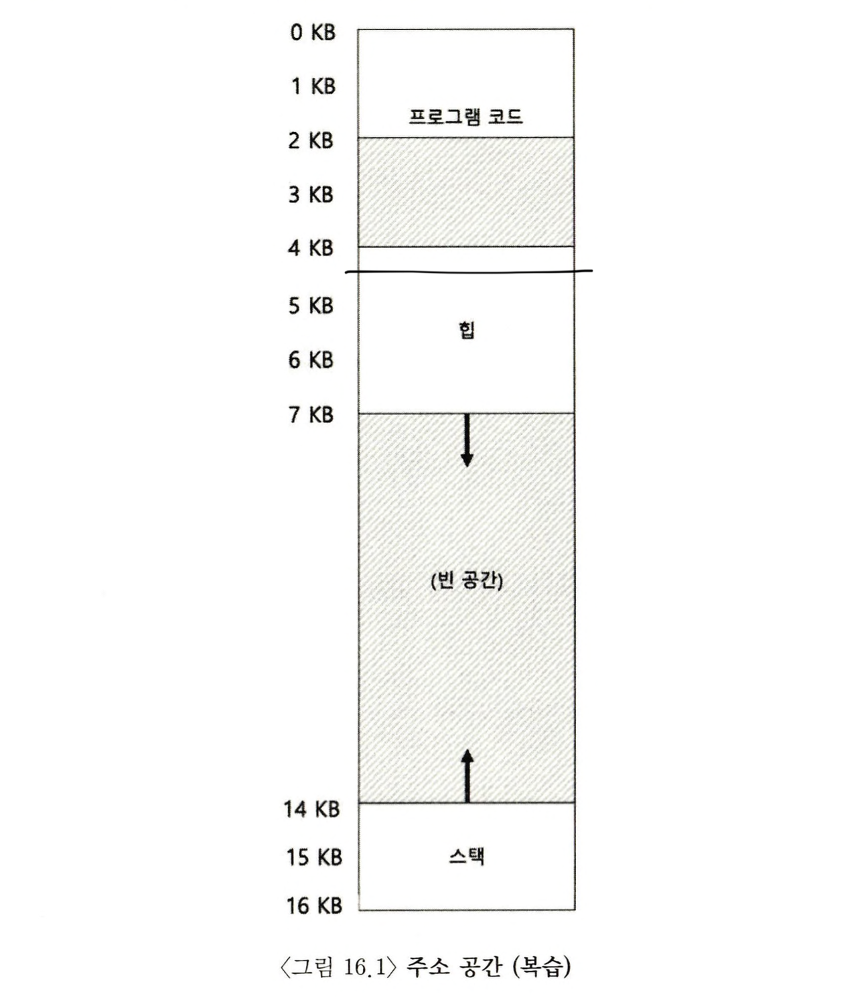
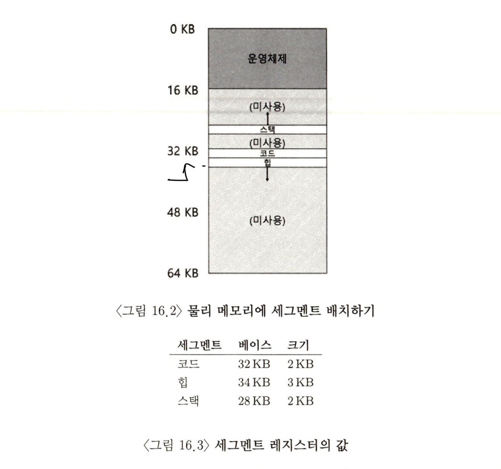
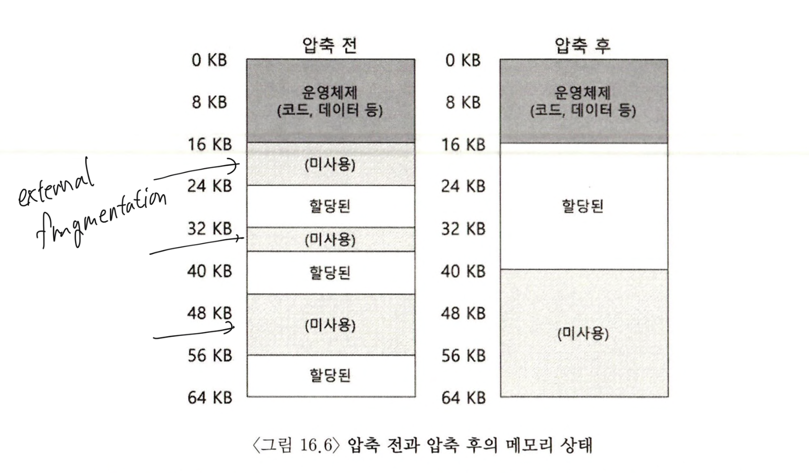

> 본 내용은 OSTEP 의 내용을 정리 및 요약한 내용입니다.
> 전문은 [이 곳](https://pages.cs.wisc.edu/~remzi/OSTEP/)을 방문하시면 보실 수 있습니다.

# 16. 세그멘테이션 (Segmentation)

베이스와 바운드 레지스터를 활용하는 방식은 운영체제가 프로세스를 물리 메모리의 다른 부분으로 쉽게 재배치 할 수 있게 해주었다. 하지만 이러한 형태는 가장 큰 문제로 스택과 힙 사이에 사용되지 않는 큰 공간이 존재한다는 점이다.



위 그림에서 볼 수 있드이 구조를 짜면서 공간이 여전히 사용되지 않으나 할당되는 구조를 갖고 있고, 물리 메모리에 재배치 할 때 물리 메모리를 차지하게 된다. 메모리 낭비가 심하다. 뿐만 아니라 주소 공간이 물리 메모리보다 큰 경우 실행이 매우 어렵다. 이런 점에서 베이스와 바운드 방식은 유연성이 없다고 볼 수 있다.

> 핵심 질문 : 대형주소공간을 어떻게 지원하는가?

## 16.1 베이스 / 바운드의 일반화

위에서 지적한 문제들을 해결하고자 나온 방식이 `세그멘테이션(segmentation)`이다. MMU에 하나의 베이스와 바운드 값이 존재하는 것이 아니라, `세그먼트(segment)`마다 `베이스`와 `바운드`값이 존재한다. 세그먼트는 특정 길이를 가지는 연속적인 주소 공간으로, 지금까지 나온 예시에서는 코드, 스택, 힙의 **세 종류의 세그먼트**가 있다고 보면 된다. 세그멘테이션을 사용하면 운영체제는 각 세그먼트를 물리 메모리 상에 다른 위치에 배치할 수도 있고, 사용되지 않는 가상 주소 공간이 물리 메모리를 차지하는 것을 방지할 수 있다.



16.1 이미지를 보면 사용되지 않은 영역이 많은 대형 주소 공간을 수용할 수 있지만,그렇게 못하고 있다.

이때 세그먼트를 지원하는 하드웨어 구조가 되면, 16.2, 16.3의 이미지 처럼 위치를 바꾸면서도 지정되어야 할 위치에 맞춰 작성이 가능하다.

여담이지만 이런 구조에서 힙의 마지막을 벗어난 주소로 접근하면, 운영체제에서 트랩을 발생시키게 되는데, 이 단어가 모든 C 프로그래머들의 공포의 대상인 `세그먼트 폴트(segment fault)`이다.

## 16.2 세그먼트 종류 파악

하드웨어는 변환을 위해 세그먼트 레지스터를 사용한다. 하드웨어는 가상 주소가 어느 세그먼트를 참조하는지, 이를 알 수 있어야 하고 가장 일반적인 접근 법이 가상 주소의 최상위 비트 몇 개를 세그먼트 종류를 나타내는데 사용하는 방법이다.


위 그림을 볼수 있듯, 최상위 2비트는 하드웨어에게 참조하는 세그먼트의 종류를, 하위 12 비트는 세그먼트 내의 오프셋이다. 오프셋에 베이스 레지스터 값을 더하여 하드웨어는 최종 물리 주소를 계산한다. 물리주소의 계산은 다음과 같은 식으로 된다.

```c
// 14 bit VA 중 상위 2 bit 를 얻음
int Segment = (VirtualAddress & SEG_MASK) >> SEF_SHIFT;
// 오프셋 얻기
int Offset = VirtualAddress & OFFSET_MASK;
if (Offset >= Bounds[Segment])
	RaiseException(PROTECTION_FAULT); // 경계를 돌파함
else {
	PhysAddr = Base[Segment] + Offset;
	Register = AccessMemory(PhysAddr);
}
```

단 이러한 방식에서 허점으로 볼 수 있는 것은 최상위 비트 중 `11`인 경우는 사용하지 않았기에 전체 주소 공간에 1/4은 사용이 불가능하다. 이러한 특징 때문에 일부 시스템은 코드와 힙을 하나의 세그먼트에 저장하고 세그먼트 선택 비트를 1비트만 사용하기도 한다. (사실 엄밀히 말하면, 다른 영역의 데이터들도 있다는 점에서 현대적 시스템이 여기서 언급하는 방식의 세그먼테이션 구조만 따르는 것은 아니다.)

## 16.3 스택

메모리 구조상 특징적인 부분이 있는데, 바로 다른 세그먼트들과는 다르게 반대 방향으로 확장된다는 것이다. 따라서 위에서 언급한 방식으로 물리 주소를 구하는 것은 불가능하다. 다른 방식의 변환을 위해선 **간단한 하드웨어를 추가**로 필요시 된다. 순방향과 그렇지 않은 경우를 나타낼 비트가 필요한 것이다. 그런데 기존의 예시에서 상위 2비트에서 안쓴 비트를 쓸 수 있으니, 이를 써서 세그먼트를 지정하는게 가능하다.

## 16.4 공유 지원

세그먼테이션 기법이 발전하면서, 하드웨어의 지원으로 새로운 종류의 효율성을 성취할 수 있다는 것을 깨닫게 되어 개발자들은 다른 방식, 메모리 세그먼트를 공유하는 것을 고려해 냈다. 특히 코드 영역을 공유하도록 하는 방식은 현재 시스템에서도 광범위하게 사용 중이다.

공유를 위해선 하드웨어를 통한 `protection bit`를 추가 해야 한다.
이 비트는 해당 공간이 **공유 할 수 있고** **수정이 되는지, 안 되는지**를 알수 있도록 하여서 `독립성`을 유지하면서도 **여러 프로세스가 주소 공간의 일부를 공유할 수 있다.**

사용자 프로세스가 읽기 전용 페이지에 쓰기를 시도하는 경우, 또는 실행 불가 페이지에서 실행을 하려고 하면 이를 운영체제는 예외를 발생시켜 막는다. 또 반대로 해당 내용이 읽기만 가능하다면 여러 프로세스에서 읽어 들여서 사용이 가능하다.

## 16.5 소단위 대 대단위 세그멘테이션

지금까지의 예제는 소수의 세그멘트를 지원하는데 집중하였다. 이러한 세그먼트는 대단위(coarse-grained)라고 생각할 수 있다. 그만큼 주소 공간을 **비교적 큰 단위의 공간으로 분할**하기 때문이다. 그런데 여기서 오히려 더 작은 단위로 잘게 나는 것을 허용하고 이러한 시스템 방식을 **소단위(fine-grained)** 세그멘테이션이라고 부른다.

세그멘트 정보를 모은 세그멘트 테이블을 저장하고, 이를 통하면 수천개의 세그먼트를 지원하였고, 컴파일러가 코드나 데이터를 여러 세그먼트로 분할할 경우 운영체제와 하드웨어가 이를 지원할 수 있게 하였고, 이를 통해 메인 메모리의 더 큰 효율적 활용을 가능케 했다.

## 16.6 운영체제의 지원

지금까지 개선된 세그멘테이션까지 메모리 가상화 시스템을 구축할 방법을 알아보았다. 그러나 여전히 이를 도입하기 위해 운영체제가 해결해야할 문제들이 남아 있다.

- 가장 첫 번째 문제는 `컨텍스트 스위칭(context switching)`과 관련된다. 이 경우 세그멘테이션을 사용시 운영체제는 `세그멘트 레지스터의 저장과 복원`을 해야 하며, 프로세스는 `자신의 가상 주소 공간을 인지`하고 `운영체제가 이를 올바르게 설정`해줘야 한다.
- 두 번째 문제는 `세그먼트의 크기 변경`이다. 운영체제가 그저 지정된 공간만 가지고 무언가를 처리하는 것이 아니라, 빈 공간이 없다면 힙 세그먼트 크기를 증가시키기 위해 시스템 콜을 활용한 라이브러리 함수를 활용한다.
- 마지막으로 `미 사용중인 물리 메모리 공간에 대한 관리 기능`이다. 새로운 주소 공간이 생성되면 운영체제는 이 공간의 세그먼트를 위한 **비어있는 물리 메모리 영역**을 찾을 수 있어야 한다. 물리 메모리는 프로세스가 탑재되어 슬롯의 집합이라고 생각하면 된다.

일반적으로 이러한 상황에서 생길 수 있는 문제로 물리 메모리가 빠르게 작은 크기의 빈공간들로 채워지는데, 그렇게 작은 빈 공간이 생겨, 전체로 봤을 때 공간은 충분함에도 세그먼트를 할당이 불가능한 경우가 발생한다. 이러한 문제를 **외부 단편화(external)** 라고 하다.

이 밖에도 세그먼트 크기를 키우는 요청을 받았지만, 다음 연속한 바이트를 쓸수 없다면, 운영체제는 설령 가능한 수준의 빈 메모리가 있음에도, 할당을 거절 할 수 밖에 없다. 이러한 문제 해결 책 중하나가 **압축(compact)** 하는 것이다.



압축은 위 이미지처럼 공간을 확보하고 작업이 가능한 큰 공간을 확보할 수 있다. 하지만 세그먼트의 복사는 메모리의 부하가 큰 연산이며, 일반적으로 상당량의 프로세서의 연산량을 사용한다.

이러한 상황에서 빈공간 리스트를 관리하는 알고리즘을 사용할 수 있다. **최적 적합(best-fit), 최악적합(worset), 최초 적합(first-fit), buddy-algortihm**과 같은 것들을 통해 최적화를 시킬 수 있다.

단, 이러한 방법을 쓰고 아무리 정교하게 만들어도 외부 단편화는 여전히 존재하며, 좋은 알고리즘을 통해 외부 단편화를 줄이는게 여전 중요한 포인트 이다.

## 16.7 요약

`세그멘테이션`은 많은 문제를 해결하며, 메모리 가상화를 효과적으로 실현할 수 있었다. 기존의 방식이 가지던 큰 공간에 대한 낭비도 줄여보았고, 세그멘테이션 방식으로도 생기는 문제점을 개선하고자 했다.

세그멘테이션에 필요한 산술 연산 자체는 쉽고, 하드웨어 구현에 적합하므로 속도도 빠르다. 변환 오버헤드도 최소이며, 코드 공유의 장점을 가지고 있다. 코드가 별도의 세그먼트에 공유되고 보호 받음으로써 실행중인 여러 프로그램이 코드를 공유하는 것이 가능해졌다.

그러나 **세그먼트의 크기는 일정하지 않아**, `외부 단편화`가 발생할 수 있으며, 메모리 할당 요청을 충족시키기 어려운 점도 있다. 이를 위해 비교적 **정교한 알고리즘**을 사용하거나, 주기적으로 **메모리를 압축**하는 방법도 제시되었다.
'
그러나 한가지 중요한 포인트는 세그멘테이션이 아직 일반적인 드문드문 사용되는 주소 공간을 지원할 만큼 **유연성**이 보장되지 못한다는 점이다. 주소 공간이 사용되는 모델과 이를 지원하기 위해 세그멘테이션 설계방법이 정확히 일치하지 않는다면, 세그멘테이션은 정상 동작을 하지 않는다.

```toc

```
