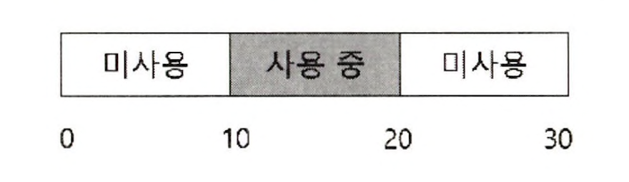
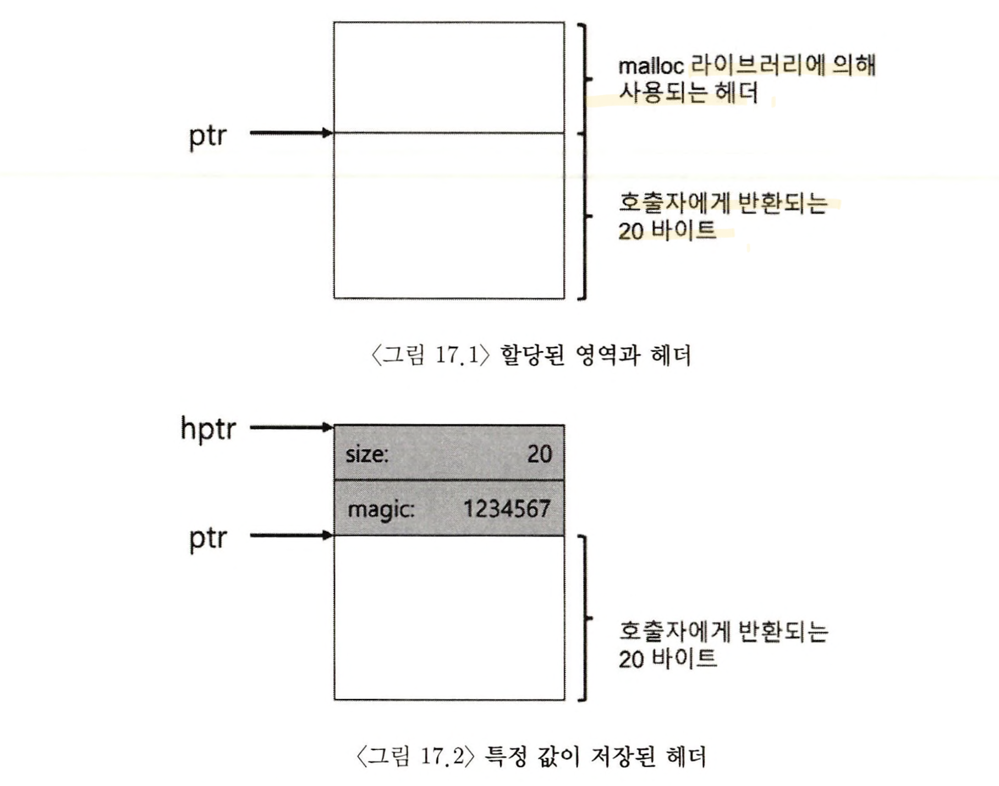
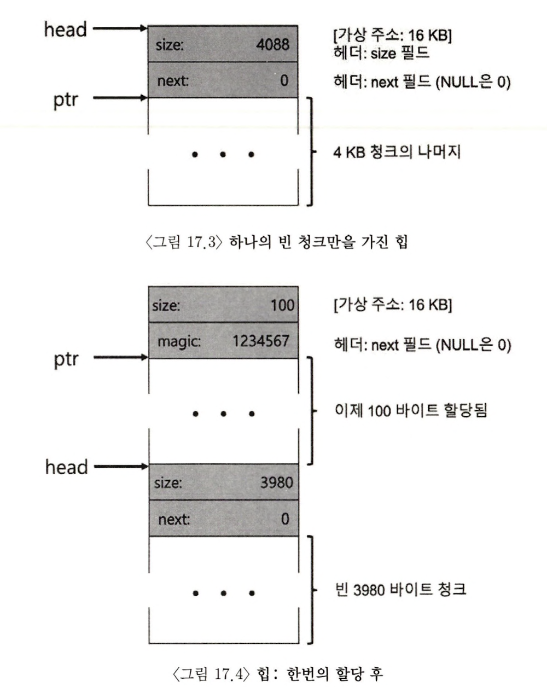
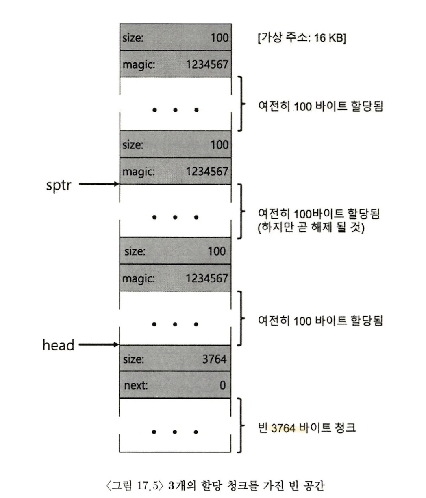
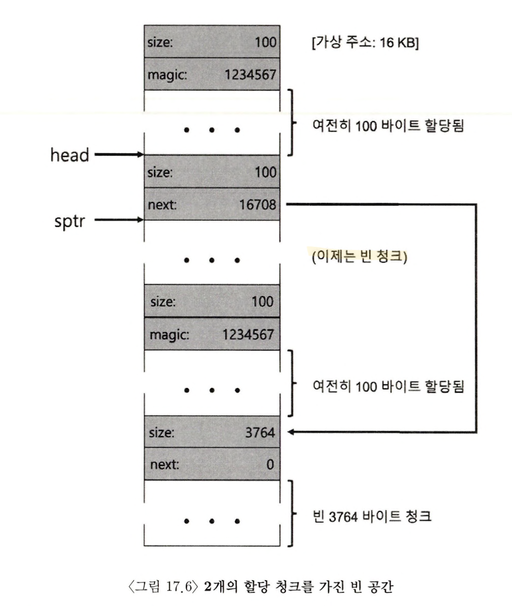
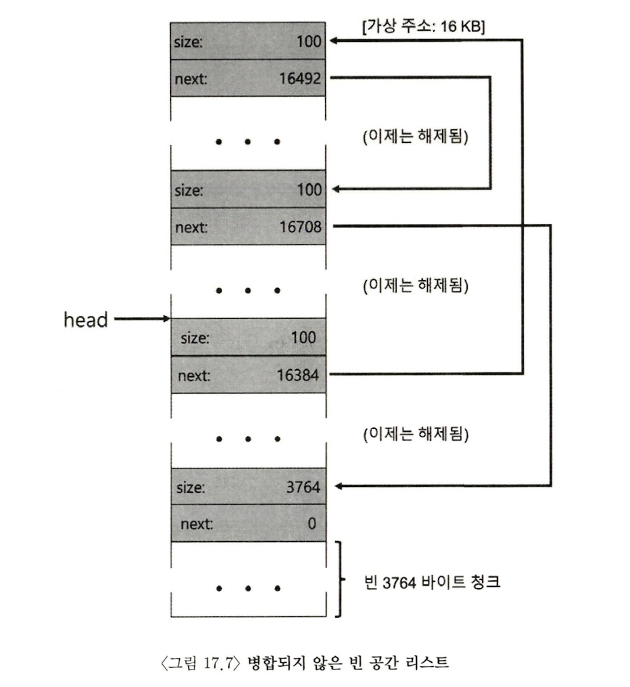
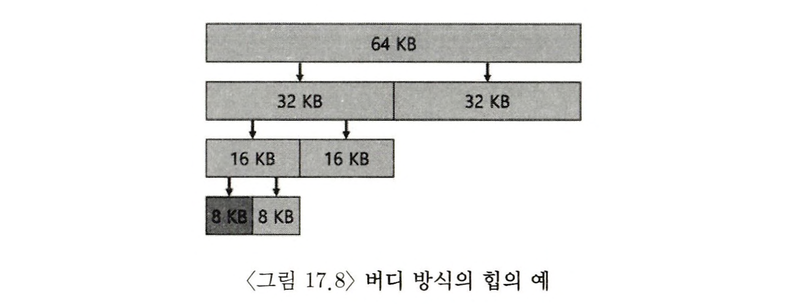

> 본 내용은 OSTEP 의 내용을 정리 및 요약한 내용입니다.
> 전문은 [이 곳](https://pages.cs.wisc.edu/~remzi/OSTEP/)을 방문하시면 보실 수 있습니다.

# 17. 빈 공간 관리

메모리 관리 시스템이란 프로세스 힙의 페이지를 관리하는 malloc 라이브러리일 수도 있고 혹은 프로세스의 주소 공간의 일부분을 관리하는 운영체제 자체일 수 있다. 구체적으로 이 장에서 논의 할 내용은 **빈 공간 관리** 에 대한 내용이다.

빈 공간에 대한 관리는 **페이징**의 개념을 논의 하게되면 상대적으로 쉬운 논제가 되지만, 빈 공간 관리가 더 어렵고, 흥미롭게 되는 것은 공간이 가변크기인 빈 공간들의 집합으로 구성되어 있는 경우이다. 이 경우는 malloc()과 free()에서 처럼 사용자 수준 메모리-할당 라이브러리에서, 그리고 **세그멘테이션**으로 물리 메모리를 관리하는 운영체제에서 발생할 수 밖에 없다.

이러한 상황에서 **외부 단편화**가 존재하며, 그런 과정에서 빈 공간들의 전체 크기가 요청된 것보다 크더라도, 하나의 연속된 영역이 존재하지 않으면 요청의 실패가 발생할 수 밖에 없다.



위 그림은 이러한 상황을 적절하게 보여주는 예시이다. 빈 공간 전체가 **20바이트**가 되지만, 10바이트로 쪼개지면서 20바이트가 있음에도 **10바이트 이상의 할당 요청에 대해선 실패를 반환**할 수 밖에 없다. 이것을 해결하려는 논의가 바로 이 장에서의 핵심이다.

> **핵심질문 : 빈 공간을 어떻게 관리하는가?**<br/>
> 가변 크기의 요구를 충족 시켜야 할 때, 빈 공간은 어떻게 관리 되어야 하는가?<br/>
> 단편화를 최소화 하기 위해 어떤 전략을 사용할 수 있는가?<br/>
> 여러 대안들의 시간과 공간의 오버헤드는 어떻게 되는가?

## 17.1 가정

빈공간 관리에 대한 이해를 위해 다음과 같이 가정하고 진행한다.

- 이 논의 대부분에서 `사용자 수준 메모리 할당 라이브러리`에 존재하는 메모리 할당기의 발전 역사와 함께 논의가 이어질 것이다.
- 더불어 malloc(), free() 와 같이 제공하는 것과 같은 기본 인터페이스를 가정하고 문제에 접근한다.
- 이 라이브러리가 관리하는 공간은 역사적으로 `힙(heap)`으로 불리며, 힙 내의 빈 공간을 관리하는 데는 일반적인 `링크드 리스트`가 사용된다.
- 논의 중에 가장 중요시 할 것은 `외부 단편화` 방지이다. 물론, 여기에는 `내부 단편화` 문제도 있을 수 있다.
  - `내부 단편화`란 할당기가 요청한 크기보다 더 큰 메모리 청크를 할당, 요청되지 않아서, **사용되지 않을 공간에 대해서 낭비가 발생하는 것**을 내부 단편화로 간주한다.
- 클라이언트에게 할당된 메모리는 다른 위치로 **재 배치 될 수 없다**고 가정한다. 따라서 단편화 해결에 유용하게 사용되는 빈 공간의 **압축**은 본 장에서는 사용할 수 없는 것으로 간주하며, 다음장 **세그멘테이션** 파트에서 이에 대해 언급할 것이다.

## 17.2 저수준 기법들

세부 정책에 대해서 설명하기 전에, 대부분의 할당기에서 사용되는 일반적인 기법에 대해 논의한다.

### 분할과 합병


빈 공간 리스트는 힙에 있는 빈 공간들의 집합이다. 위의 이미지는 30 바이트의 힙이 있다는 가정에서 그려진 이미지이다.


주소 10에서 시작하는 10바이트는 점유되어 있으며, 그 외에 주소 0에서 10바이트, 주소 20에서 10바이트가 비어있어 빈 세그먼트로 표현된다.

이러한 경우 문제시 되는 것은 **10바이트를 초과하는 모든 요청은 실패로 NULL을 반환한다는 점** 이다. 단, 반대로 10바이트 미만의 크기 요청이 들어오면 할당기는 **분할(spliting)** 로 알려진 작업을 수행하게 된다.

할당기는 요청을 만족하는 빈 청크를 발견하고 그에 따른 분할을 시도한다.


이러한 분할 기법에 당연히 동반 되는 기법이 바로 빈 공간의 **병합** 이다. free()를 통해 반환되게 되면, 결과적으로 다시 전체 20바이트짜리 빈 공간 리스트화 되는 것이다. 이렇게 확인하는 아이디어는 간단한데, 메모리 청크를 반환시 인접한 빈 청크 주소를 검사하여 기존보다 더 큰 빈 공간으로 병합하면 다음과 같은 모습이 된다.


### 할당된 공간의 크기 파악

`free(void *ptr)` 인터페이스는 크기를 매개 변수로 받지 않는다. 포인터 인자로 전달되면 malloc() 라이브러리는 해제 되는 메모리 영역의 크기를 신속히 파악하고, 그 공간을 빈 공간 리스트에 추가 시킬 수 있다고 가정한다. 메모리 상에 데이터 유무는 중요하지 않다. 해당 내용을 전부 지우는 방식은 그만큼 오버헤드가 커진다.

이 작업을 위해 대부분의 할당기는 추가 정보를 **헤더(header)** 블럭에 저장한다. 헤더 블럭은 메모리에 유지되며 보통 해제된 청크 바로 직전에 위치한다.



헤더는 적어도 할당된 공간의 크기는 저장해야 한다. 해제 속도 향상을 위한 `추가 포인터`, 무결성 검사를 위한 `매직 넘버`, 및 `기타 정보`들을 헤더에 저장할 수 있다.

다음과 같이 할당 영역의 크기와 매직 넘버를 저장하는 간단한 헤더를 가정해보자.

```c
typdef struct {
	int size;
	int magic;
} header_t;
```

만약 free()를 호출하게 되면 다음과 같이 헤더의 시작 위치를 파악하기 위한 포인터 연산이 일어날 것이다.

```c
void free(void *ptr) {
	header_t * hptr = (header_t *) ptr - 1;// header 위치를 파악함.
	// header_t 만큼으로 포인터 계산 가능하게 만들고(형변환)
	// -1을 해줌으로써 그 앞에 header_t 만큼 이동하게 되고, header에 접근이 가능해진다.
}
```

헤더를 가리키는 포인터를 얻어 내면, 라이브러리는 매직 넘버가 기대하는 값과 일치 여부를 비교하여 **안전성 검사(sanity check)** 를 실시한다. `assert(hptr->magic == {special value})`

그런 뒤 새로 해제 된 영역의 크기를 간단한 계산을 진행하고, 여기서 빈 영역의 크기는 헤더 크기 더하기 사용자에게 할당된 영역의 크기가 된다는 점을 주의해야 한다.

이 말은 반대로 사용자가 N바이트의 메모리 청크를 요청하면, 라이브러리는 N바이트 + header를 위한 공간 청크까지 탐색을 해야한다.

### 빈 공간 리스트 내장

빈 공간 리스트의 개념을 지금까지 다루었다. 이러한 리스트를 빈 공간에 어떻게 구현할 수 있는가.

보통의 새로운 노드를 위한 공간이 필요시 malloc()을 호출한다. 그러나 메모리 할당 라이브러리 루틴에서 이것이 불가능하고, 대신 빈 공간 내에 리스트를 구축해야 한다. 예를 들어 4096바이트 크기의 메모리 청크가 있다고 보자. 즉, 힙 크기는 4KB이며 시작시 리스트에 4096 길이의 항목이 하나 존재한다. 이 리스트 노드의 설명은 다음과 같다.

```c
typedef struct __node_t {
	int size;
	struct __node_t * next;
} node_t ;
```

힙을 초기화하고 힙에 빈 공간 리스트의 첫 번째 원소를 넣는 코드를 살펴보자. 힙은 시스템 콜 mmap() 을 호출하여 얻어진 영역에 구축된다고 가정한다.

```c
// mmap() 이 빈 공간의 청크에 대한 포인터를 반환
node_t * head = mmap(NULL, 4096, PROT_READ|PROT_WRITE, MAP_ANON|MAP_PRIVATE, -1, 0);
head->size = 4096 - sizeof(node_t);
head->next = NULL;
```

위 코드를 실행하고 나면 빈 공간 리스트의 크기는 4088의 항목 하나를 생성하게 된다.



자, 이제 100 바이트 메모리 청크가 요청되었다고 가정해보자. 우선 충분한 크기의 청크를 찾아야 할 것이고, 현재 하나의 빈 청크(4088 바이트) 만이 존재하므로, 이 청크가 선택된다. 빈 영역의 크기 더하기 헤더 크기 만큼의 청크이므로, 가상 헤더주소 16KB 부근에서 헤더, 100바이트를 할당 한다. 그 모습은 그림 17-4를 참고하면 될 것이다.

100 바이트 요청에 대해 라이브러리는 기존 하나의 빈 청크 중 `108 바이트`를 할당한다. 나중에 free() 에서 사용할 수 있도록 할당된 공간 직전의 8바이트에 헤더 정보를 넣는다. 이렇게 되면 나머지 빈 블록은 3960 바이트로 축소 된다.

이번엔 100바이트씩 총 3개의 공간이 할당된 힙의 영역을 보자.



위 그림을 보면 알 수 있듯, 힙 시작 부분부터 `324바이트(108 * 3)`가 현재 할당되어 있다. 빈 공간 리스트는 여전히 head 가 가리키는 하나의 노드로 구성되어 있고, 전체 중 3764 바이트로 축소된 상태다.

그렇다면 여기서 free()로 일부 메모리가 반환되었다면 어떻게 되겠는가?

라이브러리는 신속히 빈 공간의 크기를 파악하고, 빈 청크를 빈 공간 리스트에 삽입한다.



이제 빈 공간 리스트의 첫 번째 원소는 **작은 빈 청크**, 그 다음 **나머지 큰 빈 청크**를 갖게 되고, `단편화`가 발생된 양상이다.

마지막으로 2개의 사용 중인 메모리 공간도 반환되었다고 하면 어떤 일이 벌어질까? 빈 공간 리스트는 총 4개의 청크를 갖게 되고, 단편화된 채인 모습 그대로임을 알 수 있다. 즉 리스트의 병합이 없기 때문에, 반환되었으나 파편화 자체는 전혀 해결되지 않은 것이다.

이러한 경우 해결책은 간단하게, **리스트를 순회하면서 인접한 청크를 병합**하는 방법으로 해결할 수 있다.



### 힙의 확장

마지막 주제로 힙 공간이 부족하다면 어떻게 대응 할 것인가? **가장 쉬운 실패 반환은 역시 NULL 을 반환하는 것**이다.

대부분 전통적인 할당기는 적은 크기의 힙으로 시작하여 모두 소진한 경우, 운영체제로부터 더 많은 메모리를 요청한다. 보통 특정 시스템 콜을 활용하는데, Unix 시스템에선 `srbk` 를 호출한다. 해당 요청을 수행하기 위해 운영체제는 빈 물리 페이지를 찾아 요청 프로세의 주소 공간에 매핑한 후 새로운 힙의 마지막 주소를 반환한다. 이제 더 큰 힙을 사용하며, 요청은 성공적으로 충족한다.

## 17.3 기본 전략

지금부터는 빈 공간 할당을 위한 기초적 전략들에 대해서 배운다. 핵심은 이상적인 할당기는 `속도가 빠르고`, `단편화를 최소화` 해야 한다. 이번 장에서는 이러한 할당의 정책 중 최선의 정책, 최신의 정책을 설명하는 것이 아닌 가장 기본적인 정책의 원리와 그것들의 장단점을 논의한다.

### 최적 적합(Best Fit)

**최적 적합** 전략은 먼저 빈 공간 리스트를 검색하며, **요청 크기와 같거나 더 큰 빈 메모리 청크를 찾는 로직**이다. 그뒤 그 후보 그룹 중에선 가장 작은 크기의 청크로 `최적 청크`를 발견해 낸다. 최소 적합이라고도 불리며, 빈 공간 리스트 한 번의 순회로 정확한 블럭을 찾아낸다.

이를 사용하는 이유는 **사용자 입장에서 가장 가까운 블럭을 반환함으로써 공간 낭비를 최소화** 하려는 것이다. 하지만 정교하지 않은 구현이 되면 빈 블럭을 찾기 위해 항상 **전체 순회를 해야 하는 만큼** 로직 자체가 근본적으로 성능 저하를 일으킨다.

### 최악 적합(Worst Fit)

**최악 정합** 은 최적의 적합과 정 반대로, **가장 큰 빈 청크를 찾아 요청을 처리하는 구조이다.** 이러한 방식을 쓰는 이유는 최적 적합 방식에서 발생 가능한 **작은 청크들을 방지(외부 단편화 방지)** 를 위해서이다. 하지만 이 역시 **전체 순회를 하는 구조** 이므로 성능 저하(오버헤드)가 상당하는 단점이 있다.

### 최초 적합(First Fit)

**최초 적합** 은 간단하게 **요청보다 큰 첫 번째 블럭을 찾고, 요청 만큼 반환하는 구조**를 갖는다. 이러한 로직의 장점은 탐색을 전체 선회 하는 것이 아니니 **속도가 빠르다.**

그러나 때때로 리스트의 시작부분에 크기가 **작은 객체가 많이 생길 수 있고,** 이에 빈 공간 리스트 순서를 관리하는 방법이 정교해야 한다. 이에 대해 한 가지 방법으로 **주소-기반 정렬(address-based ordering)** 을 사용하는 것이다. 리스트를 주소로 정렬하여 병합이 쉽고, 단편화를 감소시킨다.

### 다음 적합(Next Fit)

항상 리스트의 처음부터 탐색을 하지만, **다음 적합** 알고리즘은 **마지막으로 찾았던 원소를 가리키는 추가 포인터를 유지한다.** 이 로직의 핵심은 빈공간 탐색을 **리스트 전체에 더 균등하게 분산**시키는 것이다. **리스트의 첫 부분에 단편이 집중적으로 발생하는 것을 방지한다.** 이 방식은 전체를 탐색하지 않아서, 최초 적합과 성능이 비슷하다.

### 예제

위에서 언급한 전략이 동작하는 예시를 정리해보자. 크기가 각각 10, 30, 20인 세개의 원소를 가진 빈 공간 리스트를 생각해본다.


크기가 15인 요청이 들어왔다고 가정하자. 최적 적합 방법은 전체 리스트에서 검색해서 요청을 만족시키는 청크 중 가장 적합한 20을 선택한다.


이 예에서 와 같이 최적 적합의 경우 종종 작은 청크를 남긴다. 최악 적합의 방식은 유사하지만 대신 가장 큰 청크를 찾아낸다. 그렇기에 이 예라고 한다면 30을 선택하게 된다.


이 예에서 최초 적합 전략은 최악 전략과 같은 결과를 도출한다. 요청을 충족하는 첫 번째 빈 블럭을 찾는 것, 이때 차이점은 탐색 비용이다. 최초 적합은 단지 적합한 청크를 발격할 때까지만 탐색하므로 탐색 비용이 최소화 된다.

## 17.4 다른 접근법

단순한 최적 적합 할당에 그치지 않고 다양하게 생각해보고자, 다른 메모리 할당 기술과 알고리즘도 몇 가지 소개한다.

### 개별 리스트

**개별 리스트(segregated list)** 라는 아이디어는 특정 응용 프로그램이 한 두개 자주 요청하는 크기가 있다면, **그 크기의 객체를 관리하기 위한 별도의 리스트를 유지하는 것이다**. 다른 모든 요청은 더 일반적인 메모리 할당기로 전달되는 방식이다.

이 방법은 `특정 크기의 요청`을 위한 메모리 청크를 유지함으로써, 단편화 가능성을 상당히 줄이며, 복잡한 리스트 검색이 필요하지 않으므로 할당과 해제 요청을 신속히 처리한다.

그러나 이러한 이점 만큼이나 새로운 문제를 야기시킨다. 지정된 크기의 메모리 풀과 일반적인 풀의 할당 비중을 어떻게 설정할 것인가? 이러한 문제를 잘 해결한 것은 **슬랩 할당기** 에 대해 해결 방법을 제시한다.

커널이 부팅 시 커널 객체를 위한 여러 **객체 캐시(object cache)** 를 할당한다. 커널 객체란 락, 파일 시스템 아이노드 등 자주 요청되는 자료구조를 일컫는다. 객체 캐시는 지정된 크기의 객체들로 구성된 빈 공간 리스트이며, 메모리 할당 및 해제 요청을 빠르게 서비스 하기 위해 사용된다. 기존에 할당된 캐시 공간이 부족하면, 상위 메모리 할당기에게 추가 **슬랩**을 요청한다. 요청된 전체 크기는 페이지 크기의 정수배이며,반대로 슬랩 내 객체들에 대한 참조 횟수가 0이 되면 메모리 할당기는 이 슬랩을 회수한다.

이러한 슬랩 할당 방식은 빈 객체들을 사전에 초기화된 상태로 유지한다는 점에서, 개별리스트 방식보다 우수하다. Bonwick은 자료구조의 초기화, 반납은 많은 시간이 소요되는데, 슬랩 할당기는 이러한 부분에서 작업을 피할 수 있고, 오버헤드를 그만큼 줄여냈다.

### 버디 할당

합벽은 할당기에 매우 중요한 기능이므로 합병을 보다 간단히 하는 방법들이 제시된다. 그 중에 하나가 **이진 버디 할당기(binary buddy allocator)** 이다. **빈 메모리는 처음에 개념적으로 크기가 2의 N 승인 하나의 큰 공간으로 생각된다. 메모리 요청 발생 시 요청을 만족시키는 충분한 공간이 발견될 때까지 빈 공간을 2개로 계속 분할한다.**



이 방식의 경우 2의 거듭제곱 크기 만큼 블럭을 할당할 수 있어서, 내부 단편화로 고생할 수는 있다. 하지만 핵심은 블럭이 해제될 때, 8KB 블럭을 빈 공간 리스트에 반환하며 버디인 8KB를 확인하고, 비어있으면 이를 병합한다. 할당기는 이제 다음 16KB 버디를 검사하는식으로 계속 재귀적 합병을 이루어낸다. 이러한 버디 할당은 특정 블럭의 버디를 결정하는 것이 쉽고, 따라서 복잡한 과정 없이 합병에 용이성을 끌어올린다.

### 기타 아이디어

앞에서 설명한 접근 방식들의 한 가지 문제점은 **확장성** 이다. 빈 공간들의 개수가 늘어남에 따라 결국 전체든, 일부든 **리스트 검색의 비용이 증가하고 느려진다**. 이에 좀더 정교한 할당기는 복잡한 자료구조를 사용하여 이 비용을 줄이려한다.

- [균형 이진 트리(balanced binary tree)](https://gdlovehush.tistory.com/156)
- [스플레이 트리(splay tree)](https://box0830.tistory.com/147)
- [부분 정렬 트리(partially ordered tree)](https://ko.wikipedia.org/wiki/%EB%B6%80%EB%B6%84_%EC%88%9C%EC%84%9C_%EC%A7%91%ED%95%A9)

등이 이러한 문제점에서 착안되어 개선된 좋은 예이다.

뿐만 아니라 현대의 시스템은 멀티 프로세서를 위해 할당기 최적화의 노력이 있다.

## 17.5 요약

본 장에서 가장 기본적인 메모리 할당기의 로직과 그 형태에 대해 논의했다. 이러한 할당기의 이해는 작성하는 모든 프로그램 뿐 아니라 운영체제에 내에서도 사용된 다. 메모리 할당기 구축하는데 워크로드를 정확히 이해할 수록 메모리 할당기가 더 잘 작동하도록 최적화가 가능하며, 다양한 워크로드에 대한 빠르고 효율적이며 확장성이 용이한 개발의 가능성을 제시한다. 더불어 이러한 제시란 현대 컴퓨터 시스템에서 당면한 문제이다.

```toc

```
