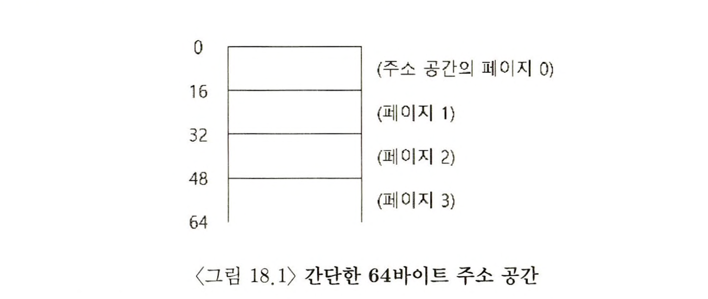
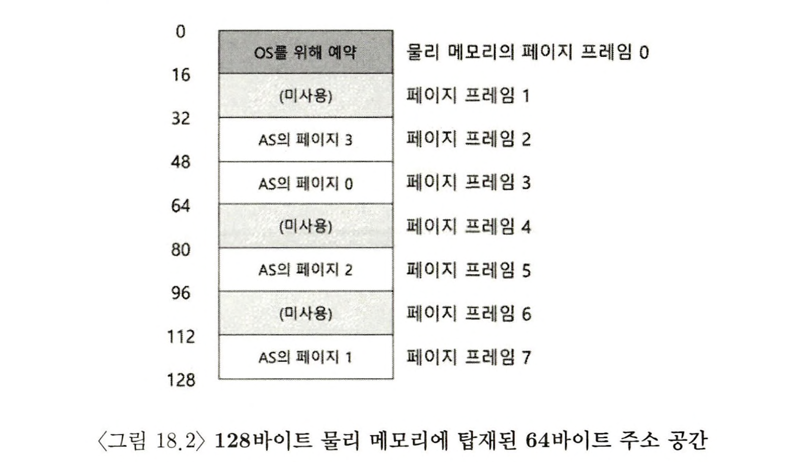
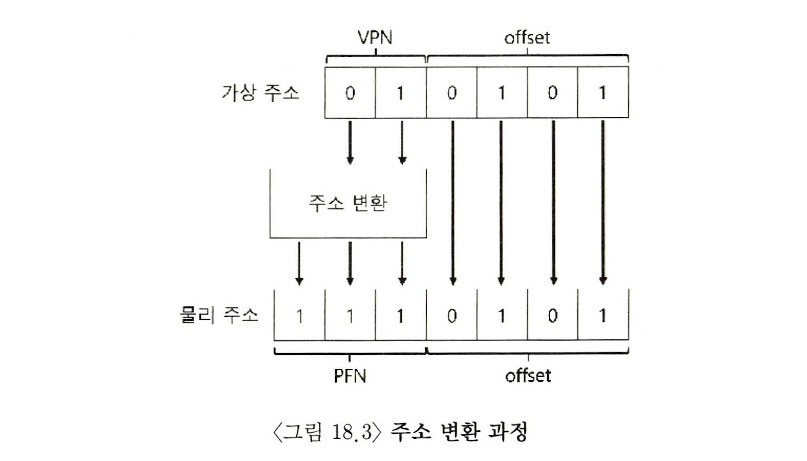
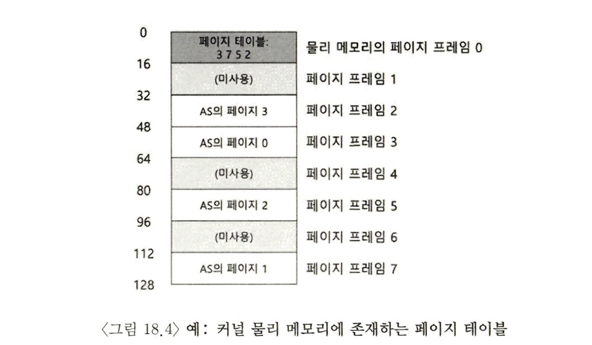
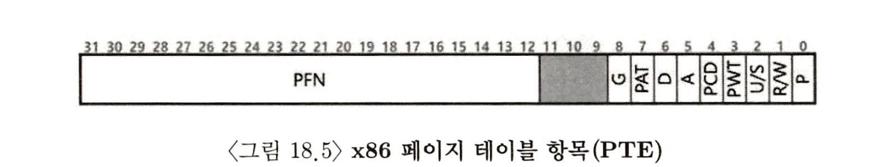
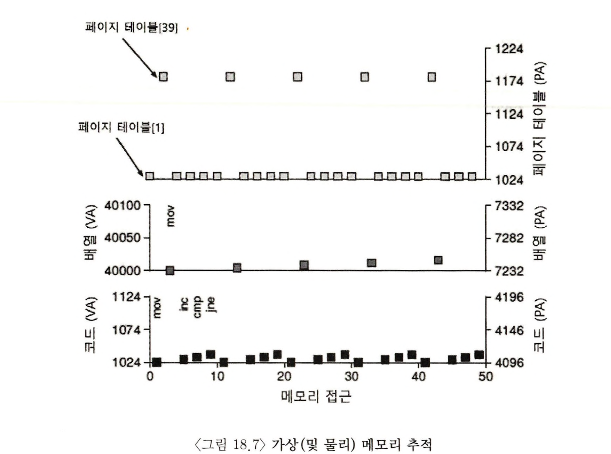

> 본 내용은 OSTEP 의 내 용을 정리 및 요약한 내용입니다.
> 전문은 [이 곳](https://pages.cs.wisc.edu/~remzi/OSTEP/)을 방문하시면 보실 수 있습니다.

# 페이징 : 개요

운영체제의 공간을 관리할 때, 크게 두 가지 방법으로 관리가 가능하다. 첫 번째 방법은 세그멘테이션 파트에서 봣듯이 `가변크기`의 조각들로 분할하는 것이다. 그러나 이 방법은 태생적인 문제를 갖고 있는데 이는 청크로 분할할 때 공간 자체가 **단편화** 될 수 있고, 할당은 점점 어려워지며, 성능적 제한이 있다는 사실이다.

두 번째 방법은 공간은 동일 크기의 조각으로 분할하는 **페이장(paging)** 이라는 아이디어가 바로 그것이다. 프로세스의 주소 공간을 몇 개의 가변 크기의 논리 세그먼트로 분리하는 것이 아니라, 고정 크기의 단위로 나눈다. 이 각각의 고정 크기 단위를 `페이지` 라고 부르며, 상응 하는 물리 메모리도 `페이지 프레임(page frame)` 이라고 불리는 고정 크기의 슬롯의 배열이라고 생각한다. 이 프레임은 각각 하나의 가상 메모리 페이지를 저장할 수 있다.

> 핵심 질문 : 페이지를 사용하여 어떻게 메모리를 가상화 할 수 있을까?<br/>
> 세그멘테이션의 문제점을 해결 하기 위해 페이지를 사용하여 어떻게 메모리를 가상화 할까?<br/> 기본적인 기법은 무엇인가?<br/> 공간과 시간 오버헤드를 최소로 하면서 그 기법이 잘 동작하기 위한 방법은 무엇이 있을까?

## 18.1 간단한 예제 및 개요



위 그림을 보며 개념을 이해해보자. 위 그림에서 총 크기가 64바이트이면서, 4개의 16바이트 페이지로 구성된 작은 주소 공간을 보여준다.

물리 메모리는 아래 그림처럼 고정 크기의 슬롯들로 구성되고, 이 경우 8개의 페이지 프레임 총 128 바이트의 비현실적으로 작은 물리 메모리 사진이다.



그림에서 보듯, 가상 주소 공간의 페이지들은 물리 메모리 전체에 분산 배치되어 있다. 또한 운영체제가 자기 자신을 위해서 물리 메모리 일부를 사용하고 있는 것도 보여준다.

이 방식은 상당히 많은 장점을 가진다. 그 중의 특히나 중요한 개선은 **유연성**의 확대이다. 페이징을 사용하면 프로세스의 **주소 공간 사용 방식과는 상관없이 효율적**으로 주소 공간 개념을 지원할 수 있다.

또 하나의 장점으로 페이징이 제공하는 빈 공간 관리의 **단순함** 이다. 운영체제는 페이지가 정해져있고 필요한공간 만큼의 페이지를 찾기만 하면 되고, 위 그림처럼 AS 프로세스를 위한 페이지를 그저 지정하고 페이지와 페이지프레임끼리 연결되었음을 갖고 만 있으면 해결된다.

주소 공간의 각 가상 페이지에 대한 물리 메모리 위치를 기록하기 위해, 운영체제는 프로세스 마다 **페이지 테이블(page table)** 이라는 자료구조를 유지한다. 이 페이지 테이블이라는 자료 구조는 주소 공간의 가상 페이지 **주소 변환(address translation)** 정보를 저장한다. 페이지 테이블을 활용하여 각 페이지가 지정된 물리 메모리의 위치가 어디인지 알려주는 역할을 한다.

반드시 기억해야 하는 사항은 **`프로세스 마다` 페이지 테이블을 갖고 있다**는 사실을 알아야 하며, 예외적으로 **역페이지 테이블** 이란 기법도 존재한다. 어쨌든 운영체제는 특정 프로세스를 생성하고 구동하기 위해선 페이지 테이블이 필요하다.

이제 주소 변환 준비가 되었다고 생각하고, 그 예시를 생각해보자. 작은 주소 공간(64비트)을 가진 프로세스가 다음 메모리에 접근을 수행한다고 가정하자.

```assembly
movl <virtual address>, %eax
```

프로세스가 생성한 가상 주소의 변환을 위해선, 먼저 가상 주소를 **가상 페이지 번호(virtual page number, VPN)** 와 페이지 내의 **오프셋** 2개의 구성요소로 분할한다. 이 예에선 가상 주소 공간 크기가 64비트이므로, 가상 주소는 6비트가 필요하다.


<br/>
위 그림에서 Va5가 가상 주소의 최상위 비트이며 Va0는 최하위 비트를 나타낸다. 우리는 페이지의 크기를 알기에(16바이트) VPN은 2비트, 나머지 4비트가 오프셋임을 알 수 있다.

페이지 크기는 64비트 주소 공간에서 16비트로 표현된다. 따라서 4 페이지를 선택할 수 있어야 하므로 VPN은 최상위 2비트로 표현이 되며, 나머지가 오프셋을 나타내는 것이다. 여기서 오프셋이란 우리가 원하는 바이트의 위치를 나타내며, 이를 오프셋이라고 부른다.

프로세스가 가상 주소를 생성하면, 운영체제와 하드웨어는 이를 의미있는 물리 주소로 변환한다. 예로써 위 탑재 명령어의 가상주소가 21이라고 하자.

```assembly
movl 21, %eax
```

21이라는 숫자를 이진 형식으로 변환하면 `010101`을 얻고, 이 가상주소를 검사하고, VPN과 Offset으로 나누면 다음처럼 된다.


가상 페이지는 01, 오프셋은 5번째(0101) 바이트 라는 걸 알수 있었다. 이제 이 가상 페이지 번호를 가지고 페이지 테이블의 인덱스로 사용하여 물리프레임에 저장되어 있는지 찾을 수 있다. 위의 페이지 테이블에서 **물리 프레임 번호(physical frame number, PFN)**, 혹은 **물리 페이지 번호(physical page number, PPN)** 은 7이다(이진수 111).



여기서 주의 할 것은 오프셋은 페이지 내에서의 원하는 위치를 알려주는 것이므로, 다른 계산이 필요하진 않는다. 그리하여 최종적으로 물리 주소는 1110101(십진수 117)라는 것을 알게 된다.

여기까지가 페이지를 활용한 메모리 가상화의 기본적인 개요이며, 이에 대한 심화된 질문을 고려해보자. 페이지 테이블은 어디에 저장되는가? 페이지 테이블의 내용은 무엇이며, 테이블의 크기는 얼마인가? 페이징은 시스템을 느리게 만들지 않는가? 이들과 추가적 질문에 대해서 논의를 해볼 것이다.

## 18.2 페이지 테이블은 어디에 저장되는가

`페이지 테이블`은 세그먼트 테이블이나, 베이스-바운드 쌍에 비해서 **상당히 커질 수 있는 구조**이다. 예를 들어 4KB 크기의 페이지를 가지는 전형적인 32비트 주소 공간을 생각해보면, 20비트의 VPN, 12 비트 오프셋으로 구성된다. 20비트 VPN은 운영체제가 각 프로세스를 위해 관리해야하는 변환의 개수가 2의 20승이라는 것이며, 어림잡아 페이지를 어림잡아 백만개 관리할 수 있다는 소리에 해당한다. 물리 주소로 변환 정보와 다른 필요한 정보를 저장하기 위해 **페이지 테이블 항목(page table entry, PTE)** 마다 4바이트가 필요하다고 한다면, 각 페이지 테이블을 저장하기 위해 4MB의 메모리가 필요한 것이고, 이는 프로세스가 100개 실행된다면 운영체제가 주소 변환의 기능 만을 위해 400MB가 필요하다는 소리가 된다.

페이지 테이블이 매우 크기 때문에 **현재 실행 중인 프로세스의 페이지 테이블을 저장할 수 있는 회로를 MMU 안에 유지하진 못할 것이다.** 따라서 각 프로세스의 페이지 테이블을 **메모리**에 저장한다. 당분간의 논의에서 페이지 테이블은 운영체제가 관리하는 물리 메모리에 상주한다고 가정할 것이다

## 18.3 페이지 테이블에는 실제 무엇이 있는가

**페이지 테이블**은 가상 주소 또는 실제로 가상 페이지 번호를 물리주소(물리 프레임 번호)로 매핑 하는데 사용하는 자료구조다. 이를 구현하는데는 어떤 자료 구조이든 상관은 없지만 **선형 페이지 테이블(linear page table)** 이 가장 단순한 배열 형태로 물리 프레임 번호(PFN)을 찾기 위해 가상 페이지 번호(VPN) 로 배열의 항목에 접근하고 그 항목의 페이지 테이블 항목(PTE)를 검색한다.



이후의 장에서는 페이징과 관련된 문제 해결을 위해 고급의 자료구조를 사용할 것이다.

일단 각 PTE에는 심도 있는 이해가 필요한 비트들이 있고, 이를 소개해보고자 한다.



- Valid bit :
  - 개념 : 특정 변환의 `유효 여부`를 나타내는 비트
  - 프로그램이 실행을 시작 할 때 사용 공간은 유효하고, 미 사용 공간은 `무효(invalid)` 로 표시되고 프로세스가 그런 메모리에 접근하려고 하면 `운영체제에 트랩`을 발생시킨다. 이 경우 운영체제는 그 프로세스를 종료시킬 확률이 높다.
  - 이 비트는 할당되지 않은 주소 공간을 표현하기 위해 반드시 필요하다. 주소 공간의 미사용 페이지를 모두 표시함으로써 이러한 페이지들에게 물리 프레임을 할당할 필요를 없애 대량의 메모리를 절약한다.
- Protection bit
  - 개념 : 페이지가 `읽기`, `쓰기`, `실행`의 권한 중 어떤게 가능한지를 표현하는 비트.
  - Protection bit 가 허용한 방식 외에 `페이지에 접근`하려고 하면 운영체제에서`트랩`을 생성한다.
- Present bit : 이 페이지가 `물리 메모리` 혹은 `디스크`에 있는지를 가리킴
- dirty bit : 메모리에 반입된 후 페이지의 `변경 여부`를 확인한다.
- reference bit(또는 accessed bit) : 페이지가 접근되었는지를 추적하기 위해사용된다. 어떤 페이지가 인기 있는 지를 결정하고, 메모리 유지의 되어야 한다.

> 여담 : Valid bit 가 없는 이유는 무엇인가?<br/>
> 인텔의 예처럼 valid bit와 present bit 를 개별적으로 사용하지 않고 present bit 만을 사용한다. <br>Present bit 가 설정되면(P=1), 페이지가 메모리가 있고 유효하다는 것을 의미한다. P = 0 이면, 페이지가 유효하긴 하지만 메모리에 없거나 혹은 유효하지 않다는 것을 의미한다. P = 0인 페이지를 접근하면 OS 로 트랩이 트리거 된다. OS는 자신이 유지하고 있는 별도의 자료 구조를 사용하여 페이지가 유효한지 혹은 유효하지 않은지 를 결정해야 한다. 이러한 종류의 현명한 판단은 하드웨어에서 일반적인 것으로 종종 OS가 완전한 서비스를 구축할 수 있는 '최소한' 기능 집합을 제공한다.

x86 페이징 지원에 대한 내용은 Intel Architecture Mannuals 를 참조하면 좋다.

## 18.4 페이징 : 너무 느림

지속적으로 페이지 테이블을 이야기 했고, 구조적으로나 메모리 상에서 매우 크게 증가될수 있음을 시사했고, 그러다보니 처리속도의 저하는 당연히 수반된다.

주소 21에 대한 참조만을 고려하고 명령어 반입은 고려하지 않는다고 할 때, 하드웨어가 주소 변환을 담당한다고 보자. 정확한 물리주소 117로 변환을 하고, 데이터 반입하기 전에 시스템은 프로세스의 페이지 테이블에서 적절한 페이지 테이블 항목을 가져와야 하고, 변환을 수행한 후 물리 메모리에서 데이터를 탑재한다.

이렇게 하기 위해서, 하드웨어는 실행중인 프로세스의 페이지 테이블 위치를 알아야 하고, 이에 대해 당분간은 하나의 페이지 테이블 베이스 레지스터(page table base register)가 페이지 테이블의 시작 주소(물리주소)를 저장한다고 가정한다. PTE 를 구하는 연산은 다음처럼 수행된다.

```plain
VPN = (VirtualAddress & VPN_MASK) >> SHIFT
PTEAddr = PageTableBaseRegister + (VPN * sizeof(PTE))
```

VPN 을 구하기 위해 VPN_MASK 를 통해 전체 가상 주소에서 VPN 비트만을 골라낸다. SHIFT를 통해 비트 연산을 진행하고, 우리가 원하는 페이지 베이스 레지스터에 VPN에 PTE 실제 사이즈를 곱해서 더해주면 실제 PTE 배열에 대한 인덱스를 사용한다.

이 물리주소가 알려지면, 하드웨어는 메모리에서 PTE 를 반입할 수 있고, PFN을 추출한 뒤, 가상 주소의 오프셋과 연결하여 원하는 물리 주소를 만든다.

```plain
offset = VirtualAddress & OFFSET_MASK
PhysAddr = (PFN << SHIFT) | offset
```

위의 코드에서 보듯 가상 주소에서 OFFSET_MASK 로 오프셋 값만을 추출한 뒤, PFN을 자기 위치로 옮긴 뒤, 오프셋을 비트 연산 OR을 통해 최종 주소를 형성한다.

마지막으로 하드웨어는 메모리에서 원하는 데이터를 가져와서 eax 레지스터에 넣을 수 있고, 프로그램은 이제 메모리에서 값을 성공적으로 탑재하게 된다.

아래 코드를 보면 처리 방법을 보여준다.

```c
// 가상 주소에서 VPN 추출
VPN = (VirtualAddress & VPN_MASK) >> SHIFT
// 페이지 테이블 항목 (PTE)의 주소 형성
PTEAddr = PTBR + (VPN * sizeof(PTE))
// PTE 반입
PTE = AccessMemory(PTEAddr)
// 프로세스가 페이지 접근 가능 여부 확인.
if (PTE.Valid == False)
	RaiseException(SEGMENTATION_FAULT)
else if (CanAccess(PTE.ProtectBits) == False)
	RaiseException(PROTECTION_FAULT)
else
	// 접근 가능하면 물리 주소 만들고 값 가져오기
	offset = VirtualAddress & OFFSET_MASK
	PhysAddr = (PTE.PFN << PFN_SHIFT) | offset
	Register = AccessMemory(PhysAddr)
```

모든 메모리 참조에 대해 먼저 페이지 테이블에서 변환정보를 반입해야하고, 따라서 반드시 한 번 추가적인 메모리 참조가 필요하다. 메모리의 참조는 비용이 비싸고 이 경우에 프로세스는 2배 이상 느려진다.

이를 통해 하드웨어와 소프트웨어의 신중한 설계 없이는 페이징 테이블로 인해 시스템의 과다한 메모리 사용이 나타난다. 따라서 페이징이 메모리 가상화에 필요한 훌륭한 해결책이 되기 위해 두 분야에 대한 신중한 설계가 핵심적인 문제로 대두된다.

## 18.5 메모리 트레이스

모든 메모리 접근을 살펴보면 다음과 같은 형태가 된다.

```c
// 가상 주소에서 VPN 추출
VPN = (VirtualAddress & VPN_MASK) >> SHIFT
// 페이지 테이블 항목 (PTE)의 주소 형성
PTEAddr = PTBR + (VPN * sizeof(PTE))
// PTE 반입
PTE = AccessMemory(PTEAddr)
// 프로세스가 페이지 접근 가능 여부 확인.
if (PTE.Valid == False)
	RaiseException(SEGMENTATION_FAULT)
else if (CanAccess(PTE.ProtectBits) == False)
	RaiseException(PROTECTION_FAULT)
else
	// 접근 가능하면 물리 주소 만들고 값 가져오기
	offset = VirtualAddress & OFFSET_MASK
	PhysAddr = (PTE.PFN << PFN_SHIFT) | offset
	Register = AccessMemory(PhysAddr)
```

> 여담 : 자료구조 -- 페이지 테이블
> 현대 운영체제 메모리 관리 서브 시스템에서 가장 중요한 자료 구조 중 하나는 **페이지 테이블** 이다. 페이지 테이블은 가상-물리주소 변환(Virtual-to-Physical address translation)을 저장하여 주소 공간의 각 페이지의 물리 메모리 위치를 알 수 있게 한다. 현대의 시스템은 운영체제에 의해 관리된다.



## 18.6 요약

메모리 가상화에 대한 해결책으로 페이징을 소개하였다. 페이징은 세그멘테이션과 같은 기존의 방식과는 다르며, 많은 장점을 가진다. 페이징은 하드웨어적으로 메모리를 특정 단위로 분할한다. 그리고 가상 주소 공간에 빈 부분이 많아도, 이에 대한 효율적 지원이 가능하다.

하지만 페이징에선 페이지 테이블 접근을 해야 한다는 절차 때문에, 시스템 성능 저하와 페이지 테이블을 위한 메모리 공간 할당으로 인한 메모리 낭비의 가능성이 존재한다.

```toc

```
