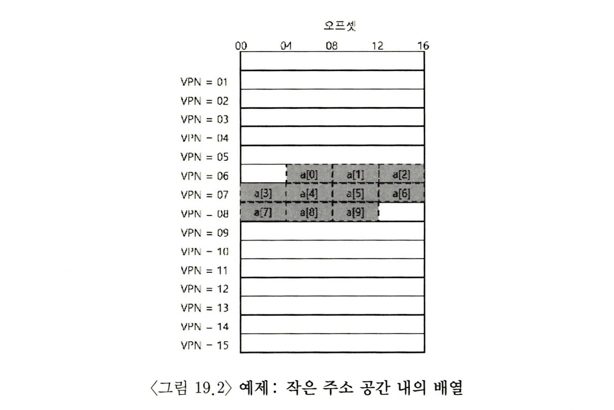
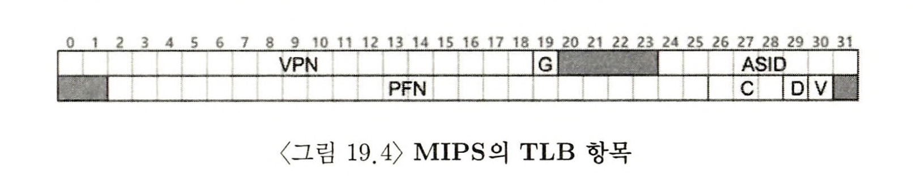

> 본 내용은 OSTEP 의 내용을 정리 및 요약한 내용입니다.
> 전문은 [이 곳](https://pages.cs.wisc.edu/~remzi/OSTEP/)을 방문하시면 보실 수 있습니다.

# 페이징 : 더 빠른 변환(TLB)

페이징은 성능 저하를 유발한다. 페이징은 주소 공간을 일정하게 페이지 사이즈로 크기를 나눈 뒤 각 페이지 실제 위치(매핑 정보, mapping information)를 메모리에 저장한다. 매칭 정보를 저장하는 자료구조가 페이지 테이블이며, 각 프로세스당 하나씩 생성된다. **가장 중요한 것은 가상 주소에서 물리주소로 변환하면서 메모리에 존재하는 매핑 정보를 읽어야 한다는 사실이고, 이때 엄청난 성능저하를 수반한다는 점이다.** 이에 이와같이 질문할 수 있을 것이다.

> 핵심 질문 : 주소 변환 속도를 어떻게 향상할까<br/>
> 주소 변환을 어떻게 빨리 할수 있을까? 페이징에서 발생하는 추가 메모리 참조를 어떻게 피할 수 있을까? 어떤 하드웨어가 필요하며, 운영체제는 어떤식으로 개입해야 할까?<br/>

운영체제의 실행 속도를 개선하기위해선 도움이 필요하고, 하드웨어로부터의 도움이 필요하다. 주소변환 속도를 향상하기 위해 **변환-색인 버퍼(translation-lookaside buffer)** 또는 **TLB**라고 부르는 것을 도입한다.

**TLB는 칩의 메모리 관리부(memory-management unit, MMU)의 일부다. 자주 참조되는 가상 주소-실주소 변환정보를 저장하는 하드웨어 캐시이다.** 엄밀히 말하면 **주소-변환 캐시(address-translation cache)** 좀더 적합한 명칭이다. 가상 메모리 참조 시 하드웨어는 먼저 TLB에 찾는 변환 정보가 있는지를 확인하고, 이를 통해 모든 페이지 테이블을 통하지 않고 변환을 빠르게 수행한다.

```c
// 19.1 TLB 제어 흐름 알고리즘
VPN = (VirtualAddress & VPN_MASK) >> SHIFT
(Success, TlbEntry) = TLB_Lookup(VPN)
if (Success == True) // TLB 히트
	if (CanAccess(TlbEntry.ProtectBits) == True)
		Offset = VirtualAddress & OFFSET_MASK
		PhysAddr = (TlbEntry.PEN << SHIFT) | Offset
		Register = AccessMemory(PhysAddr)
	else
		RaiseException(PROTECTION_FAULT)
else // TLB 미스
	PTEAddr = PTBR + (VPN * sizeof(PTE))
	PTE = AccessMemory (PTEAddr)
	if (PTE.Valid == False)
		RaiseException(SEGMENTATION_FAULT)
	else if (CanAccess(PTE.ProtectionBits) == False)
		RaiseException(PROTECTION_FAULT)
	else
		TLB_Insert(VPN, PTE.PFN, PTE.ProtectionBits)
		RetryInstruction()
```

## 19.1 TLB의 기본 알고리즘

위 그림을 보면 가상 주소 변환 과정을 나타내고 있다. 위 예시는 주소 변환부가 단순한 **선형 페이지 테이블(linear page table)** 과 **하드웨어로 관리 되는 TLB**에 대한 대부분의 책임을 관리한다.

하드웨어 부분의 알고리즘은 다음과 같이 동작한다. 가상주소에서 가상 페이지 번호를 추출하고, 해당 VPN의 TLB 존재 여부를 파악한다. 이때 **TLB 히트**가 되어 정보가 발견되면 TLB 항목에서 페이지 프레임 번호(page frame number, PFN)를 추출할 수 있다. 해당 페이지에 대한 접근 권한 검사가 성공시, 그 정보를 원래 가상 주소의 오프셋과 합쳐 물리주소(PA)를 구성하고 접근한다.

**TLB 미스**가 발생하면, 그때 부터 하드웨어가 변환정보를 찾기 위해 페이지 테이블에 접근한다. 프로세스가 생성한 가상 메모리 참조가 유효하고 접근 가능하면, 해당 변환정보를 TLB로 읽어 들인다. 여기서 많은 읽고 쓰기의 소요되는 작업이다. 페이지 테이블을 접근을 위한 메모리 참조 때문이며, TLB가 갱신되면 하드웨어는 명령어를 재 실행하고 이번엔 HIT하게 된다.

모든 캐시 설계의 철학처럼 TLB 역시 **"주소 변환 정보가 대부분의 경우 캐시에 있다."** 는 가정과 전제로 만들어졌고, TLB는 프로세싱 코어와 가까운 곳에 있으며, 빠른 하드웨어로 구성되어 있다. 따라서 주소 변환 작업은 크지 않으며, 미스 시에 페이징 비용이 커진다.

중요한 점은 메모리 접근 연산은 다른 CPU 연산에 비해 상당히 오버헤드가 크다. TLB 미스가 많이 발생할 수록 메모리 접근 횟수가 늘기에 이를 개선하는게 중요하다.

## 19.2 예제: 배열 접근



위의 예시를 위해 배열의 예시를 생각해보자.

```c
int sum = 0;
for (int i = 0; i < 10; i++)
	sum += a[i];
```

예를 들어 가상 주소 100번지부터 10개의 4바이트 크기 정수 배열이 존재하고, 가상 주소 공간은 8비트이며, 페이지 크기가 16 바이트라고 가정해보자. 이때 가상 주소 VPN은 4비트, 4비트 오프셋으로 구성된다.

배열 상에서 원소를 읽는 동안 TLB의 동작은 미스, 히트, 히트, 미스, 히트, 히트, ... 이런 식으로 접근하게 된다. 즉 TLB는 **공간 지역성(spatial locality)** 으로 인해 성능을 개선한 것이다. 만약 페이지 크기가 두배가 된다면 그만큼 TLB 미스 횟수가 줄 것이고, 성능 저하를 최소화 할 수 있다.

> 팁 : 가능하면 캐싱을 사용하자<br>
> 하드웨어 캐시 사용의 근본 취지는 명령과 데이터 참조에 있어서 지역성(localty)을 활용하는 것이다. 일반적으로 지역성에는 시간 지역성, 공간 지역성이 있다. 시간 지역성은 최근 접근된 명령어 또는 데이터는 곧 다시 접근 될 확률이 높다는 사실에 근거한 지역성이며, 공간 지역성은 프로그램이 메모리 주소 x를 읽거나 쓰면 x와 인접한 메모리 주소를 접근할 확률이 높다는 사실에 근거한다.

**이러한 지역성의 특성을 활용하게 되면, 그만큼 프로그램의 메모리 읽기, 참조 시 성능을 최적화시킬 수 있게 된다.**

## 19.3 TLB 미스는 누가 처리할까?

TLB의 미스는 어떻게 처리하며, 어디서 담당을 할까? 여기에는 두가지 구현 방법이 있다. 하드웨어, 소프트웨어 방식인데, 과거엔 **CISC(complex instruction set computers)** 라는 하드웨어를 활용하는 복잡한 명령어 방식을 사용했다. TLB 미스를 하드웨어가 처리하며, 페이지 테이블에 대한 명확한 정보를 가지고 있어야 한다. 미스가 발생하면 다음과 같은 일이 일어난다.

- 페이지 테이블에서 원하는 페이지 테이블 엔트리를 찾는다
- 필요한 변환 정보를 추출한다
- TLB를 갱신한다
- TLB 미스가 발생한 명령어를 재 실행한다.

```c
// 19.3 TLB 제어 흐름 알고리즘(운영체제가 관리)
VPN = (VirtualAddress & VPN_MASK) >> SHIFT
(Success, TlbEntry) = TLB_Lookup(VPN)
if (Success == True) // TLB 히트
	if (CanAccess(TlbEntry.ProtectBits) == True)
		Offset = VirtualAddress & OFFSET_MASK
		PhysAddr = (TlbEntry.PEN << SHIFT) | Offset
		Register = AccessMemory(PhysAddr)
	else
		RaiseException(PROTECTION_FAULT)
else // TLB 미스
	RaiseException(TLB_MISS)
```

이에 비해 최근에 발생한 컴퓨터 구조 **RISC(reduced instruction set computing)** 도 존재 한다. 이는 **소프트웨어 관리 TLB(software-managed TLB)** 를 사용한다. 만약 TLB가 미스가 발생하면, 하드웨어는 예외(exception) 시그널을 내고, 운영체제는 명령어 실행을 잠정 중지, 실행 모드를 커널 모드로 변경하고, 커널 코드를 실행할 준비를 한다. 커널 모드에선 특권 레벨로 상향 조정하는 것이며, 트랩 핸들러는 페이지 테이블을 검색하여 변환정보를 찾고, TLB 접근이 가능한 특권 명령어를 사용해 TLB를 갱신하고, 이를 리턴한다. 이제 트랩 핸들러는 하드웨어가 명령어를 다시 실행하게 하고, 미스가 아닌 히트가 나게 되면서 명령어를 재 실행된다.

여기서 중요한 점을 집고 넘어가면,

1. **TLB 미스를 처리하는 트랩 핸들러는 시스템 콜 호출 시 사용되는 트랩 핸들러와 차이가 있다.** 일반적인 프로시저 콜이 리턴되면, 프로시저 호출 후 다음 라인부터 시작된다. 하지만 TLB 미스 처리는 트랩에서 리턴 후, 리턴을 발생시킨 명령어를 다시 실행하며, 재실행 시 TLB 히트가 되도록 한다.
2. **TLB 미스 핸들러 실행 시, TLB미스가 무한 반복되지 않도록 해야 한다.** TLB 미스가 계속 발생해버리는 경우 등이 해당된다.
   이러한 상황에 대한 해결법으로 TLB 미스 핸들러를 물리 메모리에 위치시키는 것도 한 방법이다. TLB 미스 핸들러의 주소는 핸들러의 물리 주소로 표시하는 방식이다.

TLB 를 소프트웨어로 관리하는 방식의 주요 장점은 **유연성** 이다. 운영체제는 하드웨어 변경 없이 페이지 테이블 구조를 자유롭게 변경이 되며, 두번째론 **단순함** 이란 장점을 가진다. 미스 발생 시 하드웨어가 하는 일은 많지 않으며 그저 예외 발생, 운영체제가 TLB 미스 핸들러를 호출하고, 핸들러가 나머지 일을 처리한다.

## 19.4 TLB의 구성: 무엇이 있나?

하드웨어 TLB의 구성은 32, 64 또는 128개의 엔트리를 가질 수 있고, **완전 연관(fully associative) 방식**으로 설계된다. 완전 연관 방식에서 변환정보는 TLB 내에 어디든 위치할 수 있고, 원하는 변환정보를 찾는 검색은 TLB 전체에서 병렬적으로 수행된다. TLB 구성은 아래와 같다.

`VPN | PFN | 다른 비트들`

하드웨어 측면에서 보면, TLB의 각 항목을 동시 검색이 가능하도록 구성되어 있다.

TLB 는 일반적으로 다른 비트들도 유의미한 의미를 갖고 있다. valid bit 는 유효한 변환 정보를 갖고 있는지 나타낸다. **보호(protection) 비트** 라는 것도 있어서, 그 쓰임새를, 접근 방법 제한을 나타낸다. 그 외에 다양한 비트들이 존재하며, 차 후에 자세히 알아볼 예정이다.

> 여담 : TLB valid bit != 페이지 테이블 valid bit<br>
> 이 두개를 혼동하면 안된다. 페이지 테이블에서 valid bit = 0은 어떤 페이지 테이블 항목(page-tabl entry, PTE)이 "무효"로 표시 되었다는 것, 해당 페이지는 프로세스에게 할당되지 않았다는 것을 의미한다.<br>
> 반면 TLB의 valid bit 는 TLB에 탑재 되어 해당 변환 정보가 유효한지를 나타내기 위해 사용된다. 시스템이 시작되면 어떤 변환정보도 들어있지 않아서, TLB 모든 항목은 "무효"로 초기화 되어 있다. 가상 메모리가 초기화되고, 프로그램들이 실행을 시작하여 자신의 가상 주소 공간을 접근하게 되면, TLB는 차례로 채워지게된다.<br>
> 더불어 valid bit 는 문맥전환 시, 참고하여 TLB 항목이 문맥 전환 되어야 하는지 여부를 확인하고, 새로운 프로세스가 이전 프로세스의 변환정보를 사용하는 것을 원천적으로 차단한다.<br>

## 19.5 TLB의 문제: 문맥 교환

TLB 를 사용하면 프로세스 간의 컨텍스트 스위칭(문맥 교환)을 진행하면서 새로운 문제가 발생한다. **한마디로 정리하면 TLB에 있는 가상 주소와 실제 주소 간의 변환정보는 그것을 탑재 시킨 프로세스에만 유효하다.** 다른 프로세스에는 의미가 없다. TLB가 정확하고 효율적으로 멀티 프로세스 간의 가상화를 지원하려면 추가적 기능이 필요한 것이다. 핵심은 다음과 같다.

> 핵심 질문 : 문맥 교환 시 TLB내용을 어떻게 관리하는가?

한 가지 방법은 문맥 교환을 수행할 때 다음 프로세스가 실행되기 전에 기존 TLB 내용을 비우는 것이다. 소프트웨어 기반의 시스템에서는 특별한 하드웨어 명령어를 사용하여, 이 목적을 달성할 수 있다. **하드웨어 기반의 TLB 체계에선 페이지 테이블 베이스 레지스터가 변경될 때 비우기 시작한다.** 둘 중 어느 경우든 TLB 내의 valid bit = 0 으로 설정하는 것이다.

그러나 컨텍스트 스위칭 마다 TLB를 비우는 방식은, 잘못된 상황을 방지하지만 동시에 새로운 프로세스가 실행될 때 데이터와 코드 페이지에 대한 접근으로 인한 `TLB 미스`가 발생하게 된다. 그만큼 성능 상의 부담이 발생하는 것이다.

이런 상황 개선을 위해 TLB 내에 ==**주소 공간 식별자(address space identifier, ASID)**== 라는 필드를 추가했는데, 이 필드는 PID 와 유사하게 프로세스별 식별의 역할을 한다.(대신 통상적으로 좀더 적은 비트를 쓴다.)

이 **ASID 주소 공간 식별자는 TLB 변환 정보를 프로세스 별로 구분할 수 있게 해서, TLB 내부에서 프로세스를 복수개 적재하는 것이 가능하다.** 단 문제는 TLB의 두 항목이 매우 유사한 경우 문제시 될 부분이 발생한다. 두개의 다른 VPN을 갖는 두 프로세스들이 동일한 물리 페이지를 가리키고 있다면? 보통 공유 라이브러리, 코드 페이지가 공유되는 경우가 그러한데 만약 동일하게 사용하게 설정된다면 그만큼 물리 페이지를 줄일 수 있기도 하다는 장점도 갖는다.

## 19.6 이슈: 교체 정책

모든 캐시가 그러하듯 TLB에서 **캐시 교체(cache replacement)** 정책이 매우 중요하다.

> 핵심 질문 : TLB 교체 정책은 어떻게 설계하는가<br>
> 목표는 미스율을 줄이거나, 히트 비율을 증가시켜서 성능을 개선하는 것이다.

사실 디스크와 메모리 간의 페이지 스와핑 부분에서 배울 내용이긴 하다. 그러나 몇가지 기본적 정책만 이야기 하면

- 최저 사용 빈도(least-recently-used, LRU) 교체 방식 : 본 방식은 메모리 참조 패턴에서 지역성을 최대한 활용하는 것이 목적이다. **사용 된지 오래된 항목 일 수록 앞으로 사용될 가능성이 적으며, 교체 대상으로 적합하다는 가정에 근거한다.**
- 랜덤정책 : 해당 방식은 때때로 잘못된 결정을 내리긴 하지만, **한편으로 구현이 간단하고 예상치 못한 예외 상황의 발생을 피할 수 있다는 장점이 있다.**
  또한 랜덤이기 때문에 '합리적인' 정책이 가질 수 있는 예상외의 경우 발생을 피할 수 있다.

## 19.7 실제 TLB



RISC 방식의 MIPS R4000으로 실제 TLB 구조를 경험해보자. MIPS R4000은 32비트 주소 공간에 4KB 페이지를 지원한다. TLB에서 VPN은 19비트를 차지한다. 이를 통해 주소 공간이 원래 20비트, 오프셋으로 12비트가 되는 구조와는 다르다보니, 주소 공간의 절반만 사용자 주소 공간으로 할당되고(나머지 반은 커널 용), 물리 프레임 번호(PFN)은 24비트, 총 64GB 주 메모리를 지원한다.

MIPS의 TLB에는 몇 가지 중요한 비트들이 더 있다. 전역(global) 비트 G, 이 비트가 설정되면 ASID 는 무시된다. ASID 의 경우 8비트 길이 정도다. 마지막으로 3비트 길이의 일관성(coherence, C) 비트가 존재한다. 이 비트는 다소 복잡한 개념이므로 설명을 생략한다. 보다 싶이 dirty 비트의 경우 페이지 갱신 여부를 세팅하며, 유효 비트는 항목에 유효한 변환 정보가 존재하는지를 나타낸다. 그림에 나오진 않았으나 페이지 마스크 필드도 있고, 여러 개의 페이지 크기를 지원할 때 사용한다. 이를 활용하면 대용량 페이지 크기의 유용함에 대해서 배우면서 보다 자세히 배운다. 더불어 마지막 회색 처리된 64비트는 사용하지 않는다.

MIPS의 TLB들은 일반적으로 32개 또는 64개의 항목으로 구성된다. 몇 개는 운영체제를 위해서 예약되어 있고, 운영체제는 몇개의 TLB를 예약할 지를 하드웨어에게 알린다.

또한 TLB 갱신을 위한 명령어가 필요해서 MIPS는 네 개의 명령어를 제공한다.

- TLBP : 어떤 특정 변환 정보가 존재하는지 탐색하는데 사용
- TLBR : TLB 항목 내용을 레지스터로 읽어 드리는 데 사용
- TLBWI : 특정 TLB 항목을 교체한다
- TLBWR : 임의의 TLB 항목을 교체 한다.

이러한 명령어들은 당연히 **실행권한(privileged)** 을 갖고 있어야 한다.

## 19.8 요약

칩 상의 작은 전용 TLB를 주소 변환 캐시로 사용하여, 메인 메모리 상의 페이지 테이블을 읽지 않고도 처리가 가능하게 되었다. TLB의 사용은 메모리 가상화 기능이 없는 것과 동일한 성능을 보일 것이기 때문에 상당 효과적인, 현대 시스템의 페이징을 사용하기 위한 필수 요소가 되었다.

하지만 TLB 가 완벽하진 않다. 짧은 시간 동안 접근하는 페이지들의 수가 TLB에 들어갈 수 있는 수보다 많아지면, 그 프로그램은 많은 수의 TLB 미스가 발생해, 느려지게 될 것이다. 이러한 현상을 **TLB 범위(TLB coverage)** 를 벗어난다고 표현하며, 특정 프로그램들에서는 중요한 문제가 될 수 있다.

다음 장에서 다룰 한가지 위와 같은 경우의 해법은 더 큰 페이지 크기를 지원하는 것이고, TLB의 유효 범위를 늘리는 것이다.

TLB의 또 다른 이슈는 CPU 파이프라인에서 TLB 접근이 병목이 될 수 있다. **물리적으로 인덱스 된 캐시** 가 사용되는 경우 특히 그렇다. 이 캐시에서 주소 변환이 캐시 접근 전에 이루어져야 하는데, 이 경우 CPU 의 연산 속도를 못따라가니 상당히 느려질 수 있고, 이에 가상 주소로 캐시 접근하는 다양한 방법들이 고안되었고, 캐시 히트가 발생한 경우에 비싼 변환을 하지 않도록 한다.

**가상적으로 인덱스된 캐시** 는 일부 성능 문제(위의)를 해결했지만, 새로운 하드웨어 설계 문제들을 수반한다.

```toc

```
