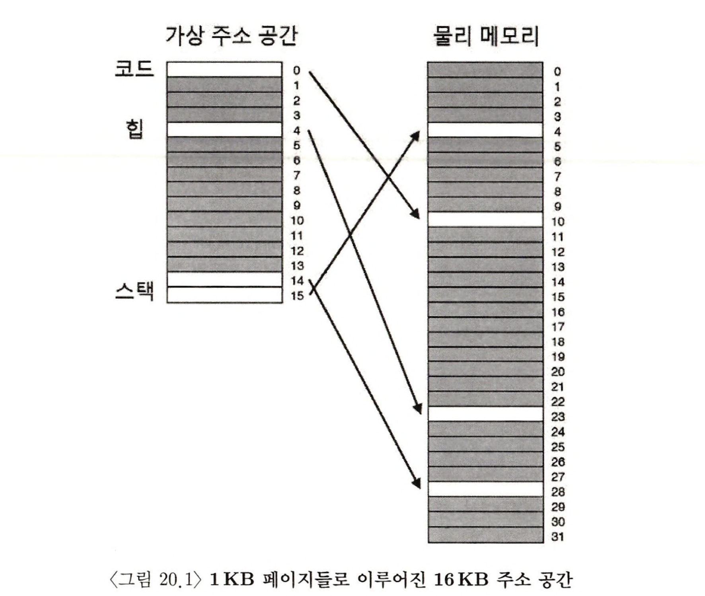
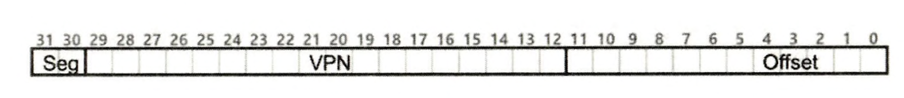
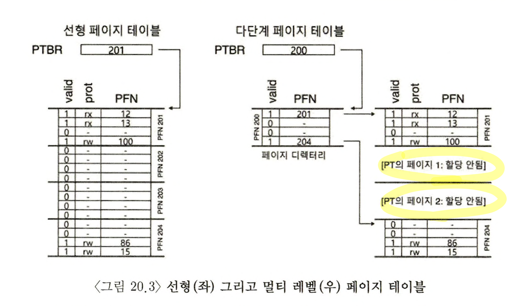
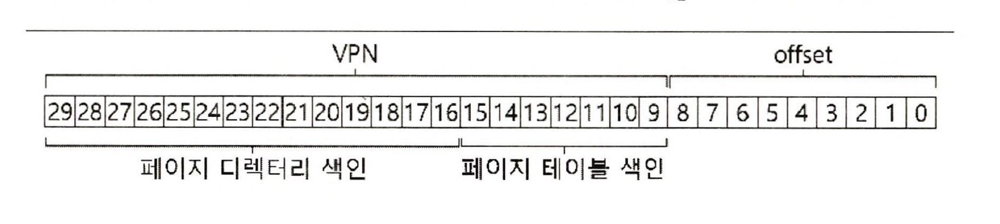
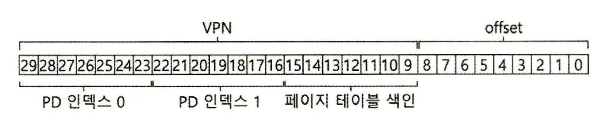

> 본 내용은 OSTEP 의 내용을 정리 및 요약한 내용입니다.
> 전문은 [이 곳](https://pages.cs.wisc.edu/~remzi/OSTEP/)을 방문하시면 보실 수 있습니다.

# 20. 페이징: 더 작은 테이블

페이징의 두 번째 문제점은 페이지 테이블의 크기다. 크기가 커진다면 많은 메모리 공간을 사용하게 된다. 

선형 페이지 테이블(linear page table)을 예를 들어보면, 페이지 크기가 4KB이고, 페이지 테이블 각 항목은 4바이트인 32비트 주소 공간을 가정해보자. 이 경우 주소 공간에는 대략 백만 개의 가상 페이지가 존재할 것이다. 여기서 페이지 테이블 항목의 크기를 곱하면 페이지 테이블의 크기가 된다. 

즉 백만 * 4바이트 = 4MB 가 되는 것이다. 일반적으로 각 프로세스는 자기 자신의 페이지 테이블을 갖으며, 백개의 프로세스가 실행중이 되면 페이지 테이블이 100개가 존재하게 되며, 이때 페이지 테이블은 전체 주소 페이지 테이블 크기는 400MByte 의 메모리를 쓸 수 밖에 없는 것이다. 

> 핵심 질문 : 페이지 테이블을 어떻게 더 작게 만들 수 있을까? <br/>단순 배열 기반의 페이지 테이블의 크기는 일반적인 시스템에서 메모리를 과도하게 차지 한다. 어떻게 이러한 페이지 테이블의 크기를 줄일 수 있을까? 주요 개념들과, 오히려 그런 개념들이 어떤 비효율성을 가지는가?

## 20.1 간단한 해법  : 더 큰 페이지

페이지 테이블의 크기를 간단하게 줄이는 방법으로는 페이지의 크기를 증가시키는 것이다. 32비트 주소 공간에서, 이번에는 16KB 페이지를 가정해보자. 이경우 18비트의 VPN, 14비트의 오프셋을 가지게 된다. 각 PTE (4바이트)의 크기가 모두 동일하면, 페이지 테이블에서 2의 18승 개의 항목이 있으며, 페이지 테이블의 총 크기는 1MB로 줄어 기존 페이지테이블의 크기가 1/4 로 감소된다. 

> 여담 : 멀티 페이지 크기 <br>많은 컴퓨터 구조들이 멀티 크기 페이지를 지원하는데, 특정 부분은 대형 페이지, 특정 페이지는 소형 페이지 형태로 되어 있다. <br> 이렇게 사용하는 이유는 단순히 테이블의 공간을 절약하려는 것은 아니다. 오히려 TLB 미스를 줄이면서 프로그램이 주소 공간을 접근할 수 있도록 하기 위해서다. 그러나 이러한 방식이 하드웨어를 통해 구현되어 지원하는 경우, 운영체제의 가상 메모리 관리 모듈(MMU)가 매우 복잡해지기에, **추가 인터페이스를 정의하여 소프트웨어가 대형페이지를 요청할 수 있도록 만들어 두었다.**

문제는 이러한 크기 자체를 줄이는 방식은 여전히 내부의 **낭비 공간** 에 대해서 처리를 해주는게 아니라는 점이다. 오히려 heap 과 같은 메모리를 생각해보면, 커진 페이지 공간에 대해 결국 빈채로 사용하게 된다. 즉, **내부 단편화(internal fragmentation)** 을 발생 시킨다는 것이다. 결국 이러한 방식의 최종 국면은 컴퓨터 시스템의 메모리가 금방 고갈된다. 이런 연유에서 많은 컴퓨터 시스템들은 비교적 작은 페이지를 차용한다. 

## 20.2 하이브리드 접근 방법 : 페이징과 세그멘트 

**Dennis** 는 페이징과 세그멘테이션을 결합하여 페이지 테이블 크기를 줄이는 아이디어를 통해 기존의 방식의 한계를 개선하고, 장점만을 취하려고 했다. 

선형페이지 테이블의 동작을 면밀히 분석하면, 페이징과 세그멘테이션의 결합 잠재력이 나타난다. 



위 그림의 예제에서 한개의 코드 페이지 VPN(0)가 물리페이지 10번, 한개의 힙이 23번, 스택은 각각 4, 28번에 매칭이 되어 있다. 그 외의 공간에 대해서는 페이지 테이블 대부분이 비어 있고, 이는 엄청난 낭비다. 그렇다면 반대로 논리 세그먼트 마다 페이지 테이블을 따로 둔다면 어떻게 변할까? 

세그멘테이션에서는 세그먼트 물리주소의 시작 위치를 나타내는 **base** 레지스터와 **bound** 혹은 **limit** 레지스터가 있다. 이는 기존의 그것과 유사하게 동작한다. 단, 그럼에도 **유일한 차이** 가 존재하는데, 이는 하나의 페이지 테이블 베이스 레지스터를 사용하는 대신 세개 중 하나의 세그먼트 베이스 레지스터를 사용한다는 점이다. 

**하이브리드 기법의 핵심은 세그먼트 바운드 레지스터가 따로 존재한다는 것이다.**

소속 세그먼트를 나타내기 위해 상위 두 비트를 사용한다. 가상 주소는 다음과 같이 표현될 수 있다. 



각 세그먼트의 베이스 레지스터는 각 세그멘트 페이지 테이블의 시작 물리 주소를 갖게 된다. 

이 상황에서 문맥 교환 시 이 레지스터들은 새로 실행되는 프로세스의 페이지 테이블의 위치 값으로 변경된다.

**TLB 미스 발생 시, 하드웨어는 세그멘트 비트(SN)을 사용하여 어떤 베이스와 바운드 쌍을 사용할지 결정한다.** 이를 식으로 정리하면 다음처럼 정리 될 수 있다. 

```c
SN           = (VirtualAddress & SEG_MASK) >> SN_SHIFT
VPN          = (VirtualAddress & VPN_MASK) >> VPN_SHIFT
AddressOfPTE = Base[SN] + (VPN * sizeof(PTE))
```

동작 순서는 기존의 선형 페이지 테이블 작동과 유사하게 동작하나, 차이가 있다면 하나의 페이지 테이블의 베이스 레지스터가 세개 중 하나의 세그먼트 베이스 레지스터를 사용한다는 점이다. 

그러나 이러한 기법에도 문제점은 존재한다. 

- **여전히 세그멘테이션을 사용한다** : 내부 단편화를 해결하진 못했다. 
- **하이브리드 기법은 외부 단편화도 초래한다.**  : 다양한 페이지 테이블 크기를 사용하는 만큼 외부 단편화 가능성을 배제할 수 없고, 단, 페이지 테이블의 크기는 반드시 페이지 테이블 항목 크기의 정수배가 된다. 그러나 이러한 점은 동시에 페이지 테이블용 공간 확보의 알고리즘의 복잡도를 증대 시킨다. 

## 20.3 멀티 레벨 페이지 테이블 

세그멘테이션이 가지는 하이브리드함이 여러 편의성을 제공했지만, 동시에 그렇지 못했던 것럼, 세그멘테이션을 사용하지 않고 페이지 테이블 크기를 줄이는 방법을 생각해볼 수 있다. 이러한 방식이 바로 **멀티 레벨 페이지 테이블** 이다. 

이 방식의 특징은 **트리구조** 로 구성되어 있다는 점이다. 현대 시스템에서도 상당히 많이 사용되고 있다. 



기본 개념은 다음과 같다. 
- 페이지 테이블을 페이지 크기의 단위로 나눈다. 
- 그 다음 페이지 테이블의 페이지가 유효하지 않다면, 해당 페이지를 할당하지 않고, 이를 비트로 표시한다. 
- **페이지 디렉터리(page directory)** 라는 자료구조를 사용하여 페이지 테이블 각 페이지의 할당여부와 이치를 파악한다. 

그림 20.3 좌측 선형 페이지 테이블의 경우 중앙부 주소 공간은 사용되고 있지 않다. 그러나 페이지 테이블에서 항목들은 할당이 되어 있다. 

이에 비해 우측의 예시의 경우 동일한 주소 공간을 다루지만, 유효한 페이지는 메모리 상에 존재하고, 그 외에는 할당은 되어있지 않으나 페이지 디렉터리 자료구조로 정리되어 있다. 

페이지 디렉터리는 **페이지 디렉터리 항목(page director entries, PDE)** 로 구성되어 있다. 각 항목은 페이지 테이블의 각 항목(PTE)와 유사하며, **페이지 프레임 번호(page frame number, PFN)** 과 **유효(valid)** 비트로 구성되어 있다. 

PDE가 '유효'하다는 내부의 비트는 PDE가 PFN을 통해 가리키는 페이지들 중 최소 하나가 유효하다는 것을 의미한다. 만약 유효하지 않다면 비트는 0이 되고 PDE 는 실제 할당되지 않은 것을 가리키고 있게 된다.(즉, 이러한 PTE를 필요시 하게 되면, 미스와 함께 해당 페이지 테이블을 작성하고 유효 비트가 1이 된다. )

이러한 멀티 레벨 페이지 테이블의 장점은 다음과 같다. 
- 사용된 주소 공간의 크기에 비례하여 페이지 테이블 공간이 할당된다. 즉, 보다 작은 크기의 페이지 테이블로 주소 공간을 표현 가능하다. (유효하지 않으면, 목록으로 만들지만, 실제 PTE가 메모리 상에 할당될 필욘 없다.)
- 페이지 테이블을 페이지 크기로 분할함으로써 메모리 관리에용이하다. 페이지 테이블을 할당하거나 확장할 때, 운영체제는 free 페이지 풀에 빈 페이지를 가져다 쓰면된다.
	- 선형 페이지 테이블의 경우 각 항목은 가상 페이지의 물리 페이지 주소를 갖고 있고, 큰 페이지 테이블의 경우 해당 크기의 연속된 빈 물리 공간 찾기가 쉽지 않다. 
	- 멀티 레벨 페이징에선 페이지 디렉터리를 사용하여 각 페이지 테이블 페이지들의 위치를 파악한다. 페이지 테이블의 각 페이지들이 물리 메모리 상에 산재해도, PDE를 활용하면 위치 파악이 용이하고 페이지 테이블을 위한 공간 할당이 유연하게 가능해진다. 

그러나 반대로 PDE를 만들고 관리하는 만큼단점이 발생한다. 
- 우선, '추가 비용'이 발생한다. TLB 미스시, 주소 변환을 위해 두 번의 메모리 로드가 발생한다. 선형에서는 한 번만 접근해도 주소 정보를 TLB에 탑재함에도 말이다. <br> 즉, **멀티 레벨 테이블은 시간과 공간을 상호절출(time-space-trade-offs)** 한 예시라고 볼 수 있다. 페이지 테이블 크기를 줄이는 것은 성공했으나, 메모리 접근 시간과 횟수는 증가했다. TLB 히트 시 성능은 동일하겠지만, 반대로 TLB 미스는 두배가 소요된다. 
- 또한 **복잡도** 문제도 발생한다. 선형 페이지 테이블 탐색보다 복잡하며, 검색을 개선을 위해선 보다 복잡한 알고리즘을 필요시 된다. 즉, 메모리 자원 절약을 위해 페이지 테이블의 과정과 복잡도가 올라가는 것이다. 

### 멀티 레벨 페이징 예제 
내용 스킵 

### 2단계 이상 사용하기 
멀티 레벨 페이지 테이블의 목적은 페이지 테이블의 모든 분할된 부분들이 단일 페이지 크기에 맞도록 하는 것이며, 만약 페이지 디렉터리가 너무 커진다면 단계를 두는 방식으로 이를 개선할 수 있다. 





이 방식을 사용하면 두단계를 통해 접근 성을 키웠으나, 반대로 그만큼 복잡하고, 작업이 늘어났다. 이 점을 유의하자. 

### 변환과정 : TLB를 기억하자

2단계 페이지 테이블 사용 시 전체 주소 변환 과정을 알고리즘 형태로 요약한게 다음과 같다. (여기서 TLB는 하드웨어 식임을 가정한다. )

```c
VPN = (VirtualAddress & VPN_MASK) >> SHIFT
(Success, TlbEntry) = TLB_Lookup(VPN)
if (Success == True) // TLB 히트
	if (CanAccess(TlbEntry.ProtectBits) == True)
		Offset = VirtualAddress & OFFSET_MASK
		PhyAddr = (TlbEntry.PFN << SHIFT) | Offset
		Register = AccessMemory(PhysAddr) 
	else
		RaiseException(PROTECTION_FAULT)
else // TLB 미스
	PDIndex = (VPN & PD_MASK) >> PD_SHIFT
	PDEAddr = PDBR + (PDIndex * sizeof(PDE))
	PDE = AccessMemory(PDEAddr)
	if (PDE.Valid = False) 
		RaiseException(SEGMENTATION_FAULT)
	else if (CanAccess(PTE.ProtectionBits) == False)
		RaiseException(PROTECTION_FAULT)
	else
		TLB_Insert(VPN, PTE.PFN, PTE.ProtectionBits)
		RetryInstruction()
```

## 20.5 페이지 테이블을 디스크로 스와핑하기 

중요한 가정, 이상적 환경을 부숴보자.  이제까지는 페이지 테이블이 **커널 소유의 물리 메모리 영역**에 존재한다고 가정했다. 

페이지 테이블 크기를 최대한 줄이더라도, 여전히 모든 페이지 테이블 크기를 최대한 줄이더라도, 여전히 모든 페이지 테이블을 메모리에 상주시키기에는 메모리 요구량이 너무 클 수 있다. 어떤 시스템들은 페이지 테이블들을 커널 가상 메모리에 위치시키며, 메모리가 부족하다면, 페이지 테이블들을 디스크로 **스왑(swap)** 한다. 

## 20.6 요약 

단순한 선형 배열을 사용하는 구조 뿐만 아니라, 좀더 복잡한 구조인 페이지 디렉터리 항목(Page Directory Entry, PDE);구조의 형태를 살펴 보았다. 페이지 테이블을 위한 자료 구조에는 시간과 공간일는 모순적 선택사항이 존재한다. 공간을 많이 소모하는 구조를 사용할 수 록  TLB 미스의 처리 속도가 빨라지고, 공간을 작게 차지하는 테이블 구조를 사용하면 상황은 반대가 된다. 

주 기억장치 용량이 작았던 과거 시스템의 경우, 소형 자료구조의 사용이 현명한 선택이었다. 적당한 크기의 메모리와 다수의 페이지들을 사용하는 워크로드의 경우 TLB 미스를 신속히 처리할 수 있는 큰 테이블을 사용하는 것이 옳은 선택일 것이다. 

소프트웨어로 관리 되는 TLB의 경우 전체 자료구조를 운영체제 개발자가 임의로 그리고 혁신적으로 개발, 개선이 가능하다. 

```toc

```
