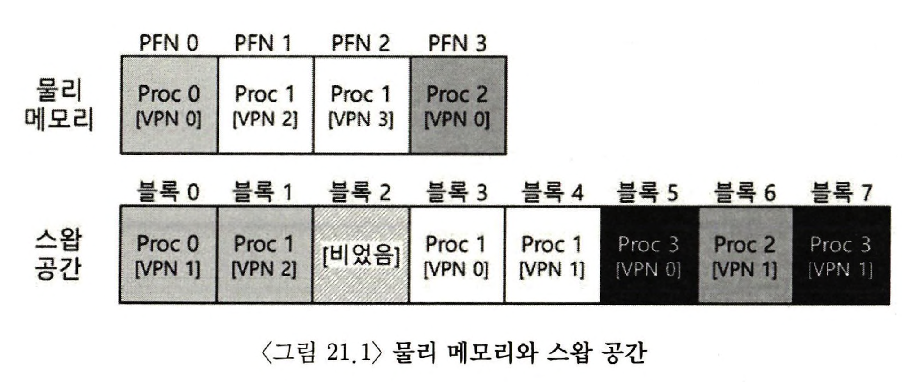
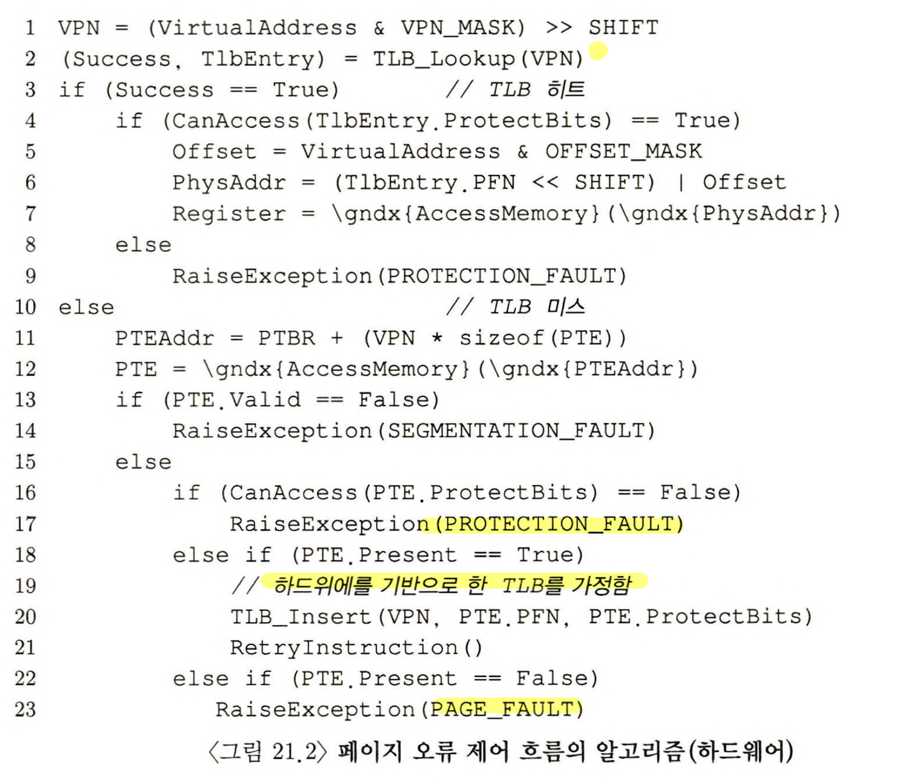
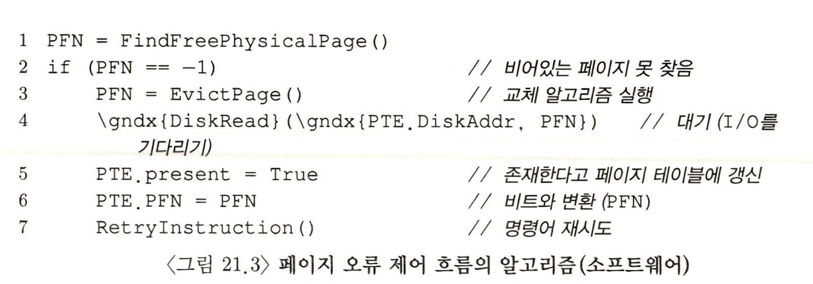

> 본 내용은 OSTEP 의 내용을 정리 및 요약한 내용입니다.
> 전문은 [이 곳](https://pages.cs.wisc.edu/~remzi/OSTEP/)을 방문하시면 보실 수 있습니다.

# 21. 물리 메모리 크기의 극복: 메커니즘

지금까지 가상 주소 공간이 아주 작고, 모두 물리 메모리에 탑재가 가능한 것으로 가정하였다. 하지만 이는 가정에 가까우며, 이제부턴 다수 프로세스들이 동시에 각자 크 ㄴ주소 공간을 사용하고 있는 상황이라고 볼 것이다. 

이를 위해 **메모리 계층**에 레이어의 추가가 필요하다. 지금까지는 모든 페이지들이 물리 메모리에 존재할거라 생각했으나, 이젠 큰 주소 공간 지원을 위해 주소 공간 중 크게 필요하지 않은 부분은 '보관'해 둘 공간이 필요하게 된 것이다. 그리고 이런 경우 당연히 그 공간은 메모리 공간 보다 크며, 느리다. 현대 시스템에서 주 기억장치인 SSD, HDD가 이 역할을 한다고 보면 된다. 

> 핵심 질문 : 물리 메모리 이상으로 나아가기 위해선 어떻게 할까
> 운영체제가 어떻게 크고 느린 저장 장치를 사용해서, 커다란 가상 주소 공간이 있는 것처럼 할 수 있을까?

우선, 이러한 이야기에 앞서 `왜 프로세스에게 굳이 큰 주소 공간을 제공해야 할까?` 를 생각해보자. 여기의 답은 `편리함`, `사용 용이성`이다. 주소 공간이 크면, 프로그램의 자료구조들을 위한 충분한 메모리 공간이 있는지 여부를 걱정할 필요 없어지고, 운영체제가 이러한 가상 환경을 제공시, 프로그램의 사용방식이 메우 편리해진다. 

**스왑** 공간이 추가되면 OS 는 실행되는 각 프로세스들에게 큰 가상 메모리가 있는 것 같은 환상을 줄 수 있다. 멀티프로그래밍 시스템이 발명된면서, 많은 프로세스들의 페이지를 물리 메모리 저장이 불가능해졌고, 그러다보니 일부 페이지를 스왑 아웃 하는 기능도 필요해졌다. 이러한 연유로 현대의 가상 메모리 시스템은 구축되었으며, 본 챕터는 이 내용을 배운다. 

## 21.1 스왑 공간

가장 먼저 가상의 대용량 공간을 이해 디스크에 페이지들을 저장할 공간을 확보해야 한다. 이러한 용도의 공간을 **스왑 공간(swap space)** 라고 한다. 이렇게 불리는 이유는 메모리 페이지를 읽어서 이곳에 쓰고(swap out), 여기서 페이지를 읽어 메모리에 탑재 시키기(swap in)때문이다. 

본 챕터에서는 스왑 공간의 입출력 단위는 페이지라고 가정한다. 운영체제는 그러한 가정하에 스왑 공간에 있는 모든 페이지들의 디스크 주소를 기억해야 한다. 

간단한 예제를 다음처럼 설명할 수 있을 것이다. 



위 예시를 보면, 총 4개의 프로세스 중 세 프로세스의 유효 페이지는 메모리에 올라가 있으며, 나머지 페이지들은 디스크에 스왑 아웃 되어 있다. 이때 네 번째 프로세스는 모든 페이지가 디스크로 스왑 아웃 되어 있다. 이를 통해 현재 실행중이 아닌 것을 알 수 있다. 이처럼, 시스템에 실제 물리적으로 존재하는 메모리 공간 보다 더 많은 공간이 존재하듯, 스왑해 놓을 수 있음을 볼 수 있다. 

## 21.2 Present Bit

디스크 스왑 공간이 확보되었다면, 페이지 스왑을 위한 기능을 다룰 차례다. 하드웨어 기반의 TLB를 사용하는 시스템을 가정하자. 

기존에 이런 상황에서 하드웨어 기반의 TLB 로직으로 진행되는걸 가정해보자. 기존 로직은 다음과 같다. 
- 메모리 참조 과정은 프로세스가 가상 메모리 참조를 생성한다. 하드웨어는 메모리에서 원하는 데이터를 가져오기 전에 가상 주소를 물리 주소로 변환한다. 
- 하드웨어는 VPN을 가상 주소에서 추출, TLB에서 있는지 검사하여, 있으면 **TLB 히트**, 없으면 **TLB 미스**를 발생시킨다. 
- 히트 시 추가 변환 없이 MMU에 저장된 물리 주소를 얻은 후 메모리로 가져온다. 
- 미스 시 하드웨어는 페이지 테이블의 메모리 주소를 파악한다(**Page table Base Register**를 사용한다). 
- VPN을 인덱스로 PTE(페이지 테이블 항목)을 추출한다. 이때 해당 페이지 테이블 항목이 유효하고, 관련 페이지가 물리 메모리에 존재하면 PTE에서 PFN을 추출하여 하드웨어가 그 정보를 TLB에 탑재한 뒤, 명령어를 재 실행해서 TLB 히트를 유도한다. 

여기까지가 가상 메모리 구조이다. 여기서 페이지가 디스크로 스왑되는 것을 가능케 하려면, 추가적인 기법들이 필요하다. 우선 하드웨어가 PTE에서 해당 페이지가 물리 메모리에 존재하지 않음을 표현해야 한다. 이 역할을 하는 것이 `Present bit`이다. 

해당 비트는 1로 설정시 물리 메모리에 해당 페이지가 존재하고, 0이면 아닌 것으로 판단되며, 이 경우 **페이지 폴트(page fault)** 라 한다. 해당 폴트가 발생시 운영체제로 제어권이 넘어가면서 **페이지 폴트 핸들러(page-fault handler)** 가 실행된다.

## 21.3 페이지 폴트 

기본적으로 TLB 미스가 발생시 이를 대처하는 시스템은 하드웨어 기반이거나, 소프트웨어 기반인 경우가 있다. 하드웨어는 전용 연산 칩이나 관리용 메모리 등으로 구현된 것이며, 소프트웨어는 관리용 메모리와 운영체제가 이를 처리 해주는 경우이다. 이때 둘 중 어느 방식이든 페이지 폴트가 발생하면 이에 대한 핸들러, **페이지 폴트 핸들러**가 그 처리 메커니즘을 규정한다. 

여기서 거의 대부분의 시스템들에서 페이지 폴트의 처리는 소프트웨어적으로 처리된다. 하드웨어 기반 TLB도 마찬가지라고 보면 된다. 

페이지 폴트 발생 시, OS는 테이블 항목에서 해당 페이지의 디스크 상 위치를 파악하여, 메모리에 탑재한다. 

디스크 입출력이 종료되면, 해당 페이지 테이블 항목(PTE)의 PFN 값을 탑재된 페이지의 메모리 위치로 갱신한다. 이제 페이지 폴트를 발생시킨 명령어로 돌아가게 되고, 재실행 시 TLB 미스가 발생할 수 있고, 이때 다시 TLB 미스를 히트로 처리되도록 로직이 작동된다. 

> 왜 페이지 폴트를 하드웨어로 처리하지 않을까?
> TLB를 다뤄본 경험에서 우리는 하드웨어 설계자들이 운영체제가 하는 일을 신뢰하고 싶어하지 않는다는 것을 알 수 있다. 그럼에도 왜 OS가 페이지 폴트 핸들링을 담당할까?
> - 첫 째, 페이지 폴트로 인한 디스크 접근이 너무 느리다. 즉, 디스크 입출력이 느린 만큼 소프트웨어를 실행하는 추가 부담이 적다고 해석도 된다. 
> - 둘 째, 만약 처리를 위해 하드웨어로 이를 구현하려면, 하드웨어가 스왑 공간의 구조, 디스크 I/O를 요청하는 방법, 그 이외에 하드웨어가 파악하지 못한 세부 사항을 다 알아야 한다. 
> 이러한 점에서 페이지 폴트 처리를 운영체제가 담당하게 되었다. 

## 21.4 메모리에 빈 공간이 없으면?

지금까지 우리는 스왑 공간에서 페이지를 가져오기 위한 여유 메모리가 있다고 생각하고 이야기 해왓다. 하지만 그렇지 않은 경우도 분명 있을 것이며, 이 경우 기존의 페이지들을 먼저 페이지 아웃하고, 교체 페이지를 선택하는 과정이 필요하다. 이를 **페이지 교체 정책(page-replacement policy)** 라고 한다. 

해당 정책의 경우 잘못 만들게 되면, 그만큼 어마어마한 처리시간이 걸리는 만큼 제대로된 선택을 할 수 있도록 신중을 기해서 만들어져야 한다. 

## 21. 5 페이지 폴트의 처리 

하드웨어 처리 과정에서 TLB 미스가 발생하면 3가지 경우로 쪼개진다. 
- 페이지(PTE)가 존재하며, present bit = 1 인 경우
- 페이지(PTE)가 존재하나, present bit = 0 인 경우, 
- 페이지가 유효하지 않은 경우 (버그 등으로 잘못된 주소 접근 시 )

가상주소 
32비트 
4비트 , 12 VPN, offset, other 

page 4kb






위 그림에서 운영체제가 페이지 폴트를 처리하는 과정을 대략적으로 보여준다. 우선 운영체제는 탑재할 페이지를위한 물리 프레임을 확보한다. 여유 프레임이 없다면, 교체 알고리즘을 실행하고, 메모리에서 페이지를 내보내고 여유 공간을 확보한다. 물리 프레임 확보 후 입출력 요청으로 스왑 영역에서 페이지를 읽어온다. 그렇게 느린 작업이 끝나면 OS는 페이지 테이블을 갱신하고 명령어를 재시도하고, 이때 TLB 미스가 다시 발생하면, TLB가 이를 수정하여 TLB 히트가 나게 되고, 이때 비로소 하드웨어는 원하는 것을 접근할 수 있게 된다. 

## 21.6 교체는 실제 언제 일어나는 가 

지금까지 설명은 메모리에서 여유공간이 고갈된 후 교체 알고리즘이 작동한 것으로 가정하였다. 하지만 실제 OS는 항상 어느정도의 여유 메모리 공간을 확보되어 있어야 한다. 

이에 대부분의 현세대 OS 들은 여유 공간에 대한 **최댓값(High watermark, HW)**, **최솟값(low waterark, LW)** 를 설정하고, 교체 알고리즘 작동에서 활용한다. 

> 번역이 다소 애매한데, 영어를 직역하면 최고 수위와 최저 수위 정도가 적당할 것으로 보인다.

동작은 백그라운드 쓰레드로 실행되며, 이 쓰레드가 여유 공간의 크기가 최댓값에 이를 때까지 페이지를 제거한다. 이를 일반적으로 **스왑 데몬(swap daemon)** 또는 **페이지 데몬(page daemon)** 이라고 불린다. 해당 데몬이 충분한 여유 메모리가 확보되면 이 백그라운드 쓰레드는 슬립모드로 들어간다. 

이때 여러개를 한꺼번에 여러개를 교체하면 성능 개선이 가능하다. 다수의 페이지들을 클러스터(cluster), 그룹(group)으로 묶어서 한 번에 스왑 파티션에 저장함으로써 디스크 효율을 높인다. 

클러스터링은 디스크의 탐색, 회전 지연(rotational delay)에 대한 오버헤드를 경감시켜 성능을 높인다.(물론 SSD를 기준으로 생각한다면, 이미 상당한 개선이 된다.)

## 21.7 요약

본 장에서 핵심은 물리 메모리보다 더 큰 메모리 사용을 위한 보완개념들을 배웠다. 
메모리에 특정 페이지 존재 여부를 확인하기 위한 **present bit** , 좀더 복잡한 페이지 테이블 구조가 있었고, OS는 **page fault** 를 처리하기 위해 **page-fault handler**를 실행시킨다. 핸들러는 원하는 페이지를 page-in(swap-in) 하기 위해, 일부 메모리 상의 페이지를 page-out(swap-out)한다. 

포인트는 이 모든 작업이 프로세스가 인지하지 못하는 상황에서 처리되도록 해야 하며, 프로세스 입장에선 계속 개별적인 연속된 가상 메모리를 접근하는 것처럼 느껴지게 만들어야 한다. 


```toc

```
