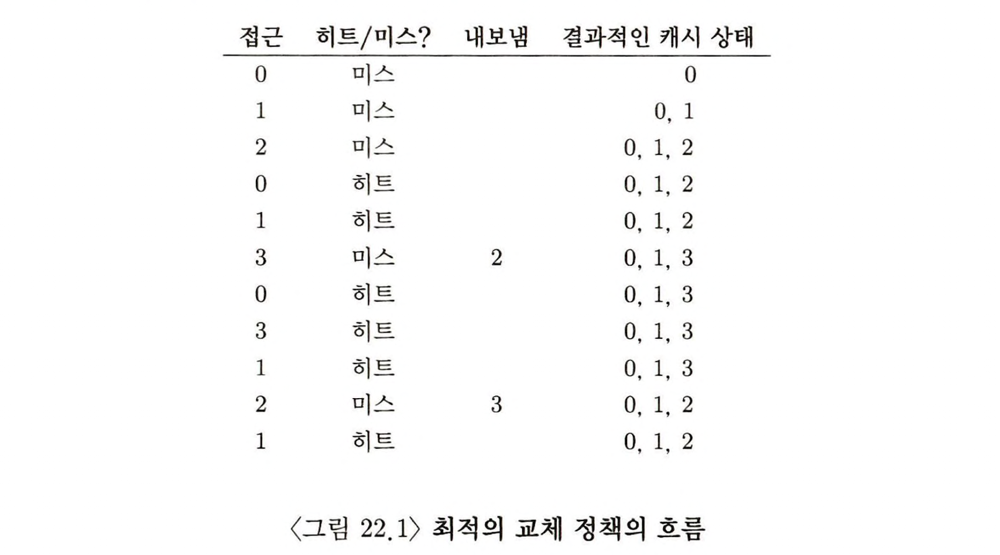
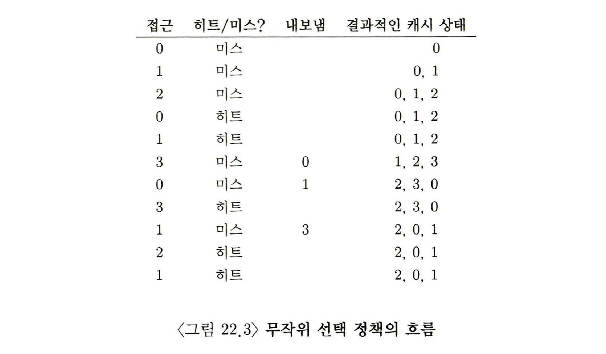
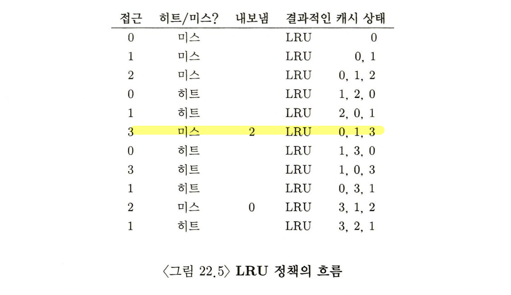
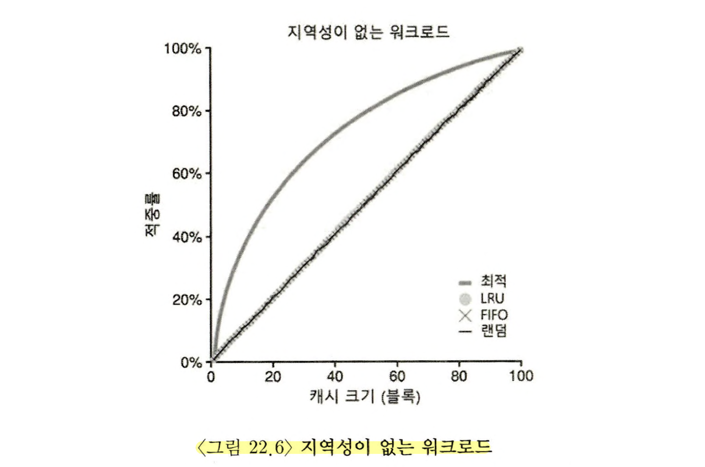
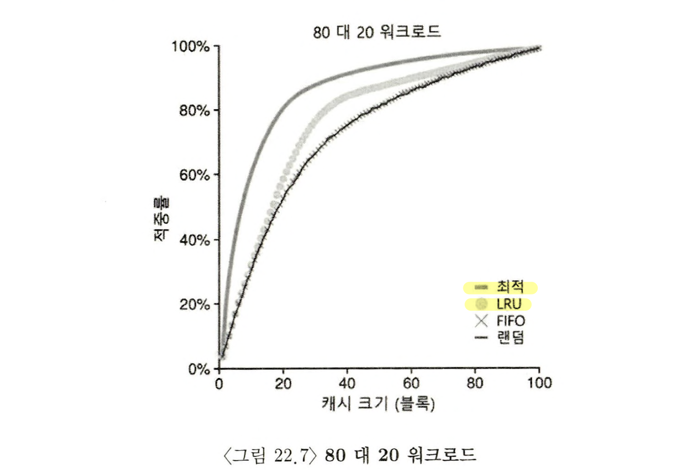
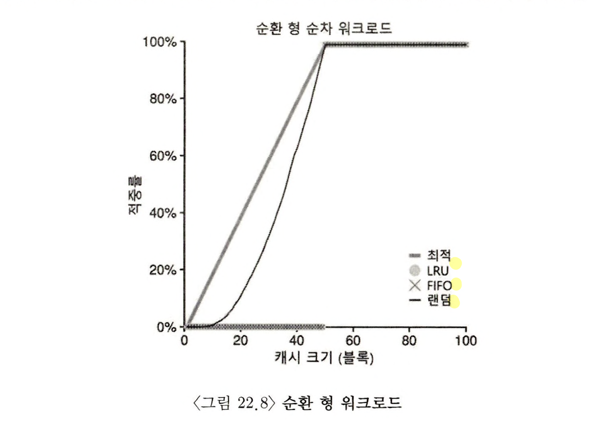
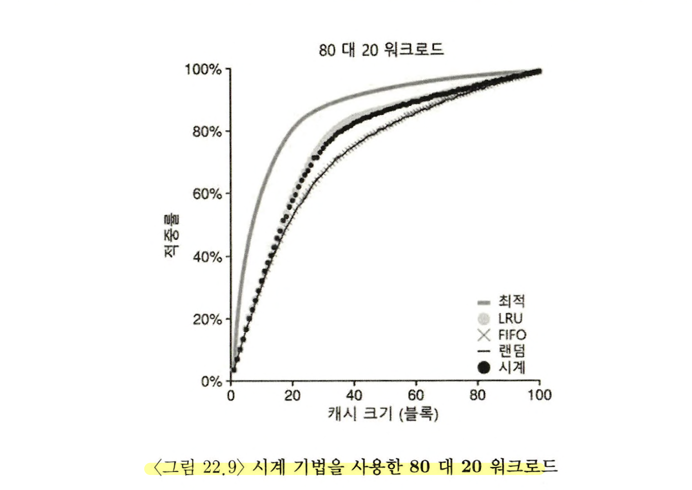

> 본 내용은 OSTEP 의 내용을 정리 및 요약한 내용입니다.
> 전문은 [이 곳](https://pages.cs.wisc.edu/~remzi/OSTEP/)을 방문하시면 보실 수 있습니다.

# 22. 물리 메모리 크기의 극복: 정책 

가상 메모리 관리자의 입장에서 비어있는 메모리가 많을 수록 관리가 쉬워진다. 
페이지 폴트가 발생하면, 빈 페이지 리스트에서 페이지를 찾아서 폴트를 일으킨 페이지에게 할당하면 된다.

하지만 빈 메모리 공간이 없는 경우 관리는 더욱 복잡해진다. OS는 이러한 상황 **메모리 압박(memory pressure)** 를 해소하기 위해 다른 페이지들을 강제적으로 paging-out 하여 활발히 사용 중인 페이지들을 위한 공간을 확보한다. 

여기서 **내보낼(evict) 페이지(또는 페이지들)** 을 선택하는 과정은 OS의 **교체 정책(replacement policy)** 안에 집약되어 있다. 과거 시스템에서 이러한 정책은 시스템의 물리 메모리의 크기가 작기 때문에 초기 가상 메모리 시스템의 핵심이었다. 

> 핵심 질문 : 내보낼 페이지는 어떻게 결정하는가?
> 이 결정은 시스템의 교체 정책에 의해서 내려지며, 보편 타당한 원칙을 따르지만, '코너 케이스'를 피하기 위해 수정사항이 포함된다. 

## 22.1 캐시 관리 

시스템의 전체 페이지들 중 일부만이 메모리에 유지된다는 것을 가정하면, 메인 메모리는 시스템의 가상 메모리 페이지를 가져다 놓기 위한 **캐시**로 생각될 수 있다. 

여기서 핵심은 결국 **캐시 미스**를 최소화 하는 것이며, 즉 디스크로부터 페이지를 가져오는 횟수를 최소로 만드는 것이다. 반대로 이는 **캐시 히트**의 극대화를 목표라고 할 수 있다. 

여기서 캐시 히트, 미스의 횟수를 안다면 프로그램의 **평균 메모리 접근 시간(average memory access time, AMAT)** 을 계산할 수 있다. 식을 다음처럼 만들 수 있다. 

> AMAT= T_M + (P_{miss} * T_D)

- T_M 은 메모리 접근 비용, T_D는 디스크 접근 비용, P_Miss 는 캐시에서 데이터를 못 찾을 확률을 나타낸다. 
- P_Miss는 0.0 ~ 1.0 사이의 값을 가지며 때때로 확률 대신 퍼센트 미스율을 언급하기도 한다. (10% 미스율 = P_Miss = 0.10)

현대 시스템에서는 디스크 접근 비용이 너무 크기 때문에, 아주 작은 미스도 전체 AMAT 에 큰 영향을 주게 된다. 따라서 이를 위한 최적의 교체 정책을 알아본다. 

## 22.2 최적 교체 정책

**최적 교체 정책(The Optimal Replacement Policy)** 은 교체 정책의 동작 방식을 알기에 도움이 된다. 
최적 교체 정책은 미스를 최소화하는데 핵심을 둔다. Belady는 가장 나중 접근될 페이지를 교체하는 것이 최적이며, 가장 적은 횟수의 미스를 발생시키는 것을 증명했다. 정책 원리 자체는 간단하지만, 구현에서 상당히 어려운 정책이라 볼 수 있다. 



위의 간단한 예제는 최적의 교체 정책의 흐름을 보여준다.

처음에는 비어 있기 때문에 계속 미스가 난다. 이를 최초 시작미스(cold-start miss) 또는 강제미스(compulsory miss) 라고 부른다. 

그리곤 계속 진행하면서 캐시 상태가 바뀌게 되는데, 이때 3을 호출해야하는 시점에서, 2는 쓰이지 않기 때문에, 이를 스왑하게 된다. 

여기서 캐시 히트가 6번 미스가 5번이었으므로 히트율은 Hits / Hits + Misses 이므로 54.5%가 된다. 여기서 강제 미스를 제외하면 85.7%의 히트율을 얻게 된다. 

스케줄링 정책을 만들 때도 확인한 사항이지만, 미래는 일반적으로 미리 알 수 없으므로, 범용 운영체제에서는 최적 기법의 구현은 불가능하다. 내보낼 페이지를 결정하기 위한 실제적, 배포가 가능한 정책을 만들기 위해 다른 방법을 찾는 것에 집중할 것이다. 


## 22.3 간단한 정책: FIFO 

위의 정책에 대한 이야기는 최적의 방법에 도달하려는 복잡한 시도 대신 쉬운 방식으로 진행하는 경우도 있다. 그중 가장 간단한 방식이 FIFO(First In First Out)의 형태이다. 

그러나 이 경우 최적의 경우와 비교시 눈에 띄게 성능이 안좋다. 히트율은 대략 36.4%가 된다. 강제 미스를 제외하면 57.1%가 된다. 

## 22.4 또 다른 간단한 정책: 무작위 선택 

랜덤 방식은 FIFO 와 유사한 성질을 갖고 있으며, 구현이 용이하지만 내보낼 블럭을 제대로 선택하려는 노력을 하지 않는다. 



FIFO 보다는 좋은 성능을 보이며, 최적의 방법보다는 약간 나쁜 성능을 보여준다. 좋을 때는 40%의 히트율도 보이게되지만, 무작위 선택 방식은 동작은 그때그때 달라진다. 

## 22.5 과거 정보의 사용 : LRU

FIFO나 랜덤 정책은 단순한 만큼 다시 참조하게 될 것들을 내보낼 수있다는 문제를 갖고 있다. 따라서 이러한 방식은 최적 기법의 성능을 따라갈 수 없다. 이에 스케줄링 정책처럼 미래가 아닌 과거 사용 이력을 활용하는 방법이 있는데, 이는 바로 페이지 `빈도수`를 홀용하는 것이다. 

좀더 자주 사용되는 페이지의 특직응은 접근의 최근성(recency)가 높다는 점이다. 이러한 류의 정책들은 **지역성의 원칙(principle of locality)** 라고 부르는 특성에 기반을 둔다. 

여기에는 두가지 정책이 존재하는데 `Least-Frequently-Used(LFU)`, `Least-Recently-Used(LRU)`라는 정책이다. 전자는 가장 적은 빈도로 사용된 페이지를 교체 하는 것이며, 후자는 가장 오래전에 사용한 페이지를 교체하는 방식이다. 아래 예시를 통해 볼 수 있다. FIFO, 랜덤 식의 정책보다 LRU가 과거 정보를 사용해 더 좋은 성능을 보이는 것을  알수 있다. 



이와 반대 되는 개념으로 **Most-Frequently-Used(MFU)**,**Most-Recent-Used(MRU)** 도 있으나, 이 정책은 애석하게도 잘 동작하진 않는다. 

## 22.6 워크로드에 따른 성능 비교


예시를 통해 위의 정책 예시들을 살펴본다. 사실 정확한 워크로드를 이해하고, 성능을 비교하기 위해선 실제 응용프로그램의 트레이스 자료 수준은 되어야 한다는 사실을 잊지 말자.

- 첫 번째 워크로드 예시
- 위 예시는 지역성이 없는 경우다. 무작위적으로 페이지들에 총 10000번 접근된다. 이 경우 100개의 페이지는 지역성 없이 무작위적 접근으로 가정하며, 실험에서는 지역성은 배제하고 고려한다. 아래는 이에 대한 예시로 y축은 정책이 달성한 히트율, x축은 앞서 설명한 캐시 크기의 변화를 나타낸다. 
- 여기서 얻은 결론은 다음과 같다. 
	- 워크로드에 지역성이 없다면 어느 정책이든, 미래를 알지 못하는 전제 하에 어느 정책이든 상관없이 동일한 성능을 보여준다. 최적 교체 정책을 제외하고 어느것이든 동일한 성능을 보이며, 히트율은 곧 캐시 크기에 의해 결정되었다. 
	- 캐시가 충분히 커서 모든 워크로드를 다 포함 가능하다면, 어느 정책을 사용하든 큰 의미가 없다. 
	- 그러나 결과적으로 미래를 어느정도 안다면 당연히 교체 작업을 최적 교체 정책이 좋다는 것을 보여주었다. 


- 두번째 80:20 워크로드
	- 본 워크로드는 총 100개의 페이지에서, '자주' 참조되는 페이지들이 존재할 때에 대한 시험이다. 20%의 페이지가 자주 참조되며, 80%의 페이지는 20% 대비 더 적게 참조된다는 상황에서의 결과물이다. 
	- 그림에서 볼 수 있는 점은, FIFO, 랜덤 정책도 상당히 성능이 좋은 편이긴 하지만, LRU가 자주 참조되는 페이지들을 오래 두는 경향이 있는만큼 성능이 좋게 나타났다. 
	- 그러나 여전히 최적 기법이 더 좋은 성능인 점에서 LRU의 과거 정보가 완벽하지 않은 것을 보여준다. 

- 세번째 워크로드는 순차 반복 워크로드
	- 총 50개의 개별 페이지를 10,000번 접근하고, 이때 0번에서부터 순차적으로 반복하는 케이스이다.
	- 이러한 케이스의 경우 독특하게 LRU, FIFO 정책이 가장 성능이 좋지 못하다. 
	- 오히려 랜덤이 선택이 최적보다는 못해도 히트율이 상당히 나오는 것을 볼 수 있다. 

이러한 점에서 정책이라고 하는 것은 어느 것 하나가 항상 좋은 것이 아니며, 정책마다, 상황마다의 다른 조건에서 성능이 좋아질 수 있음을 보여준다. 


## 22.7 과거 이력 기반 알고리즘의 구현 

과거 정보에 기반을 둔 정책은 단순한 정책보다는 좋은 성능을 전반적으로 보여준다. 하지만 오히려 그렇기에 새로운 문제점을 마주하게 된다. 

- 성능이 좋은 LRU.. 그러나 
예를 들어 LRU를 생각해보면, 이를 완벽하게 구현하려면 상당히 많은 작업을 해야 한다. 페이지 접근 시 해당 페이지가 리스트 앞에 오도록 해야 하며, 자료 구조를 갱신해야 한다. 어떤 페이지가 가장 최근 또는 가장 오래 전에 사용되었는지, 모든 메모리 참조 정보를 기록해야 하고, 이러한 점들은 정보의 세심한 주의 없이 사용하다간 성능의 극단적인 저하를 보여준다. 

- 하드웨어를 통한 개선 
위와 같은 상황에서 작업의 효율성, 성능 향상을 위해선 다소 하드웨어의 지원을 통해 개선하는 것이 가능하다. 예를 들어 페이지 접근이 있을 때마다 하드웨어가 메모리 시간 필드를 갱신하도록 시키는 방식을 취한다면, 페이지 교체 시에 운영체제는 가장 오래 전 사용 페이지를 찾기 위해 시간 필드를 검사 하는 작업만으로 해결이 된다. 

- 여전한 문제점...
하지만 여전히 시스템의 페이지 수가 증가 시, 페이지들의 시간 정보 배열을 검색하여 가장 오래 전 사용된 페이지 수가 증가하면, 페이지들의 시간 정보 배열을 검색하여 가장 오래 전에 사용된 페이지를 찾는 것 조차 매우 고 비용의 연산이 된다. 특히나 시스템의 성능 향상과 함께 커지는 페이지수 증가는 현대의 기기들에서조차 상당한 부담이다. 

> 핵심 질문 : LRU 교체 정책을 구현하는 방법은?
> 어떻게 하면 LRU에 가까운 선택을 하는 유사한 정책을 구현할 수 있을까?

## 22.8 LRU 정책 근사하기

연산량 관점에서 본다면 LRU를 '근사'한 방식으로 구현하는 것이 가능하다. 이를 위해 `use bit` 라는 개념을 도입하면 된다. 

해당 방식은 페이징을 최초 적용한 Atlas one-level store 시스템에서 처음 구현되었다. 페이지가 참조 될 때, 하드웨어에서 use bit 를 1로 설정한다. 하드웨어는 이 비트를 절대 지우지 않으며, 0으로 바꾸는 것은 오로지 OS의  역할로 지정한다. 

이러한 기믹을 사용한 활용법으로 **시계 알고리즘(clock algorithm)** 이 존재한다. 

- 시계 알고리즘 
	- 페이지를 교체 해야 할 때, OS 는 현재 바늘이 가리키는 페이지 P에 대해 use bit가 1, 0 어느 것인지 확인한다. 만약 1이라면 페이지는 P가 최근에 사용되었기에, 교체 대상이 아님을 알 수 있다. 여기서 P의 use bit는 0으로 설정되면서 값이 초기화 되고, 시계 바늘이 P+1위치로 이동하게 된다. 
	- 여기서 하드웨어가 참조 여부에 따라 1로 바꿔주니, 오랫동안 사용되지 않은 경우 값이 0인 상태로 있다가 교체가 된다. 

이러한 방식 외에도 use bit를 사용하여 LRU를 근사하는 다른 방법들도 존재하며, 변형된 시계 알고리즘 동작의 예시를 보면, 교체 자체에서 페이지 검사는 랜덤하게 진행되는데, reference bit 1, 0중 어느거냐에 따라 교체 대상으로 되는데, 과거 정보를 고려하지 않은 기법에 비해서 성능이 좋은 것이 보여진다. 



## 22.9 갱신된 페이지(Dirty Page)의 고려 

위에서 언급한 시계 알고리즘의 성능은 좋지만, 동시에 여전히 고려할 것이 있다. 예를 들어 OS가 교체 대상을 선택할 때, 메모리에 탑재된 이후 변경여부를 고려하는 방식이다. 

이러한 방식을 고려하는 이유는 어떤 페이지가 **변경**되어 더티(dirty) 상태가 된다면, 페이지를 내보내기 위해선 디스크에 변경내용을 기록해야 하므로, 비싼 비용을 지불해야 한다. 만약 clean 상태인 경우 내보낼 때 추가 비용이 들지 않으며, 해당 페이지 프레임은 추가적인 I/O 없이 다른 용도로 재 사용할 수 있다. 단, 이를 위해선 하드웨어에서 **modified bit(dirty bit)** 가 필요하다. 페이지를 변경할 때마다 이 비트가 1이 되며, 페이지 교체 알고리즘은 이 비트를 교체 대상에서 고려해서, 교체 대상을 선택한다. 

## 22.10 다른 VM 정책들 

페이징 교체 정책 만이 VM 시스템의 유일한 형태는 아니다. 여기엔 다른 정책들도 포함될 수 있는데, 예를 들어 언제 페이지를 메모리로 불러 들일지 결정하는 정책으로, **페이지 선택(page selection)** 정책이라고도 불린다. 여기에는 **요구 페이징(demand paging)** 방식이 존재하며, 오히려 OS가 미리 페이지를 선행 탑제하는 **선반입(prefetching)** 정책도 존재한다. 단, 이 방식은 성공 확률이 충분히 높을 때에만 해야 한다. 

또 다른 예시로는, OS가 변경된 페이지를 디스크에 언제 반영하는지에 대한 정책도 존재한다. 한번에 한 페이지씩 디스크에 쓰는 것도 가능하지만, 많은 시스템은 기록할 페이지들을 메모리에 모으고, 이후에 한 번에 디스크에 기록하는 경우가 많다. 이를 **클러스터링(clustering)** 이라고도 부르며, 단순히 **쓰기 모으기(grouping of writes)** 라고도 부른다. 이러한 방식을 취하는 이유는 하나의 큰 쓰기가, 작은 여러번의 쓰기보다 효율적 처리가 가능하기 때문이다. 

## 22.11 쓰레싱(Thrashing)

마지막으로 메모리 사용 요구가 감당할 수 없을 만큼 많은 상황에서 실행 중인 프로세스가 요구하는 메모리가 가용 물리 메모리 크기를 `초과`하는 경우 OS가 어떤 식으로 대처하는지를 보자.

우선, 이런 식으로 시스템에서 끊임없이 페이징을 할 수 밖에 없는 상황을 **쓰레싱(thrashing)** 이라고 부른다. 대표적으로 과거 초기 운영체제들은 다수 프로세스가 존재 할 때 일부를 중지 시킨다. 실행 프로세스 자체를 줄여서 나머지를 위한 메모리 탑재를 실행하는 것으로, **워킹 셋(working set)** 이란 프로세스가 실행 중에 일정 시간 동안 사용하는 페이지들의 집합이며, 일반적으로 **진입 제어(admission control)** 라고 알려져 있는 이 방식은 많은 일을 엉성하게 하느니, 적은 일을 제대로 하기위한 선택이라고 볼 수 있다. 

일부 최신 시스템의 경우 Linux는 메모리 요구가 초과되면 **메모리 부족 킬러(out-of-memory killer)** 를 실행시키며, 이 데몬은 많은 메모리 요구 프로세스를 골라 죽이게 된다. 단, 이 방법의 경우 메모리 요구량만으로 판단해 죽이다보니, 성공적이게 보일진 모르지만, 방법자체가 문제가 될 수 있다. 


## 22.12 요약 

모든 현대 운영체제 VM 시스템의 구성요소인 페이지 교체 정책들과 그 외의 다른 정책들까지 다루었다. 현대 시스템들은 시계 알고리즘처럼 순수한 LRU 정책이 가지는 문제를 해소하면서도, 오버헤드가 적은 방법으로 성능 향상을 꾀했다. **탐색 내성(scan resistance)** 은 ARC와 같은 다수 현대 알고리즘의 핵심 요소로, 해당 알고리즘이 있을 경우 LRU와 유사하게 동작하지만, LRU가 최악의 경우 보이는 행동은 방지한다는 점에서 상당히 효과적이다. 

그러나 지금까지 언급한 알고리즘의 중요성은 점차 퇴색하고 있다. 이는 메모리 접근 시간과 디스크 접근 시간의 차이가 점차 증가하고 있고, 디스크에 페이징하는 비용은 당연히 그렇지 않은 경우보다 비싸기 때문이다. 빈번한 페이징은 감당하기 어려운 오버헤드이다. 그렇기에 가장 간단하면서도 최적의 해결책은 '더 많은 메모리'를 사는 것이다. 

```toc

```
