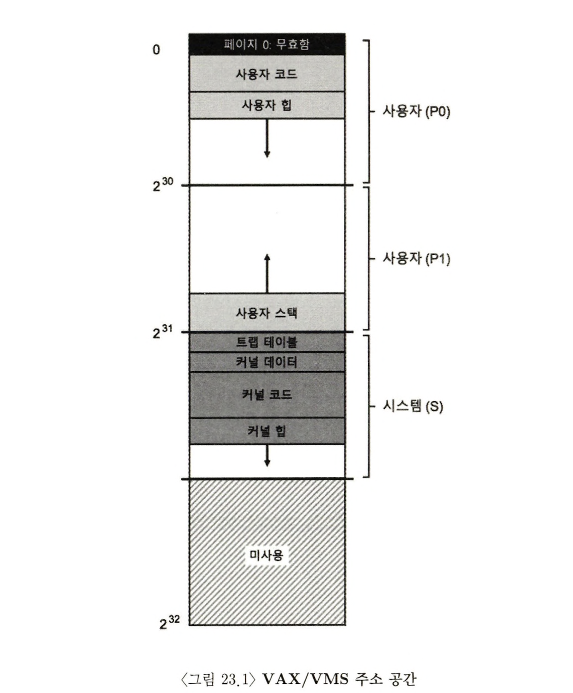
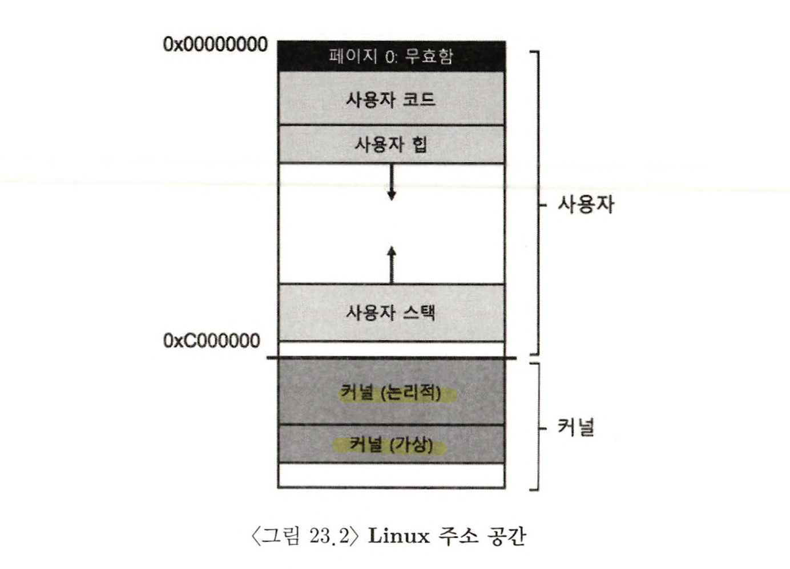

> 본 내용은 OSTEP 의 내용을 정리 및 요약한 내용입니다.
> 전문은 [이 곳](https://pages.cs.wisc.edu/~remzi/OSTEP/)을 방문하시면 보실 수 있습니다.

# 23. 완전한 가상 메모리 시스템

완전한 가상 메모리 시스템 구현을 위해선, 페이지 테이블 설계 방식, TLB와의 상호작용(MMU), 페이지 교체 정책 외에도 많은 다양한 특징들이 필요하다. 이러한 특징에는 `성능`, `기능성`, `보안을 위한 특징` 등을 다양하게 포함하고 있다. 그렇기에 이번 챕터의 핵심 질문은 다음과 같다. 

> 핵심 질문 : 완전한 VM 시스템 구현 하는 방법은?
> 완전한 가상 메모리 시스템을 구현하기 위해서 필요한 특징은 무엇인가? 

2개의 기존 시스템을 바라보면서 구체적인 구현 방법에 대해 알아볼 것이다. 1970년대, 80년대 초에 개발된 것으로 현대적인 가상 메모리 관리자의 시초인 VAX, VMS 운영체제를 찾을 수 있고, 학습할 가치가 있는 시스템이다. 

두번째로 볼 시스템은 Linux에 대한 내용이다. 이는 Linux가 널리 사용되는 시스템이며, 아주 다양한 곳에서 Linux VM 시스템은 이러한 모든 시나리오에서 성공적으로 실행될 수 있을 만큼의 융통성이 있어야 하며, 이는 아주 좋은 학습의 도구일 것이다. 

## 23.1 VAX/VMS 가상 메모리 

- VAX-11 미니 컴퓨터 구조는 1970년대 말 Digital Equipment Corporation(DEC)에서 소개된 것이다. 
- VAX/VMS(또는 단순하게 VMS) 라고 알려진 OS의 주요 아키텍트는 Dave Cutler로서 이후에는 Microsoft Windows NT 개발을 이끌었다. 
- 해당 아키텍쳐는 고사양의 기계에서 다양한 종류의 시스템에서 동작하는 기법들과 정책을 필요시 되었다. 
- 그런 점에서 VMS가 구성되었고, 컴퓨터의 구조적 결함을 소프트웨어로 보완한 훌륭한 사례로 남게 되었다. 
- OS가 이상적인 개념과 환상을 제공하기 위해 하드웨어에 의존하지만, 하드웨어가 모든 것을 할 수 없을 수 있다. VAX 하드웨어에서 해당 사례들을 몇가지 볼 것이며, 하드웨어 결함에도 시스템이 효과적으로 작동하기 우해 VMS 운영체제가 무엇인지를 볼 것이다. 

### 메모리 관리 하드웨어

- VAX-11은 프로세스 마다 512바이트 페이지 단위로 나누어진 32비트 가상 주소 공간을 제공한다. 
- 가상 주소는 23비트의 VPN과 9비트의 오프셋을 갖고 있다. VPN의 상위 2비트는 페이지가 속한 세그먼트를 위하여 할당되었으며, 이 시스템은 앞서 보았던 `페이징과 세그멘테이션` 의 하이브리드 구조를 갖고 있다. [참고](obsidian://open?vault=content&file=STUDY%2Fostep%2F20230205_013)
- 주소 공간의 하위 절반은 '프로세스 공간'으로 알려져 있으며, 프로세스마다 다르게 할당된다. 프로세스 고간의 첫 번째 절반에는 사용자 프로그램과 힙이 존재한다. 힙은 주소가 큰 쪽으로 증가하고, 스택은 주소가 작은 방향으로 증가한다.
- 주소 공간의 상위 절반은 그 중 반만 사용되며, 시스템 공간(S)으로 불린다. 여기엔 OS의 보호된 코드, 데이터가 존재하며 이 방식으로 여러 프로세스가 OS를 공유한다. 
- VMS 설계자들의 핵심 고민 중 하나는 VAX 하드웨어의 페이지 크기가 고작 512바이트 밖에 되지 않았다는 것이다. 이렇게 된 이유는 기본적으로 페이지 크기가 역사적 상황에 따라 결정되며, 선형 페이지 테이블의 크기가 지나치게 커지기에 512바이트로 지정되었고, 이런 상황에서 VMS 설계자들의 첫 목표 중 하나는 VMS가 페이지 테이블 저장을 위해 메모리를 소진하는 것을 막는 것이었다. 
- 이런 점에서 해결을 위해 두가지 방법을 제시한다. 
	- VAX-11은 사용자 주소 공간을 두개의 세그먼트로 프로세스마다 각 영역을 위한 페이지 테이블을 가지도록 하였다. 
		- 스택과 힙 사이의 사용되지 않은 주소 영역을 위한 페이지 테이블 공간이 필요 없게 되었다. 베이스와 바운드 레지스터는 그대로 사용한다. 
	- OS는 사용자 페이지 테이블들을 커널의 가상 메모리에 배치하는 방식을 채택했다. 해당 방식은 페이지 테이블의 할당, 크기 변경 시 커널은 자신의 가상 메모리, 세그먼트 S 내에 공간을 할당한다. 메모리가 고갈 되면, 커널은 페이지 테이블의 페이지들을 디스크로 스왑, 물리 메모리를 다른 용도로 쓰게 할 수 있다. 
		- 그러나 커널 가상 메모리에 페이지 테이블을 넣으면 주소 변환과정이 훨씬 복잡하다. 
		- 그럼에도 VAX의 하드웨어 TLB에 의해 빠른 처리를 가능케 했다. 

> 핵심 질문 : 일반론의 저주 (The Curse of Generality)를 어떻게 방지할까 
> 일반론의 저주란, 시스템을 폭넓게 지원하려고 하다보니 막상 어느하나 제대로 설치 환경을 지원할 수 없게 된다는 개념이다. VMS에서도 이것이 현실이 되었고, 현재는 Linux가 다양한 환경에서 동작이 잘 될 것이라는 기대 속에 있다.

### 실제 주소 공간

- VMS 에서는 코드 구조를 그대로 볼 수 있는데, 코드 세그먼트는 페이지 0에서 절대 시작하지 않으며, 페이지 0 위치는 **널 포인터(null-pointer)** 로 지정되어 있어서, 접근이 불가능하도록 되어 있다. 
- 여기서 중요한 포인트는 커널의 가상 주소 공간이 사용자 주소 공간의 일부이며(커널에서 매핑하는 구조니까), 실제로 컨택스트 스위칭이 발생하면, 다음 실행될 프로세스의 페이지 테이블을 가리키도록 OS가 P0, P1레지스터를 변경한다. 하지만 S 베이스, S 바운드 레지스터는 변경하지 않는데, 왜냐면 커널 내부에 있고 결과적으로 **동일한** 커널 구조들이 각 사용자 주소 공간에 매핑되기 때문이다. 
- 커널은 여러 주소 공간으로 매핑되고, 이러한 구조는 커널의 동작이 쉬워지는 효과를 제공한다. 



- 위와 같은 구조가 되면, 포인터를 전달 받았을 때, 데이터를 자신의 구조로 그냥 복사하면 되는 구조가 된다.
- 만약 반대로 커널이 전부 물리 메모리에 별개로 존재하면, 페이지 테이블의 데이터를 디스크로 스왑하는 등의 작업이 상당히 어려워진다. 별개의 공간화 된다는 것은 그만큼 복잡하고 오버헤드가 심한 구조가 될 것이다.
- 이러한 VAX 주소 공간에 관해 마지막 이슈는 보호와 관련된 부분이다. OS는 응용 프로그램이 OS의 데이터나 코드에 읽거나, 쓰기를 막아야 한다. 운영체제의 자료 보호를 위해 하드웨어가 페이지 별로 보호 수준을 다르게 설정할 수 있어야 하며, 이를 위해 VAX는 페이지 테이블의 `protection bit`에 보호 수준을 지정하는 방식을 취한다. 만약 여기서 사용자 권한에서 높은 수준을 접근하려고 하면 트랩을 일으키며, 일으킨 프로세스는 종료된다. 


### 페이지 교체

- VAX의 페이지 테이블(PTE) 에서는 다음과 같은 비트를 가지고 있다. 유효 비트(valid), 보호 필드(protection field, 4비트), 변경(modify 또는 dirty)비트, OS가 사용하기 위해 예약해놓은 필드 5비트, 마지막으로 물리 메모리 페이지 위치를 저장하기 위한 물리 프레임 번호(PFN)가 있다. 
	- 여기서 특징적으로 **참조 비트(reference bit)** 가 없다. VMS 교체의 알고리즘은 어떤 페이지가 자주 사용중인지를 하드웨어 지원 없이 판단하여야 한다. 
- 개발자들은 여기서 **메모리 호그(memory hog)** 에 대해 고민하였다. 메모리 호그란, 프로그램이 과도하게 메모리를 사용하는 경우를 말한다. 지금까지 우리가 살핀 정책들에서 이 경우를 고려한 대비책이 있진 않았다. 
- 이러한 상황을 해결하고자 VAX 개발자는 **세그먼트 된 FIFO** 교체 정책을 제안한다. 
	- 각 프로세스는 `상주 집합 크기(resident set size, RSS)` 라고 불리는 메모리에 유지 할 수 있는 최대 페이지 개수를 지정 받는다. 
	- 만약 이 페이지 개수, RSS를 넘어서는 페이지가 할당되면, 제일 '먼저' 들어온 페이지를 swap-out 시켜버린다. FIFO는 하드웨어 지원이 필요없는 구현이므로 쉽게 구현된다. 
- 순수한 FIFO의 성능은 좋지 못하다. 그런 점에서 VMS 는 전역 클린-페이지 프리 리스트(global clean-page free list)와 더티 페이지 리스트(dirty-page list)라는 두개의 **second-chance list**를 도입한다. 
	- 이 리스트는 메모리에서 제거 되기 전에 페이지가 보관되는 리스트이며, 프로세스 P가 자신의 RSS를 넘길 때 자신의 FIFO에서 페이지가 제거되며, 제거된 페이지가 클린 상태이면 클린-페이지 리스트에, 더티 상태라면 더티 페이지 리스트에 추가 된다. 
	- 이런 상황에서 `프로세스 Q`  에 빈 페이지가 필요한 상황이면 전역 클린 리스트에서 첫 번째 프리 페이지를 꺼낸다. 원래 프로세스 P가 해당 페이지 회수되기 전에, 그 페이지에 대해 폴트를 발생 시키면 P는 프리(또는 더티) 리스트에서 페이지를 가져가 다시 사용한다. 
	- 이런 상황에서 전역 second-chance list 의 크기가 클 수록 세그먼트된 FIFO 알고리즘은 LRU와 유사하게 동작해진다. 
- 또 다른 최적화 기법으로 디스크는 전송 단위가 클 수록 성능이 좋아지므로 **클러스터링(clustering)** 이란 기법을 도입한다. 이 기법은 VMS는 전역 더티 리스트에 있는 페이지들을 작업 묶음으로 만들고, 한 번에 디스크로 보내서, 작은 페이지 크기에서 오는 문제를 극복한다.

### 그 외 기법들 

- VMS는 여기에 두 가지 추가적인 표준화 기법을 사용한다. 
	- **요청 시 0으로 채우기(demand zeroing)** 기법 
	- **쓰기-시-복사(copy-on-write)**
- 첫 번째 기법은, 최대한 요청이 오기 전까지 대기하는 방식이다. 페이지 테이블에 접근 불가능 페이지라고 표기하고 항목을 일단 추가한다. 프로세스가 추가된 페이지를 읽기 전까진 가만히 두다가, 이후 운영체제 트랩이 발생되면 그때 demand zeroing 할 페이지라는 것을 파악하고 0으로 채우며, 프로세스의 주소 공간의 매핑 등의 작업을 처리해준다. 따라서 프로세스가 해당 페이지를 전혀 접근하지 않는다면 일단 모든 작업을 하지 않으므로 훨씬 좋은 성능을 보여준다. 
- 두 번째 기법은 copy-on-write 이다. 해당 방법은 주소 공간에서 다른 공간으로 페이지를 복사할 필요가 있을 때, 복사가 아니라, 해당 페이지 대상 주소 공간으로 매핑하고, 해당 페이지 테이블 엔트리를 양쪽 주소공간에서 읽기 전용으로 표시하는 방식이다. 이렇게 되면, 운영체제는 실제 데이터 이동 없이 빠른 복사를 가능케 한다. 
	- 이 방식읜 여러 이점이 있는데, 공유 라이브러리를 형성함으로써 여러 프로세스 주소 공간에 copy-on-write 로 매핑하여 메모리 공간을 절약할 수 있다. 
	- UNIX 시스템에선 이러한 COW가 fork(), exec()에서 특히 중요한데, 이는 동일한 사본의 주소 공간을 생성하는 면에서 COW 방식으로 공유되는 부분은 이용하도록 하면, OS가 불필요한 복사를 최소화 하면서도 성능을 개선하고, 정확한 시스템 체계를 유지할 수 있는 것이다. 

## 23.2  Linux 가상 메모리 시스템 

- Linux 의 개발은 실제 엔지니어가 개발 과정 중에 직면한 실제 문제를 해결하는 방향으로 발전해왔다. 다양한 기능이 천천히 통합되면서 현재의 완전하게 동작하는 기능이 종합적으로 가상 메모리 시스템화 되었다. 
- Linux VM의 모든 측면은 논할 수 없지만, VAX/VMS와 같은 고전 VM 시스템에서 발전된 방면에 초점을 맞춰 볼 것이며, 동시에 공통점도 눈여겨 볼 것이다. 
- 해당 논의가 되는 기반은 Intel x86 기반이라는 점을 명심하시오. 

### Linux 주소 공간 



- VAX / VMS와 같이 Linux의 가상 주소 공간은 사용자 영역(코드, 스택, 힙, 및 기타), 커널 부분(커널 코드, 스택, 힙 및 기타)으로 구성된다. 
- 기본적으로는 우리가 알고 있듯 컨텍스트 스위칭이 일어나면 실행중인 주소 공간의 사용자 영역이 바뀌며, 커널은 공유한다. 커널의 접근은 동일하게 트랩 발생, 특권 모드로 전환될 때 가능하다. 
- 전형적인 32비트 Linux에서는 주소 공간의 사용자와 커널 사이를 분할하는 주소는 0xC000000 또는 주소 공간의 3/4 지점에서 발생한다. 나머지 윗 지점, 즉 0x0 ~ 0xBFFFFFFF 가 사용자 가상 주소 공간이 된다. 64비트도 유사하지만, 그 지점은 다르다. 
- 위 예시에서 보면 한가지 특이한 점은 커널 주소 공간도 두개로 쪼개진다는 점이다. 
	- **커널 논리 주소(kernel logical address)** : 
		- 이 영역은 일반적으로 우리가 생각하는 커널의 가상 주소 공간이다. 메모리가 더 필요하다면 커널코드는 kmalloc을 호출하면 되고, 페이지 테이블, 프로세스 별 커널 스택 등과 같이 대부분의 커널 데이터 구조가 이 공간에 존재한다. 
		- 본 여역은 디스크로의 스왑이 되지 않는다. 
		- 흥미로운 부분은 물리 메모리와 연결되는 방식이다. 커널 논리 주소는 물리 메모리의 첫 부분에 직접 매핑된다. 따라서 커널 논리 주소 0xC0000000은 물리주소 0x00000000과 연결되며, 이러한 점은 두 가지 특징을 가진다. 
			- 첫째 커널 논리 주소와 물리주소 사이의 변환이 간단하다. 
			- 둘째 메모리 청크가 커널 논리 주소 공간에서 연속적이면 물리메모리에서도 연속적이라는 확실한 특성을 갖추게 된다. 
		- 위의 특성 덕분에 연속적인 물리 메모리를 필요하는 작업에 아주 적합하다는 것을 의미하며, 그 성능 역시 훌륭하다고 볼 수 있다. 
			- 이러한 작업에는 **직접 메모리 접근방식(direct memory access, DMA)** 를 사용하여 장치와 메모리 사이의 입출력 전송의 경우가 있다. 
	- **커널 가상 주소(kernel virtual address)**
		- 이 유형은 메모리를 확보하기 위해 **vmalloc**을 호출한다. vmalloc은 원하는 크기의 가상 공간에서 연속적인 영역에 대한 포인터를 제공한다. 
			- 커널 논리 메모리와 달리 가상 메모리는 보통 연속적이지 않다. 각 커널 논리 메모리와 달리, 물리 페이지와 정확하게 매핑이 되지 않아 DMA용으론 적합하지 않다.
			- 그러나 반면에 메모리는 결과적으로 더 쉽게 할당 할 수 있기 때문에 연속된 물리 메모리 청크를 찾는 것이 어려운 대용량 버퍼 할당에 유용하다. 
		- 이러한 커널 가상 주소가 존재하는 또 다른 이유는 커널이 1GB 이상  메모리를 더 사용할 수 있게 한다는 점이다. 과거에는 크게 중요하지 않았으나, 기술의 발전으로 커널은 더 많은 양의 메모리 사용이 필요시 되었고, 물리 메모리와 꼭 일대일로 매핑될 필요가 없다고 정립되는 과정에서 커널도 가상주소 방식으로 할당해도 괜찮다는, 생각까지 오게 된 것이다. 그리고 이런 와중에 64비트 시스템으로의 전환은 1:1 매핑의 필요성을 줄였고, 이에 커널도 가상 주소 영역에 들어갈 수 있게 된 것이다. 

### 페이지 테이블 구조 

- 본 챕터에서 x86용 Linux 에 중점을 두고 이야기 하는 이유는, 프로세서가 제공하는 페이지 테이블 구조가 Linux 가 할 수 있는 일과 할 수 없는 일을 결정하기 때문이다. 
- x86은 하드웨어가 관리하는, 다중 레벨 페이지 테이블 구조를 제공하며 프로세스 당 하나의 페이지 테이블이 있다. 
- x86은 하드웨어가 관리하는 다중 레벨 페이지 테이블 구조를 제공하며 프로세스 당 하나의 페이지 테이블이 있다. OS는 단지 메모리 매핑을 설정하고 특권 레지스터가 페이지 디렉터리의 시작 주소를 가리키게 하기만 하면 하드웨어가 그 이후의 모든 처리를 담당한다. 
- 즉 OS는 프로세스 생성, 삭제 및 컨텍스트 스위칭에 관려하며, 각 경우 주소변환은 하드웨어 MMU가 맞는 페이지 테이블을 사용하게 한다. 
- 최근 몇 년 간 가장 큰 변화는 32비트에서 64비트로의 시스템 전환이다. 32비트 체제의 주소 공간은 오랫동안 사용되었고, 기술 발전에 따라 마침내 프로그램의 실질적인 제약이 되기 시작한 것이다. 가상 메모리를 사용하면 시스템을 더 쉽게 프로그래밍 할 수 있지만, 물리적 하드웨어 스펙이 상향됨에 따라 32비트는 더 이상 이 전체를 참조하기 충분치 않았던 것이다. 
- 64비트 주소로 전환하면서, x86의 페이지 테이블 구조도 바뀌게 된다. 64비트가 되면서 4 레벨 테이블로 다중 레벨 페이지 테이블을 사용한다. 그럼에도 여전히 64비트 크기의 전체 가상 주소 공간을 다 쓰진 않고 `48비트` 만을 아직 사용하고 있다.
	- 상위 비트 16비트는 사용되지 않고(변환 과정 중 아무런 역할 없음)
	- 하위 12 비트는 오프셋으로 사용된다.
	- 그 중간이 페이지 디렉터리를 색인하는 용으로 사용된다. 이후에 시스템 메모리가 훨씬 더 커진다면 더 많은 레벨이 열려야 하고, 최종적으로 6레벨 페이지 테이블 트리 구조를 갖게 될 것이다. 

### 크기가 큰 페이지 지원 

- Intel x86 은 표준 4KB 페이지와 더불어 여러 크기 페이지를 사용할 수 있다. 특히 최근 설계는 2MB, 1GB까지도 하드웨어로 지원하게 되었다. 따라서 Linux 응용프로그램이 이러한 거대한 페이지도 활용 가능하도록 개선되었다. 
- 거대한 페이지를 사용하면 페이지 테이블에 필요한 매핑 개수가 줄고, TLB가 더 효과적으로 작동하며 성능 상의 이점을 확보한다. 
- 또한 TLB 미스가 발생해서 이를 처리하려고 해도, 거대 페이지를 지원하는 것은 할당을 빠르게 할 수 있다는 점도 있다. 
- 이러한 거대 페이지는 처음에 엄격한 성능 요구사항을 가진, 대규모 데이터 베이스와 같은 몇몇 응용프로그램에게만 중요하다고 생각했다. 이 방식의 경우 대부분의 응용프로그램에 영향으 주진 않아서 계속 4KB 페이지만 사용한다.
- 하지만 최근에는 응용프로그램들이 TLB를 더 효과적으로 사용할 수 있기를 바래, **투명한(transparent)** 거대 페이지 지원을 추가했다. 이로써 응용 프로그램을 수정하지 않더라도 거대한 페이지를 OS가 할당할 수 있는 기회를 자동으로 찾는다. 

- 단, 이러한 방식은 '내부 단편화(internal fragmentation)'이라는 잠재적 비용을 가지게 된다. 
- 뿐만 아니라 거대한 페이지는 스와핑도 제대로 작동하지 않고, 시스템의 I/O 수행 양을 늘리기도 한다. 

- 결론적으로 메모리 크기가 커짐에 따라 VM 시스템의 필수적인 발전의 일부로 대용량 페이지 및 기타 해결책이 지속적으로 고려되어야 한다. 

### 페이지 캐시 

- Linux 자체는 전통적인 운영체제와 동일하게 캐싱 서브시스템으로 데이터 항목을 메모리에 유지시키는 특징을 동일하게 가진다. 
- Linux page cache 는 세가지 주요 소스로부터 온 페이지를 메모리에 유지할 수 있도록 통합된다. 
	- 메모리 맵 파일(memory-mapped  files)
	- 파일 데이터와 장치의 메타 데이터 
	- 힙과 각 프로세스를 구성하는 스택 페이지
- 이러한 개체들은 **페이지 캐시 해시 테이블(page cache hash table)** 에 보관되므로 데이터가 필요시 빠른 검색을 가능케 한다. 
- 페이지 캐시는 항목이 클린(clean)(읽었지만, 갱신되지 않은) 또는 더티(dirty)(수정된modified)를 추적한다. 
	- 더티 데이터의 경우 백그라운드 쓰레드(pdflush)에 의해 백킹 스토어에(파일 데이터의 경우 특정 파일로 또는 anonymous 영역인 경우 스왑 공간으로) 주기적으로 갱신 데이터를 영구 저장 장치에 다시 기록하게 한다. 이러한 활동은 dirty page의 숫자를 통해 진행되며 이는 모두 설정 가능한 매개 변수 형태를 가지고 있다. 
- 시스템의 메모리가 부족할 것을 대비해 Linux 는 공간을 확보하기 위한 메모리 교체 정책으로 **2Q 교체 알고리즘** 을 사용한다.
	- 표준 LRU 교체 알고리즘은 효과적이나, 특정 액세스 패턴에서 효과가 반전될 수 있다. 특히 메모리 크기와 거의 같거나, 더 큰 대용량 파일을 반복적으로 액세스 하는 경우 LRY는 다른 파일 전부를 메모리에서 축출하고, 이 경우 오버헤드가 극심하다. 
	- 2Q 알고리즘은 두개의 리스트를 유지하여, 메모리를 두 부분으로 나누어 LRU가 가진 애매한 부분을 보완한다. 
		- 처음 액세스 된 페이지는 A1(**비활동 리스트(inactive list)**)에 들어간다. 여기서 재 참조 되면 Aq(**활동리스트(active list)**) 에 들어가게 된다. 
		- 여기서 교체가 필요할 때는 요체 후보에 있는 inactive list에서 가져오게 된다. 
		- 또한 Linux는 주기적으로 페이지를 활성화 리스트의 맨 아래 페이지를 비활성 리스트로 이동 시켜 활성 리스트의 길이가 총 페이지 캐시 크기의 약 2/3 되도록 유지한다. 
		- 이렇게 하면 LRU와 매우 유사하게 동작하지만, 위에서 언급한 예외 케이스들에 대해 문제 해결이 된다. 

### 보안과 버퍼 오버플로 공격

- 현대 VM 시스템(Linux, Solaris, BSD 변종 들)과 오래된 시스템(VAX/VMS) 간의 가장 큰 차이점은 현대 시대에 오면서 `보안`을 중요하게 다룬다는 점이다. 과거에 비해 해커가 시스템을 제어할 수 있고, 이를 방어하는 대책이 구현되어야 하는 것이다. 

#### 버퍼 오버프로 공격
- 보통 사용자 프로그램이나 커널 자체를 대상으로 일어나는 공격으로, 공격자가 목표 시스템의 주소 공간에 임의의 데이터를 주입할 수 있는 버그를 찾는 방식이다. 
- 개발자가 입력이 길지 않을 것으로 생각하고, 입력 퍼버에 복사를 지정해 버리면, 실제 입력이 너무 길게 들어와서 버퍼의 경계를 넘어 목표 메모리를 덮어 쓰게 만들고, 이 경우 목표 메모리에서 공격자가 권한을 획득하게 된다. 
- 다행이도 다수의 경우 오버 플로는 치명적이진 않다. 기껏해야 크래시는 나지만 결국 종료되고 시스템은 정상으로 들어온다. 
- 하지만 악의적으로 오버플로하는 입력을 정교하게 만들어서 목표 시스템에 자신의 코드를 주입하여 시스템을 장악하는 경우는 매우 위험하 수 있다. 
	- 특히나 OS 를 대상으로 공격이 성공하면, 공격자는 OS의 자원을 사용할 수 있고 **권한상승(privilege escalation)** 의 한 형태이다. 
- 이러한 버퍼 오버플로 공격의 가장 단순한 방어 방식은 주소 공간의 특정 영역에 탑재된 어떤 코드도 실행할 수 없게 만드는 것이다. 
	- AMD의 경우 x86 버전에 도입한 NX(No-eXecute) 비트, 인텔의 경우 XD 비트를 제공한다. CPU는 해당 페이지 테이블 항목에 이 비트가 설정된 임의의 페이지에서 실행을 금지 시킨다. 이 접근법은 공격자가 목표 스택에 주입한 코드 실행을 방지하여 문제를 완화시킨다. 
- 그러나 공격자들은 악의적 코드를 임의의 명령을 시퀀스할 수 있다. 가장 일반적인 형태로 **return-oriented programming(ROP)** 로 알려져 있다. 
	- 이는 C 라이브러리와 연결된 C 프로그램에 공격에 활용할 많은 코드 부분들(ROP 용어로 가젯이라 부른다)이 존재한다는 것이다. 
	- 공격자는 현재 실행중인 함수의 복귀주소가 복귀 명령 다음에 실행되기 원하는 악성 명령어를 가리키게 스택을 덮어 씌우는 것이다. 많은 수의  가젯을 엮어 공격자가 원하는 코드를 실행할 수 있는 것이다. 
- 이러한 상황을 개선하기위해 또 다른 방어책으로 **address space layout randomization(ASLR)** 라는 것을 추가한다. 
	- 가상 주소 공간 내의 고정 위치에 코드, 스택, 힙을 배치하던 것을 OS가 무작위로 배치하여 공격을 구현학 어렵게 만드는 것이다. 
	- ASLR은 사용자 수준의 방어 수단이기에 **kernel address space layout randomization(KASLR)** 로 커널에 통합되었다. 

### 다른 보안 관련 문제들 : Meltdown And Spectre

- 각 공격에 악용되는 일밙거인 취약점은 최신 시스템의 CPU가 성능 향상을 위해 사용하는 비법들에서 발생하는 경우가 많다. 
- 그중 하나가 **speculative execution** 이라고 하며, 이는 CPU 가 향후 실행될 명령어를 추측, 미리 실행해두는 기법이며, 이 추측이 맞으면 프로그램이 더 빠르게 실행되는 로직이며, 추측이 틀리면 기존의 예측시 맞다면 사용하려고 준비한 아키텍쳐 상태를 롤백한 뒤 올바른 경로로 실행하는 구조다. 
	- 이러한 추측 로직은 프로세서 캐시, 분기 예측기 등 시스템 여러 부분에서 실행 흔적을 남긴다. 
	- 이런 흔적들은 메모리나 심지어 MMU에서 보호 된다고 생각한 메모리 조차 취약하게 만들었다. 
- 커널 보호를 강화하는 방법 중 하나로, 각 사용자 프로세스에서 커널 주소 공간을 최대한 많이 제거하고, 대신 대부분의 커널 데이터에 대해 별도의 커널 페이지 테이블을 사용하는 것이다. (**커널 페이지 테이블 격리(kernel page table isolation, KPTI)**)
	- 커널의 코드와 자료구조를 각 프로세스에 '직접' 매핑하는 대신에 '최소한' 매핑만을 진행한다. 
	- 즉 커널로 전환할 때 커널 페이지 테이블로 전환하고, 커널 내부에 들어왔을 때 비로소 필요한 구조에 접근한다. 이렇게 하면 보안은 향상되고, 공격 경로 일부는 피한다. 하지만 '성능저하'는 당연히 발생한다. 
- 아쉽게도 KPTI 와 같은 방법을 써서 보안을 강화하는 것은 가능했다. 하지만 이는 문제들 중 생긴 일부만을 해결하는 것이며, 그렇다고 이 기능을 비활성화 하는 해결책은 시스템이 수천배 느리게 실행되도록 만드는 만큼 끌 수도 없다. 
- 만약 공격에 대하여 진정으로 이해하기 위해선 CPU가 추측하고, 이를 구현하는데 필요한 모든 메커니즘을 이해하는 것에서부터 시작해야 한다. 이러한 내용은 컴퓨터 구조에 대한 상급 책에서 제시되며, Meltdown, Spectre 공격에 대한 이해가 필요하다. 

## 23.3 요약 
- 크게 중요한 내용은 없으므로 정리를 스킵한다. 

```toc

```
