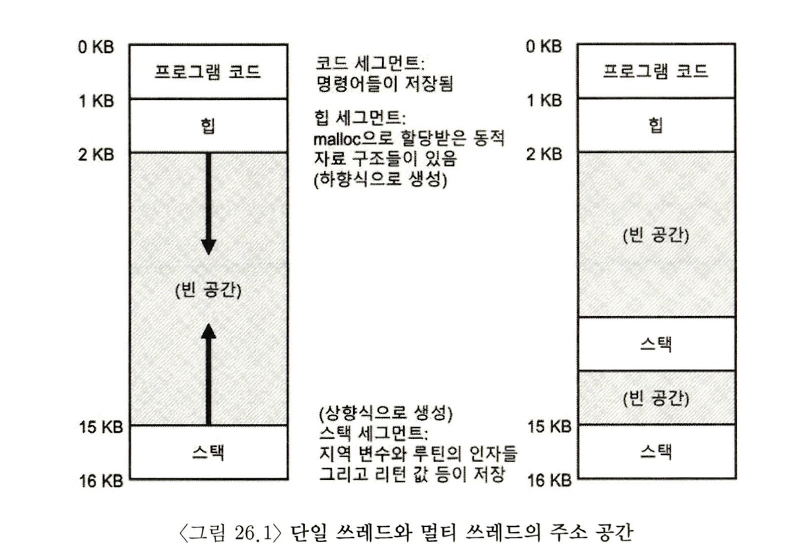
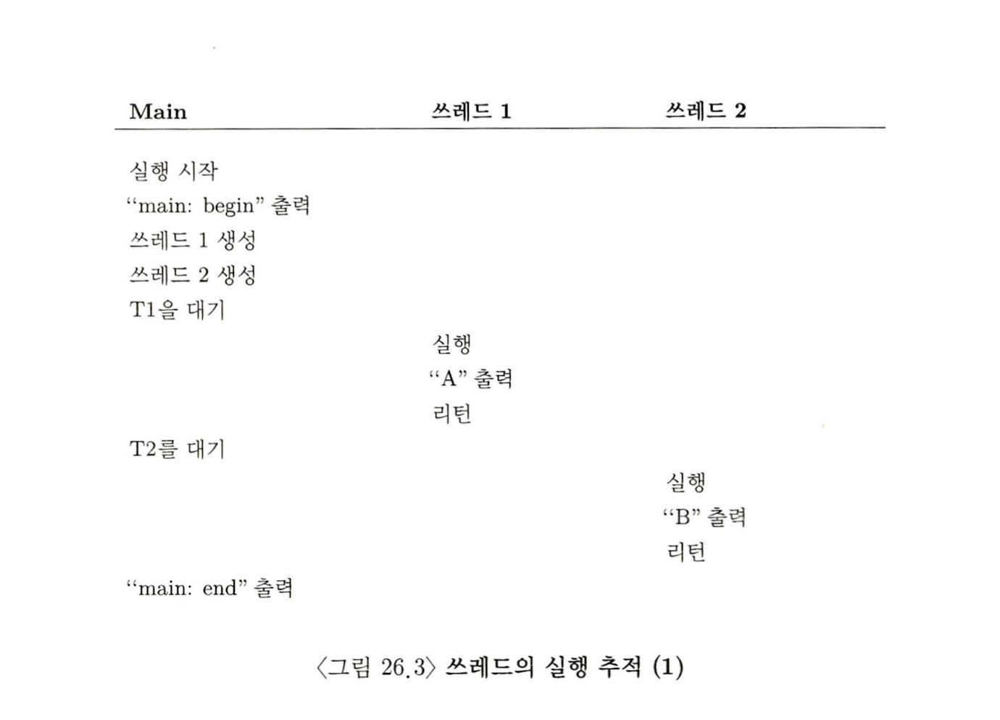
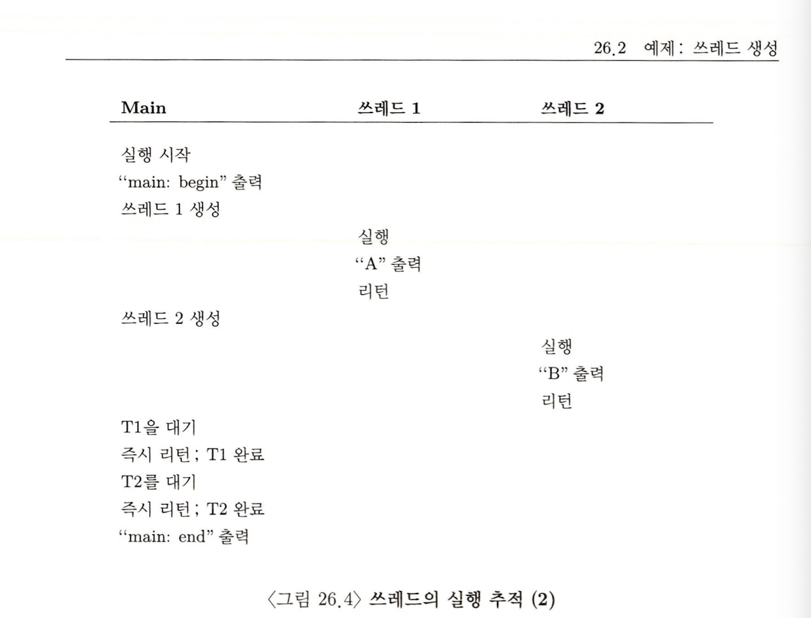
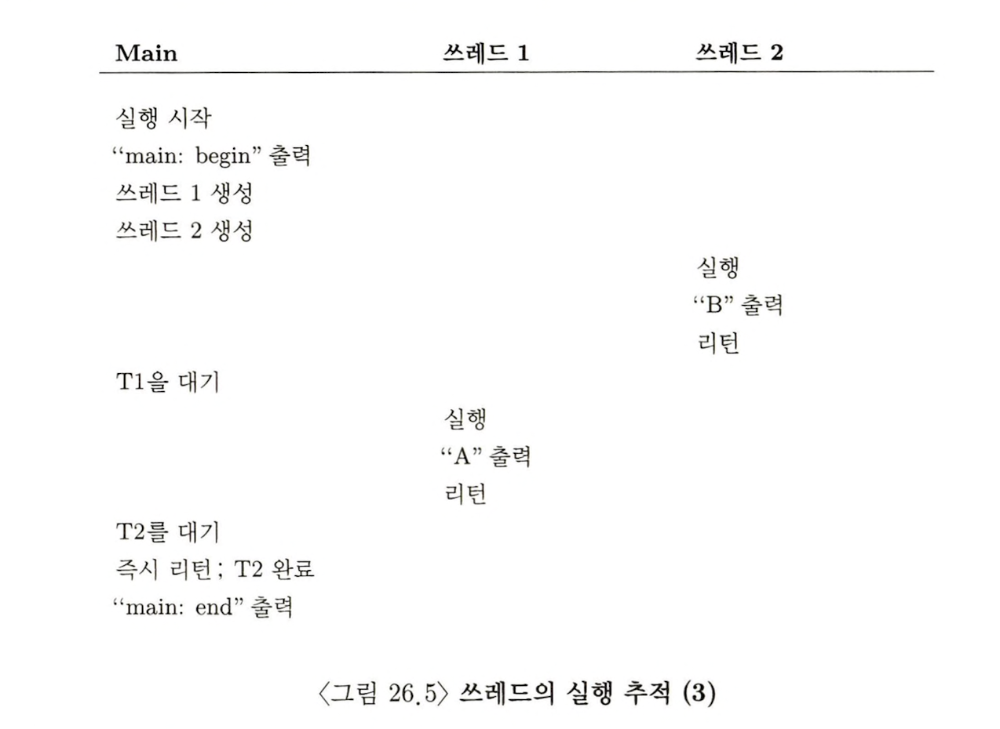
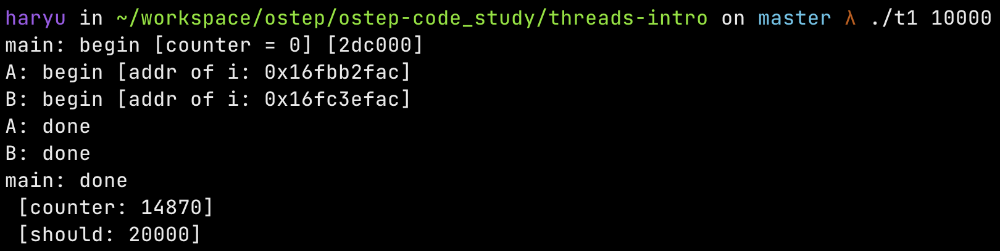
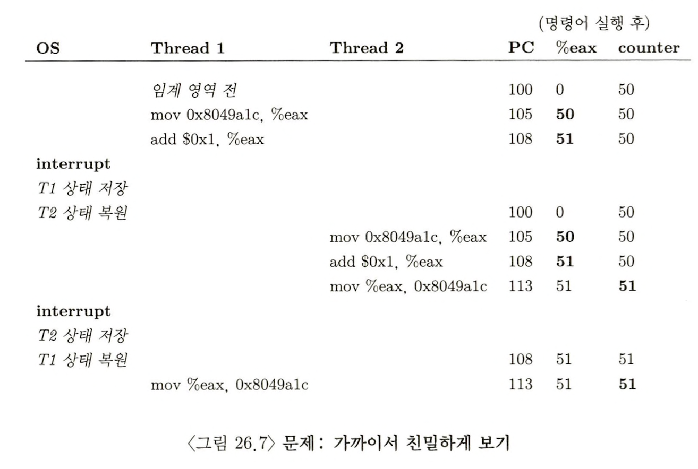

> 본 내용은 OSTEP 의 내용을 정리 및 요약한 내용입니다.
> 전문은 [이 곳](https://pages.cs.wisc.edu/~remzi/OSTEP/)을 방문하시면 보실 수 있습니다.

# 25. 동시성(병행성)에 관한 대화
- 본 교재에서는 `병행성`이란 키워드로 설명을 진행합니다. 하지만 현재 공통적으로 사용되는 한국어 번역은 `동시성(concurrency)`라고 생각하여, 이후 모든 '병행성'은 '동시성'으로 지칭하고 진행합니다. 
- 대화 내용 생략 
- 동시성이라고 하는 항목은 응용 프로그램이 보다 빠르지만 정확하게 여러 작업이 한꺼번에 일어나도록 하는 것과 관련이 있다. 그럼에도 왜 이것을 운영체제에서 배워야 하는가? ➡️ 
	1. 운영체제는 락(lock)과 컨디션 변수(condition variables)와 같은 **멀티 쓰레드 프로그램**을 지원해야 하기 때문이다. 
	2. 운영체제는 그 자체가 최초의 동시성 프로그램이기 때문이다.

# 26. 동시성 : 개요 
지금까지 배운 내용, 가상화를 통해
- 가상 CPU로 CPU를 확장하여 여러 프로그램이 동시 실행하는 듯한 착시를 만듬
- 가상 메모리를 가지는 것으로, 실제 메모리 공간에서 프로세스는 자기만의 메모리 공간이 있는 듯한 착시를 만들었다. 
- 결국 최종적으로 **멀티 프로세싱**을 구현해낸 운영체제를 얻을 수 있었다. 
- 그리고 이번장부터는 프로세스  내부에서의 동시적 작업을 위한 `쓰레드(thread)`를 도입한다. 
- 멀티 쓰레드는 각 쓰레드가 프로세스와 유사한 기능을 한다고 볼 수 있지만, 동시에 쓰레드들 끼리는 주소 공간을 공유하기 때문에 `동일한 값`에 접근할 수 있다는 점이다. 

- 쓰레드는 기본 상태는 프로세스의 그것과 유사하다. 
	- 명령어를 불러 들이는 위치를 추적하는 프로그램 카운터(PC)와 연산을 위한 레지스터를 갖고 있음
	- 만약 두개 쓰레드가 하나의 프로세스에서 존재한다면(P = T1, T2), 실행 중인 T1에서 T2로 바뀌기 위해선 반드시 `문맥 교환(context switch)`을 통해서 교체 되어야 한다. 
	- 그러나 차이점도 있는데, 프로세스 사이의 문맥 교환 시 주소 공간 자체가 달라지는 것과 대비해서, 쓰레드 사이에선 사용하고 있던 주소 공간을 그대로 사용한다.(**페이지 테이블을 교체하지 않고 그대로 사용할 수 있다.**)
	- 프로세스가 문맥 교환시 프로세스 상태를 저장하는 PCB(Process Control Block)가 있듯이, 쓰레드 상태를 제어하기 위한 `TCB(Thread Control Block)`이 필요하다. 

- 쓰레드-로컬 저장소(thread-local storage) 
	- 고전적인 프로세스는 주소 공간에서 큰 변화가 없으며, stack 이 하나밖에 존재 하지 않는다. 
	- 반면에 멀티 쓰레드를 지원하는 경우, 각 쓰레드의 독립적 실행을 위해 쓰레드마다 stack 이 할당 되어 있다. 
	- 쓰레드마다 할당되는 stack 주소 공간은 stack에서 할당되는 변수들, 매개 변수, 리턴값, 그 외의 것들을 넣는 역할을 하며, 이 공간을 개념 구분적으로 `쓰레드-로컬 저장소` 라고도 부를 수 있다. 
	- 더불어 이러한 구조로 인해, 기존의 정교한 주소 공간 배치의 로직이 무너질 수 있다는 사실을 알 수 있다. 무조건 적으로 문제가 있는 것은 아니지만 예전에 지정했던 상황과는 달라져버렸다. 

## 26.1 왜 쓰레드를 사용하는가? 

1. **병렬 처리(parallelism)** : <br>프로그램의 각 부분을 각 프로세서가 일부분을 수행해줌으로써 실행 속도를 높일 수 있다. 표준 단일 쓰레드(single-threaded) 프로그램들을 멀티 프로세서 상에서 동시 작업을 진행하는 병렬화(parallelization)라고 부르며, 이처럼 쓰레드를 통해 CPU 마다 하나씩 부여하고 보다 빠른 실행성을 보장하는 것은 전형적인 방법이다. 
2. 프로그램의 입출력(I/O)의 대기 시간 최소화 : <br>다양한 입출력을 수행하는 프로그램이 있다고 생각할 때, 입출력 발생 시마다 이를 기다리는 것은 당연히 비효율적이다. 기다리는 대신 쓰레드를 통해 다른 작업을 CPU가 연산하게 만드는 것은 대기 시간을 자연스럽게 피할 수 있다고 볼 수 있다. <br>쓰레딩은 하나의 프로그램 안에서 I/O와 다른 작업을 **중첩(overlap)** 될 수 있게 한다. 결국 이는 여러 프로그램을 대상으로 프로세스를 **멀티 프로그래밍** 하는 것과 비슷한 맥락인 것이다. 

## 26.2 예제: 쓰레드 생성 

```c
/* 26.2 간단한 쓰레드 생성 코드(t0.c) */
#include <stdio.h>
#include <assert.h>
#include <pthread.h>
#include "common.h"
#include "common_threads.h"

void *mythread(void *arg) {
	printf("%s\n", (char *)arg);
	return NULL;
}

int main(int argc, char *argv[]) {
	pthrea_t p1, p2;
	int rc;
	printf("main: begin\n");
	Pthread_create(&p1, NULL, mythread, "A");
	Pthread_create(&p1, NULL, mythread, "B");
	// 종료 할 수 있도록 대기 중인 쓰레드 병합하기
	Pthread_join(p1, NULL);
	Pthread_join(p2, NULL);
	printf("main: end\n");
	return 0;
}
```




- 위의 예시를 통해 코드로 쓰레드가 어떻게 진행되는지를 볼 수 있다. 여기서 포인트는 쓰레드가 순차적으로 실행될 것 같지만, 실상 그렇지 않다는 점이다. 
- 쓰레드 자체는 함수처럼 호출을 하면되며, 이때 쓰레드가 어떻게 실행될 지는 OS 스케줄러에 의해 결정된다. 

## 26.3 훨씬 더 어려운 이유: 데이터의 공유
```c
/* 26.6 데이터 공우 : Uh Oh(t1.c) */
#include <stdio.h>
#include <stdlib.h>
#include <pthread.h>

#include "common.h"
#include "common_threads.h"

int max;
volatile int counter = 0; // shared global variable
// 본 예제는 개선된 버전의 예제이다.
// mythread()가 지정된 최대치 만큼 값을 더하게 된다. 
// 하지만 공유되는 공간은 문제를 초래한다. 

void *mythread(void *arg) {
    char *letter = arg;
    int i; // stack (private per thread)
    printf("%s: begin [addr of i: %p]\n", letter, &i);
    for (i = 0; i < max; i++) {
	counter = counter + 1; // shared: only one
    }
    printf("%s: done\n", letter);
    return NULL;
}

int main(int argc, char *argv[]) {
    if (argc != 2) {
	fprintf(stderr, "usage: main-first <loopcount>\n");
	exit(1);
    }
    max = atoi(argv[1]);

    pthread_t p1, p2;
    printf("main: begin [counter = %d] [%x]\n", counter,
	   (unsigned int) &counter);
    Pthread_create(&p1, NULL, mythread, "A");
    Pthread_create(&p2, NULL, mythread, "B");
    // join waits for the threads to finish
    Pthread_join(p1, NULL);
    Pthread_join(p2, NULL);
    printf("main: done\n [counter: %d]\n [should: %d]\n",
	   counter, max*2);
    return 0;
}
```


- 보시는 코드의 예시를 통해 알 수 있다. 공유하는 전역변수의 공간에 지정한 만큼 값을 더하게 되고, 두개의 쓰레드가 진행하므로 우리가 예상하는 값은 매개변수 * 2의 값일 것이다. 
- 하지만 정작 그 결과물을 봤을 때, 값이 작다면 제대로 작동하는 것 처럼 보이지만, 매개변수로 지정하는 값이 커지자 정상적으로 counter가 값을 갖지 못한다. 

<div style=“margin:10px;”>
<h3 style="display:inline-box; background-color:#3c4144; padding:10px 10px 5px 10px; border-radius:10px 10px 0 0; margin: 0px; color:white;">🙋🏻 팁: 도구를 제대로 알고 사용하자</h3>
<div style="display:box; background-color:#666; margin: 0px; padding: 10px; color:black; border-radius: 0 0 10px 10px; color:white">프로그램을 작성하고, 디버깅 하는 도구들, 컴퓨터 시스템의 이해를 돕는 도구들은 항상 배워야 한다. 여기서  역 어셈블러라는 유용한 도구들이 있다. 역어셈블러를 실행하면 해당 프로그램이 어떤 어셈블리 명령어들로 구성된 것인지를 알 수 있다. Linux의 경우 `objdump`를 활용하면 된다. <br><br>prompt $>$ objdump -d main<br><br>이 명령을 수행하면 프로그램의 모든 명령어들을 출력한다. 컴파일 할 때 -g 명령어를 사용했으면, 프로그램의 심벌정보를 포함하는 식별자와 함께 정리되어 나열된다. objdump 이 밖에도 gdb 와 같은 디버거, valgrind, purify와 같은 메모리 프로파일러, 컴파일러 역시 시간을 들여 익혀두면 좋은 도구들이다.
</div>
</div>

## 26.4 문제의 핵심 : 제어 없는 스케줄링 
- 위와 같은 케이스가 발생하는 것은 다음과 같은 상황을 따라 생성될 수 있다. 
	- 우선 T1(쓰레드1)에서 counter 의 값을 읽어 레지스터에 수납한다. 그리고 1을 더한 뒤 수납한 값을 다시 counter 변수가 있는 메모리 공간에 저장해야 한다. 
	- 그런데 레지스터에 넣은 상황에서 타이머 인터럽트가 발생해, OS가 실행중인 쓰레드 PC 값과 eax를 포함하는 레지스터들의 현재 상태를 TCB(Thread Control Block)에 저장한다. 
	- 그리곤 T2가 선택되면, 아직 counter에 값이 반영된 상태는 아니며, T1이 하던 일을 진행하게 되는데 이번엔 값이 counter에게까지 저장된다. (51)
	- 하지만 T1으로 돌아올 때, 컨텍스트 스위칭이 발생하면서, TCB안에 기록된 내용이 불려지게 되고, 자연스레 counter에는 레지스터에 저장된 51이 문답무용으로 저장되어 버린다. 그 결과 순간적으로 두 스레드를 거치면서 52가 되었어야 할 counter는 51로 그치고 만다.  이 문제의 실행 흐름은 다음처럼 표현이 가능하다. 



- 위의 예시처럼 실행 순서에 따라 결과가 달라지는 상황을 **경쟁 조건(race condition)** 이라고 부른다. 더 구체적으로는 `data race`라고도 부른다. 
- 경쟁조건에 처하게 되는 경우 실행할 때마다 다른 결과를 얻는데, 이는 컴퓨터 작동에서 일반적으로 발생하는 **결정적** 결과와는 다른 경우이고, 이런 경우를 **비결정적(indeterminate)** 인 결과라고 부른다. 
- 경쟁조건이 발생하는 코드 부분을 **임계 영역(critical section)** 이라고 부른다.  이 영역은 공유 변수를 쓰레드가 접근하거나, 저장하거나, 실행하는 등이 일어나서는 안되는 영역이다. 
- 이러한 임계영역에 필요한 것은 **상호 배제(mutual exclusion)** 이다. 이 속성은 하나의 쓰레드가 임계 영역 내의 코드를 실행 중일 때, 다른 쓰레드가 실행할 수 없도록 보장해준다. 

<div style=“margin:10px;”>
<h3 style="display:inline-box; background-color:#3c4144; padding:10px 10px 5px 10px; border-radius:10px 10px 0 0; margin: 0px; color:white;">🙋🏻 여담: 원자적 연산(atomic operation)</h3>
<div style="display:box; background-color:#666; margin: 0px; padding: 10px; color:black; border-radius: 0 0 10px 10px; color:white">원자적 연산은 현재의 컴퓨터 시스템을 이루는 가장 강력한 기술 중 하나로, 컴퓨터구조, 동시성이 존재하는 병행코드, 향후 다룰 데이터 베이스 관리 시스템, 그리고 분산 시스템들의 근간이 되는 개념이다.<br>
원자적이라는 것은 수행하려는 모든 동작이 모두 처리 되거나, 그렇지 않으면 아예 처리가 되지 않은 상태처럼 실행되게 만드는 것을 의미한다. <br>
때로는 이런 동작들을 묶어 하나의 원자적 동작으로 만들기 하는데 이를 '트랜잭션'이라고 부르기도 한다. 동시성을 보장하기 위해, 시스템의 오류를 발생하더라도 올바르게 동작하기 위해서 원자적으로 상태를 전이시키는 것은 필수적이다.
</div>
</div>

## 26.5 원자성에 대한 바람 
임계 영역 문제에 대한 해결 방법은 몇 가지 정도 생각해볼 수 있다. 
- 강력한 명령어 한개가 의도한 동작을 수행하고, 인터럽트 발생 가능성을 원천적으로 차단하는 방식. 
	- 이 방식은 하드웨어가 원자성자체를 보장하도록 만들어서, 수행도중 인터럽트가 발생하지 않도록 보장하는 방식이다. 
	- 하지만 일반적인 상황에서, 지금까지 가상화를 통해 알 수 있듯, 그러한 명령어는 존재하지 않는다.
- 하드웨어에 **동기화 함수(synchronization primitives)** 를 구현하고, 필요한 몇 가지 유용한 명령어를 요청하도록 해서 임계 영역에서 실행되도록 한번에 하나의 쓰레드만 사용하도록 '작동 가능한' 형태로 만드는 것이다. 
- 결구 이번 장에서 핵심적으로 다룰 이야기는, 바로 이러한 내용에 대해서이다. 

<div style=“margin:10px;”>
<h3 style="display:inline-box; background-color:#3c4144; padding:10px 10px 5px 10px; border-radius:10px 10px 0 0; margin: 0px; color:white;">🚩 핵심 질문: 동기화를 지원하는 방법</h3>
<div style="display:box; background-color:#666; margin: 0px; padding: 10px; color:black; border-radius: 0 0 10px 10px; color:white">유용한 동기화 함수를 만들기 위해 어떤 하드웨어 지원이 필요할까?<br>
OS는 어떤 지원을 해야 할까?<br>
어떻게 하면 이러한 함수들을 정확하고 효율적으로 만들 수 있을까? <br>
프로그램들이 이 함수들을 활용하여 의도적 결과를 얻으려면 어떻게 하면 될까?
</div>
</div>

## 26.6 또 다른 문제: 상대 기다리기 

- 동시성 문제를 지금까지 공유 변수 접근과 관련된 쓰레드 간의 상호작용 문제로 생각했다. 
- 그러나 실제로는 어떤 쓰레드가 다른 쓰레드 작업이 끝날 때까지 기다려야 하는 경우도 빈번하게 발생한다. 
- 따라서 이러한 문제까지 고려하여 이후에는 원자성 지원을 위한 동기화 함수 제작에 대한 내용, 멀티쓰레드 프로그램에서 흔히 '잠자기/깨우기' 동작에 대한 지원 기법도 다룰 것이다. 이 내용에 대해선 **컨디션 변수(condiution variable)** 에 대한 장을 읽을 때 즈음에는 이해할 수 있을 것이다. 

## 26.7 정리: 왜 운영체제에서? 

왜 OS에서 이를 다뤄야 할까? 의문이 들 수 있다. 이에 대해 한 단어로 정리하면 이는 '역사'라고 한다. OS는 최초의 병행 프로그램이었고, OS 내에서 사용을 목적으로 다양한 기법이 개발되었고, 나중에 멀티 쓰레드 프로그램이 등장했으며, 자연스레 응용 프로그래머들도 이러한 문제를 고민하게 된 것이다. 

```toc

```
