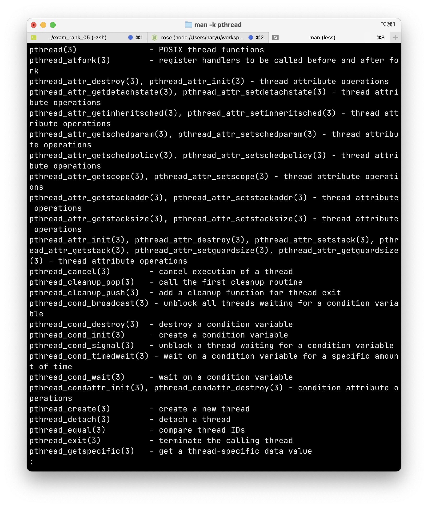

> 본 내용은 OSTEP 의 내용을 정리 및 요약한 내용입니다.
> 전문은 [이 곳](https://pages.cs.wisc.edu/~remzi/OSTEP/)을 방문하시면 보실 수 있습니다.

# 27 막간 : 쓰레드 API

- 쓰레드를 다루기 위한 API의 주요 부분을 간략하게 다룬다. 
<div style=“margin:10px;”>
<h3 style="display:inline-box; background-color:#666; padding:10px 10px 5px 10px; border-radius:10px 10px 0 0; margin: 0px; color:white;">🚩 핵심 질문: 쓰레드를 생성하고 제어하는 방법</h3>
<div style="display:box; background-color:#808080; margin: 0px; padding: 10px; color:black; border-radius: 0 0 10px 10px; color:white">운영체제가 쓰레드를 생성하고 제어하는데 어떤 인터페이스를 제공해야 할까?<br>
어떻게 이 인터페이스를 설계하고 쉽고 유용하게 사용할 수 있을까?
</div>
</div>

## 27.1 쓰레드 생성 

- 쓰레드 생성은 POSIX에서 다음과 같이 정의한다. 
```c
#include <pthread.h>

int pthread_create(pthread_t    * thread,
				const pthread_t * attr,
				void            * (*start_routine)(void *),
				void            * arg);
```

- 4인자를 가지며, `thread`는 pthread_t 타입 구조체를 가리킨다. 
- `attr`은 쓰레드 속성을 지정하는 데 사용한다. 스택의 크기, 쓰레드 스케줄링 우선순위와 같은 정보를 지정하는 용도이며, 개별속성은 `pthread_attr_init()`함수를 호출하여 초기화할 수 있다. 디폴트로 값을 넣고 싶을 때는 NULL 을 지정해주면 된다. 
- 세번째 인자는 쓰레드가 실행될 함수를 나타낸다. C 언어의 함수 포인터 개념으로 구성되어 있고, void  타입의 포인터 한개를 전달 받는다. 더불어 이 함수 포인터 역시 `void *`를   타입값으로 반환한다. 여기서 void 포인터 타입 대신 integer를 인자로 쓴다거나, 함수 포인터 자체에 들어가는 인자를 int형으로 받는 다거나 하는 방식으로 활용도 가능하다. 

```c
#include <pthread.h>

int pthread_create(pthread_t    * thread,
				const pthread_t * attr,
				void            * (*start_routine)(int),
				int               arg);

int pthread_create(pthread_t    * thread,
				const pthread_t * attr,
				int               (*start_routine)(void *),
				void            * arg);
```

- 네번째 인자는 실행할 함수에게 전달할 인자를 나타낸다. 

## 27.2 쓰레드 종료 

```c
int pthread_join(pthread_t thread, void **value_ptr);
```

- 쓰레드를 종료할 때는 기본적으로 완료되기까지 기다리기 위해 `pthread_join()` 함수를 사용한다. 해당 함수는 첫 번째 인자를 통해 어떤 쓰레드를 기다릴 것인지 설정하며, 두번째 인자는 해당 쓰레드의 반환값에 대한 포인터이다. 
- 여기서 중요한 포인트로 값을 하나만 반환할 때는 크게 문제가 없다. 하지만 인자와 반환값을 여러개 전달한다면 구조체로 묶어야 한다. 
- 또한 신경 쓸 지점은 반환되는 포인터가 void로 형변환 되지만, 이후 다시 받았을 때는 원래 해석 가능한 포인터로 형 변환이 필요하다는 것, 더불어 쓰레드의 콜 스택에 할당된 포인터는 반환하면 안된다는 점이다. 
- 더불어 마지막으로 pthread_create()를 사용하여 쓰레드 생성 이후, join()을 호출하는 것은 쓰레드 생성에서 아주 이상한 방법이다. 사실 작업을 똑같이 할 수 있는 더 쉬운 방법으로 **프로시저 호출(procedure call)** 이라고 부르는 방법이 있다.  << 이 부분이 아직 잘 모르겠다. 결론적으로 함수 스택 프레임을 쌓는 것조차 부담이되므로 inline 함수처럼 작동하라는 것같기도 하다. 
- 더불어 모든 멀티 쓰레드 코드가 join 루틴을 사용하진 않을 수 있다. 웹서버의 경우 여러 작업자를 쓰레드로 생성하고 메인 쓰레드를 이용하여 사용자 요청을 받고, 그 작업을 무한히 진행한다. 이런 경우 join으로 대기하지 않고 병렬적으로 처리할 수 있다. 단, return 값을 받아 그 연산의 결과, 완료 여부 확인을 위해 join을 쓰는 경우가 있다. 

## 27.3 락

- POSIX 에서 쓰레드 생성, 종료를 위한 도구 외에 가장 유용한 것이 `락(lock)`을 통해 임계 영역에 대한 상호 배제 기법을 활용하는 것이다. 

```c
int pthread_mutex_lock(pthread_mutex_t * mutex);
int pthread_mutex_unlock(pthread_mutex_t * mutex);
```

- lock이 호출되면, 다른 어떤 쓰레드도 락을 가지고 있지 않다면, 이 쓰레드가 락을 얻어 임계영역을 진입, 처리한다. 락 획득을 시도하는 쓰레드는 락을 얻기 전까지 호출에서 리턴하지 않는다. 
- 모든 락은 초기화를 해야 한다. 올바른 값을 가지고 시작해야 한다.
	- 초기화 방법 : `pthread_mutex_t lock = PTHREAD_MUTEX_INITIALIZER` 로 락 디폴트 값으로 설정한다. 
	- 두 번째 동적 초기화 방법으론 `ptrhead_mutex_init(pthread_t * thread, NULL)`
		- 이 경우 반드시 성공 여부를 확인하고 진행되도록 해야한다. 
- 락과 언락 루틴에서 pthread 라이브러리에 관련된 락 루튼 외에도 다양한 루틴들이 있다. 

```c
int pthread_mutex_trylock(phead_mutex_t * mutex)
int ptrhead_mytex_timedlock(phead_mutex_t * mutex, struct timespec *abs_timeout)
```

- 위 두 함수도 락을 획득하는데 쓸 수 있다.  하지만 두 함수는 사용하지 않는 것이 좋다. 그러나 무한정 대기 상황을 피하기 위해 사용 되지 않는다.


## 27.4 컨디션 변수 

 - **컨디션 변수**란 한  쓰레드가 계속 진행을 위해, 다른 쓰레드가 무언가를 해야 쓰레드간의 일종의 시그널 교환 메커니즘이 필요하다. 이런 경우 컨디션 변수를 사용해 시그널 교환 메커니즘이 필요시 된다. 이때 사용 되는 컨디션 변수가 두개의 기본 루틴이 존재한다. 

```c
int pthread_cond_wait(pthread_cond_t * cond, pthread_mutex_t * mutex);
int pthread_cond_signal(pthread_cond_t * cond);
```

- 컨디션 변수 사용을 위해선, mutex 락이 반드시 존재해야 하며, 루틴 중 하나를 호출하기 위해 락을 갖고 있어야 한다. 
- 첫 번째 루틴의 pthread_cond_wait()는 호출 쓰레드를 수면(sleep)상태로 만들며, 이때 다른 쓰레드로부터 시그널을 대기하게 된다. 
- 다음 예시는 전형적인 쓰레드 컨디션 변수의 사용 용례다.

```c
pthread_mutex_t lock = PTHREAD_MUTEX_INITIALIZER;
pthread_cond_t cond = PTHREAD_COND_INITIALIZER;
Pthread_mutex_lock(&lock);
while(ready == 0) {
	Pthread_cond_wait(&cond, &lock);
}
...
Pthread_mutex_unlock(&lock);
```

- 위 코드는 대기중인 쓰레드가 컨디션변수의 변동을 어떻게 기다리는 가와 관련 있다. 연관된 락과 컨디션 변수를 초기화 한 후, 쓰레드는 전역변수 `ready`가 0인지를 검사한다. 이때 잠자는 위 쓰레드를 깨우는 코드는 다음과 같다. 

```c
Pthread_mutex_lock(&lock);
ready = 1;
Ptrhead_cond_signal(&cond);
Pthread_mutex_unlock(&lock);
```

- 유의 사항 
	- 시그널을 보내고 전역 변수 ready를 수정할 때 반드시 락을 가지고 있어야 한다.(즉, 시그널을 보내는 쓰레드와 대기하는 쓰레드 모두 락이 공유 되어야 한다. )
	- 시그널 대기 함수에서는 락을 두번째 인자로 받지만, 시그널 보내기에선 cond 변수만 있으면 된다. 
	- 대기하는 쓰레드가 검사를 할 때 if를 쓰는 대신 while 을 써야 한다. 이는 pthread 라이브러리에서 변수를 제대로 갱신하지 않고 대기하던 쓰레들 깨울수 있기 때문이다. 
- 물론 이러한 방식으로 하지 않고, 단순히 조건문과 전역변수를 활용해서 컨디션 변수 효과를 낼 수도 있다. 하지만 이 방식은 결코 쓰면 안된다. 이유는 다음과 같다. 
	- 성능 손해가 심하다. (busy wait)
	- 오류 발생이 쉽다. 

<div style=“margin:10px;”>
<h3 style="display:inline-box; background-color:#666; padding:10px 10px 5px 10px; border-radius:10px 10px 0 0; margin: 0px; color:white;">⛳️ 여담: 쓰레드 API의 지침</h3>
<div style="display:box; background-color:#808080; margin: 0px; padding: 10px; color:black; border-radius: 0 0 10px 10px; color:white">POSIX 쓰레드 라이브러리나, 이와 유사한 라이브러리 사용하여 멀티 쓰레드 프로그램을 만드는데 기억해야할 것이 있다.<br>
<ul>
<li><b>간단하게 작성하라 : </b><br>시그널 주고 받는 코드는 가능한 간단해야 하고, 복잡할 수록 버그가 발생한다.</li>
<li><b>쓰레드 간 상호 동작을 최소화하라 :</b><br>상호작용 방법의 개수는 최소화 해야 한다. 깊게 생각하고, 검증된 방법으로 구현하는게 최선이다.</li>
<li><b>락과 컨디션 변수를 초기화 하라 :</b><br>초기화하지 않으면, 어떤 때는 동작하지만, 때로 매우 이상한 방식으로 실패할 수 있다.</li>
<li><b>반환 코드를 확인하라 :</b><br>언제나 반환 코드를 확인해야 한다. 쓰레드를 사용할 때도 마찬가지다. </li>
<li><b>쓰레드 간에 인자르 전달하고 반환받을 때는 조심해야 한다. :</b><br>특히 스택에 할당된 변수에 대한 참조를 전달시 문제가 발생한다.</li>
<li><b>각 쓰레드는 개별적인 스텍을 가진다. :</b><br>스택에 할당된 변수는 그 스택을 사용하는 쓰레드만 사용이 가능하다.</li>
<li><b>쓰레드 간에 시그널을 보내기 위해 항상 컨디션 변수를 사용하라. :</b><br>간단한 플래그를 쓰고 싶을 수 있으나 하면 큰일난다.</li>
<li><b>매뉴얼을 사용하라. </b></li>
</ul>
</div>
</div>

## 27.5 컴파일과 실행 

- 컴파일 할 때는 `-pthread` 플래그를 명령어러 링크 옵션을 추가해줘야 한다. 
- 이는 컴파일러에게 pthread 라이브러리와 프로그램을 링크해주는 역할을 해준다. 

```Makefile 
# thread Program example
CC = gcc
CFLAGS = -Wall -pthread
OBJS = main.o thread.o

all: myprogram

myprogram: $(OBJS)
    $(CC) $(CFLAGS) -o myprogram $(OBJS)

main.o: main.c
    $(CC) $(CFLAGS) -c main.c

thread.o: thread.c
    $(CC) $(CFLAGS) -c thread.c

clean:
    rm -f myprogram $(OBJS)

```

## 27.6 요약 
- 강력하고 효율적인 멀티 쓰레드 코드 작성을 위해선 인내심과 세심한 주의가 필요하다. 
- 멀티 쓰레드 코드를 작성할 때 도움이 되는 내용을 공부하기 위해서는 Linux 시스템에서 `man -k pthread`를 실행시켜 API 인터페이스들을 전부 확인해보면 좋다. 




```toc

```
