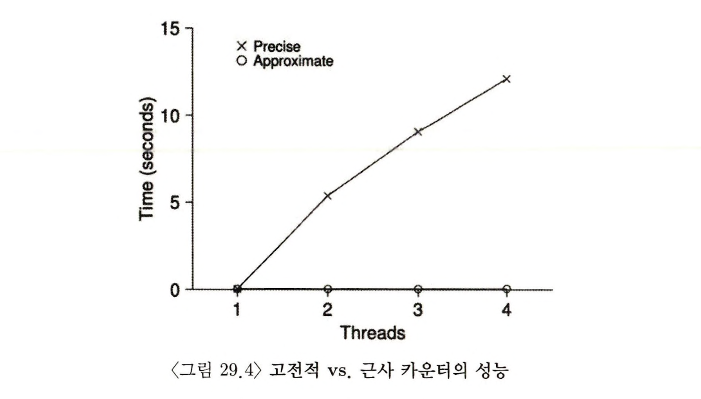
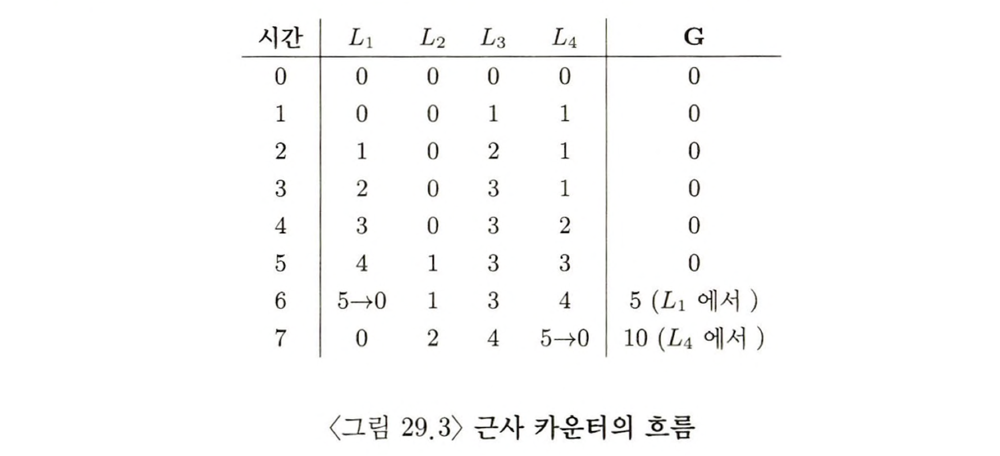
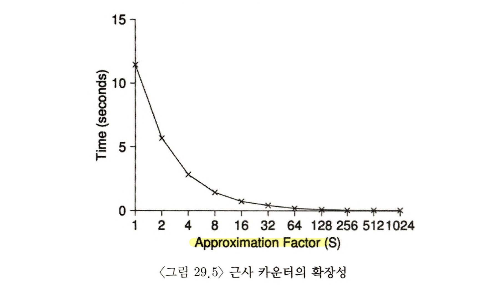
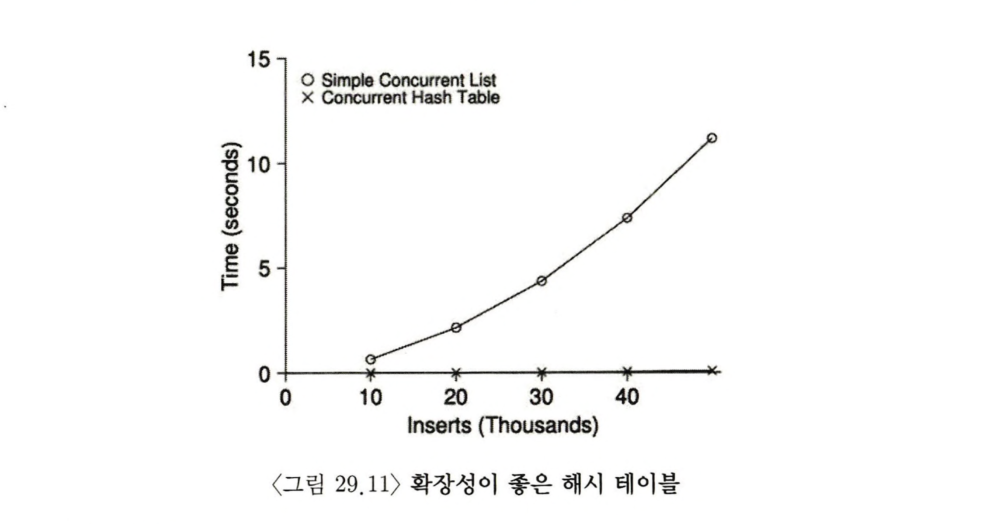

> 본 내용은 OSTEP 의 내용을 정리 및 요약한 내용입니다.
> 전문은 [이 곳](https://pages.cs.wisc.edu/~remzi/OSTEP/)을 방문하시면 보실 수 있습니다.

# 29 락 기반의 병행 자료 구조

가장 먼저 범용 자료구조에서 락을 사용하는 방법에 대해 살펴보자. 자료구조에 락을 추가하면 해당 자료 구조를 경쟁 조건에서 자유로워질 수 있다.(**쓰레드 안전, thread safe**) 그러나 락이 어떤 방식으로 추가되냐에 따라 그 성능이 매우 천차만별이 될 수 있다.

<div style=“margin:10px;”>
<h3 style="display:inline-box; background-color:#666; padding:10px 10px 5px 10px; border-radius:10px 10px 0 0; margin: 0px; color:white;">🚩 핵심 질문: 자료구조에 락을 추가하는 방법</h3>
<div style="display:box; background-color:#808080; margin: 0px; padding: 10px; color:black; border-radius: 0 0 10px 10px; color:white">특정 자료구조에 락을 추가하고, 정확하게 동작하게 만드는 방법은? 다수의 쓰레드가 해당 자료구조를 동시 접근 토록 해서, 성능 향상을 시키기 위해 할 일은?
</div>
</div>

## 29.1 병행 카운터 
가장 보편적으로 사용되는 구조 중 하나이며, 간단한 인터페이스를 갖고 있다. 아래의 예시가 락이 없는, 병행이 불가능한 카운터와 반대로 가능한 경우를 보여준다. 

```c
// 29.1 락이 없는 카운터
typedef strcut __counter_t {
	int value;
} counter_t;

void init(cointer_t* c) {
	c->value = 0;
}

void increment(counter_t* c) {
	c->value++;
}

void decrement(counter_t* c) {
	c->value--;
}

int get(counter_t* c) {
	return c->value;
}
```

```c
//29.2 락이 있는 카운터
typedef strcut __counter_t {
	int value;
	pthread_mutex_t lock;
} counter_t;

void init(cointer_t* c) {
	c->value = 0;
	pthread_mutex_init(&c->lock);
}

void increment(counter_t* c) {
	pthread_mutex_lock(&c->lock);
	c->value++;
	pthread_mutex_unlock(&c->lock);
}

void decrement(counter_t* c) {
	pthread_mutex_lock(&c->lock);
	c->value--;
	pthread_mutex_unlock(&c->lock);
}

int get(counter_t* c) {
	pthread_mutex_lock(&c->lock);
	int rc = c->value;
	pthread_mutex_unlock(&c->lock);
	return rc;
}
```

### 간단하지만 확장성이 없음 

위 예시, 병행이 가능한 카운터는 간단하지만 상당히 정확히 동작한다. 기본적인 병행 자료 구조의 보편적인 디자인 패턴을 따르고 있다. 

이러한 방식은 **monitor** 를 사용하여 만든 자료구조와 유사하다. 모니터 기법 자체는 객체에 대한 메소드를 호출하고 리턴할 때 자동적으로 락을 획득하고 해제한다. 

하지만 제대로 동작하더라도 성능은 문제가 된다. 구조가 너무 느리다면 단순히 락을 추가하는 것 이상의 무언가 작업이 필요할 수 있다. 이번 장에선 그러한 **최적화**가 이번 장에서 다룰 내용이라고 보면 된다. 



그렇다면 위의 간단한 병렬 카운팅 데이터 타입의 수준을 보면 다음과 같다. 쓰레드 개수를 증가 시키면서 백만번 카운터를 증가시켜 본다. 여기서 쓰레드가 많을 수록 백만번 갱신하는 데 0.03 초가 걸린다. 하지만 두개의 쓰레드로 카운트 값을 백만 번 갱신시 **5초**가 발생하고 많다. **오히려 쓰레드가 늘어날 수록 성능은 나빠지기만 하는 것이다.** 

이상적으로 하나의 쓰레드가 하나의 CPU에서 작업을 끝내는 것처럼 멀티 프로세서에서 실행되는 쓰레드들도 빠르게 처리되길 바란다. 이러한 동작을 **완벽한 확장성(perfect scaling)** 이라고 한다. 즉, 반대로 위의 예시의 경우 병렬 처리와 함께 CPU 개수에 비례하여 증가하더라도 각 작업이 처리가 늦어지는 만큼, '확장성'이 부족하다고 할 수 있다. 

### 확장성 있는 카운팅 

확장 가능한 카운터가 없었다면 Linux의 몇몇 작업은 멀티 코어 기기에서 심각한 확장성 문제를 겪을 수 있다. 

이러한 상황에서 문제 해결을 위한 **근사 카운터(approximnate cunter)** 라고 불리는 기법이 개발된다. 

근사 카운터는 하나의 논리적 카운터로 표현되는데, CPU 코마다 존재하는 하나의 물리적 지역을 위한 **지역 카운터**와 하나의 **전역 카운터**로 구성된다. 

쓰레드 자체는 지역 카운터는 증가를 진행하고, 지역 락에 의해 보호된다. 그리고 전역 카운터를 읽어서 카운터 값을 판다한다. 이로써 지역적 속도를 보장 받고, 경쟁 없이 갱신 한 뒤 일괄적으로 갱신이 될 수 있다. 그리고 전역 카운터에 카운팅 값을 더하면, 지역 카운터는 0으로 초기화 한다. 

이 흐름에 대해 정리한 그림을 보면 다음과 같다. 







그림 29.3 예제를 살펴보면, 한계치를 5로 설정하고 4개의 CPU에 지역 카운터를 갱신하는 쓰레드들이 있고, 전역 카운터의 값(G)도 같이 나타낼 수 있다. 

그 때 29.4 범례에서 approximate 라고 적인 아래 선이 S값을 1024로 했을 때 근사 카운터 성능이다. 4 개의 프로세서의 카운터 값을 4백만번 갱신하는데 걸린 시간은 하나의 프로세서의 갱신 시간과 차이가 나지 않는 것를 보인다. 

그림 29.5는 4개의 CPU에 각각 카운팅을 할 때, 한계 S의 설정에 따른 수준을 보여주고, S의 설정이 얼마나 중요한지를 보여준다. S의 값이 낮다면 성능은 느려지지만, 정확도를 보여줄 수 있으며, 이에 비해 S의 값이 크다면 성능은 탁월하나, 전역 카운터의 값은 CPU의 개수와 S의 곱만큼 뒤쳐지게 되어 정확도가 떨어진다. 

즉, 근사 카운터는 정확도와 성능 그 사이에서의 균형있는 조절이 필요시 된다. 

```c
// 29.6 근사 카운터의 구현
typedef struct __counter_t {
	int global; // 전역 카운터
	pthread_mutex_t glock; // 전역 카운터
	int local[NUMCPUS]; // cpu당 지역 카운터
	pthread_mutex_t llock[NUMCPUS]; // .. 그리고 락들 
	int threshold; // 갱신 빈도
} counter_t;

//init : 한계치를 기록하고 락과 지역 카운터 그리고 전역 카운터의 값들을 초기화함
void init(counter_t* c, int threshold) {
	c->threshold = threshold;
	c->global = 0;
	pthread_mutex_init(&c->glock, NULL);
	for (int i = 0; i < NUMCPUS; i++) {
		c->local[i] = 0;
		pthread_mutex_init(&c->llock[i], NULL);
	}
}

//update: 보통은 지역락을 획득한 후 지역 값을 갱신함 
// '한계치'까지 지역 카운터 값 증가 시, 전역 락 획득 후 지역 값을 전역 카운터에 전달함 
void update(counter_t* c, int threadID, int amt) {
	 int cpu = threadID % NUMCPUS;
	 pthread_mutex_lock(&c->llock[cpu]);
	 c->local[cpu] += amt;
	if(c->local[cpu] >= c->threshold) {
		 // 전역으로 전달(amt>0 가정)
		 pthread_mutex_lock(&c->glock);
		 c->global += c->local[cpu];
		 pthread_mutex_unlock(&c->glock);
		 c->local[cpu] = 0; 
	}
	ptrhead_mutex_unlock(&c->llock[cpu]);
}

// get: 전역 카운터의 값을 리턴(근사값)
int get (counter_t * c) {
	pthread_mutex->lock(&c->glock);
	int val = c->global;
	pthread_mutex_unlcok(&c->glock);
	return val; // 근사값
}
```

## 29.2 병행 연결 리스트 

좀더 복잡한 구조인 연결리스트에 대한 병행성 구현에 대해 알아보자. 단 병행 삽입 연산만을 살펴 볼 것이며, 검색이나 삭제는 스스로 고민해볼 것. 아래의 예시는 자료구조의 기본이 되는 코드이다. 

```c
// 기본 노드 구조
typedef struct __node_t {
	int key
	strcut __node_t* next;
} node_t;

// 기본 리스트 구조(리스트 마다 하나씩 사용)
typedef struct __list_t {
	node_t* head;
	pthread_mutex_t lock;
} list_t;

void List_Init(list_t* L) {
	L->head = NULL;
	pthread_mutex_init(&L->lock, NULL);
}

int List_Insert(list_t* L, int key) {
		pthread_mutex_lock(&L->lock);
	node_t* new = malloc(sizeof(node_t));
	if (new == NULL) {
		perror("malloc");
		pthread_mutex_unlock(&L->lock);
		return -1; // 실패
	}
	new->key = key;
	new->next = L->head;
	L->head = new;
	pthread_mutex_unlock(&L->lock);
	return 0; // 성공
}

int List_Lookup(list_t* L, int key) {
	pthread_mutex_lock(&L->lock);
	node_t* curr = L->head;
	while(curr) {
		if (curr->key == key) {
			pthread_mutex_unlock(&L->lock);
			return 0; // 성공
		}
		curr = curr->next;
	}
	pthread_mutex_unlock(&L->lock);
	return -1; // 실패 
}
```

이러한 경우 아주 드물게 malloc() 이 실패한 경우 미묘한 문제가 생길 수 있고, 그런 경우시 실패 처리 전 lock을 해제 해야 한다. 

요 최근 Linux 커널 패치에 관한 연구에 따르면 약 40%의 버그는 이런 자주 사용되지 않는 복잡한 락 자료구조에서 생길 수 있다고 한다. 

또한 삽입 연산 과정에서 보면 lock의 과정이 상당히 긴데, 병행하여 진행되는 상황에서 실패하더라도 락 해제를 호출하지 않으면서 삽입과 검색이 올바르게 되도록 처리할 수 있지 않을까? 이는 로직을 수정함으로써 구현이 가능하다. 임계영역 처리 파트만 락으로 감싸도록 한다면 해소가 가능하다. 검색 기능도 결국 while 문 안에 vreak 를 삽입하여 검색이 성공되면 바로 break 하도록 만들면 성능적인 면의 개선이 가능하다. 

```c
// 29.8 병행 연결 리스트 : 개선함
// 기본 노드 구조
typedef struct __node_t {
	int key
	strcut __node_t* next;
} node_t;

// 기본 리스트 구조(리스트 마다 하나씩 사용)
typedef struct __list_t {
	node_t* head;
	pthread_mutex_t lock;
} list_t;

void List_Init(list_t* L) {
	L->head = NULL;
	pthread_mutex_init(&L->lock, NULL);
}

int List_Insert(list_t* L, int key) {
	node_t* new = malloc(sizeof(node_t));
	if (new == NULL) {
		perror("malloc");
		pthread_mutex_unlock(&L->lock);
		return -1; // 실패
	}
	new->key = key;
	pthread_mutex_lock(&L->lock); // 임계 영역에만 락을 사용하여 보호한다. 
	new->next = L->head;
	L->head = new;
	pthread_mutex_unlock(&L->lock);
	return 0; // 성공
}

int List_Lookup(list_t* L, int key) {
	ㅑㅜㅅ ㄱㅍ = -1;
	pthread_mutex_lock(&L->lock);
	node_t* curr = L->head;
	while(curr) {
		if (curr->key == key) {
			rv = 0;
			break; // 성공
		}
		curr = curr->next;
	}
	pthread_mutex_unlock(&L->lock);
	return rv; // 실패 
}
```

### 확장성 있는 연결 리스트

병행이 가능한 연결리스트를 갖게 되었지만, 곰곰히 생각해보면 성능 면에서 좋지 못한, 즉 **확장성**에서 상당한 손실을 보는 구조라는 것을 알 수 있을 것이다. 이를 개선하기 위해 **hand-over-hand locking(lock coupling)** 이라는 기법도 존재한다. 아래는 해당 기법을 활용하여 작성한 기본적인 reference 코드 이다. 

```c
#include <stdio.h>
#include <stdlib.h>
#include <pthread.h>

// 링크드 리스트 노드 구조체 정의
typedef struct node {
    int data;
    pthread_mutex_t lock;
    struct node* next;
} Node;

// 링크드 리스트 초기화 함수
Node* init() {
    return NULL;
}

// 링크드 리스트 탐색 함수
Node* lookup(Node* head, int data) {
    Node *prev = NULL, *curr = NULL;

    if (head == NULL)
        return NULL;

    pthread_mutex_lock(&head->lock);
    prev = head;
    curr = head->next;
    if (curr != NULL)
        pthread_mutex_lock(&curr->lock);

    while (curr != NULL) {
        if (curr->data == data) {
            pthread_mutex_unlock(&prev->lock);
            return curr;
        }
        pthread_mutex_unlock(&prev->lock);
        prev = curr;
        curr = curr->next;
        if (curr != NULL)
            pthread_mutex_lock(&curr->lock);
    }
    pthread_mutex_unlock(&prev->lock);
    return NULL;
}

// 링크드 리스트 삽입 함수
Node* insert(Node* head, int data) {
    Node* newNode = (Node*)malloc(sizeof(Node));
    newNode->data = data;
    pthread_mutex_init(&newNode->lock, NULL);
    newNode->next = NULL;

    Node *prev = NULL, *curr = NULL;

    if (head == NULL) {
        pthread_mutex_lock(&newNode->lock);
        head = newNode;
    } else {
        pthread_mutex_lock(&head->lock);
        prev = head;
        curr = head->next;
        if (curr != NULL)
            pthread_mutex_lock(&curr->lock);

        while (curr != NULL) {
            pthread_mutex_unlock(&prev->lock);
            prev = curr;
            curr = curr->next;
            if (curr != NULL)
                pthread_mutex_lock(&curr->lock);
        }

        pthread_mutex_lock(&newNode->lock);
        prev->next = newNode;
    }
    pthread_mutex_unlock(&prev->lock);
    return head;
}

// 링크드 리스트 출력 함수
void printList(Node* head) {
    Node* current = head;
    while (current != NULL) {
        printf("%d ", current->data);
        current = current->next;
    }
    printf("\n");
}

int main() {
    Node* head = init(); // 링크드 리스트 초기화
    head = insert(head, 1); // 링크드 리스트에 1 삽입
    head = insert(head, 2); // 링크드 리스트에 2 삽입
    head = insert(head, 3); // 링크드 리스트에 3 삽입
    printList(head); // 링크드 리스트 출력
```

위 예시를 보면 알 수 있듯, 전체 리스트에 하나의 락이 아니라, 개별 노드마다 락을 추가하는 방식으로 하여서 순회하면서 다음 노드의 락을 먼저 획득하고 지금 노드의 락을 해제하도록 한다. 

이러한 개념을 통해 경쟁성을 제거하고 병행성을 높이는 것은 가능하다. 하지만 실제로 간단한 락 방법에 비해 속도 개선이 있느가? 에 대해서는 기대치 만 못할 수 있다. 결국 각 노드를 순회하면서, 락을 획득하고 해제하는 오버헤드를 무시할 수 없기 때문이다. 

차라리 일정 개수의 노드를 처리할 때마다 새로운 락을 획득하는 하이브리드 방식이 더 확장성을 확보할 수 있다. 

<div style=“margin:10px;”>
<h3 style="display:inline-box; background-color:#666; padding:10px 10px 5px 10px; border-radius:10px 10px 0 0; margin: 0px; color:white;">⛳️ 팁: 병행성이 늘어난다고 더 빠른 것은 아니다</h3>
<div style="display:box; background-color:#808080; margin: 0px; padding: 10px; color:black; border-radius: 0 0 10px 10px; color:white">락 획득/해제와 같이 부하가 큰 연산을 추가하여 자료구조를 설계했다면, 병행성 자체가 좋아졌다는 것은 큰 의미가 없다. 오히려 부하가 큰 루틴은 거의 사용하지 않는 간단한 방법이 더 좋다. 락의 추가는 복잡도를 늘리고, 성능은 줄어든다. 간단하지만 병행성이 떨어지는 것, 복잡하지만 병행성이 높은 두 경우를 다 구현하고 성능을 측정해보는 것이 결국 어느 쪽이 나은지에 대한 결론을 말해줄 것이다. 
</div>
</div>

## 29.3 병행 큐

지금까지 내용을 보면 알겠지만 병행 연산을 보호하는 가장 쉬운 방법은, 자료구조 덩어리 그 자체에 대한 접근을 관리하는 락을 하난 두는 방식이다. 이번에는 큰 락이 아닌 Michael, Scott이 설계한 좀더 병행성이 좋은 큐에 대해 예시를 통해 살펴보고자 한다. 

```c
// 29.9 Michael 과 Scott의 병행 큐 
typedef strcut __node_t {
	int value;
	struct __node_t* next;
} node_t;

typedef strcut __queue_t {
	node_t* head;
	node_t* tail;
	pthread_mutex_t headLock, tailLock;
} queue_t;

void Queue_Init(queue_t* q) {
	node_t* tmp = malloc(sizeof(node_t));
	tmp->next = NULL;
	q->head = q->tail = tmp;
	pthread_mutex_init(&q->headLock, NULL);
	pthread_mutex_init(&q->tailLock, NULL);
}

void Queue_Enqueue(queue_t* q, int value) {
	node_t* tmp = malloc(sizof(node_t));
	assert(tmp != NULL);
	tmp->value = value;
	tmp->next = NULL;

	pthread_mutex_lock(&q->tailLock);
	q->tail->next = tmp;
	q->tail = tmp;
	pthread_mutex_unlock(&q->tailLock);
}

int Queue_Dequeue(queue_t*q, int* value) {
	pthread_mutex_lock(&q->headLock);
	node_t* tmp = q->head;
	node_t* newHead = tmp->next;
	if (newHead == NULL) {
		pthread_mutex_unlock(&q->headLock);
		return -1;
	}
	*value = newHead->value;
	q->head = newHEad;
	pthread_mutex_unlock(&q->headLock);
	free(tmp);
	return 0;
}

```

이 코드를 유심히 살펴보면 두개의 락이 있는데, 이는 큐에 삽입과 추출 연산에서 동시성을 부여하는 역할을 한다. 큐는 멀티 쓰레드 프로그램에서 자주 사용되며, 단, 위에서 사용된 예시는 쓰레드가 대기하는 기능이 필요하며, 가득 찬 경우나 완전히 빌 때 어떻게 할지를 알아한다. 이를 위해서 필요한 것이 바로 **조건변수(condition variable)** 이다. 

## 29.4 병행 해시 테이블 

```c
// 29.10 병행 해시 테이블
#define BUCKETS (101)

typedef struct __hash_t {
	list_t list[BUCKETS];
} hash_t;

void Hash_Init(hash_t *H) {
	for (int i = 0; i < BUCKETS; i++) {
		List_Init(&H->list[i]);
	}
}

int Hash_Insert(hash_t* H, int key) {
	return List_Insert(&H->lists[key % BUCKETS], key);
}

int Hash_Insert(hash_t* H, int key) {
	return List_Insert(&H->lists[key % BUCKETS], key);
}


int Hash_Lookup(hash_t* H, int key) {
	return List_Lookup(&H->lists[key % BUCKETS], key);
}
```



확장되지 않는 간단한 해시 테이블을 집중해보고자. 여기서 동적으로 크기가 변하는 형태를 구현하는 것은 직접 해보길 바란다. 

이 병행 해시 테이블은 명확하다. 동시성을 가진 병행 리스트를 사용하여 구현하였고, 해시 버켓 마다 락을 사용하므로 동시성은 좋게 된다. 결과적으로 29.11 그림을 보면 알 수 있듯, hash의 성능은 매우 좋고, 연결리스트는 상당히 안좋은 확장성을 보여준다. 

## 29.5 요약 

카운터, 리스트, 큐, 그리고 해시테이블이라는 병행 자료구조들을 소개하였다. 락 획득과 해제 시 코드의 흐름에 매우 주의를 기울어야 했으며, 동시성 개선이 반드시 성능 개선은 아니라는 점을 배울 수 있었다. 더불어 성능에 문제가 생길 경우에만 성능에 대한 해결책을 간구해야 한다. 오히려 **미숙한 최적화(premature optimization)** 를 피하자는 주제는 여느 성능에 관심있는 개발자라면 중심이 되는 주제이다. 

락을 전혀 사용하지 않는 동기화 기법들도 흥미로우며, 이는 non-blocking 자료 구조 부분에서 함께 살펴볼 것이다. 

```toc

```

