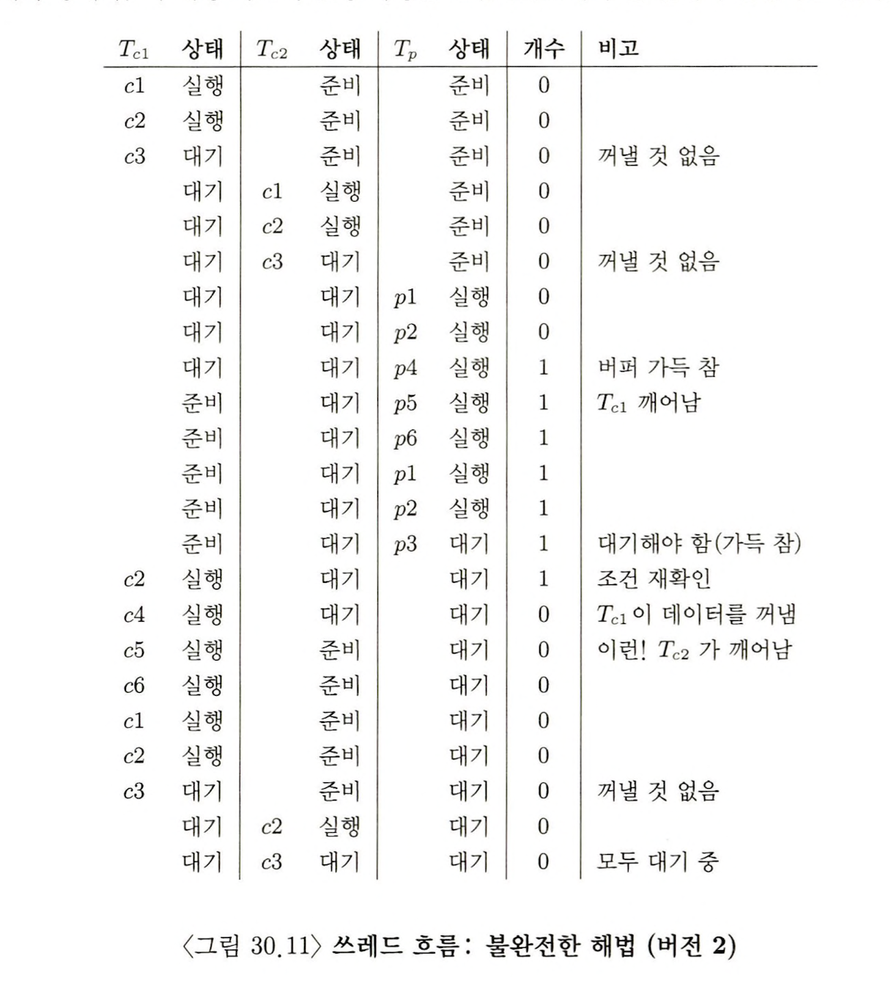

> 본 내용은 OSTEP 의 내용을 정리 및 요약한 내용입니다.
> 전문은 [이 곳](https://pages.cs.wisc.edu/~remzi/OSTEP/)을 방문하시면 보실 수 있습니다.

# 30 컨디션 변수

사실 락은 하드웨어와 운영체제의 지원을 적절하게 받아서 만들었던 도구이다. 더불어 동시성 프로그램 제작에서 락만이 정답은 아니다. 쓰레드가 실행을 계속 하기 전에, 어떤 특정 조건의 만족 여부를 검사해야 될 수 있는데, 이때 사용하는 것이 컨디션 변수이다. 


이러한 상황에서 해결할 수 있는 방법으로는 대기를 한다거나 ,여러 방법이 있을 수 있다. 락도 포함되고 여럿이 존재하지만 효과적인 것은 쓰레드를 잠을 재우는 방법이다. 

<div style=“margin:10px;”>
<h3 style="display:inline-box; background-color:#666; padding:10px 10px 5px 10px; border-radius:10px 10px 0 0; margin: 0px; color:white;">🚩 핵심 질문: 조건의 대기</h3>
<div style="display:box; background-color:#808080; margin: 0px; padding: 10px; color:black; border-radius: 0 0 10px 10px; color:white">멀티 쓰레드 프로그램에서는 쓰레드가 계속 진행하기 앞서 특정 조건이 참이되기를 기다리는 것이 유용할 때가 많다. 조건이 참이 될 때까지 회전을 하며 기다리는 것이 간단하다. 하지만 이는 지독히 비효율적이며 CPU 자원의 소모를 불러오게 된다. 어떤 경우에는 부정확할 수도 있다. 쓰레드가 '대기' 하는 것은 어떤 조건을 기다려야 할까?
</div>
</div>

## 30.1 컨디션 변수의 개념과 관련 루틴

쓰레드 실행 시 특정 조건이 만족될 때까지의 대기를 위해 `컨디션 변수(conditional variable)`라고 불리는 개념을 사용할 수 있다.  이것은 일종의 큐로, 컨디션 변수는 쓰레드 실행에서 어떤 상태가 원하는 것과 다를 때 만족되기를 대기하는 큐이다. 

컨디션 변수의 시초는 다익스트라(Dijikstra)가 Private Semaphore 라는 개념을 사용했을 때로 거슬러 올라간다. 

```c
//30.3 자식을 기다리는 부모 쓰레드: 컨디션 변수의 사용
int done = 0;
pthread_mutex_t m = PTHREAD_MUTEX_INITIALIZER;
pthread_cond_t c = PTHREAD_COND_INITIALIZER;

void thr_exit() {
	pthread_mutex_lock(&m);
	done = 1;
	pthread_cond_signal(&c);
	pthread_mutex_unlock(&m);
}

void* child(void* arg) {
	printf("child\n");
	thr_exit();
	return NULL;
}

void thr_join() {
	pthread_mutex_lock(&m);
	while (done == 0)
		pthread_cond_wait(&c, &m);
	pthread_mutex_unlock(&m);
}

int main(int argc, char *argv[]) {
	printf("parent: begin\n");
	pthread_t p;
	pthread_create(&p, NULL, child, NULL);
	thr_join();
	printf("parent: end\n");
	return (0);
}

```

컨디션 변수는 적절한 초기화 과정이 필요하고, 이후 wait( ) 과 signal( ) 이라는 두개의 연산이 있어서 wait( )는 쓰레드가 스스로 잠재우기를 위해 호출하는 것이고, signal( ) 은 조건이 만족되기를 대기하며, 잠자고 있던 쓰레드를 깨울 때 호출한다. 

여기서 중요한 사실은 wait( )가 호출 될 때 mutex는 잠겨 있었다고 가정한다. 다른 쓰레드가 시그널을 보내어 대기 중인 쓰레드가 슬립한 상태에서 깨어나면 wait() 에서 리턴하기 전에 반드시 락을 재 획득해야 한다. 이 부분이 난해한 부분인데, lock 을 하고 cond_signal 함수로 전달하고 lock풀며, lock 풀림과 동시에 wait() 하던 쓰레드가 mutex_lock을 획득한 뒤 진행한다는 말이다. 

여기서 중요한 것은 부모 쓰레드가 특정 조건의 만족 여부를 검사할 때, if 문이 아니라 while 문으로 사용해야 한다는 점이다. 

여기서 `thr_exit()` 과 `thr_join()` 코드의 중요성을 이해하기 위해 몇 가지 예시를 들어보도록 하겠다. 

```c
// 30.4 부모의 기다리기: 상태 변수 없음
void thr_exit() {
	pthread_mutex_lock(&m);
	pthread_cond_signal(&c);
	pthread_mutex_unlock(&m);
}

void thr_join() {
	pthread_mutex_lock(&m);
	pthread_cond_wait(&c, &m);
	pthread_mutex_unlock(&m);
}
```

위의 예시의 경우 자식 쓰레드 생성 즉시 thr_ext()를 호출하는 경우를 생각해보자. 이 경우 자식 프로세스가 시그널을 보냈지만, 아직 깨워야 할 쓰레드가 없다. 부모 쓰레드가 실행되면, signal은 사라지고 wait()에서 계속 멈춰 있을 뿐이다. 

이런 점에서 상태 변수가 꼭 필요하며, 잠자고, 깨우고, 락 설정 과정에서 해당 변수가 중심으로 구현되어 있다. 

```c
// 30.5 부모의 기다리기: 락 없음
void thr_exit() {
	done = 1;
	pthread_cond_signal(&c);
}

void thr_join() {
	if (done == 0)
		pthread_cond_wait(&c, &m);
}
```

또 하나의 사례로 락이 존재하지 않는다면, 경쟁조건이 발생하고 만다. done 이라는 상태 변수가 바뀌지 않은 것을 보고, 부모는 wait에 멈출 때 인터럽트가 발생하고, 그 결과 자식은 시그널을 보내지만, 중간에 멈춰버린 부모 쓰레드는 여전히 `done==0` 이라고 판단한채 wait에서 멈춰 버리게 된다. 

이 간단한 예제를 통해 컨디션 변수를 제대로 사용하기 위해서 필요한 것들이 무엇인지를 볼 수 있었다.

<div style=“margin:10px;”>
<h3 style="display:inline-box; background-color:#666; padding:10px 10px 5px 10px; border-radius:10px 10px 0 0; margin: 0px; color:white;">⛳️ 팁: 시그널을 보내기 전에 항상 락을 획득하자. </h3>
<div style="display:box; background-color:#808080; margin: 0px; padding: 10px; color:black; border-radius: 0 0 10px 10px; color:white">컨디션 변수를 사용할 때는 반드시 락을 획득한 후 시그널을 보내는 것이 가장 간단하면서도 최선의 방법이다. 락을 획득하지 않아도 되는 경우가 있지만, 그럼에도 시그널은 위험한 영역이고, 동시성으로 인해 생길 여러 문제들 때문에라도 락을 거는 것은 필수이다. 
</div>
</div>

## 30.2 생산자/ 소비자(유한 버퍼) 문제 

본 문제는 다익스트라(Dijkstra) 가 처음 제시한 문제이다(Producer / Consumer). 해당 문제는 락이나 컨디션 변수를 대신 사용할수 있는 일반화된 세마포어를 발명하게 된 이유이기도 하다. 

다수의 생산자 쓰레드와 소비자 쓰레드가 있다고 할 때, 생산자는 데이터를 만들어 버퍼에 넣고, 소비자는 버퍼에서 데이터를 꺼내어 사용한다. 이런 관계 속에서 둘 사이에는 유한한 버퍼가 존재한다. 이는 공유 자원으로 경쟁조건이 발생 방지를 위해 동기화가 필요하다. 이 문제에 대해 정확한 이해를 위해 실제 코드를 통해 알아보자. 

```c
// 30.6 put과 get 루틴(버전 1)
int buffer;
int count = 0; // 처음에 비어 있음 

void put(int value) {
	assert(count == 0);
	count = 1;
	buffer = value;
}

int get() {
	assert(count == 1);
	count = 0;
	return buffer 
}
```

이 코드의 내용은 간단한 코드이다.  count 라는 조건을 통해서, 1이면 get이 호출되고, 버퍼에서 값을 가져온다. 반대로 0이면 버퍼에 데이터를 집어 넣는다. 여기서 버퍼에 이미 데이터가 있음에도 불구하고, 생산자가 버퍼에 데이터를 넣거나 버퍼가 비어있음에도 불구하고 소비자가 버퍼 내용을 읽는 상황이 발생한다면, 동기화 코드는 꼬이게 될 것이다. 

생산자 / 소비자 문제의 핵심은 두 종류의 쓰레드가 존재한다는 점이다. 하나는 생산자 쓰레드이며, 다른 하나는 소비자 쓰레드 들이다. 아래의 코드 30.7 는 생산자가 loop 횟수 만큼 공유버퍼에 정수를 넣고, 소비자는 버퍼에서 이를 꺼낸다. 문제는 실제로 작동해보았을 때 정상적으로 작동을 하지 않는다. 왜인가?

```c
// 30.7 생산자/소비자 쓰레드(버전 1)
void* producer(void *arg) {
	int i;
	int loop = (int)arg;
	for (i = 0; i < loops; i++) {
		put(i);
	}
}

void* consumer(void *arg) {
	int i;
	while(true) {
		int tmp = get();
		printf("%d\n", tmp);
	}
}
```

### 불완전한 해답 

임계 영역을 락으로 보호하는 것 만으로도 제대로 동작하지 않는다. 추가적인 장치가 필요시 된다. 이를 컨디션 변수가 된다. 따라서 코드 30.8 에서 cond 컨디션 변수 하나와 그것과 연결된 mutex 락을 사용한다. 

여기서 쓰레드가 각각 한 개씩인 경우 코드는 정상 작동 한다. 하지만 같은 종류의 쓰레드가 두개 이상인 경우 문제가 발생하게 된다. 

```c
// 30.8 생산자/소비자: 단일 컨디션 변수와 if문 
int loops;
cond_t cond;
mutex_t mutex;

void* producer(void *arg) {
	int i;
	int loop = (int)arg;
	for (i = 0; i < loops; i++) {
		pthread_mutex_lock(&mutex);
		if (count == 1)
			pthread_cond_wait(&cond, &mutex);
		put(i);
		pthread_cond_siganl(&cond);
		pthread_mutex_unlock(&mutex);
	}
}

void* consumer(void *arg) {
	int i;
	for(i = 0; i < loops; i++) {
		pthread_mutex_lock(&mutex);
		if (count == 0)
			ptrhead_cond_wait(&cond, &mutex);
		int tmp = get();
		ptrhead_cond_signal(&cond);
		pthread_mutex_unlock(&mutex);
		printf("%d\n", tmp);
	}
}
```

우선 첫 번째, 문제점은 대기 명령 전의 if문과 관련이 있다. 두개의 소비자(Tc1, Tc2)가 존재하고, 생산자(Tp)가 하나있다고 생각하자.  소비자 1이 먼저 실행되고, 락을 획득하며, 버퍼 소비를 검사한다. 이때 비어있으니, 당연히 확인 후 대기하여 락을 해제한다.

이제 여기서 생산자가 락을 획득, 버퍼가 비어 있었는지 확인하고, 이를 발견하여 버퍼를 채운다. 그 뒤 생산자는 시그널을 보내게 되는데, 대기 중인 첫째 소비자는 깨어나 준비 큐로 이동한다. 이제 실행 할 수 있는 상태이지만 아직 실행 상태는 아니다. 생산자는 실행을 계속한다. 버퍼가 차있으므로 대기 상태로 간다.

문제는 여기서 새로운 소비자(Tc2)가 끼어들어 실행, 버퍼 값을 소비하고, 그 직후 첫 째 소비자가 실행되었다고 생각해보자. 대기에서 리턴하기 전에 락을 획득까지 했으나 의도된 데로 작동하진 못했다. 

결국 핵심은 **첫번째 소비자가 시그널을 받는 시점, 즉, 대기 상태에서 깨어나는 시저과 이 쓰레드가 실제로 실행되는 시점 사이에 시차가 존재한다.** 더불어 그 사이 기간 동안 버퍼 상태조차 바뀌게 된다는 점이다. 즉, 깨운다는 행위는 쓰레드 상태를 대기 상태에서, 준비 상태로 변경하는 것이며, 깨어난 쓰레드가 실행되는 시점에서는 버퍼의 상태가 다시 변경될 수 있다. 

### 개선된, 하지만 아직도 불완전한: if 문 대신 while 문 

위에서 지적하는 문제를 해결하는 것은 if 문으로 조건을 while로 판단하는 방식으로 하는 것이다. 이렇게 되면 소비자 1이 깨어나고, 곧 바로 공유 변수의 상태를 재 확인한다. 이러면 버퍼의 상태를 받기 직전에 확인이 되니 생산자와 소비자의 간극이 좁혀진다. 이 시점에서 버퍼가 있다면 다시 대기로 가며, 그렇지 않다면 다음으로 진행이 가능하다. 

```c
// 30.10 생산자/소비자: 단일 컨디션 변수와 while문 
int loops;
cond_t cond;
mutex_t mutex;

void* producer(void *arg) {
	int i;
	int loop = (int)arg;
	for (i = 0; i < loops; i++) {
		pthread_mutex_lock(&mutex);
		while (count == 1)
			pthread_cond_wait(&cond, &mutex);
		put(i);
		pthread_cond_siganl(&cond);
		pthread_mutex_unlock(&mutex);
	}
}

void* consumer(void *arg) {
	int i;
	for(i = 0; i < loops; i++) {
		pthread_mutex_lock(&mutex);
		while (count == 0)
			ptrhead_cond_wait(&cond, &mutex);
		int tmp = get();
		ptrhead_cond_signal(&cond);
		pthread_mutex_unlock(&mutex);
		printf("%d\n", tmp);
	}
}
```

계속 강조되었듯, Mesa semantic의 컨디션 변수에서 가장 기본 원칙 중 하나가 **언제나 while문**을 통해서 검사하라는 것이다. 이런 형태 if문처럼 조건을 재확인하는게 번거로워 보이지만, 결국 항상 검사하는 것이 안전하다. 

그런데 여기서 곰곰히 생각해보면 소비자 2개의 쓰레드에서, 깨어나서 일련의 과정은 그렇다고 칠 때, 생산자가 불러야 할 소비자(Tc1)이 아니라, 대기 중인 소비자(Tc2)가 불러졌다면 어떨까? 


위의 사진 예시를 보면 시그널 대상을 명시하지 않았을 때, 대기하는 일이 발생하는 것을 볼 수 있고, 그렇기 때문에 실질적으로 원하는 것은 소비자는 생산자만을 깨우며, 생산자는 소비자만을 깨우는 구조다.


### 단일 버퍼 생산자/ 소비자 해법

```c
// 30.12 생산자/소비자: 두 개의 컨디션 변수와 while 문
int loops;
cond_t empty, fill;
mutex_t mutex;

void* producer(void *arg) {
	int i;
	int loop = (int)arg;
	for (i = 0; i < loops; i++) {
		pthread_mutex_lock(&mutex);
		while (count == 1)
			pthread_cond_wait(&empty, &mutex);
		put(i);
		pthread_cond_siganl(&fill);
		pthread_mutex_unlock(&mutex);
	}
}

void* consumer(void *arg) {
	int i;
	for(i = 0; i < loops; i++) {
		pthread_mutex_lock(&mutex);
		while (count == 0)
			ptrhead_cond_wait(&fill, &mutex);
		int tmp = get();
		ptrhead_cond_signal(&empty);
		pthread_mutex_unlock(&mutex);
		printf("%d\n", tmp);
	}
}
```


### 올바른 생산자 / 소비자 해법 

```c
// 30.13 올바른 put() 과 get() 루틴
int buffer[MAX];
int fill = 0;
int use = 0;
int count = 0;

void put(int value) {
	buffer[fill] = value;
	fill = (fill + 1) % MAX;
	count++;
}

int get() {
	int temp = buffer[use];
	use = (use + 1) % MAX;
	count--;
	return temp;
}
```

위에서 제대로 동작하는 형태의 생산자, 소비자의 해법을 얻었다. 하지만 이상태는 버퍼가 좀 작다. 최종적으로 변경을 통해 더 효율적으로 만들 수 있다. 이는 대기 상태에 들어가기 전에 여러 값들이 생산되고, 마찬가지로 여러 값이 소비 될 수 있도록한다. 

여기서 하나의 생산자와 소비자의 경우, 버퍼의 증가는 쓰레드간의 문맥 교환이 줄어서 더 효율적이 된다. 이렇게 하기 위해 예시 30.13에서 get, put을 변경했으며, 30.14에서 최종적인 대기와 시그널에 대한 논리를 나타낸다. 

```c
// 30.14 올바른 생산자/소비자 동기화
int loops;
cond_t empty, fill;
mutex_t mutex;

void* producer(void *arg) {
	int i;
	int loop = (int)arg;
	for (i = 0; i < loops; i++) {
		pthread_mutex_lock(&mutex);
		while (count == MAX)// 가득 찰 때까지 기다리게 된다. 
			pthread_cond_wait(&empty, &mutex);
		put(i);
		pthread_cond_siganl(&fill);
		pthread_mutex_unlock(&mutex);
	}
}

void* consumer(void *arg) {
	int i;
	for(i = 0; i < loops; i++) {
		pthread_mutex_lock(&mutex);
		while (count == 0)
			ptrhead_cond_wait(&fill, &mutex);
		int tmp = get();
		ptrhead_cond_signal(&empty);
		pthread_mutex_unlock(&mutex);
		printf("%d\n", tmp);
	}
}
```

## 30.3 포함 조건(Covering Condition)

```c
// 30.15 포함조건 : 예시
// 몇 byte나 힙이 비어 있는가?
int byteesLeft = MAX_HEAP_SIZE;

// 락과 컨디션 변수가 필요함 
cond_t c;
mytex_t m;

void* allocate(int size) {
	pthread_mutex_lock(&m);
	while(byteLeft < size) {
		pthread_cond_wait(&c, &m) 
	}
	void* ptr = ... ;
	bytesLeft -=size;
	pthrea_mutex_unlock;
	return ptr;
}

void free(void *ptr, int size) {
	ptrhead_mutex_lock(&m);
	byteLeft += size;
	pthread_cond_signal(&c);
	pthread_mutex_unlock(&m);
}
```

컨디션 변수가 사용되는 다른 예시를 살펴 본다. 30.15는 멀티 쓰레드용 메모리 할당 라이브러리이다. 코드 처럼 메모리 할당을 요청하는 쓰레드는 메모리 공간이 생길 때까지 대기한다. 

이 방식은 잘동작 하는 것처럼 보이지만, 막상 대기 상태로 들어가고, 정상 동작하지 않게 된다. 이는 시그널의 본질에 근간한다. **컨디션 변수에서의 시그널 함수는 시그널의 수신자를 명시하지 않는다.**

이럴 때는 pthread_cond_signal() 을 대기중인 모든 쓰레드를 깨우는 ptrhead_cond_broadcast()로 바꿔서 사용하면 된다. 

이렇게 되면 깨어난 쓰레드들은 차례로 자신이 대기했던 조건이 만족되는지 검사를 하고, 그렇지 않다면 대기모드로 들어간다. 

그러나 이 방식은 다수의 쓰레드를 불필요하게 깨워, 불필요한 연산과 불필요한 문맥전환을 발생시킨다. 

Lampson과 Redell은 이런 경우를 **포함조건(covering condition)** 이라고 불렀다. 왜냐면 (보수적으로) 쓰레드가 깨어나야 하는 모든 경우를 다 포함하기 때문이다. 

## 30.4 요약

동기화 기법에서 중요한 것 중 하나인 컨디션 변수를 소개했다. 컨디션 변수는 프로그램 상태를 특정 조건이 만족될 때까지 대기하도록 하여 동기화를 쉽게 해결한 방법이다. 동기화와 함께 알려진 다수의 문제들은 생산자/소비자 그리고 포함 조건 문제들을 컨디션 변수를 사용시 간단하게 해결이 가능하다. 


```toc

```
