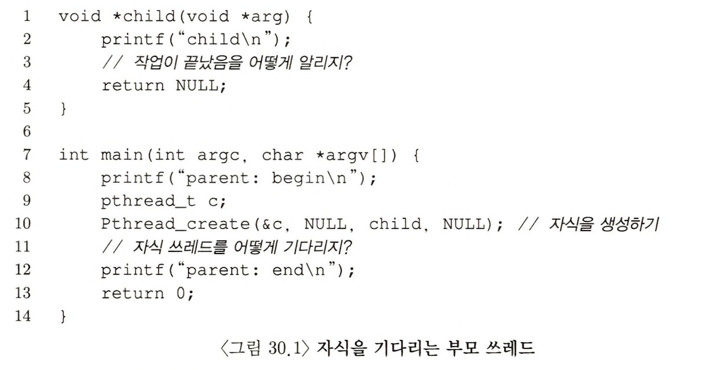

> 본 내용은 OSTEP 의 내용을 정리 및 요약한 내용입니다.
> 전문은 [이 곳](https://pages.cs.wisc.edu/~remzi/OSTEP/)을 방문하시면 보실 수 있습니다.

# 30 컨디션 변수

사실 락은 하드웨어와 운영체제의 지원을 적절하게 받아서 만들었던 도구이다. 더불어 동시성 프로그램 제작에서 락만이 정답은 아니다. 쓰레드가 실행을 계속 하기 전에, 어떤 특정 조건의 만족 여부를 검사해야 될 수 있는데, 이때 사용하는 것이 컨디션 변수이다. 



이러한 상황에서 해결할 수 있는 방법으로는 대기를 한다거나 ,여러 방법이 있을 수 있다. 락도 포함되고 여럿이 존재하지만 효과적인 것은 쓰레드를 잠을 재우는 방법이다. 

<div style=“margin:10px;”>
<h3 style="display:inline-box; background-color:#666; padding:10px 10px 5px 10px; border-radius:10px 10px 0 0; margin: 0px; color:white;">🚩 핵심 질문: 조건의 대기</h3>
<div style="display:box; background-color:#808080; margin: 0px; padding: 10px; color:black; border-radius: 0 0 10px 10px; color:white">멀티 쓰레드 프로그램에서는 쓰레드가 계속 진행하기 앞서 특정 조건이 참이되기를 기다리는 것이 유용할 때가 많다. 조건이 참이 될 때까지 회전을 하며 기다리는 것이 간단하다. 하지만 이는 지독히 비효율적이며 CPU 자원의 소모를 불러오게 된다. 어떤 경우에는 부정확할 수도 있다. 쓰레드가 '대기' 하는 것은 어떤 조건을 기다려야 할까?
</div>
</div>

## 30.1 컨디션 변수의 개념과 관련 루틴

쓰레드 실행 시 특정 조건이 만족될 때까지의 대기를 위해 `컨디션 변수(conditional variable)`라고 불리는 개념을 사용할 수 있다.  이것은 일종의 큐로, 컨디션 변수는 쓰레드 실행에서 어떤 상태가 원하는 것과 다를 때 만족되기를 대기하는 큐이다. 

컨디션 변수의 시초는 다익스트라(Dijikstra)가 Private Semaphore 라는 개념을 사용했을 때로 거슬러 올라간다. 

```c
//30.3 자식을 기다리는 부모 쓰레드: 컨디션 변수의 사용
int done = 0;
pthread_mutex_t m = PTHREAD_MUTEX_INITIALIZER;
pthread_cond_t c = PTHREAD_COND_INITIALIZER;

void thr_exit() {
	pthread_mutex_lock(&m);
	done = 1;
	pthread_cond_signal(&c);
	pthread_mutex_unlock(&m);
}

void* child(void* arg) {
	printf("child\n");
	thr_exit();
	return NULL;
}

void thr_join() {
	pthread_mutex_lock(&m);
	while (done == 0)
		pthread_cond_wait(&c, &m);
	pthread_mutex_unlock(&m);
}

int main(int argc, char *argv[]) {
	printf("parent: begin\n");
	pthread_t p;
	pthread_create(&p, NULL, child, NULL);
	thr_join();
	printf("parent: end\n");
	return (0);
}

```

컨디션 변수는 적절한 초기화 과정이 필요하고, 이후 wait( ) 과 signal( ) 이라는 두개의 연산이 있어서 wait( )는 쓰레드가 스스로 잠재우기를 위해 호출하는 것이고, signal( ) 은 조건이 만족되기를 대기하며, 잠자고 있던 쓰레드를 깨울 때 호출한다. 

여기서 중요한 사실은 wait( )가 호출 될 때 mutex는 잠겨 있었다고 가정한다. 다른 쓰레드가 시그널을 보내어 대기 중인 쓰레드가 슬립한 상태에서 깨어나면 wait() 에서 리턴하기 전에 반드시 락을 재 획득해야 한다. 이 부분이 난해한 부분인데, lock 을 하고 cond_signal 함수로 전달하고 lock풀며, lock 풀림과 동시에 wait() 하던 쓰레드가 mutex_lock을 획득한 뒤 진행한다는 말이다. 

여기서 중요한 것은 부모 쓰레드가 특정 조건의 만족 여부를 검사할 때, if 문이 아니라 while 문으로 사용해야 한다는 점이다. 

여기서 `thr_exit()` 과 `thr_join()` 코드의 중요성을 이해하기 위해 몇 가지 예시를 들어보도록 하겠다. 

```c
// 30.4 부모의 기다리기: 상태 변수 없음
void thr_exit() {
	pthread_mutex_lock(&m);
	pthread_cond_signal(&c);
	pthread_mutex_unlock(&m);
}

void thr_join() {
	pthread_mutex_lock(&m);
	pthread_cond_wait(&c, &m);
	pthread_mutex_unlock(&m);
}
```

위의 예시의 경우 자식 쓰레드 생성 즉시 thr_ext()를 호출하는 경우를 생각해보자. 이 경우 자식 프로세스가 시그널을 보냈지만, 아직 깨워야 할 쓰레드가 없다. 부모 쓰레드가 실행되면, signal은 사라지고 wait()에서 계속 멈춰 있을 뿐이다. 

이런 점에서 상태 변수가 꼭 필요하며, 잠자고, 깨우고, 락 설정 과정에서 해당 변수가 중심으로 구현되어 있다. 

```c
// 30.5 부모의 기다리기: 락 없음
void thr_exit() {
	done = 1;
	pthread_cond_signal(&c);
}

void thr_join() {
	if (done == 0)
		pthread_cond_wait(&c, &m);
}
```

또 하나의 사례로 락이 존재하지 않는다면, 경쟁조건이 발생하고 만다. done 이라는 상태 변수가 바뀌지 않은 것을 보고, 부모는 wait에 멈출 때 인터럽트가 발생하고, 그 결과 자식은 시그널을 보내지만, 중간에 멈춰버린 부모 쓰레드는 여전히 `done==0` 이라고 판단한채 wait에서 멈춰 버리게 된다. 

이 간단한 예제를 통해 컨디션 변수를 제대로 사용하기 위해서 필요한 것들이 무엇인지를 볼 수 있었다.

<div style=“margin:10px;”>
<h3 style="display:inline-box; background-color:#666; padding:10px 10px 5px 10px; border-radius:10px 10px 0 0; margin: 0px; color:white;">⛳️ 팁: 시그널을 보내기 전에 항상 락을 획득하자. </h3>
<div style="display:box; background-color:#808080; margin: 0px; padding: 10px; color:black; border-radius: 0 0 10px 10px; color:white">컨디션 변수를 사용할 때는 반드시 락을 획득한 후 시그널을 보내는 것이 가장 간단하면서도 최선의 방법이다. 락을 획득하지 않아도 되는 경우가 있지만, 그럼에도 시그널은 위험한 영역이고, 동시성으로 인해 생길 여러 문제들 때문에라도 락을 거는 것은 필수이다. 
</div>
</div>

## 30.2 생산자/ 소비자(유한 버퍼) 문제 

### 불완전한 해답 

### 개선된, 하지만 아직도 불완전한: if 문 대신 while 문 

### 단일 버퍼 생산자/ 소비자 해법

### 올바른 생산자 / 소비자 해법 

## 30.3 포함 조건(Covering Condition)

## 30.4 요약


```toc

```
