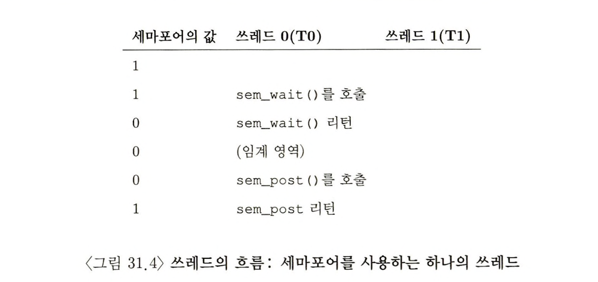
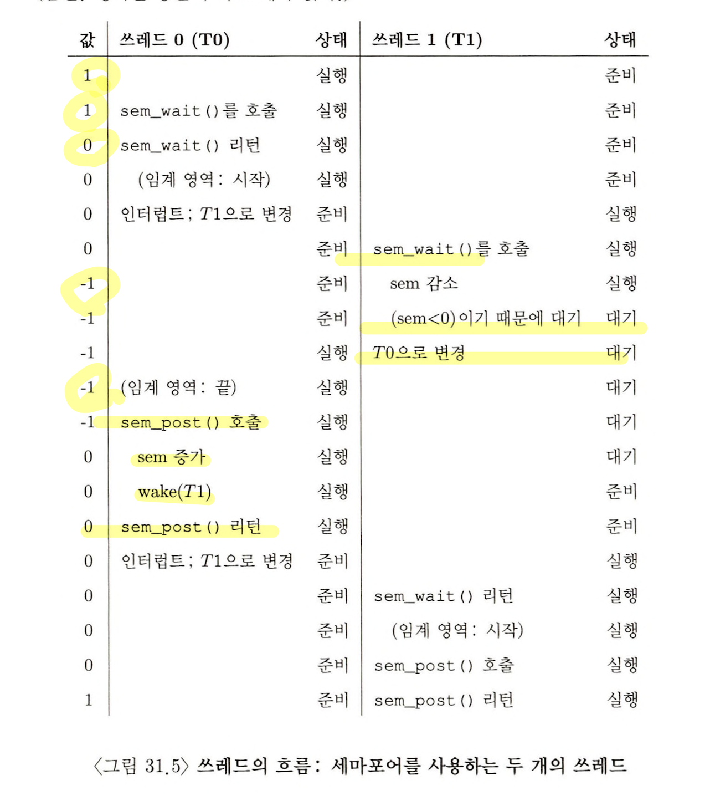
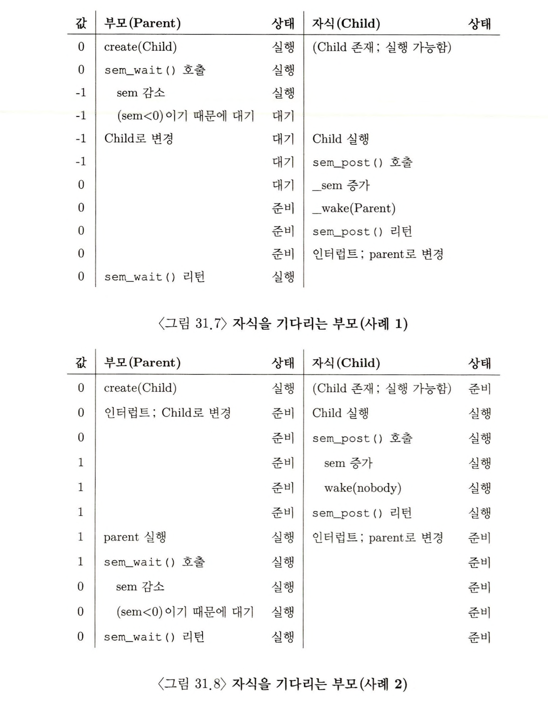

> 본 내용은 OSTEP 의 내용을 정리 및 요약한 내용입니다.
> 전문은 [이 곳](https://pages.cs.wisc.edu/~remzi/OSTEP/)을 방문하시면 보실 수 있습니다.

# 31 세마포어 

다양한 범주의 병행성 문제 해결을 위해선 락, 컨디션 변수 모두 필요하다. 이를 인지한 최초의 사람들 중 한 사람이 다익스트라 이다. 그는 최단 경로 알고리즘을 시작으로 Goto문의 유해성 등 구조화 프로그래밍의 논쟁을 일으킨 장본인이다. 

이번 장에서 배우는 **세마포어(semaphore)** 동기화 기법 역시 그가 개발한 것이다. **세마포어는 락과 컨디션 변수로 모두 사용이 가능한 도구이다.**

<div style=“margin:10px;”>
<h3 style="display:inline-box; background-color:#666; padding:10px 10px 5px 10px; border-radius:10px 10px 0 0; margin: 0px; color:white;">🚩 핵심 질문: 락은 어떻게 만들까</h3>
<div style="display:box; background-color:#808080; margin: 0px; padding: 10px; color:black; border-radius: 0 0 10px 10px; color:white">효율적인 락은 어떻게 만들어야 하는가?<br>
효율적인 락은 낮은 비용으로 상호 배제 기법을 제공하고 다음에 다룰 몇가지 속성들을 추가로 가져야 한다. 어떤 하드웨어 지원이 필요한가?<br> 어떤 OS 지원이 필요한가?
</div>
</div>

## 31.1 세마포어 : 정의 

세마포어는 정수 값을 갖는 객체로, 두 개의 루틴으로 조작할 수 있다. POSIX 표준에서는 이 두 루틴을 `sem_wait()`, `sem_post()` 라고 한다. 

우선 사용을 위해선 값을 초기화해야 한다. 

```c
// 31.1 세마포어 초기화
#include <semaphore.h>
sem_t s;
sem_init(&s, 0, 1);
```

위 예시는 세마포어 s를 선언, 3번째 인자 1을 전달하여 세마포어의 값을 **1**로 초기화 한다. 두번째 값은 모든 예제에서 0으로 둘 것이다. 이 값은 같은 프로세스 내의 쓰레드 간에 세마포어를 공유한다는 것을 의미한다. 두번째 인자에 다른 값을 사용하는 예는 세마포어의 용법에 대한 메뉴얼을 참고하라. 

초기화 된 후에는 sem_wait()과 sem_post()라는 함수를 호출해서, 세마포어를 다룬다. 

```c
// 31.2 세마포어 : sem_wait()과 sem_post()의 정의 
int sem_wait(sem_t* s) {
	decrement the value of semaphore s by one;
	// 세마포어 s의 값을 하나 줄인다. 
	wait if value of semaphore s is negative;
	// 세마포어 s의 값이 음수라면 기다린다. 
}

int sem_post(sem_t* s) {
	increment the value of semaphore s by one;
	// 세마포어 s의 값을 하나 증가시킨다. 
	if there are one more threads waiting, wake one;	
	// 하나 이상의 쓰레드가 대기중이라면, 이를 깨운다. 
}
```

이 루틴들은 동시에 다수 쓰레드들에 의해 호출 될 수 있다. 임계영역이 적절히 보호 되어야 한다. 임계 영역 보호를 위해 사용할 함수 내에서 임계 영역 보존 문제가 존재한다. 해당 문제를 세마포어 함수 내에서도 동일하지만, 이에 대한 내용은 차후에 이야기 하며, 일단 지금은 해당 임계 영역이 함수 내에서 보호되고 있다고 가정한다. 

세마포어에서 중요한 핵심 성질은 다음과 같다. 
- sem_wait() 함수는 즉시 리턴하거나, 해당 세마포어 값이 1 이상이 될 때까지 호출자를 대기시킨다. 다수의 쓰레드들이 호출이 가능하므로, 이는 대기 큐가 존재하며, 대기하는 법에는 회전(spin)과 재우기(sleep) 두가지가 있다. 
- sem_wait() 함수와 달리 sem_post() 함수는 대기하지 않는다. 세마포어 값을 증가 시키며 대기 중인 쓰레드 중 하나를 깨운다. 
- 세마포어가 음수라면, 그 값은 현재 대기중인 쓰레드의 개수와 같다. 사용자는 이 값을 보통 알 수 없지만, 이해를 위해 알아두는 게 중요하다. 

이 두 함수들은 아직은 원자적으로 실행된다고 가정하며, 레이스 컨디션 발생의 여부는 아직 고려하진 않는다.

## 31.2 이진 세마포어(락)

세마포어를 처음으로 적용해볼 것은 락 자체이다. 

```c
// 31.3 이진 세마포어(또는 락)
sem_t m;
sem_init(&m, 0, X); // X로 초기화하기, 이때 X의 값은?
sem_wait(&m);

// 임계 영역 배치

sem_post(&m);
```



구동하는 방식은 메뉴얼, 31.4 에서 나온 그대로이다. sem_wait()에서 두가지 경우로 나뉘며, 값을 가지면 임계 영역에 진출, 하지 못하면 프로세스를 내주고 스스로 잠자기에 들어갈 수 있다. 

sem_post() 임계영역을 넘으면 호출하게 되는데, 이렇게 되면 작업이 끝남과 함께 대기가 있을 경우 대기중인(wait에 멈춘) 쓰레드를 깨운다. 

세마포어를 락으로 쓸수 있음을 볼 수 있었으며, 두개의 상태(사용 가능, 사용 중)만 존재하므로 이러한 세마포어를 **이진 세마포어(binary semaphore)** 라고도 부를 수 있다. 만약 이진 세마포어로만 사용한다면 현재 설명하는 범용 세마포어 구현이 더욱 쉬워진다고 볼 수 있다(범용 보다 구조가 간단하다)



## 31.3 순서 보장을 위한 세마포어 

세마포어는 병행 프로그램에서 일어나는 사건들의 순서를 정하는데에도 유용하다. 리스트에서 객체를 삭제하기 위해 리스트에 객체가 추가되기를 대기하는 쓰레드가 있다면, 하나의 쓰레드는 사건 발생을 기다리며, 다른 쓰레드는 해당 사건을 발생시킬 시, 시그널을 보내고 기다리는 쓰레드를 깨운다.  이 과정에서 기존에 컨디션 변수를 사용했다. 

이처럼 세마포어도 동일한 도구로 사용이 가능하다. 

```c
// 31.6 자식을 대기 중인 부모
sem_t s;
void *child(void *arg){
	printf("child\n");
	sem_post(&s); // 시그널 전달: 자식의 동작이 끝남
	return NUILL;
}

int main(int argc, char *argv[]) {
	sem_init(&s, 0, X); // X의 값은? 
	printf("Parent: begin\n");
	ptrhead_t c;
	ptrhead_create(c, NULL, child, NULL);
	sem_wait(&s); // 자식을 여기서 대기 
	printf("Parent: end\n");
	return (0);
}
```

부모의 시작 - child - 부모의 종료  이 순서성을 확보하기 위해선 sem_wait()으로 자식 종료를 대기한다. 자식은 sem_post()를 호출하여 종료 되었음을 알린다. 이렇게 하면 순서성을 확보할 것이다.그렇다면 여기서이렇게 만들기 위해 값을 무엇으로 초기화 해야 할까?

정답은 초기값을 0으로 확보하는 것이다. 이 경우 두 가지 시나리오를 볼수 있다. 
1. 자식이 먼저 시작된 경우
	- 자식이 sem_post()를 호출하게 되면서 0이던 값이 1로 증가 시키게 된다. 
	- 부모는 sem_wait()에서 1이 존재하므로, 해당 1을 취하면서 작업이 진행된다.
1. 부모가 먼저 sem_wait()에 걸린 경우
	- 부모가 먼저 0인 세마포어를 -1로 만들면서 대기 상태로 들어감
	- 자식 쓰레드가 진행되면서, 자식은 sem_post()함수를 호출하고 값이 0이 되면서 부모는 깨어나서 작업을 진행한다. 


## 31.4 생산자/소비자 (유한 버퍼) 문제

다시 이전 장에서 상세히 설명한 문제를 다시 한번 세마포어를 통해 해결해보고자 한다. 

### 첫 번째 시도 

```c
// 31.19 put() 과 get() 루틴 
int buffer[MAX];
int fill = 0;
int use = 0;

void put(int value) {
	buffer[fill] = value;
	fill = (fill + 1) % MAX;
}

int get() {
	int tmp = buffer[use];
	use = (use + 1) % MAX;
	return (tmp);
}

// 31.10 full과 empty 조건 추가하기 
sem_t empty;
sem_t full;

void *producer(void *arg) {
	int i;
	for (i = 0; i < loops; i++) {
		sem_wait(&empty);
		put(i);
		sem_post(&full);
	}
}

void *consumer(void *arg) {
	int i, tmp = 0;
	while (tmp != -1) {
		sem_wait(&full);
		tmp = get();
		sem_post(&empty);
		printf("%d\n", tmp);
	}
}

int main(int argc, char *argv[]) {
	//...
	sem_init(&empty, 0, MAX); // MAX 버퍼는 비어 있는 상태로 시작
	sem_init(&full, 0, 0); // 0인 상태로 시작 
}
```

코드를 보면 생산자와 소비자 각 하나씩 두개으 쓰레드가 있다고 가정하면 정상적으로 작동하는 것을 볼 수 있다. 

여러 쓰레드를 가지고 동작을 해도 상관은 없다. 하지만 MAX 값이 1보다 큰 경우, 버퍼가 발생하는 경우 다수 생산자와 다수의 소비자 사이에서 문제가 발생한다. '경쟁조건'이 발생하게 된다. 

이는 바로 put과 get에서 발생한다. 

두개의 생산자 Pa, Pb가 거의 동시에 put() 을 호출하는 경우가 있다고 보자. Pa 쓰레드가 fill 카운터 변수를 1 증가시키기 전에 인터럽트가 발생, Pb가 put()을 호출한다면 데이터 기록에서 동일한 위치에 새로운 값이 들어가게 된다. 

### 해법: 상호 배제의 추가 

이러한 문제가 발생한 원인은 공유 변수 접근시의 상호배제(Mutual Exclusion)의 기능이 정상적으로 고려되지 않았기 때문이다. 버퍼를 채우고 버퍼에 대한 인덱스를 증가하는 동작은 다수의 스레드가 있다는 전제하에 `임계영역`이므로 값을 넣는 작업의 원자성이 보장 되어야 한다. 이를 고려한 put(), get()은 다음처럼 될 것이다. 

```c
// 31.11 상호 배제 추가하기 (잘못된 방법))
void *producer(void *arg) {
	int i;
	for (i = 0; i < loops; i++) {
		sem_wait(&mutex);
		sem_wait(&empty);
		put(i);
		sem_post(&full);
		sem_post(&mutex);
	}
}

void *consumer(void *arg) {
	int i, tmp = 0;
	while (tmp != -1) {
		sem_wait(&mutex);
		sem_wait(&full);
		tmp = get();
		sem_post(&empty);
		sem_post(&mutex);
		printf("%d\n", tmp);
	}
}
```

막상 이렇게 락을 추가했으니 될 것이라고 생각할 수 있다. 하지만 막상 교착 상태가 벌어져 둘다 움직이지 않는 모습을 보이게 된다. 왜 발생할까?

### 교착 상태의 방지

생산자와 소비자 쓰레드가 각 하나씩 있다고 보자. 소비자가 먼저 실행되어 mutex를 얻고 full  세마포어에 대해 sem_wait()을 호출한다. 버퍼는 비어버리고, 동시에 소비자는 다시 대기 모드로 바뀐다. 문제는 여기서소비자가 아직도 락을 보유하고 있다는 점이다. 

이때 생산자가 실행되고, 생산자는 mutex 세마포어를 잡으려고 하겠지만, 소비자가 이미 해당 세마포어를 갖고 있으니, 생산자 쓰레드도 대기모드로 들어간 것이다. 


### 최종, 제대로 된 해법

이런 경우가 발생하는 이유는 락의 범위(scope) 때문이다. 락을 걸어야 하는 원자적 연산 부분이 get 과 put으로 정해져 있기 때문에, 생산자와 소비자가 완전히 자신이 작동하는 입장이 확고 해진다. 그 상태에 진입 했을 때만 mutex 세마포어를 확보하니 교착 상태가 거질 일이 없어지는 것이다. 

```c
// 31.12 상호 배제 추가하기 (올바른 방법))
void *producer(void *arg) {
	int i;
	for (i = 0; i < loops; i++) {
		sem_wait(&empty);
		sem_wait(&mutex);
		put(i);
		sem_post(&mutex);
		sem_post(&full);
	}
}

void *consumer(void *arg) {
	int i, tmp = 0;
	while (tmp != -1) {
		sem_wait(&full);
		sem_wait(&mutex);
		tmp = get();
		sem_post(&mutex);
		sem_post(&empty);
		printf("%d\n", tmp);
	}
}
```

## 31.5 Reader-Writer 락 

고전적인 또 다른 동시성의 문제로 독자와 작가의 문제가 있다. 해당 문제의 경우 다양한 자료구조를 접근할 때, 각 자료구조의 특성과 접근 방식을 적절히 고려한 여러 락 기법을 필요로 한다. 

예시 중 하나로 다수의 쓰레드가 연결 리스트에 노드를 삽입하고 검색을 하는 상황에서, 삽입 연산은 리스트를 변경하고, 검색은 단순 읽기만 진행한다. 이때 삽입 연산이 없다는 보장만 된다면 다수의 검색 작업을 동시 수행하는 것은 가능하고, 이러한 특성을 고려한 방식이 **read-writer 락**이다. 

```c
// 31.13 간단한 reader-writer 락 
typedef struct _rwlock_t {
	sem_t lock; // 이진 세마포어
	sem_t writelock; // 하나의 writer / 여러 reader 허용 
	int readers; // 임계 영역 내에 읽기를 수행중인 reader의 수
} rwlock_t;

void rwlock_init(rwlock_t *rw) {
	rw->readers = 0;
	sem_init(&rw->lock, 0, 1);
	sem_init(&rw->writelock, 0, 1);
}

void rwlock_acquire_readlock(rwlock_t *rw) {
	sem_wait(&rw->lock);
	rw->readers++;
	if (rw->readers == 1) {
		sem_wait(&rw->writelock);
	}
	sem_post(&rw->lock);
}

void rwlock_release_readlock(rwlock_t *rw) {
	sem_wait(&rw->lock);
	rw->readers--;
	if (rw->readers == 0) // 마지막 reader가 writelock 을 해제하고, writer가 작업 가능하도록 깨움
		sem_post(&rw->writelock);
	sem_post(&rw->lock);
}

void rwlock_acquire_writelock(rwlock_t *rw) {
	sem_wait(&rw->writelock);
}

void rwlock_release_writelock(rwlock_t *rw) {
	sem_post(&rw->writelock);
}
```

코드 예시를 보면 간단한데, 우선 읽기 행위를 하는 것은 계속 기록을 하며, 마지막 읽는 대상이 자신인 경우 writer 를 깨우고 writer는 자신의 작업으로 들어간다. 

이러한 방식으로 구현될 경우 reader는 자연스럽게 읽기가 가능하며 쓰기 행위만 베타적으로 작성된다. 하지만 단점은 쓰기를 진행하기 위해선 우선 읽기가 모두 끝날 때까지 대기해야 한다. 따라서 상대적으로 쓰기 쓰레드는 상당히 불리하며, 기아현상이 발생하기쉽다는 문제가 있다. 

이러한 기본적인 형식에서 좀더 정교하게 컨트롤 하는 것도 가능하다. 하지만 이러한 방식으로 바꿀 수록 오버헤드가 커질 수 있다는 점이다. 때문에 복잡하고 정교하게 제어된다고 해서 단순하고 빠른 락 종류를 사용하는 것보다 항상 성능이 좋아지는 것은 아니다. 

<div style=“margin:10px;”>
<h3 style="display:inline-box; background-color:#666; padding:10px 10px 5px 10px; border-radius:10px 10px 0 0; margin: 0px; color:white;">⛳️ 팁: 단순 무식이 좋을 수 있다.</h3>
<div style="display:box; background-color:#808080; margin: 0px; padding: 10px; color:black; border-radius: 0 0 10px 10px; color:white">락에 있어서 가장 단순한 방식은 스핀락이다. 이러한 스핀락이 더 효과적일 수 있는 이유는, 우선 구현이 용이하고 간단하며, 복잡한 락일 수록 다른 연산들이 늘어나 그만큼 오버헤드가 늘어날 수 있기 때문이다. 따라서 가장 먼저 단순하게 락을 걸어 동작하는지 여부를 판단해보는 것이 좋다. 
</div>
</div>

## 31.6 식사하는 철학자 

해당파트는 기존의 과제로도 진행했으며, 크게 적어둬야 할 만한 내용이 존재하지 않아 생략한다. 

### 불완전한 해답 

### 해답: 의존성 제거

## 31.7 쓰레드 제어

세마포어가 적용되는 또 다른 사례로 과도하게 많은 쓰레드가 동시에 수행되는 것을 임계 값을 정하고, 세마포어를 사용하여 문제가 되는 코드를 동시에 실행하는 쓰레드 개수를 제한하는 것이다. 이러한 제어 방법을 **제어(throttling)** 라고 부른다. **수락제어**의 한 형태로 간주한다. 

수백개의 쓰레드를 생성하여 어떤 문제를 병렬로 해결하려고 한다. 그러나 코드의 특정 부분에서 각 쓰레드는 많은 양의 메모리를 할당 받아야 연산의 일부를 수행한다. 이러한 부분을 **메모리-집약 영역(mememory-intensive region)** 라고 한다. 모든 쓰레드가 이러한 메모리-집약 영역에 들어가면 시스템의 물리 메모리 양을 초과할 것이고, 이런 경우 쓰래싱이 시작되고(디스크에서 페이지를 스와핑) 전체 계산 속도가 느려진다. 

이럴 때 세마포어를 이용하면 이 문제를 해결할 수 있다. 세마포어의 값을 메모리 집약 영역에 동시에 들어갈 수 있는 최대 쓰레드 개수로 초기화하고, 코드 앞뒤를 sem_wait(), sem_post()로 감싸면 위험 영역에서 병행 실행의 개수를 통제할 수 있다. 

## 31.8 세마포어 구현 

```c
// 31.7 락과 컨디션 변수를 사용한 제마포어의 구현
typedef struct __zem_t {
	int value;
	pthread_cond_t cond;
	ptrhead_mutex_t lock;
}zem_t;

void zem_init(zem_t *s, int value) {
	s->valie = value;
	cond_init(&s->cond);
	mutex_init(&s->lock);
}

void zem_wait(zem_t *s) {
	mutex->lock(&s->lock);
	while(s->value <= 0)
		cond_wait(&s->cond, &s->lock);
	s->value--;
	mutex_unlock(&s->lock);
}

void zem_post(zem_t *s) {
	mutex_lock(&s->lock);
	s->value++;
	cond_signal(%s->cond);
	mutex_unlock(&s->lock);
}
```

다익스트라의 구현한 것과는 다소 다르며, 음수 값이 되도록 구현하는 것은 쉽지 않다. 

## 31.9 요약

세마포어는 동시성(병행성) 프로그램 작성을 위한 강력하고 유연한 기법이다. 어떤 개발자들은 간단하고 유용하다는 이유로 세마포어만을 사용하기도 한다. 

동시성에 대한 고전적 문제들을 이야기 했으나, 진자 제대로 이를 이해하기 위해선 상당히 많은 경험과 노력이 필요시 될 것이다. 여러 상황에 대해 직접 찾고 학습할 필요가 있는 영역이라고 말하고 이번 장을 마친다. 


```toc

```
