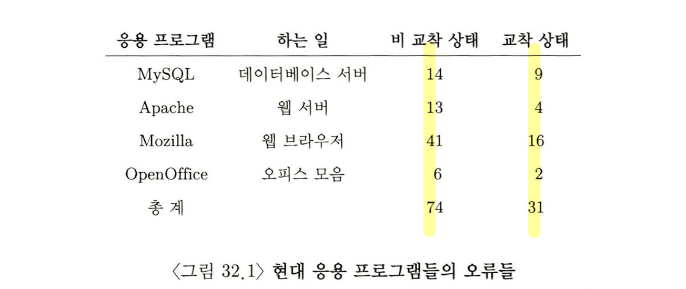
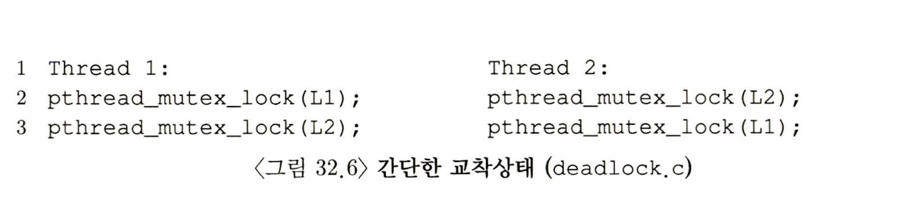
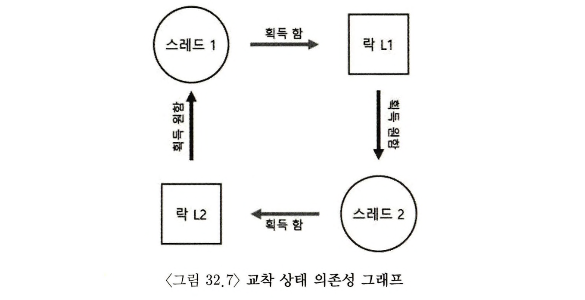

> 본 내용은 OSTEP 의 내용을 정리 및 요약한 내용입니다.
> 전문은 [이 곳](https://pages.cs.wisc.edu/~remzi/OSTEP/)을 방문하시면 보실 수 있습니다.

# 32 병행성 관련 버그 

<div style=“margin:10px;”>
<h3 style="display:inline-box; background-color:#666; padding:10px 10px 5px 10px; border-radius:10px 10px 0 0; margin: 0px; color:white;">🚩 핵심 질문: 일반적인 병행성 관련 오류들을 어떻게 처리하는가?</h3>
<div style="display:box; background-color:#808080; margin: 0px; padding: 10px; color:black; border-radius: 0 0 10px 10px; color:white">병행성 버그는 몇 개의 전형적인 패턴을 갖고 있다. 튼튼하고 올바른 병행 코드를 작성하기 위한 가장 첫 단계는 어떤 경우들을 피해야 할 지를 파악하는 것이다. 
</div>
</div>

수년 동안 병행성 관련 오류의 해결은 주요한 숙제였다. 대부분의 초기 연구는 교착 상태에 초점이 맞추어져 있었고, 최근에는 다른 종류의 버그들도 다루고 있다. 실 코드를 보면서 이러한 경우와 어떤 문제들을 조심해야 동시성(병행성)을 유지할 수 있는지를 살필 것이다. 

## 32.1 오류의 종류 


- 복잡한 동시성 프로그램에서는 어떤 종류의 문제점들이 발생하는가? 
	- 위 예시를 보면 알 수 있듯이 다양한 오류가 발생하는 것이 보이며, 그중 대부분이 의외로 교착 상태와 무관한 오류였다. 
- 따라서 우선적으로 비교착 상태에 대한 오류를 살펴 본 뒤에, 교착 상태 오류들을 다룰 때에, 이 분야에서 핵심 중에 핵심 소재인 예방, 회피, 해결 혹은 관리 연구에 대해 논의 한다. 

## 32.2 비 교착 상태 오류 

Lu라는 연구자의 결과에 따르면 절반의 버그는 교착 상태와 무관한 버그였다. 이러한 버그들은 보통 **원자성 위반(atomicity violation)** 오류와 **순서 위반(order violation)** 이다. 이러한 예시들은 교착 상태와 관련성은 없다. 

### 원자성 위반 오류

첫 번째 소개 되는 오류는 **원자성 위반**이라고 부르는 문제이다. MySQL에서 발견한 간단한 예제이다. 

```c
// 32.2 원자성 위반
thread_1 ::
if (thd->proc_info(...)){
	fputs(thid->proc_info);
}

Thread 2::
thd->proc_info = NULL;
```

본 예제에서 보면 첫 번째 쓰레드가 검사를 완료하고, fputs()를 호출하기 전에 인터럽트가 발생하여, 두번째 쓰레드가 실행될 수 있다. 

두번째 쓰레드가 실행되면 필드의 값을 NULL 로 설정하므로, fputs()는 NULL 포인터를 역참조하는 꼴이나면서 프로그램은 크래시가 발생하게 된다. 

Lu등이 기술한 `원자성 위반`의 정의는 다음과 같다. 

**다수의 메모리 참조 연산들 간에 있어 예상했던 '직렬성(serializability)'이 보장되지 않는 다면, 이는 원자성을 위반한 것이다.**

따라서 연산에서 직렬성을 확보해주는 것이 무엇보다도 중요한 부분이라 할 수 있겠다. 

```c
// 32.3 원자성 위반 수정 버전
thread_1 ::
pthread_mutex_lock(&proc_info_lock);
if (thd->proc_info(...)){
	fputs(thid->proc_info);
}
pthread_mutex_unlock(&proc_info_lock);

Thread 2::
pthread_mutex_lock(&proc_info_lock);
thd->proc_info = NULL;
pthread_mutex_unlock(&proc_info_lock);
```

### 순서 위반 오류 
```c
//32.4 순서 위반 오류
Thread 1::
void init() {
	mThread = PR_CreateThread(mMain, ...);
}

Thread 2::
void mMain(. . .) {
	mState = mThread->State;
}
```

위의 코드는 쓰레드 1이 안정적으로 동작한 뒤, 쓰레드 2가 실행되어야만 정상적으로 작동할 것을 볼 수 있다. 그러나 만약 해당 순서가 정상적으로 지켜지지 못한다면 쓰레드 2가 임의의 메모리 주소를 접근하므로 프로그램 에러를 발생시키게 된다. 

이러한 오류의 수정은 당연하게도 '순서'를 강제하는 방법으로 해결될 것이다. 이러한 종류의 동기화에는 **컨디션 변수**가 잘 맞는다. 

```c
// 32.5 순서 위반 수정 버전
pthread_mutex_t mtLock = PTHREAD_MUTEX_INITIALIZER;
pthread_cond_t mtCond = PTHREAD_COND_INITIALIZER;
int mtInit = 0;

Thread 1::
void init() {
	mThread = PR_CreateThread(mMain, ...);

	pthread_mutex_lock(&mtlock);
	mtInit = 1;
	pthread_cond_signal(&mtCond);
	pthread_mutex_unlock(&mtLock);
}

Thread 2::
void mMain(. . .) {
	...
	// 쓰레드 초기화를 대기
	pthread_mutex_lock(&mtLock);
	while (mtInit == 0)
		pthread_cond_wait(&mtCond, &mtLock);
	pthread_mutex_unlock(&mtlock);
	
	mState = mThread->State;
	...
}
```

### 비 교착 상태 오류: 정리 

여러 연구를 통해 비 교착 상태 오류의 대부분(97%) 는 원자성 또는 순수 위반에 대한 것이다. 이러한 오류 패턴들을 유의하면 관련 오류를 줄일 것이다. 더불어 디버거의 적극적인 사용, 자동화된 코드 검사 도구 등이 개발될 수록 점점 비교착 상태 오류들을 잡아내고 있다. 이는 비교착 상태 오류가 전체 오류 분포중 상당한 비중을 차지하기 때문이다. 

단, 이러한 수정이 쉬운것은 아니며 프로그램 동작에 대한 심도 있는 이해, 방대한 코드에 대한 이해와 자료구조 재수정이 필요시 된다. 

## 32.3 교착 상태 오류 

병행성 관련 복잡한 락 프로토콜을 사용하는 동시성 시스템에서는 **교착상태(dead lock)** 이라는 고전적 문제가 발생할 수 있다.  이는 조건이 되는 락1, 2가 있다고 할 때, 쓰레드들이 서로 이 락을 잡으려고 하다가, 양쪽 하나 씩을 잡고 그 이상의 코드 진행이 안되는 경우를 의미한다. 





### 교착 상태는 왜 발생하는가 

가장 기본적으로 큰 이유는 구성 요소 간의 복잡한 의존성이 발생하고, 코드 상에 자연스럽게 존재하는 순환 의존성이 교착 상태를 야기시키는 것을 방지하기 위해서 대형 시스템의 락 사용 전략의 설계를 신중히해야 한다. 

두 번째 이유는 **캡슐화(encapsulation)** 의 성질 때문이다. 개발자들은 모듈화를 통해 개발의 용이성을 올리려고 하지만, 모듈화는 기본적으로 락과 조화롭지 못하다. 

### 교착 상태 발생 조건 

교착 상태가 발생하기 위해서는 네 가지 조건이 충족되어야 한다. 
- 상호 배제(Mutual Exclusion)  :
	- 쓰레드가 자신이 필요로 하는 자원에 대한 독자적인 제어권을 주장한다. 
- 점유 및 대기(Hold-and-Wait) :
	- 쓰레드가 자신에게 할당된 자원을 점유한 채로 다른 자원(획득 하려는 락)을 대기한다.
- 비 선점(No preemption) :
	- 자원(락)을 점유하고 있는 쓰레드로부터 자원을 강제적으로 빼앗을 수 없다.
- 환형 대기(Circular wait) :
	- 각 쓰레드는 다음 스레드가 요청한 하나 또는 그 이상의 자원(락)을 갖고 있는 쓰레드들의 순환 고리가 있다. 

핵심은 네 조건 중 하나라도 만족시키지 않는다면 교착 상태 자체는 일어나지 않는다. 그러나 4개의 조건을 충족한다면 교착상태는 발생하게 된다. 

### 교착 상태의 예방 

#### 순환 대기(Circular Wait)
- 순환대기가 발생하지 않도록 하는 방법은 **전체 순서** 혹은 **부분 순서** 라고 하여서, 시스템 상에서 자원을 얻어야 하는 순서를 명확히 하는 것이다. 
- 예를 들어 L1, L2가 존재하는데, 이때 L1, L2 어느것이나 먼저 잡으면 되는 구조를 만들게 되면, 교착이 생긴다. 하지만 L1을 무조건 가져야만 L2를 갖게 만든다면, 교착은 발생할 수 없다. 단, 이러한 방법으로 락을 제어하는 것은 섬세한 주의가 필요하고, 특히 락의 순서를 결정하기 위해서는 다양한 루틴 간의 상호 호출 관계를 제대로 이해해야 할 것이다. 

#### 점유 및 대기(Hold-and-Wait)
점유 및 대기는 원자적으로 모든 락을 단번에 획득하도록 하면 예방할 수 있다. 예를 들면 다음과 같다.
```c
pthread_mutex_lock(prevention); // 획득 시작
pthread_mutex_lock(L1);
pthread_mutex_lock(L2);
...
pthread_mutex_unlock(prevention); // 락 종료 
```

여기서 핵심은 어떤 쓰레드가 락을 획득하려면, 일단 전역 prevention 락을 획득해야 한다. 
다른 쓰레드가 이와 반대의 순서라도 괜찮다.(L2->L1) 우선 prevention을 확보하지 못하면 다른 락을 소유하지 못한다. 

그러나 필요한 락들을 정확히 파악해야 하고, 락을 미리 획득해야 하며, 락이 실제 필요할 때 요청하는 구조와는 다르기에, 동시성을 저하하는 문제를 가진다. 

#### 비선점(No Preemption)

락을 획득하게 되면, 락은 명시적으로 반납하기 전까지는 락을 보유하게 된다. 여기서 추가 락을 요청할 경우 당연히 문제가 발생하는 것이다. 그렇기에 여러 인터페이스에서는 유연한 인터페이스들을 제공한다. 

예를들면 pthread_mutex_trylock() 루틴이, 락을 성공 못하면 대기를 하지 않고, 에러코드를 반환하는 구조의 인터페이스다. 이를 활용한다면, 여러 락이 필요한 상황에서 락을 오히려 내려놓게 만드는 것이 가능하다. 

```c
top:
	pthread_mutex_lock(L1);
		if (pthread_mutex_trylock(L2) != 0) {
			pthread_mutex_unlock(L1);
			goto top;
		}
```

이 방식은 락을 내려놓기 때문에 대기 하는 경우가 없어진다. 하지만 반대로 **무한 반복(livelock)** 이라는 새로운 문제를 직면하게 된다. 계속 시도하다 실패하는 경우가 되어서, 결과적으로 락을 정상적으로 획득하지 못하고, 무한 반복하는 것이다. 

#### 상호 배제(Mutual Exclusion)

마지막 예방법으로 상호배제 자체를 없애는 방법이다. Herlihy 는 락이 전혀 없는 다양한 자료구조를 설계할 수 있다는 아이디어를 가졌다. 이 것의 구현은 하드웨어 명령어를 사용하면 명시적인 락킹이 필요없이도 접근할 수 있는 자료구조를 만들 수 있다. 

이러한 방법으로는 위에서 전에 언급했던 `Compare-and-Swap` 과 같은 명령어를 통해 락을  대기하는 것이 아니라, 지속적으로 반복적으로 비교 및 조건에 접근하는 것이다. 

#### 스케줄링으로 교착 상태 회피하기 

보통 교착 상태를 예방할 때보단, 회피하는 것이 오히려 좋은 경우가 있을 수 있다. 회피를 위해선 실행 중인 여러 쓰레드가 어떤 락을 획득하게 될것인지 전반적으로 파악하고 있으며, 이를 통해 컨트롤하여 교착 상태를 만들지 않도록 그때그때 보장하는 것이다. 

그러나 상당히 제한적인 환경에서만 유용한 방법들이다. 오히려 이러한 방법은 동시성에서 제약을 가져올 수 있어서, 교착 상태의 회피는 보편적이진 못하다. 

#### 발견 및 복구

마지막 전략은 교착 상태 발생은 허용하고, 교착 발생 시 이를 복구하는 방법이다. 이러한 경우는 교착 상태가 아주 가끔 발생 시 이러한 방법도 유용하다고 볼 수 있다.

많은 데이터 베이스 시스템은 교착을 발견하면 회복하는 기술을 사용한다. 이는 주기적으로 실행되며 자원 할당 그래프를 그려서 사이클 생김 여부를 검사한다. 사이클이 발생하는 경우 시스템은 재부팅 되어야 한다. 자료 구조에 대한 복잡한 복구가 필요한 경우 사람이 직접 복구를 수행할 수도 있다. 

## 32.4 요약 

교착 상태에 대하여 구체적으로 다루었고, 이에 대한 원인과 대응 방법을 살펴 보았다. 동시성(병행성) 문제는 상당히 오래된 주제이고, 그만큼 많은 논문들이 소개된다. 

이러한 교착 상태의 가장 좋은 해법은 조심하는 것, 락을 획득 순서를 정해서 애초에 교착 상태의 발생 하지 않도록 만드는 것이라고 볼 수 있다. 

락은 원천적으로 문제점을 수반하는 만큼, 반드시 필요한 경우가 아니면 사용을 피하는 것이 중요하다. 


```toc

```
