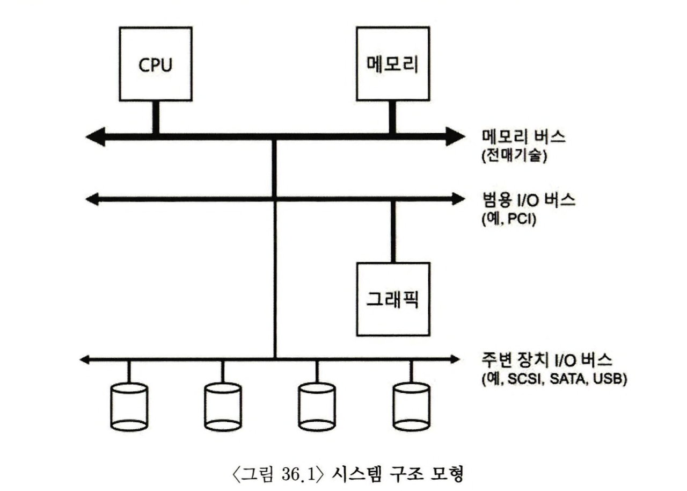
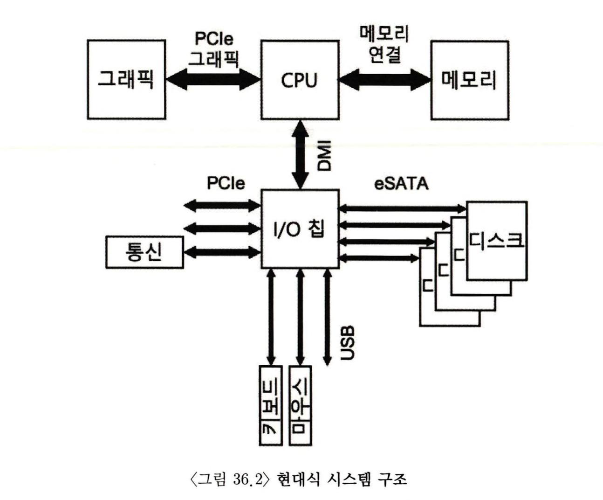
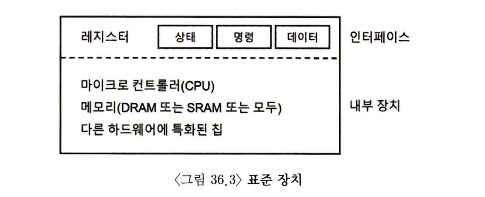
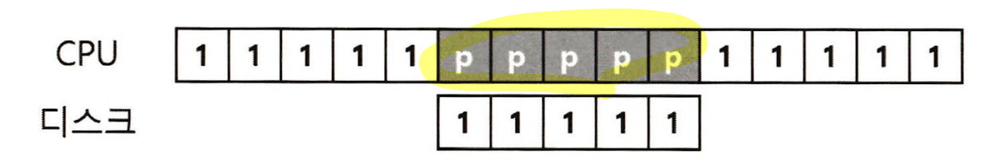
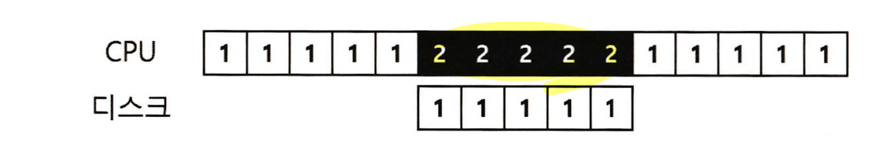
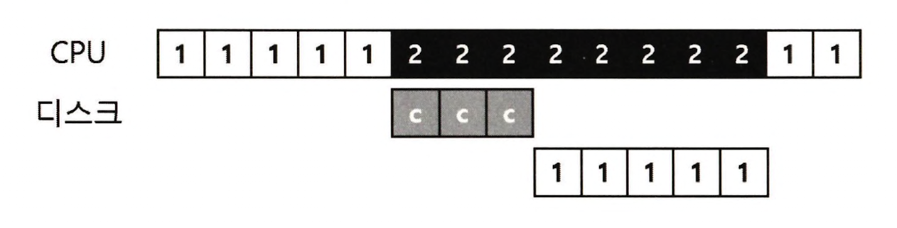
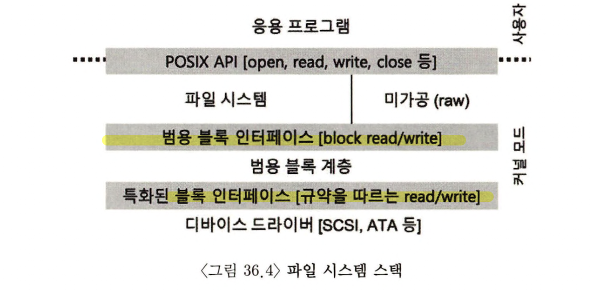
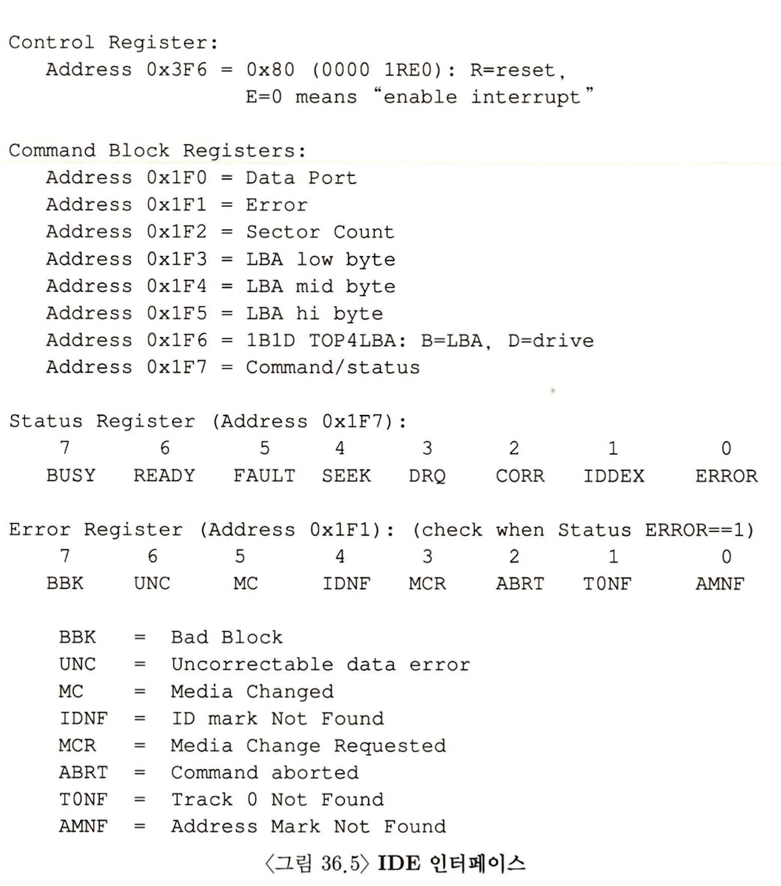

> 본 내용은 OSTEP 의 내용을 정리 및 요약한 내용입니다.
> 전문은 [이 곳](https://pages.cs.wisc.edu/~remzi/OSTEP/)을 방문하시면 보실 수 있습니다.


# 35 영속성에 관한 대화 

해당 파트는 적당하게 강조점들만 정리하여 핵심을 정리하고 넘어간다. 

Persistence(영속성)은 사전적으로 곤경과 반대에도 불구하고 굳게 또는 완고하게 행동 방침을 유지할 때 쓰는 말이라고 한다. 

이는 컴퓨터도 마찬가지로, 정보도 마찬가지의 의미를 강조한다고 보면 된다. 컴퓨터가 멈추고 디스크가 고장이 나거나 전원이 꺼져도 정보 자체는 유지 되어야 하고, 되도록 만들어야 한다. 그것이 설령 어려운 도전이라도 말이다. 

# 36 I/O 장치 

주제(영속성)에 대한 세부적 논의에 앞서 입출력 장치(I/O)의 개념을 먼저 이야기 하고자 한다. 결국 컴퓨터에서 연산을 하고 컴퓨터 시스템을 유용하게 쓰려면 당연히 입력과 출력이 존재 해야 한다는 점에서, 우선적으로 기반을 닦고 간다. 

<div style=“margin:10px;”>
<h3 style="display:inline-box; background-color:#666; padding:10px 10px 5px 10px; border-radius:10px 10px 0 0; margin: 0px; color:white;">🚩 핵심 질문: 어떻게 I/O를 시스템에 통합할까?</h3>
<div style="display:box; background-color:#808080; margin: 0px; padding: 10px; color:black; border-radius: 0 0 10px 10px; color:white">시스템에 I/O를 어떻게 통합해야 하는가? 일반적인 방법은 무엇이며 어떻게 통합할 수 있을까? 
</div>
</div>

## 36.1 시스템 구조 



위 그림을 보자. CPU와 주 메모리가 **메모리 버스**로 연결되어 있다. 몇가지 장치들은 **범용 I/O 버스**에 연결되어 이다. 많은 현대 시스템에서는 **PCI**를 사용하고 있다. 또한 그 아래에는 **SCSI**, **SATA** 또는 **USB**와 같은 주변장치용 버스 등도 존재한다. 

그렇다면 왜 이런 계층 구조의 데이터 버스가 필요한 것일까? 

간단하게 정리하자면 결국 물리적인 이유 & 비용 때문이다. 버스의 고속화는 필연적으로 고속 메모리, 고속의 연산장치가 필요하게 된다. 발열도 덤으로따라오게 되면서, 해당 기술을 위한 구현의 코스트는 높아진다. 따라서 시스템 설계자들은 계층 구조의 버스 구조를 체택하고, 고성능의 장치들은 CPU와 가깝게 배치하고, 상대적으로 느린 성능이 요구되는 장치들은 멀리 배치하는 구조를 취했다. 

물론 현대식 시스템은 성능을 높이기 위해, 계속해서 칩셋과 속도 향상을 위해 노력했고, 그 모습이 그림 36.2의 인텔 Z270 칩셋구조와 같은 모습이다. 



그림을 보면 알 수 있듯 CPU에 가장 중요한 것들은 직결되어 있는 것이 보이며, 고속 인터페이스가 요소요소 사용된 것을 볼 수 있다. 
- **DMI(Direct Media Interface)** : 인텔의 기술로 I/O 칩에 연결되어 있다. 
- **eSATA** : 기존의 ATA(AT attachment, 고급 기술 결합)에서 시작하여 SATA(Serial ATA)로 발전하여 eSATA(external SATA)까지 개발된 연결 방식. 
- USB(Universal Serial Bus) 인터페이스는 키보드, 마우스 등을 상정하고 나왔다.
- PCIe(Peripheral Component Interconnect Express, 주변장치 연결 익스프레스)의 경우 CPU와 고성능을 요구하는 장치들간의 연결용이며, 통신에도 해당 규격은 사용된다. 또한 동시에 고속 저장장치(NVMe)와 같은 것도 PCIe를 활용해 연결된다. 

## 36.2 표준 장치



가상의 표준 장치라는 대상을 통해, 효율적 활용을 위해 필요한 조건들, 즉 컴퓨터와 통신하는 장치에 대해 이해해보자. 여기에는 기본적으로 핵심이 되는 두가지 요소가 존재한다. 

- 시스템의 다른 구성요소에게 제공하는 하드웨어 인터페이스 :
  소프트웨어가 인터페이스를 제공하듯, 하드웨어도 인터페이스를 제공하여 시스템 소프트웨어가 동작을 제어할 수 있도록 해야 한다. 따라서 모든 하드웨어 표준 장치들은 특정한 상호 동작을 위한 방식과 명시적인 인터페이스를 갖고 있다. 
- 내부 구조 : 구현 방법은 천차 만별일 수 있지만, 장치의 기능을 추상화하여 시스템에 제공할 책임을 갖고 있다. 단순한 장치라면 몇 개의 하드웨어 칩으로 기능이 구현되어 있고, 복잡해지면 CPU나 메모리 등을 탑재하고, 아주 최신의 대형 장치라면 수십만 줄의 펌웨어(firmware)라는 소프트웨어를 추가해, 내부 하드웨어 동작을 정의하고 있다. 

## 36.3 표준 방식 

위의 예시의 경우 단순화된 장치에서는 세개의 레지스터로 구성된 것을 볼 수 있다. 
- **상태(status)** : 해당 레지스터는 장치의 현재 상태를 읽을 수 있고
- **명령어(command)** : 어떤 동작을 할지 요청할 때 쓰고
- **데이터(data)** : 장치에 데이터를 보내거나 받거나 할 때 사용한다. 

장치가 운영체제를 대신하여 특정 동작을 할 때에 운영체제와 장치 간에 일어날 수 있는 상호 동작과정을 살펴보면 다음과 같다. 

```c
while(STATUSreg == BUSY)
	; // 장치가 바쁜 상태 동안 대기 
DATAreg = Data;
COMMANDreg = Command; 
// 장치가 명령어를 실행한다. 
while(STATUS == BUSY)
	; // 요청을 처리하여 완료할 때까지 대기 
```

기본적으로 4 단계를 통해 작업이 이루어진다. 

- 1단계 : 반복적으로 장치의 상태 레지스터를 읽어서 명령의 수신 가능 여부를 확인한다. 이러한 작업을 **폴링(polling)** 이라고 한다. 
- 2단계 : 운영체제가 데이터 레지스터에서 어떤 데이터를 전달하고, 여기서 데이터 전송에 메인 CPU가 관여 하는 경우를 **programmed I/O** 라고 부른다. 
- 3단계 : 운영체제가 명령 레지스터에 명령어를 기록한다. 이 레지스터에 명령어가 기록되면 데이터는 이미 준비되었다고 판단하고, 명령어를 처리한다. 
- 4단계 : 마지막은 운영체제는 디바이스가 처리를 완료 했는지를 폴링 반복문으로 점검한다. 여기서 정상 처리가 되지 않았다면, 에러코드를 받는다. 

이러한 기본적인 방식은 간단한 구조지만, 제대로 작동한다. 하지만 매우 비효율적이라는 사실이다. 폴링 자체를 통해 CPU가 계속 감시를 해야 하며, 루프를 돌면서 장치 상태를 체크하는데, 이 기믹 자체가 CPU의 연산 시간을 많이 소모하게 된다. 

<div style=“margin:10px;”>
<h3 style="display:inline-box; background-color:#666; padding:10px 10px 5px 10px; border-radius:10px 10px 0 0; margin: 0px; color:white;">🚩 핵심 질문: 폴링 사용 비용을 어떻게 피할 수 있는가?</h3>
<div style="display:box; background-color:#808080; margin: 0px; padding: 10px; color:black; border-radius: 0 0 10px 10px; color:white">어떻게 하면 자주 폴링을 하지 않으면서, 운영체제가 장치의 상태를 확인할 수 있고, 장치 관리 CPU의 오버헤드를 줄일 수 있을가?
</div>
</div>

## 36.4 인터럽트를 이용한 CPU 의 오더 헤드 개선 

위에서 언급한 방식에서 엔지니어들이 장치와의 상호작용을 개선하기위해 **인터럽트** 라는 것을 활요하게 된다. 
디바이스를 폴링하는 대신 운영체제는 입출력 작업을 요청한 프로세스를 블록 시키고 CPU 를 다른 프로세스에게 양도한다. 장치가 작업을 마치면 하드웨어 인터럽트를 발생 시켜 CPU는 운영체제가 미리 정의한 **인터럽트 서비스 루틴(interrupt service routine(ISR)) 또는 간단하게 **인터럽트 핸들러(interrupt handler)** 를 실행한다.  여기서 인터럽트 핸들러는 입출력 요청의 완료, I/O 대기 중인 프로세스를 깨우는 등의 역할을 하고, 이를 통해 폴링 없이도 CPU가 소모되는 것을 막을 수 있다.



위의 그림은 폴링을 사용할 때 CPU와 디스크의 작업상황을 보여준다. 이에 비해 아래는 인터럽트를 활용했을 때의 운영체제의 스켈쥴링 모습이다. 



보이는 것으로볼 때 인터럽트가 PIO 보다 좋아보인다. 하지만 반대로 이 경우 PIO가 좋을 수 있다. 

예를 들어 대부분 직업이 한 번판 폴링으로 끝난다는 매우 빠른 장치라고 한다면? 오히려 인터럽트는 느리고, 폴링이 최선이다. 느린 인터렙트를 사용할 잉는 없고, 하이브리드 방식을 채용할 수도 있다. 

**하이브리드** 접근 방식은 두 접근 법의 양쪽 장점만을 취하려는 방법이다. 

인터럽트를 사용하지 않는 다른 이유는 네트워크 환경에서 볼수 있다. 각 패킷이 도착할 때마다 인터럽트만 처리하다 사용의 프로세스의 요청 처리를 하면 운영체제가 사용자 프로세스의 요청을 처리 할수 없도록 만드는 **무한 반복(livelock)*** 빠질 가능성이 있다. 

또 다른 인터럽트 기반의 최적화 방법으론 병합(coalescing) 이다 이 경우 CPU에 인터럽트를 전달하기 전에 잠시 기다렸다, 인터럽트를 발생시키는 방법이다. 즉, 여러번 인터럽트를 발상하는게 아니라, 한 번만 CPU에게 전달하도록 하는 것이다. 

## 36.5 DMA 를 이용한 효율적인 데이터 이동 
- 많은 양의 데이터를 디스크로 전달하기 위해 Programmed I.O를 사용하면 또 다시 단순 작업 처리에 CPU가 소모된다. 즉, 다른 프로세스를 처리하고자 쓸 수 있는 있는 시간을 허비한다고 볼 수 있다. 
- 이 문제를 해결하기 위해 엔지니어는 **직접 메모리 접근 방식(Derect Mmemory Access)** 라는 방식을 채용한다. 위 방식은 데이터를 장치로 메모리에 전송하고, 운영체제는 다른 일을 할 수 있게 된다. DMA 가 작동하고, DMA 컨트롤러가 인터럽트를 통해 이를 운영체제 알린다. 



## 36.6 디바이스와 상호작용하는 방법 

입출력 요청의 서비스의 효율성의 중요함에 대해 지금까지 이야기 했다면, 실제로는 어떻게 정보를 서로 교환할까? 

장치와 통신하는 기본적인 방법은 두 가지 정도 개발 되었다. **I/O 명령** 을 명시적으로 사용하는 방법과 **맵 입출력(memory mapped I/O)** 를 사용하는 방식이다. 

- 기본적으로 장치와 통신하는 명령어들은 기본적으로 **특권(privileged)** 명령어 들이다. 운영체제가 장치를 제어하는 역할을 하고, 따라서 자연스럽게 운영체제만이 장치들과의 직접적인 통신을 가능케 한다. 
- 두 번째 방법의 경우 하드웨어는 장치의 레지스터들이 마치 메모리 상에 존재하는 것처럼 고려하고, 여기에 필요한 주소에 읽기나 쓰기를 행하는데, 하드웨어는 load/store 명령어가 주 메모리를 향하는 대신 장치를 향하고, 이를 통해 장치와의 통신이 진행된다. 

## 36.7 운영체제에 연결하기 : 디바이스 드라이버 

사실 최종적으로 다룰 문제는 서로 다른 인터페이스를 갖는 장치들과 운영체제를 연결시키는, 가능한 일반적인 방법을 찾는 것이다. 예를 들면 파일 시스템이 각 장치들의 구체적인 입출력 명령어 형식과는 별개로, 종속되지 않으면서도 동작하게 만들어야 할 것이다. 

여기서 컴퓨터 시스템의 개발 방향은 **추상화(abstraction)** 라는 개념을 통해 해결해왔다. 운영체제 최 화위 계층의 일부 소프트웨어는 장치의 동작 방식을 알고 있어야 하고, 이 소프트웨어가 운영체제의 일반적이고 추상적인 요구 사항에 장치가 동작하고 통신하는데 필요한 상세한 상호작용을 캡슐화하여 갖고 있는것이다. 

리눅스의 파일 시스템이 대표적인 예시로, 그 예시 이미지는 다음과 같다. 



캡슐화는 그러나 단점이 없는 것은 아니다. 예를 들어 특수 기능이 많이 갖고 있는 장치가 있다고 할 때, 커널이 범용적인 인터페이스 만을 제공할 수 밖에 없다면, 추상화를 통해 많은 특수 기능을 갖는 들 사용할 수 없게 된다. 

흥미로운 지점은 어떤 장치를 시스템에 연결하든, 디바이스 드라이버가 필요하다보니 시간의 흐름에 따라 디바이스의 드라이버 코드가 커널의 대부분을 차지하게 변해간다는 이야기가 있을 정도다. 그런데 이런 드라이버의 대부분을 아마추어들이 만들고, 시스템 개발자가 만든 것이 아니기 때문에 그만큼 상당한 버그, 크래스, 취약점들이 발생하는 주범이 된다. 

## 36.8 사례 연구 : 간단한 IDE 디스크 드라이버

좀더 깊이 있는 이해를 위해 실제 IDE 디스크 드라이브를 살펴보자. 

IDE 디스크는 시스템에 다음과 같은 4개의 레지스터로 이루어진 단순한 인터페이스를 제공한다. 그 레지스터들은 Control, Command block, Status, Error 로 이루어진다. 이 레지스터들은 in, out I/O 명령어를 사용하여 특정 "I/O 주소들"을 읽거나 씀으로 접근이 가능하다.(그림 36.5dml 0x3F6과 같은 구조 )

장치와 상호작용하기 위한 기본 방식은 다음과 같으며, 장치는 이미 초기화 되었다고 가정한다. 



- 장치가 준비 될 때까지 대기 : 드라이브가 사용 중이지 않고 READY 상태가 될 때까지 Status 레지스터를 읽는다.
- Command 레지스터에 인자 값 쓰기 : 섹터의 수와 접근 해야할 섹터들의 논리 블럭 주소(LBA), 그리고 드라이브 번호(마스터, 슬레이브)를 Command 레지스터에 기록한다. 
- I/O 시작 : Command 레지스터에 읽기/쓰기를 전달한다. Read-Write 명령어를 Command 레지스터에 기록한다. 
- (쓰기의 경우) 데이터 전송 : 드라이브의 상태가 READY와 DRQ(Drive Request for Data)일때까지 기다린다. 데이터 포트에 데이터를 기록한다. 
- 인터럽트 처리 : 각 섹터가 전송되었을 때마다 인터럽트를 처리하게 하고 좀더 복잡한 방법은 일괄처리가 가능하도록 만들어서 모든 전송이 완료되었을 때 최종적으로 한번만 인터럽트를 발생시키도록 한다. 
- 에러 처리 : 각 동작 이후에 Status 레지스터를 읽는다. 만약 Error 비트가 설정되면 Error 레지스터를 읽어 상세 정보를 확인한다. 

## 36.9 역사 상의 기록 

이 장을 마치기 전, 이제까지 논의한 근본 개념의 역사적 유래까지 잠깐 보고자 한다. 
인터럽트는 아주 오래된 개념으로 초기 기기들에서도 존재했다. 그러나 해당 기능에 대해선 컴퓨터 발전 초기 역사적 기원을 많이 소실한 상태이므로 근본을 찾기는 어렵다. 

DMA를 어느 기계가 가장 먼저 도입했는지에 대해 논쟁이 있었다. 그러나 여하간 IBM SAGE 가 시초라고 하기도 한다. 여하간 1950년대 중반까지는 메모리와 직접 통신하고, 전송 작업이 완료되었을 때 CPU에게 인터럽트를 전달하는 입출력 장치를 가진 시스템이 존재하였다. 

핵심은 이러한 개념들이 대체적으로 당연한 것들이지만, 느린 I/O 를 기다리면서 CPU가 다른일을 할 수 있도록 하는것, 그리고 초기부터 기계에는 입출력 지원이 필요했단 것을 알아야 한다. 결국 인터럽트, DMA 그리고 관련된 개념들은 빠른 CPU와 느린장치들의 특성을 활용한 결과물이라는 점이다. 

## 36.10 요약 
(생략)

```toc

```
