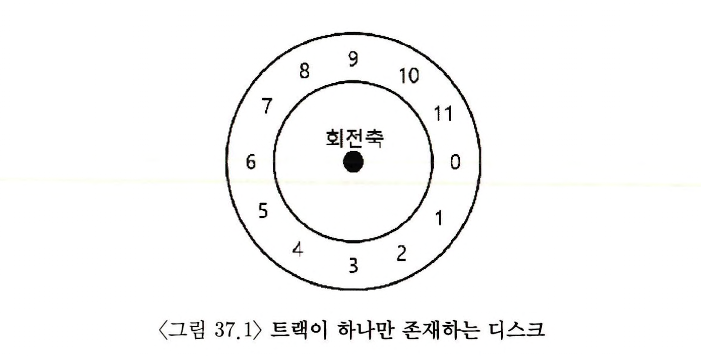
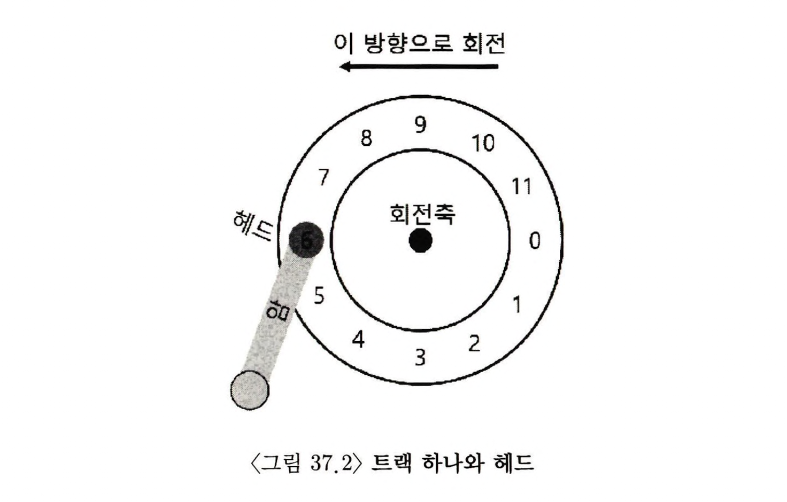
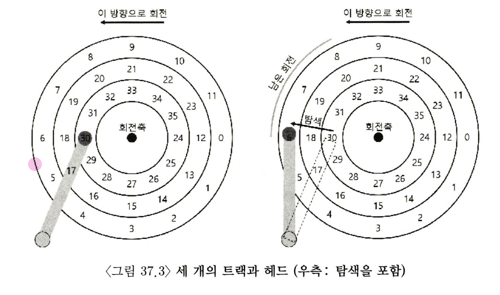
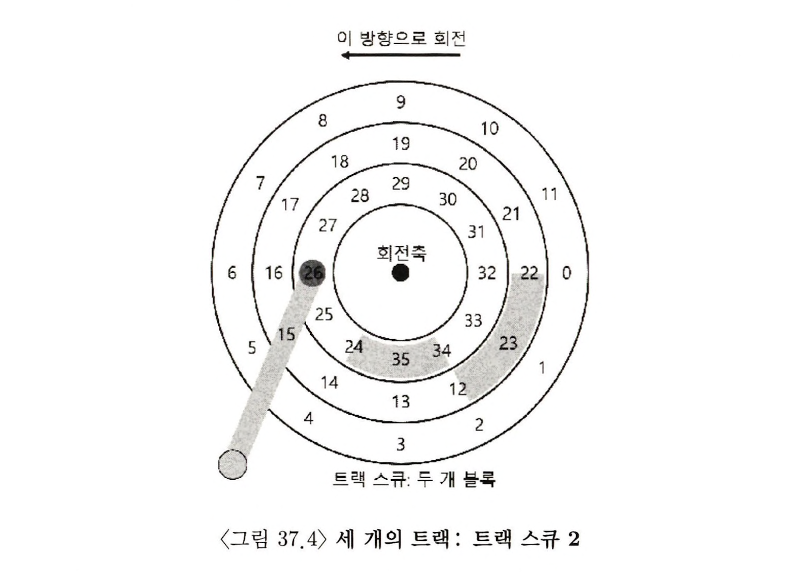
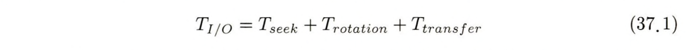
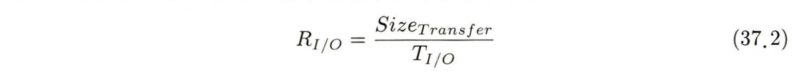
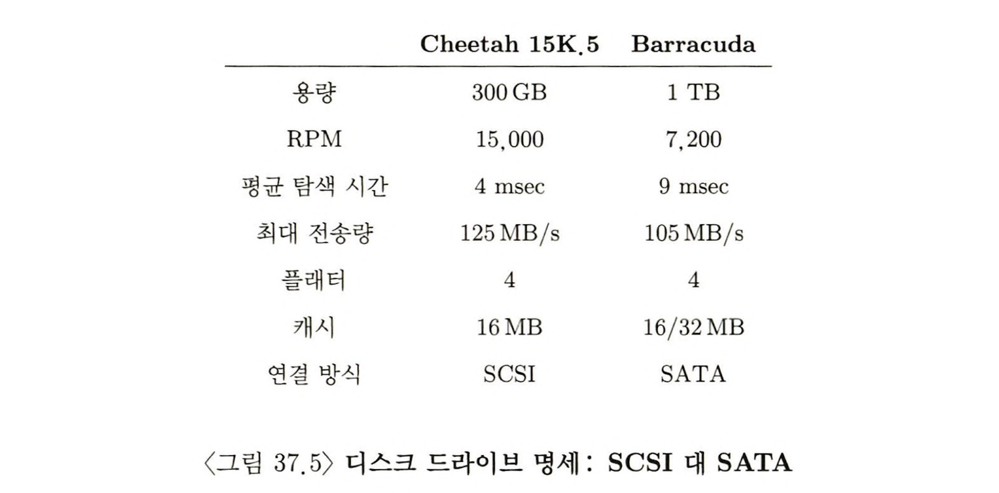
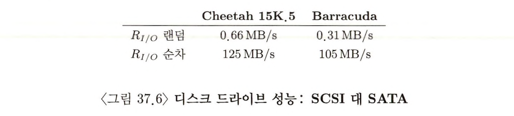
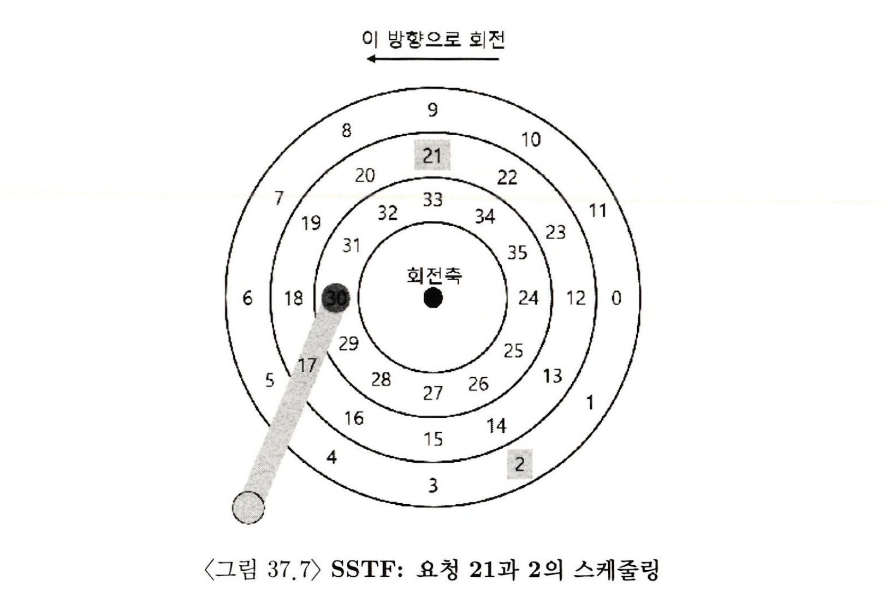
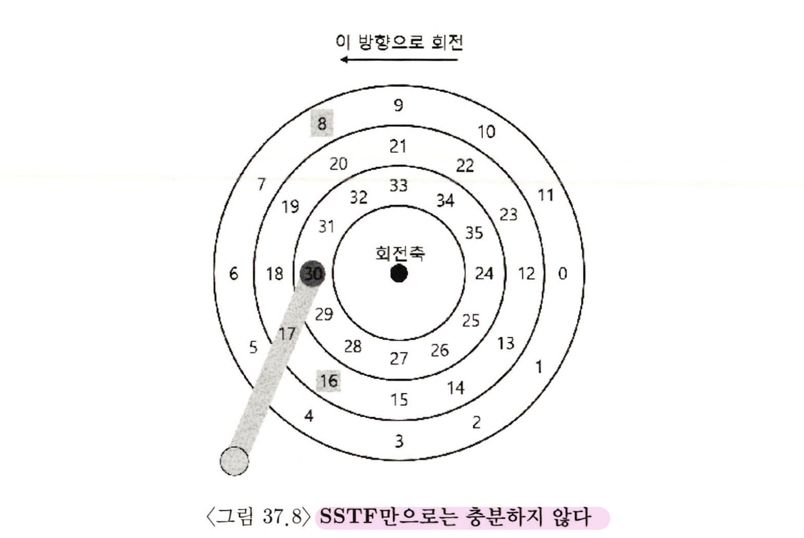

> 본 내용은 OSTEP 의 내용을 정리 및 요약한 내용입니다.
> 전문은 [이 곳](https://pages.cs.wisc.edu/~remzi/OSTEP/)을 방문하시면 보실 수 있습니다.

# 37 하드 디스크 드라이브 

이전 장에서 입출력 장치에 대한 전반적인 개념을 다루었고, 운영체제가 I/O 장치라는 괴물과 어떻게 상호작용하는지 살펴보았다. 이제는 특정 장치에 대해 더 살펴 볼 것이다. 하드디스크 드라이브는 지속적으로 컴퓨터 시스템의 영구적인 데이터 저장소였으며, 영속성 핵심 주제인 파일 시스템도  결국 하드 디스크 드라이브의 동작에 기반을 두고 개발되었다. 따라서 디스크를 관리하는 파일 시스템 소프트웨어를 구현하기 전에 디스크의 상세한 동작을 이헤하는 것이 중요하다.

<div style=“margin:10px;”>
<h3 style="display:inline-box; background-color:#666; padding:10px 10px 5px 10px; border-radius:10px 10px 0 0; margin: 0px; color:white;">🚩 핵심 질문: 디스크에 있는 데이터를 어떻게 저장하고 접근하는가?</h3>
<div style="display:box; background-color:#808080; margin: 0px; padding: 10px; color:black; border-radius: 0 0 10px 10px; color:white">현대 하드 디스크 드라이브는 어떻게 데이터를 저장하는가? 인터페이스는 무엇인가? 데이터는 실제로 어떻게 배치되고 접근되는가? 디스크 스케줄링은 어떻게 성능을 개선시킬 수 있는가?
</div>
</div>

## 37.1 인터페이스 

현대의 하드 디스크 드라이브의 인터페이스는 단순하다. 읽고 쓸 수 있는 매우 많은 수의 섹터(512byte 블럭)들로 이루어져 있다. 디스크 위의 n개의 섹터들은 0부터 n-1까지의 이름이 붙어 있다. 그렇기에 디스크를 섹터들의 배열로 볼 수 있으며, 0부터 n -1 까지를 드라이브의 **주소 공간**이 된다.. 

멀티 섹터 작업도 가능하다. 사실 많은 파일 시스템들이 한번에 4KB(또는 그 이상)를 읽거나 쓴다. 하지만 드라이브 제조사는 하나의 512byte 쓰기만 **원자성**을 보장한다. 따라서 전력 손실이 발생한다면 대량의 쓰기 중에 일부 만 완료될 수 있고, 이런 현상을 보통 **찢어 쓰기(torn write)** 라고 부른다. 

여기서 디스크 드라이브의 특성상 인터페이스 적으로 직접적으로 명시되어 있지는 않지만, 계약 불문율이라고 부르는 부분이 있다. 이는 구체적으로 드라이브의 주소 공간에서 가깝게 배치된 두 블럭에 접근하는 것이, 멀리 떨어진 블럭을 접근하는 것보다 빠르다고 가정한다. 더불어 연속적인 청크 블럭을 접근하는(순차 읽기 또는 쓰기) 것이 가장 빠르고 랜덤 접근 패턴은 느리다고 가정한다,. 

## 37.2 기본 구조 

- 플래터(platter) : 자기적 성질을 가지고, 이를 변형시켜 데이터를 지속시킨다. 디스크는 하나나 혹은 그 이상의 플래터를 갖고 있으며, 각 플래터의 표면이 데이터를 저장하는 역할을 한다. 대체적으로 단단한 물질로 만들어지며, 얇은 자성층이 입혀져 있다. 
- 회전축(spindle) : 플래터들을 회전시키기 위한 축으로, 모터와 연결되어 돌아간다. 
- 분당 회전수(rotation per minute, RPM) : 회전축에서 모터를 기준으로 분당 회전수 이며, 일반적인 값은 7200RPM, 15,000 RPM 사이 값 정도이다. 단, 우리가 관심을 가질 것은 한 바퀴 회전 시 걸리는 시간으로 10,000RPM의 속도로 드라이브가 회전할 때 한 바퀴 회전하는데 걸리는 시간은 6ms 이다. 
- 트랙(track) : 각 표면에 동심원을 따라 배치되는 섹터들이 존재하며, 이 동심원 하나를 트랙이라고 부른다. 
- 디스크 헤드(disk head) : 읽기와 쓰기 동작을 하는 주 역할으 하는 헤드이며, 플래터 각 표면마다 이러한 헤드가 존재한다.
- 디스크 암(disk arm) : 헤드를 지탱하며, 헤드가 원하는 트랙위에 위치하도록 이동 시킬 수 있다. 

## 37.3 간단한 디스크 드라이브 

디스크 드라이브 동작을 이해하기 위한 모형을 만들어볼 것이다. 
단일한 트랙을 가진 하드 디스크로, 12개의 섹터가 존재하며, 각 섹터는 512byte의 영역을 가진다. 주소 영역은 0부터 11까지 이루어져 있다. 


### 단일 트랙 지연 시간 : 회전 지연 
디스크 상에서 0번 주소의 값을 읽어야 한다고 하면, 어떻게 이를 처리할까? 우선 이런 경우 디스크 헤드는 아래에 원하는 섹터가 위치하기를 기다리면 된다. 그런데 여기서 알 수 있듯 트랙의 0번은 플래터가 회전을 해야 얻을 수 있다ㅏ. 즉, 여기서 알 수 있듯 현대 드라이브에서도 흔하게 발생하는 I/O 서비스 시간에서의 지연이 발생한다. 

이러한 지연을 곧 **회전형 지연(rotational delay)** 라고 부르며, 때론 **회전 지연(rotation delay)** 라고도 한다. 회전 지연의 값이 R이라고 한다면, 0에 위치하기 위해서는 R/2가 필요하다. 여기서 핵심은 트랙이 하나 있을 때의 최악의 경우는 헤드가 섹터 5번에 있을 때가 될 것이다. 

### 멀티 트랙 : 트랙 탐색 시간


현대의 하드 디스크는 당연히 수백만개의 트랙을 가지고 있으며, 심지어 수개의 플래터를 하나의 드라이브 내에 가지고 있다. 위의 이미지만 보더라도 멀티 트랙이 있는데 이걸 통해 알 수 있는 것은 , 여기서 헤드는 다양한 섹터에 대해 **탐색(seek)** 의 과정을 필요로 한다는 점이다. 회전과 더불어 탐색은 가장 비싼 디스크 동작 중 하나이다. 

탐색은 여러 단계로 되어 있다. 우선 가속 단계를 거쳐, 디스크 암이 최고 속도로 움직이는 활주 단계를 지나, 디스크 암의 속도가 줄어드는 감속 단계 이후 안정화 단계에서 정확히 트랙위에 해드가 위치한다. 이 과정에서 특히나 **안정화 시간(settiling time)** 은 매우 중요하며 0.5 에서 2ms 정도로 오래 걸린다. 

그렇게 트랙 위에서 원하는 섹터를 디스크 헤드가 지나게 되면 I/O 의 마지막 단계인 전송이 이루어지면서, 표면 위의 데이터를 읽거나 쓰게 된다. 

### 그 외의 세부 사항 

간단하게 나마 하드 드라이브 동작에 대한 몇 가지 흥미로운 내용을 보겠다. 많은 드라이브는 **트랙 비틀림(track skew)** 이라는 불리는 기술을 채용하고, 트랙의 경계를 지나서 순차적 존재하는 섹터들을 올바르게 읽을 수 있게 한다. 



한 트랙에서 다른 트랙으로 전환하는 경우에, 바로 인접한 트랙으로 전환되는 경우에도 디스크의 헤드를 다시 위치시키기 위해 시간이 필요하다. 이와 같은 비틀림이 없다면 헤드가 다음 트랙으로 넘어갔을 때 다음 읽어야 하는 블럭이 이미 헤드를 지나쳤을 수도 있기 때문에 다음 블럭을 접근하기 위해 거의 한바퀴에 해당하는 회전 지연을 감수해야 한다. 

또 바깥측에 공간이 더 많다는 구조적인 이유 때문에, 바깥 측 트랙들에는 안쪽 트랙들보다 더 많은 섹터들이 있다. 이러한 트랙들에 대해 흔히 멀티 구역(multi-zoned) 디스크 드라이브라고 부른다. 각 구역 내의 트랙은 같은 수의 섹터 들을 포함하고 있으며 바깥 측 구역의 트랙에는 안쪽 구역의 트랙보다 많은 수의 트랙을 갖고 있다. 

마지막 부분으로 현대의 하드 디스크 드라이버조차 중요한 요소로 캐시(cache), **트랙 버퍼(track buffer)** 부분이다. 이 캐시는 일반적으로 8, 16MB 정도의 작은 크기의 메모리로, 드라이브가 디스크에서 읽거나 쓴 데이터를 보관하는데 사용하고, 캐시를 통해 같은 섹터에 대한 이후의 요청에 빠르게 응답이 가능해진다. 

쓰기 요청의 완료 보고의 경우 드라이브의 선택지는 두개가 있다. 메모리에 데이터가 기록된 시점에 쓰기가 완료되었다고 할 지, 디스크에 실제로 기록 되었을 때 완료가 되었다고 할지를 정할 수 있다. 전자는 **write-back caching**(또는 즉시 보고(immediate reporting)) 라고 부르며, 후자는 **write-through** 라고 부른다. 전자는 빨라 보이지만, 위험할 수 있다. 파일 시스템이나 응용프로그램이 정확함을 위해 특정 순서로 디스크에 기록해야 된다고 한다면, write-back 캐싱 방식은 문제를 일으킨다(파일 시스템 저널링 파트 확인)

## 37.4 I/O 시간 계산

추상화된 디스크 모델을 만들었으니, 분석을 통해 디스크 성능을 구하는 방법을 알아본다. 

우선 세개의 항을 통해 I/O 시간을 나타낼 수 있다. 


위에는 입출력 시간을 나타내는 것이며, 드라이브 간의 비교를 쉽게하기 위해 주로 사용되는 입출력 속도(rate, R i/o)는 시간을 사용한 위의 식이다(37.2) 

여기서 입출력 시간에 대한 이해를 위해 두 가지 상황을 가정해보자. 하나는 랜덤 워크로드, 하나는 순차 워크로드이다. 랜덤 워크 로드는 디스크에서 섹터 만큼을 읽는 요청을 발생하며, 랜덤 워크로드의 경우 DB 등의 관리 시스템과 같은 응용 프로그램에서 흔하게 사용된다. 순차 워크로드는 일렬로 나열된 데이터들에 대한, 헤드 이동 없이 디스크를 읽는 행위이다. 

랜덤과 순차 워크로드의 성능차이를 이해하기 위해선 먼저 디스크 드라이브에 대한 몇가지 가정을 해야 한다. 

하나는 고성능 드라이브 시장으로 가능한 빠르게 회전하도록 설계되어 낮은 탐색 시간, 빠른 데이터 전송 속도를 갇고 있다. 

두 번째는 용량 위주의 시장으로 바이트 당 가격이 가장 중요한 측면이며, 속도는 낮지만 주어진 공간에 가능한 많은 비트를 저장하는 역할을 한다. 대표적인 제품군을 통해 성능과 특성을 분석해본다. 




이 예시를 통해 알 수 있는 몇가지  주요한 사실은 다음과 같다. 첫 번째로 랜덤 워크로드와 순차 워크로드의 드라이브 간 성능 차이가 크다는 것이다. 

두번째는 다소 미묘한데, 성능 위주의 드라이브와 용량 위주의 드라이브 간의 성능 차이가 상당히 크다는 점이다. 

## 37.5 디스크 스케줄링 

입출력 비용이 상당한 만큼, 당연히 운영체제가 디스크에게 요청되는 입출력 순서를 결정하는데 중요한 역할을 담당해 왔다. 입출력 요청에 대해 디스크 스케줄러는 요청을 조사하고, 다음 입출력에서 어떤 입출력을 먼저 처리할지를 결정한다. 

### SSTF: 최단 탐색 시간 우선 

**최단 탐색 시간 우선(Shortest-seek-time-first, SSTF)** 이라는 스케줄러는 트랙을 기준으로 입출력 요청 큐를 정렬하여 가장 가까운 트랙의 요청이 우선 처리되도록 한다. 



SSTF는 중간의 트랙으로 탐색했다가 바깥 측 트랙을 탐색하기 때문에 잘 동작한다. 하지만 그렇다고 완벽하지 않다. 우선 드라이브의 구조는 호스트 운영체제에게 공개되어 있지 않으며 운영체제는 그저 블럭들의 배열로만 인식한다. 이를 대신해서 **가장 가까운 블럭 우선(Nearest-block-first, NBF)** 방식도 존재한다. 이 방식은 가장 가까운 블럭의 주소를 접근하도록 요청하는 방식이다. 

하지만 이러한 특성은 **기아 현상(starvation)** 이라는 것을 불러온다. 예를 들어 현재 헤드 위치가 안쪽이고, 지속적으로 안쪽 트랙에 대한 요청만 발생된다면, 중간에 바깥쪽 트랙 요청이 들어온다. 만약 순서한 SSTF 방식이라면 바깥쪽 트랙의 요청은 지속적으로 무시 될 것이다. 

### 엘리베이터(SCAN 또는 C-SCAN)

위에서 발생한 현상들을 회피하면서 적절한 처리를 할 수 있는 방법으로 최초에는 **SCAN** 이라는 알고리즘이 등장하게 된다. 디스크를 한번 가로지르는 것을 스윕(sweep)라고 부르며, 스위프에 이미 지나간 트랙이 들어오면, 이는 다음번 반대 방향으로의 스위프에 처리되도록 대기 된다. 

이러한 방식에서 변종이 등장하는데 스위프를 하는 동안 큐를 동결시키는 F-SCAN 이라는 방법도 있으며 해당 방법은 디스크의 스위프 동안 새로운 요청은 서비스 큐에 삽입한다. 이와 같이 현재 요청과 가까이 있지만 늦게 도착한 요청들의 처리를 지연시켜 멀리 떨어져 있는 요청에 대한 기아 현상을 없앤다. 

C-SCAN 이라는 변종은 Circular SCAN의 약자로, 디스크를 양방향으로 스윕하는 대신, 알고리즘은 밖에서 안으로만 스위프트를 하고, 스위프를 한 번 진행하면, 다시 밖으로 돌아감으로써 동작의 밖과 안쪽 트랙에 대한 요청이 좀더 공정하게 처리되도록 만든다. 

결론적으로 SCAN이 꼭 완벽한, 최고의 스케줄링은 아니다. 이유는 SCAN 방식, 또는 SSTF 방식은 SJF 의 원칙을 지키는거에 최대 우선순위를 두진 않기 때문이다. 그렇다면 어떻게 고려해야 SJF를 가장 근접하게 모방하는게 가능할 것인가?

### SPTF: 최단 위치 잡기 우선 



이 상황에 대한 해법으로 최단 위치 잡기 우선(shortest positioning time first) 또는 SPTF 스케줄링(때론 최단 접근 시간 우선(shortest access time first))이 존재한다. 

여기서 상황에 의존적인 이유는 탐색에 걸리는 시간, 회전에 걸리는 시간이 다르기 때문에 능동적으로 조건을 탐색한다. 우선 탐색이 회전보다 훨씬 빠르다면, 더 먼 탐색을 통해 바깥 트랙에 있는 8번 요청을 처리하기 보단 16후 처리하는게 낫다.

현대 드라이브들은 앞서 본 것과 같이 탐색과 회전이 거의 비슷하고, 따라서 SPTF가 유용하고 성능을 개선시킬 수 있다. 하지만 트랙의 경계가 어디인지, 현재 디스크 헤드가 어디 있는지를 정확히 알수 없으므로 이러한 부분을 운영체제에서 구현하는 것은 쉽지 않다. 따라서 이러한 로직은 드라이브 내부에서 실행된다. 

### 다른 스케줄링 쟁점들 

주된 쟁점을 제외하고, 다른 쟁점들을 살펴보면 다음과 같다. 디스크 스케줄링은 현대 시스템에서 어느 부분이 담당해야 할까? 예전 시스템의 경우 OS가 이를 모두 결정했다. 

하지만 현대에서는 디스크는 대기중인 여러 개의 요청들을 수용할 수 있으며 복잡한 내부 스케줄러를 자체적으로 갖고 있고, 내부 다양한 센서와 부붚들의 발달로 내부에서 헤드의 정확한 위치도 알 수 있다. 따라서 내부에서 SPTF방식을 정밀하게 구현하는 것도 가능하다. 

I/O 병합이라는 소재도 있는데, 이는 요청들이 들어올 때, 위치가 연결되는 경우, 연속 적인 작업이니 이를 병합하여 두 블럭 길이의 요청으로 만들고, 스케줄러는 이를 재배치 한다. 디스크로 내려 보내는 요청의 개수를 줄이기에, 오버헤드를 줄일 수 있어, 특히나 현대 OS에서 병합은 중요시 되고 있다. 

마지막 쟁점으로는 디스크로 입출력을 내려보내기 전 시스템의 대기는 얼마나 기다려해야 하는가? 에 대한 논의도 있다. 유휴 상태가 되지 않도록 하는 작업 보전(work-conserving) 방식이 있고, 예측 디스크 스케줄링(anticipatory disk scheduling) 연구에 따르면 때론 잠시 기다렸다 처리하는 것도 좋다고 하며 이를 작업 비보전(non-work-conserving) 방식이라고 부른다. 그러나 막상 얼마나 요청이 기다려야 하는지에 대해선 상당히 까다로운 문제가 아닐 수 없다. 

## 37.6 요약

(내용 생략)

```toc

```
