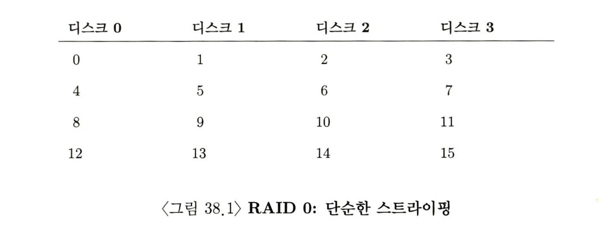
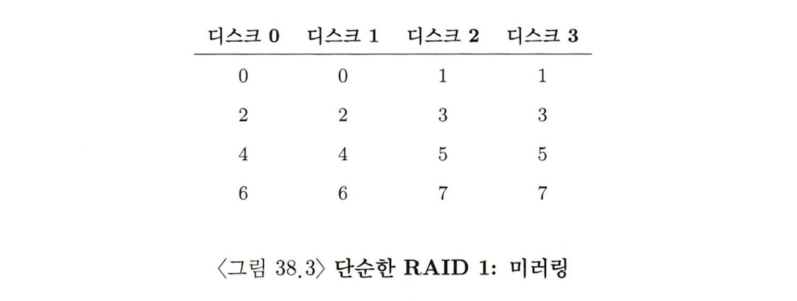
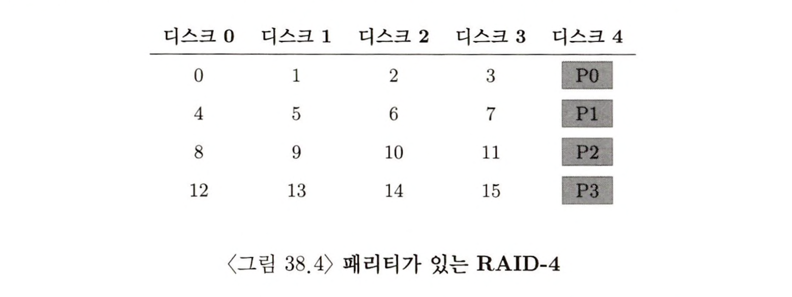
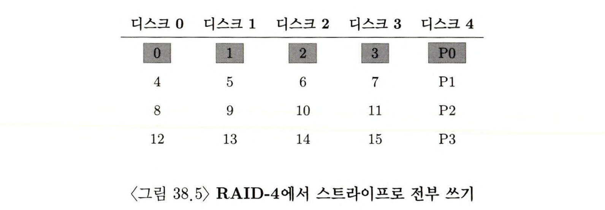
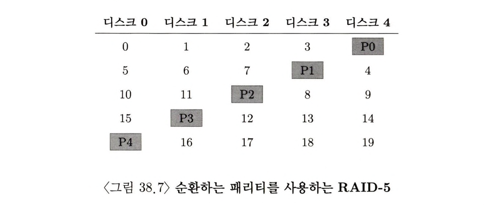
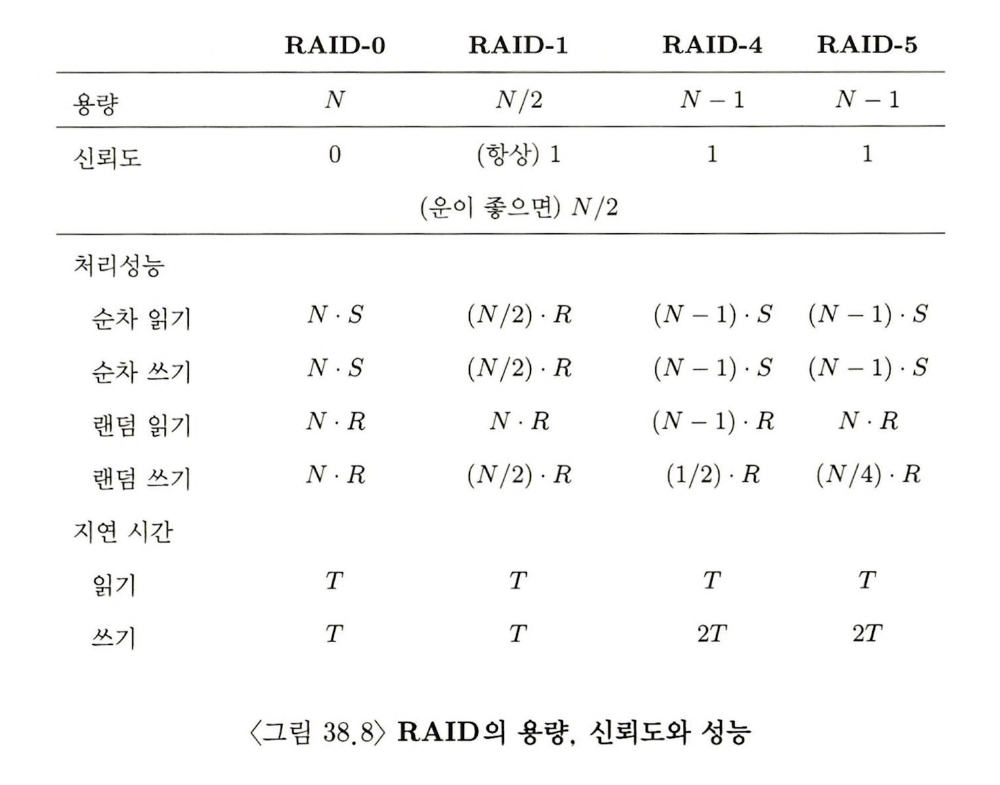

> 본 내용은 OSTEP 의 내용을 정리 및 요약한 내용입니다.
> 전문은 [이 곳](https://pages.cs.wisc.edu/~remzi/OSTEP/)을 방문하시면 보실 수 있습니다.

# 38 Redundant Array of Inexpensive Disk(RAID)

디스크를 사용할 때 디스크가 좀더 빨랐으면 하는 바램이 있다. 입출력 작업은 항상 시스템 전체의 병목이 되기 때문이다. 용량도 마찬가지며, 안정성도 마찬가지로 필요하다. 디스크가 고장이 나는 경우 백업 없이는 소중한 데이터를 잃어 버리기 때문이다. 

<div style=“margin:10px;”>
<h3 style="display:inline-box; background-color:#666; padding:10px 10px 5px 10px; border-radius:10px 10px 0 0; margin: 0px; color:white;">🚩 핵심 질문: 대용량이면서 빠르고 신뢰할 수 있는 디스크를 어떻게 만들까?</h3>
<div style="display:box; background-color:#808080; margin: 0px; padding: 10px; color:black; border-radius: 0 0 10px 10px; color:white">어떻게 하면 대용량, 고속, 신뢰 가능한 저장 시스템을 만들수 있을까? 
</div>
</div>

이번 장은 Redundant Array of Inexpensive Disk 또는 RAID 라고 알려진 기술을 보고자 한다. 

외면적으로 RAID는 하나의 디스크처럼 보인다. 읽거나 쓸수 있는 블럭의 그룹으로 보인다. 그러나 안을 들여다 보면 RAID는 여러 개의 디스크와 메모리(휘발성과 비휘발성을 모두 포함), 시스템을 관리하기 위한 하나 또는 그 이상의 프로세서로 이루어진 복잡한 기계이다. RAID의 하드웨어는 컴퓨터 시스템과 매우 유사하며, 디스크의 그룹 관리를 위한 전용 시스템으로 구축된다. 

RAID를 하는 이유는 단일 디스크 보다 여러 장점을 제공하기 때문이다. 하나의 장점은 성능이며, 또 다른 장점은 용량이다. 그리고 마지막으로 신뢰성을 높일수 있다. 

디스크 여러개의 병렬적 연결은 I/O 시간을 개선시키는 역할을 하며, 물리적 용량을 늘리고, 데이터를 여러 디스크에 분산 저장하면 **데이터 중복(redundancy)** 을 사용함으로써 디스크 한 개의 고장은 복구할 수 있다. 

이런 상황에서 RAID는 시스템에게 이러한 장점들을 투명하게 제공한다. 호스트 시스템 입장에선 어떤 특징적인 것이 나타나지 않으며, 호스트 입장에선 그저 거대한 디스크 1개로 인식한다는 점이다. 물론 투명성이 가지는 아름다움은 한줄의 소프트웨어 변경 없이 디스크를 RAID 로 바꿀 수 있다는 것이다. 운영체제와, 클라이언트의 응용 프로그램은 변경 없이 사용이 가능하며, 이러한 투명성이 곧 RAID의 확산력(deployability)를 개선시켰다. 

<div style=“margin:10px;”>
<h3 style="display:inline-box; background-color:#666; padding:10px 10px 5px 10px; border-radius:10px 10px 0 0; margin: 0px; color:white;">☝🏻 여담: 투명하기 때문에 장비를 설치할 수 있다.</h3>
<div style="display:box; background-color:#808080; margin: 0px; padding: 10px; color:black; border-radius: 0 0 10px 10px; color:white">시스템에 새로운 기능을 추가하려고 한다면 <big>투명하게(transparently)</big> 적용 가능한지, 즉 시스템의 나머지 부분을 수정하지 않고 추가될 수 있는지를 항상 고려해야 한다. 
</div>
</div>

## 38.1 인터페이스와  RAID의 내부 

파일 시스템이 RAID에 논리적 입출력을 요청시, RAID는 내부에서 어떤 디스크를 접근해야 요청을 완료할 수 있는지 계산하고, 하나나 그 이상의 물리적 I/O 요청을 발생시킨다. 이 물리적 I/O는 RAID 의 레벨에 따라 다르다. 

RAID 시스템 자체를 먼저 보면, 보통 별도의 하드웨어 박스 형태로 되어 있다. 호스트와 SCSI, 또는 SATA와 같은 표준 인터페이스로 연결되며, 시스템 내부를 볼 때 복잡하게 구성되어 있다. RAID 작업을 지시하고, 이를 위한 `펌웨어`를 실행하는 마이크로 컨트롤러, 그리고 블럭을 읽고 쓸 때 사용할 버퍼로 휘발성 메모리를 장착하고 있으며, 패리티 계산등을 위한 전용 논리회로도 갖고 있다. 상위 관점에서봐도 RAID 는 일종의 특수 목적의 컴퓨터 시스템에 가까우며, 차이가 있다면 응용프로그램을 실행하는 것 대신, RAID 구현을 위한 목적으로 동작하는 전용 소프트웨어를 실행한다는 점이다. 

## 38.2 결함 모델 

RAID를 이해하고 다른 접근법들과 비교하기 위해선, `결함 모델(fault model)`이 있어야 한다. RAID 는 특정 종류의 결함을 파악하고 이를 복구하도록 설계되어 있다. 그러므로 설계 시 어떤 종류의 결함에 대비하려고 했는가를 이해하는 것은 RAID의 근본 목적을 파악하고 이해하는데 핵심이라고 볼 수 있다. 

첫 번째 결함 모델은 `고장 시 멈춤(fail-stop)` 결함 모델이다. 이 모델은 디스크가 정상 작동이나 멈춤 둘 중 하나가 될 수 있다. 동작 중인 디스크에는 모든 블럭의 입력과 쓰기가 가능하고, 멈춤이 되면 반대로 완전히 사용 불가능을 간주한다. 이 모델은치명적인 상황에 들어간 상태에 대한 가정이다. 

일단, 그 이외에 다른 **조용한** 고장에 대해서는 고려하지 않는다. 디스크에서 한 블럭만 접근 불가능한 고장도 있으니, 이 역시 고려하지 않는다(잠재된 섹터 에러). 이러한 복잡한 디스크 결함은 차후 다룬다. 

## 38.3 RAID의 평가 방법 

RAID 에 대해 평가, 장단점을 이해하기 위해서는 3가지 기준을 알고 있으면 된다. 
- 용량 : 각각이 B 개의 블럭을 가지는 N개의 디스크가 주어지면, RAID 클라이언트가 사용할 수 있는 유효 용량은 얼마나 될까? 중복 저장이 없는 경우라면 당연히 `N * B`를 가진다. 이때 각 블럭에 대해 두개의 복사본을 가지는 경우라면 `(N * B)/ 2` 가 될 것이다. 다른 기법의 경우 그 중간 어딘가인 만큼, 그 사이 값을 유효값을 가지게 된다. 
- 신뢰성 : 두 번째 평가의 축으로 평가 대상의 설계 방법은 몇 개의 디스크 결함을 감내할 수 있는가? 우리의 결함 모델에 대한 전제에 따르면 하나의 디스크만 고장 낼 수 있다고 가정한다. 이후의 데이터 무결성을 다룬 장에서 더 자세히 보게 될 것이다. 
- 성능 : 성능은 디스크 배열이 처리할 워크로드에 따라 연산 작업량의 격차가 만만치 않게 크다. 그러므로 성능을 평가하기 이전에 고려할 일반적인 워크로드를 제시 할 것이다. 

결론적으로 RAID 설계의 세 포인트를 중심으로 RAID 레벨 0 ~ 5까지를 분석해볼 것이다. 

## 38.4 RAID 레벨 0 : 스트라이핑 

첫 번째 RAID 레벨은 사실 중복 저장을 하지 않으므로, RAID 레벨이라고 칭하기 어렵다. 하지만 해당 경우 **스트라이핑(striping)** 이라고 더 잘 알려진 방식으로, 이 방식이 가진 성능과 용량의 이점덕분에 RAID 안에서 고려될만한 대상으로 취급 당한다. 



그림 38.1 을 보면, 기본 개념이 보일 것이다. 디스크 배열의 블럭들을 라운드 로빈(Round Robin) 방식으로 디스크를 가로질러 펼치는 방식이다. 이 접근 법은 배열의 연속적인 청크에 대해 요청 받을 때, 병렬성을 가장 잘 활용한 설계 방식이다. 여기서 같은 행에 있는 블럭들을 모아 **스트라이프(stripe)** 라고 부른다. 

위의 예제나 설명에서는 블럭 하나 씩으로 나열하는 경우를 이야기 하지만, 실제론 더 큰 청크 크기로 스트라이핑 하는 경우도 있을 수 있다. 

<div style=“margin:10px;”>
<h3 style="display:inline-box; background-color:#666; padding:10px 10px 5px 10px; border-radius:10px 10px 0 0; margin: 0px; color:white;">☝🏻 여담: RAID 디스크의 단위는 '블록'이다</h3>
<div style="display:box; background-color:#808080; margin: 0px; padding: 10px; color:black; border-radius: 0 0 10px 10px; color:white">RAID 시스템을 구성하게 되면, 이는 여러 디스크에 걸쳐서 데이터가 저장되므로 이를 위한 구성의 최소단위는 '블록'이 된다. 이 말은 각 디스크의 청크는 블록의 일부일 수도 있고, 그렇기에 이 디스크들을 가로지르는 청크들이 합쳐져서 하나의 블록으로 인식되는 것이며, 이런 블록이 논리적 주소를 갖게 되는 것이다.<br>
그러나 각 디스크에서 청크 크기가 다른 경우 블록의 일부가 여러 청크에 걸쳐 저장될 수 있다. 이때는 청크를 합쳐서 하나의 블록처럼 처리를 한다. 따라서 주소 A, 논리적 주소에서 실제 데이터 위치를 구한다는 것은 디스크 전체의 각 오프셋을 계산하여 위치를 계산해서 각 디스크별 특정 위치의 청크들을 다 구해야 하는 것이다. 
</div>
</div>
<br>
<div style=“margin:10px;”>
<h3 style="display:inline-box; background-color:#666; padding:10px 10px 5px 10px; border-radius:10px 10px 0 0; margin: 0px; color:white;">☝🏻 여담: RAID 매핑은?</h3>
<div style="display:box; background-color:#808080; margin: 0px; padding: 10px; color:black; border-radius: 0 0 10px 10px; color:white">RAID의 용량이나 신뢰성, 성능의 특성에 앞서 생각해보면 기존의 주 메모리가 그러하듯 매핑 문제에 대해서도 논할 거리가 있다. 모든 RAID 배열에서 일어나는 문제로, 과연 논리 블럭에 대한 읽기 쓰기를 할 때 RAID는 어떻게 해당 물리 디스크와 오프셋을 알아서 정확하게 그 위치 접근을 할까? <br>
사실 그렇게 어려운 문제는 아니다. 논리적 주소 A가 존재하고, 해당 존재의 위치를 계산하는 방법은 다음처럼 하면 된다.<br>
<br>
Disk = A % number_of_disks<br>
Offseet = A / number_of_disks
<br><br>
이 계산은 몫과 나머지를 구하는 정수 연산으로 예를 들어, 14 위치에 대해 디스크가 4개라고 한다면, 14 % 4 = 2가 디스크 위치를 가리키는 값을 구하게 되며, 14 / 4 = 3으로 계산되어, 3번째 블럭이 곧 14를 가리키고 있다는 것을 알 수 있다. 그러므로 블럭 14번은 0을 시작으로 3번째 디스크(2번)의 4번째 블럭 (0에서 시작하니까)으로 계산될 수 있다. <br>
여기서 청크 크기가 바뀔 땐 어떻게 하면 될까? 
</div>
</div>
<br>
<div style=“margin:10px;”>
<h3 style="display:inline-box; background-color:#666; padding:10px 10px 5px 10px; border-radius:10px 10px 0 0; margin: 0px; color:white;">☝🏻 여담: 블록 단위가 다른 RAID 매핑은?</h3>
<div style="display:box; background-color:#808080; margin: 0px; padding: 10px; color:black; border-radius: 0 0 10px 10px; color:white">이러한 경우에는 추가적 계산하는 단계를 넣어서 주소값을 도출해 낼 수 있다. 우선 청크 크기가 다르다면, 이중 가장 작은 디스크를 기준으로 블록을 모두 매핑한다. 이 디스크를 "base disk"라고 부르며, 이제 다른 디스크에서 청크 크기를 고려하여 블록을 매핑한다. <br><br>
각 디스크의 청크 크기는 계산해야 하는데, 청크의 크기는 디스크 전체 크기를 청크의 수로 나눈 겂그로 나타낼 수 있다. 예를 들어 청크 크기가 64KB이고, 디스크 전체 크기가 1GB라면 디스크는 16개의 청크로 구성되었다고 볼수 있다. <br><br>
이제 논리 주소A를 실제 디스크에 매핑을 한다고 하면, base disk의 블록 크기로 나누어 블록 번호를 계산하고, 이 블록이 포함된 청크의 번호를 계산한다. 이 청크 번호를 각 디스크의 청크 수로 나눈 나머지를 사용하여 각 디스크에서 블록의 오프셋을 계산할 수 있다. 그렇게 한 뒤 마지막으로 블록의 오프셋과 디스크 번호를 사용해 블록을 실제 디스크와 매핑하는 것이 가능하다.<br> <br>
예를 들어, 블록 크기가 16KB 인 디스크 1, 2, 3, 그리고 청크 크기가 32KB인 디스크 4까지 있다는 가정하에 주소 A = 100KB를 찾는 예시를 들어보자. <br><br>
우선, 이런 경우 청크 크기가 가장 작은 디스크 기준으로 블록을 매핑한다. 따라서 이 경우 16KB가 되고, 주소 A를 16KB 로 나눈 값, 100 / 16 = 6이 된다. <br><br>
그 뒤, 각 디스크에서 블록 오프셋을 계산해야 한다. 청크 크기가 모두 16KB인 디스크에서 블록 오프셋은 각각 6 % 3 = 0, 6 % 3 = 0, 6 % 3 = 0이 되며 청크 크기가 32KB 인 디스크 4의 경우 블록 오프셋이 6 % 2 = 0이 된다. <br><br>
최종적으로 블록 번호가 6인 청크 0에서 블록 오프셋 0에 위치하게 되며, 이 블록은 디스크 1, 2, 3의 청크 0에서 각각 블록 오프셋 0에 위치하며, 디스크의 청크 0에서 블롯 오프셋 0에 위치하게 된다. 
</div>
</div>

### 청크 크기 

청크 크기는 RAID의 성능에 상당히 영향을 준다. 만약 작은 청크 크기를 가진다면, 이는 많은 파일들이 여러 디스크에 걸쳐 스트라이프가 된다는 것이며, 결과적으로 하나의 파일을 읽고 쓰는데 병렬성이 증가하게 된다. 하지만 블럭의 위치를 여러 디스크에서 찾아야 하므로 위치 탐색의 시간이 늘어나게 된다. 왜냐면 요청 처리 시간은 여러 디스크에 걸친 요청중 가장 오래 걸린 탐색 시간에 의해 결정되기 때문이다. 

반면 큰 청크를 만들게 되면 병렬성을 잃은 만큼 높은 처리 성능을 얻으려면 여러 요청을 병행하게 실행 해야 한다. 하지만 청크 자체가 크기 때문에 위치 탐색의 시간이 줄어들게 된다. 

결국 최적의 청크 크기를 정하는 것은 디스크 시스템이 처리할 워크로드에 대한 심도 있는 이해 속에서 결정된다. 대부분의 RAID에서는 큰 청크를 사용한다. 단, 앞으로 다룰 이야기에서 청크 크기자체는 문제가되지 않고, 청크의 크기도 한 블럭으로 가정하고 진행한다. 

### RAID-0 분석으로 돌아가서 

스트라이핑 방식의 용량, 신뢰성, 성능을 평가하면 다음과 같다. 
- 용량 : B개의 블럭을 갖는 N 개의 디스크, 스트라이핑은 `N * B` 개, 디스크의 용량 만큼 유효 용량을 갖는다. 
- 신뢰성 : 병렬로 되어있어 어느 디스크라도 고장나면 전체 데이터가 손실된다. 
- 성능 : 훌륭, 병렬로 사용자 I/O 요청을 처리할 수 있기 때문에 모든 디스크가 활용된다. 

### RAID 의 성능 평가하기 

RAID의 성능을 분석하기 위해선 두 가지 다른 성능 척도를 고려해야 한다. 하나는 단일 요청의 지연시간이다. 하나의 입출력 처리시 RAID의 지연시간에 대한 이해는 한번의 논리적 I/O 동작을 처리할 때 병렬성 정도를 파악하는데 도움이 된다. 

두 번째는 척도 RAID의 정상상태에서의 처리성능(throughput)이다. 병행 요청의 전체적인 대역폭을 말한다. 고성능을 요하는 환경에서 RAID가 주로 사용되기 때문에 안정(stable) 상태에서의 대역폭은 매우 중요하고, 분석의 주안점이다. 

처리 성능을 이해하기 위해선 워크로드에 순차와 랜덤 두가지 유형이 있다고가정하고 시작하면 좋다. 순차 워크로드는 연속되는 큰 청크의 형태로 요청된다. 예를 들어 1MB 데이터를 접근하는 요청이 블럭 x에서 시작하여 x+ 1MB에서 끝났다면 순차적이라고 본다. 

랜덤 워크로드는 크기가 작은 요청이며 또한 디스크의 여러 불특정 위치를 접근한다고 가정한다. 

실제 워크로드의 경우 랜덤과 순차가 뒤섞여 있기 때문에 특성이 어중간하게 나타나겠지만, 간단하게 그 특성을 고려하기 위해 일반화 시켜서 고려한다. 

어쨌든 순차와 랜덤 워크로드는 디스크로부터 큰 성능 차이를 만든다. 순차의 경우 디스크가 가장 효율적으로 동작한다. 탐색과 회전 지연이 짧아 대부분의 시간을 데이터 전송에 사용한다. 그러나 랜덤의 경우 대부분의 시간이 탐색과 회전을 기다리는데 사용되고, 상대적으로 적은 시간이 데이터 전송에 사용된다. 

이에 분석에서 그 차이를 나타내고자 순차 워크로드는 S MB/s, 랜덤 워크로드에서는 R MB/s의 속도로 전송한다고 가정한다. 그리고 일반적으로 S가 R보다 매우 크다라고 고려한다. 

그렇다면 간단하게 구체적으로 다음의 디스크 특성을 가진 디스크 상에서 S, R을 계산해본다. 

- 평균 탐색 시간 7msec
- 평균 회전 시간 3msec
- 디스크 전송 속도 50 MB/s 

S 를 계산하기 위해서 10MB 전송하는데 어떻게 시간이 사용되는지를 보면 다음과 같다. 

1. 탐색하는데 7msec를 사용하고, 회전하는데 3msec를 사용한다. 
2. 전송이 시작되면 10MB @ 50MB/s 는 5분의 1초 또는 200msec가 전송에 소요된다. 그렇다면 S는 다음과 같이 계산이 가능하다. 

S = 데이터 총 크기 / 접근 시간 = 10MB / 210 msec = 47.62MB/s 

R의 시간은 다음처럼 확인이 가능하다. 탐색과 회전 지연은 동일하다. 전송하는데 걸리는 시간은 다음과 같다. 10KB @ 50 MB/s 또는 0.195msec 가 걸린다. 

R = 데이터 총 크기 / 접근 시간 = 10KB / 10.195msec(7 + 3 + 0.195) = 0.981 MB/s 

결과적으로 R은 1MB 이하이며, S / R은 거의 50이라는 격차를 보여준다. 

### RAID-0 분석으로 또 다시 돌아가서 

이제 스트라이핑의 성능을 평가해보자. RAID 0은 지연시간 측면에서 한 블럭에 대한 요청의 지연시간은 하나의 디스크에 대한 요청의 지연시간과 거의 동일하다. 

정상 상태에서의 대역폭 측면에서 시스템 최대 대역폭을 기대할 수 있다. 그러므로 처리 성능은 N(디스크 수) 곱하기 S(디스크 하나의 순차 접근 대역폭)과 같다. 많은 랜덤 I/O의 경우도 모든 디스크를 다 사용할 수 있기 때문에 `N*R MB/s`를 얻게 된다. 

예를 들어 4개의 디스크에, 앞에서의 S를 넣어 대역폭을 계상하면 다음과 같다. 

전체 순차 읽기성능 = 4 x 47.62 MB/s = 190.48MB/s 
전체 랜덤 읽기성능 = 4 x 0.981 MB/s = 3.924MB/s 

## 38.5 RAID 레벨 1 : 미러링 

RAID 1은 미러링이라고도 알려져 있으며, 미러링을 사용하는 시스템에서는 각 블럭에 대해서 하나 이상의 사본을 둔다. 즉 미러링 시스템에서는 각 논리 블럭에 대해 두개의 물리적 사본을 두는 형식에 가깝다. 



위의 예제는 그런 점에서 디스크 0, 1이 동일한 값을 가지며, 디스크 2와 3이 동일한 값을 갖고 있다. 이렇게 미러링 된 쌍들에 대해서는 스트라이핑이 적용된다. 그리고 위에서는 미러링과 스트라이핑의 일반적인 조합 방법으로 RAID-10 또는 RAID 1+0이라고 불린다. RAID-01 또는 RAID0+1 배열방식도 존재한다. 

미러링 된 배열에서 블럭을 읽을 때 RAID 는 원본이나 사본, 어떤 것을 읽을지 선택할 수 있다. 

RAID는 신뢰성을 유지하기 위해 두벌의 데이터를 모두 갱신해야 하며, 쓰기 요청은 병렬적으로 처리될 수 와 있다는 사실을 유념해야 한다. 

### RAID-1 분석 

RAID-1은 용량 측면에서 상당한 비용이 많이 든다. 미러링 레벨이 2라면 최대 사용 가능한 용량은 용량의 반만 사용할 수 있기에 각 B개의 블럭을 가진 N개의 디스크 배열의 경우 유효 용량은 `(N * B)/2` 가 된다. 

반대로 신뢰성 측면에서는 RAID-1은 괜찮은 편이다. 디스크 중 어느 것이 고장나도 이는 감내할 수 있다. 기본적으로 한개의 디스크 고장은 확실히 감내할 수 있는 구성이며, 동시에 어떤 디스크가 고장나느냐에 따라선 N / 2개의 결함까지 감내할 수 있다. 따라서 일반적으로 현실에서는 대부분의 상황에서 처리 대응이 될 수 있다. 

성능적으로 분석하면 다음과 같다. 단일 읽기 요청에 지연시간은 단일 디스크에서 읽는 경우의 지연시간과 동일하다. 쓰기 요청의 경우에는 두 디스크에 전달되어서 모두 종료 되어야 한다. 이 두개의 쓰기는 병렬적으로 이루어지므로, 하나의 쓰기와 거의 비슷한 시간이 걸린다. 하지만 RAID-1 에 요청된 쓰기는 물리적으로 두개의 쓰기 연산이 종료될 때까지 대기해야 하므로, 지연시간은 두 개의 요청 중 최악의 탐색과 회전 지연시간에 의해 결정된다. 

순차 워크로드로 정상 상태의 처리 성능에 대한 분석해보면, 순차적 쓰기는 미러링 된 배열에 순차 쓰기의 경우 `N/2 * S` 또는 최대 대역폭의 절반의 대역폭을 얻을 수 있다. 동일하게 순차 읽기 상황에서도 동일한 성능수준을 보여준다. 

위에서 언급한 예시의 구조에서 생각해보자. 디스크 0번에서 요청을 받으면 블럭 0번에 대한 요청을 받는다. 그리고 두 블럭 떨어진 위치의 블럭 4에 대한 요청을 받는다. 사실 각 디스크는 하나씩 건너 뛴 블럭에 대한 요청을 받는다. 그러므로 각 디스크는 자신이 낼 수 있는 최대 대역폭의 반만 쓸 수 있고, 그래서 순차 읽기의 대역폭도 `(N/2 * S) MB/s` 가 된다. 

랜덤 읽기가 미러링 된 RAID 에서는 최고의 워크로드이다. 이 경우 모든 디스크에 읽기를 다 요청할 수 있기 때문에, 얻을 수 있는 최대의 대역폭을 얻을 수도 있다. 그러므로 랜덤 읽기의 경우 RAID-1은 `N * R MB/s`를 보인다. 랜덤 쓰기는 예상처럼 `N/2 * R MB/s` 를 갖는다. 

## 38.6 RAID 레벨 4 : 패리티를 이용한 공간 절약 

해당 RAID 에서는 알려진 중복성을 추가하는 다른 방법이 있다. 패리티 기반의 접근 방법은 저장공간을 더 적게 사용하면서도 미러링 기반 시스템이 지불하는 공간 낭비를 적게 사용하려는 시도였다. 대신 이러한 설정의 특성 상 성능을 지불하게 된다. 



위 예시는 디스크 5개로 이루어진 RAID-4 시스템을 나타낸다. 기본적으로 디스크 0~4까지는 스트라이프를 하고 있으며, 패리티 블럭이 디스크4에 위치하고 있다. 패리티를 계산하기 위해서 스트라이프에 속해 있는 블럭 중 하나의 블럭이 고장나더라도 견딜수 있게 하는 수학 함수가 필요하며, 간단하게는 **XOR** 연산을 활용할 수 있다. 


어떤 비트가 주어졌을 때 XOR은 1이 짝수개일 때는 0을 반환하며, 홀수 개인 경우 1을 반환한다. 이러한 형태로 어떤 줄이던 그 줄의 1의수는 패리티 비트를 포함해 항상 짝수가 되어야 하고, 이를 통해 RAID의 패리티가 정확하게 동작하기 위한 **불변량**이 되는 것이다. 

이를 통해 고장난 디스크로부터 데이터를 복구하는 과정을 예상해보자. 예를 들어 C2열이 깨졌다고 보면, 할 일은 단순하게 그 행의 모든 값(XOR의 결과로 얻은 패리티를 포함)을 읽은 후 올바른 값을 다시 계산하면 된다. 예를 들어 C2의 첫 줄은 C3, P를 포함해 1이 홀수 1개이므로 C2 자리에 1이 들어가야 함을 알 수 있으며, 두번째 줄의 경우 C1, P 1이 두개이므로 C2는 0이되어야 하는 것이다. 

그렇다면 각 디스크에 4KB의 블럭을 저장한다면 패리티를 계산하기 위해서 여러 개의 블럭들을 어떻게 XOR 해야 한다는 것인가? 이 경우 다음처럼 표현할 수 있다. 


각 블럭 별로 첫 자리의 비트, 뒷 자리의 비트를 따로 계산하여 패리티 비트를 구성해낼 수 있다. 이러한 방식을 활용한다면 4KB, 혹은 그 이상의 블럭도 RAID-4로 구성이 가능하다. 

### RAID-4 분석 

RAID-4를 살펴보면, 패리티 정보의 저장공간 1개를 제외하므로 `(N-1) * B` 의 저장공간을 제공한다. 

신뢰성 면에서도 RAID-4는 오직 하나의 디스크 고장에 대해선 견뎌낼 수 있다. 두 개 이상의 디스크 고장이 발생하면 읽어버린 데이터를 복원할 방법이 없다. 

성능면에서보면, 순차 읽기 성능의 경우 패리티 디스크를 제외하고 모든 디스크를 스트라이프 형태로 사용이 가능하다. 따라서 최대 유효 대역폭은 `(N - 1) * S MB/s` 가 된다. 

순차 쓰기 성능을 이해하려면 큰 청크의 데이터를 디스크에 쓰려고 할 때 RAID-4는 **스트라이프 전부 쓰기(full-stripe write)** 라고 하는 간단한 최적화 방법을 수행할 수 있다. 



이 경우 RAID는 P0의 새로운 값을 계산하기 위해 단순히 블럭 0, 1, 2, 3번을 XOR 하면 되고, 패리티 블럭을 포함한 모든 블럭을 다섯 개 디스크에 병렬적으로 쓴다. 이러한 방식을 이해했다면 순차 쓰기의 성능은 유효 대역폭이 순차 읽기와 동일한 `(N - 1) * S MB/s`  의 성능을 보여준다.  패리티 디스크가 지속적으로 사용되긴 하지만, 해당 내용은 클라이언트 입장에서 디스크의 성능의 이득을 얻을 수는 없다. 

이에 비해 랜덤 읽기 성능은 패기티 디스크에서는 읽지 못하므로, 유효 성능은 `(N - 1) * R MB/s` 가 된다. 

여기서 랜덤 쓰기는 가장 흥미로운 상황을 만들어 낸다. 예를 들어 위의 예시에서 보자.  블럭 1번 만을 갱신했다고 보자. 패리티 블럭 P0은 더 이상 해당 스트라이프의 정확한 패리티 값을 나타내지 못한다. 즉 패리티 블럭 역시 갱신이 되어야 하고, 어떻게 해야 정확하고 효율적인 값 갱신 방법이 될 것인가?

방법은 두가지다. 

1. 가산적 패리티(additive parity) : 새로운 패리티 블럭의 값을 계산하기 위해 스트라이프 내의 다른 모든 데이터 블럭을 병렬적으로 읽고, 새로운 블럭 1번과 XOR을 한다. 
   이 기법의 단점은, 디스크 개수에 따라 계산의 양이 달라지므로 더 큰 RAID의 경우 패리티 계산을 위한 더 많은 읽기 연산이 필요시 된다. 
2. 감산적 패리티(subractive parity) : 해당 방식은 세 단계로 동작한다. 우선 C2와 패리티 의 옛날값을 각각 읽어 들인다. 그 뒤 옛날 값과 새로운 값을 서로 비교하고(예, C2 new = C2 old) 패리티 값이 그대로 유지되거나, 반대로 비교 값이 다르면 현재의 패리티 값을 뒤집으면 된다. 따라서 계산식은 다음처럼 정리 되는 것이다. 
   `P_new = (C_old XOR C_new) XOR P_old`

결과적으로 가산적 패리티 방식보단 감산적 패리티 방식이 보다 짧은 연산으로 I/O 연산을 갖게 된다. 


그런데 예를 들어 랜덤으로 다른 위치의 두 블럭의 값을 변경해야 한다고 생각해보자. 이때 패리티 비트를 담은 디스크는 한번에 두번 읽기를 실행해야 하고, 이러한 유형의 워크로드가 들어오면 패리티 디스크로 인해 병목이 발생해버린다. 이러한 패리티 기반의 RAID가 가지는 문제를 `small-write 문제`라고 부른다. 데이터 디스크들에 대한 입출력은 병렬이지만, 패리티 디스크에 대한 쓰기는 모두 순차이므로 실행시의 병목이 불가피하게 발생하는 것이다. 

따라서 RAID-4 의 경우 small random write 환경에서 처리 성능이 매우 안좋아지며, 때문에 디스크를 아무리 추가해도 성능개선은 발생하지 않는다. 

여기까지가 RAID-4의 입출력 지연시간에 대한 분석이며, 고장이 없다는 가정 하에 한개의 읽기 요청은 하나의 디스크 전달되므로 읽기 요청의 지연시간은 단일 디스크의 요청 지연시간과 같다. 쓰기의 요청이 도착하면 두번의 읽기와 두번의 쓰기가 발생한다. 읽기 두개는 병렬이고 쓰기 역시 병렬로 진행된다. 대략 단일 디스크의 두배의 시간이 소요된다. 

## 38.7 RAID 레벨 5 : 순환 패리티 

small write 문제를 해결하기 위해 개발된 방식이다. 기본적으로 RAID-5는 RAID-4와 동일하게 동작하지만 패리티 블럭을 순환(rotate)시킨다는 점이 다르다. 



### RAID-5 분석 

기본적으로 RAID-5는 RAID-4와 동일한 부분이 많다. 두 레벨의 유효 용량과 결함 허용 정도는 동일하며, 따라서 순차 읽기와 쓰기 성능 역시 동일한다. 한개의 요청의 지연시간 역시 RAID-4와 동일하다. 

여기서 포인트는 모든 디스크를 다 활용할 수 있기 때문에 랜덤읽기 성능에서 약간더 우위에 있다. 또한 랜덤 쓰기 성능 역시 병렬적으로 처리가 되니, 패리티 디스크가 하나로 지정된 RAID-4보다 눈에 띄게 개선된 속도로 처리된다. small write 에 대한 전체 대역폭이 `N/4 * R MB/s`가 된다. 사분의 일로 감소된 것은 각 RAID-5는 여전히 총 4개의 I/O 연산을 유발한다. 패리티 기반이기 생기는 불가피한 비용이며, RAID-4를 대체하게 된다. 단, 여전히 RAID-4가 쓰이는 경우도 있는데, 이는 large write만 발생하므로 small write 문제가 존재하지 않는 시스템인 경우에 해당된다. 

## 38.8 RAID 비교 : 정리 



위 정리 도표를 통해 각 방식의 특징을 정리한다. 결론적으로 성능이 중요한 경우, 신뢰성을 고려하지 않는다면 스트라이핑이 당연히 최고이다. 하지만 만약 임의 I/O 성능과 신뢰성을 원한다면 미러링이다. 하지만 용량을 손해보기에, 용량과 신뢰성이 목적이라면 RAID-5가 적절하다. 더불어 항상 순차I/O만을 사용하고 용량을 극대화하기를 원한다면 RAID-5가 가장 적합하다. 

## 38.9 RAID와 관련된 다른 흥미로운 주제들 

레벨 2와 3, 복수의 디스크에서 발생하는 결함에 내성이 있는 레벨 6 등 여러 다른 RAID 설계 방법도 있다. 디스크의 고장에서 어떻게 대응하는지에 대한 논의나,때때로 대체용 스페어(hot spare)가 있어서 고장난 디스크를 즉시 대신하는방법도 있다. 더불어 잠재된 섹터 오류(latent sector error) 또는 블럭 훼손(block corruption)을 고려하는 결함 모델들도 있다. 이러한 여러 기법들이 RAID의 결함들을 처리하고 있으며, 소프트웨어 레이어 RAID를 구성할 수도 있다. 이러한 **소프트웨어 RAID** 시스템은 저렴하기는 하지만 일관성-유지 갱신 문제를 포함하여 다른 문제들을 가지게 된다. 

## 38.10 요약 

(생략)

```toc

```
