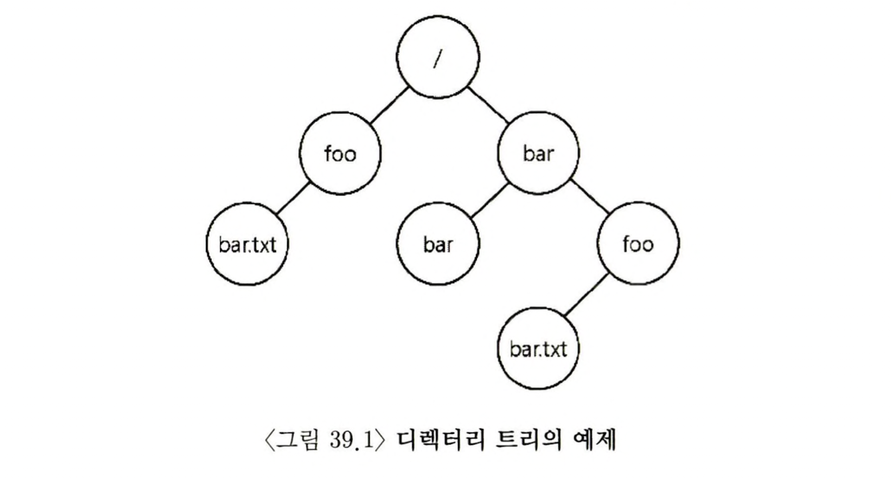
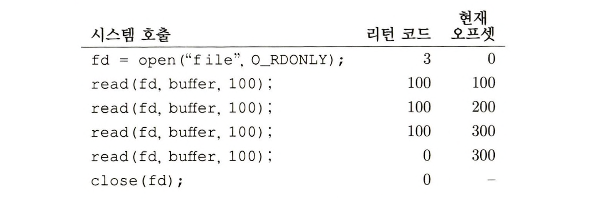
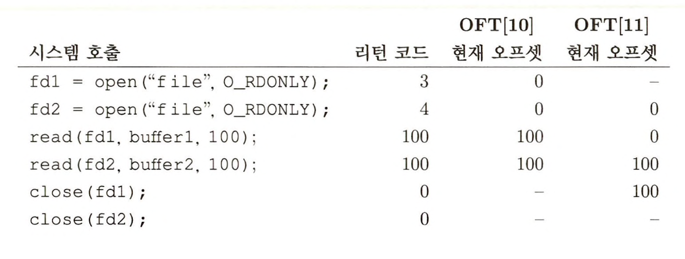
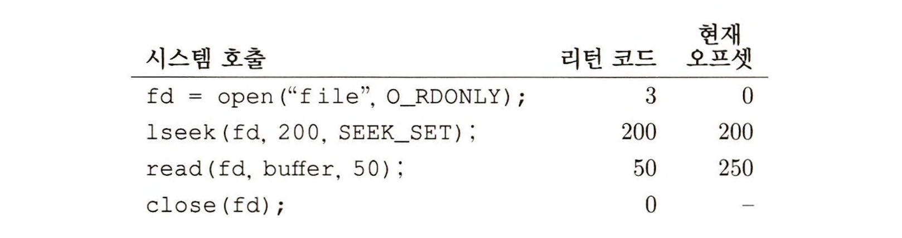
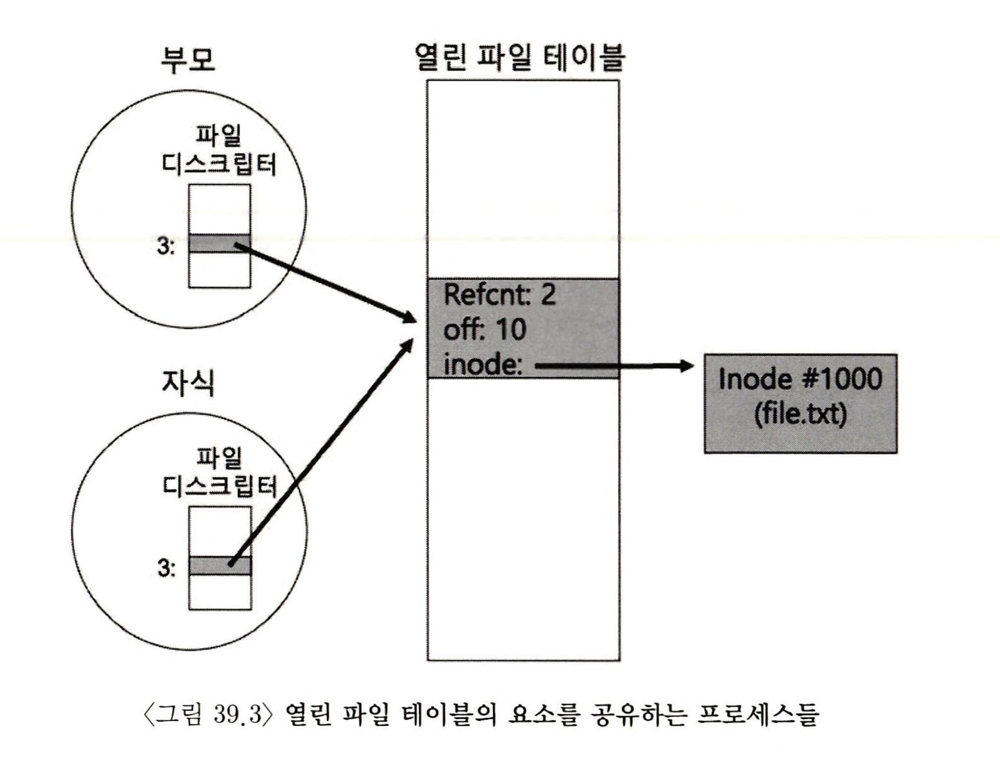
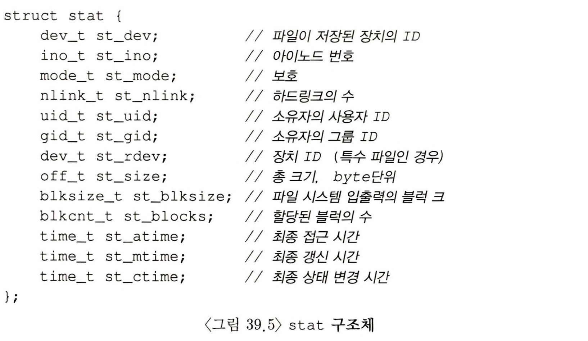
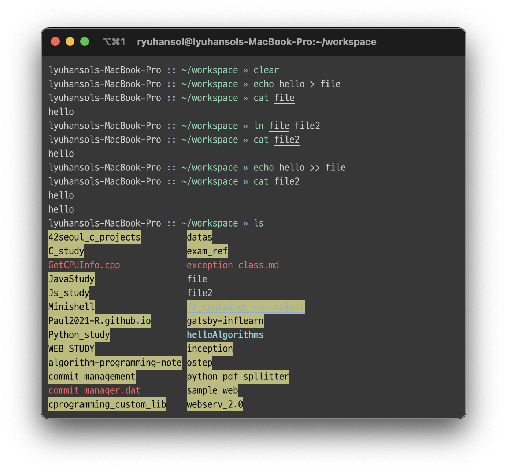
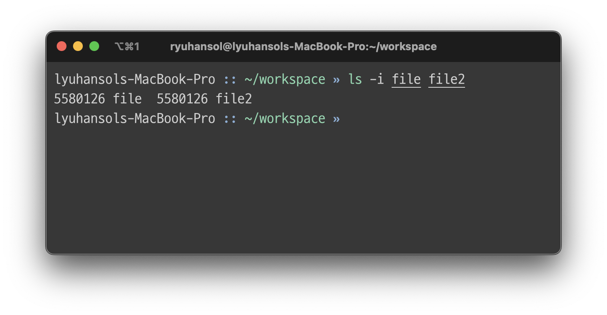
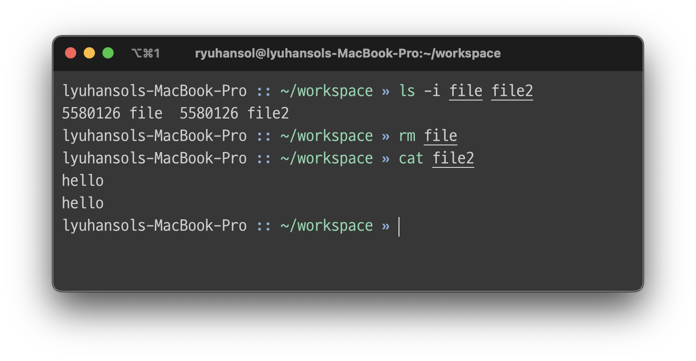

> 본 내용은 OSTEP 의 내용을 정리 및 요약한 내용입니다.
> 전문은 [이 곳](https://pages.cs.wisc.edu/~remzi/OSTEP/)을 방문하시면 보실 수 있습니다.

# 39. 막간 : 파일과 디렉터리 

운영체제는 자신만의 프로세서 또는 프로세서들과 자신만의 메모리가 있는 것처럼 만들어준다. 이러한 환상은 프로그램 개발을 촉진하고, 다양한 프로그래밍이 가능한 플랫폼에서 광범위하게 차용하고 있다. 

이번 장에선 **영속 저장장치(persistent storage)** 라고 하는 가상화의 핵심 개념을 다룬다. 하드 디스크, 최근에는 솔리드 스테이 드라이브까지, 전원공급이 차단되면 내용이 사라지는 메모리와는 다르게 영속 저장장치는 그러한 상황에서도 데이터를 그대로 보존해야하고, 당연히 운영체제는 그런 장치들을 좀더 신중하게 다루어야 한다. 

<div style=“margin:10px;”>
<h3 style="display:inline-box; background-color:#666; padding:10px 10px 5px 10px; border-radius:10px 10px 0 0; margin: 0px; color:white;">🚩 핵심 질문: 어떻게 영속 장치를 관리하는가?</h3>
<div style="display:box; background-color:#808080; margin: 0px; padding: 10px; color:black; border-radius: 0 0 10px 10px; color:white">운영체제가 영속 장치를 어떻게 관리해야 할까? API들은 어떤 것이 있는가? 구현의 중요한 측면은 무엇일까?
</div>
</div>

오늘의 파트는 영속 데이터를 관리하는 핵심 기술을 살피며, 성능과 신뢰성 향상의 기법을 중점적으로 바라볼 것이다. 

## 39.1 파일과 디렉터리 

저장화 장치의 가상화를 위한 핵심 개념은 1) 파일이며, 2)디렉터리 개념이다. 

파일은 기본적으로 단순히 읽거나 쓸 수 있는 순차적인 바이트의 배열이며, 각 파일은 저수준 이름(low-level name)을 갖고 있으며, 보통은 숫자로 표현하나 사용자는 알 수 없다. 역사적 맥락에서 이러한 저수준 이름은 **아이노드 번호(inode number)** 라고 부른다. 대부분의 시스템은 파일 구조 자체는 모른다. 파일 시스템의 역할은 그런 데이터를 디스크에 안전하게 저장, 요청 시 데이터를 돌려주는 것에 핵심을 두고 있다. 

디렉터리도 저수준의 이름으로 아이노드 번호를 갖는다. 하지만 파일과 달리 디렉터리의 내용은 구체적으로 정해져 있다. 디렉터리는 `사용자가 읽을 수 있는 이름`, `저수준 이름`의 쌍으로 이루어진 목록을 갖고 있다.

또한 디렉터리의 각 항목은 파일 또는 다른 디렉터리를 가리킨다. 디렉터리 내의 다른 디렉터리를 포함함으로써 사용자는 모든 파일들과 디렉터리들이 저장되어 있는 임의의 **디렉터리 트리(directory tree) 또는 디렉터리 계층(directory hierarchy)** 를 구성할 수 있다. 

기본적으로 디렉터리 계층은 루트 디렉터리부터 시작하며, 원하는 파일부터 디렉터리의 이름을 표현할 때까지 구분자(separator)를 사용하여 하위 디렉터리를 명시할 수 있다. 



파일의 이름의 앞부분은 임의의 이름인 반면, 뒷 부분은 파일의 종류를 나타내기 위해 사용된다. 

## 39.2 파일 시스템 인터페이스

파일 시스템 인터페이스에 대해 상세하게 보려고 한다. 파일의 생성과 접근, 그리고 삭제 등의 기본에서 파일을 삭제를 담당하는 API까지 파일관련을 일체를 학습할 것이다. 

## 39.3 파일의 생성 

```c
int fd = open ("foo", O_CREAT | O_WRONLY | \
					O_TRUNC, S_IRUSR | S_IWUSR);
```

해당 시스템 콜은 파일을 생성하며, 각 플래그들은 프로그램을 새로운 파일을 만들 때 옵션을 설정해서 생성하도록 만들어준다. open() 의 중요한 항목은 리턴값이다. 리턴값은 **파일 디스크립터** 이다. 

파일 디스크립터는 프로세스마다 존재하는 정수로, Unix 시스템에서 파일을 접근하는데 사용한다. 열린 파일을 읽고 쓰는데도 사용되며, 파일 디스크립터는 기능적 측면을 가지고 있다. 일종의 파일 객체를 가리키는 포인터로 볼 수도 있다. 프로세스마다 파일디스크립터를 관리하는 테이블을 갖고 있으며, 각 배열의 요소는 실제로 struct file을 가리키는 포인터 역할을 한다. 

## 39.4 파일의  읽기와 쓰기 

<div style=“margin:10px;”>
<h3 style="display:inline-box; background-color:#666; padding:10px 10px 5px 10px; border-radius:10px 10px 0 0; margin: 0px; color:white;">☝🏻 팁: strace(및 유사한 툴들)를 사용해보자</h3>
<div style="display:box; background-color:#808080; margin: 0px; padding: 10px; color:black; border-radius: 0 0 10px 10px; color:white">strace 도구는 프로그램이 호출한 시스템 콜들이 무엇이며, 인자와 리턴 코드가 무엇인지 추적이 가능하다. 따라서 프로그램이 무엇을 하고 있는지 유추하는데 상당히 깊은 이해가 가능하다. 
</div>
</div>

시스템의 파일의 읽기와 쓰기 과정에서 어떤 일이 일어나는지를 정리한 내용이다. 이를 알기 위해 시스템 콜 추적 도구를 사용한다. Linux는 strace, Mac OS 는 dtruss를 사용하면 되며 오래된 Unix 운영체제들은 truss를 활용하면 가능하다.

해당 내용은 기존의 파일과 파일 디스크립터에 대한 내용의 중복되는 내용들이므로 생략한다. 

<div style=“margin:10px;”>
<h3 style="display:inline-box; background-color:#666; padding:10px 10px 5px 10px; border-radius:10px 10px 0 0; margin: 0px; color:white;">☝🏻 여담: 자료구조 - open file table</h3>
<div style="display:box; background-color:#808080; margin: 0px; padding: 10px; color:black; border-radius: 0 0 10px 10px; color:white">각 프로세스는 파일 디스크립터 배열을 갖고 있다. 이를 관리하는 자료구조가 열린 파일 테이블(open file table) 이라고 하며, 각 파일 디스크립터는 이 자료구조의 요소 하나를 가리키게 된다. 이 테이블 요소는 디스크립터가 가리키는 파일과 현재 오프셋, 그리고 읽기 쓰기 여부등의 정보를 담고 있다. 
</div>
</div>

## 39.5 비 순차적 읽기와 쓰기

지금까지의 내용은 순차적 접근을 의미한다. 하지만 특정 오프셋으로부터 읽거나 쓰는 것이 유용할 때가 있다. 이러한 경우 문서 내의 임의의 오프셋에서 읽기를 수행해야 할 것이고, 이를 위한 시스템 콜로 lseek() 과 같은 것이 존재한다. 

```c
off_t lseek(int filedes, off_t offset, int whence);
```

- 첫 번째 인자는 파일디스크립터
- 두 번째 인자는 파일의 특정 위치를 가리킨다. 
- 세 번째 인자는 맥락적으로 whence 라고 부르며 탐색 방식을 결정한다.  man 페이지를 참고하면 몇가지가 나온다. 
	- SEEK_SET 이면 오프셋은 offset 바이트로 설정된다. 
	- SEEK_CUR 이면 오프셋은 현재 위치에 offset 바이트를 더한 값으로 설정된다. 
	- SEEK_END 이면 오프셋은 파일 크기에 offset 바이트를 더한 값으로 설정된다. 

<div style=“margin:10px;”>
<h3 style="display:inline-box; background-color:#666; padding:10px 10px 5px 10px; border-radius:10px 10px 0 0; margin: 0px; color:white;">☝🏻 여담: lseek() 을 호출한다고 디스크 탐색을 하는 것이 아니다</h3>
<div style="display:box; background-color:#808080; margin: 0px; padding: 10px; color:black; border-radius: 0 0 10px 10px; color:white">이름이 잘못 지어졌다고 평가받는 lseek() 을 혼동하면 안된다. 해당 시스템 콜은 단순히 내부에 다음 번 읽기를 혹은 쓰기를 위한 시작 위치를 변경하기 위해 운영체제가 관리하는 특정 프로세스의 메모리 내의 변수를 변경하는 역할을 한다. 
</div>
</div>

예상데로 proc 구조체 내부에서는 file에 대한 구조체를 정의하고 있고, 이에 대한 간단한 버전은 다음처럼 정의 된다. 

```c
struct file {
	int ref;
	char readable;
	char writable;
	struct inode *ip;
	uint off;
};
```

운영체제는 이 구조체를 이용하여 현재 열린 파일의 읽기와 쓰기의 가능 여부, struct inode 의 형의 ip가 가리키는 파일, 그리고 off 에 저장된 현재의 오프셋을 판단하도록 만들어 놨고, ref 는 참조의 횟수를 저장하도록 한다. 

이 파일 구조체들은 시스템에서 현재 열어 놓은 모든 파일을 나타낸다. 이 구조체를 통틀어 `open file table` 이라고 부르기도 한다. xv6 은 이들을 배열로 관리하며, 이 각 요소마다 락을 갖고 있다. 

```c
struct {
	struct spinlock lock;
	struct file file[NFILE];
} ftable 
```

이에 대한 예시로 파일을 열고, read()를 반복적으로 사용하는 예시의 파일의 상태와 관련된 표를 한번 살펴보자.



이 표의 특징들을 나열해보면 다음과 같다. 
1. 파일이 열리면, 현재 오프셋이 0으로 초기화 된다.
2. 이 프로세스가 read()를 호출 할때마다 현재 오프셋이 증가한다. 
3. 파일의 범위 밖에서 read()를 호출하면 0으로 되돌려준다. 



두 번째 예시는 동일한 파일에 대해 두번 연 후 각 파일의 흐름을 보는 표이다. 

여기서는 특이 사항이 각 오프셋이 독립적으로 갱신되는 것을 알 수 있다. 



마지막 예제는 lseek()을 호출하면서 오프셋의 위치 변수만 갱신된 것으로 보여준다. 그리고 read() 호출하면서 50바이트만 읽었고, 그 결과 리턴 값도 정상적으로 50바이트만 읽었다고 반환한다. 

## 39.6 공유는 파일 테이블 요소들 : `fork()` 와 `dup()`

열린 파일 테이블의 요소와 파일디스크립터를 연결하는 것은 일대 일 매핑으로 보통 이루어진다. 프로세스가 파일을 엵고, 읽고, 닫히는 과정을 생각해보면 어떤 다른 프로세스가 같은 파일을 동시에 읽는다고 하더라도, 각 프로세스는 개별적인 열린 파일 테이블의 요소를 다룬다. 같은 파일에 대한 논리적 읽기와 쓰기는 독립성이 보장되고, 개별 오프셋을 관리한다. 

```c
// 그림 39.2 공유된 부모 / 자식 파일 테이블 요소들   
int main(int argch, char *argv[]) {
	int fd = open("fil.txt", O_RDONLY);
	assert(fd >= 0);
	int rc = fork();
	if (rc == 0) {
		rc = lseek(fd, 10, SEEK_SET);
		printf("child: offset %d\n", rc);
	} else if (rc > 0) {
		(void) wait(NULL);
		printf("parenet : offset %d\n", (int) lseek(fd, 0, SEEK_CUR));
	}
	return 0;
}
```

하지만 어딜 가든 안티테제는 존재한다. 열린 파일 테이블을 공유하는 경우가 있다. 위의 예시가 그러한데, 해당 프로그램을 실행시키면 다음과 같이 출력이 나오게 된다. 

```shell 
prompt > ./fork-seek
child: offset 10
parent: offset 10
prompt > 
```




위 그림을 보면 프로세스가 관리하는 디스크립터 배열, 열린 파일 테이블의 요소, 그리고 파일 시스템 아이노드에 대한 참조 간의 관계를 나타낸다. 여기서 비로소 **참조 회수(reference count)** 를 활용한다. 파일 테이블의 요소가 공유되면 해당 참조 횟수가 증가하게 된다. 그리고 두 프로세스가 모두 파일을 닫은 후에야 이 요소는 제거된다. 

부모와 자식 간에 열린 파일 테이블을 공유하는 일은 때때로 유익하다. 어떤 작업을 처리하기 위해 협업용 프로세스들을 여러개 생성했다고 보자. 그런 경우 이 프로세스들은 같은 결과 파일에 어떤 조정도 없이 쓰기가 가능하다. fork()가 호출 되었을 때 또 어떤 것들이 프로세스들에 의해 공유 되는 지 더 알고 싶다면 man 페이지를 참고해라. 

추가로 흥미롭고, 유용한 사례는 dup() 시스템 호출을 사용하여 공유하는 경우다. 
`dup()`은 이미 열려 있는 파일의 디스크립터를 참조하는 새로운 파일 디스크립터를 생성한다.  사용하는 예시는 다음과 같다. 

```c
// 39.4 dup() 을 사용하여 파일 테이블의 요소 공유하기(dup.c)
int main(int argc, char *argv[]) {
	int fd = open("README", O_RDONLY);
	assert(fd >= 0);
	int fd2 = dup(fd);
	// 이제 fd, fd2는 교차 사용 시 상태가 공유된다. 
	return (0);
}
```

`dup()`, `dup2()`는 유닉스 쉘과 출력을 재 지향하는 코드 등에서 작성하는게 유익하다. 교재해서는 왜 그런지 설명하지 않는다. 이에 생각을 정리하면 다음과 같다. 

기본적으로 쉘에서의 출력 및 소통이 되는 프로그램은 표준 입출력을 사용해야 한다. 하지만 거기서 다른 정보를 가져오거나, 다른 프로그램을 통해 데이터를 확보하는 등이 필요한 경우, 그러한 프로그램들 모두 표준 입출력으로 설계가 된 만큼 그 설계자체를 바꾼다면 이는 매우 말도 안될 것이다. 이럴 때 해당 프로그램이 아니라, 이를 가리키는 파일 디스크립터의 수정은 훨씬 편리하게 프로그램의 데이터 흐름을 수정할 수 있거나, 연 파일에 대한 정보의 흐름을 가로챌 수 있다. 

## 39.7 `fsync()` 를 이용한 즉시 기록 

write() 호출의 목적은 해당 데이터를 가까운 미래에 영속 저장장치에 기록하기를 시스템에게 요청하는 것이다. 하지만 파일 시스템은 쓰기들을 일정시간 동안 메모리에 모으며(버퍼링) 일정 간격으로 쓰기 요청들을 저장한다. 그러다보니 응용 프로그램 입장에선 write() 호출 즉시 쓰기가 완료된 것처럼 보이게 만든다. 그리고 이런 구조적 특성 때문에 디스크에 쓰기 직전에 크래시로 데이터 유실이 발생할 수 있다. 

따라서 프로그램의 특성에 맞춰서 좀더 강력한 보장을 지원해야 했다. 이에 이러한 추가적인 제어 API들을 제공하고, Unix 환경에서는 `fsync()` 다. 

해당 시스템콜을 호출하면 파일 시스템은 지정된 모든 더티(dirty, 갱신된) 데이터를 디스크에 강제로 내려보낸다. 물론 해당 방식도 완벽한 보장은 아니다. 어떤 경우에는 파일 foo가 존재하는 디렉터리도 fsync() 해주어야 한다. 디렉터리를 함께 호출 해줌으로써 파일 자체와 이 파일이 속한 디렉터리 모두 디스크에 저장이 된다. 

특히, 파일이 새로이 생성된 경우에는 **디렉터리를 반드시 fsync() 해주어야 한다.** 

## 39.8 파일 이름 변경 

파일 이름을 변경하는 경우 `rename(char *old char *new)` 라는 시스템 콜을 호출한다. 해당 시스템 콜은 흥미로운 특성 한가지를 가지는데, 이 명령어는 대체로 시스템 크래시에 원자적으로 구현되었다는 점이다. 파일 시스템의 크래시가 발생할때 이름은 원래의 이름 혹은 새로운 이름 둘 중 하나를 갖게 되며 중간 상태는 발생하지 않는다. 파일의 상태를 원자적으로 갱신해야 하는 응용 프로그램에 있어 `rename()`은 매우 중요한 시스템 콜이다. 

좀더 구체적으로 예시를 들어 보아서 파일 편집기에서 파일 중간에 한 줄을 삽입한다고 생각해보자. 이때 새로운 파일이 원래의 내용과 추가된 줄을 모두 포함한다는 것이 보장되도록 갱신하는 방법은 다음과 같다. (예시이므로 에러 검사는 무시했다)

```c
int fd = open("foo.txt.tmp", O_WRONLY|O_CREAT|O_TRUNC, S_IRUSR|S_IWUSR);
write(fd, buffer, size);
fsync(fd);
close(fd);
rename("foo.txt.tmp", "foo.txt");
```

이 예제 처럼 기본적으로 내용을 `fsync()`로 디스크에 기록하도록 한 뒤, 새로운 파일의 메타 데이터와 내용이 디스크에 기록되었다는 것을 확인하면, 임시 파일의 이름을 원래 파일 이름으로 변경한다. 이후에는 이전 버전을 삭제하고 동시에 새 파일로 교체하는 작업이 원자적으로 이루어질 것이다. 

## 39.9 파일 정보 추출 

파일 시스템은 각 파일에 대한 정보를 보관한다. 파일에 대한 정보를 **메타데이터(metadata)** 라고 부른다. 어떤 파일의 메타 데이터를 보려면 stat() 이나 fstat() 시스템 콜을 사용한다. 이 호출들은 파일에 대한 경로나 파일 디스크립터를 입력으로 받으며, 이렇게 받았을 때 얻는 구조체는 다음과 같다. 



각 파일에 관한 많은 정보들을 담고 있다. 일반적으로 파일 시스템은 아이노드에 이러한 정보를 보관하고 있으며, 파일 시스템 구현 부분에서 아이노드에 대해 더 자세히 배우게 될 것이다. 모든 아이노드는 디스크에 저장되며, 사용중인 것들은 캐쉬 메모리에 사본을 만들어 접근 속도를 높인다. 

## 39.10 파일 삭제 

Unix 시스템에서 파일을 삭제하는 명령어는 rm이다. 이때 rm은 내부에서 어떤 시스템 콜을 사용하는지 확인해보면, `unlink()`를 사용하는 것을 보여준다. 그런데 왜 삭제가 아니라 unlink(끊다) 인 것일까? 이 답을 이해하기 위해선 파일과 디렉터리에 대해서 이해해야 한다. 

## 39.11 디렉터리 생성 

디렉터리 관련 시스템 콜들은 디렉터리를 생성하고, 읽고, 삭제한다. 단 디렉터리에는 절대로 직접 쓸 수 없다. 디렉터리는 파일 시스템의 메타데이터로 분류되며, 파일 시스템이 디렉터리의 무결성을 책임져야 한다. 그러므로 디렉터리는 항상 간접적으로만 변경된다. 

디렉터리를 생성을 위한 시스템 콜은 `mkdir()` 이다. 처음 디렉터리가 생성되면 빈 상태다. 하지만 사실은 아주 기본적인 내용이 들어있긴 하며, 빈 디렉터리에도 실제론 두개의 항목을 갖고 있다. 하나는 자기 자신을 나타내며, 다른 항목은 자신의 부모 디렉터리를 가리키 위한 것이다. 

## 39.12 디렉터리 읽기 

디렉터리를 읽는 방식은 파일을 여는 것과는 다른 새로운 시스템콜을 활용한다. `opendir()`, `readdir()`, `closedir()`을 사용한다. 인터페이스는 간단한 반복문으로 호출시 디렉터리 항목을 하나씩 읽은 후 디렉터리의 각 파일의 이름과 아이노드 번호를 출력한다. 

```c
// 디렉터리를 읽는 간단한 구조 
int main(int argc, char *argv[]) {
	DIR *dp = opendir(".");
	assert(dp != NULL);
	struct dirent *d;
	while ((d = readdir(dp);) != NULL) {
		printf("%lu %s\n", (unsigned long) d->d_ino, d->d_name)
	}
	closedir(d)}
```

```c
strucut dirent {
	char d_name[256];         // 파일 이름 
	ino_t d_ino;              // 아이 노드 넘버
	off_t d_off;              // 다음 dirent 까지의 오프셋
	unsigned short d_reclen;  // 이 레코드의 길이
	unsigned char d_type;     // 파일 타입
};
```

디렉터리에는 많은 정보가 있지 않기 때문에, 프로그램은 각 파일에 stat()을 호출하여 파일의 구체적 정보를 얻을 수 있다. 

## 39.13 디렉터리 삭제하기 

마지막으로 rmdir() 시스템 콜을 사용하여 디렉터리를 삭제할 수 있다. 같은 이름의 쉘 명령어도 존재하며, 파일 삭제와 다른 점은 디렉터리의 삭제라는 것이 그 내부의 전체를 지울 수 있기에 좀더 위험하다는 점이다. 그렇기에 디렉터리의 지우는 시스템 콜은 디렉터리를 지우기 전에 디렉터리가 비어있어야 한다. 

## 39.14 하드 링크 

파일 삭제 시 왜 unlink() 를 사용하는지를 이해하기 위해, 이제 파일 시스템 트리에 항목을 추가하는 새로운 시스템 콜 `link()` 라는 시스템 콜에 대해 이야기 해보자 link()는 두가지 인자를 받는다. 하나는 원래의 경로명, 다른 하나는 새로운 경로명이다. 원래 파일 이름에 새로운 이름을 "link" 하면 동일한 파일을 접근할 수 있는 새로운 방법을 만들게 된다. 

명령형 프러그램 ln은 이러한 일을 하며 다음 예제의 형태를 보인다. 



link() 는 새로이 링크하려는 이름 항목을 디렉터리에 생성하고, 원래 파일과 같은 아이노드 번호를 가리키도록 한다. 파일이 복사되는 것이 아니라, 같은 파일을 가리키는 두개의 이름이 생성된 것이다.(file, file2)


ls -i를 통해 아이노드 번호를 볼 수 있는데, 두개 모두 동일한 아이노드를 갖고 있다는 것을 알 수 있다. 그렇다면 이제 왜 파일 삭제가 'unlink()' 라는 이름인지를 알 수 있을 것이다. 

파일을 생성할 때 사실은 두가지 작업을 한다. 하나는 파일 관련 거의 모든 정보를 관리하는 자료구조(아이노드)를 만드는 것이며, 두 번째는 해당 파일에 사람이 읽을수 있는 이름을 연결하고 그 연결 정보를 디렉터리에 생성하는 것이다. 

파일 시스템에 하드 링크를 생성한 후에는 원래 파일 이름과 새로이 생성된 이름 간의 차이는 없다. 
파일 삭제 시 unlink()를 호출한다. 위의 예제에서 file을 지워보면, 여전히 file2는 접근이 가능하다. 



파일을 unlink 하면 아이노드 번호의 참조횟수(reference count)를 검사한다. 이 참조 회수가 특정 아이노드에 대해 다른 이름이 몇개나 연결되어 있는지를 관리한다. 이때 unlink()가 호출되면 이름과 해당 아이노드 간의 '연결을 끊어' 참조 횟수를 하나 줄인다. 참조횟수가 0에 도달하면 파일 시스템은 비로소 아이노드와 관련된 데이터 블럭을 해제하고 파일을 진정으로 '삭제' 한다. 

## 39.15 심볼릭 링크

심볼릭 링크(symbolic link)라고 하고 때로는 소프트 링크(soft link)라고 부른다. 엄밀히 하드링크는 제약사항이 많다. 디렉터리에 관해서는 만들 수 없으며, 다른 디스크 파티션에 있는 파일에 대해서도 하드 링크를 거수 없다(아이노드 번호는 하나의 파일 시스템 내에서만 유일하다)는 등의 제한이 걸린다. 

심볼릭 링크의 설정은 명령형 프로그램에선 동일하게 ln을 사용하되 -s  옵션을 넣어주면 된다. 이때 하드링크와는 달리 연결하는 파일 경로명을 저장하기 때문이다. 

이러한 심볼링 링크가 만들어진 방식 때문에 **dangling reference** 라는 문제가 발생할 수 있다. 

이는 원래 파일을 삭제하면 링크가 가리키는 실제 파일이 존재하지 않기 때문이다. 

## 39.16 권한 비트와 접근 제어 목록

다른 영역들과 마찬가지로 파일 시스템 역시 디스크에 대한 가상화를 제공한다. 단 파일 시스템은 디스크 상의 블럭들을 좀더사용자 친화적 개념인 파일과 디렉터리로 변화한다. 그러나 추상화적인 면에서 CPU와 메모리와는 또 다른 가상화에가까운데, 우선 파일은 일반적으로 다수의 사용자들과 다수의 프로세스에서 '공유' 된다. 여기서 공유를 위해 공유 범위를 한정하는 기법들이 고안된다. 

가장 고전적인 방식은 Unix의 권한비트(permission bits)이다.  파일의 소유자(owner), 그룹(group), 다른 사용자로 구분지어서 파일마다의 권한과 할 수 있는 일을 제어한다. 
이러한 `파일 모드(file mode)`를 변경하는 것이 chmod 명려이다. 이 명령어는 소유자와 권한을 바꿀 수 있다. 또한 이러한 유저 중에는 시스템에 권한없이 모든 파일에 접근이 가능한 슈퍼 유저(supersuer, root)가 있다. 

디렉터리도 이러한 비트가 존재하는데, 비트는 설정되면 사용자 파일의 그것과는 다소 다른 의미를 가진다. 이 비트의 은 사용자가 다른 위치로 디렉터리를 변경(cd)할 수 있으며, 쓰기 비트도 설정되어 있으면, 해당 디렉터리에서 파일도 생성할 수 있다. 

AFS 와 같은 분산 파일 시스템을 포함하는 다른 파일 시스템의 경우 좀더 복잡한 제어 기능을 갖고 있다. AFS 는 **접근 제어 목록(access control list(ACL))** 을 갖고 있다. 

## 39.17 파일시스템 생성과 마운트 

지금까지 파일과 디렉터리 그리고 몇 가지 종류의 링크를 다루는 기본 인터페이스를 살펴보았다. 만약 다수의 파일 시스템들이 존재할 때 이들을 어떻게 묶어서 하나의 큰 디렉터리 트리를 구성할까? 

유닉스, 리눅스 계열은 알다시피 여러 개의 파일 시스템 파티션들이 모여서 하나의 큰 디렉터리를 구성하고, 각각의 파일 시스템을 생성하고 이들을 '마운트' 함으로써 단일 디렉터리를 구성한다. 대부분의 파일 시스템에서는 파일 시스템을 생성하는 mkfs 라는 도구를 제공한다. 


```toc

```
