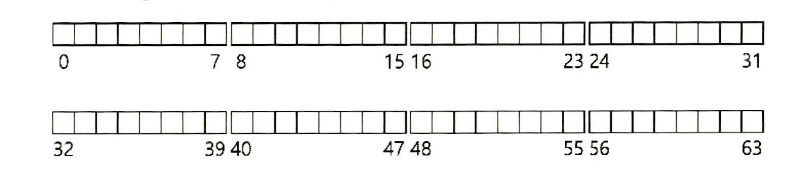
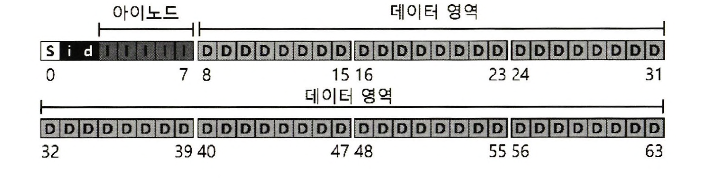
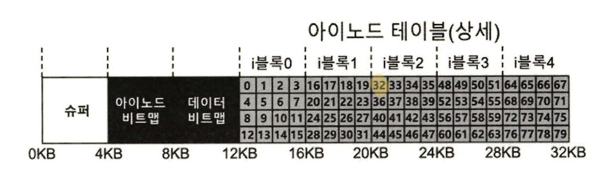
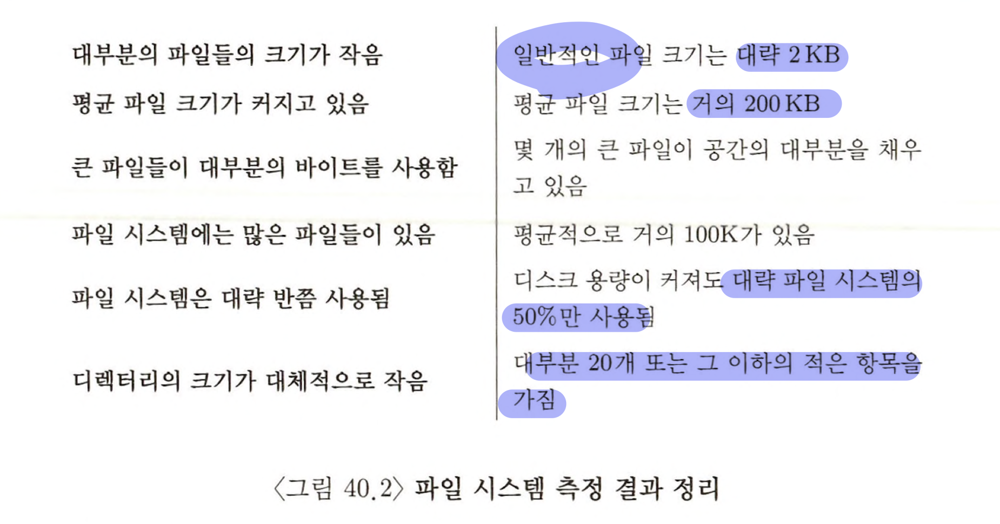
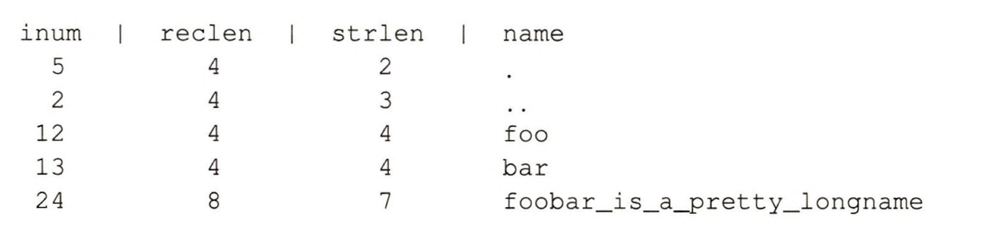
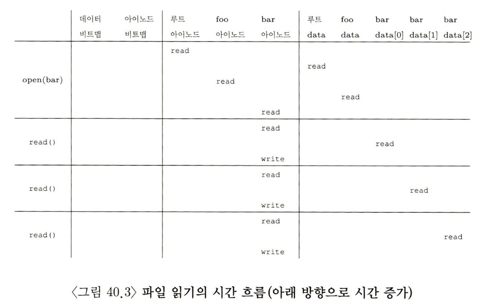
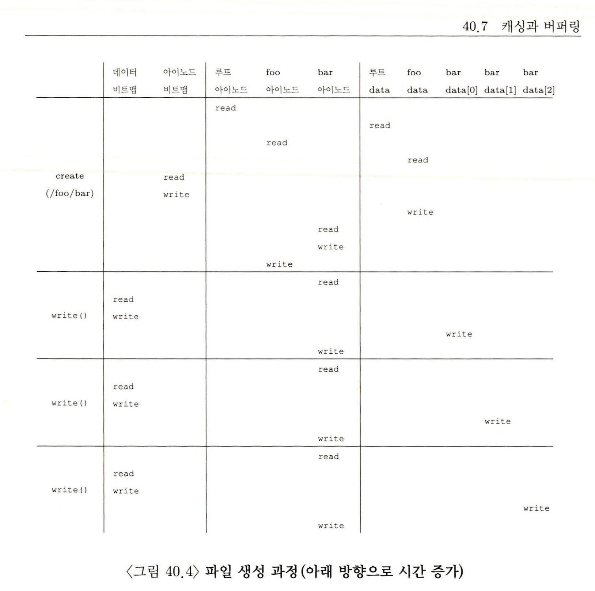

> 본 내용은 OSTEP 의 내용을 정리 및 요약한 내용입니다.
> 전문은 [이 곳](https://pages.cs.wisc.edu/~remzi/OSTEP/)을 방문하시면 보실 수 있습니다.

# 40. 파일 시스템 구현

`vsfs(Very Simple File System)`이라는 간단한 파일 시스템을 구현하여서, 현존하는 시스템에 대한 이해도를 높이는 시도를 해보고자 한다. 

파일 시스템은 순수한 소프트웨어다. CPU, 메모리와 같은 부분들은 가상화에 도움을 주는 하드웨어와의 조합을 통해 구현하지만, 파일 시스템에선 오로지 소프트웨어적 개선만을 고려할 것이다. (물론 실제 현실에선 동작 특성이 일부 고려된다.)

vsfs를 구현해보면서, 현실에서 AFS에서 ZFS까지 다양한 파일 시스템들의 동작을 이해해보자.

<div style=“margin:10px;”>
<h3 style="display:inline-box; background-color:#666; padding:10px 10px 5px 10px; border-radius:10px 10px 0 0; margin: 0px; color:white;">🚩 핵심 질문: 어떻게 간단한 파일 시스템을 만들 것인가</h3>
<div style="display:box; background-color:#808080; margin: 0px; padding: 10px; color:black; border-radius: 0 0 10px 10px; color:white">간단한 파일 시스템은 어떻게 만들 수 있을까? 디스크 위에는 어떤 자료구조가 필요할까? 그러한 자료구조는 어떤 정보를 추적 해야 하는가? 그 자료 구조들은 어떻게 접근 되어야 하는가?
</div>
</div>

## 40.1 생각하는 방법 

파일 시스템에 대한 학습에서 바라보는 방법은 크게 다음과 같다. 

- 파일 시스템의 자료구조 : 파일 시스템이 자신의 데이터와 메타 데이터를 관리하기 위해선 디스크 상에 어떤 자료구조를 취해야 하는가? 기본적으로 vsfs 에서는 간단한 배열의 구조를 취하겠지만, 다른 시스템의 경우 복잡한 트리 기반인 경우도 있다. 
- 접근 방법(access method) : 프로세스가 호출하는 open(), read(), write() 등의 명령들은 파일 시스템의 자료구조와 어떤 관련이 있는가? 특정 시스템 콜의 실행에서 어떤 자료구조들이 읽히는가? 어떤 것들이 쓰이며, 이 모든 과정에서 얼마나 효율적으로 동작하는가? 

## 40.2 전체 구성

위의 두 가지 시각을 통해 디스크를 바라보기 시작했다면, vsfs를 구축할 준비가 된 것이다. 가장 먼저 할 일은 디스크를 `블록(block)`으로 나누는 것이다. 일반적으로 사용되는 크기인 `4KB`를 사용하며, N개의 4KB 블럭의 크기를 갖는 파티션을 블럭 0부터, N-1까지의 주소를 갖는다. 블럭이 64개라는 전제하에 다음과 같이 파티션이 준비된다. 



블럭의 구성요소는 다음과 같이 정의 할 수 있다. 
- `데이터 영역(data region)` : 사용자의 실제 데이터를 저장하는 공간. 
- `메타 데이터(meta data)` : 파일 시스템의 각 파일에 대한 정보 관리 공간  = 파일 크기, 소유자, 접근 권한, 접근과 변경 시간 == `아이노드(inode)`
	- 보통 아이노드 사이즈는 128 ~ 256바이트 정도 되며, vsfs에서는 256을 inode 사이즈로 지정하며, 이 경우 4KB 블럭에는 16개의 아이노드를 저장할 수 있다. vsfs그러므로 총 80개의 아이노드를 저장할 수 있다. 
	- 즉 64개의 블럭으로 된 파티션에 최대 80개의 파일을 만들 수 있다. 
- `아이노드 테이블(inode table)` : 아이노드들이 배열 형태로 저장되며, 전체 64개 블럭 중 5개를 아이노드용이며, 하나는 테이블을 구성한다. 
- `슈퍼블럭(superblock)` : 이 파일 시스템 전체 대한 정보를 가진다. 파일 시스템을 식별할 수 있는 매직넘버 등을 갖고 있다. 해당 자료는 저장된 디스크 뿐만 아니라, 시스템 문제를 파악하기 위해 몇 개 씩 복사해둔다. 
위의 내용을 정리하면 다음과 같은 파티션이 구성된다. 



파일 시스템을 마운트 할 때, 운영체제는 슈퍼블럭들을 먼저읽어 파일 시스템의 요소를 초기화 한다. 그 후에 각 파티션을 파일 시스템 트리에 붙히는 작업을 진행한다. 이렇게 함으로 볼륨에 있는 파일들을 읽거나 쓰거나, 필요한 자료 구조 위치를 파악한다. 

## 40.3 파일 구성 : 아이노드

파일 시스템의 디스크 자료구조 중 가장 중요한 것은 **아이노드(inode)** 다. 거의 대부분의 파일 시스템들이 유사한 구조를  가진다. 

**아이노드** 라는 단어는 `인덱스 노드(index node)` 의 줄임말로 초창기 시스템부터 지금까지 사용되고 있다. 각 아이노드는 숫자(`아이-넘버(i-number)`)로 표현되었다.  vsfs 에서는 아이-넘버를 사용하여 해당 아이노드가 디스크 상에 어디인지를 직접 계산하는 용으로 사용이 가능하다. 



위에서 사용한 vsfs의 아이노드 테이블의 예시로 보면, 크기가 20KB이고(4KB 블록 5개), 아이노드 영역은 12KB 위치에서 시작하고, (슈퍼블럭은 0KB 부터), 아이노드 비트맵 주소는 4KB, 데이터 비트맵은 8KB에서 부터 시작한다. 

- 여기서, 32번 아이노드를 읽기 위해선, 우선 아이노드 영역에서의 오프셋을 계산한다. = `(32 * sizeof(inode) == 8192)`
- 그 후 아이노드 테이블의 시작위치(`inodeStartAddr=12KB`) 를 더하면, 원하는 아이노드 블럭의 정확한 바이트 주소를 구할 수 있다(20KB)
	- 디스크는 기본적으로 byte 단위로 접근이 불가능하며, 대신 512byte 수준의 크기를 갖는 `섹터` 로 이루어져 있다.
- 그러므로 32번 아이노드가 존재하는 블럭을 가져오려면, 섹터주소 `20 x 1024 / 512 == 40` 에 대한 읽기 요청을 하여 해당 아이노드 블럭을 가져온다.  섹터주소는 다음과 같이 계산한다. 
	- blk = `(inumber * sizeof(inode_t)) / blockSize;`
	- sector = `((blk * blockSize) + inodeStartAddr) / sectorSize;`
- 아이노드에는 파일에 대한 정보들을 다 담고 있다.
	- 파일 종류
	- 크기
	- 할당된 블럭 수
	- 보호정보
	- 시간 정보
	- 데이터블럭이 디스크 어디에 있는지
	- 즉, 메타 데이터를 포함하고 있다. 
- 아이노드 설계 시 가장 중요한 부분은 데이터 블럭의 위치를 표현하는 방법이다. 
	- 직접 포인터(direct pointer) : 직접 가리키는 방법이 있는데, 이 방법의 단점은 파일 크기의 제한이 있어서, 파일 크기는 **(포인터 개수) x (블럭크기)** 로 제한된다. 
	- 간접 포인터(indirect pointer) : 직접 가리키는 방법이 가지는 한계를 개선한 방식 

### 멀티 레벨 인덱스 

- 큰 파일을 지원하기 위해 파일시스템 개발자들은 아이노드 내에 추가적인 구조를 고려한다. 일반적으로 사용되는 방법 중 하나가 **간접 포인터(indirect pointer)** 이다. 
- 간접 포인터들은 데이터 블럭이 아닌, 데이터 블럭들을 가리키는 포인터를 가리키고 있다. 큰 파일에 대해서는 간접 블럭이 할당되고, 아이노드의 간접 포인터는 이 간접 블럭을 가리킨다. 블럭이 4KB이고, 디스크 주소가 4바이트라고 하면, 1024개의 포인터를 간접으로 가리키게 되니, 최대 파일 크기는 `(12 + 1024) * 4K = 4144KB` 를 표현할 수 있게 된다. 
- 이렇게 4144KB를 표현하는 것도, 사실 큰 파일은 아니다. 더 큰 파일을 저장하고 싶을 수도 있는데, 이런 경우 **이중 간접 포인터(double indirect pointer)** 를 추가하는 방식으로 표현이 가능해진다. 이 경우 각 간접 블럭은 데이터 블럭을 가리키게 되고, `4KB * 1024 * 1024`이므로 약 백만개의 4KB 블럭을 가질 수 있게 된다. 이는 대략 4GB를 넘는 사이즈의 파일을 가리킬 수 있게 되는 것이다. 
- 이렇듯 디스크 블럭들은 일종의 트리 형태로 구성되어 `멀티 레벨 인덱스 기법` 라고 불린다. 
- 일반적으로 자주 쓰이는 Linux의 ext2, est3, NetApp의 WAFL을 포함한 다수의 많은 파일 시스템이 이러한 멀티  레벨을 사용한다. 
	- 이와 다르게 SGI의 XFS, ext4의 경우에는 `익스텐트(extent)`기반의 동작을 하기도 한다. 
- 특징적으로 멀티 레벨 인덱스의 트리는 균형맞추지 않는다.  여기엔 **대부분의 파일 크기는 작다은 거 작다는 사실**)이 숨겨져 있다. 대부분의 파일들이 작다면, 작은 파일을 빨리 일고 쓰도록 구조를 설계 한 것이다. 
	- 트리 구조의 형태는 매우 편향적이며, 파일 시작의 경우 포인터를 세번 지나쳐야 할 수 있다. 그만큼 느려지는 것을 의미한다고 볼 수 있다. 
-  하지만, 기본적으로 이러한 형태를 갖춘 이유는 파일 시스템에서 `대부분의 파일 크기는 작다`는 것이다. 따라서 대부분의 파일의 크기가 작다면, 작은 파일을 빨리 읽고 쓸 수 있는게 적절한 설계인 것이다. 
- vsfs 에서는 첫 12개의 블럭들은 빨리 읽을 수 있도록 직접 포인터를 갖고 있다. 큰 파일에 대해선 한개 또는 그 이상의 간접블럭을 활용한다. 
- 결과적으로 최근의 연구 결과를 정리하면 다음과 같은, 파일 시스템에 대한 인사이트를 얻게 된다. 



- 파일은 위의 방식 외에도 다양한 방식의 구성과 자료구조를 활용할 수 있다. 파일 시스템 소프트웨어는 손쉽게 변경이 가능하며, 워크로드의 특성의 변화에 따라 새로운 파일 구성 방식을 연구 개발할 자세가 되어 있어야 한다. 

## 40.4 디렉터리 구조

- 지금까지 vsfs 는 그럴듯한 구조를 구성했다. 이번엔 디렉터리인데, 디렉터리는 `(항목의 이름, 아이노드 번호)`의 쌍의 배열로 구성되어있다. 
- 디렉터리의 데이터 블럭에는 문자열과 숫자가 쌍으로 존재하며, 문자열 길이에 대한 정보도 포함된다.(가변 길이의 이름일 경우)



- 위의 예시 처럼 아이노드 번호, 레코드 길이(이름에 사용된 총 바이트 + 남은 공간의 합), 문자열의 길이(실제 이름 길이), 그리고 마지막 항목으로 이름을 데이터 블럭에 포함시킨다. 
- 여기서 `.`, `..`의 경우 현재와 이전 부모 디렉터리를 가리킨다. 
- 파일이 삭제될 경우 디렉터리 중간에 빈 공간이 발생하게 되는데, 영역이 비었다는 것을 표현할 정책이 필요하다. (아이노드를 0으로 만든다던가)
- 항목의 길이를 명시하는 이유는, 하나가 중간에 빈공간이 생길 수 있고, 새로운 디렉터리 항목을 생성 시 기존 항목이 삭제 되어 생긴 빈 공간에 새로이 생성된 항목을 넣을 수도 있기 때문이다. 
- 디렉터리들은 대부분의 파일 시스템에서 디렉터리는 특수한 종류의 파일로 간주한다. 자신의 데이터 블럭을 갖고 있으며, 이들 블럭 위치는 일반 파일과 마찬가지로 아이노드에 명시되어 있다. 

## 40.5 빈 공간의 관리 

<div style=“margin:10px;”>
<h3 style="display:inline-box; background-color:#666; padding:10px 10px 5px 10px; border-radius:10px 10px 0 0; margin: 0px; color:white;">☝🏻 팁: 빈 공간의 관리</h3>
<div style="display:box; background-color:#808080; margin: 0px; padding: 10px; color:black; border-radius: 0 0 10px 10px; color:white">빈 공간을 관리하는 여러가지 방법 중 비트맵이 있다. 초기 파일 시스템들은 프리 리스트(free list)를 사용하여 슈퍼 블럭 안의 한 포인터가 첫 번째 프리 블럭을 가리키게 하는 방식이다. 그리고 그 블럭이 다른 프리 블럭을 가리키는 포인터를 갖는 식으로 시스템 내의 프리 블럭들의 리스트를 만들었다. 
</div>
</div>

- 빈 공간 관리는 모든 파일 시스템의 핵심 중에 핵심이다. vsfs 에서는 두 개의 비트맵을 사용한다. 
- 파일 생성 시 아이노드를 할당 해야 하고, 아이노드 비트맵을 탐색해 비어 있는 아이노드를 찾아 파일에 할당한다.  파일 시스템은 해당 아이노드를 사용 중으로 표기하며, 디스크 비트맵도 적절히 갱신한다. 
- 데이터 블럭 할당 시 고려할 사항은 다음과 같다. 
	- 리눅스 파일 시스템의 경우 데이터 블럭 할당 시 가능하면 여러개의 블럭들이 연속적으로 비어있는 공간을 찾아서 할당한다. 추 후 발생하면 기존에 할당된 공간에 이어서 블럭 할당을 하기 위함이다.
	- 연속적으로 여러개 블럭들이 비어있는 공간을 할당해서, 해당 파일에 대한 입출력 성능을 개선한다. 이를 **선할당(pre-allocation) 정책** 이라고 부른다. 

## 40.6 실행 흐름 : 읽기와 쓰기 

- 파일과 디렉터리는 저장이 되었고, 실행과정(access path)을 이해 해보자. 
- 다음의 예제는 파일 시스템이 마운트 되고, 슈퍼블럭은 메모리 상에 위치한다고 가정하고 나머지는 디스크 상에 있다는 전제 하에 내용을 살펴 보자.

### 디스크에서 파일 읽기

- `/foo/bar`의 파일을 읽고 닫는 상황을 가정해보자. 파일 크기는 12KB(3블럭)의 크기를 갖고 있다. 
- open() 호출
- 파일 시스템은 전체 파일 경로명을 갖고 있고, 이 전체 경로를 따라가(traverse) 아이노드를 찾는다. 
- 파일 시스템은 파일 bar의 아이노드를 탐색하고, 기본 정보를 획득한다.
- 파일의 경로명을 따라 간다는 것은 항상 **루트 디렉터리(root directory)** 에서 시작한다. 
	- 파일 시스템이 디스크에서 가장 먼저 읽는 것이 루트의 아이노드이며, 루트의 아이노드를 찾기 위해선 우선 i-number 를 알아야한다. 일반적인 파일은 부모에게서 이를 찾을 수 있지만, 루트는 부모가 존재하지 않는다. 
	- 따라서 잘 알려진 것으로 값이 결정되며, Unix 파일 시스템에선 보통 루트 디렉토리가 2번이다. 
- 파일 시스템은 읽어들인 아이노드에서 데이터 블럭의 포인터를 추출한다. 포인터가 가리키는 블럭에 루트 내용이 있고, 디렉터리 정보를 읽어서 `/foo`를 탐색한다. 
- 그렇게 찾아가면서 경로명을 따라가서 원하는 아이노드를 찾는다. 
- 파일 bar의 아이노드 번호를 찾아내면, 아이노드에서 주소를 유추해내어 메모리로 읽어들인다. 이때, 접근 권하는 확인하며 open 함수를 호출한 프로세스는 open file-table에서 파일 디스크립터를 할당 받아 사용자에게 리턴한다. 
- 이제 read() 를 호출하면, lseek()으로 오프셋이 바뀌지 않은 이상, 위치 0부터 순차적으로 읽는다.
	- 읽게 되면 마지막 읽은 시간이 아이노드에 기록된다. 
	- 파일 오프셋은 파일의 읽기나 쓰기 시점에서 수정되는 변수다. 
- 읽기가 된 어느 시점에서 그 파일을 닫아야 한다. 이때는 할당 된 파일 디스크립터를 close() 해준다. 

이와 같은 흐름을 도표로 만들면 다음의 표가 그려진다. 


여기서 알 수 있는 것은 입출력 발생 횟수는 경로의 길이에 비례한다. 경로가 추가될 때마다 아이노드와 해당 데이터를 읽어야 한다. 

### 디스크에 파일 쓰기

- 기본 과정은 디스크에서 파일 읽기와 동일한 절차를 밟는다. 
- 단, 읽기와는 다르게 파일 쓰기는 블럭 할당을 필요로 할 수 있다. 새로운파일을 작성할 때는 디스크에 기록해야 할 뿐 아니라, 파일에 어느 블럭을 할당할지를 결정해야하고 그에 따른 자료구조들을 갱신해야 한다. 
- 그러다보니 파일에 대한 쓰기 요청은 논리적으로 다섯번의 I/O를 생성한다. 
	- 비트맵 읽기 : 블럭이 사용됨에 따라 새롭게 할당된 블러을 사용중으로 표시하려고
	- 비트맵 쓰기 : 디스크에 새로운 상태 반영
	- 아이노드 일기 & 쓰기 : 새로운 블럭의 위치 반영 
	- 실제 블럭에 데이터 기록하기 
- 이번엔 파일 생성의 경우 더욱 많은 입출력이 발생한다. 
	- 아이노드 할당, 새로운 파일을 위한 디렉터리 항목 할당 
	- 아이노드 비트맵 읽기, 아이노드 비트맵 쓰기 
	- 아이노드 자체를 쓰기 
	- 디렉터리 데이터 블럭에 쓰기 
	- 아이노드의 읽기 쓰기, 새로운 파일을 저장하기 위해서 디렉터리 크기가 증가되면 이에 맞춰 추가적으로 더 많은 입출력이 발생하게 된다. 



- 경로명을 따라가서 마침내 파일을 생성하기까지 10번의 입출력 발생하였다. 
- 새로운 파일 블럭을 할당받아 기록하는 경우에는 이를 흔히 allocationg write 라고 부른다. 

<div style=“margin:10px;”>
<h3 style="display:inline-box; background-color:#666; padding:10px 10px 5px 10px; border-radius:10px 10px 0 0; margin: 0px; color:white;">🚩 핵심 질문: 파일 시스템의 입출력 비용을 어떻게 줄일까</h3>
<div style="display:box; background-color:#808080; margin: 0px; padding: 10px; color:black; border-radius: 0 0 10px 10px; color:white">파일 열기, 읽기 또는 쓰기와 같은 단순한 동작이 디스크 위 여기저기에 엄청나게 많은 입출력을 발생시킨다. 파일 시스템은 이렇게 많은 입출력에 대한 엄청난 비용을 줄이기 위해서 무엇을 할 수 있을까. 
</div>
</div>

## 40.7 캐싱과 버퍼링

- 파일을 읽고 쓰는 것은 많은 입출력을 발생시킨다. 성능 개선을 위해 대부분의 파일 시스템을 자주 사용되는 블럭들을 메모리에 캐싱한다. 
- 초기 파일 시스템에서는 자주 사용되는 블럭들을 저장하기 위해서 캐시를 도입하였다. **고정 크기의 캐시**는 일반적으로 부팅 시에 할당이 되며 전체 메모리의 약 10%를 차지한다. 단, 이런 방식은 정적 기법으로 낭비가 많다. 
- 현대 시스템은 **동적 파티션** 방식을 사용한다. 현대의 OS는 가상 메모리 페이지들과 파일 시스템 페이지들을 통합하여 **일원화된 페이지 캐시(unified page cache)** 를 만들었고, 가상 메모리에서 좀더 융통성 있는 캐시 페이지 할당을 진행했다. 

- 캐싱하는 경우 파일 열기에서 보면 다음과 같다. 
	- 첫 번째 열기에선 동일한 입출력을 발생 시킨다. 
	- 그 뒤를 따르는 같은 디렉터리에 대한 파일 열기의 경우 캐시에서 히트가 되기 때문에 추가 I/O가 필요 없다. 
- 쓰기 캐싱에 대한 영향력도 같이 보면 
	- 캐시가 충분히 크면 대부분의 읽기를 제거할 수있다. 
	- 쓰기의 경우에는 캐시가 읽기에서와 같은 필터 역할을 할 수가 없다. 캐시는 쓰기 시점을 연기하는 역할을 한다. 이를 **쓰기 버퍼링(write buffering)** 이라 한다. 
	- 쓰기 버퍼링을 통해 얻을 수 있는 이득은 다음과 같다. 
		- 쓰기 요청을 지연시켜 다수의 쓰기 작업을 일괄처리(batch) 할수 있다. 
		- 여러개의 쓰기 요청을 모아둠으로써 다수의 입출력들을 스케줄하여 성능 개선할 수 있다. 
		- 지연을 시킬 수 있기 때문에 쓰기 자체를 피할수도 있다. 예를 들어 임시파일 생성하는 경우 쓰지 않고 버퍼에 남겨두니 디스크까지 접근하는 경우를 최소화할 수 있다. 
- 어떤 응용 프로그램들은 버퍼링으로 인해 발생하는 문제점을 용납하지 않는다. 
	- 이 경우 fsync()를 사용하면서 이는 버퍼를 넘기고 디스크에 강제 기록을 진행한다. 
	- 캐시를 사용하지 않도록 direct I/O 인터페이스를사용하거나 디스크(raw disk) 인터페이스로 파일 시스템을 무시하고, 바로 직접 디스크에 기록하는 경우도 있다. 
- 이렇듯 대부분의 응용프로그램은 파일시스템이 제공하는 버퍼링 기능을 사용하지만, 원치 않을 경우 이를 제어해서 무시하고 빠른 쓰기를 하도록 제어하는 것도 가능하다. 

<div style=“margin:10px;”>
<h3 style="display:inline-box; background-color:#666; padding:10px 10px 5px 10px; border-radius:10px 10px 0 0; margin: 0px; color:white;">🪄 팁: 영속성과 성능 간의 절충</h3>
<div style="display:box; background-color:#808080; margin: 0px; padding: 10px; color:black; border-radius: 0 0 10px 10px; color:white">저장 장치 시스템에서 데이터의 영속성과 시스템의 성능은 동전의 양면이다. 지속되기 원하면 시스템은 새로 쓰인 데이터를 디스크에 커밋해야 하고, 이는 시스템을 느리게 만든다. 하지만 데이터는 안전하게 보장할 수 있다. 사용자가 어느 정도 데이터 손실을 감수할 수 있다면 시스템은 쓰기 요청을 일정시간 메모리에 버퍼링한 후에 백그라운드로 디스크에 기록한다. 이렇게 하면 체감 성능이 향상 된다. 크래시가 일어나면 메모리에만 있고 디스크에 아직 커밋되지 않은 데이터는 손실된다. <br>어느 것이 옳은 방향인가?<br>사실 핵심은 응용프로그램을 바라보는 클라이언트가 요구하는 사항, 명확히 이를 이해하는 방향에 무게를 두는 것이 정답이다. 웹 브라우저라면 다운로드한 이미지 마지막 몇개가 잃어버려도 온전하게 문서를 출력해주면 될 것이다. 은행 계좌에 입금을 하는 데이터 베이스 트랜잭션의 일부라면 잃어버려선 결코 안될 것이다. 
</div>
</div>


```toc

```
