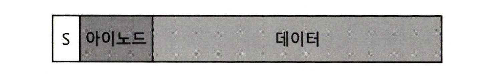
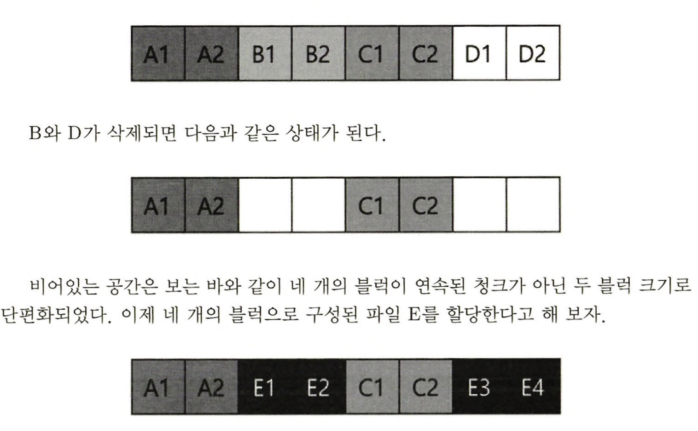
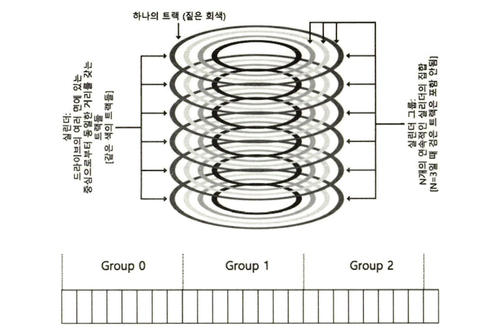
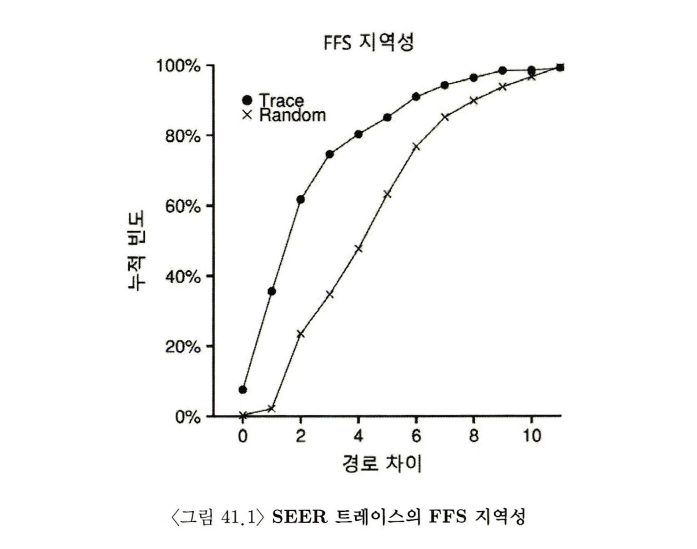
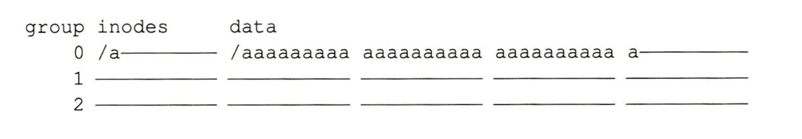
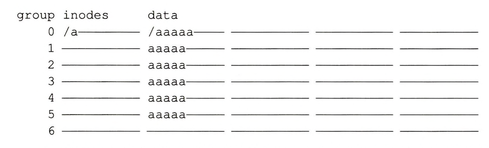
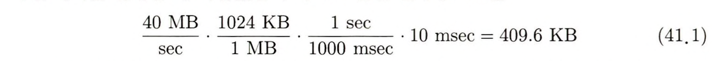
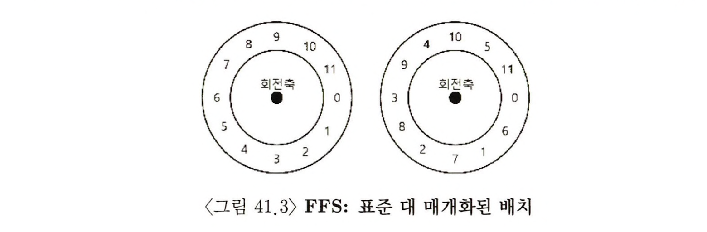

> 본 내용은 OSTEP 의 내용을 정리 및 요약한 내용입니다.
> 전문은 [이 곳](https://pages.cs.wisc.edu/~remzi/OSTEP/)을 방문하시면 보실 수 있습니다.

# 41. 지역성과 Fast File System

처음 Unix가 등장시 가장 기본적인 파일 시스템이 생기고, 이를 "오래된 UNIX 파일 시스템" 이라고 부른다. 



이 구형 파일 시스템의 장점은 단순하다는 것이며, 파일 시스템의 가장 기본적인 개념인 파일과 디렉터리만을 제공한다. 가장 기본적인 개념인 파일과 디랙토라먼울 제공하며, 그 이전시기 사용되던 레코드 기반의 저장장소시스템과 비고하면 큰 발전을 이룩했다.

특히 유닉스 파일 시스템이 가지게 된 계층 구조의 디렉터리는 이전 시스템들이 사용했던 단일 계층 디렉터리 구조와 굉장한 차이를 보였다. 

## 41.1 문제 : 낮은 성능 
- 혁신적인 시스템을 구축하였으나 성능이 매우 안좋았고, 최초 시스템에 대한 측정 결과는 파일 시스템이 디스크의 대역폭에 2%밖에 활용하지못하는 결과를 보였다. 
- 이렇게 느린 이유는 디스크를 시스템이 RAM 을 대하듯 사용했기 때문이다. 데이터를 저장하는 매체가 디스크라는 사실을 무시하고 그 특성을 무시했기 때문이다. 
- 더 나아가서 파일 시스템이 빈공간을 효율적으로 관리하지 않아서, 공간의 단편화(fragment)가 발생하게 된거고, 결과적으로 파일을 순차적으로 읽더라도 실제로는 디스크 전역을 오가며 블럭을 접근하기 때문에 성능이 심각하게 나빠진다. 

- 위와 같은 상황이 된다면 E 블럭들은 디스크 상에 흩어지게 되는데, 이때 E를 읽거나 쓸 경우 디스크의 순차 최대 성능을 얻을 수 없는 것이다. 
- 이러다보니 과거에는 조각모음 도구가 바로 이런 문제를 해결하기 위한 도구라고 보면 된다. 이를 통해 조각난 데이터들을 모으고 변경사항을 아이노드 등에 반영한다. 이를 통해 순차읽기 가능한 구조로 만들어줌으로써 성능 향상을 꾀할 수 있는 것이다. 
- 그러나 여전히 새로운 문제가 있는데, 입출력 단위가 너무 작아, 데이터를 전송하는 것자체의 근본적인 비효율성이 있다는 점이다. 
	- 작은 크기의 블럭은 `내부 단편화`를 줄인다는 장점은 있다. 
	- 하지만 디스크 헤드의 이동시간에 비해 데이터 블럭의 크기가 작기 때문에 입출력이 상대적으로 비효율적이 된다. 

<div style=“margin:10px;”>
<h3 style="display:inline-box; background-color:#666; padding:10px 10px 5px 10px; border-radius:10px 10px 0 0; margin: 0px; color:white;">🚩 핵심 질문: 성능 개선을 위해 어떻게 디스크 상의 데이터를 구성해야 할까?</h3>
<div style="display:box; background-color:#808080; margin: 0px; padding: 10px; color:black; border-radius: 0 0 10px 10px; color:white">성능을 위해 파일 시스템의 자료 구조를 어떻게 구성해야 할까? 이러한 자료구조에는 어떤 종류의 할당정책이 필요할까? 어떻게 파일 시스템에 디스크 특성을 반영할까?
</div>
</div>

## 41.2 FFS: 디스크에 대한 이해가 해답이다

- Berkeley 의 한 그룹이 이에 대해 `Fast File System, FFS` 라는 파일 시스템의 자료구조와 할당 정책을 디스크에 적합하게 설계했다. 
- 하드 디스크에 적합한 구조를 만듦으로써 성능을 개선했으며, 기존의 파일 시스템 인터페이스는 그대로 유지하면서 내부를 구현해냈다. 
- 결과적으로 거의 모든 현대의 파일 시스템은 기존의 인터페이스를 그대로 사용하면서 성능과 신뢰성, 또는 기타 다른 목적으로 내부 최적화를 진행하는 방식을 사용하게 되었다. 

## 41.3 파일 시스템 구조 : 실린더 그룹 
- 첫 번째 FFS 의 작업은 디스크에 적합한 파일 시스템으로의 수정을 진행한다. 이를 위해 여러개의 디스크를 **실린더 그룹(cylinder group)** 으로 나눈다. 
- `실린더(cylinder)`란 서로 다른 표면에 동일한 길이의 반경을 갖는 트랙의 집합들이다. 이러한 이름의 유래는 아래의 이미지를 보면 충분히 납득이 갈 것이다. 



- 현대의 드라이브는 사용 중인 실린더를 구분하기 위한 충분한 정보를 파일 시스템에게 제공하진 않는다. 그저 논리 주소 공간을 제공한다. 
- 그러므로 현대의 파일 시스템은 드라이브를 디스크의 연속적인 주소 공간의 조각을 나타내는 **블럭 그룹(block group)** 으로 구성한다. 
- 이러한 형태의 그룹을 뭐라 부르든 FFS는 같은 그룹에 두 개의 파일을 배치 함으로 FFS는 한 파일을 먼저 읽고 그 다음 파일을 읽는다 하더라도 디스크 전역에 걸친 긴 탐색을 발생하지 않도록 만든다. 
	- 이러한 파일과 디렉터리를 저장하기 위해 FFS는 그룹에 파일과 디렉터리를 넣을 방법, 정보 관리 방법이 필요했고, 이를 가능케 하기 위해 FFS는 파일 시스템에 필요시 되는 모든 구조를 각 그룹에 넣기로 한다. 
	- 그래서 나온 실린더 그룹의 구조가 다음과 같다. 


- 각 그룹에는 신뢰성을 위해 `슈퍼 블럭(S)`를 배치한다. 
	- 슈퍼 블럭 : 파일 시스템을 마운트 할 때, 여러 사본을 유지하며 그 중 하나가 깨져도 최신 사본을 사용해 파일 시스템을 마운트하여 접근할 수 있다. 
- 그리곤 아이노드와 데이터 블럭들의 할당 여부를 알 수 있어야 하므로, **아이노드 비트맵(ib)** 과 **데이터 비트맵(db)** 이 존재한다. 
	- 비트맵을 통해 파일 시스템의 빈 영역을 나타내는 방식으로 사용되어, 연속된 빈공간 찾기 및 빈 블럭 리스트를 만드는데 사용하면 단편화 문제도 개선할 수 있다. 
- 위의 데이터들 뒤에 드디어 아이노드와 데이터 블럭은 아주 단순한 파일 시스템(VSFS)에서 봤던 것과 동일한 구조로 존재한다. 

## 41.4 파일과 디렉터리 할당 정책 

- 그룹 구조가 결정 되었으니, 이제 성능 개선을 위한 파일과 디렉터리, 메타 데이터까지 어떻게 배치해서 성능을 개선할지 고민해야 한다. 
- FFS는 여기서 기본적으로 아주 간단한 원칙을 갖고 있다. 

> "관련 있는 것 끼리 모아라"

- 이 원칙을 위해선 우선 관련이라는 것을 어떻게 확인하는지? 에 대한 질문에 답이 되어야 할 것이다. 여기서 FFS는 할당된 디렉터리의 수가 적고, 사용할 수 있는 아이노드의 수가 많은 실린더 그룹을 선택해, 최대한 많은 파일들을 할당할 수 있기 위해 디렉터리 데이터와 아이노드를 해당 그룹에 저장했다. 
- 파일의 경우 2가지 방법이 있다. 
	- 아이노드와 파일 데이터 블럭을 같은 그룹에 할당하여, 가능하면 아이노드 탐색 + 데이터 탐색 의 시간을 최소화 시킨다. 
	- 동일한 디렉터리 내의 모든 파일들은 해당 디렉터리가 존재하는 실린더 그룹에 함께 저장한다. 이는 Namespace 기반의 지역성을 살리는 것인데, 다음과 같은 파일이 존재한다고 하자. 
		- /a/b, /a/c, /a/d, /k/f
		- 위의 파일 형태라고 한다면 가능하면 디렉터리가 동일한 것들은 **상식적**으로 함께 호출될 가능성이 높으니 같은 실린더 그룹에 놓는 것이다.
- 이러한 Namespace 기반 지역성으로 인해 FFS는 좋은 성능을 얻었고, 연관 파일 사이의 탐색 시간을 줄일 수 있었다. 


## 41.5 파일 접근의 지역성 측정 

- 그렇다면 지금까지 namespace에 근거한 지역성이 실제로 존재하는지를 판단해보자. 


- 위의 예시는 디렉터리 트리 내에서 파일 간의 접근이 얼마나 멀리 떨어져 있는지를 분석한 것이다. 
- 예를 들어 파일 f가 열렸고, 다시 그 파일이 열린거라면 두번의 open() 거리는 0이 된다. 즉, 특정 디렉터리에 다른 파일 두개를 열었다면, 파일 open 간의 거리는 같은 디렉터리지만 다른 파일이므로 1이 된다.
- 그렇다면 이런 기준 아래에 SEER 트레이스 탐색 결과를 보자. 
	- 본 그래프는 전체 트레이스를 합하여 지역성을 나타낸 것이며, 경로 간 거리를 x축에, 이에 대한 누적 빈도를 y 축에 표현한 것이다. 
	- 여기서 거의 40%의 경우가 같은 디렉터리 내에 파일 또는 닽은 파일을 열었다. (파일 거리 1)
	- 흥미로운 점은 25% 정도는 경로가 2만큼 떨어져 있는데, 이는 디렉터리 내에 추가로 만든 디렉터리로 묶어서 이 디렉터리에 존재하는 파일들을 번갈아 접근하는 경향이 있음을 나타낸다. 
		- 단, 이러한 지점에서 FFS는 이런 지역성을 고려하진 않아서 탐색시 기존과 유사한 탐색이 발생할 수 밖에 없는 것이다. 
	- 그 외에도 랜덤 트레이스에 대해서도 지역성이 어떻게 되는지를 살펴본 그래프가 보일 것이다. 여기서 임의의 경우는 이름 공간의 지역성이 낮은 것을 보이지만, 결국 모든 파일은 동일한 조상(루트) 를 갖기 때문에 다소 지역성은 보이며, 랜덤 트레이스는 비교 목적으로 유용하다는 정도의 의미를 얻을 수 있었다. 

## 41.6 대용량 파일 예외 상황 

- 단, 파일 배치시 예외적 상황으로 크기가 매우 큰 대용량 파일인 경우를 들수 있다. 왜냐면 그 뒤의 관련있는 파일들은 이미 너무 커서 다른 블럭 그룹에 저장되도록 만들어 파일 접근 지역성이 떨어지기 대문이다. 
- 이에 FFS 는 대용량 파일은 다른 방식으로 처리하도록 했다. 
	- 첫 번째, 블럭 그룹에 일정한 수의 블럭을 할당한 후에 FFS는 파일의 '큰 청크'를 다른 블럭 그룹에 저장한다. 그리고 파일의 다음 청크는 마찬가지로 또 다른 블럭 그룹에 저장한다. 

> FFS의 예외처리가 되지 않은 경우

> 대용량 파일로 예외처리가 들어간 파일 구조 

- 이러한 구조로 데이터를 예외처리 하는 경우 기본적으로 여러 그룹에 흩어서 저장하기 때문에 그룹들의 사용률을 너무 높지 않게 유지할 수 있다. 
- 하지만 당연히 성능이 절대적으로 좋지는 않을 것을 볼 수 있다. 
- 그러나 청크 크기가 충분히 크다면, 파일 시스템은 디스크에서 데이터를 전송하는데 대부분의 시간을 사용하고, 상대적으로 적은 시간을 블럭 청크들을 탐색하는데 사용하게 된다. 즉, 오버헤드 비용 당 더 많은 작업을 처리하면서 오버헤드를 줄일 수 있고 이를 **점진적 경감(amortization)** 이라고 부른다. 

- 예를 들어서 디스크 평균 위치 잡기 시간(탐색, 회전 시간)이 10 msec 이고, 디스크 데이터를 40MB/s 속도로 전송할 수 있다고 생각해보자. 전체 시간 중 탐색에 시간을 반을 사용하고 , 나머지를 데이터 전송에 쓰는 것이 우리의 목표라면, 10msec를 쓰고 데이터를 전송하는데 10msec 를 사용해야한다. 그렇다면 이렇게 하기 위해 청크는 얼마나 큰 사이즈면 될 것인가? 



- 보이는 바 처럼 40MB 를 전달한다고 할 때, 반은 전송, 반은 탐색을 한다면 청크가 매 탐색마다 409.6KB 데이터 크기가 된다면 위의구조를 갖추고 느려보이지만, 결국 상당한 속도로 데이터 전송이 가능하다는 소리가 된다. 

- 단, FFS는 큰 파일을 그룹들 간에 분산하느데 있어 이런 계산을 사용하진 않는다. 대신 아이노드 자체의 구조를 기반으로 한 간단한 방법을 썼다. 
	- 첫 번째 12개의 직접블럭은 아이노드와 같은 그룹에 배치하며, 각 간접 블럭과 그걸 가리키는 모든 블럭은 다른 그룹에 배치한다. 
	- 블럭 크기가 4KB이고 32비트 디스크 주소를 사용한다고 하면, 이 전략은 직접 포인터가 가리키는 파일의 첫 48KB 만 예외로 할당되고 파일의 매 1024개의 블럭(4MB)마다 다른 그룹에 배치 시킨다. 어쨌든 위에서 언급한  탐색과 전달의 비용을 점진적 경감 구조를 구현하게 되는 것이다. 
- 디스크 드라이브의 전송 속도는 빠르게 증가하는 중이다. 제조사가 같은 면적에 더 많은 비트를 저장하고 있다. 기계적 성능의 향상은 크지 않은 편이다. 
- 하지만 또 한 편으로 점차 SSD와 같은 도구들의 사용이 커지고 있고, 새로운 시스템 아키텍쳐의 제안으로 점차 저장 장치에 대한 부분도 변화를 겪고 있다. 

## 41.7 FFS에 대한 기타사항 

- FFS는 혁신적인 기법 개발하여 적용하고, 특히 작은 파일의 효율적 저장을 위해 노력했다. 그래서 당시 2KB 크기의 파일들이 많다 보니 4KB 블럭을 사용하는 것은 내부 단편화를 야기했다. 이에, `서브 블럭(sub-block)`을 도입하여서 블럭 낭비를 최소화 하려고 노력했다. 
- 파일이 커져서 4KB가 되면 512byte 크기의 블럭을 할당하고 옮겼으며, 서브 블럭들의 합이 4KB이 되면FFS는 해당 시점에 4KB 블럭을 찾아 서브 블럭을 다시 재 사용 가능하도록 만드는 구조를 짰다. 
- 물론 이러한 행동은 추가 동작으로 비효율적 오버헤드가 발생할 것이다. 그렇기에 FFS는이를 개선하고자 성능에 최적화된 디스크 배치의 아이디어를 제시한다. 
- 예를들어 아래와 같은 이미지를 생각해보자. 

- 예를 들어 왼편은 연속적으로 되어 있다. 이떄 0을 찾아 전송하고, 다음 1 블럭에 대한 읽기 요청을 한다면? **이미 늦었다** 디스크는 한바퀴를 돌고 이에 접근이 가능해질 것이다. 
- 하지만 FFS는 아예 블럭 형태르 하나 건너 하나 입력하는 식으로 해서, 헤드 아래로 순차 읽기 등에서 데이터를 읽기 전에 디스크가 돌아가지 않도록 충분한 시간을 벌어주었다. FFS는 이를 `매개화(parameterization)` 이라고 불렀다. 
- 물론, 이러한 구조는 반대로 말하면, 다 읽는데 1바퀴가 아니라 2바퀴가 필요하단 소리가 된다. 그래서, 현대의 디스크는 최대 대역폭을 얻어낼 목적으로 내부적으로 한 트랙을 모두 내부 디스크 캐시에 버퍼링한다(트랙버퍼). 그렇게 하여 트랙의 연달아 들어온 요청은 캐시에서 원하는 값을 리턴해준다.(하드디스크 상에 메모리가 있는 것이 바로 그런 이유 때문이다.)
- 추가적으로 FFS는 **긴 파일 이름**을 지원하는 최초의 시스템이 되었으며, **심볼릭 링크**도 최초로 도입했다. 하드링크의 위험성에 만들어진 것이며, 가명(alias) 구조를 통해 훨씬 융통성있고 안전한 구조를 도입한 최초의 파일 시스템이었던 것이다. 

```toc

```
