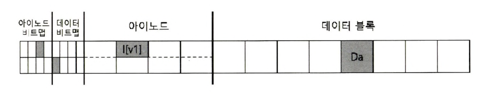
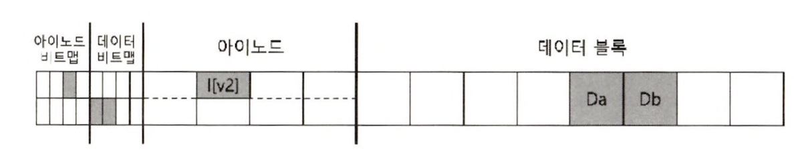
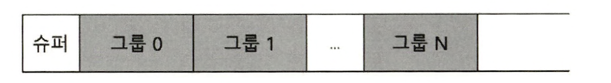
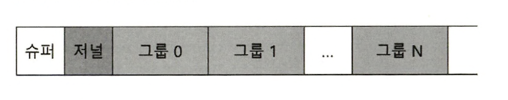
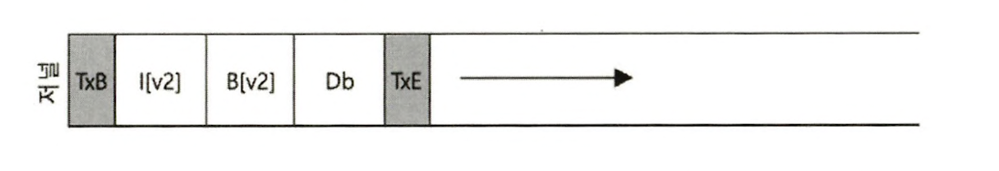

> 본 내용은 OSTEP 의 내용을 정리 및 요약한 내용입니다.
> 전문은 [이 곳](https://pages.cs.wisc.edu/~remzi/OSTEP/)을 방문하시면 보실 수 있습니다.

# 42. 크래시 일관성: FSCK와 저널링

- 파일 시스템은 자신들의 기본 개념들을 구현하는데 필요한 각종 자료구조들을 관리한다. 여기엔 파일, 디렉터리 외에 메타 데이터 들이 포함된다. 
- 여기서 핵심은 파일 시스템의 자료구조가 **안전하게** 저장되어야 한다는 점이다. 즉, 장시간 사용 후에도 유지되어야 하며 전력 손실에도 하드디스크나 플래시 기반 SSD 장치의 데이터는 손상없이 유지되어야 한다. 
- 전력 손실이나 크래시 때문에 디스크 상의 자료 구조를 안전하게 갱신하는 것은 상당히 까다롭다. 
- 파일 시스템은 크래시 일관성(crash-consistency)이라는 새로운 문제를 직면하게 된다. 

- 해당 문제가 어떤 것인가, 예를 들어 특정 작업을 위해 디스크 상에서 두개의 자료구조 A, B를 갱신해야 한다고 생각하자. 디스크는 한번에 하나만 요청을 처리할 수있으므로, 하나의 요청이 먼저 디스크에 도달할 것이다.  이때 하나만 쓰기가 완료되고 시스템 전원이 나가면 디스크 상의 자료구조는 일관성이 깨진 상태가 된다. 이러한 특성 때문에 파일 시스템에 대한 새로운 문제를 고려해야 되고 이것이 바로 크래시 일관성 문제이다. 

<div style=“margin:10px;”>
<h3 style="display:inline-box; background-color:#666; padding:10px 10px 5px 10px; border-radius:10px 10px 0 0; margin: 0px; color:white;">🚩 핵심 질문: 크래시에도 불구하고 디스크 갱신하기</h3>
<div style="display:box; background-color:#808080; margin: 0px; padding: 10px; color:black; border-radius: 0 0 10px 10px; color:white">크래시 이후에 시스템이 재구동 되면 파일 시스템을 다시 마운트하려고 할 것이다. 임의의 시간에 크래시가 발생할수 있다고하면, 파일 시스템이 어떻게 해야 디스크 상의 자료구조의 일관성이 유지될 것인가?
</div>
</div>

- 이에 대해 알기 위해 먼저 과거 파일 시스템들이 사용했던 fcsk 또는 파일 시스템 검사라는 방법을 살펴본 뒤, 저널링 또는 write-ahead logging(WAL)이라는 기법을 살펴볼 것이다. 
- 이러한 대처 방식은 기본적으로 쓰기에 오버헤드를 추가하지만, 전력 손실이나 크래시 상황에 빠른 복구를 지원한다. 

## 42. 1 예제 
- 저널링을 이해해보자. 디스크 상에서 여러개의 자료를 갱신하는연산이 있다.워크로드는 기존 여러개의 자료구조를 갱신학, 거기서 블럭 하나를 추가하는 연산이 있다고 하자. 
- 아이노드 테이블 구조는 다음과 같다고 생각해보자. 


```plain
# I 번 내부 구조
onwer       : remzi
permissions : read-write
size        : 1
pointer     : 4
pointer     : null 
pointer     : null
pointer     : null
```

- 첫 번째 파일의 크기는 1이며, 첫 번째 직접 포인터는 4번 블럭을 가리키고 있다. 나머지 포인터는 null이다. 
- 여기서 내용을 추가한다는 것은, 새로운 데이터 블럭을 추가하는 것이다. 이렇게 내용을 추가하는 것은 세개의 디스크 자료구조를 갱신해야 한다. 
	- 아이노드
	- 새로운 데이터 블럭 Db, 데이터 비트맵(B[v2])
```plain
# I[v2] 번 내부 구조
onwer       : remzi
permissions : read-write
size        : 2
pointer     : 4
pointer     : 5 
pointer     : null
pointer     : null
```
- 추가적인 내용이 변경되면서, 비트맵은 디스크에 저장이 되는데 다음처럼 될 것이다.



- 결국 위와 같은 형태를 구축하기 위해 디스크에 쓰기는 세번이나 수행되어야 한다. 아이노드, 비트맵 데이터 블럭. 이때 write()의 쓰기는 결과를 즉시 반영하는 것은 아니다. 대신 변경된 아이노드와 비트맵, 그리고 새로운 데이터는 일정 기간을 메모리에 상주하고, 파일 시스템이 실제로 디스크를 기록할때 메모리에서 이동되게 된다. 

### 크래시 시나리오

이런 상황에서 다음과 같은 한 번의 쓰기만 성공하고 나머지가 실패했다고 생각해보자. 
- 데이터 블록만 디스크에 기록된 
	- 다행이도 아이노드, 비트맵이 없으니 파일 시스템의 크래시 일관성 측면에서는 문제가 없다. 
- 갱신된 아이노드 (`I[v2]`)만 디스크에 기록됨 
	- 디스크 주소를 아이노드가 가리키지만 데이터가 없으므로, 해당 위치를 읽으면 의미 없는 데이터를 얻게 된다. 
	- 더 나아가서 파일 시스템의 `일관성 손상`이라는 새로운 문제를 만난다. 아이노드는 할당되어 있고, 비트맵과 불일치하여 일관성이 깨졌고, 파일 시스템은 이런 상황을 어떻게든 해결이 필요하다. 
- 갱신된 비트맵만 디스크에 기록됨 
	- 이 경우 아이노드가 가리키는 블록은 없다. 그러므로 파일 시스템의 일관성은 당연히 손상되었다.
- 데이터 블록을 제외하고 아이노드, 비트맵만 기록됨. 
	- 이 경우 파일 시스템의 메타 데이터의 일관성은 보장이 된다. 그저 의미 없는 값이 들어 있을 뿐인것이다. 
- 비트맵을 제외하고아이노드, 데이터는 기록됨 
	- 이 경우 디스크의 데이터를 아이노드가 제대로 가리키고 있으나, 이전 버전 비트맵과 아이노드 사이의 애용 일관성이 없다. 
- 아이노드를 제외하고 비트맵과 데이터는 디스크케 기록됨. 
	- 당연히 아이노드외에 비트맵 간의 내용이 위치하지 않는다. 아이노드 가  파일을 가리키지 않고 있으므로 해당 블록이 어느 파일에 속한지 알 수가 가.

### 크래시 일관성 문제

크래시 때문에 파일 시스템 디스크 상의 자료구조에 상당한 문제가 발생할수 있음을 보었다. 이러한 구조간의 불일치, 공간 누수가 발생할 수 있고, 이에 향상성 유지하기 위해, 중간 임시 상태(transient state)로 파일 시스템이 남아 있는 경우를 방지하는 것이 목적이다. 

## 42.2 해법 1 : 파일 시스템 검사기 

- 초기 파일 시스템에서 크래시 일관성을 해결하기 위해 사용하던 대표적 방식이 바로 `fsck`라고 한다. 
- 이러한 방식은 디스크 파티션 전체를 검사, 고치는 도구지만, 아이노드가 의미 없는 블럭을 가리키는 것에 대해서는 대처가 안된다. 
- fsck의 동작은 여러 단계로 구성되어 있고, 종료 되면 디스크 상의 파일 시스템이 일관성을 갖게 된다. 
- fsck의 기본적인 일은 다음과 같다. 
	- `슈퍼블럭` : fsck는 슈퍼블럭 내용에서 오류를 확인한다. 가장 기초로, 의심되는 슈퍼 블럭이 있는 찾아낸다. 
	- `프리 블럭` : 아이노드와 간접 블럭, 이중 간접 블럭 등을 살펴보고 파일 시스템에 현재 어떤 블럭이 할당 된 것인가 등의 정보를 생성한다. 얻은 정보로 할당 비트맵을 재구성하며, 기존 비트맵과의 일치하지 않으면 아이노드 정보를 기반으로 불일치를 해결한다. 아이노드의 비트맵의 유효성을 검사 한 뒤, 필요 시 아이노드 비트맵을 재구성한다. 
	- `아이노드 상태` : 각 아이노드의 손상 여부를 판단한다. 
	- `아이노드 링크` : 각 할당된 아이노드의 링크 개수를 확인하며, 링크의 개수는 특정 파일에 대한 참조를 포함하며, 디렉터리의 수를 나타낸다. 이를 통해 전체 링크 수를 확인하여 할당된 아이노드는 있으나, 어떤 디렉터리도 이를 참조하지 않는다면 해당 파일은 `lost+found` 디렉토리로 이동된다. 
	- `중복` : 중복된 포인터도 검사한다. 같은 블럭을 가리키는 다른 아이노드여부를 확인하며, 이때 발견시 당연히 불량이면 초기화 해버린다. 
	- `배드 블럭` : 모든 포인터 목록을 검사하면서 배드 블럭 포인터들도 함께 검사, 배드로 판단되면 당연히; 그 포인터가 유효하지 않은 공간을 참조한다고 판단한다.
	- `디렉터리 검사` :  파일의 내용을 검사하고 파악은 어려우므로 파일 시스템이 생성한 구체적이고 서식화된 정보가 있다면, fsck는 각 디렉터리의 내용에 대해서는 추가적으로 모든 내용이 제대로 저장되어 있는지를 검사한다. 
- 이러한 방식만 봐도 fsck 를 제대로 구현한다는 건 정말 보통 일이 아니다. 거기다 근본적으로 이러한 검사는 너무나 느려서, 디스크 용량이 늘거나, RAID가 대중된 현재는 사용하기 어렵다. 거기다 예를 들어 세개의 데이터 블럭을 갱신하다 생긴 문제 하나로, 디스크 전체를 다 읽어 봐야 한단 것은 정말 엄청난 비용이 아닐까?

## 42.3 해법 2: 저널링(또는 Write-Ahead Logging)

- 일관성을 담보하는 가장 해중적인 해법은 데이터 베이스 관리 시스템에서 차용된 WAL이라고 알려진 시스템이 있다. 파일 시스템에선 역사적 맥락에 따라 write-ahead logging 을 `저널링(journaling)`이라고 부른다. 이를 처음 적용한 파일 시스템은 Cedar 이며, 현대에 와서는 많은 시스템이 해당 개념을 도입했다. 리눅스의 ext3, 4, reiserfs, IBM의 JFS, SGI의 XFS, 그리고 Windows의 NTFS이다. 

- 디스크의 내용을 갱신할 때, 자료구조를 갱신 전, 해당 내용의 작업을 요약해서 디스크에 잘 알려지지 않은 위치에 요약을 기록해둔다. 새롭게 이미지 전체를 저장하든, 변경될 부분만이든 간에 미리 저장해놓으며 이를 `write-ahead(미리 쓰기)` 라고 부르며, 이런 로그라는 자료 구조에 기록해서 WAL 이라고도 부른다. 
- 이제 디스크에 갱신할 값, 즉 갱신 후에 저장될 값과 관련된 로그가 기록되니 갱신 과정에서 크래시가 발생하면 로그를 확인하고 갱신하면된다. 
- 그러나 이러한 구조적 특성상 저널링 쓰기는 당연히 느려진 성능을 일으킨다. 쓰기가 좀더 복잡해지며 느려진 것이다. 그러나 생각봐 그런 오버헤드가 심각하지 않기 때문에 많은 시스템의 복구 성능을 개선하고자 차용되는 편이다. 
- 그렇다면 실제 리눅스 시스템의 ext3 파일 시스템의 저널링 기법을 알아보자. 기본적으로는 ext2의 그것과 동일하다. 우선 디스크는 블럭 그룹으로 나뉘며, 블럭 그룹은 아이노드 비트 맵, 데이터 비트맵, 아이노드, 데이터 블럭으로 구성되며, 저널 자료구조가 새로운 핵심 자료구조다. 



- 기본적으로 구조를 보면 알겠지만, 구조 자체는 지금껏 배운 그것과 동일한데, 여기서 저널이라는 그룹이 슈퍼 블럭 다음에 배치된다. 
- 저널 영역의 위치는 다른 장치나 혹은 다른 파일 시스템에 위치시키는 것도 가능은 하다. 

### 데이터 저널링 
- `데이터 저널링`의 동작 방법을 이해해보자. 
- 우선 평범하게 아이노드, 비트맵 그리고 데이터 블럭들을 갱신하는 경우다. 디스크의 최종 위치는 각각을 기록 하기전 우선 로그(또는 저널)에 이들을 먼저 쓴다. 
- 로그 여역은 다음 처럼 작성될 것이. 

- 5개의 블록이 되는데, 트랜잭션 시작 블럭에선 연산에 대한 정보를 기록 하는데 여기서 트랜잭션 식별자(TID)와 같은 것이 추가로 기록된다. 
- 그리곤 디스크에 기록될 로깅이 그대로 기록되는데, 이를 **물리 로깅**이라고도 부르며, 실제 내용이 아니라 명령 과정 자체를 저장하는 **논리로깅** 식으로 되기도 한다. 
- 그리곤 마지막으로 트랜잭션 종료 블럭 TxE이 배치되며, 여기선 트랜잭션의 종료를 알리고, TID를 포함한다. 
- TxE가 로그에 기록되면 트랜잭션은 '커밋(Commit)'되었다고 한다. 
- 이제 트랜잭션은 안전히 기록되며, 파일 시스템 상의 자료구조들은 이제 갱신될 수 있다. 저널에 기록된 내용을 실제 위치에 반영하는 과정을 `체크 포인팅`이라고 부른다. 
- 파일 시스템 체크포인트 시, 진짜 저장할 위치에 쓰기를 성공적으로 완료되면 시스템을 성공적으로 체크포인팅 한 것이고 모든 동작은 끝난 것과 마찬가지다. 

### 복구 

### 로그 기록을 일괄 처리 방식으로 

### 로그 공간의 관리 

### 메타데이터 저널링 

### 까다로운 사례: 블럭 재활용 

### 마치며: 흐름도 

## 42.4 해법 3: 그 외 방법 


```toc

```
