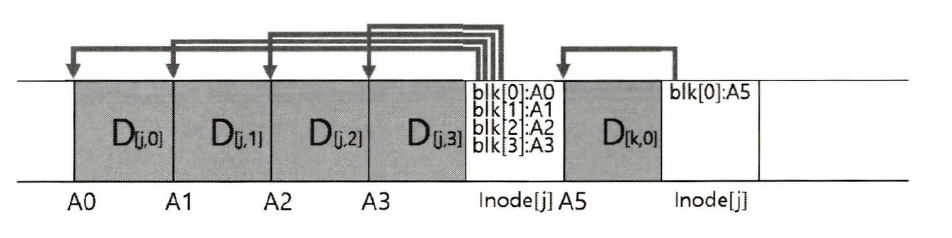
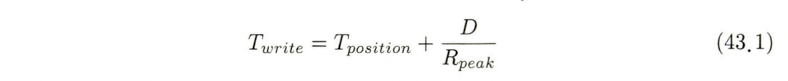
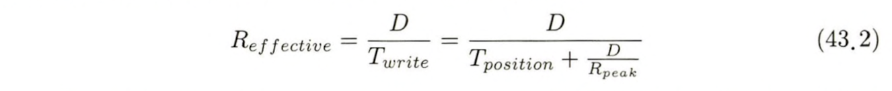
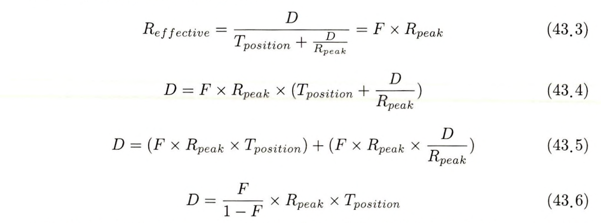
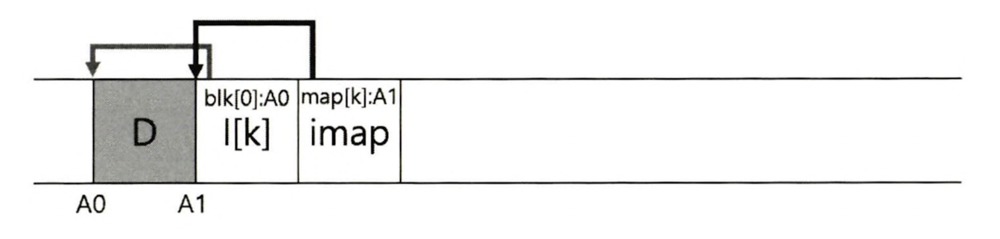
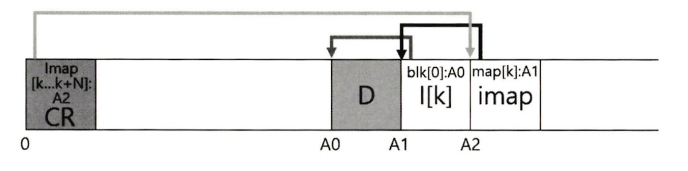
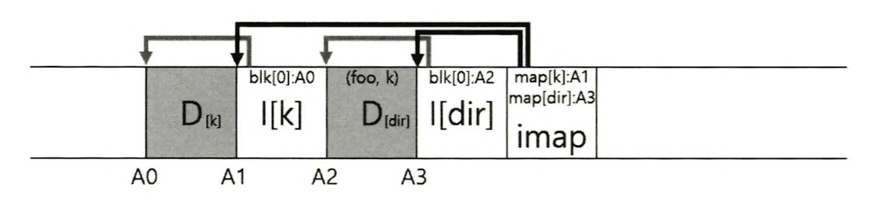

> 본 내용은 OSTEP 의 내용을 정리 및 요약한 내용입니다.
> 전문은 [이 곳](https://pages.cs.wisc.edu/~remzi/OSTEP/)을 방문하시면 보실 수 있습니다.

# 43. 로그 기반 파일 시스템
- 1900년대 초반 Berkeley 대학에서 연구한 분들은 로그 기반 파일 시스템이라는 새로운 파일 시스템을 개발한다. 이러한 연구의 동기는 다음과 같은 이유 때문이다. 
	- **시스템 메모리 크기가 증가하는 추세였다** : 이러한 특징은 파일 시스템의 성능이 대체적으로 쓰기 성능에 의해 결정되었다.
	- **임의 I/O와 순차 I/O의 성능 간격의 차가 크게 벌어졌다** : 하드 디스크 드라이브의 전송 대역폭은 꾸준히 증가해왔다. 반면 탐색, 회전 지연 비용은 그 발전 속도가 작았고, 디스크를 순차 접근만 할 수 있다면 탐색, 회전이 필요한 방식보다 큰 성능적 이득을 가질 수 있던 것이다. 
	- **대량의 일반적인 워크로드에서 기존 파일 시스템들은 성능이 좋지 않았다** : FFS는 블럭 하나의 크기의 새로운 파일을 생성하기 위해 여러번 쓰기를 해야 한다. 이렇듯 기존의 방식은 여러번의 짧은 탐색, 회전 지연, 최대 순차 대역폭이 낼 수 있는 성능에 한참 못 미치는 성능을 보여준다. 
	- **파일 시스템이 RAID를 고려하지 않았다** : 기존 파일 시스템들은 레이드에서 최악의 현상을 회피하는 노력이 담겨져 있지 않았다. 

<div style=“margin:10px;”>
<h3 style="display:inline-box; background-color:#666; padding:10px 10px 5px 10px; border-radius:10px 10px 0 0; margin: 0px; color:white;">🚩 핵심 질문: 모든 쓰기를 어떻게 순차쓰기로 변형시킬까?</h3>
<div style="display:box; background-color:#808080; margin: 0px; padding: 10px; color:black; border-radius: 0 0 10px 10px; color:white">읽기 대상이 디스크 상에 흩어져 있을 가능성이 있으므로, 읽기 동작을 순차적으로 변형하는 것은 원칙적으로 불가능하다. 단, 쓰기는 파일 시스템이 쓰기 위치를 선택할 수 있다. 이 선택의 여지를 활용하면 성능 향상을 노려볼 수 있다. 
</div>
</div>

- 이상적 파일 시스템은 쓰기 성능에 초점을 둔다. 그리고 이는 기록 뿐 아니라 메타 데이터 구조의 갱신 워크로드라던지, 레이드 환경에서도 동작이 잘 된다. 
- 여기서 연구자들이 새로이 생각한 파일 시스템이 바로 **로그 기반 파일 시스템(Log-structured file System)** 또는 짧게 **LFS** 라고 부른다. 
- 데이터 디스크 기록 시 모든 갱신 정보를 세그먼트라 불리는 메모리 자료 구조에 보관한다. 세그먼트가 가득 차면, 디스크의 `빈공간`을 찾아 한 번에 기록한다. 세그먼트가 크기때문에 디스크 기록 작업은 효율적인 작업으로 바뀌며, 디스크 성능을 최대한 활용할 수 있게 된다. 

## 43.1 디스크에 순차적으로 쓰기 
- 모든 쓰기 작업을 어떻게 순차 쓰기로 바꿀 수 있을까? 
- 데이터 블록을 기록하면 데이터만 갱신되는 것이 아니다. **메타데이터**도 함께 갱신되어야 한다. 
- 따라서 여기서 모든 갱신을 디스크에 순차적으로 기록한다는 것이  LFS의 핵심이다. 

## 43.2 순차적이면서 효율적으로 쓰기 
- 순차적인 쓰기는 효율적 쓰기를 보장할 순 없다. 왜냐면 무조건 특정 시간에 쓰기를 한 뒤, 잠시 기다렸다가 다른 시간에 어떤 연결 데이터를 또 쓰게 되면 결국 그 사이 갭은 발생하고, 디스크 회전이 발생한다. 
- 즉, 순차적 쓰기가 디스크 최대 성능을 낼순 없는 상황이 만들어지는 것이고, 따라서 다수의 순차 쓰기를(또는 하나의 큰 쓰기)를 한번에 디스크에 내려보내야 빠른 쓰기 성능을 얻을 수 있다. 
- LFS는 이를 위해 **쓰기 버퍼링** 이라는 고전적 기법을 도입한다. 이 방법의 핵심은 메모리에 갱신 전 내용을 보관, 충분히 쌓인 상황에서 모두 디스크로 전달하는 방식을 의미한다. 
- **세그먼트** : 이러한 LFS에서 한번에 디스크에 기록하는 단위, 여러 장소에서 쓰는 단어니 햇갈리면 안된다. 핵심은 세그먼트 버퍼를 한번의 쓰기 연산으로 디스크에 기록하는데, 세그먼트가 충분히 크면 쓰기 연산은 효율적이 된다. 

- LFS가 두개의 갱신 사항을 갱신한 것이 다음과 같다. 첫번째 갱신 사항은 파일j에 대해 4개의 블록을 쓰는 것이며, 두번째는 하나의 데이터 블럭만을 갖고 있고, LFS는 일곱개의 블럭으로 이루어진 세그먼트 전체를 디스크로 한 번에 커밋한다. 

## 43.3 적절한 버퍼의 크기는?
- 그러면 여기서 해당 질문이 나오게 된다. 과연 얼마나 큰 사이즈의 세그먼트를 설정해야 하는 것인가? 이 사항은 디스크의 물리적 특성에 의해 달라지게 된다. 
- 예를 들어 쓰기 시 발생하는 위치 잡기(회전-탐색의 오버헤드)에 드는 시간이 Tposition 초가 걸린다고 할 때, 디스크 전송 속도는 Rpeak 라고 해보자. 그 뒤에 매번 디스크 헤드를 이동하는 비용이 존재한다. 그러면 위치 잡기 비용을 상쇄하기 위해서는 얼마나 크게 써야하는가? 이에 대한 답은 **클수록 좋으며** 최대 대역폭에 더 근접할 수 있다. 
- `D` MB 크기를 쓴다고 가정하면, 이 데이터 청크를 쓰는 데 소요되는 시간,은 위치 잡기 시간 더하기 D를 전송하는 시간이다. 

- 실제 쓰기 속도는 R(effective)이며, 쓰인 데이터의 총량을 해당 데이터를 쓰는데 소요된 총 시간으로 나눈 값을 나타낸다. 

- 최대 속도에 근접하도록 유효속도를 구하고자한다. 유효 속도가 최대 속도의 특정 비율(F)가 되도록 하는 것이다. 


## 43.4 문제 : 아이노드 찾기 
LFS 에서 아이노드의 위치를 파악하는 방법을 알아본다. 일반적인 Unix 파일 시스템에서 아이노드를 찾는 방법을 살펴보면 FFS 와 같은 파일 시스템이나 그보다 오래된 Unix 파일 시스템에서 아이노드를 찾는 것은 간단하다. 정해진 위치에 배열로 배치되기 때문이다. 
전통적인 파일 시스템은 특정 아이노드의 위치는 아이노드 번호에 아이노드의 크기로 곱하고 배열의 시작 주소에 더하면 구할 수 있다. 
FFS 에서는 다소 복잡한데, 아이노드 테이블을 분할하여 실린더 그룹마다 아이노드 그룹을 넣어두기 때문이다. 
LFS의 경우에는 더 복잡한데, 아이노드가 디스크 전역에 흩어져 있기 때문이며, 원 위치에 덮어쓰기를 하지 않기 때문에 최신 아이노드의 위치가 계속 변하기 때문이다. 

## 43.5 간접 계층을 이용한 해법: 아이노드 맵 
LFS의 특성으로 아이노드가 디스크 전역에 흩어져 있으므로, **아이노드 맵(inode map, imap)** 이라는 자료구조를 개발해낸다. 

아이노드 맵에서 해당 imap 자료구조는 번호를 입력하여 가장 최신의 아이노드의 위치를 구한다. 그 뒤에 항목당 4바이트 크기를 갖는 배열로 구현 될 수 있다. 디스크에 아이노드가 기록될  때 imap 은 새로운 위치를 가리키도록 갱신된다. 

imap은 안전하게 보관되어야 한다. 그래야 LFS에 크래시가 발생해도 아이노드의 위치를 파악할 수 있다. 

imap을 디스크의 고정된 위치에 배치하는 방법이 있다. imap은 자주 갱신된다. 파일 시스템의 내용이 변경될 경우 imap을 새로 기록해야 하고, 이런 잦은 갱신은 성능에 저하를 초래한다. 

LFS 에서는 아이노드 맵을 새로이 시록된 데이터와 아이노드들 옆에 함께 기록한다. 파일 k에 데이터 블럭을 추가할때, LFS는 다음의 그림과 같이 새로운 데이터 블럭과 해당 아이노드 그리고 아이노드 맵의 일부분을 연속하여 디스크에 기록한다. 



`blk[0]:A0`는 첫 번째 블럭의 주소가 `A0` 라는 뜻이다 `I[K]`는 K 번째 아이노드를 나타낸다. `map[K]:A1`은 K 번째 아이노드 A1에 위치해 있다는 뜻이다. 이 그림에서는 imap이라고 표기된 블럭에 저장되어 있는 아이맵의 일부가 아이노드 k를 가리킨다. 그리고 아이노드 k는 데이터가 디스크 주소 A1에 있다고 나타내고 있고, 이 아이노드는 데이터 블럭 D가 A0주소에 시작한다는 정보를 갖고 있다. 

## 43.6 해법의 완성: 체크포인트 영역 

위의 방식으로 만들어지면, 아이노드 맵도 블럭이 되어서 디스크 상에 흩어지게 된다. LFS는 디스크 상에서 약속된 위치에 각 imap 블럭들의 위치를 기록한다. 이를 **체크포인트 영역(checkpoint region, CR)** 이라고 부른다. 체크포인트 영역은 주기적으로 갱신이 되며 성능에 큰 악영향은 없다. 디스크 상의 파일 시스템 영역에 체크포인트 영역이 할당되며, 아이노드 맵의 최신조각을 가리킨다. 그러면 아이노드 맵 조각들이 아이노드를 가리키고, 아이노드가 파일의 영역을 가리킨다. 


## 43.7 디스크에서 읽기: 요약 
LFS의 동작 방식의 이해를 정리한다. 
- 가장 처음 읽어야 하는 디스크 상의 자료구조는 체크포인트 영역이다. 이 영역은 전체 아이노드 맵 블럭들을 가리키는 포인터들을 갖고 있다. 
- LFS는 아이노드 맵 전체를 읽어서 메모리에 캐시해둔다. 파일의 아이노드 번호를 탐색한 뒤, imap의 아이노드 디스크 주소 매칭에서 아이노드 번호를 찾아내고 최신의 아이노드 읽기를 수행한다. 
- 그 뒤 내용은 동일하며 아이노드를 읽어들인 이후로는 직접 포인터를 따라가거나, 간접 포인터, 혹은 이중 간접 포인터를 필요에 따라 따라 간다. 보통의 경우 LFS는 일반 파일 시스템이 수행하는 개수 만큼 입출력 처리하여 파일을 읽으며, imap 전체가 캐시되어 있으므로 LFS가 추가로 하는 일은 imap에서 아이노드 주소를 찾아 읽는 것 뿐이다. 

## 43.8 디렉터리 관리 방법은?

디렉터리 자료구조는 LFS에서 전통적인 UNIX 파일 시스템과 기본적으로 동의하다. 디렉터리는 매핑 정보(이름, 아이노드 번호)로 구성되어 있다. foo 라는 파일을 디렉터리에 생성하기 위해 다음과 같은 자료구조를 디스크에 추가 기록한다.



아이노드 맵 블럭은 디렉터리 파일 dir 과 생성된 파일 foo의 아이노드 위치를 갖고 있다. 

아이노드 맵은 `재귀 갱신문제` 라는 LFS에 존재하는 심각한 문제를 해결한다. 이 문제는 원래 위치에 덮어쓰지 않고 갱신 내용을 디스크의 새로운 위치에 갱신하는 파일시스템에는 모두 존재한다. 아이노드가 갱신되면 디스크 상의 아이노드의 위치가 바뀐다. 만약 디렉터리의 항목들이 아이노드의 위치를 직접 가리키도록 설계되었다면, 아이노드의 위치가 변경되면 디렉터리의 데이터 블럭도 갱신되어야 한다. 이런 메커니즘 하에서는 디렉터리의 부모 디렉터리도 갱신해서 루트까지 올라가면서 수정이 필요하다. 

LFS 는 이 문제를 imap을 사용하여 아이노드 위치가 변경되더라도 변경 내용은 디렉터리 내에 직접 반영되지 않는다. 디렉터리에는 동일한 이름-아이노드 번호 매핑을 유지하면서, imap 자료 구조를 갱신한다. 

## 43.9 새로운 문제: 가비지 컬렉션 

좋아보이지만 결국 LFS는 갱신된 파일을 계속 새로운 위치에 쓰게 되고, 이 방식은 쓰기 동작을 효율적으로 수행하는 것이 목적이다. 하지만 기존의 값이 디스크에 그대로 남는다는 단점이 생기고, 사용되지 않는 디스크 공간을 차지하는 **가비지(Garbage, 쓰레기)** 문제를 가지게 된다. 

구 버전의 아이노드와 데이터 블럭등을 어떻게 해야 할까? 파일 예전 버전으로 복원하는데 사용할 수도 있다. 이렇게 파일 시스템을 버전 파일 시스템(versioning file system) 이라고 부른다. 

그러나 LFS는 최신만을 유지하고, LFS는 주기적으로 백그라운드에서 이전 버전의 데이터와 아이노드, 다른 자료 구조들을 찾아 제거한다. 이 작업은 일종의 **가비지 컬렉션**의 일종이다. 

만약에 LFS의 가비지 컬렉터가 데이터 블럭과 아이노드 등을 하나씩 순회하며 해제한다면, 파일 시스템에 여러 **구멍**과 할당된 디스크 공간이 섞여 있는 문제가 발생할수 있다. 순차적으로 쓸 수 있는 연속적인 영역을 찾을 수 없어지므로 LFS의 쓰기 성능 저하를 초래하게 된다. 

그렇기에 LFS의 가비지 컬렉터는 세그먼트 단위로 동작한다. 큰 공간 단위로 공간을 해제함으로 연속 쓰기를 개선한다. LFS의 가비지 콜렉터는 주기적으로 오래된 세그먼트들을 읽고 해당 세그먼트의 최신 블럭(유효한)들의 개수를 파악한다. 최신 버전 블럭들을 새로운 세그먼트로 이동한다. 유효 블럭들을 모두 이전한 후, 해당 세그먼트는 빈 공간으로 표시한다. 구체적으로 말하자면, 가비지 콜렉터는 M개의 기존의 세그먼트들을 읽은 후에 해당 내용으로 N개의 새로운 세그먼트들에 채운다. (이때 N < M 이다) 이전의 M 개의 세그먼트들은 해제가 되며 파일 시스템이 추후 요청되는 쓰기들의 처리에 사용한다. 

이로써 쓰기 성능 문제까지 해결 되었으며, 그러나 아직 두가지 문제가 남아 있다. 첫 번째는 동작 메커니즘에 대한 것이며, 블럭의 살아 있고 죽음을 알 수 있는지- 에 대한 부분이며, 두번째는 가비지 컬렉터는 얼마나 자주 실행되어야 하고 몇 개의 세그먼트를 가비지 컬렉션을 해야하는지에 대해서 이다. 

## 43.10 블럭의 최신 여부 판단 
첫 번째 문제에 대해서 생각해보면, LFS는 세그먼트 S에 존재하는 데이터 블럭 D에 대해 최신인지 아닌지를 판단할 수 있어야 한다. 

LFS는 각 데이터 블럭D에 대해 D가 속한 파일의 아이노드 번호와 파일내에서 오프셋을 저장한다. 이 정보는 세그먼트의 첫 머리에 **세그먼트 요약블럭(segment summary block)** 이라 부르는 자료구조에 기록된다. 이 정보는 유효성 검사에를 위해 활용되며, 디스크 주소 A에 위치한 블럭 D의 유효성 여부를 판단하는 과정을 알아보면 다음과 같다. 

세그먼트 요약 블럭에서 블럭 D의 아이노드 번호 N과 오프셋 T를 파악한다. 그 다음 imap에서 아이노드 N의 위치를 찾고, 디스크에서 그 N을 읽는다. 마지막으로 아이노드를 이용하여 오프셋을 T에 해당하는 블럭의 디스크 위치를 알아낸다. 파악된 위치가 주소 A와 일치하면 블럭 D는 유효한 블럭이다. 만약 파악된 위치가 D의 위치와 다르면, D는 유효하지 않다. 이 과정을 의사 코드로 정리하면 다음과 같다. 

```c
(N, T) = SegmentSummary[A];
inode = Read(imap[N]);
if (inode[T] == A)
	// 블럭 D는 유효함
else
	// 블럭 D는 가비지 
```

이 방식은 다소 복잡하고, 성능의 문제가 발생할 수 있다. 따라서 좀더 빠른 유효성 판단 기법도 존재한다. 

## 43.11 정책: 어떤 블럭을 언제 정리하는가

가비지 컬렉션 시기와 가비지 컬렉션 대상 블럭을 결정하는 정책이 필요하다. (1) 주기적으로 수행하는 방법이나 (2) 유휴 시간에 하는 방법 또는 (3) 디스크가 가득 차서 어쩔수 없이 할수 밖에 없을 때 하면 된다. 

어느 블럭들을 가비지 컬렉션할지를 정하는 것은 좀더 도전적인 방식이 있는데, 핫, 콜드로 구분하는 방법이 대표적이다. 핫 세그먼트는 해당 세그먼트의 내용이 빈번하게 갱신되는 세그멘트를 말한다. 이러한 상황에서 최선의 정책은 가비지 컬렉션하기 전에 충분히 긴 시간을 기다려서 더 많은 블럭들이 덮어 써지도록 하여, 유효 블럭의 개수를 최대한 줄이는 것이다. 이렇게 하면 유효 블럭을 새로운 세그먼트에 복사하는 부담없이 해당 세그먼트를 해제할 수 있다. 콜드 세그먼트는 몇 개의 무효 블럭들이 있지만 대부분의 블럭들은 갱신되지 않은 세그먼트를 일컫는다. LFS의 저자들은 콜드 세그먼트들은 자주, 핫 세그먼트는 긴 간격으로 클리닝 하는 것이 좋다고 결론 지었다. 단, 이게 완벽하진 않고 또 다른 더 좋은 방법들도 나타난다. 

## 43.12 크래시로부터의 복구와 로그 

마지막 문제로 LFS에서 디스크 쓰기 도중에 시스템이 크래시 되면 어떻게 되는가? LFS는 기본적으로 쓰기 데이터를 세그먼트 버퍼에 먼저 기록하고 해당 세그먼트 버퍼를 (세그먼트가 가득차면 또는 일정한 시간이 흐르면) 디스크에 기록한다. LFS는 이러한 쓰기를 로그(log)로 구성된다. 체크 포인트 영역에 첫 번째와 마지막 세그먼트를 가리키는 포인터를 두고, 각 세그먼트는 다음 세그먼트를 가리키는 포인터를 둔다. 일종의 링크드 리스트로 연결된 셈이며, 체크포인트 영역의 해당 정보는 주기적으로 갱신된다. 

두번째 경우, 즉 체크포인트 영역이 갱신되는 도중에 크래시가 발생하는 경우를 살펴본다. 우선 체크포인트 영역은 원자적으로 갱신되어야 한다. LFS는 이를 보장하기 위해 두개의 체크포인트 영역을 둔다. 두 개의 체크포인트 영역을 디스크 양 끝에 위치 시키며, 교대로 갱신한다. 이 체크포인트 영역의 경우 LFS는 먼저 체크포인트 헤더를 기록한 후 내용을 쓰고, 최종 마지막 블럭 값을 갱신하며, 마지막 블럭에 현재 시간값도 포함되어 있다. 성공적인 체크포인트 갱신의 경우, 헤더 블럭의 시간값 < 마지막 블럭의 시간값 의 형태를 갖게 된다. 만약 체크포인트 영역 갱신 중에 크래시가 발생하는 경우, 복구 시 LFS는 헤더의 시간값과 마지막 영역을 비교 헤더 블럭 > 마지막 블럭 , 이러한 관계임을 알게 되면 갱신 중 크래시 발생으로 판단한다. LFS는 유효한 시간값 쌍을 갖는 가장 최근 체크포인트 영역을 선택한다. 

> 팁 : 단점을 장점으로 바꾸기 
> 시스템에 근본적 결함이 발생한다면, 그런 경우 단점을 장점으로 전환시킬 수 있는지를 보아야 한다. 

이제 다시 첫 문제 영역을 다뤄보면, LFS는 양 30초마다 체크포인트 영역을 갱신한다. 크래시 시점을 기준으로 최대 30초 이전의 상태를 반영할 수도 있다. 재 부팅 시 복구 과정에서 LFS는 체크포인트 영역을 읽어서 imap 조각들이 가리키는 곳을 확인하여 파일, 디렉터리들을 복원하면, 마지막 수초 간의 갱신 내용들이 손실되는 것은 피할 수 없다. 

이를 개선하고자 LFS는 DB에 사용되는 **롤 포워드(roll foward) 기법**을 적용한다. 이는 최신 체크 포인트 영역에서 시작한다. 복구 모듈은 체크 포인트 영역을 읽어들여 세그먼트 리스트 마지막 세그먼트 위치를 파악한다. 각 세그먼트들은 다음 세그먼트 포인트를 갖고 있으면서, 체크포인트가 가리키는 마지막 세그먼트를 읽어서, 이 세그먼트가 가리키는 다음 세그먼트의 존재 여부 검사, 필요하다면 체크포인트의 마지막 세그먼트를 가리키는 포인터를 갱신하는 식으로 순회하고, 마지막 체크포인트 이후의 데이터와 메타데이터를 복구한다. 

## 43.13 요약

LFS는 새로운 디스크 갱신 방법을 소개하였다. 파일들을 원래의 자리에 덮어쓰는 대신 항상 디스크에서 사용되지 않은 부분에 쓰고, 나중에 오래된 것들을 가비지 컬렉션을 통해 공간을 확보한다. 이는 DB 시스템에서 쉐도우 페이징(shadow paging) 이라고 부르며 , 파일 시스템에서는 때로는 쓰기 시 복사(copy-on-write)라고 부른다.  LFS는 모든 갱신들을 메모리 상의 세그먼트에서 다같이 모아서 순차적으로 쓸수 있어서 그 쓰기는 매우 효율적이다. 

큰 크기의 쓰기를 하는 LFS는 여러 장치에서 훌륭한 성능을 보여주며, 하드디스크는 최적화를 하며, RAID-4, 5와 같은 패리티 기반의 RAID에서 작은 쓰기 문제를 완전히 없앨 수 있고, 플래시 기반의 SSD에서 고성능을 얻기 위해 I/O의 크기가 커야 한다는 것을 보였다. 

단, 단점은 LFS 방식이 가비지를 만들어 낸다는 점이며, 공간을 주기적으로 확인하고, 이를 컬렉션하는 비용에 대한 우려 때문에 LFS는 그다지 큰 여파를 일으키지 못했다. 그러나 이후 최신의 플래시 기반의 SSD와 같은 상용 파일 시스템은 LFS와 유사한 Copy-on-write 방식으로 디스크에 기록한다. 이러한 아이디어에서 파일시스템의 이전 버전들을 스냅셧(snapshot)으로 유지하여 사용자가 실수로 현재 것을 지웠다하더라도 오래된 파일들을 접근할 수 있도록 하였다. 

```toc

```
