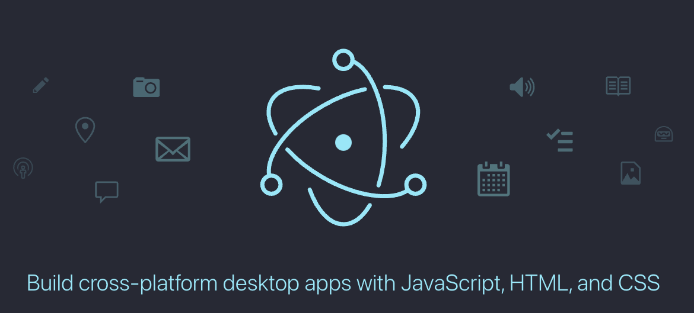

# 프롤로그

어제의 6회 평가를 마무리 짓고, 미친듯이 무거운 몸과 마음. 왠지 하고 싶지 않은 미니톡 과제... 딴짓을 하고 싶지만 하다못해 유용한 딴짓을 해보고 싶어(ㅋㅋ) 이렇게 자료로 남겨둘 것들을 정리해보고자 합니다.

처음 이걸 알게된 것은 우연치 않게 노마드 코더 유튜브 였습니다. 처음엔 별 생각이 없었는데....

<center>
<figure>
<iframe width="560" height="315" src="https://www.youtube.com/embed/6Ep8ot0ABH0" title="YouTube video player" frameborder="0" allow="accelerometer; autoplay; clipboard-write; encrypted-media; gyroscope; picture-in-picture" ></iframe></figure><figcation>이런게... 있었다고?!</figcaption>
</center>

정말 충격과 공포가 아닐 수 없는 프레임워크. 이걸 보는 순간 이게 필요하단 생각을 아니 할 수 없었습니다...!

크롬 엔진을 바닥에서 돌게 만들고, JS와 웹을 위한 도구들을 활용하여 브라우저에서 사용하는 웹앱을 시스템과 연결시켜주는 활용성... 이건 현재의 웹 기반의 모든 서비스들을 위해 정말 필수적인 요소라는 확신을 가질 수 밖에 없는 기술이었습니다. 모바일 시장을 위해, 또 모바일에서 이어서 태블릿이나 PC 시장까지도 생각해볼만한 툴이라니, 이건 활용하는 방법만 잘 고려한다면 정말 획기적으로 개발 코스트를 줄이면서도 서비스로써 구색을 갖춘 무언가를 만들 수 있어 보였습니다.

그리하야... 길고긴 서론 끝에 오늘은 딴짓으로 노는 겸 해서 해당 프레임워크 `electron`의 소개 페이지를 번역하고, 배경지식으로 쌓아두려고 합니다. 당분간 42 과제를 해야하지만, 마치면 제일 먼저 손을 데보고자 합니다. 혹시나 원문을 보시고 싶으신 분은 [이 링크](https://www.electronjs.org/docs/latest/)를 참조해 주십시오.

---

# Introduction

Electron 문서를 보신 당신, 환영합니다! Electron app 을 처음 개발하려 한다면, Getting Started 섹션을 읽고 기본적인 부분에 친숙해지는 시간을 가지시면 좋을 것입니다. 그게 아니라면 API 문서를 자유롭게 탐험하셔도 좋구요!

## Elctron 이란 무엇인가?

Elctron 은 JavaScript, HTML, CSS 를 이용하는 데스크톱 어플리케이션을 빌드할 수 있는 프레임 워크 입니다. [Chromiun](https://www.chromium.org/chromium-projects/)과 [Node.js](https://nodejs.org/en/)를 바이너리로 포함 함으로써 Electron은 JavaScript 기반, 크로스 플랫폼 기반(맥, 윈도우즈, 리눅스)의 어플리케이션의 제작, 관리를 가능케 합니다. 네이티브적 개발 경험을 필요로 하지 않지요.

## 전제조건

이 API 문서는 Node.js와 전반적인 웹 개발 환경에 친숙한 독자들이란 가정하에 진행되는 문서입니다. 만약 이러한 분야에 대해 더 친숙해지기가 필요하시면 다음과 같은 링크를 추천드립니다.

- [Getting started with the Web(MDN)](https://developer.mozilla.org/en-US/docs/Learn/Getting_started_with_the_web)
- [Introduction to Node.js](https://nodejs.dev/learn)

더불어 크로미움 프로세스 모델에 대해 안다면, Electron이 어떻게 작동하는지에 대해 더 이해할 수 있을 겁니다. 만약 빠르게 크롬의 아키텍쳐에 대해 이해를 원한다면 [Chrome comic](https://www.google.com/googlebooks/chrome/)을 참고하세요. 비록 2008년 크롬이 런칭 될 때의 것이긴 하지만, 핵심적인 내용들은 여전히 Electron을 이해하는데 도움을 줍니다.

## Running examples with Electron Fiddle

[Electron Fiddle](https://www.electronjs.org/fiddle)은 Electron의 유지관리팀이 지원하는, 일렉트론으로 쓰여진 샌드박스형 앱 입니다. 개발 과정에서 기능의 프로토타입을 만들거나, Electron의 API 를 실험하여 배우는 용도로 설치하시는 걸 추천드립니다.

Fiddle은 또한 우리의 문서와도 잘 통합되어 있기 때문에, 튜토리얼 안의 예제들을 탐색할 때 이를 'Open in Electron Fiddle' 를 종종 보시게 될 것이고, Fiddle이 설치되어 있으시다면, 이를 자동적으로 로드하여 Fiddle을 통해 손쉽게 열람해 보실 수 있습니다.

---

# 에필로그

어찌 보면 굉장히 심심한 내용이기도 하고 단순 정보 저장용이란 느낌으로써봤는데 가이드 문서라 그런지 더 심심하단 생각이 드는군요. 그럼에도 보면서 알 수 있던 점은

1. 필요한 것, 핵심적으로 먼저 알아야 할 것이 무엇인지를 알 수 있었고
   - JavaScript(Node.js 포함?), HTML, CSS, REACT,
2. 이 API 및 프레임워크를 활용할 때 할 수 일의 수준, 하지 못하는 영역은 어떤 건지 대충은 감이 왔고
   - Native 기능 일부 구현불가 예상됨(맥 OS 위젯 등)
3. 해당 API를 공부할 방법을 알 수 있었습니다.
   - Fiddle을 활용한 앱구동 테스트 등..

자바 스크립트 공부를 하겠다고 마음 먹은 이상, 이걸 활용해서 중소형 프로젝트를 하나 해보던지, 좀더 디테일하게 파고 들어 하나 제대로 웹 - 서버까지 깊이를 더한 녀석을 만들어볼까 생각이 듭니다. 노마드 코더에서 운영하는 홈페이지에서 클론코딩 강좌로 웹앱 개발이 있던데 그런걸 이용해서 만들어볼까 싶기도 하네요. 무엇이 되었든, 현재 개발자로써 커리어를 생각해보고, 한국에서 무언가 해낼 수 있는 개발자가 되기 위해선 웹 개발 경험이 없어서는 안될텐데 처음 막연했던 것보단 이런 목표를 가지고 생각하니 훨씬 자바스크립트를 해야할 이유(?) 를 찾은 것 같아 기쁩니다.

현재 진행 중인 CS, 알고리즘 스터디가 어느정도 끝나고 나면 바로 진행해보고자 합니다!

```toc

```
