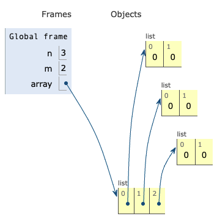
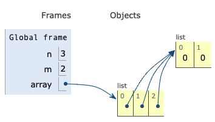
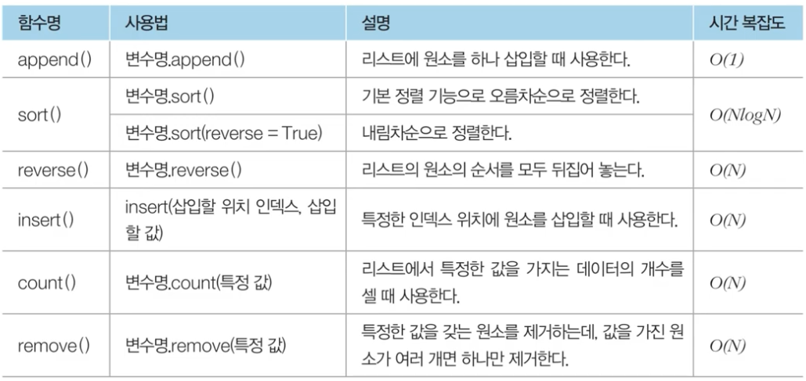

# Introduction

본 포스트는 알고리즘 학습에 대한 정리를 재대로 하기 위하여 남기는 것입니다. 더불어 기본 내용은 나동빈 저의 〖이것이 취업을 위한 코딩 테스트다〗라는 교재 및 유튜브 강의의 내용에서 발췌했고, 그 외 추가적인 궁금 사항들을 검색 및 정리해둔 것입니다.

# 리스트 자료형

## 리스트 자료형의 개념

- 여러개의 연속적 데이터 처리용인 자료형 입니다.
- C나 자바의 배열(Array)의 기능및 연결리스트와 유사한 기능을 지원합니다.
- C++ 의 STL vector 와 기능적으로 유사합니다.
- 리스트 대신 배열 혹은 테이블 이라고도 합니다. 형태에 따라 단일 차원~ 다차원 리스트가 존재할 수 있습니다.

## 리스트 초기화

```python
a = [1, 2, 3, 4, 5] # 대괄호 {} 와 쉼표 , 로 리스트 안에 원소들을 지정할 수 있습니다.
print(a)
print(a[3]) # 리스트의 특정 인덱스의 원소를 지정할 때
n = 10
a = [0] * n # 이런 식으로 할당을 하여도 인덱스 n-1 번까지 초기화 된 리스틀 얻을 수 있습니다.
print(a)

# 출력 결과
[1, 2, 3, 4, 5]
4
[0, 0, 0, 0, 0, 0, 0, 0, 0, 0]
```

## 리스트의 인덱싱과 슬라이싱(Indexing and Slicing)

- 인덱스 값을 입력하여 리스트의 특정 원소 접근하는 것을 인덱싱(Indexing)이라고 합니다.
  - 파이썬에선 인덱스의 값은 양, 음 모두 사용할 수 있다는 점이 매우 특이한 부분입니다.
  - 음의 정수를 넣으면 0번 인덱스에서부터 거꾸로 리스트의 원소를 찾아 들어갑니다. 이는 기믹적으로 활용 가능한 부분입니다.
- 연속적 위치를 갖는 원소들을 가져 올 때 ⇒ 슬라이싱(slicing)이라는 방식을 활용하실 수 있습니다.
  - 대괄호 안에 콜론(:)을 넣어서 시작위치, 끝 위치 인덱스를 설정하면, 리스트 상에 해당하는 인덱스까지만 보여주게 됩니다.
  - 이때, 주의할 점은 끝 인덱스는 실제 포함시킬 원소의 인덱스 보다 1 크게 설정해야 내가 원하는 인덱스까지 지정할 수 있습니다.

```python
a = [1, 2, 4, 5, 4, 7, 8, 9]
print(a[5])
print(a[-5])
a[3] = 7
print(a)
print(a[3:5]) # 3, 4번 인덱스의 값만 가져올 수 있다.

# 출력 결과

7
5
[1, 2, 4, 7, 4, 7, 8, 9]
[7, 4]
```

## 리스트 컴프리핸션(Comprehension)

- 리스트 컴프리헨션은 대괄호 안에 조건문, 반복문을 적용함으로써 리스트의 초기화에 필요한 코드 줄수를 확실하게 줄일 수 있는 방법입니다.

* list comprehension 은 2차원 리스트를 초기화 할 때 효과적으로 사용할수 있습니다.
* N \* M 크기의 2차원 리스트를 한번에 초기화 해야 하는 경우...

- `array=[[0]*m for _ in range(n)]`
  

- 여기서 중요하게 실수하면 안되는 부분은 만약 2차원 리스트를 초기화 시 다음과 같이 작성하면 예기치 않은 결과가 나올 수 있다는 점입니다.
  - 잘못된 예시 : `array=[[0]*m]*n`
    ⇒ 이 코드는 전체 리스트 안에 포함된 각 리스트가 모두 같은 객체로 인식되어버립니다. 즉 2차원 배열의 한 덩어리 하위 원소를 가진 걸 여러개 만드는데, 이때 같은 하위 리스트를 지칭하게 됨에 따라 C의 포인터 구조처럼 값이 하나로 뭉쳐서 초기화 됩니다.
    

```python
array1 = [i for i in range(10)] # i = 값, i = 인덱싱, range() 인덱싱의 범위를 지정
print(array1)

array2 = [i for i in range(20) if i % 2 == 1]
print(array2)

array3 = [i * i for i in range(1, 10)] # 필요한 값의 형태는 보는 것처럼 자유롭게 세팅이 된다.
print(array3)
print(array3[1])

# 출력 결과
[0, 1, 2, 3, 4, 5, 6, 7, 8, 9]
[1, 3, 5, 7, 9, 11, 13, 15, 17, 19]
[1, 4, 9, 16, 25, 36, 49, 64, 81]
4
```

## 리스트 컴프리헨션 vs 일반적인 코드

- 위에서 언급했던 리스트 컴프리헨션의 강력한 기능을 보실 수 있습니다. C와 같은 저급 언어에 가까운 프로그램 언어에서 초기화 하는 작업을 상당히 단축시켜줍니다.

```python
array1 = [i for i in range(20) if i % 2 == 1]
print(array1)

array2 = []
for i in range (20):
 if i % 2 == 1:
  array2.append(i)
print(array2)

# 출력
[1, 3, 5, 7, 9, 11, 13, 15, 17, 19]
[1, 3, 5, 7, 9, 11, 13, 15, 17, 19]
```

## 언더바 <kbd>\_</kbd> 를 사용하는 경우

- 반복을 수행하되 반복을 위한 변수의 값이 굳이 필요하지 않은 경우 언더바( <kbd>\_</kbd> ) 를 사용하면 됩니다.

  ```python
  # code 1 : 1부터 9까지의 자연수를 더하기
  summary = 0
  for i in range(1, 10):
  	summary += i
  print(summary)

  # code 2 : Hello world를 5회 출력
  for _ in range(5):
  	print("Hello World")
  ```

## 리스트 관련 파이썬 메서드

- 메서드란 객체지향언어의 클래스에서 비롯하여 함수와 유사한 역할을 합니다. 파이썬에서 기본적으로 지원하는 메서드로, 사용 시 리스트형 자료들에 대한 손쉬운 사용례를 제공합니다.
  

```python
# 리스트 관련 메서드 용례 정리
a = [1, 4, 3]
print("기본 리스트 : ", a)

# 리스트에 원소 삽입
a.apend(2)
print("삽입 : ", a)

# 오름차순 정렬
a.sort()
print("오름차순 정렬 : ", a)
print("기본 리스트 : ", a)

# 내림차순 정렬
a.sort(reverse = True)
print("내림차순 정렬 : ", a)
print("기본 리스트 : ", a)

# 출력 결과물
# 유념할 것은 메서드를 활용하면 리스트의 멤버들에 그것을 바로 적용시켜 버린다는 점이다. 메서드로 한 번 거친 변수는 당연히 기존 상태로 돌아가진 않는다
기본 리스트 :  [1, 4, 3]
삽입 :  [1, 4, 3, 2]
오름차순 정렬 :  [1, 2, 3, 4]
기본 리스트 :  [1, 2, 3, 4]
내림차순 정렬 :  [4, 3, 2, 1]
기본 리스트 :  [4, 3, 2, 1]

# 메서드 관련 예시 2
b = [4, 3, 2, 1]

# 리스트 원소 뒤집기
b.reverse()
print("원소 뒤집기 :", b)

# 특정 인덱스에 데이터 추가
b.insert(2, 3)
print("인덱스 2에 3 추가 : ", b)

# 특정 값인 데이터 개수 세기
print("값이 3인 데이터 개수 : ", b.count(3))

# 특정 데이터 값 삭제
b.remove(1)
print("값이 1인 데이터 삭제 : ", b)

# 출력 결과물
원소 뒤집기 : [1, 2, 3, 4]
인덱스 2에 3 추가 :  [1, 2, 3, 3, 4]
값이 3인 데이터 개수 :  2
값이 1인 데이터 삭제 :  [2, 3, 3, 4]
```

## 리스트 관련 특정 값 원소 제거하기

````python
a = [1, 2, 3, 4, 5, 5, 5]
remove_set = {3, 5} # 집합 자료형이다.

#remove_list에 포함되지 않은 값만을 저장
result = [i for i in a if i not in remove_set]
print(result)

# 출력 결과
[1, 2, 4]
```

[🧑🏻‍💻알고리즘 박살내기 시리즈🧑🏻‍💻](https://paul2021-r.github.io/algorithm/20220411_00)

```toc

````
