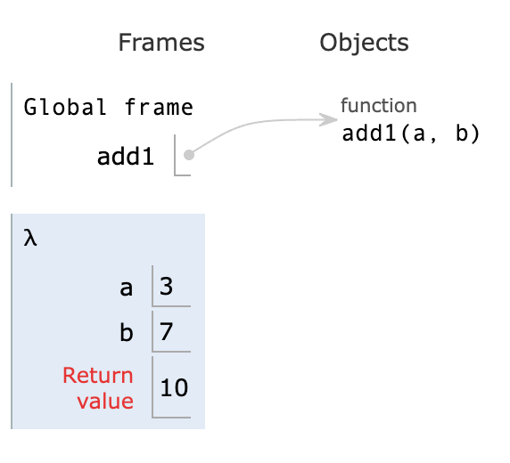
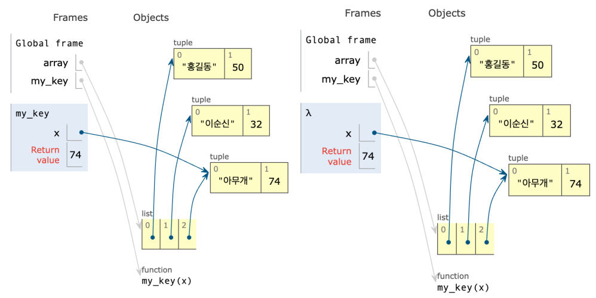

# Introduction

본 포스트는 알고리즘 학습에 대한 정리를 재대로 하기 위하여 남기는 것입니다. 더불어 기본 내용은 나동빈 저의 〖이것이 취업을 위한 코딩 테스트다〗라는 교재 및 유튜브 강의의 내용에서 발췌했고, 그 외 추가적인 궁금 사항들을 검색 및 정리해둔 것입니다.

# 함수

- 함수(Function)란 특정한 작업을 하나의 단위로 묶어 놓은 것을 의미합니다.
- 함수를 사용하면 불필요한 소스코드의 반복을 줄일 수 있습니다.

## 함수의 종류

- 내장 함수 : 파이썬 자체적으로 제공하는 함수입니다. 프로그램 전반에서 사용될만한 공통된 사용 도구들로 보시면 좋습니다.
- 사용자 정의 함수 : 개발자가 직접 정의한 역할을 수행하는 함수입니다. 개발 과정에서 필요시 되는 작업이 다양할 수 있는데, 그런 것들을 직접 만들어내는 경우를 의미 합니다.

## 함수 정의하기

- 프로그램에는 똑같은 코드를 여러 번 사용해야 할 때가 있는데, 그런 경우 함수화 시키면 소스 코드의 길이를 줄일수 있습니다.
  - 매개변수(Parameter, argument) : 함수의 내부에서 사용할 변수
  - 왜 영어 표현이 두개? :
    함수를 호출하는 입장에서 호출할 함수에 넣는 값이라는 입장에선 argument 라고 부르며, 호출된 함수 입장에서 받아 들인 값에 대해선 parameter라고 부릅니다.
  - 반환값(return value) : 함수에서 처리된 결과를 반환
  - 함수의 반환값이나 매개변수는 없을 수도 있습니다.

```python
# 기본적인 함수 작성의 형태
def 함수명(매개변수) :
	실행할 소스코드
	return 반환 값
```

## 더하기 함수 예시

```python
def add(a, b):
	return a + b

def add2(a, b):
	printf('함수의 결과 : ', a + b)
```

## 파라미터 지정하기

- 파라미터의 변수를 직접 지정할 수 있습니다. 이 말은 단순히 파라미터의 값이나 이에 해당하는 변수를 넣을 시 자동으로 순서대로 입력됩니다. 하지만 아럐와 같은 경우 순서 상관없이 필요한 함수의 인자들을 직접 지정하여 사용이 가능합니다.

```python
def add(a, b):
	return a + b

ret = add(b = 3, a = 7) # 순서 상관 없이 지정이 가능함
print(ret)
```

## global 키워드

- global 키워드로 변수를 지정하면 해당 함수는 지역변수를 만들지 않고, **함수 바깥에 선언된 변수를 바로 참조하게** 됩니다.

```python
a = 0

def global_func():
	global a
"""
C 언어 계열의 특징으로 사용이 가능하지만
함수 밖에서 사용시 파이썬은 global 키워드를 작성하고 변수명을 적어줘야 합니다.
해당 키워드가 없으면, 값이 없다고 인식합니다.
"""
	a += 1

for i in range(10):
	global_func()

print(a)

# 실행결과
# 10
```

- 단, 전역변수로 리스트를 사용한다고 할 때, 전역변수 키워드 없이 메소드를 사용하면, 파이썬이 이에 대해선 또 인식을 하고 작동이 정상적으로 진행된다는 특징이 있습니다.
- 더불어 지역변수로 전역변수와 같은 이름인 변수가 선언된다면 지역변수를 우선적으로 사용합니다.
- 이러한 특성들은 활용면에서 유용하나, 실제 변수의 범위 설정이나 충돌을 방지하고자 전역변수의 활용 시 `global` 키워드를 명시적으로 쓰는게 좋으리라 생각됩니다.

```python
array = [1, 2, 3, 4]

def func():
	array.append(6)
	print(array)

func()

#실행결과
# [1, 2, 3, 4, 6]
```

## 여러 개의 반환 값

- 파이썬은 여러개의 반환값을 가질 수 있습니다. 해당 내용을 [packing / unpacking](https://wikidocs.net/22801)이라고 합니다.

```python
def operator(a, b):
	add_var = a + b
	substract_var = a - b
	multiply_var = a * b
	devide_var = a / b
	return add_var, substract_var, multiply_var, devide_var # 이러한 방식을 패킹(packing)이라고 합니다.

a, b, c, d = operator(7, 3)
print(a, b, c, d)

# 실행결과
# 10 4 21 2.3333333333333335

```

# 람다 표현식

## 개념

- 람다 표현실을 이용하면 함수를 간단하게 작성할 수 있습니다.
- 특정 기능을 수행하는 함수를 한줄에 작성할 수 있다는 특징을 갖고 있습니다.
- `익명함수` 라고도 불리며, 이는 코드를 간결하게 만들어주고, 메모리를 절약한다는 강점이 있습니다.
- 함수의 기능이 매우 간단하거나, 함수 안에 함수로 특정 값으로 인자를 받는 경우 사용하면 유용할 수 있습니다.

```python

# 기존의 함수 방식
def add(a, b):
	return a + b

# 일반적인 add() 메서드 사용
print(add(3, 7))

# 람다 표현식으로 구현한 add() 메서드
print((lambda a, b: a + b)(3, 7))

# 실행결과
# 10
# 10
```

_실제 파이썬 구동 모습을 보면, 일반적인 함수의 경우 객체로 포인터가 지정되나 람다 표현식의 경우 따로 객체화 되지 않는 것을 볼 수 있습니다._

## 람다 표현식의 예시 : 내장 함수에서 자주 사용되는 람다 함수

```python
array = [('홍길동', 50), ('이순신', 32), ('아무개', 74)]

def my_key(x):
	return x[1]

print(sorted(array, key=my_key))
print(sorted(array, key=lambda x: x[1]))

# 실행결과
# [('이순신', 32), ('홍길동', 50), ('아무개', 74)]
# [('이순신', 32), ('홍길동', 50), ('아무개', 74)]
```



- 위 사진은 예시 함수를 이미지화 한 것입니다. (좌 - 일반 함수 선언 후 사용, 우 - 람다 표현식 사용)
- 간단한 식임에도 메모리 상에 함수 포인터를 작성하고, 해당 포인터를 거쳐 리스트 상의 튜플 값을 찾아 들어가는 것에 반해 람다의 경우 람다로 생성된 곳에서 직접 변수에 접근하는 만큼 메모리적으로나 작업 양의 측면에서 효율적일 수 있습니다.
- 예시처럼 정렬함수를 간단하게 사용하는 경우, 굳이 함수 선언 없이 람다를 사용하는 것이 매우 유용합니다.

## 람다 표현식의 예시 : 여러 개의 리스트에 적용

```python
list1 = [1, 2, 3, 4, 5]
list2 = [6, 7, 8, 9, 10]

result = map(lambda a, b: a + b, list1, list2)

print(list(result))

# 실행 결과
# [7, 9, 11, 13, 15]
```

[🧑🏻‍💻 알고리즘 박살내기 시리즈🧑🏻‍💻](https://paul2021-r.github.io/algorithm/20220411_00/)

```toc

```
