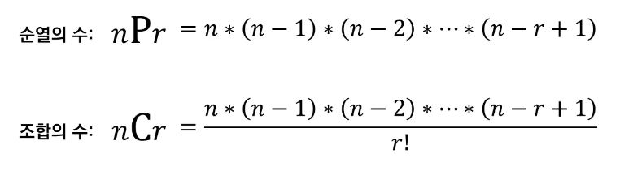

# Introduction

본 포스트는 알고리즘 학습에 대한 정리를 재대로 하기 위하여 남기는 것입니다. 더불어 기본 내용은 나동빈 저의 〖이것이 취업을 위한 코딩 테스트다〗라는 교재 및 유튜브 강의의 내용에서 발췌했고, 그 외 추가적인 궁금 사항들을 검색 및 정리해둔 것입니다.

# 실전에서 유용한 표준 라이브러리

## 라이브러리들

- 내장 함수 : 기본 입출력 함수부터 정렬함수까지 기본적인 함수들을 제공합니다.
  - 필수적인 기능들을 제공하고 있는 만큼 반드시 숙지하고 있어야 합니다.
- itertools : 반복되는 형태의 데이터를 처리하기 위한 기능들을 제공 합니다. (순열, 조합 라이브러리는 코딩테스트에서 자주 사용됩니다.)
- heapq : 힙 자료구조를 제공합니다. 일반적으론 우선순위 큐 기능을 구현하기 위해 사용됩니다.
- bisect : 이진탐색(Binary search) 기능을 제공합니다.
- Collections : 덱(deque), 카운터(Counter) 등의 유용한 자료구조를 포함합니다.
- math : 필수적인 수학적 기능을 제공합니다.(펙토리얼, 제곱근, 최대공약수, 삼각함수 관련 함수, 파이 등의 상수 까지...)

## 자주 사용되는 내장 함수

```python
# sum
result = sum([1, 2, 3, 4, 5])
print(result)

# min(), max()
min_result = min([7, 3, 5, 2])
max_result = max([7, 3, 5, 2])
print(min_result, max_result)

# eval()
# 수식을 적은 문자열을 인식하고 계산한 결과를
# 값으로 반환합니다.
result = eal("(3+5)*7")
print(result)

# sorted()
result = sorted([9, 1, 8, 5, 4])
reverse_result = sorted([9,1 ,8, 5, 4], reverser=True)
print(result)
print(reverse_result)

# sorted () with key

array = [('홍길동', 35), ('이순신', 75), ('아무개', 50)]
result = sorted(array, key=lambda x: x[1], reverse=True)
print(result)

# 실행결과
# 15
# 2 7
# 56
# [1, 4, 5, 8, 9]
# [9, 8, 5, 4, 1]
# [('이순신', 75), ('아무개', 50), ('홍길동', 35)]
```

## 순열과 조합

- 모든 경우의 수를 고려해야 할 때 어떤 라이브러리를 사용하는 것이 좋을까?
- 순열 : 서로 다른 n 개에서 서로 다른 r개를 선택하여 일렬로 나열하는 것.
- 조합 : 서로 다른 n 개에서 순서 상관 없이 서로 다른 r개를 선택하는 것



### 순열

```python
from itertools import permutations
# 순열에서 이용 가능한 라이브러리

data = ['A', 'B', 'C'] # 데이터 준비
result = list(permutations(data, 3))# 모든 순열 구하기
print(result)

# 실행결과
# [('A', 'B', 'C'), ('A', 'C', 'B'), ('B', 'A', 'C'), ('B', 'C', 'A'), ('C', 'A', 'B'), ('C', 'B', 'A')]

```

### 조합

```python
from itertools import combinations

data = ['A','B','C'] # 데이터 준비

result = list(combinations(data, 2))
print(result)

# 실행 결과
# [('A', 'B'), ('A', 'C'), ('B', 'C')]
```

### 중복 순열과 중복 조합

```python
from itertools import product
data = ['A', 'B', 'C']

result = list(product(data, repeat=2))
# 2개를 뽑는 모든 순열을 구하기 (중복 허용)
print(result)

from itertools import combinations_with_replacement

data = ['A', 'B', 'C']

result = list(combinations_with_replacement(data, 2))
# 2개를 뽑는 모든 조합 구하기 (중복 허용)
print(result)

```

## counter

- `collections` 라이브러리의 Counter는 등장 횟수를 세는 기능을 제공합니다.
- 리스트와 같은 반복 가능한(iterable) 객체가 주어지면 **내부 원소가 몇 번씩 등장했는지**를 알려줍니다.

```python
from collections import Counter

counter = Counter(['red', 'blue', 'red', 'gree', 'blue', 'blue'])
print(counter['blue'])
print(counter['green'])
print(dict(counter))

# 실행 결과
# 3
# 1
# ('red': 2, 'blue': 3, 'green',: 1)
```

## 최대 공약수와 최소 공배수

- math 라이브러리를 활용하여 gcd() 함수를 사용하면, 최대 공약수를 구할 수 있다.

```python
import math

def lcm(a,b)
	return a * b // math.gcd(a, b)

a = 21
b = 14

print(math.gcd(21, 14)) # 최대 공약수(GCD) 계산
print(lcm(21, 14)) # 최소 공약수(LCM) 계산

# 실행 결과
# 7
# 42
```

# 이 밖에 알아두면 좋은 내장 함수 모음

- 해당 내용은 자체적으로 필요할 것으로 생각하여 내용을 정리하여 둡니다. 몇 가지 주요한 것만을 모아두었기에 원문은 [여기](https://docs.python.org/ko/3/library/functions.html)를 참조해요주세요.

1. abs() : 숫자의 절댓값을 돌려줍니다. 인자가 복소수이면 그 크기를 반환합니다.
2. all(iterable), any(iterable) : 모든 요소가 참이거나, 혹은 어떤 요소 중 하나라도 참이면 True 를 돌려줍니다. 조건으로 필요한 요소들을 플래그로 하여 리스트를 만들고 최종 검사하는 용도로 아주 편리합니다.
3. float([x]) : 숫자 또는 문자열 x 로부터 실수를 만들어 반환합니다.
4. hex(x) : 정수를 '0x'가 접두사로 붙은 16지눗 '문자열'로 반환합니다. format() 을 활용하여 16진수 숫자의 값을 대문자로도 표현이 가능합니다.
5. oct(x) : '0o'의 8진수 객체를 돌려줍니다. format() 과 연동하여 형태를 바꿀수 있습니다.
6. len(s) : 객체의 길이(항목의 수)를 돌려줍니다. 인자는 시퀀스(문자열, 바이트열, 튜플, 리스트, 또는 range와 같은) 또는 컬렉션(딕셔너리, 집합, 또는 불변집합 등)을 받을 수 있습니다.
7. max(iterable, *[,key, default]) // max(arg1, arg2, *arg[,key]) : iterable 이 가능한 변수에서 가장 큰 항목이나 두 개 이상의 인자 중 가장 큰 것을 돌려줍니다.
8. min(iterable, *[,key, default]) // min(arg1, arg2, *arg[, key]) : max와 동일한 형으로 최솟값의 항목을 반환합니다.

이 밖에도 사실 내장함수 찾아서 훑어보니 정말 많이 있군요... C 언어 공부하듯 함수 마다의 사용법과 활용성에 대해 체크 하고 꾸준하게 찾아봐야 할 것 같습니다.

[🧑🏻‍💻 알고리즘 박살내기 시리즈🧑🏻‍💻](https://paul2021-r.github.io/algorithm/20220411_00/)

```toc

```
