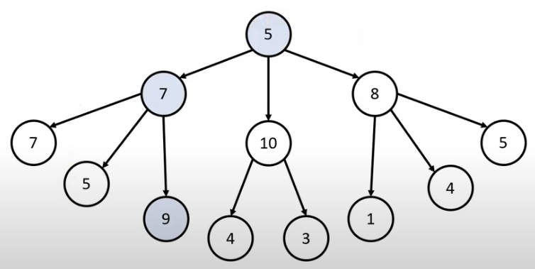

# Introduction

본 포스트는 알고리즘 학습에 대한 정리를 재대로 하기 위하여 남기는 것입니다. 더불어 기본 내용은 나동빈 저의 〖이것이 취업을 위한 코딩 테스트다〗라는 교재 및 유튜브 강의의 내용에서 발췌했고, 그 외 추가적인 궁금 사항들을 검색 및 정리해둔 것입니다.

# 그리디 알고리즘

## 개념

- 그리디 알고리즘(탐욕법)은 **현재 상황에서 지금 당장 좋은 것만 고르는 방법**을 의미합니다.
- 일반적인 그리디 알고리즘은 문제를 풀기 위한 최소한의 아이디어를 떠올릴 수 있는 능력을 요구합니다.
- 그리디 해법은 그 정당성 분석이 중요합니다.
  - 단순히 가장 좋아 보이는 것을 반복적으로 선택해도 최적의 해를 구할 수 있는 지, 그 가능성을 검토합니다.

## 그리디 알고리즘 : 예시 문제 상황

- 문제상황 : 루트 노드부터 시작하여 거쳐 가는 노드 값의 합을 최대로 만들고 싶습니다.
  Q. 최적의 해는 무엇인가요?

**단순히 현재 노드 위치에서 최대값을 찾아가면 합은 19가 됩니다. 실제 최대값인 '21'에는 미치지 못합니다**

- 일반적인 상황에서 그리디 알고리즘은 최적의 해를 보장할 수 없을 때가 많습니다.
- 그러나 코딩 테스트 라는 상황을 한정지어 생각하게 된다면, 그리디 문제는 **탐욕법으로 얻은 해가 최적의 해가 되는 상화에서 이를 추론할 수 있어야 풀리도록** 만들어둡니다.
  > ➡️ 최적의 상황은 아니지만 그에 가까운 수준이면 충분하거나, 코딩 테스트처럼 상황을 그리디로 풀이 가능하게 만들어두니 걱정마세요~

## 그리디 알고리즘 : 문제 - 거스름돈

### 문제 설명

- 당신은 음식점의 계산을 도와주는 점원입니다. 카운터에는 거스름돈으로 사용할 500원, 100원, 50원, 10원짜리 동전이 무한히 존재한다고 가정합니다. 손님에게 거슬러 주어야 할 돈이 N원일 때 거슬러 주어야 할 동전의 최소 개수를 구하세요. 단, 거슬러 줘야 할 돈 N은 항상 10의 배수입니다.

### 문제 해결 아이디어

- 최적의 해를 빠르게 구하기 위해 가장 큰 화폐 단위부터 거슬러 주면 됩니다.
- N원을 거슬러 줘야 할 때, 500원 부터 10원까지 거슬러 줄 수 있을만큼 거슬러 주면 된다.

### 정당성 분석

- 왜 가장 큰 화폐 단위부터 거슬러주는 것이 최적의 해를 보장하는가?
  - 가지고 있는 동전 중에서 큰 단위가 **항상 작은 단위의 배수**이므로 작은 단위 동전들을 종합해 다른 해가 나올 수 없기 때문입니다.
  - 만약 800원을 거슬러 주어야 하는데 화폐 단위가 500, 400, 100원이라고 한다면 중간에 있는 400원 2개로 해결이 가능하다. 큰단위와 작은단위의 관계성 성립이 안되는 동전이 제시된다면 최적의 값은 다르게 나올 수 있다.
- 그리디 알고리즘 문제에서는 이처럼 문제 풀이를 위한 최소한의 아이디어를 떠올리고, 이것이 정당한지 검토할 수 있어야 합니다.

### 코드 예시

```python
n = input()
count = 0;
array = [500, 100, 50, 10]

for coin in array:
	count += n // coin # 해당 화폐로 거슬러 줄 수 있는 동전의 개수 세기
	n %= coin

print(count)
```

```cpp
#include <bits/stdc++.h>

using namespace std;

int n = 1260;
int cnt

int coinTYpes[4] = {500, 100, 50, 10};

int main(void)
{
	for (int i = 0; i < 4 ; i++)
	{
		cnt += n / coinTypes[i];
		n %= coinTypes[i]
	}
	cout << cnt << '\n';
}
```

### 시간 복잡도 분석

- 화폐의 종류가 K라고 할 때, 소스코드의 시간 복잡도는 O(K) 입니다.
- 이 알고리즘의 시간 복잡도는 거슬러줘야 하는 금액과 무관하며, 동전의 총 종류에만 영향을 받습니다.

[🧑🏻‍💻 알고리즘 박살내기 시리즈🧑🏻‍💻](https://paul2021-r.github.io/algorithm/20220411_00/)

```toc

```
