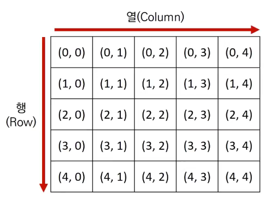
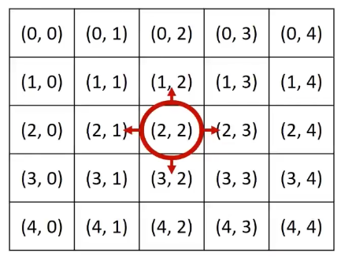

# Introduction

본 포스트는 알고리즘 학습에 대한 정리를 재대로 하기 위하여 남기는 것입니다. 더불어 기본 내용은 나동빈 저의 〖이것이 취업을 위한 코딩 테스트다〗라는 교재 및 유튜브 강의의 내용에서 발췌했고, 그 외 추가적인 궁금 사항들을 검색 및 정리해둔 것입니다.

# 구현: 시뮬레이션과 완전 탐색

## 구현(Implementation)

- 구현이란 머릿속에 알고리즘을 소스코드로 바꾸는 과정입니다.
- 알고리즘을 알면서 머릿속에서만 돌린다는 것은 당연히 자신의 실력의 성장에 한계를 만드는 거 아니겠습니까 ㅎㅎ..
- 단, 코딩 테스트라는 상황에서 해당 부분을 본다면, 문제의 유형으로써 특징은 어느정도 숙지하고 있는게 중요합니다.

### 구현 ver.코테

- 풀이를 떠올리는 것은 쉽지만. **소스코드로 옮기기 어려운 문제**를 지칭합니다.
- 구현 유형의 예시는 다음과 같습니다.
  1.  알고리즘은 간단한데 코드가 지나칠 만큼 길어질수 있는 문제
  2.  실수 연산을 다루고, 특정 소수점 자리까지 출력해야 하는 문제
  3.  문자열을 특정한 기준에 따라서 끊어서 처리해야 하는 문제
  4.  적절한 라이브러리를 찾아서 사용해야 하는 문제
- 일반적으로 알고리즘 문제는 2차원 공간은 행렬(Matrix)의 의미로 사용됩니다.
  
  ```python
  for i in range(5):
  	for j in range(5):
  		print('(', i, ',', j, ')', end = ' ')
  	print()
  ```
- 시뮬레이션 및 완전 탐색 문제에선 2차원 공간에서의 `방향벡터`가 자주 활용 됩니다. 이는 2d 좌표 상에서 어떤 식으로 움직일 수 있는지를 구현한다고 보시면 됩니다.
  

  ```python
  # 동, 북, 서, 남 이동 위치
  dx = [0, -1, 0, 1]
  dy = [1, 0, -1, 0]
  direction = ["east", "north",  "west", "south"]

  # 현재 위치
  x, y = 2, 2

  for i in range(4):
  	# 다음 위치
  	nx = x + dx[i]
  	ny = y + dy[i]
    print(direction[i], end=" : ")
  	print('(', nx,', ',  ny, ')')
  ```

# 문제 : 상하좌우

## 문제 유형

- 여행가 A는 **N × N** 크기의 정사각형 공간 위에 서 있습니다. 이 공간은 1 × 1 크기의 정사각형으로 나누어져 있습니다. 가장 왼쪽 위 좌표는 (1, 1)이며, 가장 오른쪽 아래 좌표는 (N, N)에 해당합니다. 여행가 A는 상, 하, 좌, 우 방향으로 이동할 수 있으며, 시작좌표는 항상 **(1, 1)**입니다. 우리 앞에는 여행가 A가 이동할 계획이 적인 계획서가 놓여 있습니다.
- 계획서에는 하나의 줄에 띄어쓰기를 기준으로 하여 L, R, U, D 중 하나의 문자가 반복적으로 적혀 있습니다.
  - L : 왼쪽으로 한 칸 이동
  - R : 오른쪽으로 한 칸 이동
  - U : 위로 한 칸 이동
  - D : 아래로 한 칸 이동

## 문제 설명

- 여행가 A가 N × N 크기의 정사각형 공간을 벗어나는 움직임은 무시합니다.

## 문제 조건

1. 난이도 : 하
2. 풀이시간 : 15분
3. 시간제한 : 2초
4. 메모리 제한 : 128MB

- 입력 조건 :
  1.  첫째 줄에 공간의 크기를 나타내는 N이 주어집니다. (1 <= N <= 100)
  2.  둘째 줄에 여행가 A가 이동할 계획서 내용이 주어집니다. (1 <= 이동횟수 <= 100)
- 출력 조건 :
  - 첫째 줄에 여행가 A가 최종적으로 도착할 지점의 좌표 (X, Y)를 공백을 기준으로 구분하여 출력합니다.
- 입/출력 예시 :

  ```shell
  "입력 예시"
  5
  R R R U D D

  "출력 예시"
  3 4
  ```

## 문제 해결 아이디어

- 이 문제는 요구사항 대로 충실히 구현하면 되는 문제입니다.
- 일련의 명령에 따라서 개체를 차례대로 이동시킨다는 점에서 시뮬레이션(Simulation) 유형이라 볼 수 있는 대표적 구현 유형입니다.
- 단, 알고리즘 교재나 문제 풀이 사이트에서 다르게 명명할 수도 있으니 시뮬레이션 유형, 구현 유형, 완전탐색유형은 서로 유사한 녀석이라고 생각하시면 좋겠습니다.

## 문제 풀이 예시

<details>
<summary>자체 제작 버전</summary>
<span>

```python
# 자체 제작 버전!
n = input()
plan = input().split( )
x, y = 1, 1

for i in range(len(plan)):
	if plan[i] == 'R':
		if (y == n): # 해당 조건을 걸리게 되면 계산이 들어가면 안된다.
			continue
		y += 1
	elif plan[i] == 'L':
		if (y == 1):
			continue
		y -= 1
	elif plan[i] == 'U':
		if (x == 1):
			continue
		x -= 1
	else:
		if (x == n):
			continue
		x += 1
print(x, y)
```

</span>
</details>

<details>
<summary>강의 제작 버전(Python)</summary>
<span>

```python
# 입력 구현
n = int(input())
x, y = 1, 1
plans = input().split()

# LRUD의 방향에 따른 이동 방향 판단
dx = [0, 0, -1, 1]
dy = [-1, 1, 0, 0]
move_types = ['L', 'R', 'U', 'D']

# 이동 계획을 하나씩 확인하기
for plan in plans:
	for i in range((len(move_types))):
		if plan == move_types[i]:
			nx = x + dx[i]
			ny = y + dy[i]
	# 공간을 벗어날 경우 현재 좌표에 대입하지 않음.
	if nx < 1 or ny < 1 or nx > n or ny > n:
		continue
	# 이동을 수행하고 해당 좌표로 갱신됨.
	x, y = nx, ny
print(x, y)
```

</span>
</details>

<details>
<summary>강의 제작 버전(C++)</summary>
<span>

```cpp
#include <bits/stdc++.h>

using namespace std;

int n;
string plans;
int x = 1, y = 1;

int dx[4] = {0, 0, -1, 1}
int dy[4] = {-1, 1, 0, 0}
char moveTypes[4] = {'L', 'R', 'U', 'D'}

int main(void)
{
	cin >> n;
	cin.ignore();
	getline(cin, plans);

	for (int i = 0; i < plans.size(); i++)
	{
		char plan = plans[i];
		int nx = -1, ny = -1;
		for (int j = 0; j < 4; i++)
		{
			if (plan == moveTypes[j])
			{
				nx = x + dx[j];
				ny = y + dy[j];
			}
		}
		if (nx < 1 || ny < 1 || nx > n || ny > n) continue;
		x = nx;
		y = ny;
	}
	cout << x << ' ' << y << '\n';
	return (0);
}
```

</span>
</details>

- 기존 버전과 내 자체 제작 버전 간의 차이?
  1. 우선 비교 연산 뿐 아니라 모든 경우를 다 계산한다는 점, 조건문으로 계속 확인한다는 점에서 내 코드는 1차원적이고 비효율적이라 생각됩니다.
  2. 좀더 효율적인 계산을 위해 필요한 내용 중 `바뀌지 않는 영역`의 경우 변수로 할당하여 사용 시 필요한 행동을 제한하는 방식으로 구현이 가능합니다.
  3. CS 공부를 하면서 알게된 것처럼, 함수 스택 프레임 안에서 할당되지 않은 변수들을 그냥 쓰는 것은 퍼포먼스 면에서 떨어지는 행동이므로, C++ 같은 경우 내부에서 할당을 진행하는 것이 오히려 빨라진다고 생각이 들었습니다.

[🧑🏻‍💻 알고리즘 박살내기 시리즈🧑🏻‍💻](https://paul2021-r.github.io/algorithm/20220411_00/)

```toc

```
