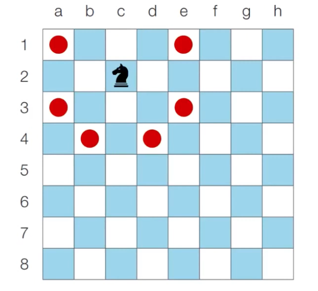

# Introduction

본 포스트는 알고리즘 학습에 대한 정리를 재대로 하기 위하여 남기는 것입니다. 더불어 기본 내용은 나동빈 저의 〖이것이 취업을 위한 코딩 테스트다〗라는 교재 및 유튜브 강의의 내용에서 발췌했고, 그 외 추가적인 궁금 사항들을 검색 및 정리해둔 것입니다.

# 시각

## 문제 설명

- 정수 N이 입력되면 00시 00분 00초부터 N시 59분 59초까지의 **모든 시각 중에서 3이 하나라도 포함되는 모든 경우의 수**를 구하는 프로그램을 작성하십시오. 예를 들어 1을 입력했을 때 다음은 3이 하나라도 포함되어 있으므로 세어야 하는 시각입니다.
  - 00시 00분 03초
  - 00시 13분 30초
- 반면에 다음은 3이 하나도 포함되어 있지 않으므로 **세면 안되는 시각입니다.**.
  - 00시 02분 55초
  - 01시 27분 45초

## 문제 조건

1. 난이도 : 하
2. 풀이시간 : 15분
3. 시간제한 : 2초
4. 메모리 제한 : 128MB

- 입력 조건 : 첫째 줄에 정수 N이 입력됩니다. (0<= N <= 23)
- 출력 조건 : 00시 00분 00초부터 N시 59분 59초까지의 모든 시각 중에서 3이 하나라도 포함되는 경우의 수를 출력합니다.
- 입출력 예시

  ```shell
  # 입력 예시
  5
  # 출력 예시
  11475
  ```

## 문제 해결 아이디어

- 이 문제는 가능한 모든 시각을 다 세서 풀 수 있는 문제 입니다.
- 단순하게 시간을 1씩 증가 시키면서 3이 하나라도 있는지 조건문으로 확인하면 됩니다.
- 이러한 유형을 **완전탐색(Brute Forcing)** 문제 유형이라고 불립니다.
- 해당 상황과 조건의 특징을 명확하게 해서 진행하면 되며, 이것이 가능한 이유는 하루는 86,400초 이므로 1씩 계산해나가면서 23시 59분 59초까지 세는 것은 어렵지 않습니다.
- 더불어 파이썬으로 연산을 할 경우 1초에 2천만번정도의 연산이 보통 가능한 만큼, 겁넬 필요는 없다고 보시면 좋겠습니다.

## 문제 예시

<details>
<summary> 내가 만든 버전 </summary>
<span>

```python
n = int(input())
clock = [0] * 6
limit = [0] * 2

limit[0] = n // 10
limit[1] = n % 10

# 01 23 45

ret = 0

while True:
    clock[5] += 1
    if clock[5] == 10:
        clock[4] += 1
        clock[5] = 0
    if clock[4] == 6:
        clock[3] += 1
        clock[4] = 0
    if clock[3] == 10:
        clock[2] += 1
        clock[3] = 0
    if clock[2] == 6:
        clock[1] += 1
        clock[2] = 0
    if clock[1] == 10:
        clock[0] += 1
        clock[1] = 0
    if 3 in clock:
        ret += 1
    if clock[0] == limit[0] and clock[1] == limit[1]:
        if clock[2] == 5 and clock[3] == 9:
            if clock[4] == 5 and clock[5] == 9:
                break
print(ret)
```

</details>
</span>

<details>
<summary> 강의 예시  </summary>
<span>

```python
# 파이썬
h = int(input())
count = 0

for i in range(h + 1):
	for i in range(60):
		for j in range(60):
			for k in range(60):
				if '3' in str(i) + str(j) + str(k):
					count += 1
print(count)
```

```cpp
#include <bits/stdc++.h>

using namespace std;
int h, cnt;

bool check(int h, int m, int s)
{
	if (h % 10 == 3 || m / 10 == 3 || m % 10 == 3 || s / 10 == 3 || s % 10 == 3)
		return true;
	return false
}

int main(void)
{
	cin >> h;
	for (int i = 0; i <= h; i++)
	{
		for (int j = 0; j <= 60; j++)
		{
			for (int k = 0; k <= 60; j++)
			if (check(i, j, k)) cnt++;
		}
	}
	cout << cnt << '\n'
	return (0);
}
```

</details>
</span>

## 개선 및 생각 사항 정리

1. 규칙이 되는 경우의 특징을 이용해서 압도적으로(...) 효율적인 코드 예시를 보여준 강의. 역시 아직 새삼 코린이란 사실을 느끼게 됩니다.
2. 파이썬의 경우 문자열로의 형변환 함수를 활용하면 C처럼 복잡하게 ascii 문자 계산을 할 필요가 없다는 사실을 새삼 느꼈습니다.

# 왕실의 나이트

## 문제 설명

- 왕실 정원은 체스판 같은 8 × 8 좌표 평면입니다. 왕실 정원의 특정한 한 칸에 나이트가 서 있습니다. 나이트는 매우 충성스러운 신하로서 매일 무술 연마를 합니다.
- 나이트는 말을 타고 있기 때문에 이동할 때는 L자 형태로만 이동할 수 있으며 정원 밖으로 나갈 수 없습니다.
- 나이트는 특정의 위치에서 다음과 같은 2가지 경우로 이동할 수 잇습니다.

  - 수평으로 두칸 이동 한 뒤에 수직으로 한 칸 이동하기
  - 수직으로 두칸 이동 한 뒤에 수평으로 한 칸 이동하기

- 이때 좌표 평면상에 나이트가 위치로 주어질 때, 이동할 수 있는 경우의 수를 출력하는 프로그램을 작성하시오. 행의 위치는 1~8로, 열의 위치는 a ~ h 로 표현됩니다.
  - 예) c2에 나이트가 있는 경우 가능 경우의 수는 **6가지**입니다.

## 문제 조건

1. 난이도 : 하
2. 풀이시간 : 20분
3. 시간 제한 : 1초
4. 메모리 제한 : 128MB

- 입력 조건 : 첫 째줄에 현재 8 × 8 좌표 평면상에서 현재 나이트 위치한 곳의 좌표를 나타내는 두 문자로 구성된 문자열이 입력된다. 입력 문자는 a1처럼 열과 행으로 이루어진다.
- 출력 조건 : 첫째 줄에 나이트가 이동할 수 있는 경우의 수를 출력하시오.

```shell
# 입력예시
a1
# 출력 예시
2
```



## 문제 해결 아이디어

- 역시나 구현 문제로 완전 구현이 필요합니다. 각 상황을 충실하게 구현하고 조건 해당 여부를 확인하면 됩니다.
- 리스트를 이용하여 8가지 방향에 대한 벡터를 정의합니다.

## 문제 예시

<details>
<summary> 내가 만든 버전 </summary>
<span>

```python
# chess
# 나동빈 15 - 2

pos = input()
pos_x = ["a", "b", "c", "d", "e", "f", "g", "h"]
pos_y = [1, 2, 3, 4, 5, 6, 7, 8]
cnt = 0

p_y = int(pos[1])
p_x = 0
n_x = 0
n_y = 0

mov_1 = [2, -2]
mov_2 = [1, -1]

for i in range(1, 8):
    if pos_x[i - 1] == pos[0]:
        p_x = i
        break

# print("current x : ", p_x, "current y : ", p_y)

for mov in mov_1:
    for mov2 in mov_2:
        n_x = mov + p_x
        n_y = mov2 + p_y
        # print(n_x, ", ", n_y)
        if n_x in range(1, 8) and n_y in range(1, 8):
            cnt += 1

for mov in mov_1:
    for mov2 in mov_2:
        n_y = mov + p_y
        n_x = mov2 + p_x
        # print(n_x, ", ", n_y)
        if n_x in range(1, 8) and n_y in range(1, 8):
            cnt += 1


print(cnt)

```

</details>
</span>

<details>
<summary> 강의 예시 </summary>
<span>

```python
# 나이트의 현재 위치 입력 받기
input_data = intput()
row = int(input_data[1])
column = int(ord(input_data[0])) - int(ord'a') + 1

# 나이트가 이동할 수 있는 8가지 방향의 정의
steps = [(-2, -1), (-1, -2), (1, -2), (2, -1), (2, 1), (1, 2), (-1, 2), (-2, 1)]

# 8가지 방향에 대하여 각 위치로 이동이 가능한지 확인
result = 0
for step in steps:
	next_row = row + step[0]
	next_column = column + step[1]
	if next_row >= 1 and next_row <= 8 and next_column >= 1 and next_column <= 8:
		result += 1
print(result)
```

```cpp
#include <bits/stdc++.h>

using namespace std;

string inputData;

int dx[] = {-2, -1, 1, 2, 2, 1, -1, -2}
int dy[] = {-1, -2, -2, -1, 1, 2, 2, 1}

int main(void)
{
	cin >> inputData;
	int row = inputData[1] - '0';
	int column = inputData[0] - 'a' + 1;

	int result = 0;
	for (int i = 0; i < 8; i++)
	{
		int nextRow = row + dx[i];
		int nextColumn = column + dy[i];
		if (nextRow >= 1 && nextRow <= 8 && nextColumn >= 1 && nextColumn <= 8)
			result += 1
	}
	cout << result << '\n'
	return (0);
}
```

</details>
</span>

## 개선 및 생각 사항 정리

1. 문뜩 코딩과 관련된 건 아니지만, 프리가이라는 영화 보셨나요? 그 영화에서 천재 프로그래머 키스 역으로 조 키어리가 나옵니다. 그리고 그 사람이 영화 속 인터뷰에서 코딩이 '글쓰기' 라고 하더군요. 새삼 쓴 걸 보면서 그걸 느끼게 됩니다.
2. 효율적이다 라는 말이 나오는 코드를 짠다는게 새삼 얼마나 많은 퇴고의 시간, 고민의 시간이 필요할까요? 기초부터 탄탄히 하고 싶어지고, 더 깔끔하게 싶어지는 원동력이기도 합니다.

# 문자 재정렬

## 문제 설명

- 알파벳 대문자와 숫자(0~9)로 구성된 문자열이 입력으로 주어집니다. 이때 모든 알파벳을 오름차순으로 정렬하여 이어서 출력한 뒤에, 그 뒤에 모든 숫자를 더한 값을 이어서 출력합니다.
- 예를 들어 K1KA5CB7 이라는 값이 들어오면 ABCKK13를 출력 합니다.

## 문제 조건

1. 난이도 : 하
2. 풀이시간 : 20분
3. 시간 제한 : 1초
4. 메모리 제한 : 128MB
5. 기출 : Facebook 인터뷰

- 입력 조건 : 첫째 줄에 하나의 문자열 S가 주어집니다. (1<= S의 길이 <= 10000>)
- 출력 조건 : 첫째 줄에 문자에 요구하는 정답을 출력합니다.

```shell
# 입력예시
K1KA5CB7
# 출력 예시
ABCKK13
# 입력예시
AJKDLSI412K4JSJ9D
# 출력 예시
ADDIJJJKKLSS20
```

## 문자 해결 아이디어

- 요구 사항대로 충실히 구현하면 되는 문제입니다.
- 문자열이 입력되었을 때 문자를 하나씩 확인합니다.
  - 숫자인 경우 따로 합계를 계산합니다.
  - 알파벳은 별도에 리스트에 저장합니다.
- 결과적으로 리스트에 저장된 알파벳을 정렬해 출력하고 합계를 뒤에 붙여 출력하면 정답입니다.

## 문제 예시

<details>
<summary> 내가 만든 버전 </summary>
<span>

```python
# # chess
# 나동빈 15 - 3

str = input()

ret_num = 0
ret_str = []

for i in range(len(str)):
    if str[i] >= "1" and str[i] <= "9":
        ret_num += int(str[i])
    else:
        ret_str.append(str[i])
ret_str.sort()
print(*ret_str, sep="", end="")
if ret_num != 0:
    print(ret_num, end="")
print("\n")
```

</span>
</details>

<details>
<summary> 강의 버전 </summary>
<span>

```python
# 초기 데이터 구조 작성
data = input()
result = []
value = 0

# 문자를 하나씩 확인
for x in data:
	if x.isalpha():
		result.append(x)
	else:
		value += int(x)
result.sort()
if value != 0:
	result.append(str(value))

print(''.join(result)) # 신기한 방법이다.
```

```cpp
#include <bits/stdc++.h>

using namespace std;

string str;
vector<char> result;
int value = 0

int main(void)
{
	cin >> str;
	for (int i = 0; i < str.size(); i++)
	{
		if (isalpha(str[i]))
			result.push_back(str[i]);
		else
			value += str[i] - '0';
	}
	sort(result.begin(), result.end());
	for (int i = 0; i < result.size(); i++)
		cout << result[i]
	if (value != 0) cout << value
	cout << '\n'
}
```

</span>
</details>

## 개선 및 생각 사항 정리

1. 우선 이번엔 생각보다 최적화되어 잘 정돈한 것으로 보입니다.
2. 상대적으로 쉽게 이해할 수 있었으나, 여기서 핵심은 문자열을 정돈하는 기술력이 얼마나 좋은가? 에 대한 게 필요하다고 느꼈습니다.
3. 코딩테스트에서 보통 방법의 과정은 당연히 스킵이 될 것이고, 출력된 결과물을 보는 만큼 print 함수와 얼마나 문자열 정돈 스킬이 좋은지에 따라 달라질 수 있음을 느꼈습니다.

   예를 들어, print(list) 를 진행할 경우 출력 결과가 list 형으로 나오게 되고, 우리가 원하는 순수한 문자열로 출력이 안되는 경우가 발생합니다. 이런 경우에 대응하는 print 옵션들이 있는데, 이는 나올 때마다 정리해둘 필요가 있어 보입니다.

   동시에 자료형의 형변환에 대한 부분이 아직 온전하지 않다고 느껴지네요. 다루기 편한 만큼 형 변환을 잘 해서 써야 하는데... 자꾸 오류가 나는 거 보면 좀더 파이썬 내장함수에 대한 이해 + 암기가 필요해 보입니다.

[🧑🏻‍💻 알고리즘 박살내기 시리즈🧑🏻‍💻](https://paul2021-r.github.io/algorithm/20220411_00/)

```toc

```
