# Introduction

본 포스트는 알고리즘 학습에 대한 정리를 재대로 하기 위하여 남기는 것입니다. 더불어 기본 내용은 나동빈 저의 〖이것이 취업을 위한 코딩 테스트다〗라는 교재 및 유튜브 강의의 내용에서 발췌했고, 그 외 추가적인 궁금 사항들을 검색 및 정리해둔 것입니다.

# 그래프 탐색 알고리즘: DFS/BFS을 위한 자료구조

## 개념

- 탐색(Search)이란 많은 양의 데이터 중 원하는 데이터를 찾는 과정을 말합니다.
- 대표적인 그래프 탐색 알고리즘으로 DFS, BFS 가 있습니다.
- **DFS/BFS는 코딩테스트에서 매우 자주 등장하는 유형**이므로 반드시 숙지할 필요가 있습니다.
- 위 내용을 알아보기 위해 스택과 큐 자료구조에 대해 먼저 알아볼 것입니다.

## 스택 자료구조

### 개념

- 선입된 자료가 나중에 나가는 형식 (선입후출)의 자료구조 입니다.
- 입구와 출구가 동일한 형태로 스택을 시각화 할 수 있습니다.
  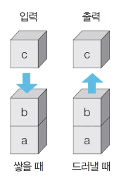_해당 자료구조는 다양한 곳에 쓰일 수 있습니다._

### 스택 자료 구조 동작 예시

- 해당 자료구조는 삽입 삭제의 두 가지 큰 기능으로 구성되어 있습니다.
- 입구가 하나인 만큼, 프링글스 라던지, 한쪽이 막힌 박스 구조를 떠올리시면 좋습니다.
  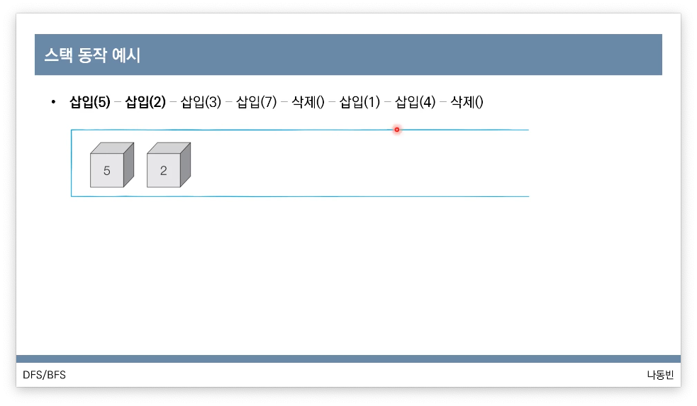_삽입_
  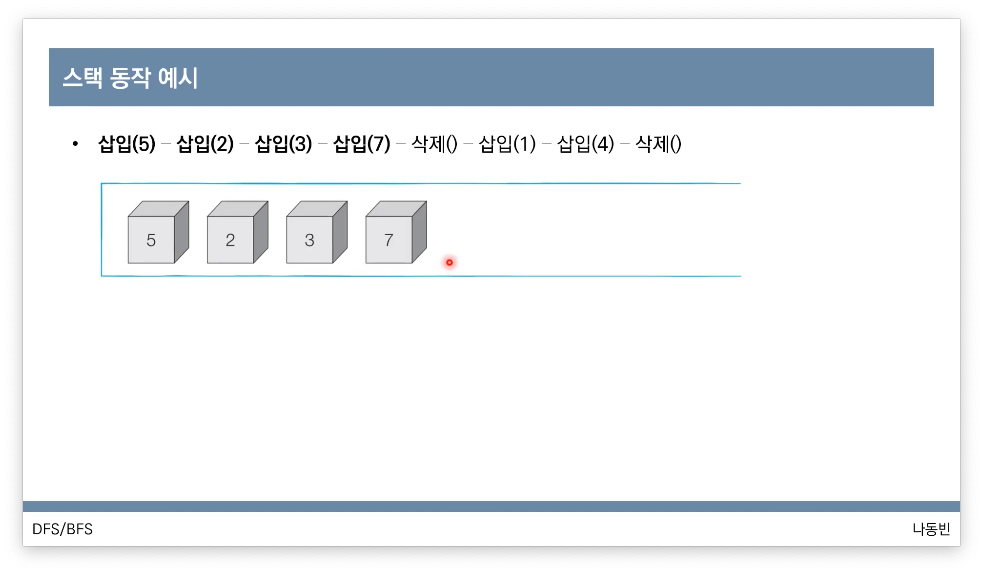_삽입_
  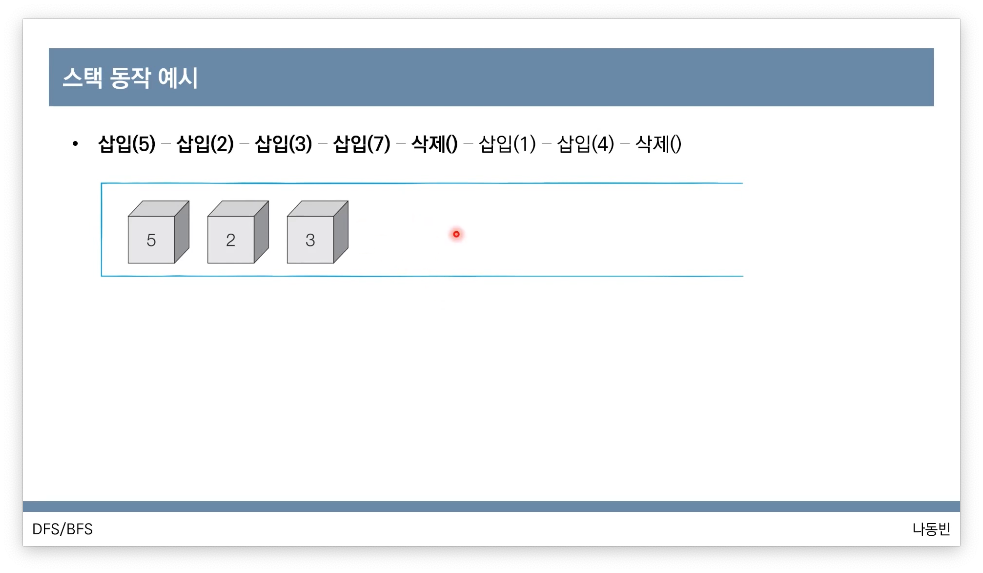_가장 마지막 자료가 삭제됩니다._

### 스택 구현 예제(Python)

- 파이썬의 경우 기본적으로 제공되는 자료구조 리스트를 활용하는 것이 가장 효과적입니다.
- 리스트를 위한 메소드 역시 상수 시간만큼만 걸리므로 사용이 추천됩니다.

```python
stack = []

# 삽입과 삭제 예시

stack.append(5)
stack.append(2)
stack.append(3)
stack.append(6)
stack.append(7)
stack.pop()
stack.append(1)

print(stack[::-1])
# 최 상단부터 거꾸로 출력.
# 스택 구조를 생각하면 맨 먼저 나가야할 녀석이 앞으로 와야 하므로
# 해당 구조로의 출력이 요구됩니다.
print(stack) # 순차 출력

# 실행 결과
# [1, 6, 3, 2, 5]
# [5, 2, 3, 6, 1]
```

### 스택 구현 예제(C++)

```cpp
#include <bits/stdc++.h>

using namespace std;

stack<int> s;

int main(void)
{
	s.push(5);
	s.push(2);
	s.push(3);
	s.push(6);
	s.push(7);
	s.pop();
	s.push(1);

	while (!s.empty())
	{
		cout << s.top() << ' ';
		s.pop();
	}
}
// 실행결과
// 1 6 3 2 5
```

## 큐 자료구조

## 개념

- 먼저 들어온 데이터가 먼저 나가는 형식(선입선출)의 자료 구조입니다.
- 큐는 입구와 출구가 모두 뚫려있는 터널 같은 형태로 시각화 할 수 있습니다.
  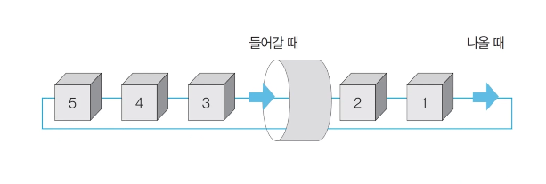

### 큐 동작 예시

- 그림처럼 데이터의 입력은 항상 입구 뒤로 오게 되며, 데이터의 처리 시 먼저 들어온 쪽에서 실행됩니다.
  
  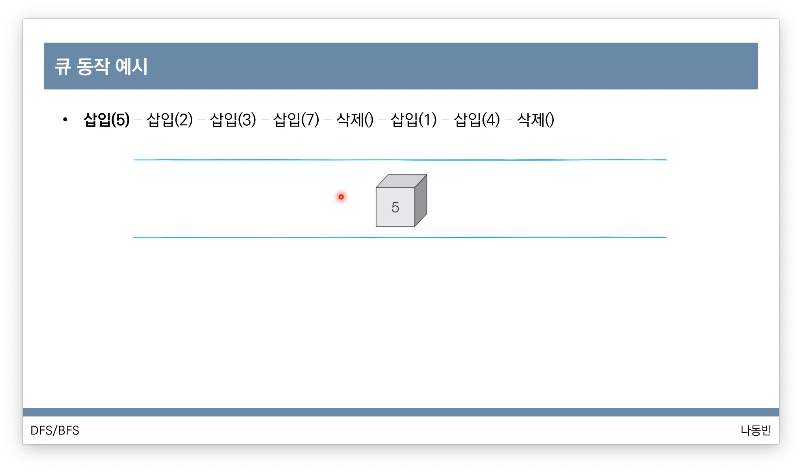_자료가 들어올 때 왼쪽으로 나열되며_
  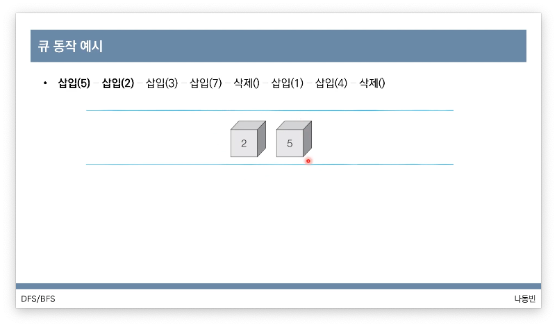
  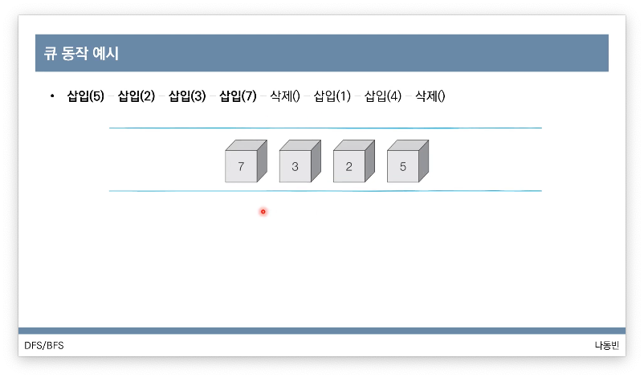
  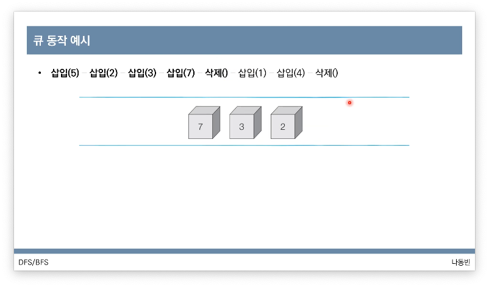_나갈 때는 먼저 들어온 데이터가 나가게 됩니다.(5)_
  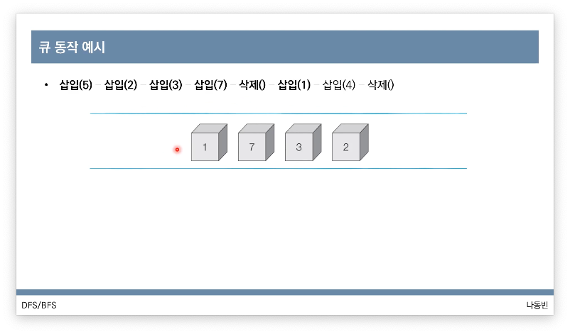
  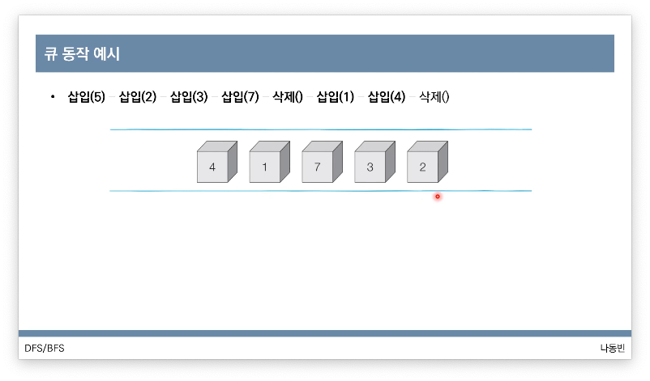
  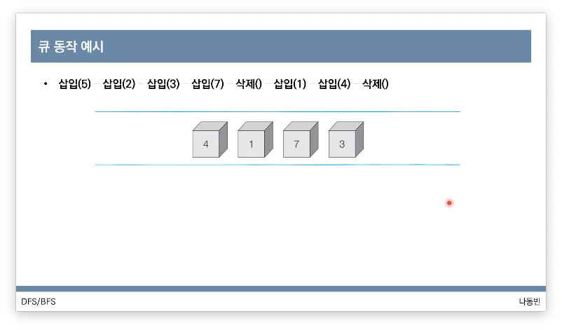

### 큐 구현 예제(Python)

- 기능적으로 동일하게 리스트로 구현은 가능하다고 합니다. 하지만, 비용적 측면에서 시간 복잡도를 늘어나게 되므로 덱 라이브러리를 사용하는게 유효합니다.(다소 관행적으로 사용된다고 보시면 됩니다.)
- 단, 엄밀히 말하면 덱 구조는 스택과 큐구조의 장점을 합친 구조입니다.
- 더불어 아래쪽 코드에서 볼 수 있는 것 처럼, 그림 예시는 오른쪽에서 pop이 진행 되었으나, 해당 구조에선 왼쪽 기준이라는 점을 알아두어야 합니다.

```python
from collections import deque
# 큐 구현을 위해 deque 라이브러리를 사용

queue = deque()

# 위의 예시와 동일하게 작동 예시
queue.append(5) # 리스트의 메서드와 동일합니다.(시간 복잡도 : O(1))
queue.append(2)
queue.append(3)
queue.append(7)
queue.popleft() # 왼쪽에 있는 자료를 먼저 꺼내는 메서드입니다.(시간 복잡도 : O(1))
queue.append(1)
queue.append(4)
queue.popleft()

print(queue) # 먼저 들어온 순서대로 출력
queue.reverse() # 역순으로 바꾸기
print(queue) # 나중에 들어온 원소부터 출력

# 실행 결과
# deque([3, 7, 1, 4])
# deque([4, 1, 7, 3])
```

### 큐 구현 예제(C++)

```cpp
#include <bits/stdc++.h>

using namespace std;

queue<int> q;

int main(void)
{
	q.push(5);
	q.push(2);
	q.push(3);
	q.push(7);
	q.pop();
	q.push(1);
	q.push(4);
	q.pop();
	// 먼저 들어온 원소부터 추출
	while (!q.empty))
	{
		cout<< q.front() << ' ';
		q.pop;
	}
}
```

[🧑🏻‍💻 알고리즘 박살내기 시리즈🧑🏻‍💻](https://paul2021-r.github.io/algorithm/20220411_00/)

```toc

```
