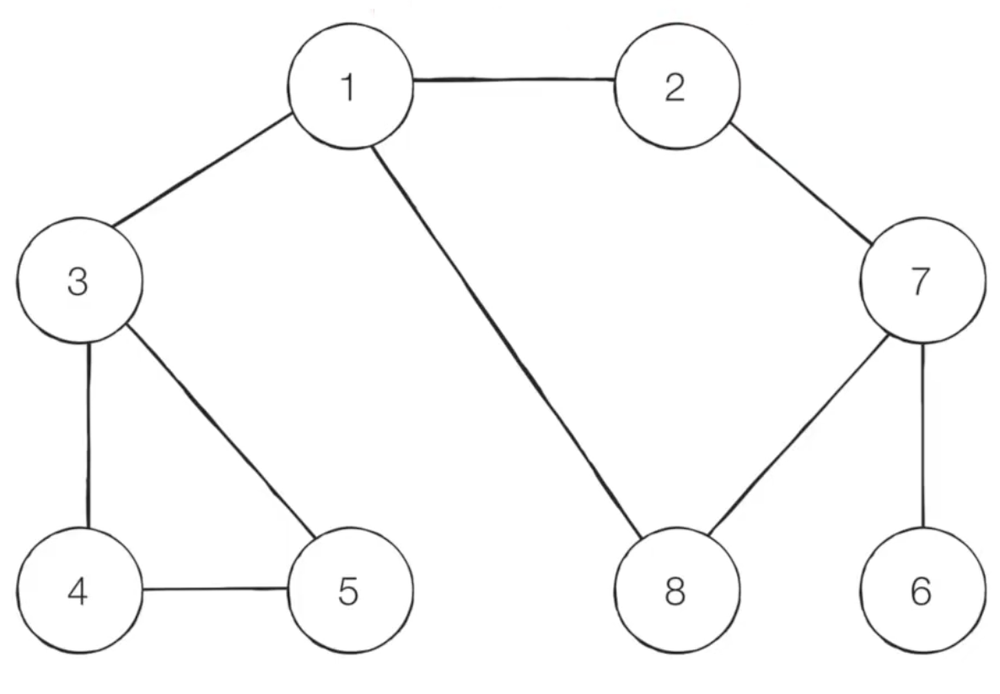
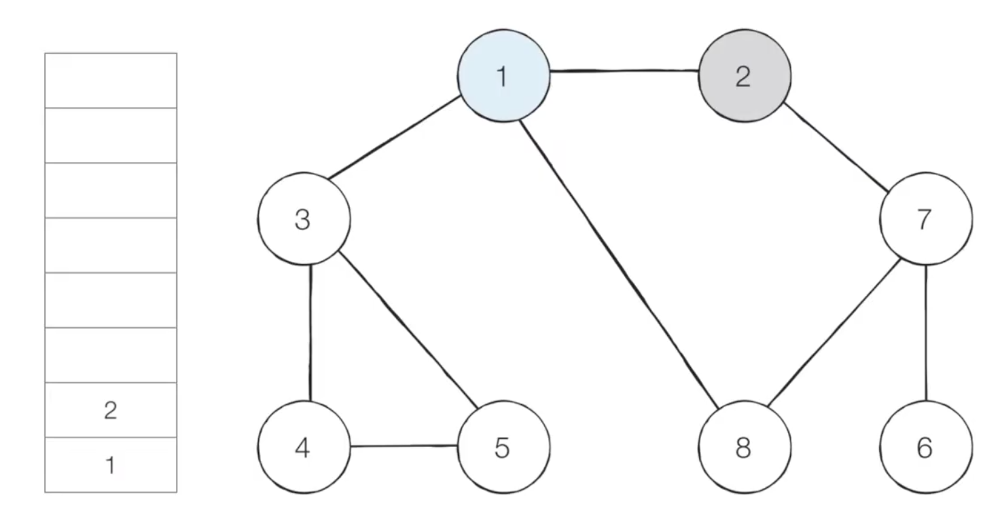
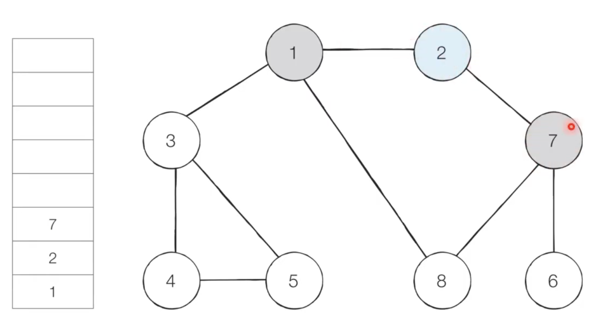
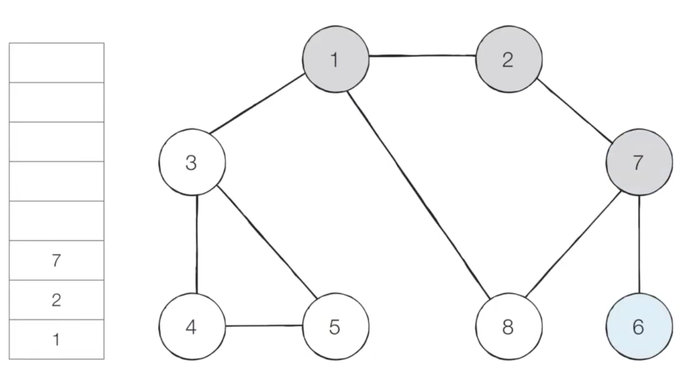
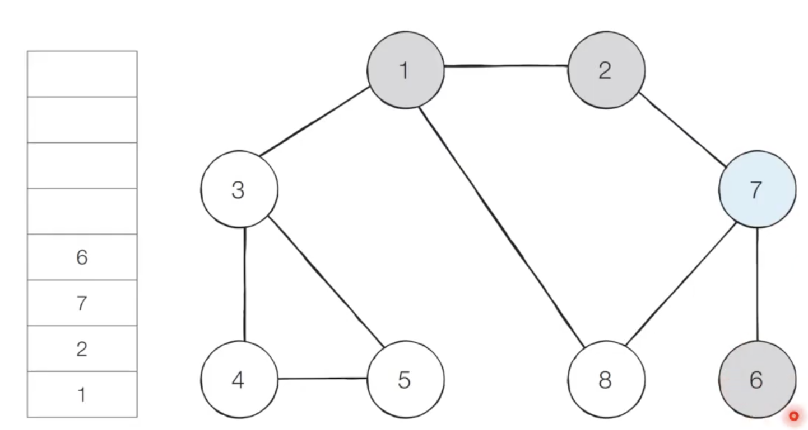
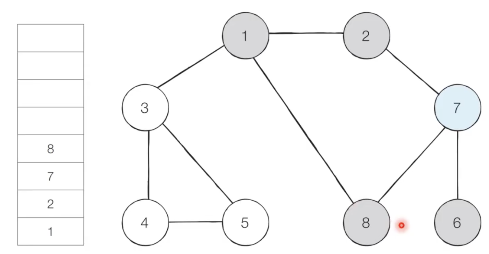
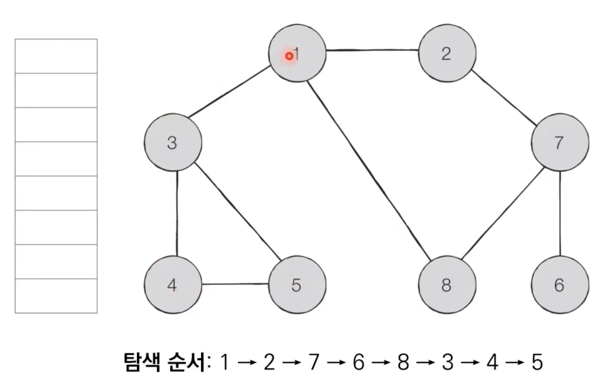

# Introduction

본 포스트는 알고리즘 학습에 대한 정리를 재대로 하기 위하여 남기는 것입니다. 더불어 기본 내용은 나동빈 저의 〖이것이 취업을 위한 코딩 테스트다〗라는 교재 및 유튜브 강의의 내용에서 발췌했고, 그 외 추가적인 궁금 사항들을 검색 및 정리해둔 것입니다.

# DFS(Depth-First Search)

## 개념

- DFS는 깊이 우선 탐색이라고 부르며 그래프에서 깊은 부분을 우선적으로 탐색하는 알고리즘 입니다.
- DFS는 스택 자료구조(혹은 재귀함수)를 이용하며, 구체적인 동작과정은 다음과 같습니다.
  1. 탐색 시작 노드를 스택에 삽입하고 방문을 처리합니다.
  2. 스택의 최상단 노드에 방문하지 않은 인접한 노드가 하나라도 있으면 그 노드를 스택에 넣고 방문 처리합니다. 방문하지 않은 인접 노드가 없으면 스택에서 최상단 노드를 꺼냅니다.
  3. 더이상 2번의 과정을 수행할 수 없을 때까지 반복합니다.

## DFS 동작 예시

- 스텝 0 : 그래프를 준비합니다. (방문 기준 : 번호 가 낮은 인접 노드 부터)
  ⇒ 시작 노드 : 1
  
- 스텝 1 : 시작 노드인 ‘1’ 을 스택에 삽입하고 방문 처리를 합니다.
- 스텝 2 : 스택의 최상단 노드인 ‘1’ 에 방문하지 않은 인접 노드 ‘2’, ‘3’, ‘8’
  ⇒ 이중에서 가장 작은 노드인 ‘2’ 를 스택에 넣고 방문 처리 합니다.
  
- 스텝 3 : 스택의 최상단 노드인 2에 방문하지 않은 인접 노드 ‘7’ 이 있습니다. 따라서 7을 스택에 넣고 방문 처리를 합니다.
  
- 스텝 4 : 스택의 최상단 노드인 ‘7’에 방문하지 않은 인접 노드인 ‘6’, ’8’ 중 작은 쪽인 6을 스택에 넣고 방문 처리합니다.
  
- 스텝 5 : 그런데 스텍 최상단 노드인 ‘6’ 에 방문하지 않은 인접 노드가 없다면, 6 노드를 꺼냅니다.
  
- 스텝 6 : 스택의 최 상단 노드인 ‘7’에 방문하지 않은 인접 노드 8이 있으므로 스택에 넣고 방문 처리를 합니다.
  
- 이러한 과정을 반복하면 서 전체 노드의 탐색 순서(스택에 들어간 순서)는 다음과 같습니다.
  

## DFS 소스코드 예제(파이썬)

```python
# DFS 메서드 정의
def dfs(graph, v, visited):
	visited[v] = True
	print(v, end=' ')
	for i in graph[v]:
		if not visited[i]:
			dfs(graph, i, visited)

# 각 노드가 연결된 정보를 표현(2차원 리스트)
graph = [
	[],
	[2, 3, 8],
	[1, 7],
	[1, 4, 5],
	[3, 5],
	[3, 4],
	[7],
	[2, 6, 8],
	[1, 7],
]

# 각 노드가 방문된 정보를 표현 (1차원 리스트)
visited = [False] * 9

# 정의된 DFS 함수를 호출
dfs(graph, 1, visited)

# 실행결과
# 1 2 7 6 8 3 4 5
```

## DFS 소스코드 예제(C++)

```cpp
#include <bits/stdc++.h>

using namespace std;
bool visited[9];
vector<int> graph[9];

void dfs(int x)
{
	visited[x] = true;
	cout << x << ' ';
	for (int i = 0; i < graph[x].size(); i++)
	{
		int y = graph[x][i];
		if (!visited[y]) dfs(y);
	}
}

int main(void)
{
	// 그래프 연결된 내용은 생략
	// dfs(1)
	return (0);
}
```

[🧑🏻‍💻 알고리즘 박살내기 시리즈🧑🏻‍💻](https://paul2021-r.github.io/algorithm/20220411_00/)

```toc

```
