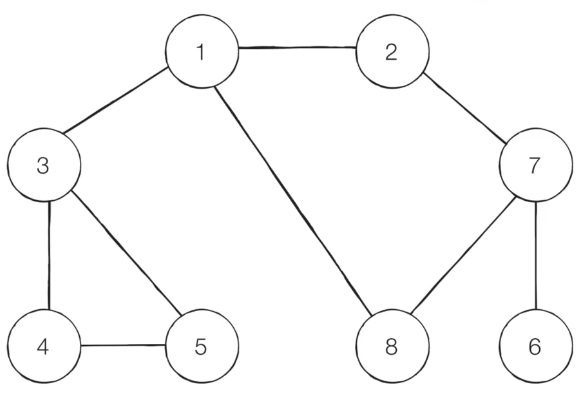
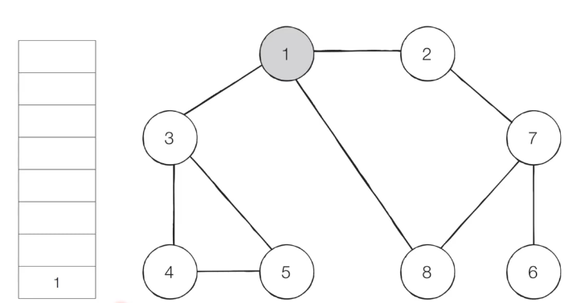
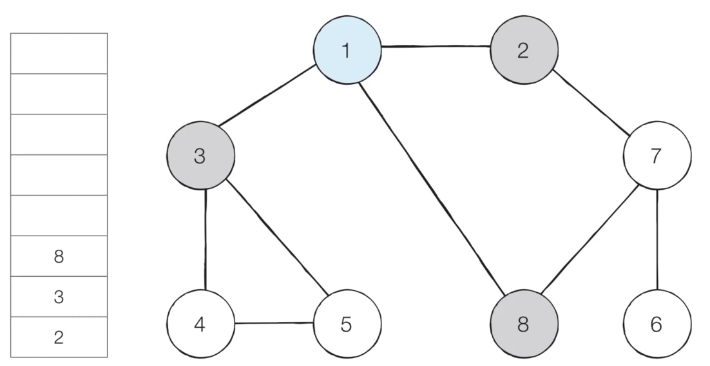
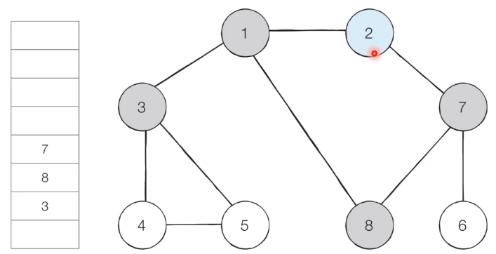
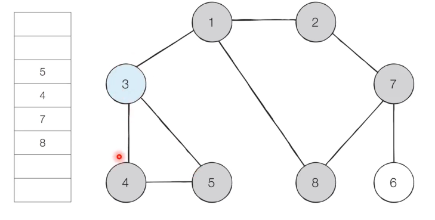
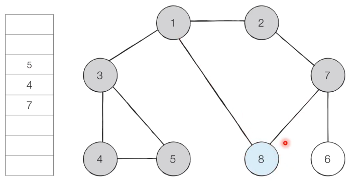
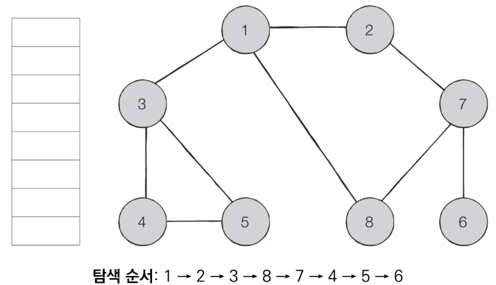

# Introduction

본 포스트는 알고리즘 학습에 대한 정리를 재대로 하기 위하여 남기는 것입니다. 더불어 기본 내용은 나동빈 저의 〖이것이 취업을 위한 코딩 테스트다〗라는 교재 및 유튜브 강의의 내용에서 발췌했고, 그 외 추가적인 궁금 사항들을 검색 및 정리해둔 것입니다.

# BFS (Breadth-First Search)

## 개념

- BFS는 **너비 우선 탐색**이라고도 부르며, 그래프에서 **가까운 노드부터 우선적으로 탐색하는 알고리즘**입니다.
- 대기업 코딩테스트에서 보통 주요하게 쓰이며, 최단 경로 구하는 문제에서 활용이 됩니다.
- 큐 자료구조를 사용하는 만큼, 각 언어마다 어떤 식으로 사용될 수 있는지 알아두는게 중요합니다.
- BFS는 큐 자료구조를 이용하며 구체적인 동작과정은 다음과 같습니다.
  1.  탐색 시작 노드를 큐에 삽입하고 방문 처리합니다.
  2.  큐에서 노드를 꺼낸 뒤에 해당 노드의 인접 노드 중 방문하지 않은 노드를 모두 큐에 삽입하고 방문 처리합니다.
  3.  더 이상 2번의 과정을 수행할 수 없을 때 까지 반복합니다.

## BFS 동작 예시



1. step 1 - 시작 노드 '1'을 큐에 삽입하고 방문 처리합니다.
   

2. step 2 - 큐에서 1을 꺼내 방문하지 않은 인접 노드 2, 3, 8 을 큐에 넣고 방문 처리합니다.
   

3. step 3 - 큐에서 2를 꺼내 방문하지 않은 인접 노드 1, 7 중 방문하지 않은 노드 7을 큐에 삽입하고 방문 처리를 합니다.
   

4. step 4 - 큐에서 3을 꺼내 방문하지 않은 인접 노드 4, 5를 큐에 삽입하고 방문 처리 합니다.
   

5. step 5 - 큐에서 8을 꺼내 방문하지 않은 인접 노드가 없으니, 무시하고 큐 안의 다음 경우로 넘어갑니다.
   
   
   → 이러한 과정을 반복하여 전체 노드의 탐색순서(큐에 들어간 순서는 다음과 같습니다.
   → 가장 가까운 곳부터 먼저 확인하는 구조를 갖고 있습니다. 그러다보니 시작 노드인 1번 노드부터 가까운 경우를 계속 탐색합니다. 즉 기준이 되는 위치에서 어떤 특정 위치나 값을 찾을 때 찾는 원리에서부터 최단거리를 구하기 쉬운 구조로 되어 있습니다.

## BFS 소스코드 예제(python)

```python
from collections import deque

# BFS 메서드 정의
def bfs(graph, start, visited):
	# 큐(Queue) 구현을 위해 deque 라이브러리 사용
	queue = deque([start])
	visited[start] = True
	while queue:
		v = queue.popleft()
		print(V, end=' ')
		for i in graph[v]:
			if not visited[i]:
				queue.append(i)
				visited[i] = True

graph = [
	[],
	[2, 3, 8],
	[1, 7],
	[1, 4, 5],
	[3, 5],
	[3, 4],
	[7],
	[2, 6, 8],
	[1, 7]
]

visited = [False] * 9
bfs(graph, 1, visited)

# 실행 결과
# 1 2 3 8 7 4 5 6
```

## BFS 소스코드 예제(C++)

```cpp
#include <bits/stdc++.h>

using namespace std;

bool visited[9];
vector<int>graph[9];

void bfs(int start)
{
	queue<int> q;
	q.push(start);
	visited[start] = true;
	while(!q.empty)
	{
		int x = q.front();
		q.pop();
		cout<< x << ' ';
		for (int i = 0; i < graph[x].size(); i++)
		{
			int y = graph[x][i];
			if (!visited[y])
			{
				q.push(y);
				visited[y] = true;
			}
		}
	}
}

int main(void)
{
	// 그래프 연결된 내용 생략
	// bfs(1)
	return (0);
}

```

[🧑🏻‍💻 알고리즘 박살내기 시리즈🧑🏻‍💻](https://paul2021-r.github.io/algorithm/20220411_00/)

```toc

```
