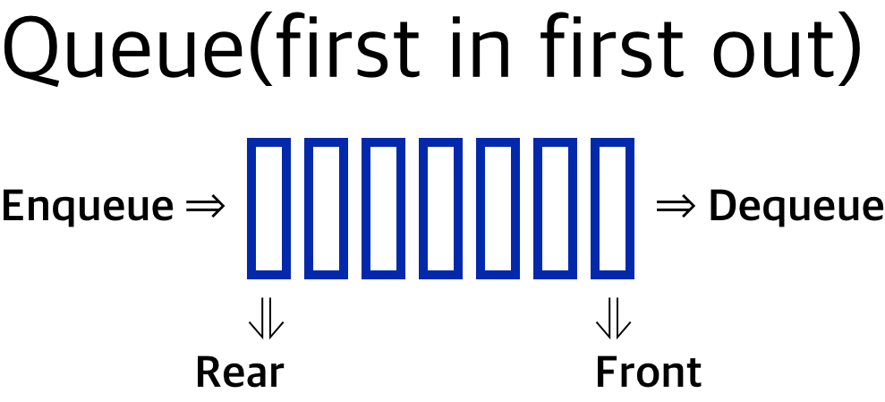

# Introduction

본 포스트는 알고리즘 학습에 대한 정리를 재대로 하기 위하여 남기는 것입니다. 더불어 기본 내용은 나동빈 저의 〖이것이 취업을 위한 코딩 테스트다〗라는 교재 및 유튜브 강의의 내용에서 발췌했고, 그 외 추가적인 궁금 사항들을 검색 및 정리해둔 것입니다.

# 자료구조 추가 학습

본 내용은 정리를 하던 도중 파이썬 내장 함수들 및 추가적으로 알아야 할 것들을 정리 할 겸, 쉴 겸 겸사겸사 작성해보는 포스트입니다. 위키 및 파이썬 공식문서들을 참조하여 정리한 내용입니다. 더불어 기본 개념은 16번 포스트를 참조 부탁드립니다 ㅎㅎ; 주된 참고 링크는 [여기](https://www.geeksforgeeks.org/queue-set-1introduction-and-array-implementation/?ref=lbp) 입니다.

# 큐

## 개념 설명

스택처럼, 큐는 일렬의 구조체이며, 이것은 작업이 수행되는 특정 순서에 따라 구성되어 있습니다. 선입선출(FIFO)의 구조를 갖고 있으며, 최초의 주문이 처음으로 손님에게 제공되는 것과 같은 구조라고 보시면 됩니다.

스택과 큐의 차이점은 제거하는 것에 있어서 차이를 보입니다. 스택 자료구조는 가장 최근에 삽입된 요소를 제거하는데 비해, 큐에선 가장 마지막에 추가된 요소를 제거합니다.

큐의 작동에선 다음의 기본적인 작동 방식을 따라갑니다.

1. Enqueue(대기열에 넣기) : 큐 안에 요소를 추가한다. 만약 큐가 꽉 차면, 오버플로우 상태라고 한다.
2. Dequeue(대기열에서 빼기) : 큐 안안에 요소를 제거한다. 요소는 pop되며, push 되었던 순서대로 진행된다. 큐가 비어있을 때는 언더플로우 상태라고 한다.
3. Front : 큐의 첫 요소를 얻는다.
4. Rear : 큐의 마지막 요소를 얻는데



## 큐의 적용

큐는 선입선출로 처리 되어야 하며, 급하게 처리할 필요가 없이 순차 실행으로 충분한 것들을 위한 구조입니다. 현재 배우고 있는 BFS에 보통 사용됩니다. 이런 큐의 성질은 다음의 경우에 종종 사용됩니다.

1. 다수의 사용자 사이에서 자원이 공유 될 때, 예를 들면 CPU 스케쥴링, 디스크 스케쥴링이 있다.
2. 데이터가 반듯이 보내지는 것과 같은 수준으로 받아야 할 필요가 없는, 비동기적 데이터 전환할 때, 예를 들어 IO 버퍼, 파이프라인, 파일 IO, 등이다.

## 큐의 배열 구현

큐를 구현하기 위해선, 2개의 지표를 지속적으로 확인해야합니다. front와 rear가 바로 그것인데, 큐에 삽입하고, 큐에서 제거할 때 각각 front로 삽입, rear로 제거하는 구조입니다. 보통 문제가 생기는 경우는 단순하게 front가 배열의 끝에 도달한 경우 문제가 생길수 있습니다. 따라서 이 문제에 대해서 해결을 하기 위해 아래와 같은 규정을 준수하면 됩니다.

## steps for Enqueue

1. 큐가 가득 찼는지, 아닌지를 검사합니다.
2. 큐가 가득 찼다면 오버플로우를 출력하고 종료합니다.
3. 큐가 가득 차지 않았다면, 꼬리쪽에 이를 추가하고, 이를 가리키는 표식도 1개 늘었음을 입력합니다.

## steps for Dequeue

1. 큐가 비어있는지, 아닌지를 검사합니다.
2. 만약 비어있다면 언더플로우를 출력하고 종료합니다.
3. 쿠가 비어있지 않았다면, 요소를 출력하고, 헤드(front) 값을 증가시켜 다음 값을 가리키도록 합니다.

## 큐의 구현

1. 배열을 통한 구현
   1. 장점 : 만들기 쉽다.
   2. 단점 : 정적인 데이터 구조체이며 고정된 사이즈 입니다. 만약 대량의 enqueue를 받고, dequeue 작업을 한다면, 일정 부분에서 큐가 비어있음에도 제대로 큐에 데이터를 삽입이 안되는 경우가 발생할 수 있습니다. (이를 dequeue 로 해결할 수 있습니다. 순환형 큐도 마찬가지로..)
   3. 기타 : 해당 방법은 기존의 나동빈님의 강의와는 다른 구조입니다. 참고용으로 보시면 될 것 같습니다. 나동빈 님의 말씀처럼, 리스트로 이렇게 구현하는 것은 학습용에 가까우며 실제 사용시 시간복잡도를 고려하여 덱 라이브러리를 사용하는게 효과적입니다.

```python
# python 을 통한 구현(배열)

# 큐를 나타내는 클래스 생성
class Queue:

    # __init__ function
	# capacity 는 큐의 할당할 길이를 의미합니다.
    def __init__(self, capacity):
        self.front = self.size = 0
        self.rear = capacity -1
        self.Q = [None]*capacity
        self.capacity = capacity

	# 큐가 사이즈와 같은 크기가 되었을 때, True를 출력합니다.
    def isFull(self):
        return self.size == self.capacity

	# 큐 사이즈가 0일 때, 비어있으면 True를 출력합니다.
    def isEmpty(self):
        return self.size == 0

	# 삽입(push) 기능 구현
    # It changes rear and size
    def EnQueue(self, item):
        if self.isFull():
            print("Queue is full.")
            return
		# 삽입이 되면서 끝을 가리키는 값이 달라집니다.
        self.rear = (self.rear + 1) % (self.capacity)
        self.Q[self.rear] = item
        self.size = self.size + 1
        print("% s enqueued to queue"  % str(item))

	# 제거(pop)기능 구현
    def DeQueue(self):
        if self.isEmpty():
            print("Queue is Empty")
            return

		# 제거 되면서, 멘 앞의 값이 1 증가하고 바뀝니다.
        print("% s dequeued from queue" % str(self.Q[self.front]))
        self.front = (self.front + 1) % (self.capacity)
        self.size = self.size -1

    # 큐의 front 부분의 값을 얻어냅니다.
    def que_front(self):
        if self.isEmpty():
            print("Queue is empty")

        print("Front item is", self.Q[self.front])

    # 큐의 rear 부분의 값을 얻어냅니다.
    def que_rear(self):
        if self.isEmpty():
            print("Queue is empty")
        print("Rear item is",  self.Q[self.rear])


# Driver Code
if __name__ == '__main__':

    queue = Queue(5) # capacity 를 입력시킵니다.
    queue.EnQueue(10)
    queue.EnQueue(20)
    queue.EnQueue(30)
    queue.EnQueue(40)
    queue.EnQueue(40)
    queue.EnQueue(40) # << 오버플로 발생 지점
    queue.DeQueue()
    queue.que_front()
    queue.que_rear()

# 실행 결과
# 10 enqueued to queue
# 20 enqueued to queue
# 30 enqueued to queue
# 40 enqueued to queue
# 40 enqueued to queue
# Queue is full.
# 10 dequeued from queue
# Front item is 20
# Rear item is 40
```

[🧑🏻‍💻 알고리즘 박살내기 시리즈🧑🏻‍💻](https://paul2021-r.github.io/algorithm/20220411_00/)

```toc

```
