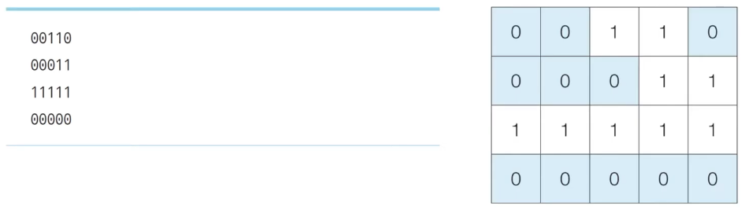
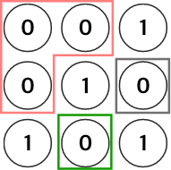
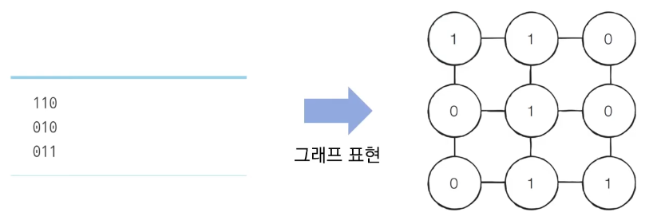
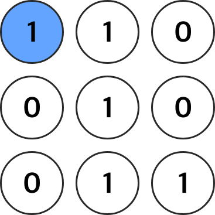
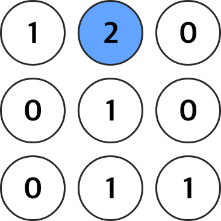
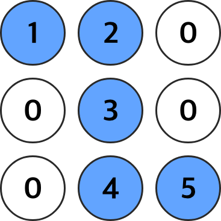

# Introduction

본 포스트는 알고리즘 학습에 대한 정리를 재대로 하기 위하여 남기는 것입니다. 더불어 기본 내용은 나동빈 저의 〖이것이 취업을 위한 코딩 테스트다〗라는 교재 및 유튜브 강의의 내용에서 발췌했고, 그 외 추가적인 궁금 사항들을 검색 및 정리해둔 것입니다.

# 음료수 얼려먹기

- N × M 크기의 얼음 틀이 있습니다. 구멍이 뚫려 있는 부분은 0, 칸막이가 존재하는 부분은 1로 표시됩니다. 구멍이 뚫려있는 부분끼리 상, 하, 좌, 우로 붙어 있는 경우 서로 연결되어 있는 것으로 간주합니다. 이때 **얼음틀의 모양이 주어졌을 때 생성되는 총 아이스크림의 개수를 구하는 프로그램**을 작성하세요. 다음 4 × 5 얼음틀의 예시에서는 아이스크림이 총 3개 생성됩니다.
- 연결요소 찾기의 유형과 유사합니다.

  _해당 그림을 참고하면 덩이는 총 3덩이가 구성될 수 있다._

## 문제 조건

1. 난이도 : 중
2. 풀이시간 : 30분
3. 시간제한 : 1초
4. 메모리 제한 : 128MB

- 입력조건 :
  1.  첫번째 줄에 얼음 틀의 세로 길이 N, 가로 길이 M 이 주어집니다. (1 <= N, M <= 1000)
  2.  두번째 줄부터 N + 1번째 줄까지 얼음 틀의 형태가 주어집니다.
  3.  이때 구멍이 뚤린 부분이 0, 칸막이가 1입니다.
- 출력조건 : 한번에 만들 수 있는 아이스크림의 개수를 출력합니다.
- 입력 예시 & 출력예시

  ```shell
  # 입력 예시
  4 5
  00110
  00011
  11111
  00000

  # 출력 예시
  3
  ```

## 문제 해결 아이디어

<details>
<summary> 내 아이디어 생각 </summary>
<span>
(주의) BFS, DFS 적용이 안 떠올라 내 멋데로 생각해본 것입니다. 
각 입력받은 얼음 틀의 줄마다 0과 1의 부분을 센다. 
4 × 5 => 각 줄에 대한 배열 arr 작성

1. 0이 연속적으로 나오면 하나로 친다. 즉, 0이 나오면 0이 끝나고 새로운 1이 나올 때 갯수를 센다.

   > 예) arr[0] => '00110' 이므로 0이 나온 부분이 2개다 => arr[0] == 2 ...
   >
   > 예 arr[1] => arr[1] = 1 ... arr[2] = 0(1이 한 줄), arr[3] = 1(0이 한 줄)

2. 각 줄을 타겟으로 삼고, 그 인덱스 줄의 -1, +1 한 줄이 >0 값이 나온다면, 겹칠 가능성이 있다는 것으로 판단한다.
3. 0이 있는 위치를 비교 0이 동시에 있는 인덱스는 하나로 취급한다. 아닌 경우 개별로 취급한다.
4. 인접한 줄에서 0이 나오지않은 arr[3]의 경우 1개로 취급한다.
5. 반복문으로 돌려 최종 공간의 수를 확보한다.
</span>
</details>

- 이 문제는 DFS, BFS 로 해결할 수 있습니다. 앞에서 배운대로 얼음을 얼릴 공간이 상하좌우 연결되어 있다고 볼 수 있고, 다음같은 형태로 예시를 잡으면서 생각해보면 됩니다.
  
- 각 칸이 인접한 노드라고 생각하고, 인접한 노드 중 0인 경우를 방문처리한다고 하면 최적의 경로를 전부 찾는 방식으로 한다면, 동시에 1은 접근 불가능한 노드라고 판단하여 넘어가면 된다.
- DFS를 활용하는 알고리즘은 다음과 같습니다.
  1.  특정한 지점의 주변 상, 하, 좌, 우를 살펴본 뒤 주변 지점 중 값이 0, 미 방문 지점만을 도출 아직 도착하지 않은 지점은 방문 처리합니다.
  2.  방문한 지점에서 다시 상하좌우를 살펴보는 방식으로 하여 연결된 모든 지점을 방문 할 수 있습니다.
  3.  노드에 대한 1, 2번의 과정을 반복하면서 방문하지 않은 지점의 수를 카운트 합니다.

## 문제 답안 예시(Python)

```python
def dfs(x, y):
	if x <= -1 or x >= n or y <= -1 or y >= m: # 예외 처리
		return False
	if graph[x][y] == 0:
		# 여기서 1인 경우를 만나면 더이상 탐색을 하지 않음
		# 즉 0을 발견한 순간부터, 그 근처를 확인하기 시작함.
		graph[x][y] = 1
		# 방문 처리를 하여서 더 이상 이중 탐색되지 않되도록 만듭니다.
		dfs(x - 1, y)
		dfs(x, y - 1)
		dfs(x + 1, y)
		dfs(x, y + 1)
		return True
	return False

# N, M을 공백을 기준으로 구분하여 입력 받기
n, m = map(int, input().split())

# 2차원 리스트의 맵 정보 입력 받기
graph = []
for i in range(n):
	graph.append(list(map(int, input())))

# 모든 노드(위치)에 대하여 음료수 채우기
result = 0
for i in range(n):
	for j in range(m):
		if dfs(i, j) == True:
			result += 1

print(result)
```

## 문제 답안 예시(C++)

```cpp
#include <bits/stdc++.h>

using namespace std;

int n, m;
int graph[1001][1001];
// DFS로 특정 노드를 방문하고 연결된 모든 노드들도 방문
bool	dfs(int x, int y)
{
	if (x <= -1|| x >= n || y <= -1 || y >= m)
		return false;
	if (graph[x][y] == 0)
	{
		graph[x][y] = 1;
		dfs(x - 1, y);
		dfs(x, y - 1);
		dfs(x + 1, y);
		dfs(x, y + 1);
		return true;
	}
	return false;
}

int main(void)
{
	cin >> n >> m;
	for (int i = 0; i < n; i++)
		for (int j = 0; j < m ; j++)
			scanf("%1d", &graph[i][j]);

	int		result = 0;
	bool	check = 0;
	// 최적화를 위한 check변수 입니다. 0, false로 넣어도 됩니다.
	for (int i = 0; i < n; i++)
	{
		for (int j = 0; j < m ; j++)
		{
			check = dfs(i, j);
			if (check)
			{
				result += 1;
				check = 0;
			}
		}
	}
	cout << result << '\n';
}
```

# 미로 탈출

## 문제 설명

- 어떤 사람이 N × M 크기의 직사각형 형태의 미로에 갇혔습니다. 미로에는 괴물들이 여러 마리 있어 이를 피해 탈출 해야 합니다.
- 현재의 위치는 (1, 1) 이며, 미로 출구는 (N, M) 위치에 존재하며 한 번에 한 칸씩 이동할 수 잇습니다. 괴물이 있으면 0, 괴물이 없는 부분은 1로 표시되어 있습니다. 미로는 반드시 탈출 가능 형태로 제시됩니다.
- 이때 그가 탈출하기 위한 최소 칸의 개수를 구하세요. 칸을 셀 대는 시작 칸과 마지막 칸을 모두 포함해서 계산합니다.

## 문제 조건

1. 난이도 : 중
2. 풀이시간 : 30분
3. 시간 제한 : 1초
4. 메모리 제한 : 128 MB

- 입력 조건
  1.  첫째 줄에 두 정수 N, M이 주어집니다. (4 <= N, M <= 200)
  2.  두번째 줄부터 각 N개의 줄에는 각 M개의 정수(0 or 1)의 미로 정보가 제공됩니다.
  3.  각 수들은 공백없이 붙어서 입력으로 제시됩니다.
  4.  또한 시작칸과 마지막 칸은 항상 1입니다.
- 출력 조건 : 첫째 줄에 최소 이동 칸의 개수를 출력합니다.

  ```shell
  # 입력 예시
  5 6
  101010
  111111
  000001
  111111
  111111

  # 출력 예시
  10
  ```

## 문제 해결 아이디어

- BFS는 시작지점에서 가까운 노드부터 차례대로 그래프의 모든 노드를 탐색합니다.
- 상, 하, 좌, 우로 연결된 모든 노드로의 거리가 1로 동일합니다. 따라서 (1,1) 지점부터 BFS를 수행하여 모든 노드의 최단거리 값을 기록하면 해결할 수 있습니다.
- 예를 들어 3 × 3 크기의 미로가 있다면...



1. 처음 (1, 1) 위치에 시작합니다.
   
2. (1, 1) 좌표에서 상, 하, 좌, 우로 탐색하여 진행을 하면서 옆 노드인(1, 2)위치를 방문하게 되면 해당 노드까지 거리를 누적하듯 적습니다.
   
3. 이를 반복하여 진행하게 되면, 갈 수 있는 거리에 따라 각 노드의 거리값이 1씩 누적이 되게 되고, 우리가 원하는 위치에 얼마인지 값을 리턴하면 됩니다. (3 × 3의 경우 마지막(3, 3) 노드가 5가 되므로 최소 거리는 5가 되게 됩니다.
   

## 답안 예시(Python)

```python
from collections import deque
# 덱 사용을 위해 라이브러리 호출한다.

def bfs(x, y):
	queue = deque()
	queue.append((x, y)) # 첫 값을 그대로 집어 넣는다.
	while queue:
		x, y = queue.popleft() # 해당 값을 밖으로 끄집어 낸다.
		for i in range(4):
			nx = x + dx[i] # 다음 상하좌우를 탐색하기
			ny = y + dy[i]
			if nx < 0 or nx >= n or ny < 0 or ny >= m :
				continue # 위치가 범위에서 벗어나는 경우 무시
			if graph[nx][ny] == 0:
				continue # 괴물이 나오는 경우(벽인 경우) 무시
			if graph[nx][ny] == 1:
				graph[nx][ny] = graph[x][y] + 1
				queue.append((nx, ny))
				# 갈 수 있는 경우 해당 노드 도착하여 기존의 이동거리 누적, 큐 안에 집어 넣는다.
	return graph[n - 1][m - 1]

n, m = map(int, input().split())
graph = []
for i in range(n):
	graph.append(list(map(int, input())))
dx = [-1, 1, 0, 0]
dy = [0, 0, -1, 1]

print(bfs(0, 0))

# 실행 결과 및 작동후 graph 형태
# 5 6
# 101010
# 111111
# 000001
# 111111
# 111111
# [3, 0, 5, 0, 7, 0]
# [2, 3, 4, 5, 6, 7]
# [0, 0, 0, 0, 0, 8]
# [14, 13, 12, 11, 10, 9]
# [15, 14, 13, 12, 11, 10]
# 10
```

## 답안 예시(C++)

```cpp
#include <bits/stdc++.h>

using namespace std;

int bfs(int x, int y)
{
	// 큐를 구현하고자 queue 라이브러리를 쓰며, 페어 객체를 활용합니다.
	queue<pair<int, int> >q;
	q.push({x, y});
	while(!q.empty())
	{
		int x = q.front().first;
		int y = q.front().second;
		q.pop();
		for(int i = 0; i < 4; i++)
		{
			int nx = x + dx[i];
			int ny = y + dy[i];
			if (nx < 0 || nx >= n || ny < 0 || ny >= m)
				continue ;
			if (graph[nx][ny] == 0)
				continue ;
			if (graph[nx][ny] == 1)
			{
				graph[nx][ny] = graph[x][y] + 1;
				q.push({nx, ny});
			}
		}
	}
	return graph[n - 1][m - 1];
}

int n, m;
int graph[201][201];
int dx[] = {-1, 1, 0, 0};
int dy[] = {0, 0, -1, 1};

int main(void)
{
	cin >> n >> m;
	for (int i = 0; i < n; i++)
	{
		for (int j = 0; j < m; j++)
			scanf("%1d", &grarph[i][j]);
	}
	cout << bfs(0, 0) << '\n';
	return  0;
}
```

[🧑🏻‍💻 알고리즘 박살내기 시리즈🧑🏻‍💻](https://paul2021-r.github.io/algorithm/20220411_00/)

```toc

```
