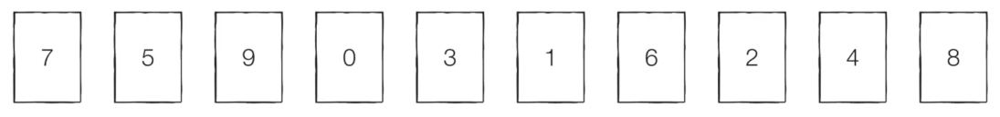

# Introduction

본 포스트는 알고리즘 학습에 대한 정리를 재대로 하기 위하여 남기는 것입니다. 더불어 기본 내용은 나동빈 저의 〖이것이 취업을 위한 코딩 테스트다〗라는 교재 및 유튜브 강의의 내용에서 발췌했고, 그 외 추가적인 궁금 사항들을 검색 및 정리해둔 것입니다.

# 선택정렬

## 정렬

- 정렬(sorting)이란 데이터를 특정 기준에 따 순서대로 나열한 것을 말합니다.
- 일반적으로 문제 상황에 따라서 적절한 정렬 알고리즘이 공식처럼 사용됩니다.
  

## 선택 정렬

- 처리되지 않은 데이터 중에서 가장 작은 데이터를 선택해 맨 앞에 있는 데이터와 바꾸는 것을 반복합니다.
- 동작 순서
  1.  처리되지 않은 데이터 중 가장 작은 데이터를 선택해, 최상단으로 옮깁니다.
  2.  처리 되지 않은 데이터 중 가장 작은 데이터를 선택해서, 이전에 정렬된 가장 작은데이터를 제외하고, 그 다음 위치와 자리를 바꿉니다. ...
  3.  이런 식으로 계속 반복하여 정렬되지 않은 데이터의 배열의 끝 - 1 까지 정렬을 마무리 지으면 정렬이 마무리 됩니다. (**선형 탐색 - Linear Search**)

## 선택 정렬 소스코드(python)

```python
array = [7, 5, 9, 0, 3, 1, 6, 2, 4, 8]

print("0 단 계 :" array)

for i in range (len(array)):
	min_index = i # 가장 작은 인덱스를 지정합니다.
	for j in range (i + 1, len(array)):
		if array[min_index] > array[j]:
			min_index = j;
	array[i], array[min_index] = array[min_index], array[i] # 스왑
	print(i + 1, "단계 :", array)

print (array)

# 실행 결과(순차별로)
# 0 단계 : [7, 5, 9, 0, 3, 1, 6, 2, 4, 8]
# 1 단계 : [0, 5, 9, 7, 3, 1, 6, 2, 4, 8]
# 2 단계 : [0, 1, 9, 7, 3, 5, 6, 2, 4, 8]
# 3 단계 : [0, 1, 2, 7, 3, 5, 6, 9, 4, 8]
# 4 단계 : [0, 1, 2, 3, 7, 5, 6, 9, 4, 8]
# 5 단계 : [0, 1, 2, 3, 4, 5, 6, 9, 7, 8]
# 6 단계 : [0, 1, 2, 3, 4, 5, 6, 9, 7, 8]
# 7 단계 : [0, 1, 2, 3, 4, 5, 6, 9, 7, 8]
# 8 단계 : [0, 1, 2, 3, 4, 5, 6, 7, 9, 8]
# 9 단계 : [0, 1, 2, 3, 4, 5, 6, 7, 8, 9]
# 10 단계 : [0, 1, 2, 3, 4, 5, 6, 7, 8, 9]
# [0, 1, 2, 3, 4, 5, 6, 7, 8, 9]
```

## 선택 정렬 소스코드(C++)

```cpp
#include <bits/stdc++.h>

using namespace std;

int n = 10;
int target[10] = {7, 5, 9, 0, 3, 1, 6, 2, 4, 8};

int	main(void)
{
	for (int i = 0; i < n; i++)
	{
		int min_index = i;
		for (int j = i + 1; j < n; j++)
		{
			if (target[min_index] > target[j])
				min_index = j;
		}
		swap(target[i], target[min_index]);
	}
	for (int i = 0; i < n; i++)
		cout << target[i] << ' ';
	return (0);
}
```

## 선택 정렬의 시간 복잡도

- 선택 정렬은 N번 만큼의 가장 작은 수를 찾아서 맨 앞으로 보내야 한다.
- 구현방식의 오차는 있을 수 있지만, 전체 연산횟수는 다음과 같습니다.
<center>
N + (N - 1) + (N - 2) + ... + 2
</center>
</p>

- 이는 (N^2 + N - 2)/2 로 표현할 수 있고, 제일 큰 차수의 항으로 계산하는 빅오 표기법에 따라서 O(N^2)라고 작성합니다.

[🧑🏻‍💻 알고리즘 박살내기 시리즈🧑🏻‍💻](https://paul2021-r.github.io/algorithm/20220411_00/)

```toc

```
