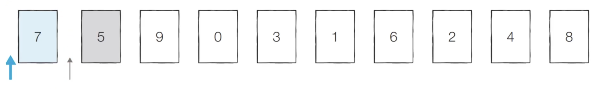
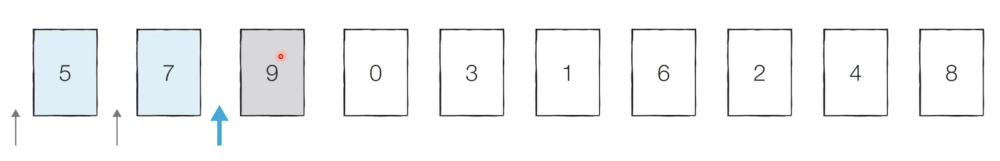
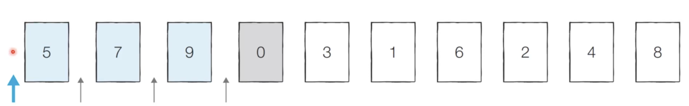
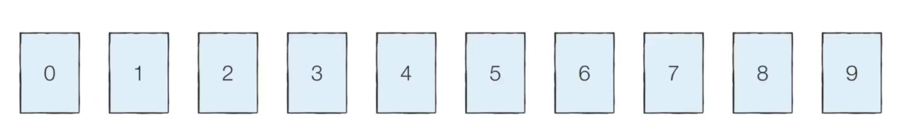

# Introduction

본 포스트는 알고리즘 학습에 대한 정리를 재대로 하기 위하여 남기는 것입니다. 더불어 기본 내용은 나동빈 저의 〖이것이 취업을 위한 코딩 테스트다〗라는 교재 및 유튜브 강의의 내용에서 발췌했고, 그 외 추가적인 궁금 사항들을 검색 및 정리해둔 것입니다.

# 삽입정렬

## 개념

- 처리되지 않은 데이터를 하나씩 골라 적절한 위치에 삽입합니다.
- 선택 정렬에 비해 구현 난이도가 높은 편이지만, 일반적으로 더 효율적으로 동작합니다.

## 삽입 정렬 동작 예시

- step 0 : 0번 데이터 ‘7’은 정렬되어 있다고 판단, 두 번째 데이터 ‘5’ 가 어떤 위치로 들어갈지 판단합니다.
  ⇒ 7을 기준으로 왼쪽, 오른쪽 두 경우 중 어느 경우인지 판단합니다.
  
- step 1: 이어서 9가 어떤 위치로 들어갈지 판단합니다.
  ⇒ 차례대로 왼쪽 데이터와 비교하여 더 작으면 자리를 바꿉니다.
  
- step 2 : 0을 값의 왼쪽가 비교하여 위치를 확인하고, 원소를 바꿔가면서 들어갈 자릴 판단합니다.
  
- 이러한 방식으로 기준 값으로 거꾸로 가면서 위치를 찾으면 정렬이 마무리 됩니다.
  

## 삽입 정렬 소스코드 (Python)

```python
array = [7, 5, 9, 0, 3, 1, 6, 2, 4, 8]

for i in range (1, len(array)):
	for j in range (i, 0, -1)
		if array[j] < array[j - 1]:
			array[j], array[j - 1] = array[j - 1], array[j];
		else :
			break
		print(array)
print(array)

# 실행 결과
# [5, 7, 9, 0, 3, 1, 6, 2, 4, 8]
# [5, 7, 0, 9, 3, 1, 6, 2, 4, 8]
# [5, 0, 7, 9, 3, 1, 6, 2, 4, 8]
# [0, 5, 7, 9, 3, 1, 6, 2, 4, 8]
# [0, 5, 7, 3, 9, 1, 6, 2, 4, 8]
# [0, 5, 3, 7, 9, 1, 6, 2, 4, 8]
# [0, 3, 5, 7, 9, 1, 6, 2, 4, 8]
# [0, 3, 5, 7, 1, 9, 6, 2, 4, 8]
# [0, 3, 5, 1, 7, 9, 6, 2, 4, 8]
# [0, 3, 1, 5, 7, 9, 6, 2, 4, 8]
# [0, 1, 3, 5, 7, 9, 6, 2, 4, 8]
# [0, 1, 3, 5, 7, 6, 9, 2, 4, 8]
# [0, 1, 3, 5, 6, 7, 9, 2, 4, 8]
# [0, 1, 3, 5, 6, 7, 2, 9, 4, 8]
# [0, 1, 3, 5, 6, 2, 7, 9, 4, 8]
# [0, 1, 3, 5, 2, 6, 7, 9, 4, 8]
# [0, 1, 3, 2, 5, 6, 7, 9, 4, 8]
# [0, 1, 2, 3, 5, 6, 7, 9, 4, 8]
# [0, 1, 2, 3, 5, 6, 7, 4, 9, 8]
# [0, 1, 2, 3, 5, 6, 4, 7, 9, 8]
# [0, 1, 2, 3, 5, 4, 6, 7, 9, 8]
# [0, 1, 2, 3, 4, 5, 6, 7, 9, 8]
# [0, 1, 2, 3, 4, 5, 6, 7, 8, 9]
# [0, 1, 2, 3, 4, 5, 6, 7, 8, 9]
```

## 삽입 정렬 소스코드(C++)

```cpp
#include <bits/stdc++.h>

using namespace std;

int n = 10;
int target[10] = {7, 5, 9, 0, 3, 1, 6, 2, 4, 8};

int main(void)
{
	for (int i = 1; i < n; i++)
	{
		for (int j = i; j > ; j--)
		{
			if (target[j] < target[j - 1])
				swap(target[j], target[j - 1]);
			else
				break ;
		}
	}
	for (int i = 0; i < n< i++)
	{
		cout << target[i] << ' '
	}
	return (0);
}

// 실행결과
// 0 1 2 3 4 5 6 7 8 9

```

## 삽입 정렬의 시간 복잡도

- 삽입 정렬의 시간 복잡도는 O(N^2) 이며, 선택 정렬과 마찬가지로 반복문이 두 번 중첩되어 사용됩니다.
- 삽입 정렬은 현재의 리스트의 데이터가 거의 정렬되어 있는 상태라면 빠르게 동작합니다.
  - 최선의 경우 O(N) 의 시간 복잡도를 가집니다.
  - 이미 정렬되어 있는 상태에서 다시 삽입 정렬을 수행하면 어떻게 될까?

[🧑🏻‍💻 알고리즘 박살내기 시리즈🧑🏻‍💻](https://paul2021-r.github.io/algorithm/20220411_00/)

```toc

```
