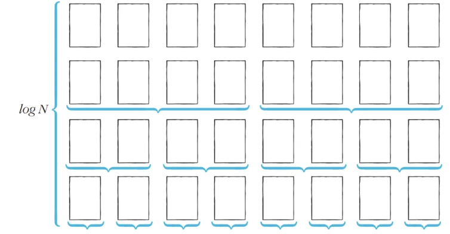

# Introduction

본 포스트는 알고리즘 학습에 대한 정리를 재대로 하기 위하여 남기는 것입니다. 더불어 기본 내용은 나동빈 저의 〖이것이 취업을 위한 코딩 테스트다〗라는 교재 및 유튜브 강의의 내용에서 발췌했고, 그 외 추가적인 궁금 사항들을 검색 및 정리해둔 것입니다.

# 덧

중간에 뻬먹어서 재 포스팅합니다 ㅎㅎ!

# 퀵정렬

## 개념

- 기준 데이터를 설정하고, 그 **기준보다 큰 데이터와 작은 데이터의 위치를 바꾸는 방법**입니다.
- 일반적인 상황에서 가장 많이 사용되는 정렬 알고리즘 중 하나입니다.
- 병합정렬과 더불어 프로그래밍 언어 정렬 라이브러리의 근간이 되는 알고리즘입니다.
- 가장 기본적인 퀵 정렬은 **첫 번째 데이터를 기준 데이터(Pivot)**으로 설정합니다.

## 퀵 정렬 동작 예시

- Step 0
  피봇 값은 5, 왼쪽 부터 큰 데이터를 선택하므로 7이 되고 오른쪽부터 5보다 작은 값을 선택하므로 두 데이터 위치를 서로 변경합니다.

| **pivot** | ➡︎  |     |     |     |     |     |     | ⬅︎  |     |
| :-------: | :-: | :-: | :-: | :-: | :-: | :-: | :-: | :-: | :-: |
|    `5`    | `7` |  9  |  0  |  3  |  1  |  6  |  2  | `4` |  8  |

- Step 1
  피봇 값은 5, 4와 7을 바꾸고 왼쪽에선 다시 5보다 큰 값, 오른쪽에선 피봇보다 작은 값을 찾은 뒤 서로 위치를 바꿔줍니다.

| **pivot** |     | ➡︎  |     |     |     |     | ⬅︎  |     |     |
| :-------: | :-: | :-: | :-: | :-: | :-: | :-: | :-: | :-: | :-: |
|    `5`    |  4  | `9` |  0  |  3  |  1  |  6  | `2` |  7  |  8  |

- Step 2
  피봇 값은 5, 동일한 방식으로 진행하다가, 왼쪽에서 진행하던 값이 6을, 오른쪽으로 진행하던 값이 1을 지정하게 되어, **위치가 엇갈리는 경우 '피벗'과 작은 데이터'의 위치를 서로 변경**합니다.

| **pivot** |     |     |     |     | ⬅︎  | ➡︎  |     |     |     |
| :-------: | :-: | :-: | :-: | :-: | :-: | :-: | :-: | :-: | :-: |
|    `5`    |  4  |  2  |  0  |  3  | `1` | `6` |  9  |  7  |  8  |

- 분할 완료
  이제 5의 왼쪽엔 5보다 작은 데이터가, 오른쪽엔 5보다 큰 데이터로 분할 됩니다. 이렇게 피벗을 기준으로 데이터 묶음을 나누는 작업을 `분할(Devide, Partition)` 라고 합니다.

|  5  | 보  | 다  | 작  | 음  | `⬇︎` |  5  | 보  | 다  | 큼  |
| :-: | :-: | :-: | :-: | :-: | :--: | :-: | :-: | :-: | :-: |
|  1  |  4  |  2  |  0  |  3  | `5`  |  6  |  9  |  7  |  8  |

- 왼쪽 데이터 묶음 정렬
  왼쪽에 있는 데이터에 대해서 마찬가지 방식으로 정렬(분할)을 진행합니다.

| **pivot** | ➡︎  |     | ⬅︎  |     |     |     |     |     |     |
| :-------: | :-: | :-: | :-: | :-: | :-: | :-: | :-: | :-: | :-: |
|    `1`    | `4` |  2  | `0` |  3  |  5  |  6  |  9  |  7  |  8  |

- 오른쪽 데이터 묶음 정렬
  마찬가지로 따로 데이터 정렬(분할)을 진행합니다.

|     |     |     |     |     |     | **pivot** |     |     |     |
| :-: | :-: | :-: | :-: | :-: | :-: | :-------: | :-: | :-: | :-: |
|     |     |     |     |     |     |    ⬅︎     | ➡︎  |     |     |
|  1  |  4  |  2  |  0  |  3  |  5  |    `6`    | `9` |  7  |  8  |

- 여기서 중요한 점은 해당 방식으로 더 이상 분할 가능한 수준까지 계속 정렬을 진행하는, 재귀적인 방식의 정렬을 수행한다고 보시면 됩니다.

## 퀵 정렬이 빠른 이유 : 직관적인 이해

- 이상적인 경우 분할이 절반씩 일어난다면 전체 연산 횟수로 O(NlogN)을 기대할 수 있습니다.
- 너비 × 높이 = 𝑁 × 𝑙𝑜𝘨𝑁 = 𝑁𝑙𝑜𝘨𝑁

_점점 내려갈 수록 연산 횟수가 %2가 되고, 데이터 개수 N이기 때문에 시간복잡도가 빨라진다._

## 퀵 정렬의 시간 복잡도

- 퀵 정렬의 경우 O(𝑁𝑙𝑜𝘨𝑁)의 시간 복잡도를 가집니다.
- 최악의 경우 O(𝑁²)의 시간 복잡도를 가집니다. : 한 쪽 방향으로 편향된 분할이 발생 시
  - 첫 번째 원소를 피봇으로 삼아 진행 시 이미 정렬된 배열에서 퀵 정렬을 수행시 발생됩니다.

| **pivot** |     |     |     |     |     |     |     |     |     |
| :-------: | :-: | :-: | :-: | :-: | :-: | :-: | :-: | :-: | :-: |
|    `0`    |  1  |  2  |  3  |  4  |  5  |  6  |  7  |  8  |  9  |

## 퀵 정렬 소스코드 : 일반적인 방식(Python)

```python
array = [5, 7, 9, 0, 3, 1, 6, 2, 4, 8]

def quick_sort(array, start, end):
	if (start >= end): # 원소가 1개면 종료
		return
	pivot = start # 피벗은 들어오는 범위에서 첫 번째 원서
	left = start + 1
	right = end
	while(left <= right):
		# 피봇보다 큰 데이터 나오면 종료
		while(left <= end and array[left] <= array[pivot]):
			left += 1
		# 피봇보다 작은 데이터 나오면 종료
		while(right > start and array[right] >= array[pivot]):
			right -=1
		if (left > right): # 엇갈렸다면, 작은데이터, 피봇을 교체(나누기))
			array[right], array[pivot] = array[pivot], array[right]
		else:
			array[left], array[right] = array[right], array[left]
	print(array) # 과정 확인용
	# 분할 이후 왼쪽 부분, 오른쪽 부분을 피봇으로 나누고, 해당 위치에서 다시 분할 시작
	quick_sort(array, start, right - 1)
	quick_sort(array, right + 1, end)

quick_sort(array, 0, len(array) - 1)
print(array)

# 실행 결과
# [1, 4, 2, 0, 3, 5, 6, 9, 7, 8]
# [0, 1, 2, 4, 3, 5, 6, 9, 7, 8]
# [0, 1, 2, 4, 3, 5, 6, 9, 7, 8]
# [0, 1, 2, 3, 4, 5, 6, 9, 7, 8]
# [0, 1, 2, 3, 4, 5, 6, 9, 7, 8]
# [0, 1, 2, 3, 4, 5, 6, 8, 7, 9]
# [0, 1, 2, 3, 4, 5, 6, 7, 8, 9]
# [0, 1, 2, 3, 4, 5, 6, 7, 8, 9]
```

## 퀵 정렬 소스 코드 : 일반적인 방식(C++)

```cpp
#include <bits/stdc++.h>

using namespace std;

int n = 10;
int target[10] = {5, 7, 9, 0, 3, 1, 6, 2, 4, 8}

void	quickSort(int *target, int start, int end)
{
	if (start >= end)
		return ;

	int	pivot = start;
	int	left = start + 1;
	int	right = end;
	while (left <= right)
	{
		while(left <= end && target[left] <= target[pivot])
			left++;
		while(right > start && target[right] >= target[pivot])
			right--;
		if (left > right)
			swap(target[pivot], target[right]);
		else
			swap(target[left], target[right]);
	}
	quickSort(target, start, right - 1);
	quickSort(target, right + 1, end);
}

int	main(void)
{
	quickSort(target, 0, n - 1);
	for (int i = 0; i < n; i++)
		cout << target[i] << ' ';
	return (0);
}

```

## 퀵 정렬 소스코드 : 파이썬의 장점을 살린 방식

- list comprehension 기법을 활용해서 굉장히 간단하게 구현한 퀵 소트 입니다.
- 파이썬에 대해 여전히 연구가 필요한데, 상당히 간결한게 눈에 보입니다.(문제는 사용자인 내가 아직 확 와닻지 않는다는 거 😂)

```python
array = [5, 7, 9, 0, 3, 1, 6, 2, 4, 8]

def quick_sort(array):
	if len(array) <= 1 :
		return array
	pivot = array[0] # 피봇
	tail = array[1:] # 피봇을 제외한 리스트

	left_side = [x for x in tail if x <= pivot] # 분할된 왼쪽 부분
	right_side = [x for x in tail if x > pivot] # 분할된 오른쪽 부분
    # print("left :", left_side) # 과정 확인용
    # print("right :", right_side)
    # print("whole :", array)
	return quick_sort(left_side) + [pivot] + quick_sort(right_side)

print(quick_sort(array))

# 실행결과
# 과정
# left : [0, 3, 1, 2, 4]
# right : [7, 9, 6, 8]
# whole : [5, 7, 9, 0, 3, 1, 6, 2, 4, 8]
# left : []
# right : [3, 1, 2, 4]
# whole : [0, 3, 1, 2, 4]
# left : [1, 2]
# right : [4]
# whole : [3, 1, 2, 4]
# left : []
# right : [2]
# whole : [1, 2]
# left : [6]
# right : [9, 8]
# whole : [7, 9, 6, 8]
# left : [8]
# right : []
# whole : [9, 8]
# [0, 1, 2, 3, 4, 5, 6, 7, 8, 9]
# 최종
# [0, 1, 2, 3, 4, 5, 6, 7, 8, 9]
```

[🧑🏻‍💻 알고리즘 박살내기 시리즈🧑🏻‍💻](https://paul2021-r.github.io/algorithm/20220411_00/)

```toc

```
