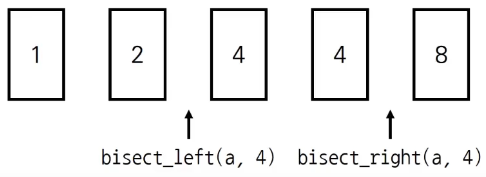

# Introduction

본 포스트는 알고리즘 학습에 대한 정리를 재대로 하기 위하여 남기는 것입니다. 더불어 기본 내용은 나동빈 저의 〖이것이 취업을 위한 코딩 테스트다〗라는 교재 및 유튜브 강의의 내용에서 발췌했고, 그 외 추가적인 궁금 사항들을 검색 및 정리해둔 것입니다.

# 이진 탐색 알고리즘

## 개념

- 순차 탐색 : 리스트 안에 있는 특정한 데이터를 찾기 위해 **앞에서부터 데이터를 하나씩 확인하는 방법**
- 이진 탐색 : 정렬되어 있는 리스트에서 탐색 **범위를 절반씩 좁혀가며** 데이터를 탐색하는 방법 (시작점, 끝점, 중간점을 이용하여 탐색 범위 설정 방법)</p>
  ➡︎ 이렇게 탐색을 구현할 경우, 탐색 연산의 시간복잡도를 로그단위로 떨어뜨릴 수 있어 탐색 시 유효합니다.

## 이진 탐색 동작 예시

- 이미 정렬된 10개의 데이터 중에서 값이 4인 원소를 찾는 예시

|     |     | ⬇︎  |     |     |     |     |     |     |     |
| :-: | :-: | :-: | :-: | :-: | :-: | :-: | :-: | :-: | :-: |
|  0  |  2  | `4` |  6  |  8  | 10  | 12  | 14  | 16  | 18  |

- step 1 : 시작점(0), 끝점(9), 중간점(4, 소수점 이하는 제거)로 설정합니다.
- ✓ : 보통 짝수로 끝나는 경우 중간점이 명확하게 나오지 못할 수 있고, 이 경우 소수점 이하를 제거하는 방식으로 합니다. (9 / 2 = 4.5 ➡︎ 4)

|  arr[0]  |     | ⬇︎  |     |  arr[4]  |     |     |     |     | arr[9] |
| :------: | :-: | :-: | :-: | :------: | :-: | :-: | :-: | :-: | :----: |
|    0     |  2  | `4` |  6  |    8     | 10  | 12  | 14  | 16  |   18   |
| `시작점` |     |     |     | `중간점` |     |     |     |     | `끝점` |

- step 2 : 증간점을 기준으로 하여, 찾을 수가 큰지, 작은지를 판단하여 좌, 우 중 어느 쪽이 맞는지를 확인합니다.
- 시작점(0), 끝점(3), 중간점(1)
- 재귀적으로 탐색 범위를 축소 시켜 나가면 됩니다.

|  arr[0]  |          | ⬇︎  |        | arr[4] |        |        |        |        | arr[9] |
| :------: | :------: | :-: | :----: | :----: | :----: | :----: | :----: | :----: | :----: |
|    0     |    2     | `4` | ~~6~~  | ~~8~~  | ~~10~~ | ~~12~~ | ~~14~~ | ~~16~~ | ~~18~~ |
| `시작점` | `중간점` |     | `끝점` |        |        |        |        |        |        |

| arr[0] |       |          ⬇︎          |        | arr[4] |        |        |        |        | arr[9] |
| :----: | :---: | :------------------: | :----: | :----: | :----: | :----: | :----: | :----: | :----: |
| ~~0~~  | ~~2~~ |         `4`          | ~~6~~  | ~~8~~  | ~~10~~ | ~~12~~ | ~~14~~ | ~~16~~ | ~~18~~ |
|        |       | `시작점`</p>`중간점` | `끝점` |        |        |        |        |        |        |

## 이진 탐색의 시간 복잡도

- 단계마다 탐색 범위를 2로 나누는 것과 동일하므로 연산횟수는 𝑙𝑜𝘨₂𝑁에 비례합니다.
- 데이터가 초기 32개 라면, 1단계를 거쳐 16개로 줄고, 2단계엔 8개, 3단계엔 4개로 줄어듭니다.
- 따라서 이진 탐색은 시간복잡도 𝘖(𝑙𝑜𝘨𝑁)을 보장합니다.

## 이진 탐색 소스코드: 재귀적 / 반복문 구현 (Python)

```python
def binary_search_recursive(array, target, start, end):
	if (start > end):
		return None # 재귀 종료를 위한 조건문
	mid = (start + end) // 2
	if (array[mid] == target): # 기준이 되는 중간점이 target인 경우
		return mid
	elif array[mid] > target: # 중간점 기준 왼쪽을 탐색
		return binary_search_recursive(array, target, start, mid - 1)
	else : # 중간점 기준 오른쪽을 탐색
		return binary_search_recursive(array, target, mid + 1, end)

def binary_search_iterate(array, target, start, end):
	while start <= end:
		mid = (start + end) //2
		if array[mid] == target:
			return mid
		elif array[mid] > target:
			end = mid - 1 # 기준점을 옮김으로써 범위를 좁혀나간다.
		else :
			start = mid + 1
	return None

n, target = list(map(int, input().split()))
array = list(map(int, input().split()))

result = binary_serchr_recursive(array, target, 0, n - 1)
if result == None:
	print("There is not the target")
else:
	print(result + 1)

# 실행결과
# # case 1
# 10 7
# 1 3 5 7 9 11 13 15 17 19
# 4
# # case 2
# 10 7
# 1 3 5 6 9 11 13 15 17 19
# There is not the target
```

## 이진 탐색 소스코드 : 반복문 구현 (C++)

```cpp
#include <bits/stdc++.h>

using namespace std;

int binarySearch(vector<int>& arr, int target, int start, int end)
{
	while (start <= end)
	{
		int mid = (start + end) / 2;
		if (arr[mid] == target)
			return (mid);
		else if (arr[mid] > target)
			end = mid - 1;
		else
			start = mid + 1;
	}
	return (-1);
}

int n, target;
vector<int> arr;

int main(void)
{
	cin >> n >> target;
	for (int i = 0; i < n; i++>)
	{
		int	x;
		cin >> x;
		arr.push_back(x);
	}
	int result = binarySearch(arr, target, 0, n - 1);
	if (result == -1)
		cout << "There is not the target" << '\n'
	else
		cout << result + 1 << '\n';
	return 0;
}
```

## 파이썬 이진 탐색 라이브러리

- 코딩테스트 등에 굉장히 유용한 파이선 내장 라이브러리가 있습니다.

* bisect_left(a, x) : 정렬된 순서를 유지하면서 배열 a의 x를 삽입할 가장 왼쪽 인덱스를 반환
* bisect_right(a, x) : 정렬된 순서를 유지하면서 배열 a의 x를 삽입할 가장 왼쪽 인덱스를 반환
  

```python
from bisect import bisect_left, bisect_right

a = [1, 2, 4, 4, 8]
x = 4
print(bisect_left(a, x))
print(bisect_right(a, x))

# 실행 결과
# 2
# 4
```

### 값이 특정 범위에 속하는 데이터 개수 구하기

```python
from bisect import bisect_left, bisect_right

def count_by_range(a, left_value, right_value):
	right_index = bisect_right(a, right_value)
	left_index = bisect_left(a, left_value)
	return right_index - left_index

a = [1, 2, 3, 3, 3, 3, 4, 4, 8, 9]

# 값이 4인 데이터의 개수 구하기
print(count_by_range(a, 4, 4))
# 값이 -1부터 3 범위 안에 있는 데이터 개수 출력
print(count_by_range(a, -1, 3))

# 실행결과
# 2
# 6

```

## 파라메트릭 서치(Parametric Search)

- 파라메트릭 서치란 **최적화 문제를 결정문제('예' 혹은 '아니오')로 바꾸어 해결하는 기법**을 말합니다.

  > 최적화문제? : 어떤 함수의 값을 낮추거나 최대한 높이는 등의 형식의 문제<br>
  > 예시 : 특정 조건을 만족하는 가장 알맞은 값을 빠르게 찾는 최적화 문제

- 일반적으로 코딩 테스트에서 파라메트릭 서치 문제는 **이진 탐색을 이용하여 해결**할 수 있습니다.

[🧑🏻‍💻 알고리즘 박살내기 시리즈🧑🏻‍💻](https://paul2021-r.github.io/algorithm/20220411_00/)

```toc

```
