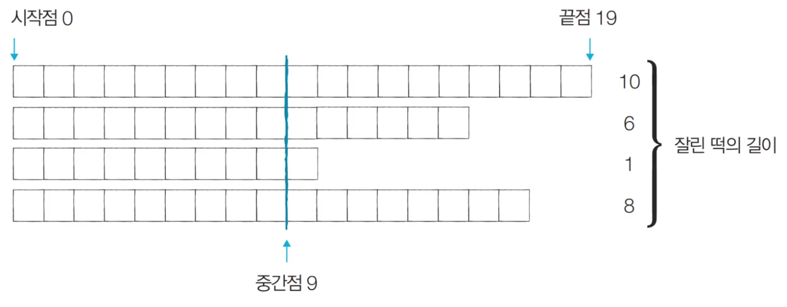
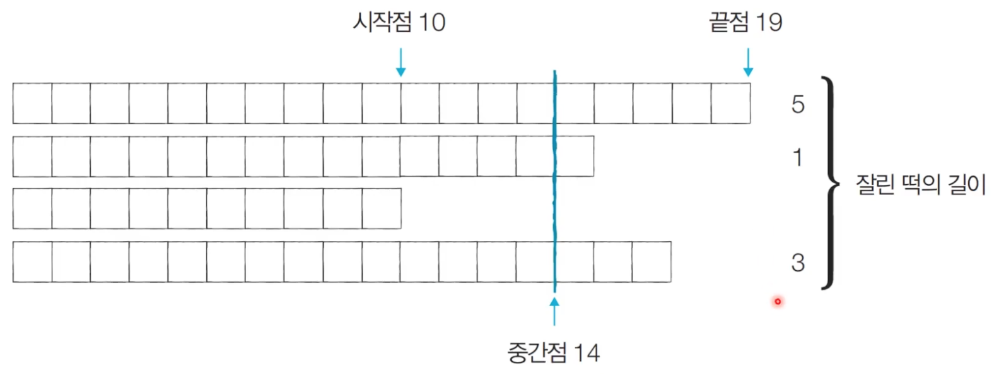
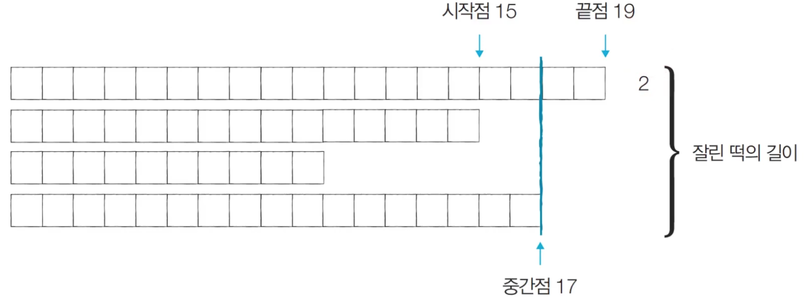
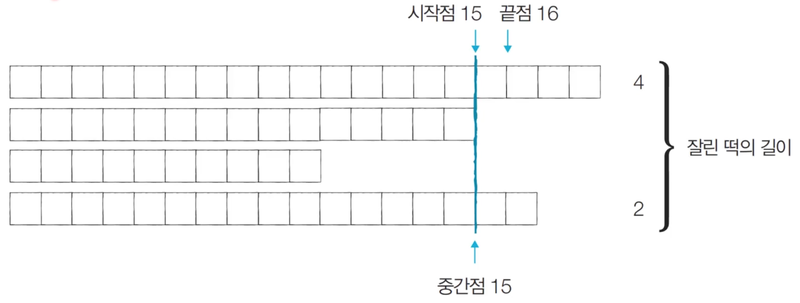

# Introduction

본 포스트는 알고리즘 학습에 대한 정리를 재대로 하기 위하여 남기는 것입니다. 더불어 기본 내용은 나동빈 저의 〖이것이 취업을 위한 코딩 테스트다〗라는 교재 및 유튜브 강의의 내용에서 발췌했고, 그 외 추가적인 궁금 사항들을 검색 및 정리해둔 것입니다.

# 이진 탐색 알고리즘 기초문제 풀이

## 떡볶이 떡 만들기

### 문제 설명

- 오늘 동빈이는 여행 가신 부모님을 대신해서 떡집 일을 하기로 했습니다. 오늘은 떡볶이 떡을 만드는 날입니다. 동빈이네 떡볶이 떢은 재밌게도 떡볶이 떡의 길이가 일정하지 않습니다. 대신 한 봉지 안에 들어가는 떡의 총 길이는 절단기로 잘라서 맞춰줍니다.
- 절단기 높이(H)를 지정하면 줄지어진 떡을 한 번에 절단합니다. 높이가 H보다 긴 떡은 H 위의 부분이 잘릴 것이고, 낮은 떡은 잘리지 않습니다.
- 예를 들어 높이가 19, 14, 10, 17cm 떡이 나란히 있고 절단기 높이를 15cm 로 지정하면 자른 뒤 떡의 높이는 15, 14, 10, 15cm가 될 것입니다. 잘린 떡의 길이는 차례대로 4, 0, 0, 2cm입니다. 손님은 6cm 만큼의 길이를 가져갑니다.
- 손님이 왔을 때 요청한 **총 길이가 M일 때 적어도 M 만큼의 떡을 얻기 위해 절단기에 설정할 수 있는 높이의 최댓값**을 구하는 프로그램을 작성하세요.

### 문제 조건

1. 난이도 : 중
2. 풀이시간 : 40분
3. 시간 제한 : 2초
4. 메모리 제한 : 128MB

- 입력 조건

  - 첫째 줄에 떡의 개수 N과 요청한 떡의 길이 M이 주어집니다. (1 ≤ N ≤ 1,000,000, 1 ≤ M ≤ 2,000,000,000)
  - 둘째 줄에는 떡의 개별 높이가 주어집니다. 떡 높이의 총합은 항상 M 이상이므로, 손님은 필요한 양만큼 떡을 사갈 수 있습니다. 높이는 10억보다 작거나 같은 양의 정수 또는 0 입니다.

- 출력 조건 : 적어도 M 만큼의 떡을 집에 가져가기 위해 절단기에 설정할 수 있는 높이의 최댓값을 출력합니다.
- 입력 / 출력 예시 :
  ```shell
  # 입력 예시
  # 4 6
  # 19 15 10 17
  # 출력 예시
  # 15
  ```

### 문제 해결 아이디어

- 적절한 높이를 찾을 때까지 이진 탐색을 수행하여 높이 H를 반복해서 조정하면 됩니다.
- '현재 이 높이로 자르면 조건을 만족할 수 있는가'를 확인한 뒤에 조건의 만족 여부('예' 혹은 '아니오')에 따라서 탐색 범위를 좁혀서 해결할 수 있습니다.
- 절단기의 높이는 0부터 10억까지 정수 중 하나입니다. ⬅︎ 이렇게 큰 범위를 보면 가장 먼저 **이진 탐색**을 떠올려야 합니다. 선형 탐색을 하면 시간 초과 판정을 받을 수 있습니다.
- 문제에서 제시된 예시를 통해 그림으로 이해해 봅시다.

- step 1 : 시작점 0, 끝점 19, 중간점 9 -> 이때 필요한 떡 크기 M = 6 이므로 결과 저장합니다.
- 그러나 이때, 제공되는 기준이 되는 M이 6이고, 해당 방식으로 자를 시 M = 25 이므로 기준인 6보다 상당히 크다. 따라서 잘라야 하는 길이를 더 늘릴 수 있다. (중간 지점 기준 오른쪽으로 조건 만족 여부 확인, )



- step 2 : 시작점, 10, 끝점 19, 중간점 14 -> 이때 필요한 떡 크기 기준, M' = 9 이므로 다시 오른쪽 중간값으로 변합니다. 단, 조건을 만족하므로 해당 중간값은 저장해둡니다.



- step 3 : 시작점 15, 끝점 19, 중간점 17 -> 이때 필요한 M = 6인 떡의 크기를 달성하지 못하므로 결과를 저장하지 않습니다. -> 앞으로 가지 않고, 뒤쪽으로 후퇴합니다.



- step 4 : 시작점 15, 끝점 16, 중간점 15 -> 이때 필요한 떡의 크기 6, 결과 6이므로 저장하고 마무리 합니다. 이진 탐색 시 더 이상 진행이 불가능한 순간까지 오면 마무리 하는 로직이 핵심이라고 보시면 됩니다.



- 중간점의 값은 시간이 지날수록 '최적화된 값'이 되기 때문에, 과정을 반복하면서 얻을 수 있는 떡의 길이 합의 필요한 떡 길이보다 크거나 같을 때마다 중간점을 기록하면 됩니다.

### 답안 예시(Python)

```python
# 떡의 개수 N과 요창한 떡의 길이 M을 입력 받기
n, m = list(map(int, input().split(' ')))
# 각 떡의 개별 높이 정보 입력
array = list(map(int, input().split()))

start = 0
end = max(array) # 이진 탐색 끝점 max 함수 사용

# 이진 탐색 수행(반복)
result = 0
while (start <= end):
	total = 0
	mid = (start + end) // 2
	# 해당 반복문을 통해 정한 자르는 값(mid)와 그로인해 잘리게 될 떡의 남는 길이 양을 점검합니다.
	for x in array :
		if x > mid:
			total += x - mid
	# 떡 양이 부족한 경우, 왼쪽 탐색이 필요
	if total < m:
		end = mid - 1
	# 떡 양이 충분하거나 많은 경우, 결과에 해당 길이를 넣고(result), 우측 탐색을 진행합니다.
	else :
		result = mid
		start = mid + 1
print (result)
```

### 답안 예시(C++)

```cpp
#include <bits/stdc++.h>

using namespace std;

int n, m;
vector<int> arr;

int main(void)
{
	cin >> n >> m;
	for (int i = 0; i < n; i++)
	{
		int x;
		cin >> x;
		arr.push_back(x);
	}
	int start = 0;
	int end = 1e9; // 일부러 가장 큰 값으로 설정합니다.
	// 이렇게 해도 이진탐색 과정에서 적절한 값을 찾을 수 있기 때문입니다.
	// 아마도 자체적으로 최대 값을 구하는 메서드가 없다는 점에서
	// 저자는 추가 구현을 하느니 이게 낫다고 판단한 것으로 보입니다.
	while (start <= end)
	{
		long long int total = 0; // 들어오는 값을 고려하여 가장 큰 자료형을 사용
		int mid = (start + end) / 2
		for (int i = 0; i < n; i++)
		{
			if (arr[i] > mid)
				total += arr[i] - mid;
		}
		if (total < m)
			end = mid - 1;
		else
		{
			result = mid;
			start = mid + 1;
		}
	}
	cout << result << '\n'
}
```

### 해당 문제 정리 후 느낀 점

- 해당 문제의 핵심인 이진탐색을 적용하는 부분에서 상당히 어려움을 느꼈습니다.
- 더불어 이진 탐색 시 왼쪽과 오른쪽으로 어떻게 구분지을지에 대한 조건 고민이 필요해 보입니다.

## 정렬된 배열에서 특정 수의 개수 구하기

### 문제 설명

- N개의 원소를 포함하고 있는 수열이 **오름차순**으로 정렬되어 있습니다. 이때 이 수열에서 x가 등장하는 횟수를 계산하세요. 예를 들어 수열 {1, 1, 2, 2, 2, 2, 3}이 있을 때 x = 2라면, 현재 수열에서 값이 2인 원소가 4개이므로 4를 출력합니다.
- 단 이 문제는 시간 복잡도 **𝘖(𝑙𝑜𝘨𝑁)**으로 알고리즘을 설계하지 않으면 **시간 초과** 판정을 받습니다.

### 문제 조건

1. 난이도 : 중
2. 풀이 시간 : 30분
3. 시간 제한 : 1초
4. 메모리 제한 : 128MB
5. 기출 : Zoho 인터뷰

- 입력 조건 :

  - 첫째 줄에 𝑁과 𝐱가 정수 형태로 공백으로 구분되어 입력됩니다. (1 ≤ 𝑁 ≤ 1,000,000), (-10^9 ≤ 𝐱 ≤ 10^9)
  - 둘째 줄에 𝑁개의 원소가 정수 형태로 공백으로 구분되어 입력됩니다.

- 출력 조건 : 수열의 원소 중에서 값이 x인 원소의 개수를 출력합니다. 단, 값이 x인 원소가 하나도 없으며면 -1을 출력 합니다.

- 입력 / 출력 예시

```shell
# 입력 예시
# 7 2
# 1 1 2 2 2 2 3
# 출력 예시
# 4
```

### 문제 해결 아이디어

- 시간 복잡도 𝘖(𝑙𝑜𝘨𝑁)으로 동작하는 알고리즘을 요구하고 있습니다. ➡︎ 선형 탐색(Linear Search)로는 시간 초과 판정을 받습니다.
- 하지만 데이터가 정렬되어 있으므로 이진탐색을 수행할 수 잇습니다.
- 특정한 값이 등장하는 첫 번째 위치와 마지막 위치를 찾아 위치 차이를 계산해 문제를 해결할 수 있습니다. (이진 탐색을 두 번 사용한다.)
- 이진탐색 구현 혹은 표준 라이브러리 구현으로 해결을 할 수 있습니다.

### 문제 개요(Python)

```python
from bisect import bisect_left, bisect_right

# 값이 [left_value, right_value]인 데이터의 개수를 반환하는 함수
def count_by_range(array, left_value, right_value):
	right_index = bisect_right(array, right_value)
	left_index = bisect_left(array, left_value)
	return right_index - left_index

n, x = map(int, input().slpit())
array = list(map(int, input().split()))

count = count_by_range(array, x, x)

if (count == 0):
	print(-1)
# 존재하지 않는 경우 처리
else :
	print(count)
```

### 문재 개요(C++)

```cpp
#include <bits/stdc++.h>

using namespace std;

int countByRange(vector<int> &v, int leftValue, int rightValue)
{
	vector<int>::iterator rightIndex = upper_bound(v.begin(), v.end(), rightValue);
	vector<int>::iterator leftIndex = lower_bound(v.begin(), v.end(), leftValue);
	return rightIndex - leftIndex;
}

int n, x;
vector<int> v;

int main()
{
	cin>> n >> x;

	for (int i = 0; i < n; i++)
	{
		int temp;
		cin >> temp;
		v.push_back(temp);
	}
	int ret;
	ret = countByRange(&v, x, x);
	if (ret == 0)
		cout << -1 << '\n';;
	else
		cout << ret << '\n';
}
```

### 해당 문제 정리 후 느낀 점

- 이진탐색을 활용하긴 하지만, 더욱 구현 문제에 가깝게 느껴지는 방식입니다.
- 쉽게 가는 방법을 본 강의에선 설명해주었으나, 실제로 직접 이진탐색을 개조하여 구현하는 연습이 필요해 보입니다.

[🧑🏻‍💻 알고리즘 박살내기 시리즈🧑🏻‍💻](https://paul2021-r.github.io/algorithm/20220411_00/)

```toc

```
