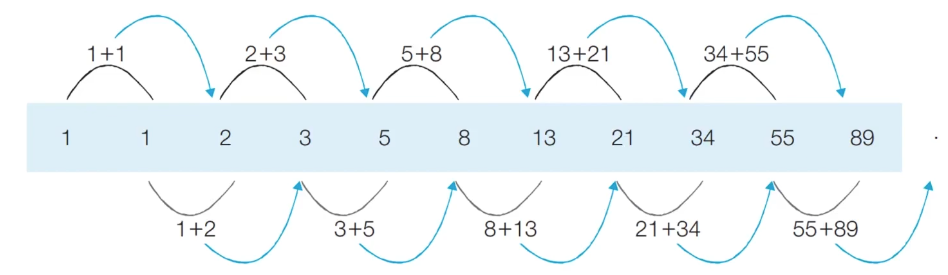
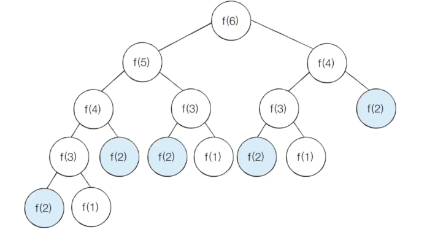
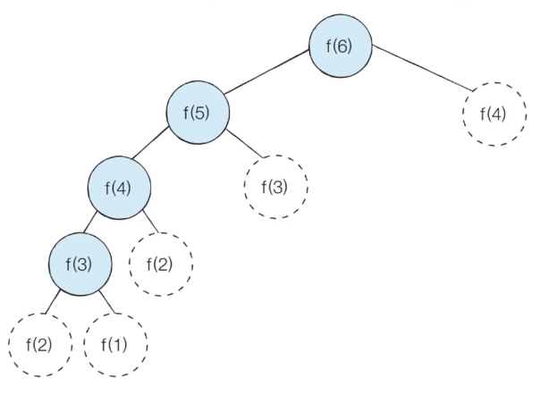
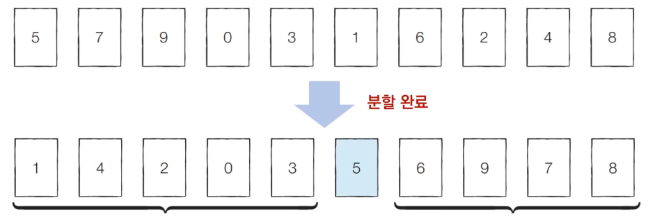

# Introduction

본 포스트는 알고리즘 학습에 대한 정리를 재대로 하기 위하여 남기는 것입니다. 더불어 기본 내용은 나동빈 저의 〖이것이 취업을 위한 코딩 테스트다〗라는 교재 및 유튜브 강의의 내용에서 발췌했고, 그 외 추가적인 궁금 사항들을 검색 및 정리해둔 것입니다.

# 다이나믹 프로그래밍

## 개념

- 다이나믹 프로그래밍이란 **메모리를 적절히 사용하여 수행시간 효율성을 비약적으로 향상시키는 방법**입니다.
- 이미 계산된 결과(작은문제)는 별도의 메모리 영역에 저장하고, **다시 계산하지 않도록** 합니다.
- 다이나믹 프로그래밍 구현은 일반적으로 `탑다운(하향식)`, `보텀업(상향식)`의 두 가지 방식으로 구성됩니다.
- 다이나믹 프로그래밍은 **동적 계획법**이라고도 부릅니다.
  > 일반적으로 동적(Dynamic)이란 단어의 프로그래밍 분야에서의 의미는?<br>
  > 자료구조에서 동적 할당(Dynamic Allocation)이란 '프로그램 실행 도중에 실행에 필요한 메모리를 할당하는' 기법을 의미합니다.<br>
  > 이에 비해 다이나믹 프로그래밍에서 '다이나믹'은 **별다른 의미 없이 사용된 단어**입니다(...)<br>
  > 놀랍게도 이에 대해선 다이나믹 프로그래밍에 대해 작성한 벨만은 진짜로 '멋있어 보이는' 동시에 '펀딩 받기 좋은 단어'를 고르다보니 이런 단어를 선택했다고 합니다.<br>
  > 오히려 이런 특성 탓에 국내 이광근 교수의 저서 '컴퓨터 과학이 여는 세계'에서는 `기억하며 풀기` 로 번역 하였고, 이게 더 적절해 보입니다.

## 다이나믹 프로그래밍의 조건

- 다이나믹 프로그래밍은 문제가 아래의 조건을 만족하면 사용할 수 있습니다.
  1.  최적 부분 조건(Optimal Substructure) : 큰 문제를 작은 문제로 나눌 수 있고, 작은 문제의 답을 모아 큰 문제 해결이 가능할 때
  2.  중복되는 부분 문제(Overlapping Subproblem) : 동일한 작은 문제가 반복적으로 나타날 때

# 피보나치 수열

- 피보나치 수열은, 자기 자신, 자신의 전의 전에 항의 합으로 이루어진 수열입니다. 이는 다이나믹 프로그래밍으로 효과적으로 계산이 가능합니다.

<center><span style="font-size:120%">1, 1, 2, 3, 5, 8, 13, 21, 34, 55, 89, ...</span></center><br>

- 점화식 : 인접한 항들 사이의 관계식을 의미합니다.
- 피보나치 수열의 설명처럼 점화식으로 구성하면 다음과 같습니다.


- 이런 점화식으로 구성되어 있는 피보나치 수열의 계산은 아래와 같은 이미지 형태로 나타날 수 있습니다.
- 프로그래밍 과정에선 이런 수열을 배열이나 리스트를 이용하여 표현합니다.



- 문제는 이러한 구조다 보니, 재귀로 만들게 될 경우 이에 대한 굉장한 퍼포먼스 저하(정확히는 연산량의 증대)로 이어집니다.

## 피보나치 수열 : 단순 재귀 소스코드

```python
# Python
def fibo(x):
	if x = 1 or x == 2:
		return 1
	return fibo(x - 1) + fibo(x - 2)

print(fibo(4))
```

```cpp
// C++
#include <bits/stdc++.h>

using namespace std;

int fibo(int x)
{
	if (x == 1 || x == 2)
		return (1);
	return (fibo(x - 1) + fibo(x - 2));
}

int main(void)
{
	cout << fibo(4) << '\n';
	return (0);
}
```

## 피보나치 수열의 시간 복잡도 분석



- 재귀형 피보나치의 경우 지수시간 복잡도를 갖게 됩니다.
  - 세타 표기법 : 𝜽(1.6128...ᴺ)
  - 빅오 표기법 : 𝑂(2ᴺ)
- 위의 시간 복잡도를 기준으로 생각해 f(30)만 계산해도 약 10억 가량의 연산을 필요로 하게 됩니다. 이는 **확실한 성능 면에서의 한계**를 보여줍니다.

# 피보나치 수열의 효율적인 해법 : 다이나믹 프로그래밍

1. 다이나믹 프로그래밍의 사용조건을 만족하는지 확인해봅시다.
   1. 최적 부분 구조 : 큰 문제를 작은 문제로 나눌 수 있는가? ➡︎ YES
   2. 중복되는 부분 문제 : 동일한 작은 문제를 반복적으로 해결하는가? ➡︎ YES
2. 구현이 가능하다는 것을 알았으니, 두 가지 방식의 문제 접근법을 통한 방식을 배워보도록 하겠습니다.

## 메모이제이션(Memoization)

- 다이나믹 프로그래밍을 구현하는 방법 중 하나로, **한 번 계산한 결과를 메모리 공간에 메모**하는 기법입니다.
- 값을 기록해 놓는다는 점에서 캐싱(Caching)이라고도 합니다.

### 탑다운 vs 보텀업

- 탑다운(메모이제이션) 방식은 **하향식**이라고 하며, 보텀업 방식은 **상향식**이라고 합니다.
- 다이나믹 프로그래밍의 전형적인 형태는 보텀업 방식이며, 결과 저장용 리스트(다른 자료형도 있을수 있습니다.)를 `DP테이블` 이라고 부릅니다.
- 단, 메모이제이션이란 말 자체는 '이전에 계산된 결과를 일시적으로 기록해 놓는다'는 넓은 개념적 설명이므로, 다이나믹 프로그래밍에 국한된 개념은 아닙니다. (메모이제이션 ≠ 다이나믹 프로그래밍 탑다운)

## 피보나치 수열 : 탑다운 소스 코드

```python
# 메모이제이션을 사용하기 위핸 DP테이블
d = [0] * 100
# 피보나치 함수를 재귀로 구현
def fibo(x):
	if x == 1 or x == 2:
		return 1
	if d[x] != 0:
		return d[x]
	d[x] = fibo(x - 1) + fibo(x - 2)
	return d[x]

print(fibo(99))
# 단, 이 방식도 효율적으로 보이진 않습니다.
# 왜냐면 이 방법을 사용시 스택 프레임의 증가를 재귀로 인해 발생시키며
# 차라리 반복문구조로 짜는 방식이 공간 복잡도,
# 시간복잡도 면에서 빠른 결과를 보일 수 있으리라 생각됩니다.
```

## 피보나치 수열 : 보텀업 소스코드

```python
## Python 구현
d = [0] * 100

d[1] = 1
d[2] = 1
n = 99

# 반복문으로 구현(보텀업)
for i in range(3, n + 1):
	d[i] = d[i - 1] + d[i - 2]

print(d[n])

# 실행결과
# 218922995834555169026
```

```cpp
#include <bits/stdc++.h>

using namespace std;

long long d[100];

int main(void)
{
	d[1] = 1;
	d[2] = 1;
	n = 50; // 자료형의 표현 가능 숫자 한계로 n 값을 내렸습니다.

	for (int i = 3; i <= n; i++)
		d[i] = d[i - 1] + d[i - 2];
	cout << d[n] << '\n'
	return (0);
}
```

## 피보나치 수열 메모이제이션 동작 분석


- 위 그림처럼 이미 계산된 결과를 메모리에 저장하면 다음과 같이 색칠된 노드만 처리할 것을 기대할 수 있습니다.
- 이미 처리된 것에 대해선 상수 시간이 걸리는 걸로 끝이 납니다.
- 따라서 실제 스텍프레임 형태로 구현되는 함수는 아래처럼 표현될 수 있습니다.



- 이로 인해 피보나치 수열 함수 시간 복잡도는 𝑂(𝑁)이 됩니다.

# 다이나믹 프로그래밍 vs 분할정복

- 공통점 : 모두 **최적 부분 구조**를 가질 때 사용할 수 있습니다. <br>
  <span style="color:red">➡︎ 큰 문제를 작은 문제로 나눌 수 있으며 작은 문제의 답을 모아서 큰 문제를 해결할 수 있는 상황</span>
- 차이점 : 부분 문제의 중복에서 차이가 발생합니다.
  - <span style="color:red">다이나믹 프로그래밍 문제에서는 각 부분 문제들이 서로 영향을 미치며, 부분 문제가 중복됩니다.</span>
  - 분할 정복 문제에선 동일한 부분 문제가 반복적으로 계산되지 않는 구조를 가집니다.

## 분할정복 - 퀵정렬

- 한 번 기준 원소(피벗값)가 자리를 잡게 되면 기준이 되는 피벗은 바뀌지 않습니다.
- 분할 이후 피벗은 호출되지 않고, 새로운 기준과 새로운 값들에서 적용됩니다.

**<center><span style="font-size:120%">다른 정렬들도 다이나믹 프로그래밍과의 유사한 차이를 통해 구분하여 사용 가능합니다.</span></center>**



## 다이나믹 프로그래밍 문제 접근 방법

- 따라서 문제를 만났을 때 최적의 해결 방법(유형 파악)이 가장 중요합니다.
- 가장 먼저 그리디, 구현, 완전 탐색 등 아이디어로 문제 해결 여부를 검토합니다. 여기서 다른 알고리즘으로 파훼가 불가능하다는 판단이 설 때 다이나믹 프로그래밍을 고려합니다.
- 재귀 함수로 비효율적인 완전 탐색 프로그램을 작성한 뒤(탑다운) 작은 문제에서 구한 답이 큰 문제에서 그대로 사용할 수 있으면 코드를 개선하고, 다이나믹 프로그래밍(메모이제이션) 기법을 활용해 최적화 합니다.
- 일반적인 코딩 테스트 수준에선 기본 유형 수준의 다이나믹 프로그래밍 문제가 출제 되는 경우가 많습니다. <br>
  다이나믹 프로그래밍의 경우 마음만 먹으면 어렵게 할 수 있고, **점화식**만 알면 굉장히 쉬워지는 만큼, 반대로 점화식 탐색 과정이 상당한 시간이 걸리므로 고난도로 나오는 경우가 제한적이라고 볼 수 있습니다.

[🧑🏻‍💻 알고리즘 박살내기 시리즈🧑🏻‍💻](https://paul2021-r.github.io/algorithm/20220411_00/)

```toc

```
