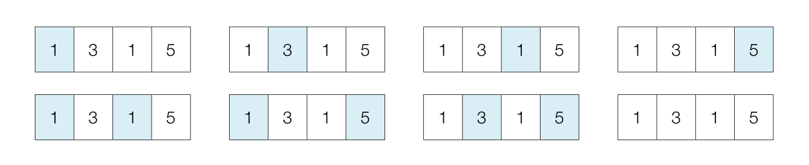
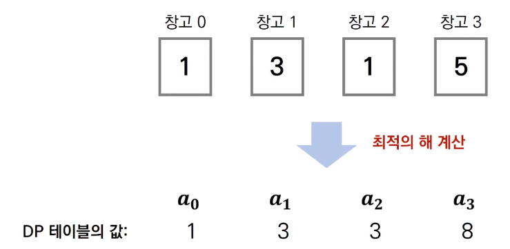
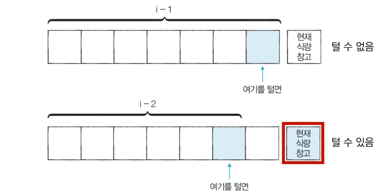

# Introduction

본 포스트는 알고리즘 학습에 대한 정리를 재대로 하기 위하여 남기는 것입니다. 더불어 기본 내용은 나동빈 저의 〖이것이 취업을 위한 코딩 테스트다〗라는 교재 및 유튜브 강의의 내용에서 발췌했고, 그 외 추가적인 궁금 사항들을 검색 및 정리해둔 것입니다.

# 개미 전사

## 문제 설명

- 개미 전사는 부족한 식량 창고를 몰래 공격하려고 합니다. 메뚜기 마을에는 여러 개의 식량창고가 있는데 식량창고는 일직선으로 이어져 있습니다.
- 각 식량창고에는 정해진 수의 식량을 저장하고 있으며, 개미 전사는 식량창고를 선택적으로 약탈하여 식량을 빼앗을 에정입니다. 이때 메뚜기 정찰병들은 일직선상에 존재하는 식량창고 중에서 서로 인접한 식량창고가 공격을 받으면 바로 알아 챌 수 있습니다.
- 따라서 개미 전사가 정찰병에게 들키지 않고 식량을 약탈하기 위해선 최소 한 칸 이상 떨어진 식량창고를 약탈해야 합니다.
- 예시
  | 창고 0 | 창고 1 | 창고 2 | 창고 3 |
  |:-:|:-:|:-:|:-:|
  |1 | 3| 1| 5|
  - 창고 0을 골라서 약탈을 한다면 ▶︎ 창고 1은 약탈 할 수 없습니다.
  - 이때 개미 전사는 두 번째 식량창고와 네 번째 식량창고를 선택했을 때 최댓값인 8개의 식량을 빼앗을 수 있습니다. 개미 전사는 식량창고가 이렇게 일직선상일 때 **최대한 많은 식량**을 얻기를 원합니다.

## 문제 조건

1. 난이도 : 중
2. 풀이 시간 : 30분
3. 시간 제한 : 1초
4. 메모리 제한 128MB

- 입력 조건 :
  1.  첫째 줄에 식량창고의 개수 N이 주어집니다(3 <= N <= 100)
  2.  둘째 줄에 공백을 기준으로 각 식량창고에 저장된 식량의 개수가 주어집니다.(0<= k <= 1000)
- 출력 조건 : 첫째 줄에 개미 전사가 얻을 수 있는 식량의 최댓값을 출력하세요.
- 입출력 예시
  ```shell
  # 입력 예시
  4
  1 3 1 5
  # 출력 예시
  8
  ```

## 문제 해결 아이디어

- 그림으로 도식화하여 따져 보겟습니다. 제공해주는 예시처럼 N이 4이고 차례대로 식량이 있다면 경우의 수는 아래와 같이 나오게 될 것입니다.



- 모든 경우 중 7번째 경우에서 8만큼의 식량을 얻을 수 있고, 최적의 값으로 생각해 볼 수 있습니다.
- 그렇다면 𝒂ᵢ = 𝒊 번째 식량창고까지의 최적의 해(얻을 수 있는 식량의 최댓값) 이렇게 적용한다면 다이나믹 프로그래밍을 적용할 수 있습니다.



- 왼쪽부터 차례대로 식량창고를 턴다고 했을 때, 특정 𝒊번째 식량창고에 대해 털지 안 털지의 여부를 결정하면 아래 2가지 경우 중에서 더 많은 식량을 털 수 있는 경우를 선택하면 됩니다.

_𝒊-3 번째는 고려할 필요가 없습니다. 이미 이전의 경우에서 연산이 들어가기 때문입니다._

- 𝒂ᵢ = 𝒊 번째 식량창고까지의 최적의 해(얻을 수 있는 식량의 최댓값)
- 𝐾ᵢ = 𝒊 번째 식량창고에 있는 식량의 양
- 점화식을 세워보면 다음과 같이 나오게 됩니다.
  <center><span style="font-size:150%">𝒂ᵢ = 𝑚𝑎𝒙(𝒂ᵢ₋₁, 𝒂ᵢ₋₂ + 𝒌ᵢ)</span><center>
- 결국 i 번째 항이 들어갈 수 있는 경우인 aᵢ₋₂ 와, i 번째 항이 들어가지 못하는 바로 직전항의 최대값을 비교함으로써 선택 가능 경우를 제한하는 방식으로 최대값을 구할 수 있습니다.
- 한 칸 이상 떨어진 식량창고는 항상 털 수 있으므로(𝒊 - 3)번째 이하는 고려할 필요가 없습니다.

## 답안 예시(Python)

```python
# N과 식량 정보 입력 받기
n = int(input())
array = list(map(int, input().split()))

# DP 테이블 작성 및 초기화
d = [0] * 100 # 문제 제한 사항에 대해 지정
d[0] = array[0]
d[1] = max(array[0], array[1])

# 점화식을 통한 N번째 항까지의 DP 테이블 작성
for i in range(2, n):
	d[i] = max(d[i - 1], d[i - 2] + array[i])

# 최종 결과 출력
print(d[n - 1])
```

## 답안 예시(C++)

```cpp
#include <bits/stdc++.h>

using namespace std;

int d[100];
int n;
vector<int> arr;

int main(void)
{
	cin >> n;
	for (int i = 0; i < n; i++)
	{
		int x;
		cin >> x;
		arr.push_back(x);
	}

	d[0] = arr[0];
	d[1] = max(arr[0], arr[1]);
	for (int i = 2; i < n; i++)
		d[i] = max(d[i - 1], d[i - 2] + arr[i]);

	cout << d[n - 1] << '\n';

	return (0);
}
```

# 1로 만들기

## 문제 설명

- 정수 X가 주어졌을 때, 정수 X에서 사용할 수 있는 연산은 다음과 같이 4가지 입니다.

  1.  X가 5로 나누어 떨어지면, 5로 나눕니다.
  2.  X가 3으로 나누어 떨어지면, 3으로 나눕니다.
  3.  X가 2로 나누어 떨어지면, 2로 나눕니다.
  4.  X에서 1을 뺍니다.

- 정수 X가 주어졌을 때, 연산 4개를 적절히 사용해 값을 1로 만들거싱며, 이를 위한 최솟값을 출력합니다.

## 문제 조건

1. 난이도 : 중하
2. 풀이시간 : 20분
3. 시간제한 : 1초
4. 메모리 제한 : 128MB

- 입력조건 : 첫째 줄에 정수 X가 주어집니다.(1<= X <= 30000)
- 출력조건 : 첫째 줄에 연산을 하는 횟수의 최솟값을 출력합니다.
- 입출력 예시 :
  ```shell
  # 입력 예시
  26
  # 출력 예시
  3
  ```

## 문제 해결 아이디어

- 피보나치 수열을 도식화한 것처럼 함수 호출 과정을 그림을 그려보면, **최적 부분 구조**와 **중복되는 부분 문제**를 만족합니다.
- 이 문제가 기존의 그리디 문제와 차이가 있는 점이 그리디의 경우 최대한 값을 줄여나가는 방식으로 충분했지만, 이 문제의 경우 잘못 고려하면, 당장은 값을 많이 줄이지만, 오히려 연산 횟수를 증가시키는 결과를 초래하게 됩니다.

- 𝒂ᵢ = 𝒊 를 1로 만들기 위한 최소 연산 횟수
- 점화식을 세워보면 다음과 같이 나오게 됩니다.
  <center><span style="font-size:150%">𝒂ᵢ = 𝑚𝒊𝒏(𝒂ᵢ₋₁, 𝒂ᵢ / 2, 𝒂ᵢ / 3, 𝒂ᵢ / 5) + 1</span><center>
- 단, 1을 빼는 연산을 제외하곤 **해당 수로 나누어 떨어질 때에 한해 점화식을 적용할 수 있습니다.**

## 답안 예시(Python)

```python
# 정수 X를 입력 받기
x = int(input())

# DP 테이블 할당, 이때, 1의 경우 이미 1이기 때문에 0으로 설정합니다.
d = [0] * 30001

for i in range (2, x + 1):
	# 현재 수에서 1을 빼는 경우를 먼저 입력 후
	d[i] = d[i - 1] + 1
	# 각 경우가 가능할 때, 나누어 떨어지는지 여부도 판단하고, 거기서 최솟값을 찾습니다.
	if i % 2 == 0:
		d[i] = min(d[i], d[i // 2] + 1)
	if i % 3 == 0:
		d[i] = min(d[i], d[i // 3] + 1)
	if i % 5 == 0:
		d[i] = min(d[i], d[i // 5] + 1)

print(d[x])
```

## 답안 예시(C++)

```cpp
#include <bits/stdc++.h>

using namespace std;

int d[30001];
int x;

int main(void)
{
	cin >> x;

	for (int i = 2; i <= x; i++)
	{
		d[i] = d[i - 1] + 1;
		if (i % 2 == 0)
			d[i] = min(d[i], d[i / 2] + 1);
		if (i % 3 == 0)
			d[i] = min(d[i], d[i / 3] + 1);
		if (i % 5 == 0)
			d[i] = min(d[i], d[i / 5] + 1);

	}
	cout << d[x] << '\n';
	return (0);
}
```

# 덧

- 다이나믹 프로그래밍 문제의 경우 상당히 난이도가 있음을 알 수 있습니다...
- 분량 관계상 여기까지 하고 2편을 추가로 올리도록 하겠습니다.
- 문제는 1로 만들기 같은 경우 정말 어떻게 풀었는지 이해가 안 간다는 거... python tutor 로 하나 하나 찍어가면서 진행해 봐야겠습니다(...)

[🧑🏻‍💻 알고리즘 박살내기 시리즈🧑🏻‍💻](https://paul2021-r.github.io/algorithm/20220411_00/)

```toc

```
